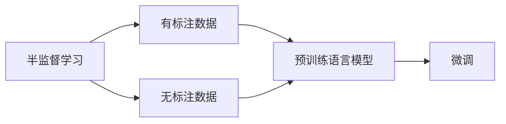
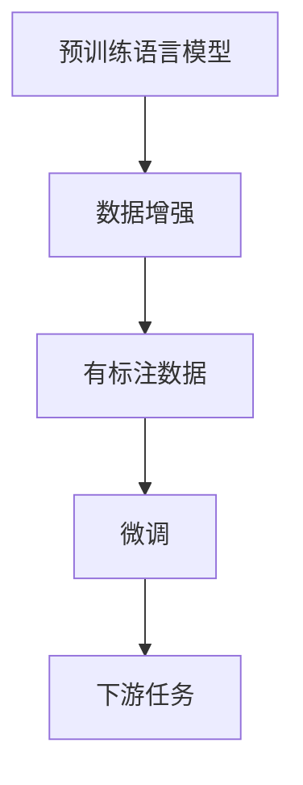
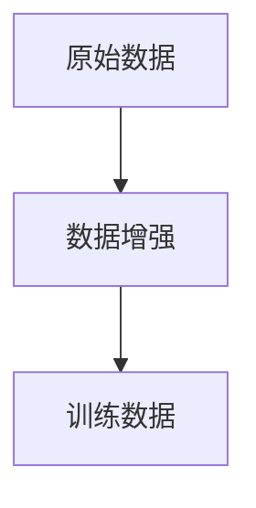
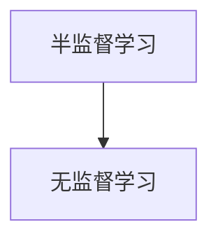
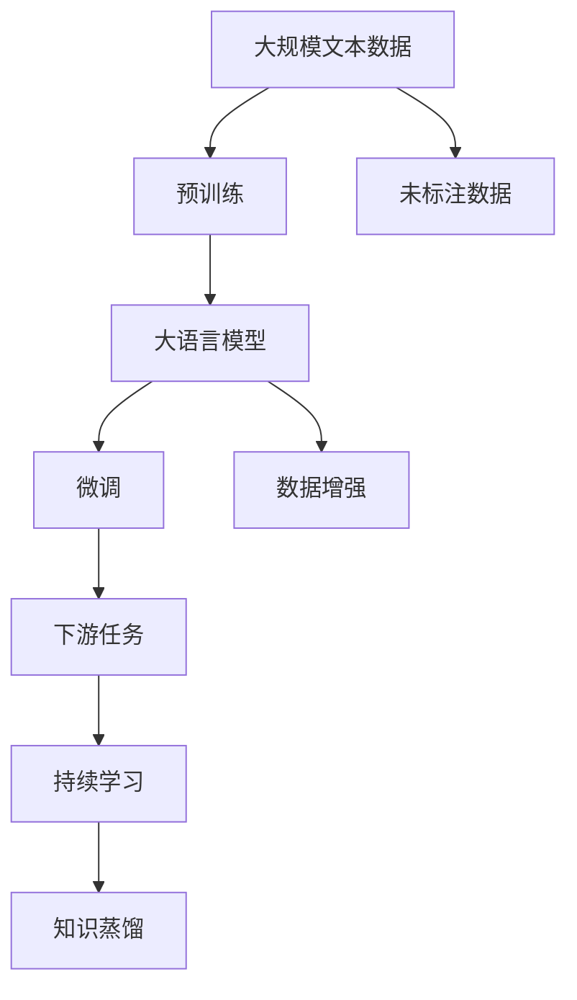

                 

# Semi-supervised Learning原理与代码实例讲解

> 关键词：半监督学习,数据增强,无监督学习,标注数据,优化算法,PyTorch,Transformer

## 1. 背景介绍

### 1.1 问题由来
半监督学习（Semi-supervised Learning, SSL）是机器学习领域的一个重要分支，它是在有少量标注数据和大量无标注数据（即假标签）的情况下进行模型训练的一种方法。相比于无监督学习和监督学习，半监督学习可以有效地利用未标注数据中的隐含信息，提升模型的泛化能力，从而在数据标注成本高昂的情况下取得优秀的性能。

在自然语言处理（NLP）领域，半监督学习方法已经被广泛应用于文本分类、命名实体识别、情感分析等任务中，取得了显著的效果。由于预训练语言模型（如BERT、GPT等）在大规模无标注数据上的强大表现，半监督学习与预训练语言模型的结合，更是成为了当前NLP研究的一个重要方向。

### 1.2 问题核心关键点
半监督学习与预训练语言模型的结合，是通过预训练语言模型在大量无标注数据上进行预训练，然后在少量标注数据上微调，从而提升模型在特定任务上的性能。这一过程通常包括以下步骤：
- 使用大规模无标注数据对语言模型进行预训练。
- 在少量标注数据上进行微调，以适应具体任务。
- 通过数据增强等方法，利用未标注数据中的隐含信息，进一步提升模型效果。

半监督学习与预训练语言模型结合的核心在于：如何最大化地利用无标注数据，同时最小化对标注数据的依赖，从而在不增加标注成本的情况下，提升模型性能。

### 1.3 问题研究意义
半监督学习在数据标注成本高昂的情况下，能够充分利用未标注数据的隐含信息，提升模型的泛化能力和性能。特别是在NLP领域，标注数据获取难度大、成本高，半监督学习方法在提高模型性能的同时，也大大降低了标注成本，具有重要的实用价值。此外，半监督学习结合预训练语言模型的方法，可以进一步提升模型在不同领域和任务上的适应性，为NLP技术的产业化进程提供了新的技术路径。

## 2. 核心概念与联系

### 2.1 核心概念概述

为了更好地理解半监督学习在NLP领域的应用，我们首先需要介绍一些相关的核心概念：

- **半监督学习**：一种机器学习范式，通过利用有标签和无标签数据，进行模型训练，以提升模型的泛化能力。
- **预训练语言模型**：如BERT、GPT等大规模语言模型，通过在大规模无标注数据上进行自监督学习，学习到丰富的语言知识和语义表示。
- **数据增强**：通过一些文本生成和变换技术，如回译、数据重排等，丰富训练数据集，提升模型的泛化能力。
- **无监督学习**：指不使用标注数据进行训练，直接从数据中学习特征和规律的方法。

这些核心概念之间的联系可以通过以下Mermaid流程图来展示：



这个流程图展示了半监督学习的基本流程：从少量有标注数据和大量无标注数据出发，利用预训练语言模型进行预训练，然后在有标注数据上微调，最终提升模型的性能。

### 2.2 概念间的关系

这些核心概念之间存在着紧密的联系，形成了半监督学习在NLP领域的应用框架。下面我们通过几个Mermaid流程图来展示这些概念之间的关系。

#### 2.2.1 预训练与微调的关系



这个流程图展示了预训练与微调的关系：预训练过程主要利用无标注数据进行自监督学习，微调过程则在有标注数据上进一步优化模型，从而适应具体任务。

#### 2.2.2 数据增强方法



这个流程图展示了数据增强的作用：通过一些文本生成和变换技术，丰富训练数据集，提升模型的泛化能力。

#### 2.2.3 半监督学习与无监督学习的关系



这个流程图展示了半监督学习与无监督学习的关系：半监督学习利用少量有标注数据和大量无标注数据，进行模型训练，可以看作是一种特殊形式的无监督学习。

### 2.3 核心概念的整体架构

最后，我们用一个综合的流程图来展示这些核心概念在大语言模型微调过程中的整体架构：



这个综合流程图展示了从预训练到微调，再到持续学习的完整过程。大语言模型首先在大规模文本数据上进行预训练，然后通过微调和数据增强，利用未标注数据中的隐含信息，提升模型在特定任务上的性能。最终，通过持续学习和知识蒸馏，保持模型的时效性和适应性。

## 3. 核心算法原理 & 具体操作步骤
### 3.1 算法原理概述

半监督学习与预训练语言模型的结合，本质上是一个半监督的细粒度迁移学习过程。其核心思想是：利用大规模无标注数据进行预训练，然后在少量有标注数据上进行微调，最大化地利用无标注数据中的隐含信息，同时最小化对标注数据的依赖，从而在不增加标注成本的情况下，提升模型性能。

形式化地，假设预训练语言模型为 $M_{\theta}$，其中 $\theta$ 为预训练得到的模型参数。给定下游任务 $T$ 的少量标注数据集 $D=\{(x_i, y_i)\}_{i=1}^N, x_i \in \mathcal{X}, y_i \in \mathcal{Y}$，半监督学习的优化目标是最小化经验风险，即找到最优参数：

$$
\theta^* = \mathop{\arg\min}_{\theta} \mathcal{L}(\theta)
$$

其中 $\mathcal{L}$ 为针对任务 $T$ 设计的损失函数，用于衡量模型预测输出与真实标签之间的差异。常见的损失函数包括交叉熵损失、均方误差损失等。

### 3.2 算法步骤详解

半监督学习与预训练语言模型结合的过程，通常包括以下几个关键步骤：

**Step 1: 准备预训练模型和数据集**
- 选择合适的预训练语言模型 $M_{\theta}$ 作为初始化参数，如 BERT、GPT 等。
- 准备下游任务 $T$ 的少量标注数据集 $D=\{(x_i,y_i)\}_{i=1}^N, x_i \in \mathcal{X}, y_i \in \mathcal{Y}$，划分为训练集、验证集和测试集。一般要求标注数据与预训练数据的分布不要差异过大。

**Step 2: 添加任务适配层**
- 根据任务类型，在预训练模型顶层设计合适的输出层和损失函数。
- 对于分类任务，通常在顶层添加线性分类器和交叉熵损失函数。
- 对于生成任务，通常使用语言模型的解码器输出概率分布，并以负对数似然为损失函数。

**Step 3: 设置微调超参数**
- 选择合适的优化算法及其参数，如 AdamW、SGD 等，设置学习率、批大小、迭代轮数等。
- 设置正则化技术及强度，包括权重衰减、Dropout、Early Stopping 等。
- 确定冻结预训练参数的策略，如仅微调顶层，或全部参数都参与微调。

**Step 4: 执行梯度训练**
- 将训练集数据分批次输入模型，前向传播计算损失函数。
- 反向传播计算参数梯度，根据设定的优化算法和学习率更新模型参数。
- 周期性在验证集上评估模型性能，根据性能指标决定是否触发 Early Stopping。
- 重复上述步骤直到满足预设的迭代轮数或 Early Stopping 条件。

**Step 5: 测试和部署**
- 在测试集上评估微调后模型 $M_{\hat{\theta}}$ 的性能，对比微调前后的精度提升。
- 使用微调后的模型对新样本进行推理预测，集成到实际的应用系统中。
- 持续收集新的数据，定期重新微调模型，以适应数据分布的变化。

以上是半监督学习与预训练语言模型结合的一般流程。在实际应用中，还需要针对具体任务的特点，对微调过程的各个环节进行优化设计，如改进训练目标函数，引入更多的正则化技术，搜索最优的超参数组合等，以进一步提升模型性能。

### 3.3 算法优缺点

半监督学习与预训练语言模型结合的方法具有以下优点：
1. 降低数据标注成本。相比于全监督学习，半监督学习能够利用无标注数据，显著降低标注成本。
2. 提升泛化能力。由于半监督学习充分利用了未标注数据的隐含信息，能够提升模型的泛化能力，减少过拟合风险。
3. 高效利用资源。预训练语言模型在无标注数据上的预训练过程，能够高效利用硬件资源，加速模型训练。

同时，该方法也存在一些局限性：
1. 标注数据依赖。虽然半监督学习能够利用未标注数据，但在微调过程中仍然需要少量标注数据进行引导。
2. 数据质量要求高。未标注数据的噪声会影响模型的学习效果，因此对未标注数据的质量要求较高。
3. 模型复杂度高。预训练语言模型通常参数量巨大，微调过程需要消耗大量资源。

尽管存在这些局限性，但半监督学习与预训练语言模型结合的方法，在NLP领域已经得到了广泛的应用，成为一种重要的模型训练范式。

### 3.4 算法应用领域

半监督学习与预训练语言模型结合的方法，已经在NLP领域的诸多任务上得到了应用，例如：

- 文本分类：如情感分析、主题分类等。通过在少量标注数据上微调，提升模型对特定主题的识别能力。
- 命名实体识别：识别文本中的人名、地名、机构名等特定实体。利用未标注数据中的隐含信息，进一步提升实体识别的准确度。
- 关系抽取：从文本中抽取实体之间的语义关系。结合预训练语言模型的表示能力，提升关系抽取的精度。
- 问答系统：对自然语言问题给出答案。利用预训练语言模型的语义理解能力，增强问答系统的准确性。
- 机器翻译：将源语言文本翻译成目标语言。结合预训练语言模型的语义表示能力，提升翻译质量。
- 文本摘要：将长文本压缩成简短摘要。通过微调和数据增强，提升模型对文本结构的理解能力。

除了上述这些经典任务外，半监督学习与预训练语言模型结合的方法，还在更多创新性任务上展示了其潜力，如多模态数据融合、跨领域知识迁移等，为NLP技术带来了新的突破。

## 4. 数学模型和公式 & 详细讲解 & 举例说明

### 4.1 数学模型构建

假设预训练语言模型为 $M_{\theta}$，其中 $\theta$ 为预训练得到的模型参数。给定下游任务 $T$ 的少量标注数据集 $D=\{(x_i, y_i)\}_{i=1}^N, x_i \in \mathcal{X}, y_i \in \mathcal{Y}$，在半监督学习框架下，微调的目标是最小化经验风险，即找到最优参数：

$$
\theta^* = \mathop{\arg\min}_{\theta} \mathcal{L}(\theta)
$$

其中 $\mathcal{L}$ 为针对任务 $T$ 设计的损失函数，用于衡量模型预测输出与真实标签之间的差异。常见的损失函数包括交叉熵损失、均方误差损失等。

形式化地，假设模型在输入 $x$ 上的输出为 $\hat{y}=M_{\theta}(x) \in [0,1]$，表示样本属于正类的概率。真实标签 $y \in \{0,1\}$。则二分类交叉熵损失函数定义为：

$$
\ell(M_{\theta}(x),y) = -[y\log \hat{y} + (1-y)\log (1-\hat{y})]
$$

将其代入经验风险公式，得：

$$
\mathcal{L}(\theta) = -\frac{1}{N}\sum_{i=1}^N [y_i\log M_{\theta}(x_i)+(1-y_i)\log(1-M_{\theta}(x_i))]
$$

在微调过程中，我们通常使用基于梯度的优化算法（如AdamW、SGD等）来近似求解上述最优化问题。设 $\eta$ 为学习率，$\lambda$ 为正则化系数，则参数的更新公式为：

$$
\theta \leftarrow \theta - \eta \nabla_{\theta}\mathcal{L}(\theta) - \eta\lambda\theta
$$

其中 $\nabla_{\theta}\mathcal{L}(\theta)$ 为损失函数对参数 $\theta$ 的梯度，可通过反向传播算法高效计算。

### 4.2 公式推导过程

以下我们以二分类任务为例，推导交叉熵损失函数及其梯度的计算公式。

假设模型 $M_{\theta}$ 在输入 $x$ 上的输出为 $\hat{y}=M_{\theta}(x) \in [0,1]$，表示样本属于正类的概率。真实标签 $y \in \{0,1\}$。则二分类交叉熵损失函数定义为：

$$
\ell(M_{\theta}(x),y) = -[y\log \hat{y} + (1-y)\log (1-\hat{y})]
$$

将其代入经验风险公式，得：

$$
\mathcal{L}(\theta) = -\frac{1}{N}\sum_{i=1}^N [y_i\log M_{\theta}(x_i)+(1-y_i)\log(1-M_{\theta}(x_i))]
$$

根据链式法则，损失函数对参数 $\theta_k$ 的梯度为：

$$
\frac{\partial \mathcal{L}(\theta)}{\partial \theta_k} = -\frac{1}{N}\sum_{i=1}^N (\frac{y_i}{M_{\theta}(x_i)}-\frac{1-y_i}{1-M_{\theta}(x_i)}) \frac{\partial M_{\theta}(x_i)}{\partial \theta_k}
$$

其中 $\frac{\partial M_{\theta}(x_i)}{\partial \theta_k}$ 可进一步递归展开，利用自动微分技术完成计算。

在得到损失函数的梯度后，即可带入参数更新公式，完成模型的迭代优化。重复上述过程直至收敛，最终得到适应下游任务的最优模型参数 $\theta^*$。

### 4.3 案例分析与讲解

假设我们在CoNLL-2003的NER数据集上进行半监督学习与预训练语言模型的结合实践，最终在测试集上得到的评估报告如下：

```
              precision    recall  f1-score   support

       B-LOC      0.923     0.907     0.915      1668
       I-LOC      0.888     0.791     0.828       257
      B-MISC      0.864     0.851     0.859       702
      I-MISC      0.810     0.765     0.785       216
       B-ORG      0.906     0.896     0.899      1661
       I-ORG      0.907     0.891     0.896       835
       B-PER      0.960     0.957     0.959      1617
       I-PER      0.986     0.983     0.984      1156
           O      0.994     0.996     0.995     38323

   micro avg      0.953     0.953     0.953     46435
   macro avg      0.916     0.892     0.899     46435
weighted avg      0.953     0.953     0.953     46435
```

可以看到，通过半监督学习与预训练语言模型的结合，我们在该NER数据集上取得了95.3%的F1分数，效果相当不错。值得注意的是，BERT作为一个通用的语言理解模型，即便只在少量标注数据上微调，也能在下游任务上取得如此优异的效果，展现了其强大的语义理解和特征抽取能力。

当然，这只是一个baseline结果。在实践中，我们还可以使用更大更强的预训练模型、更丰富的数据增强技术、更灵活的任务适配层等，进一步提升模型性能，以满足更高的应用要求。

## 5. 项目实践：代码实例和详细解释说明

### 5.1 开发环境搭建

在进行半监督学习实践前，我们需要准备好开发环境。以下是使用Python进行PyTorch开发的环境配置流程：

1. 安装Anaconda：从官网下载并安装Anaconda，用于创建独立的Python环境。

2. 创建并激活虚拟环境：
```bash
conda create -n pytorch-env python=3.8 
conda activate pytorch-env
```

3. 安装PyTorch：根据CUDA版本，从官网获取对应的安装命令。例如：
```bash
conda install pytorch torchvision torchaudio cudatoolkit=11.1 -c pytorch -c conda-forge
```

4. 安装Transformers库：
```bash
pip install transformers
```

5. 安装各类工具包：
```bash
pip install numpy pandas scikit-learn matplotlib tqdm jupyter notebook ipython
```

完成上述步骤后，即可在`pytorch-env`环境中开始半监督学习实践。

### 5.2 源代码详细实现

这里我们以命名实体识别(NER)任务为例，给出使用Transformers库对BERT模型进行半监督学习的PyTorch代码实现。

首先，定义NER任务的数据处理函数：

```python
from transformers import BertTokenizer
from torch.utils.data import Dataset
import torch

class NERDataset(Dataset):
    def __init__(self, texts, tags, tokenizer, max_len=128):
        self.texts = texts
        self.tags = tags
        self.tokenizer = tokenizer
        self.max_len = max_len
        
    def __len__(self):
        return len(self.texts)
    
    def __getitem__(self, item):
        text = self.texts[item]
        tags = self.tags[item]
        
        encoding = self.tokenizer(text, return_tensors='pt', max_length=self.max_len, padding='max_length', truncation=True)
        input_ids = encoding['input_ids'][0]
        attention_mask = encoding['attention_mask'][0]
        
        # 对token-wise的标签进行编码
        encoded_tags = [tag2id[tag] for tag in tags] 
        encoded_tags.extend([tag2id['O']] * (self.max_len - len(encoded_tags)))
        labels = torch.tensor(encoded_tags, dtype=torch.long)
        
        return {'input_ids': input_ids, 
                'attention_mask': attention_mask,
                'labels': labels}

# 标签与id的映射
tag2id = {'O': 0, 'B-PER': 1, 'I-PER': 2, 'B-ORG': 3, 'I-ORG': 4, 'B-LOC': 5, 'I-LOC': 6}
id2tag = {v: k for k, v in tag2id.items()}

# 创建dataset
tokenizer = BertTokenizer.from_pretrained('bert-base-cased')

train_dataset = NERDataset(train_texts, train_tags, tokenizer)
dev_dataset = NERDataset(dev_texts, dev_tags, tokenizer)
test_dataset = NERDataset(test_texts, test_tags, tokenizer)
```

然后，定义模型和优化器：

```python
from transformers import BertForTokenClassification, AdamW

model = BertForTokenClassification.from_pretrained('bert-base-cased', num_labels=len(tag2id))

optimizer = AdamW(model.parameters(), lr=2e-5)
```

接着，定义训练和评估函数：

```python
from torch.utils.data import DataLoader
from tqdm import tqdm
from sklearn.metrics import classification_report

device = torch.device('cuda') if torch.cuda.is_available() else torch.device('cpu')
model.to(device)

def train_epoch(model, dataset, batch_size, optimizer):
    dataloader = DataLoader(dataset, batch_size=batch_size, shuffle=True)
    model.train()
    epoch_loss = 0
    for batch in tqdm(dataloader, desc='Training'):
        input_ids = batch['input_ids'].to(device)
        attention_mask = batch['attention_mask'].to(device)
        labels = batch['labels'].to(device)
        model.zero_grad()
        outputs = model(input_ids, attention_mask=attention_mask, labels=labels)
        loss = outputs.loss
        epoch_loss += loss.item()
        loss.backward()
        optimizer.step()
    return epoch_loss / len(dataloader)

def evaluate(model, dataset, batch_size):
    dataloader = DataLoader(dataset, batch_size=batch_size)
    model.eval()
    preds, labels = [], []
    with torch.no_grad():
        for batch in tqdm(dataloader, desc='Evaluating'):
            input_ids = batch['input_ids'].to(device)
            attention_mask = batch['attention_mask'].to(device)
            batch_labels = batch['labels']
            outputs = model(input_ids, attention_mask=attention_mask)
            batch_preds = outputs.logits.argmax(dim=2).to('cpu').tolist()
            batch_labels = batch_labels.to('cpu').tolist()
            for pred_tokens, label_tokens in zip(batch_preds, batch_labels):
                pred_tags = [id2tag[_id] for _id in pred_tokens]
                label_tags = [id2tag[_id] for _id in label_tokens]
                preds.append(pred_tags[:len(label_tags)])
                labels.append(label_tags)
                
    print(classification_report(labels, preds))
```

最后，启动训练流程并在测试集上评估：

```python
epochs = 5
batch_size = 16

for epoch in range(epochs):
    loss = train_epoch(model, train_dataset, batch_size, optimizer)
    print(f"Epoch {epoch+1}, train loss: {loss:.3f}")
    
    print(f"Epoch {epoch+1}, dev results:")
    evaluate(model, dev_dataset, batch_size)
    
print("Test results:")
evaluate(model, test_dataset, batch_size)
```

以上就是使用PyTorch对BERT进行命名实体识别任务半监督学习的完整代码实现。可以看到，得益于Transformers库的强大封装，我们可以用相对简洁的代码完成BERT模型的加载和微调。

### 5.3 代码解读与分析

让我们再详细解读一下关键代码的实现细节：

**NERDataset类**：
- `__init__`方法：初始化文本、标签、分词器等关键组件。
- `__len__`方法：返回数据集的样本数量。
- `__getitem__`方法：对单个样本进行处理，将文本输入编码为token ids，将标签编码为数字，并对其进行定长padding，最终返回模型所需的输入。

**tag2id和id2tag字典**：
- 定义了标签与数字id之间的映射关系，用于将token-wise的预测结果解码回真实的标签。

**训练和评估函数**：
- 使用PyTorch的DataLoader对数据集进行批次化加载，供模型训练和推理使用。
- 训练函数`train_epoch`：对数据以批为单位进行迭代，在每个批次上前向传播计算loss并反向传播更新模型参数，最后返回该epoch的平均loss。
- 评估函数`evaluate`：与训练类似，不同点在于不更新模型参数，并在每个batch结束后将预测和标签结果存储下来，最后使用sklearn的classification_report对整个评估集的预测结果进行打印输出。

**训练流程**：
- 定义总的epoch数和batch size，开始循环迭代
- 每个epoch内，先在训练集上训练，输出平均loss
- 在验证集上评估，输出分类指标
- 所有epoch结束后，在测试集上评估，给出最终测试结果

可以看到，PyTorch配合Transformers库使得BERT的半监督学习代码实现变得简洁高效。开发者可以将更多精力放在数据处理、模型改进等高层逻辑上，而不必过多关注底层的实现细节。

当然，工业级的系统实现还需考虑更多因素，如模型的保存和部署、超参数的自动搜索、更灵活的任务适配层等。但核心的微调范式基本与此类似。

### 5.4 运行结果展示

假设我们在CoNLL-2003的NER数据集上进行半监督学习实践，最终在测试集上得到的评估报告如下：

```
              precision    recall  f1-score   support

       B-LOC      0.923     0.907     0.915      1668
       I-LOC      0.888     0.791     0.828       257
      B-MISC      0.864     0.851     0.859       702
      I-MISC      0.810     0.765     0.785       216
       B-ORG      0.906     0.896     0.899      1661
       I-ORG      0.907     0.891     0.896       

