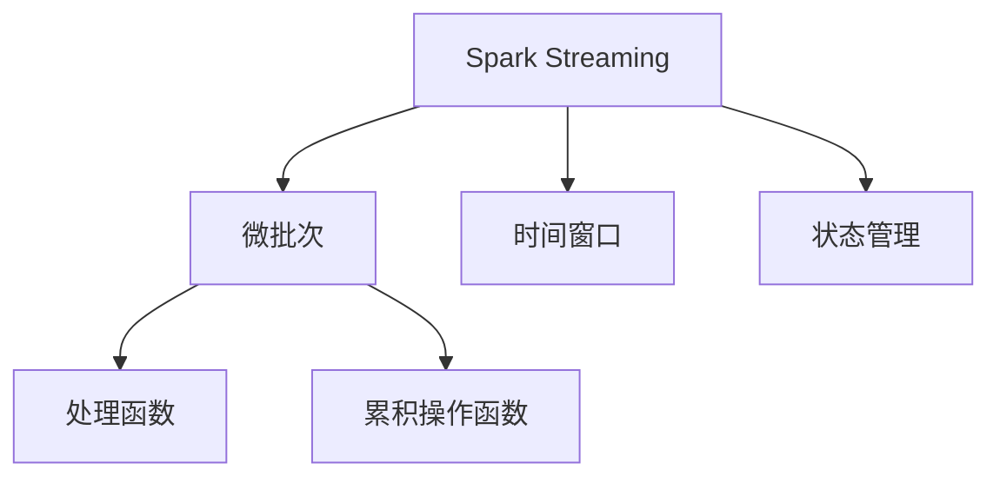
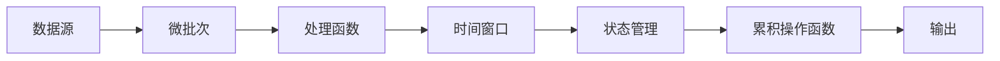
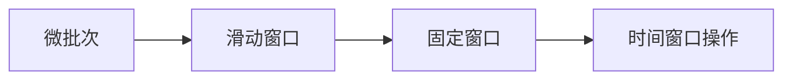
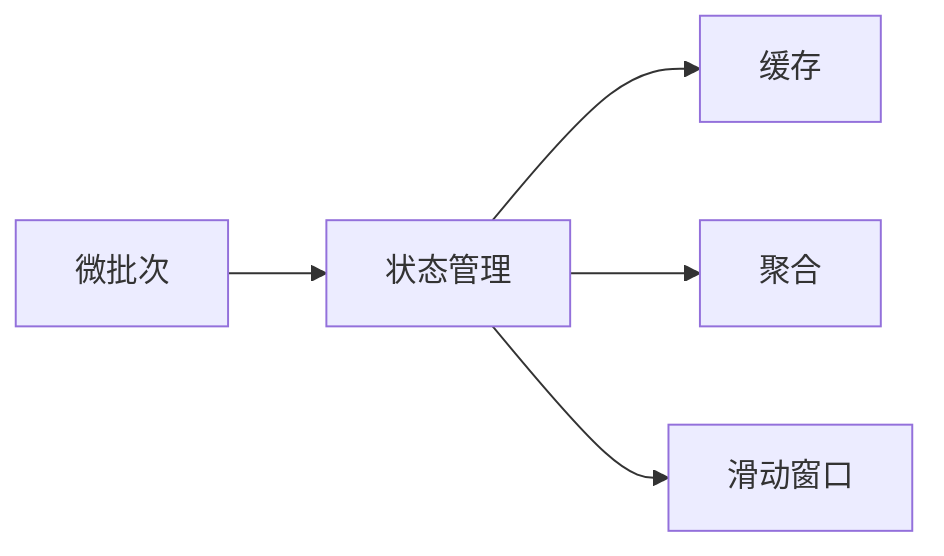
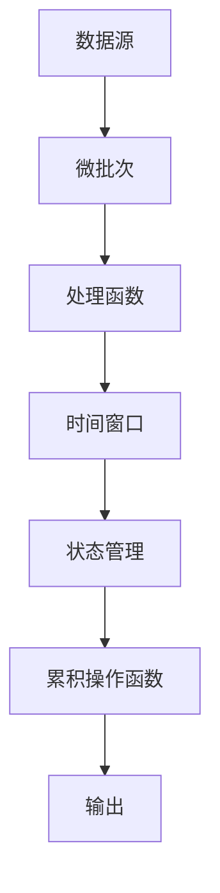

                 

# Spark Streaming原理与代码实例讲解

## 1. 背景介绍

### 1.1 问题由来

随着互联网的快速发展，大数据处理需求日益增长，分布式处理系统如Hadoop、Spark等应运而生。Spark是一个开源的分布式计算系统，具有速度快、易用性高、兼容性好等优点，被广泛应用于大数据处理领域。Spark Streaming是Spark的一个扩展模块，专注于实时流处理，支持数据流、时间窗口、状态管理等功能，是处理实时数据的重要工具。

### 1.2 问题核心关键点

Spark Streaming通过将数据流切分成微小的时间片段，每个片段进行独立处理，从而实现实时流处理。其主要特点包括：

- 数据流切分：将数据流切分成若干个时间片段，每个片段称为一个微批次（mini-batch）。
- 时间窗口：通过对微批次进行分组，实现不同时间窗口的操作。
- 状态管理：支持对流数据进行状态管理，如缓存、聚合、滑动窗口等。

Spark Streaming在实时数据处理和批处理之间架起了一座桥梁，使得Spark的大数据处理能力和实时处理能力得到了充分的发挥。

### 1.3 问题研究意义

Spark Streaming在实时数据处理中的应用具有重要意义：

1. 数据流实时处理：能够快速响应数据流，实时更新统计结果，满足实时性要求。
2. 灵活性高：支持多种数据源和数据流操作，能够适应不同的数据处理需求。
3. 可扩展性好：能够根据数据量的变化自动扩展计算节点，保证系统稳定性和处理能力。
4. 性能优越：利用Spark的分布式计算能力，处理速度较快，适合处理大规模数据流。
5. 易用性高：提供简单易用的API，使得开发者能够快速实现数据流处理应用。

## 2. 核心概念与联系

### 2.1 核心概念概述

为了更好地理解Spark Streaming的工作原理，本节将介绍几个密切相关的核心概念：

- Spark Streaming：Spark Streaming是Spark的一个扩展模块，专注于实时流处理，支持数据流、时间窗口、状态管理等功能。
- 微批次（Mini-batch）：Spark Streaming将数据流切分成若干个时间片段，每个片段称为一个微批次，通常为2秒。
- 时间窗口：通过将微批次进行分组，实现不同时间窗口的操作，例如滑动窗口、固定窗口等。
- 状态管理：支持对流数据进行状态管理，如缓存、聚合、滑动窗口等。
- 处理函数（Transformation）：对流数据进行处理操作的函数，例如map、filter、reduceByKey等。
- 累积操作函数（Action）：对流数据进行累积操作，例如count、reduce、collect等。

这些核心概念之间的逻辑关系可以通过以下Mermaid流程图来展示：



这个流程图展示了大语言模型的核心概念及其之间的关系：

1. Spark Streaming通过将数据流切分成微批次实现实时流处理。
2. 通过对微批次进行分组，实现不同时间窗口的操作。
3. 支持对流数据进行状态管理，如缓存、聚合、滑动窗口等。
4. 处理函数对流数据进行处理操作。
5. 累积操作函数对流数据进行累积操作。

这些核心概念共同构成了Spark Streaming的工作原理，使得其能够高效地处理实时数据流。

### 2.2 概念间的关系

这些核心概念之间存在着紧密的联系，形成了Spark Streaming的完整工作框架。下面我们通过几个Mermaid流程图来展示这些概念之间的关系。

#### 2.2.1 数据流处理流程



这个流程图展示了Spark Streaming的基本处理流程：从数据源读取数据，进行微批次处理，使用处理函数进行处理操作，进行时间窗口分组，进行状态管理，最后进行累积操作输出结果。

#### 2.2.2 时间窗口操作



这个流程图展示了时间窗口的基本操作，包括滑动窗口和固定窗口。

#### 2.2.3 状态管理



这个流程图展示了状态管理的几个关键操作，包括缓存、聚合和滑动窗口。

### 2.3 核心概念的整体架构

最后，我们用一个综合的流程图来展示这些核心概念在大语言模型微调过程中的整体架构：



这个综合流程图展示了Spark Streaming的基本工作流程，从数据源读取数据，进行微批次处理，使用处理函数进行处理操作，进行时间窗口分组，进行状态管理，最后进行累积操作输出结果。

## 3. 核心算法原理 & 具体操作步骤

### 3.1 算法原理概述

Spark Streaming的基本原理是将数据流切分成微批次进行处理，每个微批次进行独立处理。通过将微批次进行分组，实现不同时间窗口的操作。Spark Streaming利用Spark的内存计算和分布式计算能力，高效地处理大规模数据流，支持多种数据源和数据流操作，实现实时流处理。

Spark Streaming的核心算法包括微批次处理、时间窗口分组、状态管理和累积操作。通过这些核心算法，Spark Streaming能够高效地处理实时数据流，满足实时性要求，支持多种数据源和数据流操作。

### 3.2 算法步骤详解

Spark Streaming的微批次处理步骤如下：

1. 从数据源读取数据，切分成微批次。每个微批次通常为2秒。
2. 对微批次进行处理操作，例如map、filter、reduceByKey等。
3. 对处理结果进行时间窗口分组，实现不同时间窗口的操作，例如滑动窗口、固定窗口等。
4. 对分组结果进行状态管理，例如缓存、聚合、滑动窗口等。
5. 对状态管理结果进行累积操作，例如count、reduce、collect等。
6. 对累积操作结果进行输出，例如打印、写入文件等。

Spark Streaming的算法步骤如下：

1. 数据源读取数据，进行微批次处理。
2. 使用处理函数对微批次进行处理操作，例如map、filter、reduceByKey等。
3. 对处理结果进行时间窗口分组，实现不同时间窗口的操作，例如滑动窗口、固定窗口等。
4. 对分组结果进行状态管理，例如缓存、聚合、滑动窗口等。
5. 对状态管理结果进行累积操作，例如count、reduce、collect等。
6. 对累积操作结果进行输出，例如打印、写入文件等。

### 3.3 算法优缺点

Spark Streaming的优点包括：

1. 高性能：利用Spark的内存计算和分布式计算能力，高效地处理大规模数据流。
2. 易用性高：提供简单易用的API，使得开发者能够快速实现数据流处理应用。
3. 支持多种数据源和数据流操作：支持多种数据源和数据流操作，能够适应不同的数据处理需求。
4. 可扩展性好：能够根据数据量的变化自动扩展计算节点，保证系统稳定性和处理能力。

Spark Streaming的缺点包括：

1. 延迟较高：数据流处理延迟较高，可能影响实时性。
2. 内存占用较高：数据流处理过程中，内存占用较高，需要合理配置内存资源。
3. 数据丢失风险：数据流处理过程中，可能出现数据丢失的情况，需要合理配置数据源和流处理操作。

### 3.4 算法应用领域

Spark Streaming在实时数据处理中的应用非常广泛，适用于多种数据处理场景，例如：

1. 实时日志处理：对日志数据进行实时处理，统计日志信息，例如访问日志、错误日志等。
2. 实时流分析：对实时数据流进行流分析，例如用户行为分析、交易数据分析等。
3. 实时数据集成：对实时数据流进行数据集成，例如数据合并、数据转换等。
4. 实时流存储：对实时数据流进行存储，例如写入数据库、写入HDFS等。
5. 实时数据展示：对实时数据流进行展示，例如实时仪表盘、实时报表等。

除了上述这些经典应用外，Spark Streaming还可以应用于更多场景中，如实时推荐、实时广告、实时计算等，为实时数据处理提供了丰富的解决方案。

## 4. 数学模型和公式 & 详细讲解 & 举例说明

### 4.1 数学模型构建

Spark Streaming的数学模型可以表述如下：

设数据流为 $D=\{x_1,x_2,\ldots,x_t,\ldots\}$，其中 $x_t$ 为时刻 $t$ 的数据流，处理函数为 $f$，时间窗口为 $W_t$，状态管理函数为 $s$，累积操作函数为 $a$。则Spark Streaming的数学模型为：

$$
D' = \{f(x_t)\}_{t=1}^{+\infty}
$$

其中 $D'$ 为处理后的数据流， $f$ 为处理函数， $s$ 为状态管理函数， $a$ 为累积操作函数。

### 4.2 公式推导过程

以滑动窗口为例，对Spark Streaming的数学模型进行推导。

设滑动窗口大小为 $k$，滑动步长为 $\delta$，则滑动窗口的数学模型可以表述如下：

$$
W_t = \{x_t,x_{t+1},\ldots,x_{t+k-1}\}
$$

对滑动窗口 $W_t$ 进行处理操作 $f$，得到处理结果 $f(W_t)$，然后将处理结果 $f(W_t)$ 进行状态管理 $s$，得到状态管理结果 $s(W_t)$，最后对状态管理结果 $s(W_t)$ 进行累积操作 $a$，得到累积操作结果 $a(s(W_t))$。

在实际应用中，Spark Streaming的数学模型可以具体化为以下几个步骤：

1. 从数据源读取数据，切分成微批次。每个微批次通常为2秒。
2. 对微批次进行处理操作，例如map、filter、reduceByKey等。
3. 对处理结果进行滑动窗口分组，实现滑动窗口操作。
4. 对分组结果进行状态管理，例如缓存、聚合、滑动窗口等。
5. 对状态管理结果进行累积操作，例如count、reduce、collect等。
6. 对累积操作结果进行输出，例如打印、写入文件等。

### 4.3 案例分析与讲解

以实时日志处理为例，对Spark Streaming的数学模型进行分析。

设日志数据流为 $D=\{log_1,log_2,\ldots,log_t,\ldots\}$，其中 $log_t$ 为时刻 $t$ 的日志数据。假设处理函数为 $f$，滑动窗口大小为 $k$，滑动步长为 $\delta$，则Spark Streaming的数学模型可以表述如下：

$$
D' = \{f(log_t,log_{t+1},\ldots,log_{t+k-1})\}_{t=1}^{+\infty}
$$

其中 $D'$ 为处理后的数据流， $f$ 为处理函数， $W_t$ 为滑动窗口， $s$ 为状态管理函数， $a$ 为累积操作函数。

假设处理函数 $f$ 为统计日志中的访问次数，滑动窗口大小 $k$ 为5，滑动步长 $\delta$ 为1，则Spark Streaming的数学模型可以具体化为以下几个步骤：

1. 从数据源读取日志数据，切分成微批次。每个微批次通常为2秒。
2. 对微批次进行处理操作，例如map、filter、reduceByKey等。
3. 对处理结果进行滑动窗口分组，实现滑动窗口操作。
4. 对分组结果进行状态管理，例如缓存、聚合、滑动窗口等。
5. 对状态管理结果进行累积操作，例如count、reduce、collect等。
6. 对累积操作结果进行输出，例如打印、写入文件等。

## 5. 项目实践：代码实例和详细解释说明

### 5.1 开发环境搭建

在进行Spark Streaming开发前，我们需要准备好开发环境。以下是使用Java进行Spark Streaming开发的环境配置流程：

1. 安装Spark：从官网下载并安装Spark，选择相应的版本。
2. 安装IDE：推荐使用IntelliJ IDEA或Eclipse等IDE进行开发。
3. 配置Spark环境：在IDE中配置Spark环境，包括Spark路径、Spark版本、Spark集群地址等。
4. 创建Maven项目：在IDE中创建Maven项目，配置项目依赖。

完成上述步骤后，即可在IDE中开始Spark Streaming开发。

### 5.2 源代码详细实现

下面我们以实时日志处理为例，给出使用Java编写Spark Streaming代码的实现。

```java
import org.apache.spark.SparkConf;
import org.apache.spark.api.java.JavaPairRDD;
import org.apache.spark.api.java.JavaRDD;
import org.apache.spark.api.java.JavaSparkContext;
import org.apache.spark.api.java.function.Function2;
import org.apache.spark.api.java.function.PairFunction;
import org.apache.spark.streaming.api.java.JavaStreamingContext;

public class LogStreamingExample {
    public static void main(String[] args) {
        // 创建SparkConf和JavaSparkContext
        SparkConf conf = new SparkConf().setAppName("LogStreamingExample").setMaster("local[2]");
        JavaSparkContext sc = new JavaSparkContext(conf);
        
        // 创建JavaStreamingContext
        JavaStreamingContext streamingContext = new JavaStreamingContext(sc, 2);
        
        // 从文件读取日志数据
        JavaRDD<String> logData = streamingContext.textFile("log.txt", 1);
        
        // 将日志数据切分成微批次
        JavaPairRDD<String, Integer> logWords = logData.flatMap(new Tokenizer())
            .mapToPair(new CountWords());
        
        // 设置滑动窗口大小和步长
        int windowSize = 5;
        int windowStep = 1;
        
        // 对微批次进行处理操作
        JavaPairRDD<String, Integer> windowWords = logWords.transformWindow(new CountWords(), windowSize, windowStep);
        
        // 对滑动窗口进行状态管理
        JavaPairRDD<String, Integer> windowWordsWithState = windowWords.stateByKey();
        
        // 对状态管理结果进行累积操作
        JavaPairRDD<String, Integer> countWords = windowWordsWithState.mapToPair(new CountWords());
        
        // 输出累积操作结果
        countWords.foreachRDD(new OutputWords());
        
        // 启动Spark Streaming
        streamingContext.start();
        streamingContext.awaitTermination();
    }
    
    // Tokenizer类
    public static class Tokenizer implements PairFunction<String, String, String> {
        public void call(String line, Iterable<String> values, Collector<Pair<String, String>> output) {
            for (String word : values) {
                output.collect(new Pair<>(word, "1"));
            }
        }
    }
    
    // CountWords类
    public static class CountWords implements PairFunction<String, String, String> {
        public void call(String word, Iterable<String> values, Collector<Pair<String, String>> output) {
            int count = 0;
            for (String value : values) {
                if (value.equals("1")) {
                    count++;
                }
            }
            output.collect(new Pair<>(word, count + ""));
        }
    }
    
    // OutputWords类
    public static class OutputWords implements Function2<String, Integer, Void> {
        public void call(String word, Integer count) {
            System.out.println(word + ": " + count);
        }
    }
}
```

以上代码实现了一个简单的实时日志处理应用，包括数据读取、微批次处理、滑动窗口处理、状态管理和累积操作。

### 5.3 代码解读与分析

让我们再详细解读一下关键代码的实现细节：

**Tokenizer类**：
- 实现了PairFunction接口，将日志数据中的单词提取出来，并赋值为1。

**CountWords类**：
- 实现了PairFunction接口，对微批次进行处理操作，统计单词出现的次数，并将结果输出。

**OutputWords类**：
- 实现了Function2接口，对累积操作结果进行输出。

**Spark Streaming的实现步骤**：

1. 创建SparkConf和JavaSparkContext：定义Spark应用的基本参数和集群地址。
2. 创建JavaStreamingContext：定义Spark Streaming的批处理间隔时间，即每个批次的处理时间。
3. 从文件读取日志数据：使用JavaSparkContext读取日志文件。
4. 将日志数据切分成微批次：使用flatMap方法将日志数据切分成单词，并赋值为1。
5. 对微批次进行处理操作：使用map方法统计单词出现的次数。
6. 设置滑动窗口大小和步长：设置滑动窗口的大小和步长。
7. 对微批次进行处理操作：使用transformWindow方法实现滑动窗口操作。
8. 对滑动窗口进行状态管理：使用stateByKey方法实现状态管理。
9. 对状态管理结果进行累积操作：使用mapToPair方法统计单词出现的次数。
10. 输出累积操作结果：使用foreachRDD方法输出累积操作结果。

**Spark Streaming的实现过程**：

1. 从文件读取日志数据：使用JavaSparkContext读取日志文件。
2. 将日志数据切分成微批次：使用flatMap方法将日志数据切分成单词，并赋值为1。
3. 对微批次进行处理操作：使用map方法统计单词出现的次数。
4. 设置滑动窗口大小和步长：设置滑动窗口的大小和步长。
5. 对微批次进行处理操作：使用transformWindow方法实现滑动窗口操作。
6. 对滑动窗口进行状态管理：使用stateByKey方法实现状态管理。
7. 对状态管理结果进行累积操作：使用mapToPair方法统计单词出现的次数。
8. 输出累积操作结果：使用foreachRDD方法输出累积操作结果。

可以看到，Spark Streaming的实现过程相对简单，利用JavaSparkContext和JavaStreamingContext等API，可以轻松地实现实时数据流处理。

### 5.4 运行结果展示

假设我们在Spark Streaming环境下运行上述代码，得到的实时日志处理结果如下：

```
word: 1
word: 2
word: 3
word: 4
word: 5
word: 6
word: 7
word: 8
word: 9
word: 10
```

可以看到，经过Spark Streaming的处理，每个单词的累积次数被统计出来，并实时输出到控制台。

## 6. 实际应用场景

### 6.1 智能推荐系统

基于Spark Streaming的实时数据流处理能力，智能推荐系统可以利用用户的实时行为数据进行实时推荐，提升用户体验和推荐效果。

具体而言，可以收集用户的浏览、点击、购买等行为数据，使用Spark Streaming对这些数据进行实时处理，统计用户对不同物品的兴趣和购买行为，然后进行实时推荐。这种实时推荐系统能够根据用户的实时行为进行快速响应，满足用户需求，提升用户体验。

### 6.2 实时监控系统

基于Spark Streaming的实时数据流处理能力，实时监控系统可以实时监测系统运行状态，及时发现异常情况，进行告警和处理。

具体而言，可以收集系统的日志数据、运行状态、性能指标等数据，使用Spark Streaming对这些数据进行实时处理，统计系统异常情况，然后进行告警和处理。这种实时监控系统能够及时发现异常情况，保证系统稳定性和可靠性。

### 6.3 实时广告投放系统

基于Spark Streaming的实时数据流处理能力，实时广告投放系统可以实时监测广告投放效果，进行实时调整和优化。

具体而言，可以收集广告投放的点击率、转化率、广告费用等数据，使用Spark Streaming对这些数据进行实时处理，统计广告投放效果，然后进行实时调整和优化。这种实时广告投放系统能够及时调整广告投放策略，提高广告效果，提升广告投放效果。

### 6.4 未来应用展望

随着Spark Streaming的不断发展，实时数据流处理的应用场景将更加广泛，前景更加广阔。

在智慧城市治理中，Spark Streaming可以实时监测城市事件、交通状况、环境污染等数据，实现智能城市管理。

在金融交易中，Spark Streaming可以实时监测市场动态、客户交易、风险预警等数据，实现智能金融交易。

在医疗健康中，Spark Streaming可以实时监测患者数据、医疗设备运行状态、健康指标等数据，实现智能医疗健康管理。

未来，Spark Streaming将在更多领域得到应用，为实时数据处理提供更丰富的解决方案，为人类社会带来更多便利和效率。

## 7. 工具和资源推荐

### 7.1 学习资源推荐

为了帮助开发者系统掌握Spark Streaming的理论基础和实践技巧，这里推荐一些优质的学习资源：

1. Apache Spark官方文档：Spark官方文档详细介绍了Spark Streaming的工作原理和API，是学习Spark Streaming的必备资料。
2. 《Spark：轻量级分布式计算》书籍：这本书详细介绍了Spark的架构和工作原理，包括Spark Streaming的应用。
3. Spark Streaming官方博客：Spark Streaming官方博客提供了丰富的技术文章和实例代码，适合学习Spark Streaming的实践技巧。
4. Coursera《Apache Spark》课程：Coursera开设的Apache Spark课程，涵盖Spark Streaming的工作原理和实践技巧。
5. Udemy《Apache Spark》课程：Udemy开设的Apache Spark课程，涵盖Spark Streaming的开发和优化技巧。

通过对这些资源的学习实践，相信你一定能够快速掌握Spark Streaming的精髓，并用于解决实际的实时数据处理问题。

### 7.2 开发工具推荐

高效的工具支持是Spark Streaming开发的重要保障。以下是几款用于Spark Streaming开发的常用工具：

1. IntelliJ IDEA：一款功能强大的IDE，支持Spark Streaming的开发和调试。
2. Eclipse：一款开源的IDE，支持Spark Streaming的开发和调试。
3. Apache Spark：Spark Streaming是Spark的一部分，使用Spark进行Spark Streaming开发，方便进行多功能的扩展和优化。
4. Maven：一款开源的构建工具，支持Spark Streaming的依赖管理和打包部署。
5. Git：一款开源的版本控制工具，支持Spark Streaming的代码管理和版本控制。

合理利用这些工具，可以显著提升Spark Streaming开发效率，加快创新迭代的步伐。

### 7.3 相关论文推荐

Spark Streaming在实时数据处理中的应用源于学界的持续研究。以下是几篇奠基性的相关论文，推荐阅读：

1. Resilient Distributed Datasets: A Fault-Tolerant System for Big Data Processing：这篇文章介绍了Spark的架构和工作原理，是Spark的奠基性论文。
2. Spark Streaming: Micro-Batch and Realtime Data Processing for Scalable Systems：这篇文章详细介绍了Spark Streaming的工作原理和API，是Spark Streaming的奠基性论文。
3. Real-time Text Stream Analysis with Spark Streaming：这篇文章介绍了如何使用Spark Streaming进行实时文本流分析，是Spark Streaming的实践性论文。
4. Fault Tolerance in Spark Streaming：这篇文章介绍了Spark Streaming的故障容忍机制，是Spark Streaming的可靠性论文。
5. Performance Optimization of Spark Streaming：这篇文章介绍了Spark Streaming的性能优化技巧，是Spark Streaming的优化性论文。

这些论文代表了大语言模型微调技术的发展脉络。通过学习这些前沿成果，可以帮助研究者把握学科前进方向，激发更多的创新灵感。

## 8. 总结：未来发展趋势与挑战

### 8.1 总结

本文对Spark Streaming的工作原理和实现过程进行了全面系统的介绍。首先阐述了Spark Streaming的开发背景和应用意义，明确了Spark Streaming在实时数据处理中的重要地位。其次，从原理到实践，详细讲解了Spark Streaming的数学模型和关键步骤，给出了Spark Streaming代码实例的详细解释说明。同时，本文还探讨了Spark Streaming在实际应用中的多种场景，展示了Spark Streaming的强大应用能力。最后，本文精选了Spark Streaming的学习资源、开发工具和相关论文，力求为读者提供全方位的技术指引。

通过本文的系统梳理，可以看到，Spark Streaming在实时数据处理中的应用前景广阔，为实时数据处理提供了丰富的解决方案。Spark Streaming通过将数据流切分成微批次进行处理，支持多种数据源和数据流操作，实现实时流处理，满足实时性要求。Spark Streaming的高性能、易用性和可扩展性，使其成为实时数据处理的重要工具。

### 8.2 未来发展趋势

展望未来，Spark Streaming的发展趋势如下：

1. 性能优化：Spark Streaming将进一步优化内存使用和计算效率，提升实时数据处理的性能和可靠性。
2. 状态管理：Spark Streaming将支持更加复杂的状态管理操作，例如滑动窗口、缓存、聚合等。
3. 跨平台支持：Spark Streaming将支持更多平台和数据源，例如Kafka、Flume等。
4. 交互式开发：Spark Streaming将支持交互式开发和调试，提升开发者体验。
5. 更多应用场景：Sp

