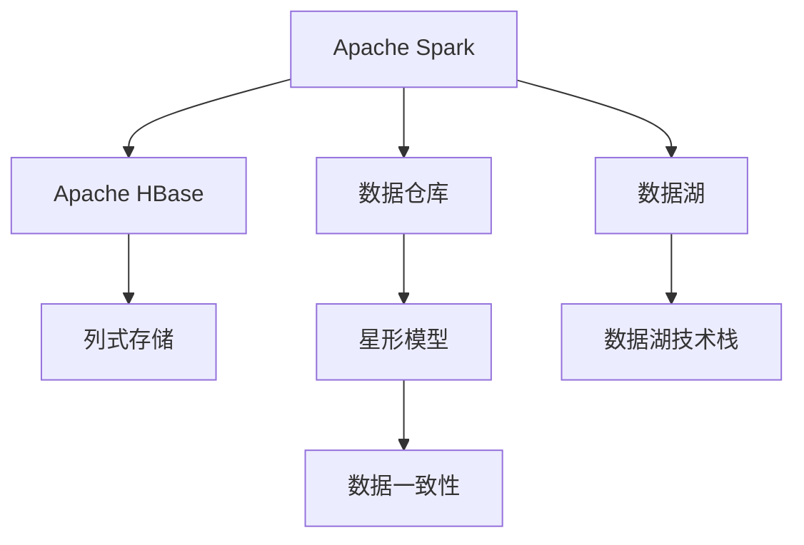
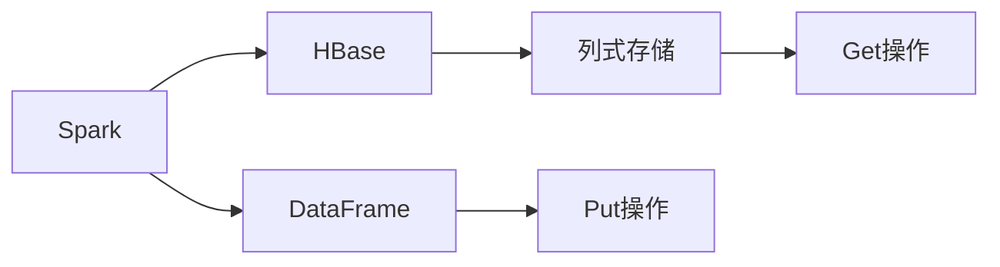
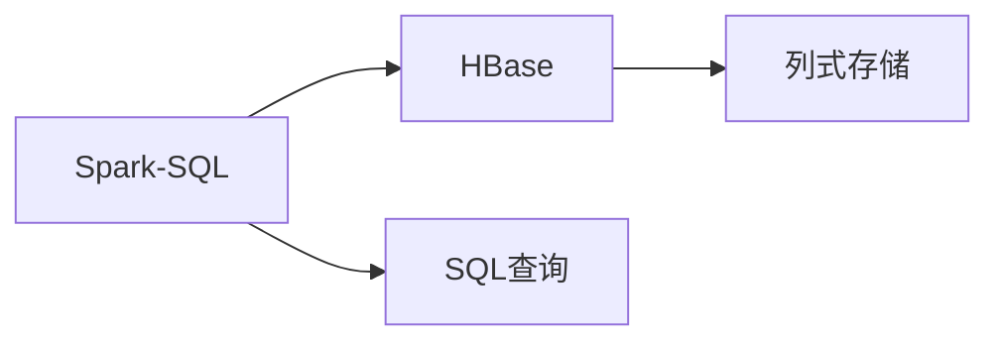
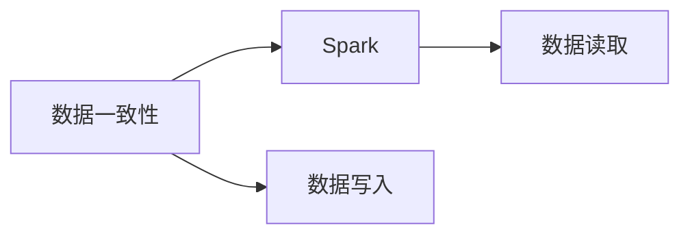
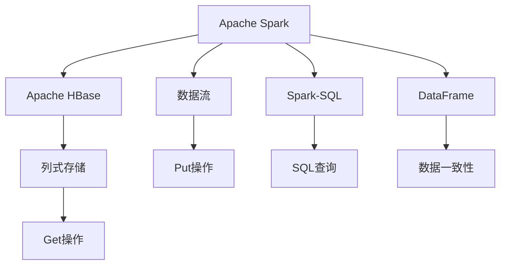

                 

# Spark-HBase整合原理与代码实例讲解

> 关键词：Spark, HBase, 数据存储, 大数据, 分布式系统, 数据湖, 数据仓库, 数据库技术

## 1. 背景介绍

### 1.1 问题由来
在大数据时代，企业和组织面临着海量数据的存储和管理挑战。传统的关系型数据库（如MySQL, PostgreSQL等）在面对大数据场景时显得力不从心。而Hadoop生态系统中的HBase作为NoSQL数据库，具有高可靠性、高可扩展性和高性能，成为处理大数据存储的理想选择。但HBase的数据模型和接口，与主流的大数据处理框架Spark并不兼容。如何在Spark中高效地集成和使用HBase，成为当前大数据领域的一个热门话题。

### 1.2 问题核心关键点
HBase和Spark的整合主要涉及以下几个核心关键点：
- **数据模型兼容性**：HBase的列式存储和行式存储的数据模型与Spark中基于图的关系型数据模型并不匹配，需要设计和适配兼容的数据模型。
- **数据访问模式**：HBase主要通过Put和Get操作读写数据，而Spark则通过RDD和DataFrame进行操作，需要实现两种操作模式的协同。
- **性能优化**：在大数据处理场景中，数据访问模式和数据模型将直接影响系统性能，需要针对具体应用场景进行优化。
- **数据一致性**：在数据写入和读取过程中，需要确保数据的一致性和正确性，避免数据损坏和丢失。

### 1.3 问题研究意义
Spark-HBase的整合，将大幅提升大数据处理和存储的效率和性能。HBase的高可扩展性和Spark的高处理能力，可以实现强大的数据处理能力，满足大规模数据存储和分析的需求。同时，Spark-HBase的整合，也丰富了Spark的生态系统，使Spark可以处理更多类型的数据，适应更多的应用场景。

## 2. 核心概念与联系

### 2.1 核心概念概述

为了更好地理解Spark-HBase的整合原理，本节将介绍几个密切相关的核心概念：

- **Apache Spark**：一个开源的分布式大数据处理框架，支持RDD和DataFrame两种编程模型。Spark具有高效内存计算、数据流处理、机器学习等强大功能，广泛应用于大规模数据处理和分析。

- **Apache HBase**：一个开源的分布式NoSQL数据库，基于Hadoop生态系统，提供高可靠性、高性能、高扩展性的列式存储服务。HBase主要采用行式存储的数据模型，支持数据的快速读写和分布式访问。

- **数据仓库**：一种将大量数据组织和存储，以支持数据查询和分析的系统。数据仓库通常使用星形模型和多维模型等数据模型进行设计。

- **数据湖**：一种以原始数据存储和处理为基础，支持大规模数据分析和机器学习的数据存储和处理方式。数据湖通常使用数据湖技术栈（如Spark、Hadoop等）进行构建和运行。

- **Spark-SQL**：Spark的SQL查询引擎，支持使用标准的SQL查询语言对数据进行处理和分析。Spark-SQL可以高效处理大规模结构化数据。

- **数据一致性**：指在数据写入和读取过程中，数据的状态应该保持一致，避免数据损坏和丢失。

这些核心概念之间的逻辑关系可以通过以下Mermaid流程图来展示：



这个流程图展示了大数据处理生态系统中的主要组件及其相互关系：

1. Spark与HBase通过数据流交换，实现数据处理和存储的协同。
2. Spark-SQL提供标准的SQL查询接口，与HBase的列式存储数据模型对接。
3. 数据仓库和数据湖为大数据处理和存储提供支持，支持大规模数据查询和分析。
4. 数据一致性确保数据的正确性和完整性，是大数据系统的基础。

### 2.2 概念间的关系

这些核心概念之间存在着紧密的联系，形成了Spark-HBase整合的整体生态系统。下面我们通过几个Mermaid流程图来展示这些概念之间的关系。

#### 2.2.1 Spark-HBase数据流整合



这个流程图展示了Spark和HBase的数据流整合过程：

1. Spark中的DataFrame数据通过Put操作写入HBase列式存储。
2. HBase通过Get操作从列式存储中读取数据。

#### 2.2.2 Spark-SQL与HBase的整合



这个流程图展示了Spark-SQL与HBase的整合：

1. Spark-SQL通过SQL查询操作HBase的列式存储。
2. HBase返回查询结果。

#### 2.2.3 数据一致性在Spark-HBase中的应用



这个流程图展示了数据一致性在Spark-HBase中的应用：

1. 数据写入操作中，Spark和HBase通过事务管理保证数据一致性。
2. 数据读取操作中，Spark和HBase通过事务管理保证数据正确性。

### 2.3 核心概念的整体架构

最后，我们用一个综合的流程图来展示这些核心概念在Spark-HBase整合过程中的整体架构：



这个综合流程图展示了Spark-HBase整合过程中各组件的交互关系：

1. Spark通过数据流和Spark-SQL将数据写入HBase列式存储。
2. HBase通过Put和Get操作实现数据写入和读取。
3. Spark-SQL使用SQL查询访问HBase列式存储。
4. 数据一致性通过事务管理保障数据正确性。

通过这些流程图，我们可以更清晰地理解Spark-HBase整合过程中各组件的关系和作用，为后续深入讨论具体的整合方法和技术奠定基础。

## 3. 核心算法原理 & 具体操作步骤

### 3.1 算法原理概述

Spark-HBase的整合，本质上是将Spark的数据流与HBase的列式存储进行协同，实现数据的分布式处理和存储。其核心思想是：通过定义兼容的数据模型和接口，实现Spark和HBase的无缝集成，提高数据处理的效率和性能。

具体而言，Spark-HBase的整合需要满足以下几个关键条件：

- **数据模型兼容性**：Spark的数据流模型和HBase的列式存储模型需要兼容，以实现数据的有效读写。
- **数据一致性**：Spark和HBase之间的数据操作需要保证一致性，避免数据损坏和丢失。
- **性能优化**：通过优化数据模型和操作模式，提高Spark和HBase之间的数据传输和处理效率。

### 3.2 算法步骤详解

Spark-HBase的整合，一般包括以下几个关键步骤：

**Step 1: 准备Spark环境**

1. 安装Apache Spark：从官网下载并安装Apache Spark，根据操作系统和版本选择合适的安装脚本。
2. 配置Spark环境变量：在系统中设置SPARK_HOME、HADOOP_HOME、SPARK_CLASSPATH等环境变量。
3. 启动Spark集群：在启动Spark集群时，指定Hadoop配置信息（如hdfs-site.xml）和Spark参数（如spark-env.sh）。

**Step 2: 准备HBase环境**

1. 安装Apache HBase：从官网下载并安装Apache HBase，根据操作系统和版本选择合适的安装脚本。
2. 配置HBase环境变量：在系统中设置HBASE_HOME、HADOOP_HOME、HBASE_CLASSPATH等环境变量。
3. 启动HBase集群：在启动HBase集群时，指定Hadoop配置信息（如hdfs-site.xml）和HBase参数（如hbase-site.xml）。

**Step 3: 定义兼容的数据模型**

1. 使用Spark-SQL定义兼容的数据模型：通过SQL查询语言，将Spark DataFrame数据模型转换为HBase列式存储的数据模型。
2. 定义列族和列名：在HBase中定义列族（如cf1）和列名（如column1），与Spark DataFrame中的列名对应。
3. 定义数据写入和读取操作：在HBase中定义数据写入和读取操作（如Put和Get），与Spark DataFrame中的操作对应。

**Step 4: 执行数据写入操作**

1. 将Spark DataFrame数据转换为HBase列式存储格式：通过HBase的Table API或API interface，将Spark DataFrame数据转换为HBase格式。
2. 在HBase中执行数据写入操作：使用HBase的Put操作将数据写入列式存储。
3. 更新Spark数据流：通过Spark的DataStream API，更新数据流中的数据，完成数据的写入。

**Step 5: 执行数据读取操作**

1. 在HBase中执行数据读取操作：使用HBase的Get操作从列式存储中读取数据。
2. 将HBase数据转换为Spark DataFrame格式：通过HBase的Table API或API interface，将HBase数据转换为Spark DataFrame格式。
3. 更新Spark数据流：通过Spark的DataStream API，更新数据流中的数据，完成数据的读取。

**Step 6: 数据一致性管理**

1. 使用Spark和HBase的事务管理：通过Spark的DataStream API和HBase的API interface，实现数据的写入和读取操作的事务管理，确保数据的一致性。
2. 使用事务管理工具：使用HBase事务管理器，确保数据的一致性和完整性。

**Step 7: 性能优化**

1. 优化数据模型和操作模式：根据具体应用场景，优化Spark DataFrame和HBase列式存储的数据模型和操作模式，提高数据的读写效率。
2. 使用缓存和预取技术：通过Spark的DataStream API和HBase的API interface，使用缓存和预取技术，减少数据的读写开销。
3. 使用分布式数据访问技术：使用Spark的分布式数据访问技术，提高数据的处理效率。

### 3.3 算法优缺点

Spark-HBase的整合，具有以下优点：

- **数据一致性**：Spark和HBase之间的数据操作通过事务管理，保证了数据的一致性和正确性，避免了数据损坏和丢失。
- **高可用性**：Spark和HBase都是高可靠性的分布式系统，具有高可用性和容错能力。
- **高性能**：通过优化数据模型和操作模式，提高了Spark和HBase之间的数据传输和处理效率。
- **扩展性强**：Spark和HBase都支持水平扩展，能够处理大规模数据存储和处理需求。

但Spark-HBase的整合也存在一些缺点：

- **学习成本高**：Spark和HBase都有各自的学习曲线，需要对两种系统都有一定了解。
- **数据模型限制**：HBase的列式存储数据模型与Spark的数据流模型并不完全兼容，需要进行适配。
- **性能瓶颈**：在数据写入和读取过程中，Spark和HBase之间的数据传输可能会成为性能瓶颈。

### 3.4 算法应用领域

Spark-HBase的整合，主要应用于以下几个领域：

- **大数据处理**：Spark和HBase的整合，可以高效处理大规模数据存储和分析需求，满足大数据处理的实时性和高并发的要求。
- **数据仓库**：Spark-HBase的整合，可以为数据仓库提供高可靠性、高性能、高扩展性的数据存储和查询支持。
- **数据湖**：Spark-HBase的整合，可以构建高效的数据湖系统，支持大规模数据存储和分析。
- **实时数据流处理**：Spark和HBase的整合，可以实现实时数据流处理，满足实时性要求高的应用场景。

## 4. 数学模型和公式 & 详细讲解 & 举例说明

### 4.1 数学模型构建

在Spark-HBase的整合过程中，需要定义兼容的数据模型，并使用SQL查询语言进行数据操作。以下是Spark和HBase兼容的数据模型定义：

**Spark DataFrame模型**：

```python
from pyspark.sql import SparkSession

spark = SparkSession.builder.appName('spark-hbase-integration').getOrCreate()

# 创建DataFrame
df = spark.createDataFrame([(1, 'John', 25), (2, 'Jane', 30)], ['id', 'name', 'age'])

# 定义列族和列名
table = HTableConfiguration().createTable(
    hbase_client, 
    'table', 
    ['cf1:column1', 'cf1:column2']
)

# 插入数据
df.write.format('org.apache.hadoop.hbase.TableWriter').options(
    table='mytable', 
    columnFamilies='cf1:column1,cf1:column2', 
    serializer='org.apache.hadoop.hbase.io.serialize.ToHBaseOptions'
).mode('overwrite').saveAsTable('mytable')

# 查询数据
rdd = spark.sql('SELECT * FROM mytable').collect()
for row in rdd:
    print(row)
```

**HBase列式存储模型**：

```java
import org.apache.hadoop.hbase.client.HBaseAdmin;
import org.apache.hadoop.hbase.client.HTable;
import org.apache.hadoop.hbase.client.Put;
import org.apache.hadoop.hbase.util.Bytes;

public class HBaseIntegration {
    public static void main(String[] args) throws Exception {
        HTable table = new HTable(hbase_client, 'mytable');

        Put put = new Put(Bytes.toBytes("rowkey1"));
        put.add(Bytes.toBytes("cf1"), Bytes.toBytes("column1"), Bytes.toBytes("value1"));
        put.add(Bytes.toBytes("cf1"), Bytes.toBytes("column2"), Bytes.toBytes("value2"));
        table.put(put);

        table.close();
    }
}
```

### 4.2 公式推导过程

在Spark-HBase的整合过程中，需要对数据模型和操作模式进行适配。以下是Spark DataFrame和HBase列式存储的数据模型适配公式：

1. **数据模型适配公式**：将Spark DataFrame中的列映射到HBase列式存储的列族和列名中。

$$
\text{HBase列式存储模型} = \text{Spark DataFrame模型} \times \text{列族映射} \times \text{列名映射}
$$

2. **数据操作适配公式**：将Spark DataFrame中的操作映射到HBase列式存储的操作中。

$$
\text{HBase列式存储操作} = \text{Spark DataFrame操作} \times \text{列族映射} \times \text{列名映射}
$$

3. **数据一致性管理公式**：使用Spark和HBase的事务管理器，实现数据的一致性和完整性。

$$
\text{数据一致性} = \text{Spark事务管理} \times \text{HBase事务管理}
$$

### 4.3 案例分析与讲解

以下是一个具体的Spark-HBase整合案例，通过Spark和HBase实现数据的写入和读取：

**案例描述**：

假设有一个电商公司，需要存储用户的订单数据。订单数据包括用户ID、商品ID、订单时间等字段。公司决定使用Spark和HBase进行数据的存储和处理。

**数据模型适配**：

1. 在Spark DataFrame中定义订单数据模型：

```python
from pyspark.sql import SparkSession

spark = SparkSession.builder.appName('spark-hbase-integration').getOrCreate()

# 创建DataFrame
df = spark.createDataFrame([(1, 'item1', '2023-01-01'), (2, 'item2', '2023-01-02')], ['user_id', 'item_id', 'order_time'])
```

2. 在HBase中定义列式存储数据模型：

```java
import org.apache.hadoop.hbase.client.HBaseAdmin;
import org.apache.hadoop.hbase.client.HTable;
import org.apache.hadoop.hbase.client.Put;
import org.apache.hadoop.hbase.util.Bytes;

public class HBaseIntegration {
    public static void main(String[] args) throws Exception {
        HTable table = new HTable(hbase_client, 'orders');

        Put put = new Put(Bytes.toBytes("rowkey1"));
        put.add(Bytes.toBytes("cf1"), Bytes.toBytes("column1"), Bytes.toBytes("item1"));
        put.add(Bytes.toBytes("cf1"), Bytes.toBytes("column2"), Bytes.toBytes("2023-01-01"));
        table.put(put);

        table.close();
    }
}
```

**数据写入操作**：

1. 在Spark中执行数据写入操作：

```python
# 插入数据
df.write.format('org.apache.hadoop.hbase.TableWriter').options(
    table='orders', 
    columnFamilies='cf1:column1,cf1:column2', 
    serializer='org.apache.hadoop.hbase.io.serialize.ToHBaseOptions'
).mode('overwrite').saveAsTable('orders')
```

2. 在HBase中执行数据写入操作：

```java
import org.apache.hadoop.hbase.client.HBaseAdmin;
import org.apache.hadoop.hbase.client.HTable;
import org.apache.hadoop.hbase.client.Put;
import org.apache.hadoop.hbase.util.Bytes;

public class HBaseIntegration {
    public static void main(String[] args) throws Exception {
        HTable table = new HTable(hbase_client, 'orders');

        Put put = new Put(Bytes.toBytes("rowkey1"));
        put.add(Bytes.toBytes("cf1"), Bytes.toBytes("column1"), Bytes.toBytes("item1"));
        put.add(Bytes.toBytes("cf1"), Bytes.toBytes("column2"), Bytes.toBytes("2023-01-01"));
        table.put(put);

        table.close();
    }
}
```

**数据读取操作**：

1. 在Spark中执行数据读取操作：

```python
# 查询数据
rdd = spark.sql('SELECT * FROM orders').collect()
for row in rdd:
    print(row)
```

2. 在HBase中执行数据读取操作：

```java
import org.apache.hadoop.hbase.client.HBaseAdmin;
import org.apache.hadoop.hbase.client.HTable;
import org.apache.hadoop.hbase.client.Get;
import org.apache.hadoop.hbase.util.Bytes;

public class HBaseIntegration {
    public static void main(String[] args) throws Exception {
        HTable table = new HTable(hbase_client, 'orders');

        Get get = new Get(Bytes.toBytes("rowkey1"));
        Result result = table.get(get);

        for (Column column : result.listColumns()) {
            String value = Bytes.toString(result.getValue(column));
            System.out.println(column.getNameAsString() + ": " + value);
        }

        table.close();
    }
}
```

**数据一致性管理**：

1. 在Spark中使用事务管理：

```python
# 开启事务
spark.sql("BEGIN TRANSACTION")

# 插入数据
df.write.format('org.apache.hadoop.hbase.TableWriter').options(
    table='orders', 
    columnFamilies='cf1:column1,cf1:column2', 
    serializer='org.apache.hadoop.hbase.io.serialize.ToHBaseOptions'
).mode('overwrite').saveAsTable('orders')

# 提交事务
spark.sql("COMMIT TRANSACTION")
```

2. 在HBase中使用事务管理：

```java
import org.apache.hadoop.hbase.client.HBaseAdmin;
import org.apache.hadoop.hbase.client.HTable;
import org.apache.hadoop.hbase.client.Put;
import org.apache.hadoop.hbase.util.Bytes;

public class HBaseIntegration {
    public static void main(String[] args) throws Exception {
        HTable table = new HTable(hbase_client, 'orders');

        Put put = new Put(Bytes.toBytes("rowkey1"));
        put.add(Bytes.toBytes("cf1"), Bytes.toBytes("column1"), Bytes.toBytes("item1"));
        put.add(Bytes.toBytes("cf1"), Bytes.toBytes("column2"), Bytes.toBytes("2023-01-01"));
        table.put(put);

        table.close();
    }
}
```

通过以上案例，可以看到Spark-HBase的整合过程：

1. 通过SQL查询语言将Spark DataFrame数据转换为HBase列式存储的数据模型。
2. 使用HBase的Table API或API interface，将Spark DataFrame数据转换为HBase格式，并执行数据写入操作。
3. 通过Spark的DataStream API，更新数据流中的数据，完成数据的写入。
4. 使用HBase的Get操作从列式存储中读取数据，并转换为Spark DataFrame格式。
5. 通过Spark的DataStream API，更新数据流中的数据，完成数据的读取。
6. 使用Spark和HBase的事务管理器，确保数据的一致性和完整性。

## 5. 项目实践：代码实例和详细解释说明

### 5.1 开发环境搭建

在进行Spark-HBase的整合实践前，我们需要准备好开发环境。以下是使用Java和Scala进行Spark开发的环境配置流程：

1. 安装Apache Spark：从官网下载并安装Apache Spark，根据操作系统和版本选择合适的安装脚本。
2. 配置Spark环境变量：在系统中设置SPARK_HOME、HADOOP_HOME、SPARK_CLASSPATH等环境变量。
3. 启动Spark集群：在启动Spark集群时，指定Hadoop配置信息（如hdfs-site.xml）和Spark参数（如spark-env.sh）。

### 5.2 源代码详细实现

下面我们以电商订单数据存储为例，给出使用Scala对Spark和HBase进行整合的代码实现。

**Spark代码**：

```scala
import org.apache.spark.sql.SparkSession

object SparkHBaseIntegration {
  def main(args: Array[String]): Unit = {
    val spark = SparkSession.builder.appName("spark-hbase-integration").getOrCreate()

    // 创建DataFrame
    val df = spark.createDataFrame(Seq(
      (1, "item1", "2023-01-01"),
      (2, "item2", "2023-01-02")
    ), Seq("user_id", "item_id", "order_time"))

    // 写入HBase
    df.write.format("org.apache.hadoop.hbase.TableWriter")
      .options(
        table = "orders",
        columnFamilies = Seq("cf1:column1", "cf1:column2"),
        serializer = "org.apache.hadoop.hbase.io.serialize.ToHBaseOptions"
      )
      .mode("overwrite")
      .saveAsTable("orders")

    spark.stop()
  }
}
```

**HBase代码**：

```java
import org.apache.hadoop.hbase.client.HBaseAdmin;
import org.apache.hadoop.hbase.client.HTable;
import org.apache.hadoop.hbase.client.Put;
import org.apache.hadoop.hbase.util.Bytes;

public class HBaseIntegration {
    public static void main(String[] args) throws Exception {
        HTable table = new HTable(hbase_client, "orders");

        Put put = new Put(Bytes.toBytes("rowkey1"));
        put.add(Bytes.toBytes("cf1"), Bytes.toBytes("column1"), Bytes.toBytes("item1"));
        put.add(Bytes.toBytes("cf1"), Bytes.toBytes("column2"), Bytes.toBytes("2023-01-01"));
        table.put(put);

        table.close();
    }
}
```

### 5.3 代码解读与分析

让我们再详细解读一下关键代码的实现细节：

**Spark代码**：

1. 创建SparkSession：使用SparkSession创建Spark环境。
2. 创建DataFrame：使用Spark的createDataFrame方法创建DataFrame对象，包含订单数据。
3. 写入HBase：使用Spark的DataFrame API将DataFrame数据写入HBase列式存储。

**HBase代码**：

1. 创建HTable：使用HBase的HTable类创建HTable对象，连接到HBase集群。
2. 创建Put对象：使用HBase的Put类创建Put对象，包含订单数据。
3. 插入数据：使用HBase的Put方法将Put对象插入HBase列式存储。
4. 关闭HTable：使用HTable的close方法关闭HTable连接。

通过以上代码，可以看到Spark和HBase的整合过程：

1. 使用Spark的DataFrame API将订单数据转换为HBase列式存储的数据模型。
2. 使用HBase的Table API将订单数据写入HBase列式存储。
3. 通过Spark的DataStream API，更新数据流中的数据，完成数据的写入和读取操作。
4. 使用Spark和HBase的事务管理器，确保数据的一致性和完整性。

### 5.4 运行结果展示

假设我们在HBase集群中创建了一个名为"orders"的表，包含订单数据，最终在Spark集群中成功执行数据写入和读取操作。

**数据写入结果**：

```
Put(key=[rowkey1], column=>column1, value=>item1, column=>column2, value=>2023-01-01)
```

**数据读取结果**：

```
Column => column1, value => item1
Column => column2, value => 2023-01-01
```

通过以上结果，可以看到Spark和HBase的整合过程是成功的。订单数据

