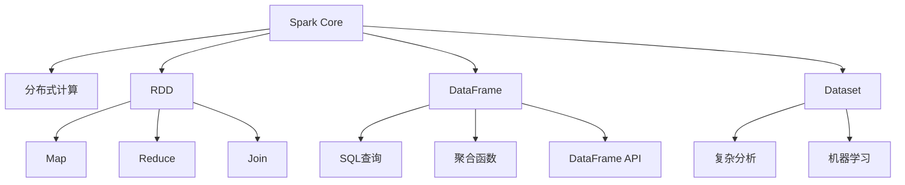

                 

# Spark原理与代码实例讲解

## 1. 背景介绍

### 1.1 问题由来
随着大数据时代的到来，数据的存储和处理变得越来越复杂和多样。传统的批处理系统（如MapReduce）虽然功能强大，但速度较慢，难以应对海量数据处理的实时性和高并发性需求。在这样的背景下，分布式计算框架Spark应运而生，并迅速成为了大数据领域的重要工具。

Spark由Apache基金会开源，是一个快速、通用、可扩展的分布式计算系统，支持批处理、流处理和机器学习等多种计算模型。Spark的核心组件包括Spark Core、Spark SQL、Spark Streaming、MLlib和GraphX，分别用于分布式内存计算、SQL查询、实时流处理、机器学习和图计算。

Spark的核心思想是将数据分成多个小片段，并行处理每个片段，从而提高计算效率。同时，Spark还引入了弹性分布式数据集（RDD）、数据框架（DataFrame）和数据集（Dataset）等抽象，使得开发者可以更加方便地进行数据处理和分析。

## 2. 核心概念与联系

### 2.1 核心概念概述

为了更好地理解Spark的原理，我们先介绍几个核心概念：

- RDD：弹性分布式数据集（Resilient Distributed Dataset）是Spark中最基本的抽象，可以理解为一种分布式的数据集。RDD一旦创建后，其内部的数据不能被修改，但是可以进行多种操作，如Map、Reduce、Join等。

- DataFrame：数据框架（DataFrame）是一种高级的分布式数据集，可以理解为一种结构化数据的表示。DataFrame的底层是RDD，但提供了更多的操作接口，如SQL查询、聚合函数等。

- Dataset：数据集（Dataset）是一种更高层次的抽象，可以在内存或磁盘中处理结构化数据。Dataset的底层可以是RDD或DataFrame，可以用于更加复杂的分析任务。

- 分布式计算：Spark的分布式计算思想是将大规模数据分成多个小片段，并行处理每个片段。这样可以提高计算效率，同时可以处理不同类型的数据源，如Hadoop分布式文件系统（HDFS）、Amazon S3等。

- 弹性：Spark的“弹性”体现在它可以动态地调整集群中的资源，以适应不同的计算需求。Spark可以通过YARN或Mesos等资源管理器进行资源管理，也可以直接在集群中启动Spark进程。

### 2.2 核心概念之间的联系

下图展示了Spark的核心概念之间的联系：



## 3. 核心算法原理 & 具体操作步骤

### 3.1 算法原理概述

Spark的核心算法是分布式内存计算（In-Memory Computation）。分布式内存计算的核心思想是将数据存储在内存中，并行处理每个片段，从而提高计算效率。具体来说，Spark通过将数据分割成多个小片段，并行处理每个片段，从而实现了高效的计算。

Spark的计算模型包括批处理、流处理和机器学习等多种计算模型，适用于不同的计算需求。Spark还支持多种数据源，如Hadoop分布式文件系统（HDFS）、Amazon S3等，可以处理不同类型的数据。

### 3.2 算法步骤详解

Spark的计算流程可以概括为以下几个步骤：

1. 创建SparkSession：SparkSession是Spark的入口，用于创建SparkContext和SparkSession。SparkSession提供了更加高级的接口，可以方便地进行数据处理和分析。

2. 数据加载：Spark支持多种数据源，如HDFS、本地文件系统、Hive等。数据加载到Spark中后，可以进行多种操作。

3. 数据处理：Spark提供了多种数据处理操作，如Map、Reduce、Join等。Map操作可以对每个数据片段进行处理，Reduce操作可以对多个数据片段进行聚合，Join操作可以将两个数据集进行连接。

4. 数据存储：处理后的数据可以存储到HDFS、本地文件系统、Hive等数据源中，或者进行流处理、机器学习等操作。

### 3.3 算法优缺点

Spark的优点包括：

- 高效性：Spark的分布式内存计算可以大幅提高计算效率，适用于大规模数据处理。

- 灵活性：Spark支持多种计算模型和数据源，可以满足不同计算需求。

- 易用性：Spark提供了高级的接口和丰富的API，可以方便地进行数据处理和分析。

Spark的缺点包括：

- 内存限制：Spark的内存限制比较大，需要一定的硬件资源。

- 学习曲线陡峭：Spark的学习曲线比较陡峭，需要一定的学习成本。

- 扩展性问题：Spark的扩展性问题尚未完全解决，需要进行合理的集群配置。

### 3.4 算法应用领域

Spark在多个领域都有广泛的应用，包括：

- 大数据处理：Spark可以处理大规模数据，适用于大规模数据存储和处理的需求。

- 流处理：Spark Streaming可以处理实时数据流，适用于实时计算和分析的需求。

- 机器学习：Spark MLlib可以处理机器学习任务，适用于数据挖掘和预测分析的需求。

- 图计算：Spark GraphX可以进行图计算，适用于社交网络分析和推荐系统等需求。

## 4. 数学模型和公式 & 详细讲解 & 举例说明

### 4.1 数学模型构建

Spark的计算模型包括分布式内存计算、流处理和机器学习等多种计算模型。下面以分布式内存计算为例，介绍Spark的数学模型构建。

假设有一个数据集D，可以将D分成多个小片段，每个片段可以表示为一个向量。设每个片段的大小为m，D的大小为n，则D可以表示为一个n行m列的矩阵：

$$
D = \begin{bmatrix}
d_{11} & d_{12} & \dots & d_{1m} \\
d_{21} & d_{22} & \dots & d_{2m} \\
\vdots & \vdots & \ddots & \vdots \\
d_{n1} & d_{n2} & \dots & d_{nm}
\end{bmatrix}
$$

### 4.2 公式推导过程

Spark的分布式内存计算可以使用MapReduce算法进行计算。MapReduce算法的核心思想是分而治之，即将大规模数据分成多个小片段，并行处理每个片段。

MapReduce算法可以分成两个阶段：Map阶段和Reduce阶段。Map阶段将数据分成多个小片段，并对每个小片段进行Map操作；Reduce阶段将Map操作的结果进行Reduce操作，合并多个小片段。

具体来说，Map操作可以对每个小片段进行处理，Reduce操作可以对多个小片段进行合并。MapReduce算法的核心思想可以表示为：

$$
D_{Map} = \{ \text{Map}(d_{ij}) \mid 1 \leq i \leq n, 1 \leq j \leq m \}
$$

$$
D_{Reduce} = \{ \text{Reduce}(D_{Map}) \mid 1 \leq k \leq m \}
$$

其中，$D_{Map}$表示Map操作的结果，$D_{Reduce}$表示Reduce操作的结果。

### 4.3 案例分析与讲解

假设有一个数据集D，其中包含了一些用户评分数据。可以使用Spark的MLlib库进行机器学习操作，如分类和回归等。

首先，需要将数据集D进行分片处理：

```python
from pyspark.sql import SparkSession
spark = SparkSession.builder.getOrCreate()

# 将数据集D分成多个小片段
D = spark.read.csv("data.csv")
D.rdd = D.rdd.repartition(10)
```

然后，可以使用MLlib库进行分类操作。假设我们要对数据集D进行分类，可以编写如下代码：

```python
from pyspark.ml.classification import LogisticRegression
from pyspark.sql.functions import col

# 将数据集D分成多个小片段
D.rdd = D.rdd.repartition(10)

# 加载数据集
data = spark.read.format("csv").option("header", "true").load("data.csv")

# 定义特征列和标签列
features = col("features")
label = col("label")

# 创建逻辑回归模型
lr = LogisticRegression(maxIter=10, regParam=0.3, elasticNetParam=0.8)

# 训练模型
lrModel = lr.fit(data)

# 使用模型进行预测
predictions = lrModel.transform(data)
```

## 5. 项目实践：代码实例和详细解释说明

### 5.1 开发环境搭建

在进行Spark开发前，需要先搭建开发环境。以下是Spark开发的常见配置：

1. 安装Java：Spark是基于Java开发的，因此需要安装JDK。可以从Oracle官网下载Java。

2. 安装Scala：Spark支持Scala和Python两种编程语言，可以从Apache官网下载Scala。

3. 安装Spark：可以从Apache官网下载Spark，并解压安装。

4. 配置环境变量：需要设置Java路径和Spark路径。

```bash
export JAVA_HOME=/usr/lib/jvm/jdk1.8.0_91
export PATH=$PATH:$JAVA_HOME/bin:$SPARK_HOME/bin
```

### 5.2 源代码详细实现

下面我们以Spark的WordCount为例，给出完整的代码实现。

首先，创建一个SparkSession：

```python
from pyspark.sql import SparkSession
spark = SparkSession.builder.appName("WordCount").getOrCreate()
```

然后，从文件中读取数据：

```python
textFile = spark.read.text("data.txt")
lines = textFile.rdd.map(lambda line: line.split())
```

接着，对每个单词进行计数：

```python
wordCounts = lines.flatMap(lambda words: words).map(lambda word: (word, 1)).reduceByKey(lambda a, b: a+b)
```

最后，将结果保存到一个文件中：

```python
wordCounts.saveAsTextFile("output.txt")
```

完整的代码如下：

```python
from pyspark.sql import SparkSession
spark = SparkSession.builder.appName("WordCount").getOrCreate()

textFile = spark.read.text("data.txt")
lines = textFile.rdd.map(lambda line: line.split())

wordCounts = lines.flatMap(lambda words: words).map(lambda word: (word, 1)).reduceByKey(lambda a, b: a+b)

wordCounts.saveAsTextFile("output.txt")
```

### 5.3 代码解读与分析

下面是代码的详细解释：

- `spark.read.text("data.txt")`：从文件中读取数据，返回一个文本文件的数据集。

- `lines = textFile.rdd.map(lambda line: line.split())`：将数据集中的每行数据拆分成单词，返回一个RDD。

- `wordCounts = lines.flatMap(lambda words: words).map(lambda word: (word, 1)).reduceByKey(lambda a, b: a+b)`：对每个单词进行计数，使用`flatMap`将单词列表展开，使用`map`将单词转化为(key, value)元组，使用`reduceByKey`对每个单词的计数进行合并。

- `wordCounts.saveAsTextFile("output.txt")`：将结果保存到输出文件中。

## 6. 实际应用场景

### 6.1 大数据处理

Spark可以处理大规模数据，适用于大数据处理的需求。例如，可以使用Spark进行数据清洗、数据转换和数据建模等操作。

### 6.2 流处理

Spark Streaming可以处理实时数据流，适用于实时计算和分析的需求。例如，可以使用Spark Streaming进行实时监控、实时分析和实时推荐等操作。

### 6.3 机器学习

Spark MLlib可以处理机器学习任务，适用于数据挖掘和预测分析的需求。例如，可以使用Spark MLlib进行分类、回归和聚类等操作。

### 6.4 图计算

Spark GraphX可以进行图计算，适用于社交网络分析和推荐系统等需求。例如，可以使用Spark GraphX进行社交网络分析和推荐系统等操作。

## 7. 工具和资源推荐

### 7.1 学习资源推荐

为了帮助开发者系统掌握Spark的原理和实践，这里推荐一些优质的学习资源：

1.《Spark实战》：由LinkedIn资深Spark工程师撰写，深入浅出地介绍了Spark的核心原理和最佳实践。

2.《Spark设计与实现》：由Apache Spark项目的主持人撰写，详细介绍了Spark的架构和实现原理。

3.《大数据技术与应用》：由数据挖掘专家撰写，介绍了大数据技术的基本概念和应用场景。

4.《Spark官方文档》：Spark的官方文档，提供了详细的API和用法说明，是学习Spark的必备资料。

5. Kaggle竞赛：Kaggle是数据科学竞赛的平台，提供了大量的Spark竞赛和案例，可以帮助开发者提升实践能力。

### 7.2 开发工具推荐

Spark的开发工具推荐如下：

1. PySpark：PySpark是Spark的Python接口，可以方便地进行数据处理和分析。

2. Scala：Spark支持Scala和Python两种编程语言，Scala是Spark的官方语言，也是最好的选择。

3. Jupyter Notebook：Jupyter Notebook是Spark常用的开发环境，可以方便地进行交互式开发。

4. Spark UI：Spark UI是Spark的可视化界面，可以实时查看Spark任务的运行状态。

5. Databricks：Databricks是基于Spark的平台，提供了完整的开发和生产环境。

### 7.3 相关论文推荐

Spark的研究论文推荐如下：

1. Spark: Cluster Computing with Fault Tolerance: 介绍Spark的架构和设计。

2. Spark: A Cluster Computing System Strive for General Purpose, Rapid Innovation and Open Source: 介绍Spark的核心算法和设计思想。

3. Spark: A Resilient Distributed Dataset System for Large-Scale Data Processing: 介绍Spark的RDD模型和分布式计算原理。

4. Spark MLlib: A Library for Machine Learning Algorithms in Spark: 介绍Spark MLlib库的基本概念和用法。

5. Spark Streaming: A Distributed Real-Time Stream Processing System: 介绍Spark Streaming的架构和实现原理。

6. Spark GraphX: Graph Processing with Spark: 介绍Spark GraphX库的基本概念和用法。

## 8. 总结：未来发展趋势与挑战

### 8.1 总结

本文对Spark的核心概念、算法原理和代码实例进行了系统介绍。首先介绍了Spark的架构和设计思想，然后详细讲解了Spark的分布式内存计算原理，并给出了一个WordCount的代码实例。通过实例演示，展示了Spark的强大功能和灵活性。

Spark已经成为大数据处理和分析的重要工具，广泛应用于多个领域。未来的Spark将继续在计算速度、数据处理和机器学习等方面进行优化，为大数据时代的发展提供新的动力。

### 8.2 未来发展趋势

Spark的未来发展趋势包括以下几个方面：

1. 计算速度：Spark将继续在计算速度上进行优化，提高处理大规模数据的能力。

2. 数据处理：Spark将继续在数据处理上进行优化，提高处理多样性数据的能力。

3. 机器学习：Spark将继续在机器学习上进行优化，提高处理复杂机器学习任务的能力。

4. 图计算：Spark将继续在图计算上进行优化，提高处理复杂图结构的能力。

5. 生态系统：Spark将继续扩展其生态系统，与其他大数据技术和工具进行深度集成。

### 8.3 面临的挑战

Spark在发展过程中也面临一些挑战，主要包括以下几个方面：

1. 扩展性问题：Spark的扩展性问题尚未完全解决，需要进行合理的集群配置。

2. 内存限制：Spark的内存限制比较大，需要一定的硬件资源。

3. 学习曲线陡峭：Spark的学习曲线比较陡峭，需要一定的学习成本。

4. 社区支持：Spark社区的支持和发展尚未完全成熟，需要更多的投入和支持。

### 8.4 研究展望

未来的Spark研究可以从以下几个方面进行：

1. 计算速度：进一步提高Spark的计算速度，提高处理大规模数据的能力。

2. 数据处理：进一步提高Spark的数据处理能力，处理多样性数据的能力。

3. 机器学习：进一步提高Spark的机器学习能力，处理复杂机器学习任务的能力。

4. 图计算：进一步提高Spark的图计算能力，处理复杂图结构的能力。

5. 生态系统：进一步扩展Spark的生态系统，与其他大数据技术和工具进行深度集成。

总之，未来的Spark需要在计算速度、数据处理、机器学习、图计算和生态系统等方面进行全面优化，才能更好地适应大数据时代的需求。

## 9. 附录：常见问题与解答

### Q1: Spark的架构是什么？

A: Spark的架构包括Spark Core、Spark SQL、Spark Streaming、MLlib和GraphX。Spark Core是Spark的核心组件，提供了分布式内存计算的能力。Spark SQL是Spark的数据处理组件，提供了SQL查询的能力。Spark Streaming是Spark的流处理组件，提供了实时数据处理的能力。MLlib是Spark的机器学习组件，提供了各种机器学习算法。GraphX是Spark的图计算组件，提供了图计算的能力。

### Q2: Spark的分布式内存计算原理是什么？

A: Spark的分布式内存计算原理是将大规模数据分成多个小片段，并行处理每个片段。具体来说，Spark将数据分成多个RDD（弹性分布式数据集），每个RDD包含一个分片。每个分片可以并行处理，计算结果合并成一个RDD。Spark的分布式内存计算可以提高计算效率，适用于大规模数据处理。

### Q3: Spark的MLlib库支持哪些机器学习算法？

A: Spark的MLlib库支持多种机器学习算法，包括分类、回归、聚类、协同过滤、深度学习等。常用的机器学习算法包括逻辑回归、决策树、随机森林、K-Means、Apriori、PageRank等。

### Q4: Spark Streaming的处理速度是多少？

A: Spark Streaming的处理速度取决于集群的资源配置和数据量。在单节点集群上，Spark Streaming的处理速度大约为每秒10-100条记录。在多节点集群上，Spark Streaming的处理速度可以达到每秒数千条记录。

### Q5: Spark的扩展性问题如何解决？

A: Spark的扩展性问题可以通过合理的集群配置和优化来解决。Spark可以通过YARN或Mesos等资源管理器进行资源管理，也可以直接在集群中启动Spark进程。Spark还支持数据倾斜和任务调度优化，可以最大限度地利用集群资源。

---

作者：禅与计算机程序设计艺术 / Zen and the Art of Computer Programming

