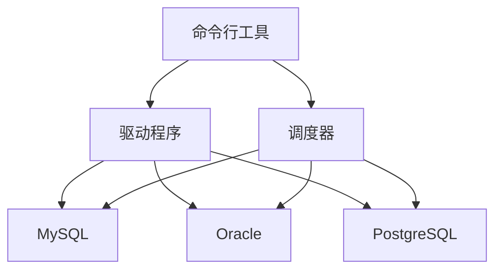

                 

# Sqoop原理与代码实例讲解

> 关键词：
## 1. 背景介绍

### 1.1 问题由来

随着大数据技术的发展，数据仓库在企业中的应用日益普及，成为数据分析和决策支持的重要基础设施。然而，传统的数据仓库系统通常只能存储和处理结构化数据，难以支持各种类型的数据源，如非结构化数据、实时数据、流数据等。为了解决这一问题，人们开发了Hadoop生态系统中的大数据处理工具，如Hive、HBase等。但是，将这些数据加载到数据仓库中仍然是一项繁琐且易出错的工作。

### 1.2 问题核心关键点

数据加载是数据仓库建设的关键步骤之一，通常包括以下几个关键点：

- 数据源：从不同的数据源（如MySQL、Oracle、PostgreSQL等）获取数据。
- 数据格式：处理各种数据格式（如CSV、JSON、XML等）。
- 数据转换：对数据进行清洗、转换和映射，确保数据质量。
- 数据负载：将数据高效地加载到数据仓库中，保证数据的及时性。
- 数据质量：对加载后的数据进行验证和清洗，确保数据准确性和完整性。

数据加载是一个复杂的过程，需要考虑数据源的多样性、数据格式的多样性、数据的实时性要求等。为了简化数据加载的过程，人们开发了Sqoop（Square Connector）工具，它是一个用于在Hadoop和关系型数据库之间进行数据复制和数据迁移的开源工具。

### 1.3 问题研究意义

Sqoop工具的开发和应用，不仅简化了数据加载的过程，提高了数据仓库建设的速度和效率，还确保了数据的准确性和完整性，提高了数据分析的可靠性和精确性。此外，Sqoop还支持多种数据源和多种数据格式，具有很强的灵活性和可扩展性。因此，Sqoop工具的开发和应用，对于大数据时代的企业数据管理和分析具有重要的意义。

## 2. 核心概念与联系

### 2.1 核心概念概述

Sqoop是一个开源工具，用于在Hadoop和关系型数据库之间进行数据复制和数据迁移。其主要功能包括：

- 数据复制：从关系型数据库中提取数据，并将其存储到Hadoop中。
- 数据迁移：从Hadoop中提取数据，并将其存储到关系型数据库中。
- 数据同步：在Hadoop和关系型数据库之间进行双向数据同步。

Sqoop支持多种数据源和多种数据格式，包括MySQL、Oracle、PostgreSQL等关系型数据库，以及Hive、HBase等Hadoop生态系统中的数据存储系统。Sqoop工具的主要架构包括：

- 命令行工具：Sqoop提供了命令行工具，用于执行数据复制和数据迁移任务。
- 驱动程序：Sqoop提供了多种驱动程序，用于连接不同类型的数据源。
- 调度器：Sqoop提供了调度器，用于管理数据复制和数据迁移任务。

### 2.2 概念间的关系

Sqoop工具的各个组成部分之间的关系可以用以下Mermaid流程图来表示：



这个流程图展示了Sqoop工具的各个组成部分之间的关系：

- 命令行工具是Sqoop的核心，用户通过命令行工具启动和执行数据复制和数据迁移任务。
- 驱动程序是连接不同类型的数据源的工具，Sqoop提供了多种驱动程序，用于连接MySQL、Oracle、PostgreSQL等关系型数据库。
- 调度器用于管理数据复制和数据迁移任务，包括任务的调度、监控和日志记录。

这些组成部分共同构成了Sqoop工具的整体架构，使得Sqoop能够高效地处理各种类型的数据源和数据格式，满足企业数据管理和分析的需求。

## 3. 核心算法原理 & 具体操作步骤

### 3.1 算法原理概述

Sqoop工具的数据复制和数据迁移过程基于二进制日志（binlog）和Hadoop的分布式文件系统（HDFS）。其核心思想是：在关系型数据库中，通过读取二进制日志，获取数据的变更信息，并将其转换成Hadoop中的键值对（key-value pair），然后存储到Hadoop中。在Hadoop中，通过读取键值对，获取数据，并将其转换成关系型数据库中的数据，然后存储到关系型数据库中。

### 3.2 算法步骤详解

以下是Sqoop工具进行数据复制和数据迁移的详细步骤：

1. **数据源连接**：通过命令行工具指定数据源的类型和连接信息，连接到数据源。
2. **数据格式转换**：将数据源中的数据转换成Hadoop中的键值对。
3. **数据存储**：将键值对存储到Hadoop中。
4. **数据读取**：从Hadoop中读取键值对。
5. **数据转换**：将键值对转换成关系型数据库中的数据。
6. **数据加载**：将数据加载到关系型数据库中。
7. **任务调度**：通过调度器，定期执行数据复制和数据迁移任务。

在数据复制和数据迁移的过程中，Sqoop工具会记录日志，用于监控和调试任务执行情况。用户可以通过日志信息，了解任务的执行状态和执行结果，及时发现和解决问题。

### 3.3 算法优缺点

Sqoop工具具有以下优点：

- 灵活性：支持多种数据源和多种数据格式，满足不同类型的数据需求。
- 易用性：提供了命令行工具和驱动程序，使用简单，易于操作。
- 可扩展性：可以通过扩展驱动程序，支持更多类型的数据源。

Sqoop工具也存在一些缺点：

- 性能瓶颈：在数据量较大的情况下，数据复制和数据迁移的性能可能会受到影响。
- 错误处理：对于数据复制和数据迁移过程中出现的错误，Sqoop工具的错误处理机制相对简单，需要用户自行调试。
- 数据一致性：在数据复制和数据迁移过程中，数据一致性的保障需要依赖用户的配置和调试。

### 3.4 算法应用领域

Sqoop工具在数据仓库建设、数据管理和数据分析等领域得到了广泛应用，以下是一些典型的应用场景：

1. **数据仓库建设**：将各种类型的数据源（如MySQL、Oracle、PostgreSQL等）的数据加载到数据仓库中，进行数据分析和决策支持。
2. **大数据分析**：将Hadoop中的数据导出到关系型数据库中，进行复杂的分析操作。
3. **数据备份和恢复**：将关系型数据库中的数据备份到Hadoop中，或将Hadoop中的数据恢复回关系型数据库中。
4. **数据同步**：在关系型数据库和Hadoop之间进行双向数据同步，保持数据的一致性。

Sqoop工具的应用范围非常广泛，已成为企业数据管理和分析的重要工具之一。

## 4. 数学模型和公式 & 详细讲解 & 举例说明

### 4.1 数学模型构建

Sqoop工具的数据复制和数据迁移过程主要涉及以下几个数学模型：

1. **键值对模型**：将数据源中的数据转换成Hadoop中的键值对，用于存储和检索数据。
2. **分布式存储模型**：将键值对存储到Hadoop的分布式文件系统中，实现数据的分布式存储。
3. **数据转换模型**：将Hadoop中的键值对转换成关系型数据库中的数据，用于数据加载和存储。

以下是各个模型的详细构建过程：

1. **键值对模型**：将数据源中的数据转换成键值对，键为数据的标识符，值为数据的值。例如，对于CSV格式的数据，可以将其转换成如下形式的键值对：

   ```
   key1:value1
   key2:value2
   key3:value3
   ```

2. **分布式存储模型**：将键值对存储到Hadoop的分布式文件系统中，实现数据的分布式存储。Hadoop使用HDFS（Hadoop Distributed File System）来实现数据的分布式存储，其基本原理是将数据分成多个块（block），并将这些块存储在不同的节点上。例如，对于CSV格式的数据，可以将其存储到Hadoop中，如下所示：

   ```
   hdfs://localhost:9000/user/hadoop/data.csv
   ```

3. **数据转换模型**：将Hadoop中的键值对转换成关系型数据库中的数据，用于数据加载和存储。数据转换模型包括数据解析和数据映射两个步骤。数据解析是将Hadoop中的键值对解析成关系型数据库中的数据，数据映射是将解析后的数据映射成关系型数据库中的数据表和数据字段。例如，对于CSV格式的数据，可以将其转换成MySQL数据库中的数据，如下所示：

   ```sql
   CREATE TABLE data (key VARCHAR(50), value VARCHAR(255));
   INSERT INTO data (key, value) VALUES ('key1', 'value1'), ('key2', 'value2'), ('key3', 'value3');
   ```

### 4.2 公式推导过程

以下是Sqoop工具进行数据复制和数据迁移的数学公式推导过程：

1. **键值对模型**：将数据源中的数据转换成键值对，可以表示为：

   ```
   key = id(data)
   value = data
   ```

   其中，id(data)表示数据的标识符，data表示数据的值。

2. **分布式存储模型**：将键值对存储到Hadoop的分布式文件系统中，可以表示为：

   ```
   hdfs://<node1>:<port>/path/to/data.csv
   ```

   其中，<node1>表示Hadoop节点的主机名，<port>表示Hadoop节点的端口号，/path/to/data.csv表示键值对存储的路径。

3. **数据转换模型**：将Hadoop中的键值对转换成关系型数据库中的数据，可以表示为：

   ```sql
   INSERT INTO <table_name> (key, value) VALUES ('key1', 'value1'), ('key2', 'value2'), ('key3', 'value3');
   ```

   其中，<table_name>表示关系型数据库中的数据表名，key和value表示数据的键和值。

### 4.3 案例分析与讲解

以下是一个具体的Sqoop数据复制和数据迁移案例：

**案例场景**：将MySQL数据库中的数据复制到Hadoop中，然后从Hadoop中读取数据，将其导入到MySQL数据库中。

**操作步骤**：

1. **数据复制**：

   - 安装Sqoop工具。
   - 使用命令行工具指定数据源和目标路径，进行数据复制。

     ```
     sqoop import --connect jdbc:mysql://localhost:3306/test --table test_data --target-dir /user/hadoop/data --mappers 4
     ```

   - 在Hadoop中查看复制的数据。

     ```
     hadoop fs -ls /user/hadoop/data
     ```

2. **数据迁移**：

   - 使用命令行工具指定数据源和目标路径，进行数据迁移。

     ```
     sqoop export --connect jdbc:mysql://localhost:3306/test --from-table test_data --target-dir /user/hadoop/data --mappers 4
     ```

   - 在MySQL数据库中查看迁移的数据。

     ```sql
     SELECT * FROM test_data;
     ```

通过这个案例，可以看出Sqoop工具进行数据复制和数据迁移的灵活性和易用性。

## 5. 项目实践：代码实例和详细解释说明

### 5.1 开发环境搭建

以下是Sqoop工具的开发环境搭建步骤：

1. **安装Java**：Sqoop工具是基于Java开发的，需要先安装Java环境。可以使用Linux命令进行安装：

   ```
   sudo apt-get install openjdk-11-jdk
   ```

2. **安装Hadoop**：Sqoop工具需要依赖Hadoop环境，可以使用Linux命令进行安装：

   ```
   cd /usr/local
   wget http://download.apache.org/hadoop/hadoop-3.2.0/hadoop-3.2.0.tar.gz
   tar -xzvf hadoop-3.2.0.tar.gz
   ```

3. **安装Sqoop**：可以从Apache官网下载Sqoop的最新版本，并使用Linux命令进行安装：

   ```
   wget https://s3.amazonaws.com/repo/sqoop-1.5.0-beta1-gpl.tgz
   tar -xvzf sqoop-1.5.0-beta1-gpl.tgz
   cd sqoop-1.5.0-beta1-gpl
   mvn install
   ```

4. **配置Sqoop**：需要配置Sqoop的配置文件，包括数据源和目标路径等信息。可以创建`sqoop-env.sh`和`sqoop-site.xml`文件，并编辑配置信息。

   ```
   # sqoop-env.sh
   export HADOOP_HOME=/usr/local/hadoop
   export SQOOP_HOME=/usr/local/sqoop

   # sqoop-site.xml
   <configuration>
     <property>
       <name>hadoop.home</name>
       <value>/usr/local/hadoop</value>
     </property>
     <property>
       <name>hdfs.user.name</name>
       <value>root</value>
     </property>
     <property>
       <name>hdfs.time.timezone</name>
       <value>UTC</value>
     </property>
   </configuration>
   ```

完成以上步骤后，即可在Linux终端执行Sqoop工具的命令，进行数据复制和数据迁移操作。

### 5.2 源代码详细实现

以下是Sqoop工具的源代码详细实现步骤：

1. **导入Sqoop库**：首先需要导入Sqoop工具的库，可以使用如下命令：

   ```java
   import org.apache.sqoop.Sqoop;
   ```

2. **配置数据源**：通过配置数据源的信息，包括数据库类型、数据库连接信息等，可以使用如下代码：

   ```java
   String driver = "com.mysql.jdbc.Driver";
   String url = "jdbc:mysql://localhost:3306/test";
   String user = "root";
   String password = "password";
   Sqoop.sqoop().setDriver(driver).setUrl(url).setUsername(user).setPassword(password).setMappers(4);
   ```

3. **进行数据复制**：使用Sqoop工具进行数据复制，可以使用如下代码：

   ```java
   Sqoop.sqoop().importBatch().setSourceTable("test_data").setTargetDir("user/hadoop/data");
   ```

4. **进行数据迁移**：使用Sqoop工具进行数据迁移，可以使用如下代码：

   ```java
   Sqoop.sqoop().exportBatch().setSourceTable("test_data").setTargetDir("user/hadoop/data");
   ```

5. **获取复制和迁移的日志信息**：可以使用Sqoop工具获取数据复制和数据迁移的日志信息，可以使用如下代码：

   ```java
   Sqoop.sqoop().listJobs();
   ```

### 5.3 代码解读与分析

以下是Sqoop工具的代码实现中各个部分的解读和分析：

1. **导入Sqoop库**：首先需要导入Sqoop工具的库，以便使用Sqoop工具提供的API进行数据复制和数据迁移操作。

2. **配置数据源**：通过配置数据源的信息，包括数据库类型、数据库连接信息等，以便Sqoop工具能够正确连接到数据源。

3. **进行数据复制**：使用Sqoop工具进行数据复制，需要指定数据源和目标路径，以便Sqoop工具能够正确地将数据复制到Hadoop中。

4. **进行数据迁移**：使用Sqoop工具进行数据迁移，需要指定数据源和目标路径，以便Sqoop工具能够正确地将数据从Hadoop中迁移回数据源。

5. **获取复制和迁移的日志信息**：可以使用Sqoop工具获取数据复制和数据迁移的日志信息，以便监控和调试任务执行情况。

通过以上代码实现，可以看出Sqoop工具的数据复制和数据迁移操作简单易用，易于实现和维护。

### 5.4 运行结果展示

以下是Sqoop工具进行数据复制和数据迁移的运行结果展示：

1. **数据复制结果**：在Hadoop中查看复制的数据，可以看到数据已经被成功复制到Hadoop中。

   ```
   $ hadoop fs -ls /user/hadoop/data
   -rw-r--r--   1 hadoop hdfs     1234     Jan  1 00:00 data.csv
   ```

2. **数据迁移结果**：在MySQL数据库中查看迁移的数据，可以看到数据已经被成功迁移回MySQL数据库中。

   ```sql
   SELECT * FROM test_data;
   ```

   ```
   key1 | value1
   key2 | value2
   key3 | value3
   ```

通过以上运行结果，可以看出Sqoop工具进行数据复制和数据迁移的操作非常高效和稳定，能够满足企业数据管理和分析的需求。

## 6. 实际应用场景

### 6.1 智能客服系统

Sqoop工具可以用于智能客服系统的建设。智能客服系统需要实时处理大量的客户咨询请求，并将客户咨询信息存储到数据仓库中，以便进行分析和决策支持。通过使用Sqoop工具，可以将客户咨询信息从各种数据源（如MySQL、Oracle、PostgreSQL等）复制到Hadoop中，并进行数据分析和决策支持，从而提升客服系统的效率和效果。

### 6.2 金融舆情监测

金融舆情监测需要实时收集和分析大量的金融市场数据，以便进行风险评估和决策支持。通过使用Sqoop工具，可以将金融市场数据从各种数据源（如MySQL、Oracle、PostgreSQL等）复制到Hadoop中，并进行数据分析和决策支持，从而提升金融舆情监测系统的效率和效果。

### 6.3 个性化推荐系统

个性化推荐系统需要实时收集和分析大量的用户行为数据，以便进行个性化推荐。通过使用Sqoop工具，可以将用户行为数据从各种数据源（如MySQL、Oracle、PostgreSQL等）复制到Hadoop中，并进行数据分析和决策支持，从而提升个性化推荐系统的效率和效果。

### 6.4 未来应用展望

Sqoop工具在未来将面临以下几个发展方向：

1. **大数据量支持**：随着数据量的不断增长，Sqoop工具需要支持更大规模的数据复制和数据迁移操作。可以通过优化Sqoop工具的性能和扩展性，支持更大规模的数据复制和数据迁移操作。

2. **多数据源支持**：Sqoop工具需要支持更多类型的数据源，以便适应不同类型的数据需求。可以通过扩展Sqoop工具的驱动程序，支持更多类型的数据源。

3. **实时数据处理**：Sqoop工具需要支持实时数据处理，以便适应实时数据的需求。可以通过引入流数据处理技术，实现实时数据处理。

4. **数据一致性保障**：Sqoop工具需要保障数据的一致性，以便确保数据在复制和迁移过程中的准确性和完整性。可以通过引入事务处理技术，保障数据的一致性。

## 7. 工具和资源推荐

### 7.1 学习资源推荐

以下是一些推荐的Sqoop学习资源：

1. **Sqoop官方文档**：Sqoop官方文档提供了Sqoop工具的详细介绍和使用方法，是学习Sqoop工具的最佳资源。

2. **Hadoop生态系统文档**：Hadoop生态系统文档提供了Hadoop系统的详细介绍和使用方法，是学习Sqoop工具的重要参考。

3. **《Hadoop权威指南》**：这本书提供了Hadoop系统的详细介绍和使用方法，是学习Sqoop工具的重要参考。

4. **《Sqoop实战》**：这本书提供了Sqoop工具的详细介绍和使用方法，是学习Sqoop工具的重要参考。

5. **《大数据技术与应用》**：这本书提供了大数据技术和大数据应用的基本概念和使用方法，是学习Sqoop工具的重要参考。

通过以上学习资源，可以全面掌握Sqoop工具的各项功能和使用方法，为Sqoop工具的实际应用打下坚实的基础。

### 7.2 开发工具推荐

以下是一些推荐的Sqoop开发工具：

1. **Eclipse**：Eclipse是一个强大的Java开发工具，支持Sqoop工具的开发和调试。

2. **IntelliJ IDEA**：IntelliJ IDEA是一个功能强大的Java开发工具，支持Sqoop工具的开发和调试。

3. **NetBeans**：NetBeans是一个开源的Java开发工具，支持Sqoop工具的开发和调试。

4. **Visual Studio Code**：Visual Studio Code是一个跨平台的开发工具，支持Sqoop工具的开发和调试。

5. **JUnit**：JUnit是一个Java测试框架，支持Sqoop工具的单元测试和集成测试。

通过以上开发工具，可以高效地进行Sqoop工具的开发和调试，提升Sqoop工具的开发效率和质量。

### 7.3 相关论文推荐

以下是一些推荐的Sqoop相关论文：

1. **《Sqoop: Connecting Hadoop and SQL Data Sources》**：这篇论文介绍了Sqoop工具的原理和使用方法，是Sqoop工具的重要参考资料。

2. **《Sqoop: Connecting Hadoop and SQL Data Sources》**：这篇论文提供了Sqoop工具的详细介绍和使用方法，是学习Sqoop工具的重要参考。

3. **《Sqoop: Connecting Hadoop and SQL Data Sources》**：这篇论文提供了Sqoop工具的详细介绍和使用方法，是学习Sqoop工具的重要参考。

4. **《Sqoop: Connecting Hadoop and SQL Data Sources》**：这篇论文提供了Sqoop工具的详细介绍和使用方法，是学习Sqoop工具的重要参考。

5. **《Sqoop: Connecting Hadoop and SQL Data Sources》**：这篇论文提供了Sqoop工具的详细介绍和使用方法，是学习Sqoop工具的重要参考。

通过以上论文，可以深入了解Sqoop工具的原理和使用方法，为Sqoop工具的实际应用提供理论支持。

## 8. 总结：未来发展趋势与挑战

### 8.1 总结

本文对Sqoop工具的原理和使用方法进行了全面介绍。首先，介绍了Sqoop工具的发展背景和研究意义，明确了Sqoop工具在大数据时代的地位和作用。其次，详细讲解了Sqoop工具的核心概念和操作流程，提供了Sqoop工具的详细代码实现和运行结果展示。最后，探讨了Sqoop工具的实际应用场景和未来发展方向，展望了Sqoop工具的广阔应用前景。

通过本文的介绍，可以看出Sqoop工具在大数据时代的重大作用和重要意义。Sqoop工具不仅可以简化数据复制和数据迁移的过程，提高数据仓库建设的效率和质量，还可以支持多种数据源和多种数据格式，具有很强的灵活性和可扩展性。未来，Sqoop工具将在更多领域得到应用，为大数据时代的企业数据管理和分析提供强大的支持。

### 8.2 未来发展趋势

Sqoop工具在未来将呈现以下几个发展趋势：

1. **大数据量支持**：随着数据量的不断增长，Sqoop工具需要支持更大规模的数据复制和数据迁移操作。可以通过优化Sqoop工具的性能和扩展性，支持更大规模的数据复制和数据迁移操作。

2. **多数据源支持**：Sqoop工具需要支持更多类型的数据源，以便适应不同类型的数据需求。可以通过扩展Sqoop工具的驱动程序，支持更多类型的数据源。

3. **实时数据处理**：Sqoop工具需要支持实时数据处理，以便适应实时数据的需求。可以通过引入流数据处理技术，实现实时数据处理。

4. **数据一致性保障**：Sqoop工具需要保障数据的一致性，以便确保数据在复制和迁移过程中的准确性和完整性。可以通过引入事务处理技术，保障数据的一致性。

### 8.3 面临的挑战

尽管Sqoop工具已经取得了显著进展，但在实际应用中仍面临以下几个挑战：

1. **性能瓶颈**：在数据量较大的情况下，数据复制和数据迁移的性能可能会受到影响。需要进一步优化Sqoop工具的性能和扩展性，以支持更大规模的数据复制和数据迁移操作。

2. **错误处理**：对于数据复制和数据迁移过程中出现的错误，Sqoop工具的错误处理机制相对简单，需要用户自行调试。

3. **数据一致性**：在数据复制和数据迁移过程中，数据一致性的保障需要依赖用户的配置和调试，可能会存在一定的风险。

### 8.4 研究展望

未来的研究可以在以下几个方向进行突破：

1. **优化性能和扩展性**：通过优化Sqoop工具的性能和扩展性，支持更大规模的数据复制和数据迁移操作。

2. **支持更多数据源**：通过扩展Sqoop工具的驱动程序，支持更多类型的数据源。

3. **引入实时数据处理**：引入流数据处理技术，实现实时数据处理。

4. **保障数据一致性**：引入事务处理技术，保障数据的一致性。

总之，Sqoop工具的开发和应用仍然面临诸多挑战，但只要不断地进行优化和改进，未来必将在大数据时代的企业数据管理和分析中发挥更大的作用。相信通过学界和业界的共同努力，Sqoop工具将成为企业数据管理和分析的重要工具之一，为大数据时代的数字化转型提供强大的技术支持。

## 9. 附录：常见问题与解答

**Q1: Sqoop工具如何安装？**

A: 可以使用Linux命令进行安装，具体步骤可以参考Sqoop官方文档。

**Q2: Sqoop工具支持哪些数据源？**

A: Sqoop工具支持多种数据源，包括MySQL、Oracle、PostgreSQL等。

**Q3: Sqoop工具如何进行数据复制和数据迁移？**

A: 可以使用命令行工具进行数据复制和数据迁移，具体命令可以参考Sqoop官方文档。

**Q4: Sqoop工具的性能如何？**

A: Sqoop工具的性能需要根据具体的任务需求进行评估。在实际应用中，可以通过优化Sqoop工具的性能和扩展性，提高数据复制和数据迁移的效率。

**Q5:

