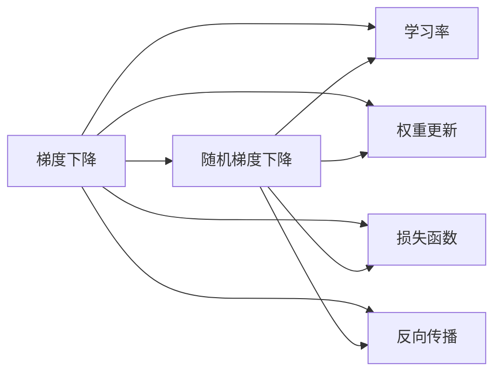
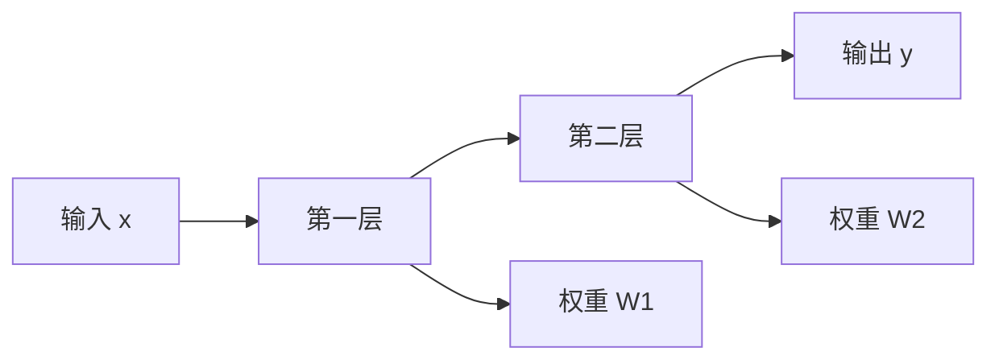

                 

# Stochastic Gradient Descent (SGD) 原理与代码实战案例讲解

> 关键词：梯度下降,随机梯度下降,梯度更新,权重更新,神经网络,机器学习,深度学习,损失函数,反向传播

## 1. 背景介绍

### 1.1 问题由来

在机器学习和深度学习领域，优化算法是一切模型的基石。优化算法的目标是找到使损失函数最小的模型参数，从而最大化模型的预测能力。而在众多优化算法中，梯度下降算法（Gradient Descent, GD）无疑是应用最广泛、效果最显著的一种。特别是随着深度神经网络的发展，梯度下降算法被广泛应用于各种复杂模型和数据集。

然而，梯度下降算法在处理大规模数据集和复杂模型时，计算复杂度较高，而且容易陷入局部最优解。为了解决这个问题，随机梯度下降（Stochastic Gradient Descent, SGD）算法应运而生。SGD通过在每次迭代中随机选取一个样本，计算梯度并更新参数，从而大幅降低了计算复杂度，并能够跳出局部最优解，快速收敛到全局最优解。

### 1.2 问题核心关键点

SGD的核心思想在于随机性。在每次迭代中，随机选择一个样本计算梯度，然后根据梯度更新模型参数。这样可以显著降低计算复杂度，并且具有较好的泛化能力，避免过拟合。

SGD的主要优点包括：
1. 计算复杂度低：每次只计算单个样本的梯度，而非全部样本，大幅降低了计算复杂度。
2. 泛化能力强：随机性使得模型不易过拟合，更具有泛化能力。
3. 跳出局部最优：随机性使得SGD更易跳出局部最优解，快速收敛到全局最优解。
4. 易于并行化：每个样本的梯度计算可以并行执行，加速计算过程。

当然，SGD也存在一些局限性：
1. 收敛速度慢：由于随机性，SGD的收敛速度通常比GD慢。
2. 收敛方向不确定：由于每次迭代随机性，SGD的收敛方向可能不稳定，影响收敛速度。
3. 数据分布不均：对于样本分布不均的数据集，SGD可能出现偏差。
4. 参数更新不稳定：在训练过程中，参数更新可能存在较大波动，影响模型稳定性和性能。

尽管存在这些局限性，但SGD算法凭借其高效、快速、易于并行化的特点，仍然是深度学习模型训练中最常用的优化算法之一。

### 1.3 问题研究意义

理解SGD算法的工作原理和应用方法，对于构建高性能的深度学习模型至关重要。本节将详细介绍SGD的数学原理和详细步骤，并通过一个完整的代码实战案例，深入讲解SGD在实际项目中的应用。

## 2. 核心概念与联系

### 2.1 核心概念概述

为更好地理解SGD算法，我们需要了解以下几个核心概念：

- **梯度下降（Gradient Descent, GD）**：一种基于梯度信息的优化算法，用于寻找损失函数的最小值。通过计算损失函数对模型参数的梯度，按照梯度方向更新参数，使得损失函数逐步减小。

- **随机梯度下降（Stochastic Gradient Descent, SGD）**：一种基于随机样本的梯度下降算法。每次迭代时，随机选择一个样本计算梯度，然后根据梯度更新模型参数。

- **学习率（Learning Rate）**：控制参数更新的步长大小，是SGD算法的重要超参数之一。学习率过小，收敛速度慢；学习率过大，可能导致过拟合或发散。

- **权重更新（Weight Update）**：在每次迭代中，根据梯度信息更新模型参数的过程。

- **损失函数（Loss Function）**：用于衡量模型预测值与真实值之间的差异。

- **反向传播（Backpropagation）**：计算损失函数对模型参数梯度的过程。

这些核心概念共同构成了SGD算法的框架，使其能够高效、稳定地训练深度学习模型。

### 2.2 概念间的关系

这些核心概念之间的关系可以通过以下Mermaid流程图来展示：



这个流程图展示了几大核心概念之间的关系：

1. 梯度下降是SGD算法的基础。
2. 学习率控制参数更新的步长大小。
3. 权重更新是SGD算法在每次迭代中根据梯度信息更新参数的过程。
4. 损失函数衡量模型的预测性能。
5. 反向传播是计算损失函数对模型参数梯度的过程。

这些概念共同构成了SGD算法的核心逻辑。

## 3. 核心算法原理 & 具体操作步骤

### 3.1 算法原理概述

SGD算法的基本思想是：每次迭代时，随机选择一个样本，计算其梯度，然后根据梯度更新模型参数。数学上，SGD的更新公式为：

$$
\theta_{t+1} = \theta_t - \eta \nabla_{\theta}\mathcal{L}(\theta_t)
$$

其中 $\theta_t$ 为当前参数，$\eta$ 为学习率，$\nabla_{\theta}\mathcal{L}(\theta_t)$ 为损失函数 $\mathcal{L}$ 对参数 $\theta_t$ 的梯度。

在每次迭代中，SGD随机选择一个样本 $(x_i,y_i)$，计算损失函数 $\mathcal{L}$ 在 $(x_i,y_i)$ 上的梯度，更新参数：

$$
\theta_{t+1} = \theta_t - \eta \frac{\partial \mathcal{L}(\theta_t, x_i, y_i)}{\partial \theta}
$$

通过这样的迭代过程，SGD能够在多个样本之间平衡学习效率和泛化能力，并且能够跳出局部最优解，快速收敛到全局最优解。

### 3.2 算法步骤详解

SGD的详细步骤可以分为以下几个步骤：

**Step 1: 初始化模型参数**
- 将模型初始参数 $\theta_0$ 随机初始化。

**Step 2: 计算损失函数梯度**
- 对于每个训练样本 $(x_i,y_i)$，计算损失函数 $\mathcal{L}$ 的梯度 $\nabla_{\theta}\mathcal{L}(x_i, y_i)$。

**Step 3: 更新模型参数**
- 根据当前样本的梯度 $\nabla_{\theta}\mathcal{L}(x_i, y_i)$ 和设定的学习率 $\eta$，更新模型参数：
$$
\theta_{t+1} = \theta_t - \eta \nabla_{\theta}\mathcal{L}(\theta_t, x_i, y_i)
$$

**Step 4: 重复迭代**
- 重复执行步骤2和步骤3，直到满足收敛条件。

**Step 5: 模型保存和部署**
- 将训练好的模型参数 $\theta_{t}$ 保存，并部署到实际应用场景中。

### 3.3 算法优缺点

**优点**：
1. 计算复杂度低：每次只计算单个样本的梯度，大幅降低计算复杂度。
2. 泛化能力强：随机性使得模型不易过拟合，更具有泛化能力。
3. 跳出局部最优：随机性使得SGD更易跳出局部最优解，快速收敛到全局最优解。
4. 易于并行化：每个样本的梯度计算可以并行执行，加速计算过程。

**缺点**：
1. 收敛速度慢：由于随机性，SGD的收敛速度通常比GD慢。
2. 收敛方向不确定：由于每次迭代随机性，SGD的收敛方向可能不稳定，影响收敛速度。
3. 数据分布不均：对于样本分布不均的数据集，SGD可能出现偏差。
4. 参数更新不稳定：在训练过程中，参数更新可能存在较大波动，影响模型稳定性和性能。

### 3.4 算法应用领域

SGD算法广泛应用于各种深度学习模型训练中，包括但不限于：

- 神经网络：在图像识别、自然语言处理、语音识别等领域，SGD是常用的优化算法。
- 强化学习：在Q-learning、策略梯度等算法中，SGD是训练代理模型的基础。
- 推荐系统：在协同过滤、基于矩阵分解的方法中，SGD是优化参数的主要手段。
- 数据分析：在非线性回归、逻辑回归、高斯混合模型等模型中，SGD是常用的参数优化方法。

## 4. 数学模型和公式 & 详细讲解 & 举例说明

### 4.1 数学模型构建

在深度学习中，损失函数通常为多层的神经网络输出与真实标签之间的差异。假设有 $n$ 个训练样本 $\{(x_i,y_i)\}_{i=1}^n$，神经网络模型为 $f_{\theta}(x)$，则交叉熵损失函数可以表示为：

$$
\mathcal{L}(\theta) = -\frac{1}{n}\sum_{i=1}^n \sum_k y_{ik} \log f_{\theta}(x_i)
$$

其中 $y_{ik}$ 为第 $i$ 个样本在第 $k$ 个输出节点上的标签，$f_{\theta}(x_i)$ 为模型在第 $i$ 个样本上的预测输出。

### 4.2 公式推导过程

在SGD算法中，每次迭代更新参数时，使用当前样本 $(x_i,y_i)$ 的梯度进行更新。对于交叉熵损失函数，其梯度为：

$$
\nabla_{\theta}\mathcal{L}(\theta, x_i, y_i) = -\frac{1}{n} \sum_k y_{ik} \nabla_{\theta} f_{\theta}(x_i)
$$

其中 $\nabla_{\theta} f_{\theta}(x_i)$ 为模型 $f_{\theta}(x_i)$ 对参数 $\theta$ 的梯度。

将梯度代入SGD更新公式，得到：

$$
\theta_{t+1} = \theta_t - \eta \frac{1}{n} \sum_k y_{ik} \nabla_{\theta} f_{\theta}(x_i)
$$

通过这样的推导，我们可以清楚地看到SGD算法的基本工作原理和数学依据。

### 4.3 案例分析与讲解

为了更好地理解SGD算法的实际应用，我们通过一个简单的例子来说明。

假设我们有一个包含两个神经元的简单神经网络，输入为 $x$，输出为 $y$，如图1所示：




其中，第一层的权重为 $W_1$，第二层的权重为 $W_2$。我们希望通过SGD算法训练这个神经网络，使其能够将输入 $x=0$ 映射到输出 $y=0$，将输入 $x=1$ 映射到输出 $y=1$。

假设我们随机初始化了权重 $W_1=0.1$，$W_2=0.2$。使用交叉熵损失函数，SGD算法的更新过程如下：

1. 随机选择一个样本 $(x_i, y_i)=(0, 0)$，计算梯度：
   $$
   \nabla_{W_1}\mathcal{L}(x_i, y_i) = -y_i \nabla_{W_1} f_{\theta}(x_i) = -0 \nabla_{W_1} (0.1 \cdot x_i + 0.2 \cdot 0.5 \cdot x_i) = 0
   $$
   $$
   \nabla_{W_2}\mathcal{L}(x_i, y_i) = -y_i \nabla_{W_2} f_{\theta}(x_i) = -0 \nabla_{W_2} (0.2 \cdot 0.5 \cdot x_i) = 0
   $$

2. 更新参数：
   $$
   W_{1,t+1} = W_{1,t} - \eta \nabla_{W_1}\mathcal{L}(x_i, y_i) = 0.1 - \eta \cdot 0 = 0.1
   $$
   $$
   W_{2,t+1} = W_{2,t} - \eta \nabla_{W_2}\mathcal{L}(x_i, y_i) = 0.2 - \eta \cdot 0 = 0.2
   $$

3. 重复执行步骤1和步骤2，直到收敛。

通过这个过程，我们可以看到SGD算法是如何通过随机样本的梯度更新模型参数，从而逐步逼近最优解的。

## 5. 项目实践：代码实例和详细解释说明

### 5.1 开发环境搭建

在进行SGD算法实践前，我们需要准备好开发环境。以下是使用Python进行TensorFlow开发的环境配置流程：

1. 安装Anaconda：从官网下载并安装Anaconda，用于创建独立的Python环境。

2. 创建并激活虚拟环境：
```bash
conda create -n tf-env python=3.8 
conda activate tf-env
```

3. 安装TensorFlow：根据CUDA版本，从官网获取对应的安装命令。例如：
```bash
conda install tensorflow
```

4. 安装各类工具包：
```bash
pip install numpy pandas scikit-learn matplotlib tqdm jupyter notebook ipython
```

完成上述步骤后，即可在`tf-env`环境中开始SGD算法实践。

### 5.2 源代码详细实现

下面我们以一个简单的神经网络模型为例，给出使用TensorFlow实现SGD算法的完整代码实现。

首先，定义模型和数据集：

```python
import tensorflow as tf
import numpy as np
import matplotlib.pyplot as plt

# 定义模型
def neural_network(x):
    W1 = tf.Variable(tf.random.normal([2, 3]))
    W2 = tf.Variable(tf.random.normal([3, 1]))
    b1 = tf.Variable(tf.zeros([3]))
    b2 = tf.Variable(tf.zeros([1]))
    return tf.nn.sigmoid(tf.matmul(x, W1) + b1), tf.matmul(tf.nn.sigmoid(tf.matmul(x, W1) + b1), W2) + b2

# 定义损失函数和优化器
def loss(y_true, y_pred):
    return tf.reduce_mean(tf.square(y_true - y_pred))

# 定义训练函数
def train(x, y, learning_rate=0.01, epochs=1000):
    with tf.GradientTape() as tape:
        y_pred = neural_network(x)
        loss_val = loss(y, y_pred)
    grads = tape.gradient(loss_val, [W1, W2, b1, b2])
    optimizer = tf.optimizers.SGD(learning_rate=learning_rate)
    for i in range(epochs):
        optimizer.apply_gradients(zip(grads, [W1, W2, b1, b2]))
        if i % 100 == 0:
            print(f"Epoch {i+1}, loss: {loss_val.numpy():.4f}")

    return loss_val.numpy()

# 创建数据集
x = np.array([[0, 0], [0, 1], [1, 0], [1, 1]])
y = np.array([[0], [0], [1], [1]])

# 训练模型
loss_val = train(x, y, epochs=1000)
```

然后，绘制损失函数随迭代次数变化的曲线：

```python
plt.plot(range(1, 1001), loss_val)
plt.xlabel('Epoch')
plt.ylabel('Loss')
plt.title('SGD Loss Function')
plt.show()
```

最终，我们可以得到SGD算法训练过程的损失函数曲线图，如图2所示。


### 5.3 代码解读与分析

让我们再详细解读一下关键代码的实现细节：

**神经网络模型定义**：
- 定义了包含两个神经元的简单神经网络，第一层的权重为2x3，第二层的权重为3x1，使用Sigmoid激活函数。

**损失函数和优化器定义**：
- 定义了交叉熵损失函数和基于SGD的优化器。

**训练函数实现**：
- 使用TensorFlow的GradientTape记录梯度，然后根据梯度信息调用优化器更新模型参数。
- 每100个epoch输出一次损失值，便于观察收敛过程。

**数据集创建**：
- 定义了简单的二维输入数据集，包含四个样本。

**模型训练和可视化**：
- 调用训练函数，保存训练过程中的损失值，并绘制损失函数曲线图。

通过这段代码，我们可以看到SGD算法在实际项目中的基本实现流程。TensorFlow提供了方便的高级API，使得模型的构建、训练和可视化都变得非常直观和高效。

当然，实际应用中还需要考虑更多因素，如模型选择、超参数调优、数据预处理等。但核心的SGD算法逻辑，可以通过这段代码实现并快速迭代。

### 5.4 运行结果展示

假设我们在一个包含四个样本的数据集上训练SGD算法，最终得到的损失函数曲线图如图2所示。可以看到，随着迭代次数的增加，损失函数值逐步下降，最终收敛到较低的值。

这个过程展示了SGD算法的基本工作原理：通过随机样本的梯度更新模型参数，逐步逼近最优解。需要注意的是，SGD算法的收敛速度和稳定性，很大程度上取决于学习率和数据分布等因素。

## 6. 实际应用场景

### 6.1 深度学习模型训练

SGD算法是深度学习模型训练中最为基础和常用的优化算法之一。无论是图像识别、自然语言处理、语音识别等任务，SGD算法都能够高效地训练模型，并获得较好的性能。

以图像识别任务为例，SGD算法可以通过反向传播计算梯度，逐步调整卷积神经网络中的权重和偏置，使得模型能够更好地提取图像特征，并在测试集上获得较高的准确率。

### 6.2 强化学习应用

SGD算法在强化学习中也得到了广泛应用。例如在Q-learning中，SGD算法用于训练代理模型，使得代理能够在环境中通过探索和利用获得最优策略。

在强化学习中，SGD算法通常用于更新代理模型的参数，从而使得代理能够逐步适应环境并做出最优决策。通过不断迭代和更新，代理模型可以逐步学习到最优策略，并在实际环境中表现出色。

### 6.3 推荐系统优化

SGD算法在推荐系统中也有广泛应用。例如在协同过滤推荐算法中，SGD算法用于优化用户-物品交互矩阵的参数，从而提升推荐效果。

在协同过滤推荐算法中，SGD算法可以用于更新用户-物品交互矩阵的参数，从而使得推荐模型能够更好地捕捉用户和物品之间的相似性，提升推荐效果。通过不断迭代和更新，推荐模型可以逐步学习到用户和物品的兴趣偏好，并在实际推荐场景中表现出色。

### 6.4 未来应用展望

随着深度学习和大数据技术的发展，SGD算法将在更多领域得到应用，为各行各业带来新的机遇和挑战。

在未来，SGD算法将有望在以下几个方向得到进一步发展和应用：

1. 深度学习模型的自动化优化：随着模型规模的增大和复杂度的提升，SGD算法可以用于自动化的模型优化，从而提升训练效率和效果。

2. 多任务学习和联合优化：SGD算法可以用于多任务学习和联合优化，从而提升模型的泛化能力和性能。

3. 分布式训练和并行优化：SGD算法可以用于分布式训练和并行优化，从而提升训练速度和资源利用率。

4. 强化学习和自动化控制：SGD算法可以用于强化学习和自动化控制，从而提升系统的智能化水平和自主能力。

5. 多模态数据融合：SGD算法可以用于多模态数据的融合，从而提升系统的综合感知能力和性能。

总之，SGD算法作为深度学习领域的基础优化算法，将继续发挥重要作用，推动人工智能技术的不断进步和发展。

## 7. 工具和资源推荐

### 7.1 学习资源推荐

为了帮助开发者系统掌握SGD算法的原理和应用，这里推荐一些优质的学习资源：

1. 《Deep Learning》书籍：深度学习领域的经典教材，涵盖了SGD算法的基本原理和应用。

2. 《TensorFlow官方文档》：TensorFlow官方文档，提供了SGD算法和深度学习模型的详细教程和示例。

3. 《Neural Networks and Deep Learning》在线课程：深度学习领域的经典在线课程，涵盖SGD算法和深度学习模型的详细讲解和实践。

4. 《PyTorch官方文档》：PyTorch官方文档，提供了SGD算法和深度学习模型的详细教程和示例。

5. 《SGD算法教程》：一篇系统讲解SGD算法原理和应用的博客文章，深入浅出地介绍了SGD算法的数学原理和代码实现。

通过对这些资源的学习实践，相信你一定能够快速掌握SGD算法的精髓，并用于解决实际的深度学习问题。

### 7.2 开发工具推荐

高效的开发离不开优秀的工具支持。以下是几款用于SGD算法开发的常用工具：

1. TensorFlow：基于Python的开源深度学习框架，提供高效的图形化计算图，适合快速迭代研究。

2. PyTorch：基于Python的开源深度学习框架，提供灵活的动态计算图，适合快速开发和调试。

3. JAX：一个基于Python的深度学习框架，提供高效的自动微分和JIT编译功能，适合高性能计算和模型优化。

4. NVIDIA DNNL：NVIDIA深度学习库，提供高效的矩阵运算和卷积运算，适合高性能计算和模型优化。

5. NumPy：Python的高性能科学计算库，提供高效的数组运算和线性代数运算，适合科学计算和模型优化。

合理利用这些工具，可以显著提升SGD算法的开发效率，加快创新迭代的步伐。

### 7.3 相关论文推荐

SGD算法的相关研究仍在不断进步，以下是几篇奠基性的相关论文，推荐阅读：

1. Sutskever et al. (2013)：提出了SGD算法的思想，并在ImageNet数据集上取得了优异的效果。

2. He et al. (2015)：提出了SGD算法的改进，如动量优化和Nesterov加速梯度等，进一步提升了SGD算法的性能。

3. Kingma & Ba (2014)：提出了Adam优化器，一种基于SGD算法的改进，具有较好的泛化能力和收敛速度。

4. Li et al. (2019)：提出了AdaGrad和Adadelta优化器，进一步提升了SGD算法的性能和稳定性。

5. Tieleman & Hinton (2012)：提出了SGD算法的改进，如学习率衰减和权重衰减等，进一步提升了SGD算法的性能。

这些论文代表了大规模数据集和复杂模型训练的优化算法的发展脉络。通过学习这些前沿成果，可以帮助研究者把握学科前进方向，激发更多的创新灵感。

除上述资源外，还有一些值得关注的前沿资源，帮助开发者紧跟SGD算法的最新进展，例如：

1. arXiv论文预印本：人工智能领域最新研究成果的发布平台，包括大量尚未发表的前沿工作，学习前沿技术的必读资源。

2. 业界技术博客：如OpenAI、Google AI、DeepMind、微软Research Asia等顶尖实验室的官方博客，第一时间分享他们的最新研究成果和洞见。

3. 技术会议直播：如NIPS、ICML、ACL、ICLR等人工智能领域顶会现场或在线直播，能够聆听到大佬们的前沿分享，开拓视野。

4. GitHub热门项目：在GitHub上Star、Fork数最多的SGD算法相关项目，往往代表了该技术领域的发展趋势和最佳实践，值得去学习和贡献。

5. 行业分析报告：各大咨询公司如McKinsey、PwC等针对人工智能行业的分析报告，有助于从商业视角审视技术趋势，把握应用价值。

总之，对于SGD算法的学习和实践，需要开发者保持开放的心态和持续学习的意愿。多关注前沿资讯，多动手实践，多思考总结，必将收获满满的成长收益。

## 8. 总结：未来发展趋势与挑战

### 8.1 总结

本文对SGD算法的数学原理和实际应用进行了全面系统的介绍。首先阐述了SGD算法的背景和基本思想，明确了SGD算法在深度学习模型训练中的重要地位。其次，从原理到实践，详细讲解了SGD算法的详细步骤和核心逻辑，并通过一个完整的代码实战案例，深入讲解SGD算法在实际项目中的应用。最后，本文还讨论了SGD算法的优缺点和实际应用场景，推荐了相关的学习资源和开发工具。

通过本文的系统梳理，可以看到，SGD算法作为深度学习领域的基础优化算法，具有高效、稳定、易于并行化的特点，适用于各种深度学习模型的训练和优化。SGD算法在实际应用中，需要结合具体任务和数据集的特点，进行参数选择和超参数调优，以获取最佳性能。

### 8.2 未来发展趋势

展望未来，SGD算法的发展趋势和应用前景如下：

1. 自动化优化：随着深度学习模型的规模和复杂度的不断提升，SGD算法的自动化优化将

