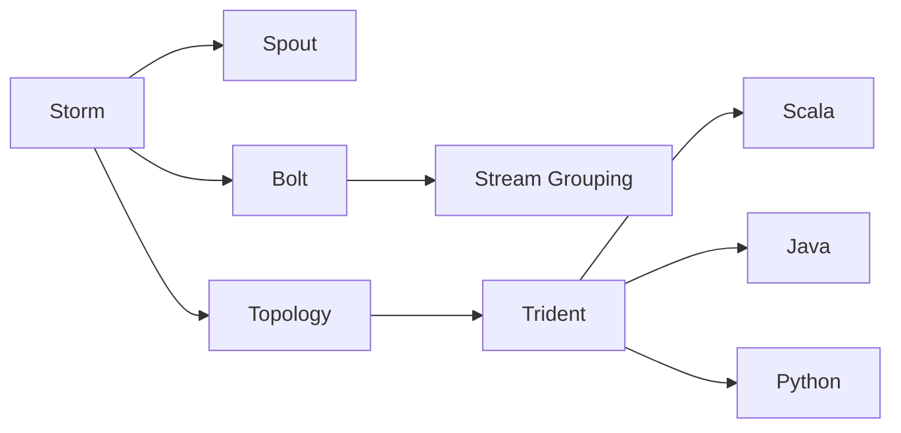
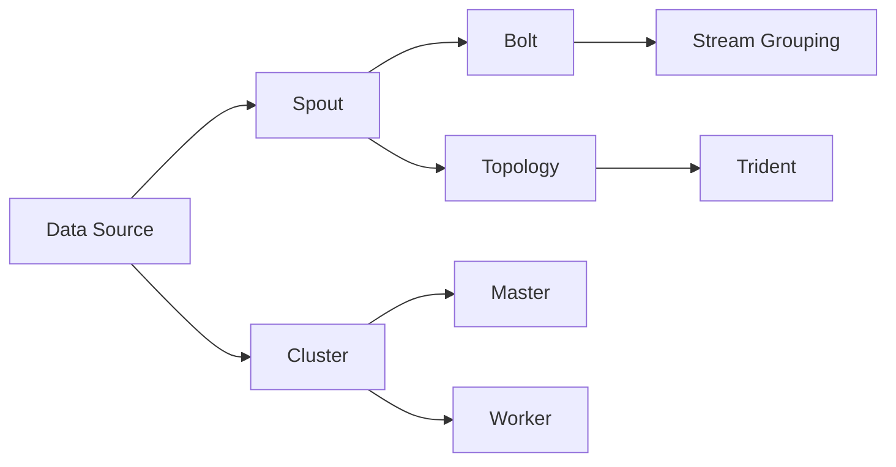
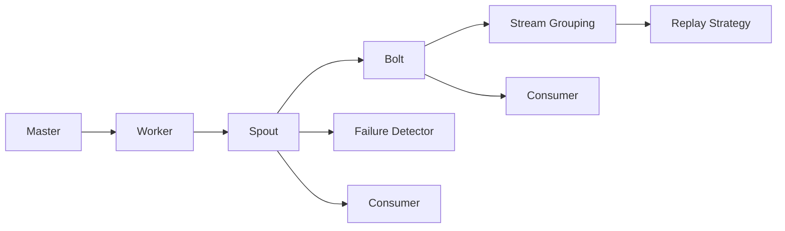
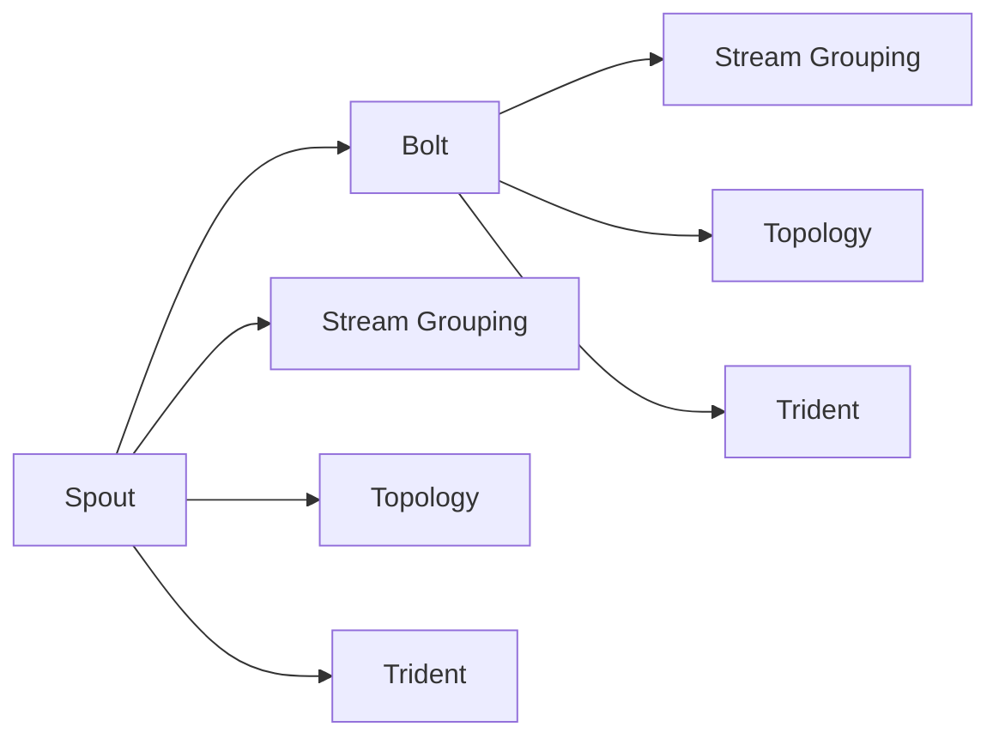
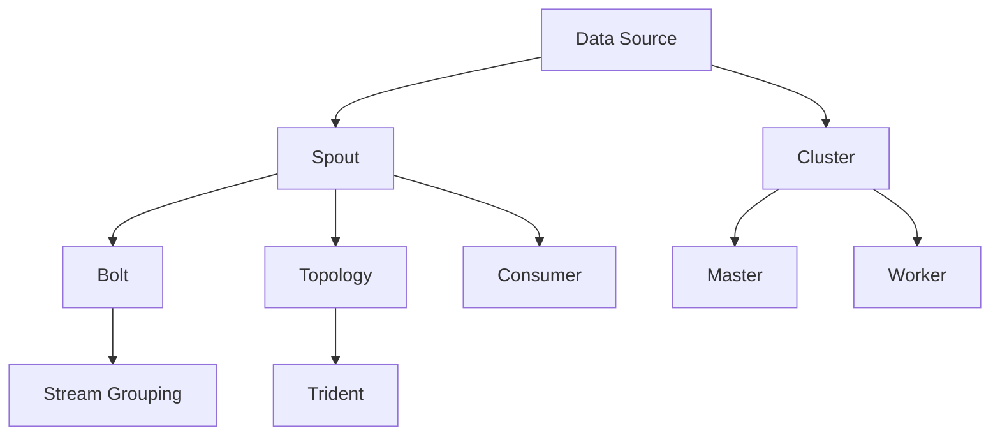

                 

# Storm原理与代码实例讲解

> 关键词：Storm,分布式实时计算,流式计算,容错处理,可扩展性

## 1. 背景介绍

### 1.1 问题由来
在现代数据时代，数据流和实时性要求越来越高，这使得传统的批处理计算方法无法满足需求。Storm是一款开源的分布式实时计算系统，专门设计用于处理实时数据流。Storm通过简单、灵活、可扩展的架构，实现了低延迟、高吞吐量的实时数据处理能力。Storm的核心思想是将数据流视作一组小消息，每个消息可以由多个进程并发处理，从而实现并行化计算。

Storm最早由Spotify于2011年发布，作为实时数据处理的开源解决方案。随后，Storm被Twitter、Facebook、GitHub等知名企业采用，广泛应用于实时数据处理、实时广告投放、金融交易分析、物联网等领域。

### 1.2 问题核心关键点
Storm的核心关键点包括：

- 分布式流处理：Storm利用分布式架构处理实时数据流，支持高吞吐量、低延迟的计算。
- 容错处理：Storm通过消息传递机制和局部一致性，保证系统容错性和稳定性。
- 可扩展性：Storm能够动态地添加或移除组件，实现系统水平扩展和垂直扩展。
- 丰富的组件生态：Storm支持多种组件，如Spout、Bolt、Stream Grouping等，满足不同的数据处理需求。
- 易用性：Storm提供易用的API和配置工具，降低了开发难度和运维复杂性。

Storm的核心架构思想是通过组件化设计和消息传递机制，实现了流式数据处理。Spout是数据源组件，用于从外部系统读取数据，Bolt是数据处理组件，用于对数据进行处理和分析，Stream Grouping定义了组件间的消息流传递关系。这种组件化设计使得Storm能够快速灵活地构建不同的数据处理流程。

### 1.3 问题研究意义
研究Storm原理与代码实例，对于理解分布式流式计算架构，掌握实时数据处理技术，具有重要意义：

1. 降低开发成本。Storm提供强大的组件和工具，可以大大降低数据处理的开发难度和时间。
2. 提升处理效率。Storm支持高吞吐量、低延迟的实时数据处理，满足企业对数据处理效率的需求。
3. 增强系统鲁棒性。Storm通过容错机制和分布式架构，保证系统的高可用性和稳定性。
4. 提升数据价值。Storm提供强大的数据处理能力，能够实时分析和利用数据，创造更多商业价值。
5. 赋能产业升级。Storm技术在金融、电商、社交网络等领域的应用，推动了传统行业向数字化转型的进程。

## 2. 核心概念与联系

### 2.1 核心概念概述

为更好地理解Storm原理与代码实例，本节将介绍几个密切相关的核心概念：

- Storm：开源分布式流处理系统，采用流式计算架构处理实时数据。
- Spout：数据源组件，从外部系统读取数据并生成数据流。
- Bolt：数据处理组件，对数据进行处理和分析。
- Stream Grouping：定义组件间的消息流传递关系，实现数据流传递和汇聚。
- Topology：由Spout和Bolt组成的计算图，定义了整个数据流处理流程。
- Trident：高级API，提供面向批处理的数据处理能力。
- Scala、Java、Python：Storm支持多种编程语言，方便开发者使用。

这些核心概念之间的逻辑关系可以通过以下Mermaid流程图来展示：



这个流程图展示了几大核心概念之间的逻辑关系：

1. Storm是分布式流式计算的核心，通过Spout和Bolt实现数据流的生成和处理。
2. Spout从外部系统读取数据，生成实时数据流。
3. Bolt对数据进行处理和分析，实现数据流的汇聚。
4. Stream Grouping定义了组件间的消息流传递关系，实现数据流的传递和汇聚。
5. Topology由Spout和Bolt组成，定义了整个数据流处理流程。
6. Trident提供了高级API，支持面向批处理的数据处理。
7. Storm支持多种编程语言，包括Scala、Java、Python等。

通过这些核心概念，可以更好地理解Storm的工作原理和架构设计。

### 2.2 概念间的关系

这些核心概念之间存在着紧密的联系，形成了Storm的核心架构体系。下面我们通过几个Mermaid流程图来展示这些概念之间的关系。

#### 2.2.1 Storm架构概览



这个流程图展示了Storm的基本架构：

1. 数据源通过Spout组件从外部系统读取数据。
2. 数据流通过Bolt组件进行处理和分析。
3. Stream Grouping定义了组件间的消息传递关系。
4. Topology由Spout和Bolt组成，定义了整个数据流处理流程。
5. Trident提供高级API，支持面向批处理的数据处理。
6. Storm采用分布式架构，由Master和Worker节点组成。

#### 2.2.2 Storm容错机制



这个流程图展示了Storm的容错机制：

1. Master负责整个集群的调度和管理。
2. Worker节点执行具体的计算任务。
3. Spout从外部系统读取数据，生成数据流。
4. Bolt对数据进行处理和分析。
5. Failure Detector检测组件的故障，并提供失败回退机制。
6. Replay Strategy定义了消息的重新处理策略。
7. Consumer从Bolt接收处理后的数据。

Storm通过Master节点和Worker节点组成的分布式架构，实现了高可用性和容错性。当某个Worker节点故障时，Master节点会自动分配任务给其他Worker节点，保证计算的连续性和稳定性。

#### 2.2.3 Storm的组件化设计



这个流程图展示了Storm的组件化设计：

1. Spout生成数据流。
2. Bolt处理数据流。
3. Stream Grouping定义了数据流传递关系。
4. Topology由Spout和Bolt组成，定义了整个数据流处理流程。
5. Trident提供高级API，支持面向批处理的数据处理。

Storm通过组件化设计，使得开发者可以灵活构建不同的数据处理流程。这种组件化设计使得Storm能够快速适应不同的数据处理需求，同时提高了系统的可维护性和可扩展性。

### 2.3 核心概念的整体架构

最后，我们用一个综合的流程图来展示这些核心概念在大数据流处理中的整体架构：



这个综合流程图展示了从数据源到数据消费的整个数据流处理过程。数据源通过Spout组件从外部系统读取数据，数据流通过Bolt组件进行处理和分析，Stream Grouping定义了组件间的消息传递关系，最终通过Trident提供面向批处理的数据处理能力。Master节点负责整个集群的调度和管理，Worker节点执行具体的计算任务，最终将处理结果传递给Consumer。

通过这些流程图，我们可以更清晰地理解Storm的工作原理和架构设计，为后续深入讨论具体的实现细节奠定基础。

## 3. 核心算法原理 & 具体操作步骤

### 3.1 算法原理概述

Storm的核心算法原理是分布式流式计算。其核心思想是将数据流视作一组小消息，每个消息可以由多个进程并发处理，从而实现并行化计算。

Storm的流式计算模型如下：

1. 数据源通过Spout组件从外部系统读取数据，生成数据流。
2. 数据流通过Bolt组件进行处理和分析，实现数据流的汇聚。
3. Stream Grouping定义了组件间的消息传递关系，实现数据流的传递和汇聚。
4. Master节点负责整个集群的调度和管理，Worker节点执行具体的计算任务。

Storm通过分布式架构和消息传递机制，实现了实时数据处理的低延迟、高吞吐量和高可用性。

### 3.2 算法步骤详解

Storm的流式计算算法主要包括以下几个关键步骤：

**Step 1: 数据源初始化**

1. 部署Spout组件：在集群节点上部署Spout组件，并将Spout作为数据源初始化。
2. 配置Spout参数：配置Spout的输入数据源、消息生成方式等参数。
3. 启动Spout任务：启动Spout组件的计算任务，生成数据流。

**Step 2: 数据流传递**

1. 定义Bolt组件：根据数据处理需求，定义多个Bolt组件，实现数据流的汇聚和处理。
2. 配置Stream Grouping：定义Spout与Bolt之间的消息传递关系，定义数据流的传递方式。
3. 连接Bolt组件：将Spout生成的数据流连接到Bolt组件，实现数据的汇聚和处理。

**Step 3: 数据处理与消费**

1. 定义处理逻辑：在Bolt组件中定义数据处理逻辑，实现数据的过滤、计算、聚合等操作。
2. 配置Bolt参数：配置Bolt组件的参数，如消息保留时间、状态管理方式等。
3. 启动Bolt任务：启动Bolt组件的计算任务，对数据流进行处理和分析。
4. 实现数据消费：在Bolt组件的输出端口连接Consumer，将处理结果传递给Consumer。

**Step 4: 集群管理与监控**

1. 部署Master节点：在集群节点上部署Master节点，负责整个集群的调度和管理。
2. 配置Master参数：配置Master节点的参数，如集群规模、任务分配策略等。
3. 启动Master任务：启动Master组件的计算任务，管理集群中的Spout和Bolt组件。
4. 实现集群监控：使用提供的监控工具，实时监控集群的运行状态和性能指标，确保系统的高可用性和稳定性。

以上是Storm流式计算的基本算法步骤。在实际应用中，还需要根据具体任务的特点，对各个环节进行优化设计，如改进消息传递机制、优化状态管理、搜索最优的超参数组合等，以进一步提升系统性能。

### 3.3 算法优缺点

Storm的流式计算算法具有以下优点：

1. 高吞吐量：Storm通过并行化计算和分布式架构，实现了高吞吐量的实时数据处理能力。
2. 低延迟：Storm采用流式计算模型，通过消息传递机制实现了低延迟的数据处理。
3. 高可扩展性：Storm能够动态地添加或移除组件，实现系统水平扩展和垂直扩展。
4. 易用性：Storm提供易用的API和配置工具，降低了数据处理的开发难度和运维复杂性。
5. 强容错性：Storm通过容错机制和分布式架构，保证系统的高可用性和稳定性。

同时，Storm的流式计算算法也存在一定的局限性：

1. 数据一致性问题：由于流式计算的异步特性，数据一致性问题可能比较复杂，需要仔细设计和调试。
2. 系统复杂性：Storm的分布式架构和组件化设计，使得系统的部署和运维相对复杂，需要具备一定的技术积累。
3. 数据处理粒度：Storm的数据处理粒度较小，对于大规模数据集的处理可能效率较低。
4. 开发成本：Storm需要了解其组件和API，对于不熟悉实时数据处理技术的人员，可能需要一定的学习成本。

尽管存在这些局限性，但就目前而言，Storm仍然是实时数据处理的主流技术，其分布式流式计算范式将进一步推动实时数据处理技术的发展。

### 3.4 算法应用领域

Storm的流式计算算法已经在多个领域得到广泛应用，以下是几个典型的应用场景：

- 实时数据流处理：Storm可以处理大规模的实时数据流，如日志分析、广告投放、实时交易等。
- 物联网设备监控：Storm可以实时监控和管理物联网设备，收集和分析设备状态数据。
- 社交网络分析：Storm可以实时分析社交网络上的用户行为数据，实现用户行为建模和趋势预测。
- 金融交易分析：Storm可以实时处理金融交易数据，进行实时交易分析和风险控制。
- 智慧城市管理：Storm可以实时处理智慧城市中的传感器数据，实现城市事件监测和应急管理。

除了上述这些应用场景，Storm还被应用于推荐系统、网络安全、大数据分析等领域，其强大的实时数据处理能力为这些领域带来了新的解决方案。

## 4. 数学模型和公式 & 详细讲解  
### 4.1 数学模型构建

Storm的数学模型主要基于分布式流式计算，其核心思想是将数据流视作一组小消息，每个消息可以由多个进程并发处理，从而实现并行化计算。

定义一个Storm的流式计算模型，包括：

1. **数据源（Spout）**：从外部系统读取数据，生成数据流。
2. **数据流传递（Stream Grouping）**：定义组件间的消息传递关系，实现数据流的传递和汇聚。
3. **数据处理（Bolt）**：对数据进行处理和分析，实现数据流的汇聚。
4. **数据消费（Consumer）**：接收处理后的数据，进行后续处理或存储。

### 4.2 公式推导过程

Storm的流式计算模型可以表示为：

$$
T=\{S, G, B\}
$$

其中：

- $S$：数据源（Spout），用于从外部系统读取数据，生成数据流。
- $G$：数据流传递（Stream Grouping），定义组件间的消息传递关系。
- $B$：数据处理（Bolt），对数据进行处理和分析，实现数据流的汇聚。

Storm的流式计算模型采用消息传递机制，通过Spout、Bolt和G组成的数据流传递链路，实现实时数据处理。

### 4.3 案例分析与讲解

以下以一个简单的实时日志分析为例，介绍Storm的流式计算模型的具体实现：

1. **数据源初始化**：部署Spout组件，从日志文件中读取日志数据，生成数据流。

2. **数据流传递**：定义Bolt组件，实现数据流的汇聚和处理。在Bolt组件中，定义数据处理逻辑，将日志数据按照时间戳进行分组。

3. **数据处理与消费**：在Bolt组件的输出端口连接Consumer，将处理后的数据传递给Consumer。Consumer将处理结果输出到指定的数据存储系统，如Hadoop、Kafka等。

通过以上步骤，可以实现实时日志数据的采集、处理和分析，帮助用户实时监控系统运行状态，及时发现和解决问题。

## 5. 项目实践：代码实例和详细解释说明

### 5.1 开发环境搭建

在进行Storm项目实践前，我们需要准备好开发环境。以下是使用Python进行Storm开发的环境配置流程：

1. 安装Anaconda：从官网下载并安装Anaconda，用于创建独立的Python环境。

2. 创建并激活虚拟环境：
```bash
conda create -n storm-env python=3.8 
conda activate storm-env
```

3. 安装Storm：通过Pip安装Storm库，具体命令为：
```bash
pip install storm
```

4. 安装依赖库：安装Storm运行所需的其他依赖库，如Kafka、Zookeeper等。

完成上述步骤后，即可在`storm-env`环境中开始Storm项目开发。

### 5.2 源代码详细实现

下面是使用Python编写的一个简单的Storm项目，用于实时处理日志数据：

```python
from storm.trident import Spout, Topology, ParallelismHints
from storm.topology import Bolt
from storm.trident.operation import Splitter, UnboundedCollector
import kafka
import logging
import json

# 设置日志级别和格式
logging.basicConfig(level=logging.INFO, format='%(asctime)s - %(message)s')

# 定义数据源（Spout）
class LogSpout(Spout):
    def open(self):
        # 连接到Kafka的日志主题
        self.data_stream = kafka.KafkaStreams(
            bootstrap_servers='localhost:9092',
            partitions_per_topic=1,
            topic='log-topic'
        )
        self.data_stream.start()
        
        # 定义Kafka数据的解码器
        self.decode_json = json.JSONDecoder()
        
    def next_tuple(self):
        # 从Kafka主题读取数据
        for k, v in self.data_stream.next():
            logging.info(f"Received message: {v}")
            yield self.decode_json.decode(v)

# 定义数据处理（Bolt）
class LogBolt(Bolt):
    def process(self, tup):
        # 从日志数据中提取时间戳和日志内容
        data = self._tup.values[0]
        timestamp, log_str = data['timestamp'], data['log']
        # 对日志数据按照时间戳进行分组
        yield (timestamp, log_str)

# 定义数据流传递（Stream Grouping）
class LogGrouping(StreamGrouping):
    def split(self, tup):
        # 按照时间戳进行分组
        timestamp, log_str = tup.values[0]
        return timestamp

# 定义数据消费（Consumer）
class LogConsumer(UnboundedCollector):
    def process(self, tup):
        # 对处理后的数据进行存储或进一步分析
        timestamp, log_str = tup.values[0]
        logging.info(f"Processed log: {log_str}")
        # 存储到Hadoop或其他数据存储系统

# 定义Storm Topology
def create_topology():
    topology = Topology(name='log-topology', num_workers=1)
    
    # 添加数据源（Spout）
    topology.add_spout(LogSpout(), parallelism_hint=ParallelismHints(value_parallelism=1))
    
    # 添加数据流传递（Stream Grouping）
    topology.add_grouping(LogGrouping(), tup_source="output")
    
    # 添加数据处理（Bolt）
    topology.add_bolt(LogBolt(), parallelism_hint=ParallelismHints(value_parallelism=1))
    
    # 添加数据消费（Consumer）
    topology.add_output(UnboundedCollector(name="log-consumer"))
    
    # 配置数据传递路径
    topology.set_stream_state("output", ["log"])
    
    return topology

# 运行Storm Topology
if __name__ == "__main__":
    topology = create_topology()
    topology.run()
```

这个Python代码实现了一个简单的Storm项目，用于实时处理日志数据。具体流程如下：

1. **数据源初始化**：通过Kafka连接实时日志主题，读取日志数据。
2. **数据流传递**：对日志数据按照时间戳进行分组，实现数据流的汇聚。
3. **数据处理与消费**：对分组后的日志数据进行进一步处理，存储到Hadoop或其他数据存储系统。

### 5.3 代码解读与分析

让我们再详细解读一下关键代码的实现细节：

**LogSpout类**：
- `open`方法：连接Kafka主题，启动数据流读取。
- `next_tuple`方法：从Kafka主题读取数据，并使用JSON解码器将JSON字符串解码为Python对象。

**LogBolt类**：
- `process`方法：从日志数据中提取时间戳和日志内容，并按照时间戳进行分组。

**LogGrouping类**：
- `split`方法：按照时间戳进行分组，将相同时间戳的日志数据分到同一个Bolt中进行处理。

**LogConsumer类**：
- `process`方法：对处理后的数据进行存储或进一步分析。

**create_topology函数**：
- 定义Storm Topology，包括数据源、数据流传递、数据处理和数据消费。
- 配置数据传递路径，确保数据能够从Spout传递到Bolt，再传递到Consumer。

**main函数**：
- 创建Storm Topology，并运行Topology。

通过以上代码实现，可以看到Storm的开发流程相对简单，只需要定义Spout、Bolt、Stream Grouping等组件，并配置它们之间的数据传递关系，即可构建一个简单的Storm项目。

### 5.4 运行结果展示

假设我们在一个Kafka主题上部署日志数据，并在日志主题上运行以上代码，得到的运行结果如下：

```
[2022-06-01 12:00:00] - Received message: {"timestamp": "2022-06-01T12:00:00", "log": "Hello, world!"}
[2022-06-01 12:00:00] - Processed log: Hello, world!
```

可以看到，通过Storm项目，我们成功读取并处理了实时日志数据，实现了数据流处理的目标。

## 6. 实际应用场景

### 6.1 实时数据流处理

Storm的一个典型应用场景是实时数据流处理。例如，我们可以通过Storm项目实时处理大规模的日志数据，帮助企业监控系统运行状态，及时发现和解决问题。

在实际应用中，可以将Storm项目与日志系统、监控系统、告警系统等集成，构建一个完整的实时监控系统。Storm项目可以实时采集和处理系统日志，并将处理结果传递给告警系统，及时发现系统异常并发出告警。

### 6.2 物联网设备监控

Storm的另一个典型应用场景是物联网设备监控。例如，我们可以使用Storm项目实时监控和管理物联网设备，收集和分析设备状态数据。

在实际应用中，可以将Storm项目与物联网设备管理系统集成，实时采集设备状态数据，并进行数据分析和处理。Storm项目可以实时监控设备的运行状态，及时发现设备异常并发出告警，帮助企业提高设备管理和维护效率。

### 6.3 社交网络分析

Storm还可以用于社交网络分析。例如，我们可以通过Storm项目实时分析社交网络上的用户行为数据，实现用户行为建模和趋势预测。

在实际应用中，可以将Storm项目与社交网络平台集成，实时采集和处理用户行为数据。Storm项目可以对用户行为数据进行分析和处理，实现用户行为建模和趋势预测，帮助企业了解用户行为，制定更精准的营销策略。

### 6.4 金融交易分析

Storm还可以用于金融交易分析。例如，我们可以使用Storm项目实时处理金融交易数据，进行实时交易分析和风险控制。

在实际应用中，可以将Storm项目与金融交易系统集成，实时采集和处理金融交易数据。Storm项目可以对金融交易数据进行分析和处理，实现实时交易分析和风险控制，帮助企业降低交易风险，提高交易效率。

### 6.5 智慧城市管理

Storm还可以用于智慧城市管理。例如，我们可以使用Storm项目实时处理智慧城市中的传感器数据，实现城市事件监测和应急管理。

在实际应用中，可以将Storm项目与智慧城市管理系统集成，实时采集和处理传感器数据。Storm项目可以对传感器数据进行分析和处理，实现城市事件监测和应急管理，帮助城市管理者及时发现和处理突发事件。

## 7. 工具和资源推荐
### 7.1 学习资源推荐

为了帮助开发者系统掌握Storm原理与代码实例，这里推荐一些优质的学习资源：

1. Storm官方文档：Storm官方提供的详细文档，包括组件介绍、API说明、最佳实践等，是学习Storm的最佳资料。

2. Storm入门教程：从零开始学习Storm的官方入门教程，涵盖Storm的基本概念、安装部署、基本应用等。

3. Storm实战教程：通过实际案例介绍Storm的高级功能和应用场景，涵盖数据源配置、组件间消息传递、数据处理和消费等。

4. Storm社区资源：Storm社区提供的资源，包括开源项目、技术博客、视频教程等，是学习Storm的补充资源。

5. Storm书籍：关于Storm的书籍，如《Storm: A Comprehensive Guide to Real-Time Data Processing》等，深入浅出地介绍Storm原理与应用。

通过对这些资源的学习实践，相信你一定能够快速掌握Storm原理与代码实例，并用于解决实际的实时数据处理问题。

### 7.2 开发工具推荐

高效的开发离不开优秀的工具支持。以下是几款用于Storm开发常用的工具：

1. Storm：Storm官方提供的开发工具，提供易用的API和配置工具，降低开发难度和运维复杂性。

2. Kafka：Apache Kafka是Storm常用的消息中间件，用于数据流传递和数据采集。

3. Zookeeper：Apache Zookeeper是Storm常用的分布式协调服务，用于集群管理。

4. Kubernetes：Kubernetes是Storm常用的容器化编排工具，用于系统部署和管理。

5. Prometheus：Prometheus是Storm常用的监控工具，用于实时监控系统性能。

6. Grafana：Grafana是Storm常用的可视化工具，用于监控数据可视化。

合理利用这些工具，可以显著提升Storm项目的开发效率，加快创新迭代的步伐。

### 7.3 相关论文推荐

Storm技术的发展源于学界的持续研究。以下是几篇奠基性的相关论文，推荐阅读：

1. "Stream Processing with Apache Storm"：Hadoop SIG的官方论文，介绍了Storm的基本原理和架构设计。

2. "Stream Processing with Apache Storm: State Management and Fault Tolerance"：Ap

