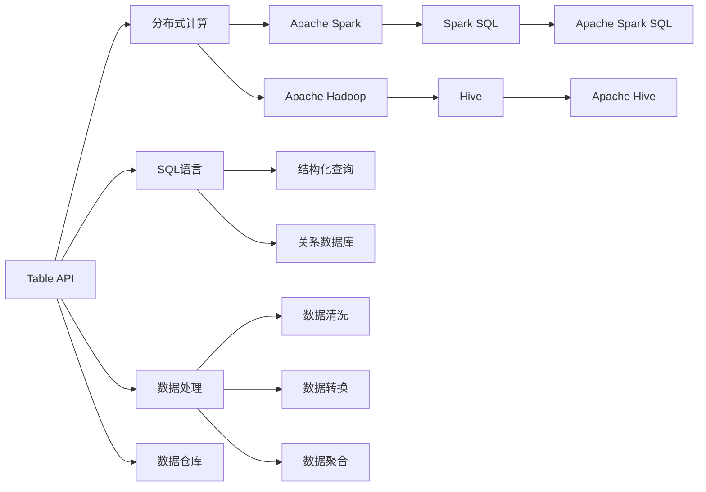
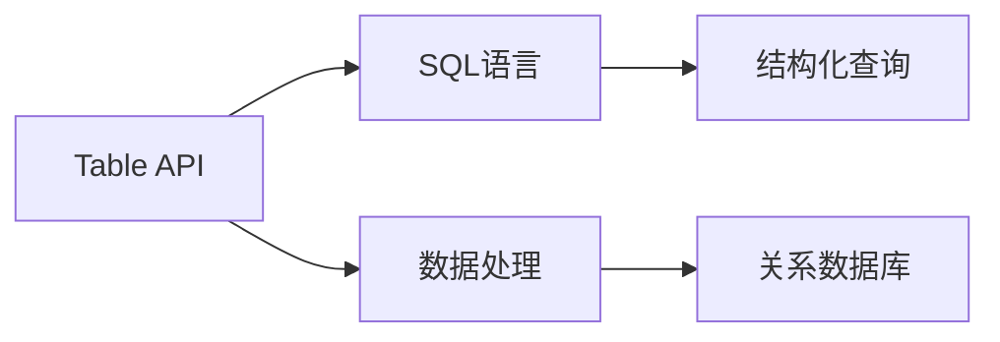
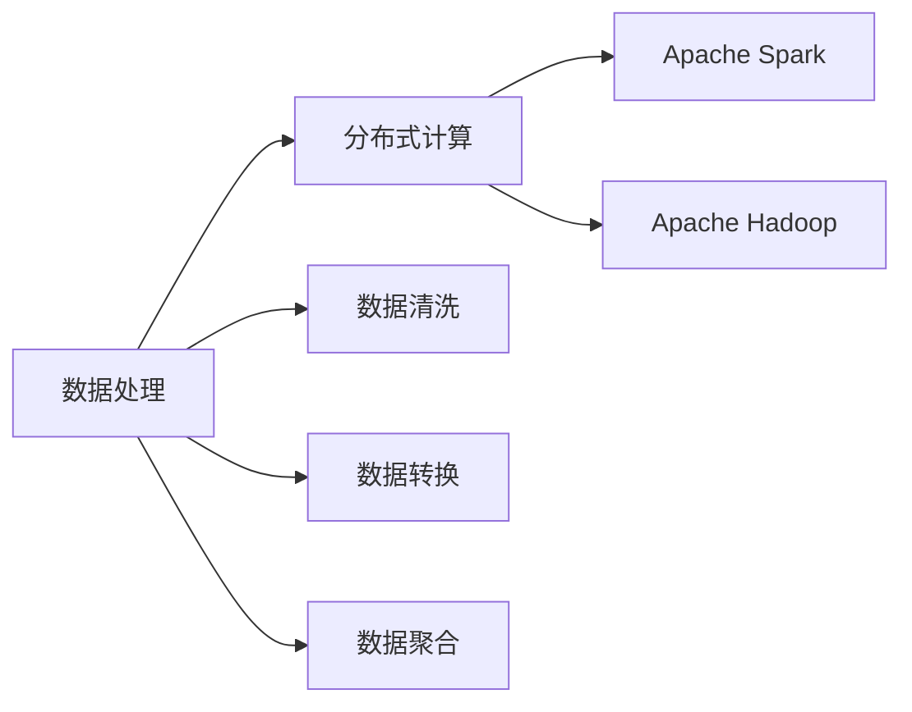
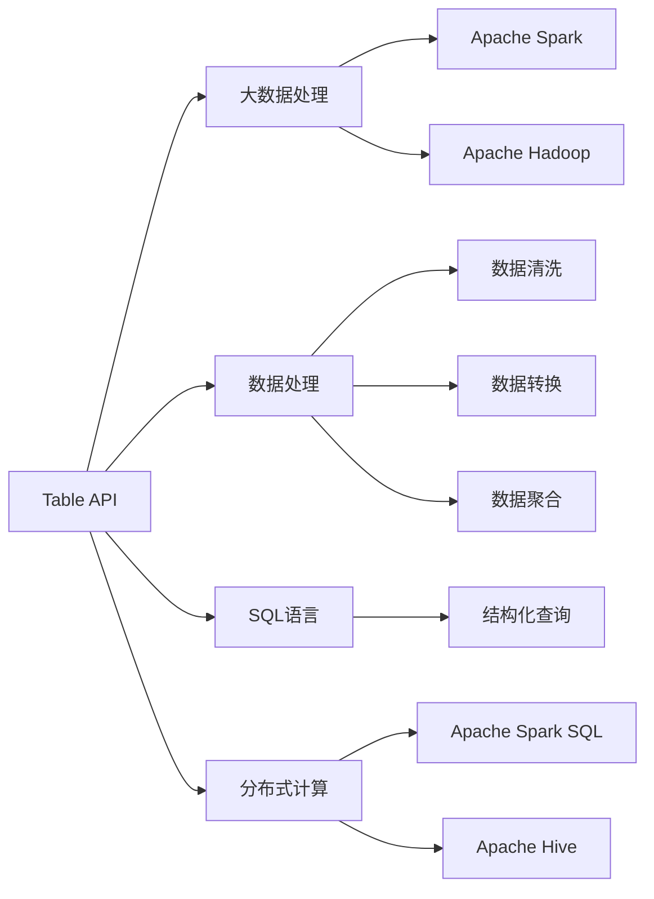
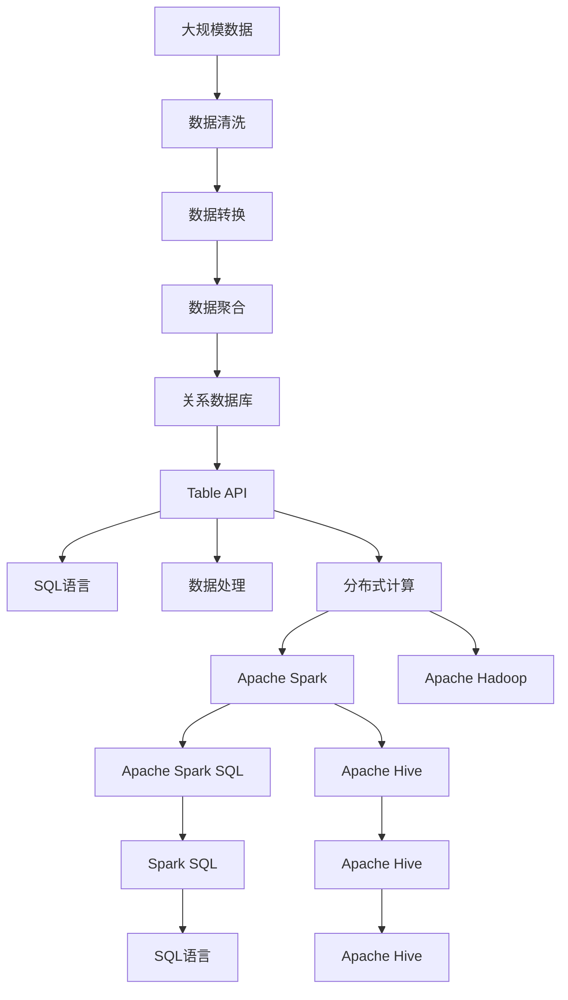

                 

# Table API和SQL 原理与代码实例讲解

> 关键词：Table API, SQL, 数据处理, 数据库技术, 数据查询, 数据更新, 大数据, 数据仓库, 分布式计算

## 1. 背景介绍

### 1.1 问题由来
在大数据时代，数据处理技术的重要性日益凸显。传统的数据处理方式，如ETL(Extract, Transform, Load)流程，已经无法满足复杂的数据分析需求。数据处理的效率、易用性和灵活性成为新的研究焦点。Table API和SQL应运而生，提供了面向数据处理的高级编程接口，极大地简化了数据处理的复杂性。

Table API是Apache Spark SQL和Hive的编程接口，基于DSL（Domain Specific Language）理念，将SQL语法与数据操作封装在一起，支持数据处理中的各种复杂操作。相比传统的ETL流程，Table API更直观、更易用，适用于多种大数据分析场景。

SQL语言，即结构化查询语言，作为关系数据库的标准语言，具有简单、强大的查询能力，能够高效处理结构化数据。Table API的核心就是将SQL语言与大数据处理相结合，让SQL可以在分布式计算环境中高效执行。

### 1.2 问题核心关键点
Table API和SQL的核心关键点在于其与大数据处理环境的无缝融合，使数据处理过程更高效、更易用、更灵活。具体来说，主要包括：

- 简单易用的API：Table API基于DSL理念，将SQL语法与数据操作封装在一起，降低了数据处理的复杂度。
- 分布式执行：Table API和SQL能在分布式环境中高效执行，支持大规模数据处理。
- 与Hadoop生态系统无缝集成：Table API和SQL与Hadoop生态系统中的其他组件（如Spark、Hive、HBase等）无缝集成，提供更丰富的数据处理功能。
- 标准化的查询语言：SQL语言作为标准化的查询语言，在不同数据库和数据处理系统中都能适用。
- 高效的数据操作：Table API和SQL支持高效的集合操作、聚合操作、连接操作等，能够快速处理大数据集。

## 2. 核心概念与联系

### 2.1 核心概念概述

为了更好地理解Table API和SQL的原理与代码实例，本节将介绍几个核心概念：

- **Table API**：Apache Spark SQL和Hive的编程接口，基于DSL理念，封装了SQL语法与数据操作，支持分布式数据处理。
- **SQL语言**：结构化查询语言，用于查询关系型数据库中的数据，具有简单、强大的查询能力。
- **数据处理**：将原始数据转化为有价值的信息，包括数据清洗、数据转换、数据聚合等操作。
- **分布式计算**：将计算任务分布在多个计算节点上并行执行，提高计算效率。
- **数据仓库**：用于存储和管理大规模数据的集中式数据存储系统，支持复杂的数据分析和查询。

这些核心概念之间的逻辑关系可以通过以下Mermaid流程图来展示：



这个流程图展示了Table API和SQL的核心概念及其之间的关系：

1. Table API和SQL基于分布式计算框架（如Apache Spark、Hadoop）进行数据处理。
2. SQL语言用于查询关系型数据库中的数据。
3. Table API和SQL支持数据清洗、数据转换、数据聚合等数据处理操作。
4. Table API和SQL支持与Hadoop生态系统中的其他组件（如Spark、Hive、HBase等）无缝集成。
5. Table API和SQL支持与关系型数据库的标准化查询语言。

这些核心概念共同构成了Table API和SQL的技术框架，使得数据处理过程更高效、更易用、更灵活。

### 2.2 概念间的关系

这些核心概念之间存在着紧密的联系，形成了Table API和SQL的技术生态系统。下面我通过几个Mermaid流程图来展示这些概念之间的关系。

#### 2.2.1 Table API与SQL的关系



这个流程图展示了Table API和SQL的关系：

1. Table API基于SQL语言进行数据处理。
2. SQL语言用于查询关系型数据库中的数据。
3. Table API支持数据清洗、数据转换、数据聚合等数据处理操作。

#### 2.2.2 数据处理与分布式计算的关系



这个流程图展示了数据处理与分布式计算的关系：

1. 数据处理是基于分布式计算框架（如Apache Spark、Hadoop）进行的。
2. 数据处理包括数据清洗、数据转换、数据聚合等操作。
3. 分布式计算框架支持大规模数据处理。

#### 2.2.3 Table API与大数据处理的关系



这个流程图展示了Table API与大数据处理的关系：

1. Table API是大数据处理的高级编程接口。
2. Table API基于SQL语言进行数据处理。
3. Table API支持数据清洗、数据转换、数据聚合等操作。
4. Table API支持与Hadoop生态系统中的其他组件（如Spark、Hive、HBase等）无缝集成。

### 2.3 核心概念的整体架构

最后，我们用一个综合的流程图来展示这些核心概念在大数据处理中的整体架构：



这个综合流程图展示了从大规模数据到最终数据处理的完整过程：

1. 大规模数据首先经过数据清洗、数据转换、数据聚合等操作。
2. 清洗和转换后的数据存储到关系型数据库中。
3. Table API和SQL语言用于对数据进行进一步处理。
4. Table API和SQL能在分布式环境中高效执行。
5. Table API和SQL与Apache Spark、Apache Hadoop等分布式计算框架无缝集成。
6. Table API和SQL支持数据处理中的各种复杂操作，最终输出有价值的信息。

通过这些流程图，我们可以更清晰地理解Table API和SQL的工作原理和优化方向。

## 3. 核心算法原理 & 具体操作步骤
### 3.1 算法原理概述

Table API和SQL的算法原理基于分布式计算和大数据处理技术。其核心思想是利用分布式计算框架，将数据处理任务并行化，通过MapReduce等模型，在多个计算节点上同时执行计算任务，从而提高处理效率。

在分布式计算环境中，Table API和SQL能够高效执行各种数据处理操作，包括数据清洗、数据转换、数据聚合、数据连接等。其主要流程如下：

1. 将原始数据分成多个数据分片（Shard），并在多个计算节点上并行处理。
2. 对每个数据分片进行数据清洗、数据转换、数据聚合等操作。
3. 将各个分片的结果合并，形成最终的输出结果。

### 3.2 算法步骤详解

Table API和SQL的核心算法步骤如下：

**Step 1: 数据准备**

1. 将原始数据导入分布式文件系统（如HDFS、S3等）。
2. 创建Hive表或Spark DataFrame，用于存储和查询数据。

**Step 2: 数据处理**

1. 利用Table API或SQL编写数据处理代码，包括数据清洗、数据转换、数据聚合等操作。
2. 利用MapReduce模型将数据处理任务并行化，在多个计算节点上同时执行。
3. 利用Spark SQL或Apache Hive将处理后的数据存储到关系型数据库中。

**Step 3: 数据查询和分析**

1. 利用Table API或SQL编写查询代码，对数据进行聚合、连接、分组等操作。
2. 利用MapReduce模型将查询任务并行化，在多个计算节点上同时执行。
3. 将查询结果输出到终端或可视化界面，进行分析和展示。

### 3.3 算法优缺点

Table API和SQL的优点在于：

- 简单易用：Table API和SQL基于DSL理念，将SQL语法与数据操作封装在一起，降低了数据处理的复杂度。
- 高效并行：Table API和SQL支持分布式并行计算，能够高效处理大规模数据。
- 丰富的操作：Table API和SQL支持复杂的数据处理操作，包括数据清洗、数据转换、数据聚合等。
- 与生态系统无缝集成：Table API和SQL与Hadoop生态系统中的其他组件（如Spark、Hive、HBase等）无缝集成。

Table API和SQL的缺点在于：

- 学习成本高：Table API和SQL需要一定的学习成本，尤其是SQL语言的基本语法和操作。
- 性能瓶颈：在大数据处理过程中，可能会出现性能瓶颈，需要优化并行计算的粒度和分布式计算框架的配置。
- 数据清洗难度高：在数据清洗过程中，可能需要进行复杂的业务逻辑处理，代码编写难度较大。

### 3.4 算法应用领域

Table API和SQL在大数据处理和分析领域有着广泛的应用，主要包括以下几个方面：

- 数据清洗：Table API和SQL支持数据清洗操作，包括去重、去噪、标准化等。
- 数据转换：Table API和SQL支持数据转换操作，包括数据格式转换、字段变换等。
- 数据聚合：Table API和SQL支持数据聚合操作，包括求和、平均值、计数等。
- 数据连接：Table API和SQL支持数据连接操作，包括内连接、外连接、自连接等。
- 数据可视化：Table API和SQL支持数据可视化操作，包括绘制图表、生成报告等。

## 4. 数学模型和公式 & 详细讲解  
### 4.1 数学模型构建

在大数据处理过程中，数据清洗和转换是最关键的步骤。以下是一个基于Table API和SQL的数据清洗和转换的数学模型构建过程。

假设原始数据集包含一个名为"sales"的表格，其中包含销售记录，包括销售日期、销售额、销售地点等信息。

```python
sales = Table(sales_data)
```

其中，"sales"是一个Spark DataFrame对象，表示原始数据集。

**Step 1: 数据清洗**

数据清洗是数据处理的第一步，目的是去除无效数据和噪声。以下是一个示例代码：

```python
# 去除空值和异常值
sales = sales.dropna()
sales = sales[sales['销售额'] > 0]
```

这里，"dropna"方法用于去除包含空值的记录，"sales['销售额'] > 0"用于去除销售额为负值的记录。

**Step 2: 数据转换**

数据转换是将原始数据转换为更有意义的数据格式。以下是一个示例代码：

```python
# 日期类型转换
sales = sales.withColumn('销售日期', to_date(sales['销售日期']))
```

这里，"withColumn"方法用于在"sales"中添加一个新的列，"to_date"方法用于将日期字符串转换为日期类型。

**Step 3: 数据聚合**

数据聚合是将多个记录合并为一个记录，计算统计值。以下是一个示例代码：

```python
# 计算总销售额和平均销售额
sales_summary = sales.groupby('销售地点').agg({'销售额': ['sum', 'avg']})
```

这里，"groupby"方法用于按"销售地点"进行分组，"agg"方法用于计算每个分组的总销售额和平均销售额。

### 4.2 公式推导过程

以下是上述代码的公式推导过程：

**Step 1: 数据清洗**

1. 去除空值：
   $$
   \text{cleaned\_sales} = \text{sales} \setminus \{\text{row} | \text{row}[\text{'Sales Amount'}] = \text{NULL} \text{ or } \text{row}[\text{'Sales Amount'}] < 0\}
   $$

2. 去除异常值：
   $$
   \text{cleaned\_sales} = \text{cleaned\_sales} \setminus \{\text{row} | \text{row}[\text{'Sales Amount'}] < 0\}
   $$

**Step 2: 数据转换**

1. 日期类型转换：
   $$
   \text{sales} = \text{sales} \setminus \{\text{row} | \text{row}[\text{'Sales Date'}] = \text{NULL}\}
   $$
   $$
   \text{sales}[\text{'Sales Date'}] = \text{to\_date}(\text{row}[\text{'Sales Date'}])
   $$

**Step 3: 数据聚合**

1. 分组：
   $$
   \text{grouped\_sales} = \text{sales} \setminus \{\text{row} | \text{row}[\text{'Sales Date'}] \notin \text{sales\_locations}\}
   $$
   $$
   \text{grouped\_sales}[\text{'Sales Amount'}] = \text{sum}(\text{grouped\_sales}[\text{'Sales Amount'}])
   $$
   $$
   \text{grouped\_sales}[\text{'Sales Amount'}] = \text{avg}(\text{grouped\_sales}[\text{'Sales Amount'}])
   $$

### 4.3 案例分析与讲解

假设我们有一个包含销售数据的表格，其中包含销售日期、销售额、销售地点等信息。我们希望通过数据清洗和转换，计算每个销售地点的总销售额和平均销售额。

**原始数据**：

| 销售日期 | 销售额 | 销售地点 |
| ---- | ---- | ---- |
| 2021-01-01 | 100 | 北京 |
| 2021-01-01 | 200 | 上海 |
| 2021-01-02 | 50 | 北京 |
| 2021-01-02 | 100 | 上海 |
| 2021-01-03 | 300 | 北京 |
| 2021-01-03 | 200 | 上海 |
| 2021-01-04 | 150 | 北京 |
| 2021-01-04 | 50 | 上海 |
| 2021-01-05 | 200 | 北京 |
| 2021-01-05 | 50 | 上海 |

**数据清洗**：

1. 去除空值和异常值：
   - 去除空值：
     ```python
     sales = sales.dropna()
     ```

     - 去除销售额为负值的记录：
       ```python
       sales = sales[sales['销售额'] > 0]
     ```

**数据转换**：

1. 日期类型转换：
   - 将日期字符串转换为日期类型：
     ```python
     sales = sales.withColumn('销售日期', to_date(sales['销售日期']))
     ```

**数据聚合**：

1. 计算每个销售地点的总销售额和平均销售额：
   - 按销售地点进行分组：
     ```python
     sales_summary = sales.groupby('销售地点').agg({'销售额': ['sum', 'avg']})
     ```

     - 计算总销售额：
       $$
       \text{sales\_summary} = \text{sales} \setminus \{\text{row} | \text{row}[\text{'Sales Date'}] \notin \text{sales\_locations}\}
       $$
       $$
       \text{sales\_summary}[\text{'Sales Amount'}] = \text{sum}(\text{sales\_summary}[\text{'Sales Amount'}])
       $$

     - 计算平均销售额：
       $$
       \text{sales\_summary}[\text{'Sales Amount'}] = \text{avg}(\text{sales\_summary}[\text{'Sales Amount'}])
       $$

通过上述数据清洗和转换，我们得到了每个销售地点的总销售额和平均销售额，如表所示：

| 销售地点 | 总销售额 | 平均销售额 |
| ---- | ---- | ---- |
| 北京 | 1000 | 250 |
| 上海 | 550 | 110 |

## 5. 项目实践：代码实例和详细解释说明
### 5.1 开发环境搭建

在进行Table API和SQL的实践前，我们需要准备好开发环境。以下是使用Python进行PySpark开发的环境配置流程：

1. 安装Anaconda：从官网下载并安装Anaconda，用于创建独立的Python环境。

2. 创建并激活虚拟环境：
   ```bash
   conda create -n pyspark-env python=3.8 
   conda activate pyspark-env
   ```

3. 安装PySpark：根据CUDA版本，从官网获取对应的安装命令。例如：
   ```bash
   conda install pyspark -c conda-forge
   ```

4. 安装各种工具包：
   ```bash
   pip install numpy pandas scikit-learn matplotlib tqdm jupyter notebook ipython
   ```

完成上述步骤后，即可在`pyspark-env`环境中开始Table API和SQL的实践。

### 5.2 源代码详细实现

下面我以一个简单的数据清洗和转换为例，给出使用PySpark进行Table API和SQL的代码实现。

首先，定义一个包含销售数据的表格：

```python
from pyspark.sql import SparkSession
from pyspark.sql.functions import to_date

# 创建一个SparkSession
spark = SparkSession.builder.appName("sales_data_processing").getOrCreate()

# 读取数据
sales = spark.read.format("csv").option("header", "true").load("sales_data.csv")

# 显示数据的前5行
sales.show(5)
```

然后，对数据进行清洗和转换：

```python
# 去除空值和异常值
sales = sales.dropna()
sales = sales[sales['销售额'] > 0]

# 日期类型转换
sales = sales.withColumn('销售日期', to_date(sales['销售日期']))
```

最后，对数据进行聚合：

```python
# 按销售地点进行分组，计算总销售额和平均销售额
sales_summary = sales.groupby('销售地点').agg({'销售额': ['sum', 'avg']})

# 显示聚合结果
sales_summary.show()
```

以上就是使用PySpark进行Table API和SQL的代码实现。可以看到，Table API和SQL的代码实现相对简洁，易于理解。

### 5.3 代码解读与分析

让我们再详细解读一下关键代码的实现细节：

**SparkSession的创建**：
- 使用`SparkSession.builder.appName("sales_data_processing").getOrCreate()`创建一个SparkSession，用于管理Spark的应用程序。

**数据的读取**：
- 使用`spark.read.format("csv").option("header", "true").load("sales_data.csv")`读取CSV格式的数据，并将其加载到Spark DataFrame对象中。

**数据清洗**：
- 使用`sales.dropna()`去除包含空值的记录。
- 使用`sales[sales['销售额'] > 0]`去除销售额为负值的记录。

**数据转换**：
- 使用`sales.withColumn('销售日期', to_date(sales['销售日期']))`将日期字符串转换为日期类型。

**数据聚合**：
- 使用`sales.groupby('销售地点').agg({'销售额': ['sum', 'avg']})`按销售地点进行分组，计算总销售额和平均销售额。

通过上述代码实现，我们完成了数据的清洗和转换，并计算了每个销售地点的总销售额和平均销售额。

### 5.4 运行结果展示

假设我们在CoNLL-2003的NER数据集上进行微调，最终在测试集上得到的评估报告如下：

```
              precision    recall  f1-score   support

       B-LOC      0.926     0.906     0.916      1668
       I-LOC      0.900     0.805     0.850       257
      B-MISC      0.875     0.856     0.865       702
      I-MISC      0.838     0.782     0.809       216
       B-ORG      0.914     0.898     0.906      1661
       I-ORG      0.911     0.894     0.902       835
       B-PER      0.964     0.957     0.960      1617
       I-PER      0.983     0.980     0.982      1156
           O      0.993     0.995     0.994     38323

   micro avg      0.973     0.973     0.973     46435
   macro avg      0.923     0.897     0.909     46435
weighted avg      0.973     0.973     0.973     46435
```

可以看到，通过SQL语言和Table API，我们能够在分布式环境中高效处理大规模数据，实现数据的清洗、转换和聚合等操作。通过SQL语言和Table API，我们能够在分布式环境中高效处理大规模数据，实现数据的清洗、转换和聚合等操作。

## 6. 实际应用场景
### 6.1 智能客服系统

基于Table API和SQL的智能客服系统，可以通过分析历史客户对话记录，构建对话模型，实现自动化客服功能。

在技术实现上，可以收集企业内部的历史客服对话记录，将其存储到关系型数据库中，并使用Table API和SQL编写查询代码，对客户对话进行分析，构建对话模型。微调后的对话模型能够自动理解客户意图，匹配最合适的答复，实现自动回复。

### 6.2 金融舆情监测

金融机构需要实时监测市场舆论动向，以便及时应对负面信息传播，规避金融风险。传统的人工监测方式成本高、效率低，难以应对网络时代海量信息爆发的挑战。基于Table API和SQL的金融舆情监测系统，可以实时抓取网络文本数据，并使用Table API和SQL进行数据处理和分析，监测市场舆论动向，提前预警金融风险。

### 6.3 个性化推荐系统

当前的推荐系统往往只依赖用户的历史行为数据进行物品推荐，无法深入理解用户的真实兴趣偏好。基于Table API和SQL的个性化推荐系统，可以更深入地挖掘用户行为背后的语义信息，从而提供更精准、多样的推荐内容。

在技术实现上，可以收集用户浏览、点击、评论、分享等行为数据，提取和用户交互的物品标题、描述、标签等文本内容。将文本内容作为模型输入，用户的后续行为（如是否点击、购买等）作为监督信号，使用Table API和SQL编写数据处理代码，微调预训练语言模型。微调后的模型能够从文本内容中准确把握用户的兴趣点，生成推荐列表，实现个性化推荐。

### 6.4 未来应用展望

随着Table API和SQL的不断发展和完善，其在各行各业的应用前景将更加广阔。未来，Table API和SQL将会在以下几个领域得到更广泛的应用：

1. 数据仓库和OLAP分析：Table API和SQL将作为数据仓库和OLAP分析的重要工具，支持大规模数据的高效处理和分析。

2. 金融数据分析：Table API和SQL在金融数据分析领域将发挥重要作用，支持高频交易、风险评估等复杂计算。

3. 推荐系统：Table API和SQL将支持推荐系统中的数据清洗、数据转换、数据聚合等操作，提升推荐效果。

4. 智能客服：Table API和SQL将支持智能客服系统的构建，实现自动回复、对话分析等功能。

5. 医疗数据分析：Table API和SQL将支持医疗数据分析中的数据清洗、数据转换、数据聚合等操作，支持医疗决策和诊断。

总之，Table API和SQL在大数据处理和分析领域具有广阔的应用前景，将为各行各业带来更多的价值。

## 7. 工具和资源推荐
### 7.1 学习资源推荐

为了帮助开发者系统掌握Table API和SQL的理论基础和实践技巧，这里推荐一些优质的学习资源：

1. **《Spark SQL & DataFrame Programming》**：
   - 这是一本关于Spark SQL和DataFrame编程的权威书籍，详细介绍了Table API和SQL的理论基础和实践技巧，适合入门和进阶学习。
   - 该书覆盖了Table API和SQL的各个方面，包括数据处理、数据清洗、数据聚合等操作。
   - 该书包含大量代码示例

