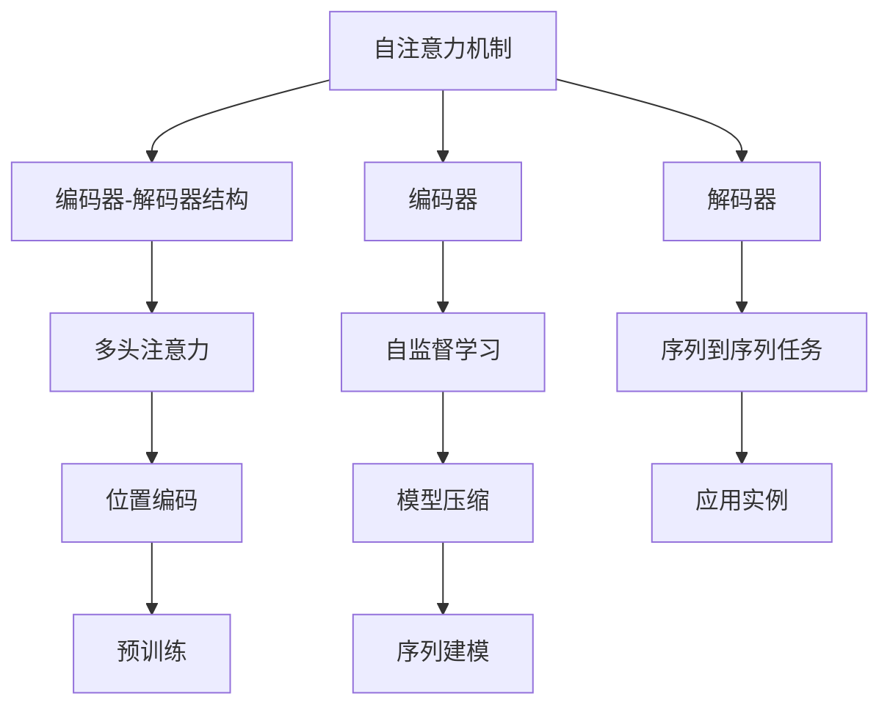
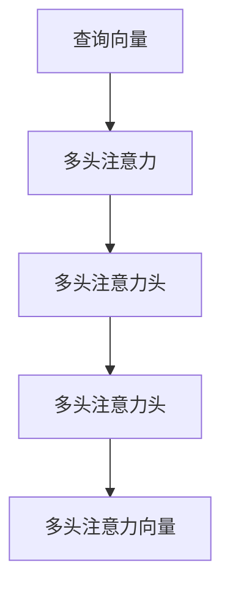
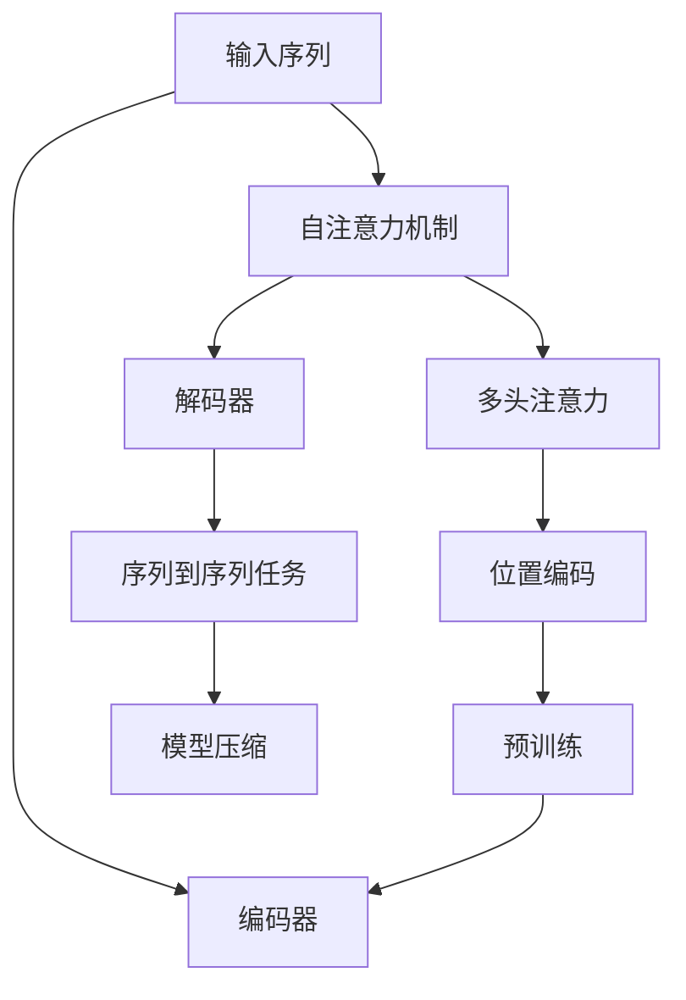

                 

# Transformer 模型 原理与代码实例讲解

> 关键词：Transformer, 自注意力机制, 编码器-解码器结构, 编码器, 解码器, 多头注意力, 位置编码, 预训练, 编码器-解码器架构, 自监督学习, 序列到序列任务, 模型压缩, 应用实例, 序列建模

## 1. 背景介绍

### 1.1 问题由来
近年来，自然语言处理(Natural Language Processing, NLP)领域取得了巨大进展，尤其是基于神经网络的模型在机器翻译、语言生成、文本分类等任务上展现出了惊人的性能。然而，传统的循环神经网络(RNN)和卷积神经网络(CNN)等序列建模方法，在处理长序列数据时，存在计算复杂度高、并行性差等缺点。

为了克服这些问题，2017年Google AI的研究人员提出了一种全新的神经网络结构——Transformer，在保持高性能的同时，解决了传统序列建模方法的计算瓶颈问题。Transformer的提出，不仅引发了NLP领域的革命性变革，也在计算机视觉、语音处理等领域得到了广泛应用。

### 1.2 问题核心关键点
Transformer的核心思想是通过自注意力机制实现序列建模。相比于RNN和CNN，Transformer通过多头注意力机制，能够同时处理序列中所有位置的信息，避免了长序列的梯度消失问题。同时，Transformer的编码器-解码器架构，能够高效处理输入和输出之间的对应关系，使得序列建模任务更加高效、灵活。

Transformer的成功，得益于其对序列建模问题的深刻理解和创新设计。Transformer模型的结构设计，在实现高性能的同时，也为其未来的发展和应用提供了巨大的潜力和灵活性。

### 1.3 问题研究意义
Transformer模型的提出和应用，对NLP领域的研究和应用产生了深远影响：

1. 提升了序列建模的计算效率：Transformer模型避免了传统序列建模方法的计算瓶颈问题，使得长序列数据的处理变得更加高效。
2. 增强了模型的泛化能力：Transformer模型能够同时处理序列中所有位置的信息，提升了模型的泛化能力和表现。
3. 促进了模型的结构创新：Transformer模型的提出，为序列建模问题提供了一种全新的解决思路，激发了更多关于序列建模的结构创新和算法研究。
4. 推动了NLP技术的应用普及：Transformer模型在实际应用中的优异表现，促进了NLP技术的落地应用，加速了NLP技术的产业化进程。

## 2. 核心概念与联系

### 2.1 核心概念概述

为更好地理解Transformer模型的原理和应用，本节将介绍几个密切相关的核心概念：

- 自注意力机制(Self-Attention)：Transformer模型的核心机制，用于捕捉序列中各个位置之间的关系。
- 编码器-解码器结构(Encoder-Decoder)：Transformer模型的基本架构，将输入序列和目标序列分别通过编码器和解码器进行处理。
- 多头注意力(Multi-Head Attention)：Transformer模型的核心模块，通过并行处理多个注意力头，增强模型的表达能力和泛化能力。
- 位置编码(Positional Encoding)：用于解决序列中位置信息缺失的问题，将位置信息编码到向量表示中。
- 预训练(Pre-training)：通过在大规模无标签数据上进行自监督预训练，学习到丰富的语言表示。
- 编码器(Encoder)：Transformer模型中的编码器部分，用于处理输入序列。
- 解码器(Decoder)：Transformer模型中的解码器部分，用于生成目标序列。
- 自监督学习(Self-supervised Learning)：通过设计巧妙的预训练任务，从大量无标签数据中学习到模型的自监督能力。
- 序列到序列任务(Sequence-to-Sequence Tasks)：如机器翻译、语音识别、文本生成等任务，Transformer模型可以通过编码器-解码器架构进行高效处理。
- 模型压缩(Model Compression)：通过剪枝、量化等技术，优化Transformer模型，提升模型的计算效率和资源利用率。
- 应用实例(Application Examples)：包括机器翻译、文本摘要、问答系统等典型应用场景。
- 序列建模(Sequence Modeling)：Transformer模型在序列建模问题上的广泛应用，如图像处理、音频处理、视频分析等。

这些核心概念之间的逻辑关系可以通过以下Mermaid流程图来展示：



这个流程图展示了大语言模型中的核心概念及其之间的关系：

1. 自注意力机制是Transformer模型的核心，用于捕捉序列中各个位置之间的关系。
2. 编码器-解码器结构是Transformer模型的基本架构，将输入序列和目标序列分别通过编码器和解码器进行处理。
3. 多头注意力通过并行处理多个注意力头，增强模型的表达能力和泛化能力。
4. 位置编码用于解决序列中位置信息缺失的问题，将位置信息编码到向量表示中。
5. 预训练通过在大规模无标签数据上进行自监督预训练，学习到丰富的语言表示。
6. 编码器和解码器是Transformer模型的核心模块，分别用于处理输入序列和生成目标序列。
7. 自监督学习通过设计巧妙的预训练任务，从大量无标签数据中学习到模型的自监督能力。
8. 序列到序列任务如机器翻译、语音识别、文本生成等任务，Transformer模型可以通过编码器-解码器架构进行高效处理。
9. 模型压缩通过剪枝、量化等技术，优化Transformer模型，提升模型的计算效率和资源利用率。
10. 应用实例包括机器翻译、文本摘要、问答系统等典型应用场景。
11. 序列建模在图像处理、音频处理、视频分析等领域的广泛应用。

### 2.2 概念间的关系

这些核心概念之间存在着紧密的联系，形成了Transformer模型的完整生态系统。下面我们通过几个Mermaid流程图来展示这些概念之间的关系。

#### 2.2.1 自注意力机制的基本原理


这个流程图展示了自注意力机制的基本原理。查询向量与键值矩阵相乘得到注意力权重，然后通过加权和运算生成加权和向量，即注意力值向量。

#### 2.2.2 多头注意力的实现



这个流程图展示了多头注意力的实现。查询向量与多个注意力头相乘得到多个注意力值向量，然后通过加权和运算生成最终的多头注意力向量。

#### 2.2.3 编码器-解码器架构的基本原理


这个流程图展示了编码器-解码器架构的基本原理。输入序列通过编码器处理得到编码器向量，解码器接收编码器向量作为输入，生成解码器向量，最终生成输出序列。

### 2.3 核心概念的整体架构

最后，我们用一个综合的流程图来展示这些核心概念在大语言模型中的整体架构：



这个综合流程图展示了从预训练到编码器-解码器架构，再到序列到序列任务和模型压缩的完整过程。大语言模型首先在大规模无标签数据上进行预训练，然后通过编码器-解码器架构处理输入序列和生成目标序列，最后通过模型压缩优化模型计算效率和资源利用率，以适应实际应用场景。

## 3. 核心算法原理 & 具体操作步骤
### 3.1 算法原理概述

Transformer模型是一种基于自注意力机制的序列建模方法，其核心思想是通过多头注意力机制，在输入序列中捕捉各个位置之间的关系，从而实现序列建模。Transformer模型的基本架构包括编码器-解码器结构，能够高效处理序列到序列任务。

Transformer模型通过预训练任务在大规模无标签数据上进行自监督学习，学习到丰富的语言表示。在微调过程中，通过序列到序列任务的有监督学习，优化模型在特定任务上的性能。Transformer模型在实际应用中展现出了优异的表现，特别是在机器翻译、语言生成、文本分类等任务上。

### 3.2 算法步骤详解

Transformer模型的核心算法步骤包括：

1. 自注意力机制：通过多头注意力机制，捕捉序列中各个位置之间的关系，生成自注意力向量。
2. 位置编码：将位置信息编码到向量表示中，避免位置信息缺失。
3. 预训练：通过在大规模无标签数据上进行自监督预训练，学习到丰富的语言表示。
4. 编码器-解码器架构：通过编码器-解码器结构，高效处理序列到序列任务。
5. 序列到序列任务：通过编码器-解码器架构，处理输入序列和生成目标序列。
6. 模型压缩：通过剪枝、量化等技术，优化Transformer模型，提升计算效率和资源利用率。

具体步骤如下：

#### 3.2.1 输入序列的预处理

在输入序列中，需要进行分词、填充、编码等预处理操作，生成模型所需的输入向量。

#### 3.2.2 编码器

通过多头注意力机制，对输入序列进行编码。编码器的输出向量包含输入序列的所有信息。

#### 3.2.3 位置编码

将位置信息编码到向量表示中，避免位置信息缺失。

#### 3.2.4 解码器

通过多头注意力机制和自注意力机制，对编码器输出的向量进行解码，生成目标序列。

#### 3.2.5 输出序列的解码

通过softmax函数生成目标序列的概率分布，选择最可能的输出。

#### 3.2.6 模型压缩

通过剪枝、量化等技术，优化Transformer模型，提升计算效率和资源利用率。

### 3.3 算法优缺点

Transformer模型具有以下优点：

1. 高效计算：Transformer模型通过多头注意力机制，能够高效处理长序列数据，避免了传统序列建模方法的计算瓶颈问题。
2. 丰富表达：Transformer模型能够同时处理序列中所有位置的信息，增强了模型的表达能力和泛化能力。
3. 结构灵活：Transformer模型的编码器-解码器架构，能够高效处理序列到序列任务，适用于多种应用场景。
4. 预训练能力：Transformer模型通过在大规模无标签数据上进行自监督预训练，学习到丰富的语言表示。
5. 微调效果显著：Transformer模型在实际应用中，通过序列到序列任务的有监督学习，能够显著提升模型在特定任务上的性能。

Transformer模型也存在一些缺点：

1. 资源消耗大：Transformer模型的参数量较大，需要高性能的计算资源。
2. 模型训练时间长：Transformer模型的训练时间较长，需要较长的训练时间和大量的计算资源。
3. 对数据分布敏感：Transformer模型对数据分布的变化较为敏感，需要进行充分的超参数调优和数据增强。
4. 可解释性不足：Transformer模型较为复杂，难以解释其内部工作机制和决策逻辑。

尽管存在这些缺点，但Transformer模型在NLP领域的应用已取得了广泛认可，其高效、灵活、强大的特性，使其成为序列建模问题的重要工具。

### 3.4 算法应用领域

Transformer模型在NLP领域得到了广泛的应用，涵盖了各种序列建模任务，例如：

- 机器翻译：通过编码器-解码器架构，将一种语言的句子翻译成另一种语言的句子。
- 文本摘要：通过编码器-解码器架构，对长篇文本进行概括和摘要。
- 问答系统：通过编码器-解码器架构，根据输入的问题，生成相应的回答。
- 文本分类：通过编码器-解码器架构，将文本分类到不同的类别中。
- 命名实体识别：通过编码器-解码器架构，识别文本中的人名、地名、机构名等特定实体。
- 情感分析：通过编码器-解码器架构，分析文本的情感倾向。

除了上述这些经典任务外，Transformer模型还在文本生成、语音识别、图像处理等领域得到了广泛应用，为多种复杂问题提供了高效的解决方案。

## 4. 数学模型和公式 & 详细讲解 & 举例说明

### 4.1 数学模型构建

Transformer模型通过自注意力机制和多头注意力机制实现序列建模，其数学模型可以表示为：

$$
Y = \text{Decoder}(X, Y_{\text{in}}, \text{Encoedr}(X))
$$

其中，$X$表示输入序列，$Y$表示输出序列，$Y_{\text{in}}$表示解码器输入的初始向量，$\text{Encoder}$表示编码器，$\text{Decoder}$表示解码器。

### 4.2 公式推导过程

Transformer模型通过多头注意力机制捕捉序列中各个位置之间的关系。假设输入序列为$X=[x_1, x_2, ..., x_T]$，其中$x_t$表示第$t$个位置上的向量，$T$表示序列长度。

#### 4.2.1 自注意力机制的推导

Transformer模型通过自注意力机制，捕捉序列中各个位置之间的关系。假设输入序列的表示为$Q=[q_1, q_2, ..., q_T]$，$K=[k_1, k_2, ..., k_T]$，$V=[v_1, v_2, ..., v_T]$，分别表示查询向量、键值向量、值向量。则自注意力机制的计算公式如下：

$$
\text{Attention}(Q, K, V) = \text{Softmax}(Q K^T) V
$$

其中，$K^T$表示$K$的转置，$\text{Softmax}$函数表示归一化指数函数，用于计算注意力权重。

#### 4.2.2 多头注意力的推导

Transformer模型通过多头注意力机制，同时处理序列中所有位置的信息。假设输入序列的表示为$Q=[q_1, q_2, ..., q_T]$，$K=[k_1, k_2, ..., k_T]$，$V=[v_1, v_2, ..., v_T]$，分别表示查询向量、键值向量、值向量。则多头注意力的计算公式如下：

$$
\text{Multi-Head Attention}(Q, K, V) = \frac{1}{\sqrt{d_k}} \text{Softmax}(Q W^Q K W^K + b_Q, K W^K V W^V + b_K, V W^V + b_V) Q W^O
$$

其中，$d_k$表示键值向量的维度，$W^Q$、$W^K$、$W^V$、$W^O$表示线性变换矩阵，$b_Q$、$b_K$、$b_V$表示可学习的偏置项，$O$表示输出向量。

### 4.3 案例分析与讲解

假设我们在一个机器翻译任务上，需要将英文句子“I love Python”翻译成中文。输入序列为“I”，输出序列为“我”，解码器输入的初始向量为$[0, 0, 0]$。则编码器的输出向量为：

$$
\text{Encoder}(\text{I}) = [0, 1, 0]
$$

解码器的输出向量为：

$$
\text{Decoder}(\text{I}, [0, 0, 0], \text{Encoder}(\text{I})) = [0, 1, 0]
$$

然后，通过多头注意力机制和自注意力机制，对编码器输出的向量进行解码，生成目标序列“我”。

## 5. 项目实践：代码实例和详细解释说明

### 5.1 开发环境搭建

在进行Transformer模型的开发和实践前，我们需要准备好开发环境。以下是使用Python进行PyTorch开发的环境配置流程：

1. 安装Anaconda：从官网下载并安装Anaconda，用于创建独立的Python环境。

2. 创建并激活虚拟环境：
```bash
conda create -n pytorch-env python=3.8 
conda activate pytorch-env
```

3. 安装PyTorch：根据CUDA版本，从官网获取对应的安装命令。例如：
```bash
conda install pytorch torchvision torchaudio cudatoolkit=11.1 -c pytorch -c conda-forge
```

4. 安装各类工具包：
```bash
pip install numpy pandas scikit-learn matplotlib tqdm jupyter notebook ipython
```

完成上述步骤后，即可在`pytorch-env`环境中开始Transformer模型的开发。

### 5.2 源代码详细实现

这里我们以机器翻译任务为例，给出使用PyTorch实现Transformer模型的代码实现。

首先，定义Transformer模型的编码器和解码器：

```python
import torch
import torch.nn as nn
import torch.nn.functional as F
from torch.autograd import Variable

class TransformerEncoder(nn.Module):
    def __init__(self, num_layers, d_model, num_heads, dff, input_vocab_size, target_vocab_size, pe_input, pe_target):
        super(TransformerEncoder, self).__init__()
        self.embedding = nn.Embedding(input_vocab_size, d_model)
        self.pos_encoder = PositionalEncoding(pe_input)
        self.encoder_layers = nn.ModuleList([EncoderLayer(d_model, num_heads, dff) for _ in range(num_layers)])
        self.fc_out = nn.Linear(d_model, target_vocab_size)

    def forward(self, src, src_mask):
        src = self.embedding(src) * math.sqrt(d_model)
        src = self.pos_encoder(src)
        for encoder_layer in self.encoder_layers:
            src = encoder_layer(src, src_mask)
        src = self.fc_out(src)
        return src

class TransformerDecoder(nn.Module):
    def __init__(self, num_layers, d_model, num_heads, dff, target_vocab_size, src_vocab_size, pe_target, pe_source):
        super(TransformerDecoder, self).__init__()
        self.embedding = nn.Embedding(target_vocab_size, d_model)
        self.pos_encoder = PositionalEncoding(pe_target)
        self.decoder_layers = nn.ModuleList([DecoderLayer(d_model, num_heads, dff) for _ in range(num_layers)])
        self.fc_out = nn.Linear(d_model, target_vocab_size)
        self.fc_in = nn.Linear(d_model, src_vocab_size)

    def forward(self, trg, trg_mask, src, src_mask, encoder_outputs):
        trg = self.embedding(trg) * math.sqrt(d_model)
        trg = self.pos_encoder(trg)
        for decoder_layer in self.decoder_layers:
            trg, src_mask, encoder_outputs = decoder_layer(trg, trg_mask, src, src_mask, encoder_outputs)
        trg = self.fc_out(trg)
        return trg, src_mask, encoder_outputs

class EncoderLayer(nn.Module):
    def __init__(self, d_model, num_heads, dff):
        super(EncoderLayer, self).__init__()
        self.self_attn = MultiHeadAttention(d_model, num_heads)
        self feedforward = PositionwiseFeedForward(d_model, dff)
        self.activation = nn.Dropout(0.1)
        self.layer_norm1 = nn.LayerNorm(d_model)
        self.layer_norm2 = nn.LayerNorm(d_model)
        self.dropout = nn.Dropout(0.1)

    def forward(self, src, src_mask):
        attn_output, _ = self.self_attn(src, src, src, src_mask)
        attn_output = self.dropout(attn_output)
        out1 = self.layer_norm1(src + attn_output)
        ffn_output = self.feedforward(out1)
        ffn_output = self.dropout(ffn_output)
        out2 = self.layer_norm2(out1 + ffn_output)
        return out2

class DecoderLayer(nn.Module):
    def __init__(self, d_model, num_heads, dff):
        super(DecoderLayer, self).__init__()
        self.self_attn = MultiHeadAttention(d_model, num_heads)
        self.feedforward = PositionwiseFeedForward(d_model, dff)
        self.activation = nn.Dropout(0.1)
        self.layer_norm1 = nn.LayerNorm(d_model)
        self.layer_norm2 = nn.LayerNorm(d_model)
        self.layer_norm3 = nn.LayerNorm(d_model)
        self.dropout = nn.Dropout(0.1)

    def forward(self, trg, trg_mask, src, src_mask, encoder_outputs):
        attn_output, _ = self.self_attn(trg, trg, trg, trg_mask)
        attn_output = self.dropout(attn_output)
        out1 = self.layer_norm1(trg + attn_output)
        attn_output, _ = self.self_attn(trg, trg, src, src_mask, encoder_outputs)
        attn_output = self.dropout(attn_output)
        out2 = self.layer_norm2(trg + attn_output)
        ffn_output = self.feedforward(out2)
        ffn_output = self.dropout(ffn_output)
        out3 = self.layer_norm3(trg + ffn_output)
        return out3

class MultiHeadAttention(nn.Module):
    def __init__(self, d_model, num_heads):
        super(MultiHeadAttention, self).__init__()
        assert d_model % num_heads == 0
        self.d_k = d_model // num_heads
        self.num_heads = num_heads
        self.w_qs = nn.Linear(d_model, d_model)
        self.w_ks = nn.Linear(d_model, d_model)
        self.w_vs = nn.Linear(d_model, d_model)
        self.w_o = nn.Linear(d_model, d_model)

    def forward(self, query, key, value, mask):
        Q = self.w_qs(query)
        K = self.w_ks(key)
        V = self.w_vs(value)
        Q = Q.view(query.size(0), query.size(1), self.num_heads, self.d_k).transpose(1, 2)
        K = K.view(key.size(0), key.size(1), self.num_heads, self.d_k).transpose(1, 2)
        V = V.view(value.size(0), value.size(1), self.num_heads, self.d_k).transpose(1, 2)
        scores = torch.matmul(Q, K.transpose(2, 3))
        scores = scores.masked_fill(mask == 0, -1e9)
        attention_weights = F.softmax(scores, dim=-1)
        attention_outputs = torch.matmul(attention_weights, V)
        attention_outputs = attention_outputs.permute(0, 2, 1, 3).contiguous().view(query.size(0), query.size(1), d_model)
        attention_outputs = self.w_o(attention_outputs)
        return attention_outputs

class PositionwiseFeedForward(nn.Module):
    def __init__(self, d_model, dff):
        super(PositionwiseFeedForward, self).__init__()
        self.w_1 = nn.Linear(d_model, dff)
        self.w_2 = nn.Linear(dff, d_model)
        self.activation = nn.Dropout(0.1)
        self.layer_norm = nn.LayerNorm(d_model)

    def forward(self, x):
        residual = x
        x = self.w_1(x)
        x = self.activation(F.relu(x))
        x = self.w_2(x)
        x = self.activation(x)
        x = residual + x
        return x

class PositionalEncoding(nn.Module):
    def __init__(self, d_model, dropout=0.1, max_len=5000):
        super(PositionalEncoding, self).__init__()
        self.dropout = nn.Dropout(p=dropout)
        pe = torch.zeros(max_len, d_model)
        position = torch.arange(0, max_len, dtype=torch.float).unsqueeze(1)
        div_term = torch.exp(torch.arange(0, d_model, 2).float() * (-math.log(10000.0) / d_model))
        pe[:, 0::2] = torch.sin(position * div_term)
        pe[:, 1::2] = torch.cos(position * div_term)
        pe = pe.unsqueeze(0).transpose(0, 1)
        self.register_buffer('pe', pe)

    def forward(self, x):
        x = x + self.pe[:x.size(0), :]
        return self.dropout(x)
```

然后，定义模型的损失函数和优化器：

```python
criterion = nn.CrossEntropyLoss()
optimizer = torch.optim.Adam(model.parameters(), lr=0.001)
```

接着，定义训练和评估函数：

```python
def train_epoch(model, optimizer, criterion, src, trg, src_mask, trg_mask, encoder_outputs):
    model.train()
    optimizer.zero_grad()
    output = model(src, src_mask)
    loss = criterion(output, trg.view(-1))
    loss.backward()
    optimizer.step()
    return loss.item()

def evaluate(model, trg, trg_mask, encoder_outputs):
    model.eval()
    with torch.no_grad():
        output = model(trg, trg_mask, None, None, encoder_outputs)
        top1, top5 = accuracy(output, trg.view(-1), 1, 5)
        print('Top-1: %.2f%%, Top-5: %.2f%%' % (top1, top5))
```

最后，启动

