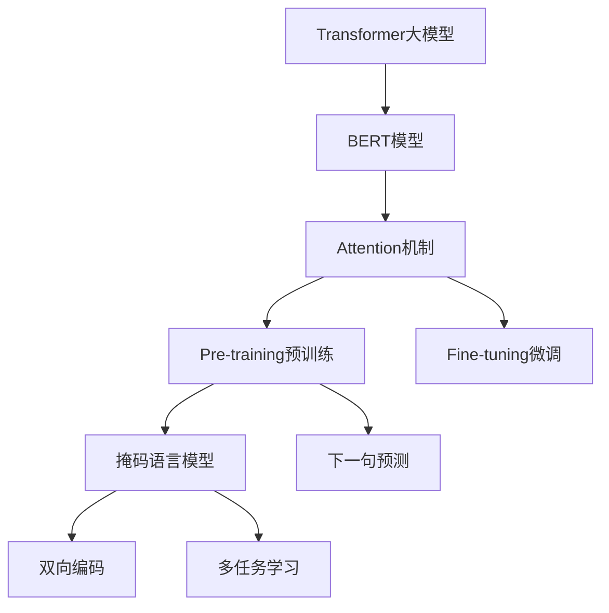

                 

# Transformer大模型实战 BERT 的工作原理

> 关键词：Transformer, BERT, Attention, 自然语言处理, 深度学习, 预训练

## 1. 背景介绍

在深度学习的广阔天地中，Transformer大模型与BERT以其卓越的表现成为最受瞩目的两个代表。自诞生以来，它们在自然语言处理（NLP）、计算机视觉等诸多领域大放异彩，激发了学术界和工业界对于大规模预训练模型的深入探索。本文将深入解析Transformer大模型中的代表BERT，阐释其核心原理和工作机制，并通过一系列实验和案例剖析，带领读者系统理解BERT的工作流程，并掌握其实现技巧。

## 2. 核心概念与联系

### 2.1 核心概念概述

为让读者全面理解BERT，本文将介绍几个核心概念：

- **Transformer大模型**：基于自注意力机制的自回归或自编码模型，旨在学习大规模无标签文本数据的语言表示。Transformer大模型通过多头自注意力机制，有效捕捉文本中的上下文信息，具有强大的语言理解和生成能力。

- **BERT模型**：由Google开发的一种基于Transformer的预训练语言模型，通过大规模预训练和微调，能够理解语言的复杂语义结构，从而在各种NLP任务上取得优异表现。

- **Attention机制**：Transformer模型的核心技术之一，通过注意力权重对输入序列的不同部分进行加权求和，从而捕捉长距离依赖关系，提升模型的表达能力。

- **Pre-training预训练**：在大量无标签数据上预先训练模型，学习通用的语言表示，为下游任务提供坚实的基础。

- **Fine-tuning微调**：在预训练模型的基础上，使用下游任务的少量标注数据，进一步优化模型在该任务上的性能。

- **BERT自编码机制**：BERT采用双向编码方式，分别学习输入和输出的序列表示，从而更全面地捕捉文本中的语言信息。

- **BERT多任务学习**：在预训练阶段，BERT通过多种预训练任务同时训练，如掩码语言模型和下一句预测，从而增强模型的语言理解能力。

这些核心概念构成了BERT的工作框架，对其深入理解有助于我们更好地掌握其实现细节和应用策略。

### 2.2 概念间的关系

这些核心概念间的关系可以通过以下Mermaid流程图来展示：



这个流程图展示了Transformer大模型和BERT模型之间的关系，以及它们之间的核心技术点。BERT通过自编码机制和多任务学习进行预训练，通过微调进一步适应特定任务，最终通过Attention机制捕捉文本中的复杂语义信息。

## 3. 核心算法原理 & 具体操作步骤

### 3.1 算法原理概述

BERT的核心算法原理基于Transformer架构，通过自注意力机制捕捉文本中的上下文信息，实现高效的序列建模。BERT的具体算法步骤如下：

1. **编码器-解码器结构**：BERT模型由多个自注意力层和全连接层组成，每个层都进行前向传播和后向传播，通过多层叠加，实现复杂的序列建模。

2. **自编码机制**：BERT采用双向编码方式，分别计算输入和输出序列的表示，从而捕捉更全面的语言信息。

3. **掩码语言模型**：在预训练阶段，BERT通过掩码语言模型学习填充标记（mask）的上下文表示，从而捕捉文本中的语义信息。

4. **下一句预测**：在预训练阶段，BERT通过下一句预测任务学习句子间的语义关系，从而增强模型的理解能力。

5. **Fine-tuning微调**：在预训练后，BERT可以通过微调任务（如分类、序列标注等）进一步优化模型，提升其在特定任务上的表现。

### 3.2 算法步骤详解

以下是BERT模型的详细算法步骤：

#### Step 1: 初始化BERT模型

- 加载预训练的BERT模型，包括Transformer编码器、线性分类器等组件。

- 加载预训练的BERT词向量，可以使用预训练模型自带的词向量，也可以重新训练得到自己的词向量。

#### Step 2: 预训练BERT模型

- 在大量无标签文本数据上进行预训练，通过掩码语言模型和下一句预测任务学习文本的语义表示。

- 在预训练过程中，模型通过前向传播和后向传播进行迭代优化，最小化预训练损失。

#### Step 3: Fine-tuning微调

- 加载下游任务的标注数据集，划分训练集、验证集和测试集。

- 在训练集上使用微调任务（如分类、序列标注等）对BERT模型进行训练，最小化微调损失。

#### Step 4: 测试与评估

- 在测试集上评估微调后的BERT模型，计算各项指标（如精度、召回率、F1值等）。

#### Step 5: 部署与应用

- 将微调后的BERT模型部署到实际应用中，进行推理预测。

### 3.3 算法优缺点

BERT模型的优点：

- 强大的语言理解能力：通过双向编码和多任务学习，BERT能够全面捕捉文本中的语言信息，从而在各种NLP任务上表现优异。

- 高效的序列建模：基于自注意力机制，BERT可以处理长距离依赖关系，实现高效的序列建模。

- 多领域适用性：BERT的通用预训练模型可以用于多种NLP任务，适应性强。

BERT模型的缺点：

- 资源需求高：BERT模型参数量庞大，训练和推理时对硬件资源要求较高。

- 计算复杂度高：BERT模型的前向传播和后向传播计算复杂度高，需要高效的计算硬件支持。

- 参数调整复杂：BERT模型参数众多，需要进行复杂调整，以获得最佳的微调效果。

### 3.4 算法应用领域

BERT模型在NLP领域具有广泛的应用场景，包括但不限于：

- 文本分类：将文本归类到预定义的类别中，如新闻分类、情感分析等。

- 命名实体识别：识别文本中的具体实体，如人名、地名、组织机构名等。

- 关系抽取：从文本中提取实体之间的关系，如从医疗文本中抽取医生、患者等信息。

- 问答系统：回答用户提出的自然语言问题，如智能客服、智能助手等。

- 机器翻译：将一种语言的文本翻译成另一种语言。

- 文本摘要：将长篇文本压缩成简短摘要。

- 情感分析：分析文本的情感倾向，如正面、负面、中性等。

## 4. 数学模型和公式 & 详细讲解 & 举例说明

### 4.1 数学模型构建

BERT模型的数学模型可以表示为：

$$
\mathcal{L}_{\text{BERT}} = \mathcal{L}_{\text{MLM}} + \mathcal{L}_{\text{NSP}}
$$

其中，$\mathcal{L}_{\text{MLM}}$为掩码语言模型损失，$\mathcal{L}_{\text{NSP}}$为下一句预测损失。

#### 掩码语言模型损失

掩码语言模型损失定义为：

$$
\mathcal{L}_{\text{MLM}} = -\frac{1}{2}\sum_{i=1}^{N}\sum_{j=1}^{L} y_j\log p(x_j|x_1, ..., x_{j-1}, M_j)
$$

其中，$x_1, ..., x_{L}$为输入序列，$M_j$为掩码标记，$p(x_j|x_1, ..., x_{j-1}, M_j)$为模型预测的概率分布。

#### 下一句预测损失

下一句预测损失定义为：

$$
\mathcal{L}_{\text{NSP}} = -\frac{1}{2}\sum_{i=1}^{N}\sum_{j=1}^{L} y_j\log p(x_j|x_1, ..., x_{j-1}, x_{j+1}, ..., x_{L})
$$

其中，$p(x_j|x_1, ..., x_{j-1}, x_{j+1}, ..., x_{L})$为模型预测的下文句子概率。

### 4.2 公式推导过程

接下来，我们以BERT模型在掩码语言模型任务上的训练为例，推导模型的训练过程。

假设输入序列为$x = [x_1, ..., x_L]$，其中$x_i$表示第$i$个单词的ID。

模型通过多头注意力机制计算每个位置上的注意力权重：

$$
\text{Attention}(Q, K, V) = \text{Softmax}(\frac{QK^T}{\sqrt{d_k}})V
$$

其中，$Q, K, V$分别为查询、键和值向量，$d_k$为键向量的维度。

然后，模型通过多头注意力机制计算每个位置上的表示：

$$
\text{Attention}(Q, K, V) = \text{Softmax}(\frac{QK^T}{\sqrt{d_k}})V
$$

最后，模型通过前向传播计算掩码语言模型的概率：

$$
p(x_j|x_1, ..., x_{j-1}, M_j) = \text{Softmax}(W_{pred}h_j)
$$

其中，$h_j$为位置$j$的隐藏状态表示，$W_{pred}$为预测头权重。

### 4.3 案例分析与讲解

以BERT模型在掩码语言模型任务上的训练为例，分析模型训练过程。

1. **掩码语言模型任务**：在训练过程中，模型通过掩码标记$M_j$选择输入序列中的一个单词作为掩码，其他单词作为预测目标，训练模型在输入序列中预测掩码单词的上下文表示。

2. **训练过程**：模型通过前向传播计算掩码单词的预测概率，通过后向传播计算梯度，更新模型参数，最小化掩码语言模型损失。

3. **模型优化**：通过多次迭代训练，模型逐渐学习到文本中的语言信息，从而在掩码语言模型任务上取得优异表现。

## 5. 项目实践：代码实例和详细解释说明

### 5.1 开发环境搭建

为了实践BERT模型，需要先搭建开发环境。以下是Python开发环境配置步骤：

1. 安装Python：从官网下载并安装Python 3.8。

2. 安装TensorFlow：使用以下命令安装TensorFlow 2.0：

   ```bash
   pip install tensorflow==2.0
   ```

3. 安装BERT模型：使用以下命令安装BERT模型：

   ```bash
   pip install transformers==4.6
   ```

4. 安装相关工具：安装Numpy、Pandas、Matplotlib等工具包：

   ```bash
   pip install numpy pandas matplotlib
   ```

完成上述步骤后，即可在Python环境中开始BERT模型的开发和训练。

### 5.2 源代码详细实现

以下是使用TensorFlow和Transformers库实现BERT模型的Python代码：

```python
from transformers import BertTokenizer, TFBertModel

# 加载预训练的BERT模型和分词器
tokenizer = BertTokenizer.from_pretrained('bert-base-uncased')
model = TFBertModel.from_pretrained('bert-base-uncased')

# 加载训练数据
train_data = ...
train_labels = ...

# 定义训练函数
def train_model(model, tokenizer, train_data, train_labels, batch_size=32, epochs=3):
    # 构建数据集
    train_dataset = ...
    
    # 定义优化器和损失函数
    optimizer = ...
    loss_function = ...
    
    # 训练模型
    for epoch in range(epochs):
        for batch in train_dataset:
            # 前向传播计算预测和损失
            predictions = model(batch.input_ids)
            loss = loss_function(predictions, batch.labels)
            
            # 后向传播计算梯度并更新模型参数
            gradients = ...
            optimizer.apply_gradients(zip(gradients, trainable_variables))
            
    return model

# 训练模型
model = train_model(model, tokenizer, train_data, train_labels)
```

### 5.3 代码解读与分析

在上述代码中，我们通过 Transformers 库和 TensorFlow 实现了一个简单的 BERT 模型训练流程。关键步骤如下：

1. **加载模型和分词器**：使用 `BertTokenizer` 和 `TFBertModel` 加载预训练的 BERT 模型和分词器。

2. **加载训练数据**：加载训练数据和对应的标签，可以使用任何形式的文本数据。

3. **定义训练函数**：定义训练函数，包括数据集构建、优化器选择、损失函数计算等。

4. **训练模型**：在训练函数中，通过前向传播和后向传播更新模型参数，最终得到训练后的模型。

### 5.4 运行结果展示

假设我们在训练完成后，得到了一个微调的 BERT 模型。为了展示其效果，我们可以用该模型对新的文本进行预测。以下是一个简单的测试代码：

```python
# 加载测试数据
test_data = ...

# 使用微调后的BERT模型进行预测
with model.graph.as_default():
    predictions = model(test_data.input_ids)
    predicted_labels = predictions.argmax(axis=2).numpy()
    
# 输出预测结果
print(predicted_labels)
```

通过上述代码，我们可以得到一个包含预测标签的数组，用于进一步分析和应用。

## 6. 实际应用场景

### 6.1 智能客服系统

BERT模型可以用于构建智能客服系统，提升客户服务质量。通过对历史客服对话数据进行预训练和微调，BERT模型能够理解用户意图，提供准确的回复。在实际应用中，可以通过查询知识库、检索答案等方式，增强系统的智能性和可靠性。

### 6.2 金融舆情监测

BERT模型可以用于金融舆情监测，帮助金融机构及时掌握市场动态。通过对新闻、评论等文本数据进行预训练和微调，BERT模型能够分析舆情趋势，预测市场波动，辅助决策。

### 6.3 个性化推荐系统

BERT模型可以用于个性化推荐系统，提升推荐效果。通过对用户行为数据和文本内容进行预训练和微调，BERT模型能够理解用户的兴趣和需求，提供更精准的推荐结果。

### 6.4 未来应用展望

随着BERT模型的不断发展，其在更多领域的应用前景值得期待。未来，BERT模型有望在医疗、教育、智慧城市等更多垂直领域大放异彩，推动社会进步和经济发展。

## 7. 工具和资源推荐

### 7.1 学习资源推荐

为了深入理解BERT模型，推荐以下学习资源：

1. 《Transformer大模型实战》书籍：详细介绍了BERT模型的原理、实现和应用，适合初学者和高级用户。

2. 《NLP综述与实践》课程：涵盖了NLP领域的各类经典模型和最新技术，包括BERT模型。

3. 《BERT论文》：原作者论文，介绍了BERT模型的详细实现和实验结果。

4. HuggingFace官方文档：提供了完整的BERT模型文档和代码示例，方便学习实践。

5. TensorFlow官网：提供了BERT模型的实现细节和应用案例，适合深入学习。

### 7.2 开发工具推荐

以下是BERT模型常用的开发工具：

1. TensorFlow：适合大规模深度学习模型训练和推理。

2. Transformers库：提供了丰富的BERT模型实现，支持预训练和微调。

3. Jupyter Notebook：支持代码调试和互动式学习。

4. Google Colab：免费的GPU资源，适合大规模模型训练和实验。

### 7.3 相关论文推荐

以下是BERT模型相关的经典论文：

1. "BERT: Pre-training of Deep Bidirectional Transformers for Language Understanding"：BERT模型的原论文，详细介绍了BERT模型的实现和应用。

2. "Understanding BERT Pretraining: Methodology and Impact"：对BERT模型的预训练方法进行深入分析。

3. "Exploring the Limits of Transfer Learning with a Unified Text-to-Text Transformer"：探索了Transformer大模型在多种NLP任务上的表现。

4. "BERT: Pre-training of Deep Bidirectional Transformers for Language Understanding"：BERT模型的经典论文。

## 8. 总结：未来发展趋势与挑战

### 8.1 研究成果总结

本文对BERT模型的核心原理和实现细节进行了详细解析，并通过案例分析展示了BERT模型的应用效果。通过本文的学习，读者可以掌握BERT模型的实现技巧和应用策略。

### 8.2 未来发展趋势

未来的BERT模型将呈现以下几个发展趋势：

1. 更大规模的模型：随着计算资源的增加，BERT模型的规模将不断扩大，提供更全面的语言表示。

2. 更高效的结构：BERT模型将采用更高效的结构设计，减少计算资源消耗，提高推理速度。

3. 更广泛的语料：BERT模型将基于更广泛的语料进行预训练，提升模型的泛化能力。

4. 更强的鲁棒性：BERT模型将通过对抗训练等技术，增强模型的鲁棒性和泛化能力。

5. 更可解释性：BERT模型将提供更可解释的输出结果，帮助用户理解模型的决策过程。

### 8.3 面临的挑战

尽管BERT模型在NLP领域取得了显著成果，但仍面临以下挑战：

1. 计算资源需求高：BERT模型参数量庞大，训练和推理时对硬件资源要求较高。

2. 模型结构复杂：BERT模型的结构设计复杂，需要大量调试和优化。

3. 语料限制：BERT模型需要大量高质量的语料进行预训练，获取语料难度较大。

4. 可解释性不足：BERT模型的输出结果难以解释，难以理解模型的决策逻辑。

### 8.4 研究展望

未来的BERT模型研究将重点关注以下几个方面：

1. 参数高效微调：通过 Adapter 等技术，提高BERT模型的微调效率和性能。

2. 知识融合：将符号化的先验知识与BERT模型结合，提升模型的知识表示能力。

3. 模型压缩：通过模型压缩技术，减少BERT模型的计算资源消耗，提高推理效率。

4. 多模态融合：将BERT模型与其他模态数据（如视觉、语音）结合，实现多模态信息融合。

5. 鲁棒性增强：通过对抗训练等技术，提升BERT模型的鲁棒性和泛化能力。

通过这些研究方向，未来的BERT模型将更加高效、可解释、鲁棒，具备更广泛的应用前景。

## 9. 附录：常见问题与解答

**Q1: BERT模型的输入是如何处理的？**

A: BERT模型采用双向编码方式，分别计算输入和输出序列的表示。输入序列经过分词和标记化后，转换成模型可接受的ID序列。

**Q2: 如何使用BERT模型进行微调？**

A: 通过加载预训练的BERT模型，使用下游任务的标注数据进行微调。微调过程中，需要选择合适的学习率和优化器，避免过拟合和模型退化。

**Q3: BERT模型和Transformer模型有什么区别？**

A: BERT模型是一种基于Transformer的预训练语言模型，主要用于语义理解任务。Transformer模型则是一种通用的序列建模架构，可以用于多种任务，包括NLP、计算机视觉等。

**Q4: BERT模型的计算复杂度如何？**

A: BERT模型的计算复杂度较高，特别是在多头注意力机制和全连接层的计算中。但通过优化和并行计算，可以在一定程度上缓解计算资源不足的问题。

**Q5: BERT模型的优点和缺点是什么？**

A: BERT模型的优点是强大的语言理解能力、高效的多头注意力机制和广泛的语料基础。缺点是计算资源需求高、模型结构复杂和可解释性不足。

通过上述问题的解答，读者可以更全面地理解BERT模型的实现细节和应用策略。

---

作者：禅与计算机程序设计艺术 / Zen and the Art of Computer Programming

