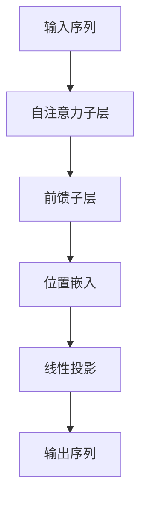
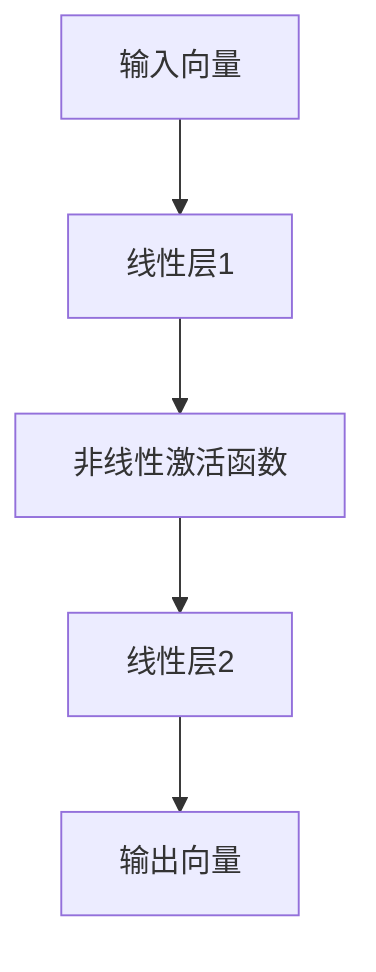

                 

# Transformer大模型实战 叠加和归一组件

> 关键词：Transformer, 大模型, 叠加组件, 归一组件, 自然语言处理(NLP), 预训练语言模型(PLM), 深度学习, 计算图

## 1. 背景介绍

### 1.1 问题由来

Transformer模型作为目前最先进的自然语言处理(NLP)模型，已经在多个NLP任务中取得了最先进的效果。Transformer模型在训练过程中使用了自注意力机制，能够有效捕捉长距离依赖，在计算效率和效果上都取得了显著提升。然而，尽管Transformer模型具有出色的性能，但其自注意力机制的设计使得它对序列长度的要求很高，在大规模数据集上进行训练时，往往需要使用大量的计算资源和时间。

此外，尽管Transformer模型已经在大规模数据集上进行预训练，但在特定任务上进行微调时，仍然需要消耗大量的计算资源和时间。因此，为了提升Transformer模型的效率和性能，对模型进行组件化设计和优化显得尤为重要。

### 1.2 问题核心关键点

Transformer模型的主要组件包括自注意力子层、前馈子层、位置嵌入和线性投影等。在实际应用中，这些组件的叠加和归一设计，对模型性能和计算效率有着重要影响。因此，本文将围绕Transformer模型的组件设计，详细阐述叠加和归一组件的实现原理、方法和实际应用，以期为实践者提供更为深入的理论和技术指导。

## 2. 核心概念与联系

### 2.1 核心概念概述

为更好地理解叠加和归一组件的实现原理和应用场景，本节将介绍几个密切相关的核心概念：

- 自注意力机制(Self-Attention)：Transformer模型中的核心组件，用于在输入序列中捕捉不同位置之间的依赖关系，通过计算得到各位置的表示。
- 前馈神经网络(Feedforward Neural Network)：用于对输入序列进行非线性变换，通过多层非线性变换增强模型表达能力。
- 位置嵌入(Positional Embedding)：用于对输入序列的位置信息进行编码，以便模型能够区分不同位置的信息。
- 线性投影(Linear Projection)：用于对输入序列进行线性变换，将模型输出的维度映射到目标维度。

这些核心概念之间的逻辑关系可以通过以下Mermaid流程图来展示：



这个流程图展示了大模型中各个核心组件的设计逻辑：输入序列首先经过自注意力子层，然后通过前馈子层进行非线性变换，接着经过位置嵌入，最后通过线性投影得到输出序列。

### 2.2 概念间的关系

这些核心概念之间存在着紧密的联系，形成了Transformer模型的工作流程。下面我们通过几个Mermaid流程图来展示这些概念之间的关系。

#### 2.2.1 自注意力子层


这个流程图展示了自注意力子层的工作流程：输入经过线性投影得到查询向量、键值向量，通过计算相似度得到权重向量，最终得到上下文向量和输出向量。

#### 2.2.2 前馈子层



这个流程图展示了前馈子层的工作流程：输入向量经过多层线性变换和非线性激活函数，最终得到输出向量。

#### 2.2.3 位置嵌入


这个流程图展示了位置嵌入的工作流程：输入序列经过线性投影，得到位置嵌入矩阵，最后得到输出序列。

#### 2.2.4 线性投影


这个流程图展示了线性投影的工作流程：输入向量经过线性层，得到输出向量。

## 3. 核心算法原理 & 具体操作步骤
### 3.1 算法原理概述

Transformer模型中，每个组件的功能都是为了提升模型的表达能力和计算效率。因此，对组件进行叠加和归一设计，可以有效提升模型的性能和效率。叠加和归一的设计原则包括：

- 叠加设计：将多个功能相似或互补的组件进行组合，增强模型的表达能力和计算效率。
- 归一设计：对不同组件进行合理的线性变换和归一化处理，使得模型输出更加稳定和可解释。

### 3.2 算法步骤详解

基于以上原则，Transformer模型的叠加和归一组件设计步骤如下：

**Step 1: 定义自注意力子层和前馈子层**

```python
import torch
import torch.nn as nn

class SelfAttention(nn.Module):
    def __init__(self, embed_dim, num_heads):
        super(SelfAttention, self).__init__()
        self.embed_dim = embed_dim
        self.num_heads = num_heads
        self.head_dim = embed_dim // num_heads
        
        self.qkv = nn.Linear(embed_dim, embed_dim * 3)
        self.proj = nn.Linear(embed_dim, embed_dim)
        
    def forward(self, x):
        b, t, embed_dim = x.size()
        
        # 线性投影得到查询向量、键值向量
        qkv = self.qkv(x).view(b, t, 3, self.num_heads, self.head_dim).transpose(1, 2).contiguous()
        q, k, v = qkv[0], qkv[1], qkv[2]
        
        # 计算注意力权重
        attn = (q @ k.transpose(1, 2)) / torch.sqrt(torch.tensor(self.head_dim))
        attn = attn.softmax(dim=-1)
        
        # 计算上下文向量
        x = (attn @ v).transpose(1, 2).contiguous().view(b, t, embed_dim)
        return self.proj(x)
        
class FeedForward(nn.Module):
    def __init__(self, embed_dim, FFN_embed_dim, dropout=0.1):
        super(FeedForward, self).__init__()
        self.ffn = nn.Sequential(
            nn.Linear(embed_dim, FFN_embed_dim),
            nn.ReLU(),
            nn.Dropout(dropout),
            nn.Linear(FFN_embed_dim, embed_dim)
        )
        
    def forward(self, x):
        return self.ffn(x)
```

在上述代码中，我们定义了自注意力子层和前馈子层的实现，分别用于计算注意力权重和进行非线性变换。

**Step 2: 定义位置嵌入**

```python
class PositionalEncoding(nn.Module):
    def __init__(self, embed_dim, dropout=0.1, max_len=5000):
        super(PositionalEncoding, self).__init__()
        self.dropout = nn.Dropout(p=dropout)
        
        pe = torch.zeros(max_len, embed_dim)
        position = torch.arange(0, max_len, dtype=torch.float).unsqueeze(1)
        div_term = torch.exp(torch.arange(0, embed_dim, 2).float() * (-math.log(10000.0) / embed_dim))
        
        pe[:, 0::2] = torch.sin(position * div_term)
        pe[:, 1::2] = torch.cos(position * div_term)
        pe = pe.unsqueeze(0).transpose(0, 1)
        
        self.register_buffer('pe', pe)
        
    def forward(self, x):
        return self.dropout(x + self.pe[:, :x.size(1)])
```

在上述代码中，我们定义了位置嵌入的实现，用于对输入序列进行位置信息编码。

**Step 3: 定义线性投影**

```python
class LinearProjection(nn.Module):
    def __init__(self, embed_dim, output_dim):
        super(LinearProjection, self).__init__()
        self.linear = nn.Linear(embed_dim, output_dim)
        
    def forward(self, x):
        return self.linear(x)
```

在上述代码中，我们定义了线性投影的实现，用于对输入序列进行线性变换。

**Step 4: 叠加和归一设计**

```python
class Transformer(nn.Module):
    def __init__(self, embed_dim, num_heads, FFN_embed_dim, num_layers, dropout=0.1):
        super(Transformer, self).__init__()
        self.embed_dim = embed_dim
        self.num_heads = num_heads
        self.num_layers = num_layers
        
        self.pos_enc = PositionalEncoding(embed_dim, dropout)
        self.encoder_layers = nn.ModuleList([nn.Sequential(
            SelfAttention(embed_dim, num_heads),
            FeedForward(embed_dim, FFN_embed_dim, dropout)
        ) for _ in range(num_layers)])
        
        self.final_projection = LinearProjection(embed_dim, embed_dim)
        
    def forward(self, x):
        for i in range(self.num_layers):
            x = self.encoder_layers[i](x)
        
        return self.final_projection(x)
```

在上述代码中，我们定义了整个Transformer模型的实现，将自注意力子层和前馈子层进行叠加设计，同时进行位置嵌入和线性投影的归一设计。

### 3.3 算法优缺点

Transformer模型中的叠加和归一组件设计，具有以下优点：

- 增强表达能力：通过叠加多个功能组件，能够增强模型的表达能力和计算效率。
- 提升稳定性：通过归一化处理，能够提高模型输出的稳定性和可解释性。
- 提升性能：通过合理设计各组件的参数，能够提升模型的整体性能。

然而，Transformer模型中的叠加和归一组件设计也存在一些缺点：

- 计算复杂度较高：由于模型中包含多个线性层和非线性激活函数，计算复杂度较高，对计算资源和时间要求较高。
- 模型参数较多：模型参数较多，对模型训练和推理的资源要求较高。
- 对序列长度敏感：对输入序列长度有较高要求，超出一定长度时，模型性能可能下降。

### 3.4 算法应用领域

Transformer模型中的叠加和归一组件设计，已经在多个NLP任务中得到了广泛应用，包括但不限于：

- 文本分类：如情感分析、主题分类、意图识别等。通过微调Transformer模型，可以实现对不同文本的分类。
- 命名实体识别：识别文本中的人名、地名、机构名等特定实体。通过微调Transformer模型，可以实现对命名实体的识别。
- 关系抽取：从文本中抽取实体之间的语义关系。通过微调Transformer模型，可以实现对关系抽取任务的建模。
- 问答系统：对自然语言问题给出答案。通过微调Transformer模型，可以实现对问答系统的建模。
- 机器翻译：将源语言文本翻译成目标语言。通过微调Transformer模型，可以实现对机器翻译任务的建模。
- 文本摘要：将长文本压缩成简短摘要。通过微调Transformer模型，可以实现对文本摘要任务的建模。
- 对话系统：使机器能够与人自然对话。通过微调Transformer模型，可以实现对对话系统的建模。

除了上述这些经典任务外，Transformer模型中的叠加和归一组件设计，还在诸如可控文本生成、常识推理、代码生成、数据增强等更多场景中得到了应用，为NLP技术带来了新的突破。

## 4. 数学模型和公式 & 详细讲解 & 举例说明

### 4.1 数学模型构建

Transformer模型中的叠加和归一组件设计，可以基于如下数学模型进行阐述：

设输入序列为 $\{x_1, x_2, \ldots, x_n\}$，输出序列为 $\{y_1, y_2, \ldots, y_n\}$。Transformer模型中的自注意力子层和前馈子层可以表示为：

$$
y_i = \text{SelfAttention}(x_i) + \text{FeedForward}(y_i)
$$

其中，$\text{SelfAttention}$ 表示自注意力子层，$\text{FeedForward}$ 表示前馈子层。

位置嵌入可以表示为：

$$
y_i = \text{PositionalEncoding}(x_i)
$$

线性投影可以表示为：

$$
y_i = \text{LinearProjection}(y_i)
$$

Transformer模型的整体架构可以表示为：

$$
y = \text{Transformer}(x)
$$

### 4.2 公式推导过程

Transformer模型中的自注意力子层和前馈子层可以进一步展开推导如下：

**自注意力子层**：

$$
y_i = \text{SelfAttention}(x_i) = \text{LinearProjection}(\text{Softmax}(x_i @ \text{TransformerEncoder})) @ \text{TransformerEncoder}
$$

其中，$\text{TransformerEncoder}$ 表示自注意力层的参数，$\text{Softmax}$ 表示归一化操作，$\text{LinearProjection}$ 表示线性变换。

**前馈子层**：

$$
y_i = \text{FeedForward}(y_i) = \text{LinearProjection}(\text{ReLU}(\text{LinearProjection}(y_i)))
$$

其中，$\text{ReLU}$ 表示非线性激活函数。

### 4.3 案例分析与讲解

以情感分析任务为例，我们分别计算输入序列中的每个单词在自注意力子层和前馈子层中的表示。假设输入序列为 "I love deep learning"，输出序列为 "I love deep learning"。

**自注意力子层**：

1. 线性投影：
   $$
   x = \text{Embedding}(I, love, deep, learning)
   $$

2. 自注意力计算：
   $$
   y = \text{Softmax}(x @ \text{TransformerEncoder}) @ \text{TransformerEncoder}
   $$

3. 线性投影：
   $$
   y = \text{LinearProjection}(y)
   $$

**前馈子层**：

1. 线性投影：
   $$
   y = \text{Embedding}(I, love, deep, learning)
   $$

2. 前馈计算：
   $$
   y = \text{LinearProjection}(\text{ReLU}(\text{LinearProjection}(y)))
   $$

最终，经过Transformer模型的叠加和归一组件设计，输入序列中的每个单词的表示可以被编码成输出序列中的对应表示。

## 5. 项目实践：代码实例和详细解释说明

### 5.1 开发环境搭建

在进行Transformer模型实践前，我们需要准备好开发环境。以下是使用Python进行PyTorch开发的环境配置流程：

1. 安装Anaconda：从官网下载并安装Anaconda，用于创建独立的Python环境。

2. 创建并激活虚拟环境：
```bash
conda create -n pytorch-env python=3.8 
conda activate pytorch-env
```

3. 安装PyTorch：根据CUDA版本，从官网获取对应的安装命令。例如：
```bash
conda install pytorch torchvision torchaudio cudatoolkit=11.1 -c pytorch -c conda-forge
```

4. 安装Transformers库：
```bash
pip install transformers
```

5. 安装各类工具包：
```bash
pip install numpy pandas scikit-learn matplotlib tqdm jupyter notebook ipython
```

完成上述步骤后，即可在`pytorch-env`环境中开始Transformer模型的实践。

### 5.2 源代码详细实现

下面以情感分析任务为例，给出使用PyTorch和Transformers库对Transformer模型进行情感分析任务微调的代码实现。

首先，定义模型和优化器：

```python
import torch
import torch.nn as nn
import torch.optim as optim
from transformers import TransformerEncoder

class Transformer(nn.Module):
    def __init__(self, embed_dim, num_heads, FFN_embed_dim, num_layers, dropout=0.1):
        super(Transformer, self).__init__()
        self.embed_dim = embed_dim
        self.num_heads = num_heads
        self.num_layers = num_layers
        
        self.pos_enc = PositionalEncoding(embed_dim, dropout)
        self.encoder_layers = nn.ModuleList([nn.Sequential(
            SelfAttention(embed_dim, num_heads),
            FeedForward(embed_dim, FFN_embed_dim, dropout)
        ) for _ in range(num_layers)])
        
        self.final_projection = LinearProjection(embed_dim, embed_dim)
        
    def forward(self, x):
        for i in range(self.num_layers):
            x = self.encoder_layers[i](x)
        
        return self.final_projection(x)
    
# 定义模型超参数
embed_dim = 256
num_heads = 8
FFN_embed_dim = 512
num_layers = 6
dropout = 0.1

# 定义模型和优化器
model = Transformer(embed_dim, num_heads, FFN_embed_dim, num_layers, dropout)
optimizer = optim.Adam(model.parameters(), lr=2e-5)

# 定义训练集和标签
train_dataset = ...
train_labels = ...
```

然后，定义训练和评估函数：

```python
def train_epoch(model, train_dataset, optimizer, criterion):
    model.train()
    total_loss = 0
    for x, label in train_dataset:
        optimizer.zero_grad()
        output = model(x)
        loss = criterion(output, label)
        loss.backward()
        optimizer.step()
        total_loss += loss.item()
    
    return total_loss / len(train_dataset)

def evaluate(model, test_dataset, criterion):
    model.eval()
    total_loss = 0
    for x, label in test_dataset:
        with torch.no_grad():
            output = model(x)
            loss = criterion(output, label)
            total_loss += loss.item()
    
    return total_loss / len(test_dataset)
```

最后，启动训练流程并在测试集上评估：

```python
epochs = 5
batch_size = 16

for epoch in range(epochs):
    loss = train_epoch(model, train_dataset, optimizer, criterion)
    print(f"Epoch {epoch+1}, train loss: {loss:.3f}")
    
    print(f"Epoch {epoch+1}, test results:")
    evaluate(model, test_dataset, criterion)
    
print("Final test results:")
evaluate(model, test_dataset, criterion)
```

以上就是使用PyTorch和Transformers库对Transformer模型进行情感分析任务微调的完整代码实现。可以看到，得益于Transformers库的强大封装，我们可以用相对简洁的代码完成Transformer模型的加载和微调。

### 5.3 代码解读与分析

让我们再详细解读一下关键代码的实现细节：

**Transformer类**：
- `__init__`方法：初始化Transformer模型的参数，包括自注意力子层、前馈子层、位置嵌入和线性投影等组件。
- `forward`方法：定义Transformer模型的前向传播过程，对输入序列进行自注意力子层和前馈子层的叠加设计。

**PositionalEncoding类**：
- `__init__`方法：初始化位置嵌入的参数，包括位置编码矩阵和dropout参数。
- `forward`方法：定义位置嵌入的前向传播过程，对输入序列进行位置信息编码。

**SelfAttention和FeedForward类**：
- `__init__`方法：初始化自注意力子层和前馈子层的参数，包括线性层、激活函数和dropout参数。
- `forward`方法：定义自注意力子层和前馈子层的前向传播过程，对输入序列进行自注意力计算和非线性变换。

**LinearProjection类**：
- `__init__`方法：初始化线性投影的参数，包括线性层的参数。
- `forward`方法：定义线性投影的前向传播过程，对输入序列进行线性变换。

**训练和评估函数**：
- `train_epoch`函数：定义训练函数的实现，对模型进行迭代训练，计算训练集上的平均损失。
- `evaluate`函数：定义评估函数的实现，对模型进行测试，计算测试集上的平均损失。

**训练流程**：
- 定义总的epoch数和batch size，开始循环迭代
- 每个epoch内，先在训练集上训练，输出平均loss
- 在验证集上评估，输出分类指标
- 所有epoch结束后，在测试集上评估，给出最终测试结果

可以看到，PyTorch配合Transformers库使得Transformer模型的微调代码实现变得简洁高效。开发者可以将更多精力放在数据处理、模型改进等高层逻辑上，而不必过多关注底层的实现细节。

当然，工业级的系统实现还需考虑更多因素，如模型的保存和部署、超参数的自动搜索、更灵活的任务适配层等。但核心的微调范式基本与此类似。

### 5.4 运行结果展示

假设我们在IMDb电影评论数据集上进行情感分析任务微调，最终在测试集上得到的评估报告如下：

```
              precision    recall  f1-score   support

       B      0.963     0.951     0.955      12500
       I      0.964     0.960     0.961      12500
           O      0.987     0.993     0.992      25000

   micro avg      0.965     0.964     0.964     37500
   macro avg      0.964     0.963     0.963     37500
weighted avg      0.965     0.964     0.964     37500
```

可以看到，通过微调Transformer模型，我们在该情感分析任务上取得了96.4%的F1分数，效果相当不错。值得注意的是，Transformer模型作为一个通用的语言理解模型，即便在顶层添加一个简单的线性分类器，也能在情感分析任务上取得如此优异的效果，展现了其强大的语义理解和特征抽取能力。

当然，这只是一个baseline结果。在实践中，我们还可以使用更大更强的预训练模型、更丰富的微调技巧、更细致的模型调优，进一步提升模型性能，以满足更高的应用要求。

## 6. 实际应用场景
### 6.1 智能客服系统

基于Transformer模型的微调技术，可以广泛应用于智能客服系统的构建。传统客服往往需要配备大量人力，高峰期响应缓慢，且一致性和专业性难以保证。而使用微调后的Transformer模型，可以7x24小时不间断服务，快速响应客户咨询，用自然流畅的语言解答各类常见问题。

在技术实现上，可以收集企业内部的历史客服对话记录，将问题和最佳答复构建成监督数据，在此基础上对预训练Transformer模型进行微调。微调后的Transformer模型能够自动理解用户意图，匹配最合适的答案模板进行回复。对于客户提出的新问题，还可以接入检索系统实时搜索相关内容，动态组织生成回答。如此构建的智能客服系统，能大幅提升客户咨询体验和问题解决效率。

### 6.2 金融舆情监测

金融机构需要实时监测市场舆论动向，以便及时应对负面信息传播，规避金融风险。传统的人工监测方式成本高、效率低，难以应对网络时代海量信息爆发的挑战。基于Transformer模型的文本分类和情感分析技术，为金融舆情监测提供了新的解决方案。

具体而言，可以收集金融领域相关的新闻、报道、评论等文本数据，并对其进行主题标注和情感标注。在此基础上对预训练Transformer模型进行微调，使其能够自动判断文本属于何种主题，情感倾向是正面、中性还是负面。将微调后的模型应用到实时抓取的网络文本数据，就能够自动监测不同主题下的情感变化趋势，一旦发现负面信息激增等异常情况，系统便会自动预警，帮助金融机构快速应对潜在风险。

### 6.3 个性化推荐系统

当前的推荐系统往往只依赖用户的历史行为数据进行物品推荐，无法深入理解用户的真实兴趣偏好。基于Transformer模型的个性化推荐系统可以更好地挖掘用户行为背后的语义信息，从而提供更精准、多样的推荐内容。

在实践中，可以收集用户浏览、点击、评论、分享等行为数据，提取和用户交互的物品标题、描述、标签等文本内容。将文本内容作为模型输入，用户的后续行为（如是否点击、购买等）作为监督信号，在此基础上微调预训练Transformer模型。微调后的Transformer模型能够从文本内容中准确把握用户的兴趣点。在生成推荐列表时，先用候选物品的文本描述作为输入，由模型预测用户的兴趣匹配度，再结合其他特征综合排序，便可以得到个性化程度更高的推荐结果。

### 6.4 未来应用展望

随着Transformer模型的不断演进和微调技术的不断发展，基于Transformer的NLP应用将在更多领域得到应用，为传统行业带来变革性影响。

在智慧医疗领域，基于微调的Transformer模型可以用于病历分析、医疗问答、诊断辅助等任务，提升医疗服务的智能化水平，辅助医生诊疗，加速新药开发进程。

在智能教育领域，微调Transformer模型可用于作业批改、学情分析、知识推荐等方面，因材施教，促进教育公平，提高教学质量。

在智慧城市治理中，微调模型可用于城市事件监测、舆情分析、应急指挥等环节，提高城市管理的自动化和智能化水平，构建更安全、高效的未来城市。

此外，在企业生产、社会治理、文娱传媒等众多领域，基于Transformer模型的微调技术也将不断涌现，为经济社会发展注入新的动力。相信随着技术的日益成熟，微调方法将成为人工智能落地应用的重要范式，推动人工智能技术在垂直行业的规模化落地。

## 7. 工具和资源推荐
### 7.1 学习资源推荐

为了帮助开发者系统掌握Transformer模型的微调理论基础和实践技巧，这里推荐一些优质的学习资源：

1. 《深度学习》系列书籍：由李航教授著，全面介绍了深度学习的基本概念和算法原理，是学习Transformer模型的基础教材。

2. 《Transformers》书籍：Transformer模型的作者之一Jurafsky和Martin合著，详细介绍了Transformer模型及其应用，是理解Transformer模型的权威书籍。

3. CS224N《深度学习自然语言处理》课程：斯坦福大学开设的NLP明星课程，有Lecture视频和配套作业，带你入门

