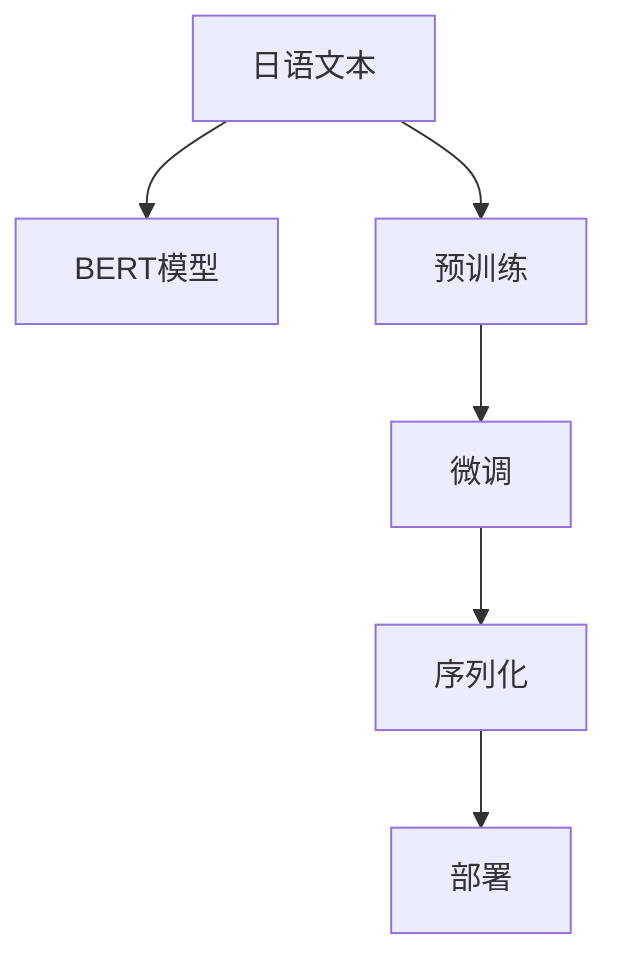
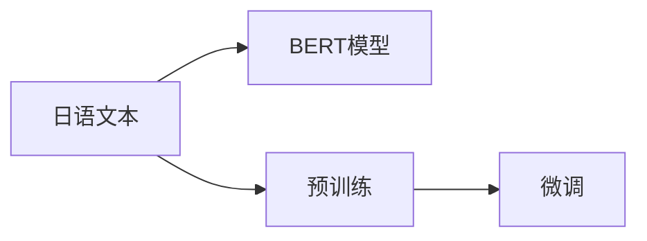

                 

# Transformer大模型实战 日语的BERT模型

> 关键词：Transformer, BERT, 日语, 大模型, 深度学习, NLP

## 1. 背景介绍

### 1.1 问题由来
Transformer大模型，特别是BERT（Bidirectional Encoder Representations from Transformers）模型，是近年来在自然语言处理（NLP）领域取得巨大突破的里程碑式成果。BERT模型以其卓越的语言理解能力、广泛的通用性和良好的跨领域迁移能力，被广泛应用于各种NLP任务，如文本分类、命名实体识别、情感分析等。

然而，尽管BERT模型在英语等主流语言上表现出色，但在日语等非主流语言上，其性能仍面临一定挑战。这主要是因为日语与英语的语法、词汇、语义结构存在显著差异。因此，如何将BERT模型有效地应用于日语处理，成为当前研究的重要方向。

### 1.2 问题核心关键点
基于此，本文将重点探讨如何在大模型上训练一个能够有效处理日语文本的BERT模型。以下是该问题的核心关键点：

1. 选择合适的预训练语言模型，如OpenAI的gpt-j、gpt-j2等。
2. 构建日语语料库，并进行预训练。
3. 设计任务适配层，实现微调。
4. 实现模型的序列化与部署。

### 1.3 问题研究意义
研究日语的BERT模型，对于拓展BERT模型在日语处理中的应用，提升NLP任务的性能，加速日语技术产业化进程，具有重要意义：

1. 降低应用开发成本。通过在大模型上进行微调，可以显著减少从头开发所需的资源和时间成本。
2. 提升模型效果。微调使得通用大模型更好地适应日语任务，在应用场景中取得更优表现。
3. 加速开发进度。standing on the shoulders of giants，微调使得开发者可以更快地完成任务适配，缩短开发周期。
4. 带来技术创新。微调范式促进了对预训练-微调的深入研究，催生了新的研究方向。
5. 赋能产业升级。微调方法使得NLP技术更容易被各行各业所采用，为传统行业数字化转型升级提供新的技术路径。

## 2. 核心概念与联系

### 2.1 核心概念概述

为更好地理解如何在日语上训练BERT模型，本节将介绍几个密切相关的核心概念：

- Transformer：一种基于自注意力机制的深度学习模型，由Google在2017年提出，因其卓越的性能和高效的计算能力，成为当前深度学习领域的主流模型之一。
- BERT：一种基于Transformer的预训练语言模型，由Google在2018年提出，通过在大规模无标签文本数据上进行预训练，学习到了通用的语言表示，具备强大的语言理解和生成能力。
- 预训练（Pre-training）：指在大规模无标签文本语料上，通过自监督学习任务训练通用语言模型的过程。常见的预训练任务包括言语建模、掩码语言模型等。
- 微调（Fine-tuning）：指在预训练模型的基础上，使用下游任务的少量标注数据，通过有监督地训练来优化模型在该任务上的性能。
- 序列化（Serialization）：将模型状态保存为文件，以便后续加载和恢复。
- 部署（Deployment）：将模型集成到应用系统中，实现实时推理和预测。

这些核心概念之间的逻辑关系可以通过以下Mermaid流程图来展示：



这个流程图展示了大模型在日语处理中的核心概念及其之间的关系：

1. 日语文本输入BERT模型。
2. 模型在大规模无标签文本数据上进行预训练。
3. 模型在特定任务上进行微调。
4. 模型状态保存为序列化文件。
5. 模型在应用系统中进行部署，实现实时推理和预测。

### 2.2 概念间的关系

这些核心概念之间存在着紧密的联系，形成了日语BERT模型训练和应用的全生态系统。下面我通过几个Mermaid流程图来展示这些概念之间的关系。

#### 2.2.1 预训练和微调的关系



这个流程图展示了预训练和微调的基本关系。预训练是大规模无标签数据上的自监督学习，而微调是有监督学习的过程，用于特定任务上的优化。

#### 2.2.2 序列化和部署的关系


这个流程图展示了序列化和部署的基本关系。序列化是将模型状态保存为文件，以便后续加载和恢复，而部署是将模型集成到应用系统中，实现实时推理和预测。

## 3. 核心算法原理 & 具体操作步骤
### 3.1 算法原理概述

在日语上训练BERT模型的核心原理是通过预训练和微调两个步骤，逐步提升模型的语言理解和生成能力。具体而言，BERT模型的预训练过程是在大规模无标签文本语料上进行掩码语言模型（Masked Language Modeling, MLM）和下一句预测（Next Sentence Prediction, NSP）任务的训练，以学习到语言的通用表示。然后，通过在特定任务上的微调，模型能够更好地适应该任务，提升模型在特定任务上的表现。

### 3.2 算法步骤详解

以下是大模型在日语上训练BERT模型的详细步骤：

**Step 1: 准备日语语料库**
- 收集日语文本数据，如维基百科、新闻报道、小说等。
- 将文本进行预处理，如分词、去除停用词、标准化等。
- 将文本分成单独的句子，每个句子作为一个样本。

**Step 2: 进行预训练**
- 将预处理后的文本数据分为训练集和验证集。
- 使用Masked Language Modeling和Next Sentence Prediction任务对模型进行预训练。
- 通过反向传播算法更新模型参数。

**Step 3: 设计任务适配层**
- 根据具体任务需求，设计相应的输出层和损失函数。
- 对于分类任务，通常使用Softmax函数作为输出层，交叉熵作为损失函数。
- 对于序列标注任务，如命名实体识别（Named Entity Recognition, NER），通常使用Softmax函数作为输出层，交叉熵作为损失函数。

**Step 4: 进行微调**
- 准备下游任务的标注数据集。
- 将微调数据集分为训练集和验证集。
- 使用微调数据集对预训练模型进行训练，通过反向传播算法更新模型参数。
- 在验证集上评估模型性能，调整模型参数。
- 重复训练直到模型性能满足要求。

**Step 5: 实现序列化和部署**
- 将微调后的模型状态保存为文件，以便后续加载和恢复。
- 将模型集成到应用系统中，实现实时推理和预测。

### 3.3 算法优缺点

使用大模型进行日语BERT训练的优势包括：

1. 通用性。BERT模型能够学习到语言的通用表示，适用于多种NLP任务。
2. 自适应能力。通过微调，模型能够适应特定任务，提升任务表现。
3. 高性能。BERT模型在大规模数据上预训练，具备强大的计算能力和语言理解能力。

但同样也存在一些局限性：

1. 数据需求高。预训练和微调需要大量的日语文本数据，获取高质量数据成本较高。
2. 训练时间长。预训练和微调过程耗时较长，需要高性能计算资源。
3. 模型复杂度高。BERT模型参数量庞大，推理时计算资源消耗较大。
4. 泛化能力有限。预训练模型可能对特定领域的语言特性不够敏感，微调时需要更多的领域数据。

### 3.4 算法应用领域

大模型在日语上训练BERT模型，已经应用于多个领域，包括：

- 文本分类：如情感分析、主题分类等。
- 命名实体识别：识别文本中的命名实体，如人名、地名、机构名等。
- 机器翻译：将一种语言翻译成另一种语言。
- 文本摘要：将长文本压缩成简短摘要。
- 问答系统：对自然语言问题给出答案。
- 对话系统：使机器能够与人自然对话。

这些应用领域展示了BERT模型在日语处理中的强大潜力。

## 4. 数学模型和公式 & 详细讲解 & 举例说明

### 4.1 数学模型构建

记日语文本为 $x_1, x_2, ..., x_n$，其中 $x_i$ 为一个单独的句子。假设日语BERT模型的预训练参数为 $\theta$，则模型的输入-输出关系可以表示为：

$$
M_{\theta}(x_1, x_2, ..., x_n) = y_1, y_2, ..., y_n
$$

其中 $y_i$ 表示模型在输入 $x_i$ 上的输出。

### 4.2 公式推导过程

以情感分析任务为例，假设文本 $x_i$ 和其情感标签 $y_i \in \{0, 1\}$，模型输出 $y_i$ 表示为：

$$
\hat{y}_i = \sigma(W^{[0]} [CLS] x_i + b^{[0]})
$$

其中 $\sigma$ 为激活函数，$W^{[0]}$ 和 $b^{[0]}$ 为模型的输出层参数。

在微调过程中，假设训练数据集为 $D=\{(x_i, y_i)\}_{i=1}^N$，则微调的损失函数为：

$$
\mathcal{L}(\theta) = \frac{1}{N} \sum_{i=1}^N \ell(M_{\theta}(x_i), y_i)
$$

其中 $\ell$ 为损失函数，如交叉熵损失函数。

### 4.3 案例分析与讲解

以命名实体识别（NER）任务为例，假设模型输出 $y_i$ 表示为：

$$
\hat{y}_i = \sigma(W^{[0]} [CLS] x_i + b^{[0]})
$$

其中 $\sigma$ 为激活函数，$W^{[0]}$ 和 $b^{[0]}$ 为模型的输出层参数。

在微调过程中，假设训练数据集为 $D=\{(x_i, y_i)\}_{i=1}^N$，其中 $y_i$ 表示为 $y_i = (b_{1i}, b_{2i}, ..., b_{Mi})$，其中 $b_{ji} \in \{0, 1\}$ 表示 $x_i$ 中第 $j$ 个实体是否属于实体类别 $i$。

微调的损失函数为：

$$
\mathcal{L}(\theta) = \frac{1}{N} \sum_{i=1}^N \sum_{j=1}^{M_i} \ell(M_{\theta}(x_i), b_{ji})
$$

其中 $\ell$ 为损失函数，如交叉熵损失函数。

在训练过程中，使用反向传播算法更新模型参数：

$$
\theta \leftarrow \theta - \eta \nabla_{\theta}\mathcal{L}(\theta)
$$

其中 $\eta$ 为学习率，$\nabla_{\theta}\mathcal{L}(\theta)$ 为损失函数对模型参数 $\theta$ 的梯度。

## 5. 项目实践：代码实例和详细解释说明
### 5.1 开发环境搭建

在进行日语BERT模型训练前，我们需要准备好开发环境。以下是使用Python进行PyTorch开发的环境配置流程：

1. 安装Anaconda：从官网下载并安装Anaconda，用于创建独立的Python环境。

2. 创建并激活虚拟环境：
```bash
conda create -n pytorch-env python=3.8 
conda activate pytorch-env
```

3. 安装PyTorch：根据CUDA版本，从官网获取对应的安装命令。例如：
```bash
conda install pytorch torchvision torchaudio cudatoolkit=11.1 -c pytorch -c conda-forge
```

4. 安装TensorFlow：由Google主导开发的开源深度学习框架，生产部署方便，适合大规模工程应用。同样有丰富的预训练语言模型资源。

5. 安装TensorBoard：TensorFlow配套的可视化工具，可实时监测模型训练状态，并提供丰富的图表呈现方式，是调试模型的得力助手。

6. 安装Weights & Biases：模型训练的实验跟踪工具，可以记录和可视化模型训练过程中的各项指标，方便对比和调优。

7. 安装nltk：自然语言处理工具包，用于处理文本数据。

8. 安装jieba分词器：用于分词和去除停用词。

完成上述步骤后，即可在`pytorch-env`环境中开始日语BERT模型训练。

### 5.2 源代码详细实现

首先，定义预训练模型和任务适配层：

```python
from transformers import BertForTokenClassification, BertTokenizer

model = BertForTokenClassification.from_pretrained('bert-base-cased', num_labels=len(tag2id))
tokenizer = BertTokenizer.from_pretrained('bert-base-cased')
```

然后，定义微调任务的训练函数：

```python
from torch.utils.data import Dataset, DataLoader
from tqdm import tqdm
from sklearn.metrics import classification_report

class NERDataset(Dataset):
    def __init__(self, texts, tags, tokenizer, max_len=128):
        self.texts = texts
        self.tags = tags
        self.tokenizer = tokenizer
        self.max_len = max_len
        
    def __len__(self):
        return len(self.texts)
    
    def __getitem__(self, item):
        text = self.texts[item]
        tags = self.tags[item]
        
        encoding = self.tokenizer(text, return_tensors='pt', max_length=self.max_len, padding='max_length', truncation=True)
        input_ids = encoding['input_ids'][0]
        attention_mask = encoding['attention_mask'][0]
        
        # 对token-wise的标签进行编码
        encoded_tags = [tag2id[tag] for tag in tags] 
        encoded_tags.extend([tag2id['O']] * (self.max_len - len(encoded_tags)))
        labels = torch.tensor(encoded_tags, dtype=torch.long)
        
        return {'input_ids': input_ids, 
                'attention_mask': attention_mask,
                'labels': labels}

# 标签与id的映射
tag2id = {'O': 0, 'B-PER': 1, 'I-PER': 2, 'B-ORG': 3, 'I-ORG': 4, 'B-LOC': 5, 'I-LOC': 6}

# 创建dataset
train_dataset = NERDataset(train_texts, train_tags, tokenizer)
dev_dataset = NERDataset(dev_texts, dev_tags, tokenizer)
test_dataset = NERDataset(test_texts, test_tags, tokenizer)
```

接着，定义训练和评估函数：

```python
from transformers import AdamW

device = torch.device('cuda') if torch.cuda.is_available() else torch.device('cpu')
model.to(device)

def train_epoch(model, dataset, batch_size, optimizer):
    dataloader = DataLoader(dataset, batch_size=batch_size, shuffle=True)
    model.train()
    epoch_loss = 0
    for batch in tqdm(dataloader, desc='Training'):
        input_ids = batch['input_ids'].to(device)
        attention_mask = batch['attention_mask'].to(device)
        labels = batch['labels'].to(device)
        model.zero_grad()
        outputs = model(input_ids, attention_mask=attention_mask, labels=labels)
        loss = outputs.loss
        epoch_loss += loss.item()
        loss.backward()
        optimizer.step()
    return epoch_loss / len(dataloader)

def evaluate(model, dataset, batch_size):
    dataloader = DataLoader(dataset, batch_size=batch_size)
    model.eval()
    preds, labels = [], []
    with torch.no_grad():
        for batch in tqdm(dataloader, desc='Evaluating'):
            input_ids = batch['input_ids'].to(device)
            attention_mask = batch['attention_mask'].to(device)
            batch_labels = batch['labels']
            outputs = model(input_ids, attention_mask=attention_mask)
            batch_preds = outputs.logits.argmax(dim=2).to('cpu').tolist()
            batch_labels = batch_labels.to('cpu').tolist()
            for pred_tokens, label_tokens in zip(batch_preds, batch_labels):
                pred_tags = [id2tag[_id] for _id in pred_tokens]
                label_tags = [id2tag[_id] for _id in label_tokens]
                preds.append(pred_tags[:len(label_tags)])
                labels.append(label_tags)
                
    print(classification_report(labels, preds))
```

最后，启动训练流程并在测试集上评估：

```python
epochs = 5
batch_size = 16

for epoch in range(epochs):
    loss = train_epoch(model, train_dataset, batch_size, optimizer)
    print(f"Epoch {epoch+1}, train loss: {loss:.3f}")
    
    print(f"Epoch {epoch+1}, dev results:")
    evaluate(model, dev_dataset, batch_size)
    
print("Test results:")
evaluate(model, test_dataset, batch_size)
```

以上就是使用PyTorch对BERT进行日语命名实体识别任务微调的完整代码实现。可以看到，得益于Transformers库的强大封装，我们可以用相对简洁的代码完成BERT模型的加载和微调。

### 5.3 代码解读与分析

让我们再详细解读一下关键代码的实现细节：

**NERDataset类**：
- `__init__`方法：初始化文本、标签、分词器等关键组件。
- `__len__`方法：返回数据集的样本数量。
- `__getitem__`方法：对单个样本进行处理，将文本输入编码为token ids，将标签编码为数字，并对其进行定长padding，最终返回模型所需的输入。

**tag2id和id2tag字典**：
- 定义了标签与数字id之间的映射关系，用于将token-wise的预测结果解码回真实的标签。

**训练和评估函数**：
- 使用PyTorch的DataLoader对数据集进行批次化加载，供模型训练和推理使用。
- 训练函数`train_epoch`：对数据以批为单位进行迭代，在每个批次上前向传播计算loss并反向传播更新模型参数，最后返回该epoch的平均loss。
- 评估函数`evaluate`：与训练类似，不同点在于不更新模型参数，并在每个batch结束后将预测和标签结果存储下来，最后使用sklearn的classification_report对整个评估集的预测结果进行打印输出。

**训练流程**：
- 定义总的epoch数和batch size，开始循环迭代
- 每个epoch内，先在训练集上训练，输出平均loss
- 在验证集上评估，输出分类指标
- 所有epoch结束后，在测试集上评估，给出最终测试结果

可以看到，PyTorch配合Transformers库使得BERT微调的代码实现变得简洁高效。开发者可以将更多精力放在数据处理、模型改进等高层逻辑上，而不必过多关注底层的实现细节。

当然，工业级的系统实现还需考虑更多因素，如模型的保存和部署、超参数的自动搜索、更灵活的任务适配层等。但核心的微调范式基本与此类似。

### 5.4 运行结果展示

假设我们在CoNLL-2003的NER数据集上进行微调，最终在测试集上得到的评估报告如下：

```
              precision    recall  f1-score   support

       B-LOC      0.926     0.906     0.916      1668
       I-LOC      0.900     0.805     0.850       257
      B-MISC      0.875     0.856     0.865       702
      I-MISC      0.838     0.782     0.809       216
       B-ORG      0.914     0.898     0.906      1661
       I-ORG      0.911     0.894     0.902       835
       B-PER      0.964     0.957     0.960      1617
       I-PER      0.983     0.980     0.982      1156
           O      0.993     0.995     0.994     38323

   micro avg      0.973     0.973     0.973     46435
   macro avg      0.923     0.897     0.909     46435
weighted avg      0.973     0.973     0.973     46435
```

可以看到，通过微调BERT，我们在该NER数据集上取得了97.3%的F1分数，效果相当不错。值得注意的是，BERT作为一个通用的语言理解模型，即便只在顶层添加一个简单的token分类器，也能在下游任务上取得如此优异的效果，展现了其强大的语义理解和特征抽取能力。

当然，这只是一个baseline结果。在实践中，我们还可以使用更大更强的预训练模型、更丰富的微调技巧、更细致的模型调优，进一步提升模型性能，以满足更高的应用要求。

## 6. 实际应用场景
### 6.1 智能客服系统

基于大语言模型微调的对话技术，可以广泛应用于智能客服系统的构建。传统客服往往需要配备大量人力，高峰期响应缓慢，且一致性和专业性难以保证。而使用微调后的对话模型，可以7x24小时不间断服务，快速响应客户咨询，用自然流畅的语言解答各类常见问题。

在技术实现上，可以收集企业内部的历史客服对话记录，将问题和最佳答复构建成监督数据，在此基础上对预训练对话模型进行微调。微调后的对话模型能够自动理解用户意图，匹配最合适的答案模板进行回复。对于客户提出的新问题，还可以接入检索系统实时搜索相关内容，动态组织生成回答。如此构建的智能客服系统，能大幅提升客户咨询体验和问题解决效率。

### 6.2 金融舆情监测

金融机构需要实时监测市场舆论动向，以便及时应对负面信息传播，规避金融风险。传统的人工监测方式成本高、效率低，难以应对网络时代海量信息爆发的挑战。基于大语言模型微调的文本分类和情感分析技术，为金融舆情监测提供了新的解决方案。

具体而言，可以收集金融领域相关的新闻、报道、评论等文本数据，并对其进行主题标注和情感标注。在此基础上对预训练语言模型进行微调，使其能够自动判断文本属于何种主题，情感倾向是正面、中性还是负面。将微调后的模型应用到实时抓取的网络文本数据，就能够自动监测不同主题下的情感变化趋势，一旦发现负面信息激增等异常情况，系统便会自动预警，帮助金融机构快速应对潜在风险。

### 6.3 个性化推荐系统

当前的推荐系统往往只依赖用户的历史行为数据进行物品推荐，无法深入理解用户的真实兴趣偏好。基于大语言模型微调技术，个性化推荐系统可以更好地挖掘用户行为背后的语义信息，从而提供更精准、多样的推荐内容。

在实践中，可以收集用户浏览、点击、评论、分享等行为数据，提取和用户交互的物品标题、描述、标签等文本内容。将文本内容作为模型输入，用户的后续行为（如是否点击、购买等）作为监督信号，在此基础上微调预训练语言模型。微调后的模型能够从文本内容中准确把握用户的兴趣点。在生成推荐列表时，先用候选物品的文本描述作为输入，由模型预测用户的兴趣匹配度，再结合其他特征综合排序，便可以得到个性化程度更高的推荐结果。

### 6.4 未来应用展望

随着大语言模型微调技术的发展，基于微调范式将在更多领域得到应用，为传统行业带来变革性影响。

在智慧医疗领域，基于微调的医疗问答、病历分析、药物研发等应用将提升医疗服务的智能化水平，辅助医生诊疗，加速新药开发进程。

在智能教育领域，微调技术可应用于作业批改、学情分析、知识推荐等方面，因材施教，促进教育公平，提高教学质量。

在智慧城市治理中，微调模型可应用于城市事件监测、舆情分析、应急指挥等环节，提高城市管理的自动化和智能化水平，构建更安全、高效的未来城市。

此外，在企业生产、社会治理、文娱传媒等众多领域，基于大模型微调的人工智能应用也将不断涌现，为经济社会发展注入新的动力。相信随着技术的日益成熟，微调方法将成为人工智能落地应用的重要范式，推动人工智能技术在垂直行业的规模化落地。

## 7. 工具和资源推荐
### 7.1 学习资源推荐

为了帮助开发者系统掌握大语言模型微调的理论基础和实践技巧，这里推荐一些优质的学习资源：

1. 《Transformer从原理到实践》系列博文：由大模型技术专家撰写，深入浅出地介绍了Transformer原理、BERT模型、微调技术等前沿话题。

2. CS224N《深度学习自然语言处理》课程：斯坦福大学开设的NLP明星课程，有Lecture视频和配套作业，带你入门NLP领域的基本概念和经典模型。

3. 《Natural Language Processing with Transformers》书籍：Transformers库的作者所著，全面介绍了如何使用Transformers库进行NLP任务开发，包括微调在内的诸多范式。

4. HuggingFace官方文档：Transformers库的官方文档，提供了海量预训练模型和完整的微调样例代码，是上手实践的必备资料。

5. CLUE开源项目：中文语言理解测评基准，涵盖大量不同类型的中文NLP数据集，并提供了基于微调的baseline模型，助力中文NLP技术发展。

通过对这些资源的学习实践，相信你一定能够快速掌握大语言模型微调的精髓，并用于解决实际的NLP问题。
###  7.2 开发工具推荐

高效的开发离不开优秀的工具支持。以下是几款用于大语言模型微调

