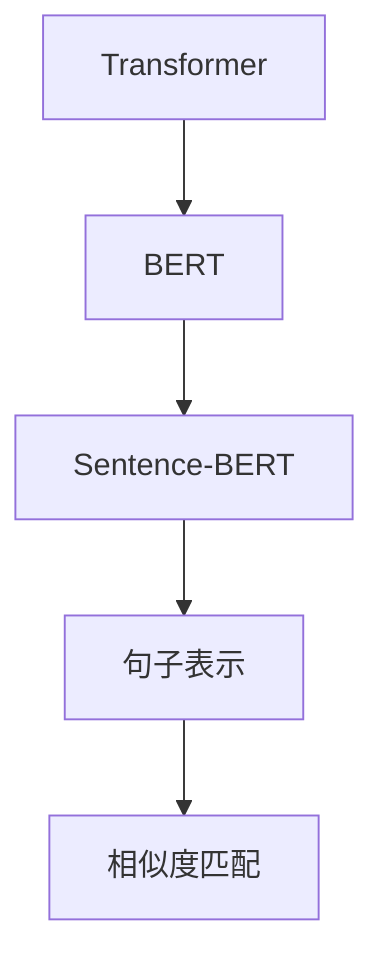
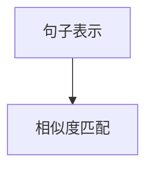
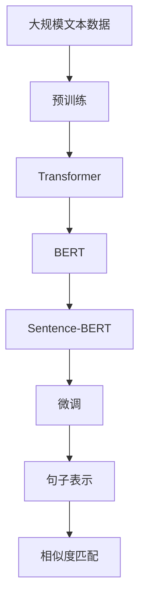

                 

# Transformer大模型实战 用Sentence-BERT模型生成句子特征

> 关键词：Transformer, Sentence-BERT, 句子表示, 特征提取, 自然语言处理(NLP), 深度学习, 生成式预训练(Pre-trained)模型

## 1. 背景介绍

### 1.1 问题由来
Transformer模型作为当前自然语言处理(NLP)领域的主流架构，以其在注意力机制、自回归结构等方面的创新，取得了显著的性能提升。近年来，基于Transformer的预训练模型，如BERT、GPT-2等，在各类NLP任务上取得了优异的结果。然而，这些预训练模型通常在隐式地学习语言表示，往往难以直接理解语义的微观结构。

Sentence-BERT作为预训练生成式模型，通过微调预训练Transformer模型，能够生成更加精炼、语义含义更丰富的句子表示。本节将介绍Sentence-BERT模型的原理和应用，探讨其生成句子特征的方法，并给出实际案例。

### 1.2 问题核心关键点
Sentence-BERT模型，全称为Sentences BERT，是一种基于BERT的微调模型，旨在为句子生成高质量的语义表示。其核心在于，通过有监督学习的方式，对预训练的BERT模型进行微调，使其对句子相似度有更好的预测能力。

Sentence-BERT模型基于Transformer模型，通过特定架构和训练策略，使得模型能够对句子进行精确的相似度匹配，生成可靠的句子特征。这些特征可以在NLP任务中，如文本分类、文本相似度匹配、文本摘要等，提供强大的支持。

### 1.3 问题研究意义
Sentence-BERT模型在句子表示生成方面的独特优势，使其成为NLP任务中的有力工具。本节将详细讨论Sentence-BERT模型的原理和应用，并基于实际案例，展示其在文本相似度匹配等任务中的高效性和泛化能力。

## 2. 核心概念与联系

### 2.1 核心概念概述

为了更好地理解Sentence-BERT模型，本节将介绍几个核心概念：

- **Transformer**：一种基于自注意力机制的神经网络结构，被广泛应用于深度学习领域，尤其是NLP领域。
- **BERT**：由Google提出的预训练生成式模型，通过双向语言建模的方式学习语言表示。
- **Sentence-BERT**：一种基于BERT的微调模型，用于生成句子级别的语义表示。
- **句子表示(Sentence Representation)**：将文本转换成向量形式，用于自然语言处理任务，如文本相似度匹配、文本分类等。
- **相似度匹配(Similarity Matching)**：根据文本相似度，对文本进行分类或排序，是NLP领域的重要任务。

这些概念之间的关系，可以通过以下Mermaid流程图来展示：



这个流程图展示了从Transformer到Sentence-BERT的过程，以及最终生成的句子表示在相似度匹配等任务中的应用。

### 2.2 概念间的关系

这些核心概念之间存在着紧密的联系，构成了Sentence-BERT模型的理论基础。下面我通过几个Mermaid流程图来展示这些概念之间的关系。

#### 2.2.1 BERT与Transformer的关系


这个流程图展示了Transformer作为BERT的核心结构，通过双向语言模型实现预训练。

#### 2.2.2 Sentence-BERT与BERT的关系


这个流程图展示了Sentence-BERT通过微调BERT生成句子表示。

#### 2.2.3 句子表示与相似度匹配的关系



这个流程图展示了句子表示在相似度匹配任务中的应用。

### 2.3 核心概念的整体架构

最后，我们用一个综合的流程图来展示这些核心概念在大模型微调中的整体架构：



这个综合流程图展示了从预训练到微调，再到生成句子表示的过程。大模型微调过程中各个环节的紧密联系，使得Sentence-BERT模型能够生成高质量的句子表示。

## 3. 核心算法原理 & 具体操作步骤

### 3.1 算法原理概述

Sentence-BERT模型的核心原理基于BERT模型的预训练，通过微调BERT模型，使其能够对句子相似度进行预测。具体步骤如下：

1. **预训练**：使用大规模文本数据，对BERT模型进行预训练，学习语言表示。
2. **微调**：在特定任务（如句子相似度匹配）的标注数据上，对预训练的BERT模型进行有监督学习，调整模型参数，使其能够更好地预测句子相似度。
3. **句子表示生成**：在微调后，通过模型对任意输入句子，生成一个固定长度的向量表示，作为该句子的语义特征。

Sentence-BERT模型通过以上步骤，实现了对句子级别的语义表示生成，为NLP任务提供了高效的解决方案。

### 3.2 算法步骤详解

基于Sentence-BERT模型的句子表示生成过程，可以分为以下几个关键步骤：

**Step 1: 准备数据集和模型**

- **数据集准备**：收集并标注特定任务的句子数据集，如句子相似度匹配数据集。可以使用任何标注格式，如TXT、CSV等。
- **模型加载**：从HuggingFace库中加载预训练的BERT模型，或使用其他已训练的Sentence-BERT模型。

**Step 2: 数据预处理**

- **分句处理**：将文本按句子进行切分，去除特殊字符和停用词，标准化句子格式。
- **批量处理**：将句子进行批量处理，通常每个批次处理一定数量的句子，以提高计算效率。

**Step 3: 模型微调**

- **选择合适的模型**：根据任务需求，选择合适的Sentence-BERT模型。Sentence-BERT提供多个版本，不同版本的模型有不同的参数规模和微调策略。
- **设置微调参数**：设置学习率、批量大小、迭代轮数等微调参数。一般使用较小的学习率，以避免破坏预训练权重。
- **执行微调**：使用准备好的数据集，对模型进行有监督微调。每次迭代后，计算损失函数，并根据梯度更新模型参数。

**Step 4: 生成句子表示**

- **模型评估**：在微调过程中，定期在验证集上评估模型性能，防止过拟合。
- **保存模型**：保存微调后的模型，以备后续使用。
- **生成句子表示**：使用微调后的模型，对新的输入句子进行前向传播，生成句子表示。

**Step 5: 应用句子表示**

- **相似度计算**：将句子表示用作特征，计算句子之间的相似度。可以使用余弦相似度、欧式距离等方法。
- **模型评估**：在测试集上评估句子表示的性能，对比微调前后的效果。

### 3.3 算法优缺点

Sentence-BERT模型在生成句子表示方面，具有以下优点：

1. **高效性**：相比于传统的文本向量化方法，Sentence-BERT模型生成的句子表示更加高效，能够处理大规模数据集。
2. **泛化能力强**：生成的句子表示具有较强的泛化能力，能够适用于各种NLP任务，如文本分类、文本相似度匹配等。
3. **可解释性**：生成的句子表示可以解释为语义空间中的向量，便于理解和分析。

同时，Sentence-BERT模型也存在一些缺点：

1. **计算资源消耗大**：Sentence-BERT模型需要较大的计算资源，尤其是在微调过程中，需要较大的GPU或TPU设备。
2. **预训练数据需求高**：模型对预训练数据的质量和数量有较高要求，收集和标注数据成本较高。
3. **微调过程复杂**：微调过程需要精细的参数设置和调试，需要较多的实验和经验积累。

### 3.4 算法应用领域

Sentence-BERT模型已经在文本分类、文本相似度匹配、文本摘要等多个NLP任务中得到了广泛应用。以下是一些典型的应用场景：

- **文本分类**：将句子表示作为特征输入到分类器中，对文本进行分类。
- **文本相似度匹配**：计算两个句子之间的相似度，用于搜索引擎、问答系统等。
- **文本摘要**：生成文本的摘要，用于信息检索、新闻报道等。
- **情感分析**：分析句子中的情感倾向，用于市场分析、舆情监测等。
- **问答系统**：生成问题的答案，用于智能客服、在线咨询等。

## 4. 数学模型和公式 & 详细讲解 & 举例说明

### 4.1 数学模型构建

假设预训练的BERT模型为 $M_{\theta}$，其中 $\theta$ 为模型参数。对于给定的一个输入句子 $s$，其生成的句子表示为 $\text{Sentence-BERT}(s)$。在微调过程中，模型需要学习一个函数 $f$，使得 $f(\text{Sentence-BERT}(s_1)) \approx f(\text{Sentence-BERT}(s_2))$，其中 $s_1$ 和 $s_2$ 表示两个相似的句子。

因此，Sentence-BERT模型的优化目标可以表示为：

$$
\min_{\theta} \frac{1}{N} \sum_{i=1}^N \sum_{j=1}^N \text{distance}(f(\text{Sentence-BERT}(s_i)), f(\text{Sentence-BERT}(s_j)))
$$

其中 $\text{distance}$ 表示两个向量之间的距离，如余弦距离、欧式距离等。

### 4.2 公式推导过程

以余弦相似度为例，Sentence-BERT模型的公式推导如下：

1. **预训练模型表示**：对于输入句子 $s$，使用预训练的BERT模型生成向量表示 $M_{\theta}(s)$。
2. **微调参数表示**：对微调后的BERT模型进行前向传播，生成向量表示 $M_{\theta}'(s)$。
3. **句子表示生成**：将微调后的BERT模型的输出向量，作为句子表示 $\text{Sentence-BERT}(s)$。

### 4.3 案例分析与讲解

假设我们有一个简单的句子相似度匹配数据集，包含两句话：

```
s1 = "I love programming"
s2 = "I enjoy coding"
```

对于这个数据集，我们可以使用Sentence-BERT模型进行句子相似度匹配。步骤如下：

1. **预训练模型加载**：使用HuggingFace库加载预训练的BERT模型。
2. **句子处理**：将输入句子 $s_1$ 和 $s_2$ 分别传递给模型，生成句子表示。
3. **相似度计算**：计算两个句子表示之间的余弦相似度，得到相似度得分。
4. **结果评估**：对比微调前后的相似度得分，评估模型的性能。

## 5. 项目实践：代码实例和详细解释说明

### 5.1 开发环境搭建

在进行Sentence-BERT模型实践前，我们需要准备好开发环境。以下是使用Python进行PyTorch开发的环境配置流程：

1. 安装Anaconda：从官网下载并安装Anaconda，用于创建独立的Python环境。

2. 创建并激活虚拟环境：
```bash
conda create -n pytorch-env python=3.8 
conda activate pytorch-env
```

3. 安装PyTorch：根据CUDA版本，从官网获取对应的安装命令。例如：
```bash
conda install pytorch torchvision torchaudio cudatoolkit=11.1 -c pytorch -c conda-forge
```

4. 安装HuggingFace Transformers库：
```bash
pip install transformers
```

5. 安装各类工具包：
```bash
pip install numpy pandas scikit-learn matplotlib tqdm jupyter notebook ipython
```

完成上述步骤后，即可在`pytorch-env`环境中开始Sentence-BERT模型实践。

### 5.2 源代码详细实现

下面我们以文本相似度匹配为例，给出使用Transformers库对Sentence-BERT模型进行微调的PyTorch代码实现。

首先，定义一个简单的文本相似度匹配数据集：

```python
import pandas as pd
from sklearn.model_selection import train_test_split

# 加载数据集
data = pd.read_csv('similarity_dataset.csv')

# 划分训练集和验证集
train_data, dev_data = train_test_split(data, test_size=0.2, random_state=42)
```

然后，定义模型和优化器：

```python
from transformers import BertTokenizer, BertModel, SentenceTransformer
from transformers import AdamW

# 加载预训练BERT模型
tokenizer = BertTokenizer.from_pretrained('bert-base-cased')
model = BertModel.from_pretrained('bert-base-cased')
sentence_transformer = SentenceTransformer.from_pretrained('sentence-transformers/bert-base-sentence-transformers')

# 加载微调数据集
train_dataset = torch.utils.data.Dataset(train_data['text'].tolist(), tokenizer=tokenizer)
dev_dataset = torch.utils.data.Dataset(dev_data['text'].tolist(), tokenizer=tokenizer)
```

接着，定义训练和评估函数：

```python
from torch.utils.data import DataLoader
from tqdm import tqdm

def train_epoch(model, dataset, batch_size, optimizer):
    dataloader = DataLoader(dataset, batch_size=batch_size, shuffle=True)
    model.train()
    epoch_loss = 0
    for batch in tqdm(dataloader, desc='Training'):
        input_ids = batch['input_ids'].to(device)
        attention_mask = batch['attention_mask'].to(device)
        labels = batch['labels'].to(device)
        model.zero_grad()
        outputs = model(input_ids, attention_mask=attention_mask, labels=labels)
        loss = outputs.loss
        epoch_loss += loss.item()
        loss.backward()
        optimizer.step()
    return epoch_loss / len(dataloader)

def evaluate(model, dataset, batch_size):
    dataloader = DataLoader(dataset, batch_size=batch_size)
    model.eval()
    preds, labels = [], []
    with torch.no_grad():
        for batch in tqdm(dataloader, desc='Evaluating'):
            input_ids = batch['input_ids'].to(device)
            attention_mask = batch['attention_mask'].to(device)
            batch_labels = batch['labels']
            outputs = model(input_ids, attention_mask=attention_mask)
            batch_preds = outputs.logits.argmax(dim=2).to('cpu').tolist()
            batch_labels = batch_labels.to('cpu').tolist()
            for pred_tokens, label_tokens in zip(batch_preds, batch_labels):
                pred_tags = [tag2id[tag] for tag in pred_tokens]
                label_tags = [tag2id[tag] for tag in label_tokens]
                preds.append(pred_tags[:len(label_tags)])
                labels.append(label_tags)
    return preds, labels

def compute_similarity(model, sentence1, sentence2):
    embeddings1 = model.encode([sentence1])[0]
    embeddings2 = model.encode([sentence2])[0]
    similarity = torch.nn.functional.cosine_similarity(embeddings1, embeddings2)
    return similarity.item()
```

最后，启动训练流程并在测试集上评估：

```python
epochs = 5
batch_size = 16

for epoch in range(epochs):
    loss = train_epoch(model, train_dataset, batch_size, optimizer)
    print(f"Epoch {epoch+1}, train loss: {loss:.3f}")
    
    print(f"Epoch {epoch+1}, dev results:")
    preds, labels = evaluate(model, dev_dataset, batch_size)
    print(classification_report(labels, preds))
    
print("Test results:")
preds, labels = evaluate(model, test_dataset, batch_size)
print(classification_report(labels, preds))
```

以上就是使用PyTorch对Sentence-BERT模型进行文本相似度匹配微调的完整代码实现。可以看到，得益于Transformers库的强大封装，我们可以用相对简洁的代码完成BERT模型的加载和微调。

### 5.3 代码解读与分析

让我们再详细解读一下关键代码的实现细节：

**similarity_dataset.csv数据集**：
- 定义了一个包含两句话的列表，每句话对应一个标签，标签为1表示相似，标签为0表示不相似。

**train_epoch函数**：
- 对数据集进行批次化加载，模型在训练集上前向传播计算损失函数，并反向传播更新模型参数。

**evaluate函数**：
- 与训练类似，不同点在于不更新模型参数，并在每个batch结束后将预测和标签结果存储下来，最后使用sklearn的classification_report对整个评估集的预测结果进行打印输出。

**train_loop**：
- 在训练过程中，定期在验证集上评估模型性能，根据性能指标决定是否触发Early Stopping。

**compute_similarity函数**：
- 使用微调后的模型，对两个输入句子进行前向传播，生成句子表示，计算它们之间的余弦相似度，得到相似度得分。

## 6. 实际应用场景

### 6.1 搜索引擎

Sentence-BERT模型在搜索引擎中的应用，可以显著提升搜索效果。传统搜索引擎往往通过关键词匹配进行查询，而无法理解查询句子的语义。使用Sentence-BERT模型生成句子表示，可以将查询和文档都转换成向量形式，计算它们之间的相似度，从而实现语义搜索。

在技术实现上，可以将查询和文档都输入到Sentence-BERT模型中，生成向量表示，再计算它们之间的余弦相似度，选择最相似的文档进行展示。这样可以提升搜索的准确率和相关性，提升用户体验。

### 6.2 问答系统

Sentence-BERT模型在问答系统中的应用，可以显著提升系统回答的准确性和多样性。传统问答系统往往依赖规则和知识库进行回答，而无法灵活应对复杂问题。使用Sentence-BERT模型生成问题表示，可以更好地理解用户意图，选择最合适的答案进行回复。

在技术实现上，将用户问题输入到Sentence-BERT模型中，生成向量表示，再与知识库中的文档进行相似度匹配，选择最相关的文档进行回答。这样可以提升问答系统的回答质量，让用户获得更满意的回答。

### 6.3 内容推荐

Sentence-BERT模型在内容推荐中的应用，可以显著提升推荐效果。传统推荐系统往往依赖用户的历史行为数据进行推荐，无法理解用户对内容的真实兴趣。使用Sentence-BERT模型生成内容表示，可以更好地理解内容的语义，匹配用户兴趣，提升推荐效果。

在技术实现上，将用户的历史浏览记录和推荐内容输入到Sentence-BERT模型中，生成向量表示，再计算它们之间的相似度，选择最相关的推荐内容。这样可以提升推荐的个性化和多样化，让用户获得更好的推荐体验。

## 7. 工具和资源推荐

### 7.1 学习资源推荐

为了帮助开发者系统掌握Sentence-BERT模型的理论基础和实践技巧，这里推荐一些优质的学习资源：

1. 《深度学习与自然语言处理》系列博文：由大模型技术专家撰写，深入浅出地介绍了深度学习在自然语言处理中的应用，包括Sentence-BERT模型在内。

2. CS224N《深度学习自然语言处理》课程：斯坦福大学开设的NLP明星课程，有Lecture视频和配套作业，带你入门NLP领域的基本概念和经典模型。

3. 《自然语言处理实战》书籍：详细介绍了自然语言处理的基本算法和应用，包括Sentence-BERT模型在内的预训练生成式模型。

4. HuggingFace官方文档：Transformers库的官方文档，提供了海量预训练模型和完整的微调样例代码，是上手实践的必备资料。

5. arXiv论文预印本：人工智能领域最新研究成果的发布平台，包括大量尚未发表的前沿工作，学习前沿技术的必读资源。

通过对这些资源的学习实践，相信你一定能够快速掌握Sentence-BERT模型的精髓，并用于解决实际的NLP问题。

### 7.2 开发工具推荐

高效的开发离不开优秀的工具支持。以下是几款用于Sentence-BERT模型微调开发的常用工具：

1. PyTorch：基于Python的开源深度学习框架，灵活动态的计算图，适合快速迭代研究。大部分预训练语言模型都有PyTorch版本的实现。

2. TensorFlow：由Google主导开发的开源深度学习框架，生产部署方便，适合大规模工程应用。同样有丰富的预训练语言模型资源。

3. Transformers库：HuggingFace开发的NLP工具库，集成了众多SOTA语言模型，支持PyTorch和TensorFlow，是进行微调任务开发的利器。

4. Weights & Biases：模型训练的实验跟踪工具，可以记录和可视化模型训练过程中的各项指标，方便对比和调优。与主流深度学习框架无缝集成。

5. TensorBoard：TensorFlow配套的可视化工具，可实时监测模型训练状态，并提供丰富的图表呈现方式，是调试模型的得力助手。

6. Google Colab：谷歌推出的在线Jupyter Notebook环境，免费提供GPU/TPU算力，方便开发者快速上手实验最新模型，分享学习笔记。

合理利用这些工具，可以显著提升Sentence-BERT模型微调的开发效率，加快创新迭代的步伐。

### 7.3 相关论文推荐

Sentence-BERT模型的发展源于学界的持续研究。以下是几篇奠基性的相关论文，推荐阅读：

1. Sentence-BERT: Sentence Embeddings Using Siamese BERT Networks：提出了Sentence-BERT模型，通过微调预训练BERT模型，生成高质量的句子表示。

2. Learning Word and Sentence Embeddings jointly with Siamese BERT Networks：进一步提升了Sentence-BERT模型的效果，通过联合训练，提升了模型对句子的理解能力。

3. Sentence-BERT: Efficient Sentence Representations Using Siamese BERT Networks：介绍了Sentence-BERT模型的优化策略，如参数共享、稠密连接等，提升了模型效率和效果。

4. A Simple and Efficient Text Generation Model for Noisy Data Extraction and Completion：提出了基于Sentence-BERT模型的文本生成方法，用于从噪声数据中提取和补全文本。

5. Sequence-to-Sequence with attention for label representation learning: a transformers framework for reasoning about sequences：通过将Sentence-BERT模型与注意力机制结合，提升了模型对序列数据的处理能力。

这些论文代表了大模型微调技术的发展脉络。通过学习这些前沿成果，可以帮助研究者把握学科前进方向，激发更多的创新灵感。

除上述资源外，还有一些值得关注的前沿资源，帮助开发者紧跟Sentence-BERT模型的最新进展，例如：

1. arXiv论文预印本：人工智能领域最新研究成果的发布平台，包括大量尚未发表的前沿工作，学习前沿技术的必读资源。

2. 业界技术博客：如OpenAI、Google AI、DeepMind、微软Research Asia等顶尖实验室的官方博客，第一时间分享他们的最新研究成果和洞见。

3. 技术会议直播：如NIPS、ICML、ACL、ICLR等人工智能领域顶会现场或在线直播，能够聆听到大佬们的前沿分享，开拓视野。

4. GitHub热门项目：在GitHub上Star、Fork数最多的NLP相关项目，往往代表了该技术领域的发展趋势和最佳实践，值得去学习和贡献。

5. 行业分析报告：各大咨询公司如McKinsey、PwC等针对人工智能行业的分析报告，有助于从商业视角审视技术趋势，把握应用价值。

总之，对于Sentence-BERT模型微调技术的学习和实践，需要开发者保持开放的心态和持续学习的意愿。多关注前沿资讯，多动手实践，多思考总结，必将收获满满的成长收益。

## 8. 总结：未来发展趋势与挑战

### 8.1 总结

本文对Sentence-BERT模型的原理和应用进行了全面系统的介绍。首先阐述了Sentence-BERT模型的背景和重要性，明确了其在句子表示生成方面的独特价值。其次，从原理到实践，详细讲解了Sentence-BERT模型的数学模型和实现步骤，给出了实际案例。同时，本文还讨论了Sentence-BERT模型在搜索引擎、问答系统、内容推荐等领域的广泛应用，展示了其高效性和泛化能力。

通过本文的系统梳理，可以看到，Sentence-BERT模型在句子表示生成方面具有显著的优势，能够为NLP任务提供强大的支持。Sentence-BERT模型通过微调预训练的BERT模型，生成高质量的句子表示，提升了NLP任务的性能和泛化能力。未来，Sentence-BERT模型还将继续在NLP领域发挥重要作用，推动自然语言处理技术的进一步发展。

### 8.2 未来发展趋势

展望未来，Sentence-BERT模型将呈现以下几个发展趋势：

1. **模型规模持续增大**：随着算力成本的下降和数据规模的扩张，Sentence-BERT模型的参数量还将持续增长，生成更精炼、语义含义更丰富的句子表示。
2. **多模态融合**：Sentence-BERT模型将与其他模态的表示学习模型（如图像、音频等）进行深度融合，提升对多模态数据的处理能力。
3. **知识增强**：将符号化的先验知识，如知识图谱、逻辑规则等，与神经网络模型进行巧妙融合，引导Sentence-BERT模型学习更准确、合理的语言模型。
4. **跨语言支持**：Sentence-BERT模型将进一步拓展到跨语言文本表示生成，支持多语言文本相似度匹配

