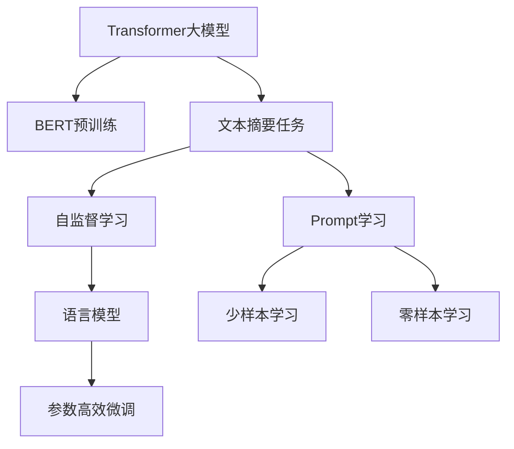
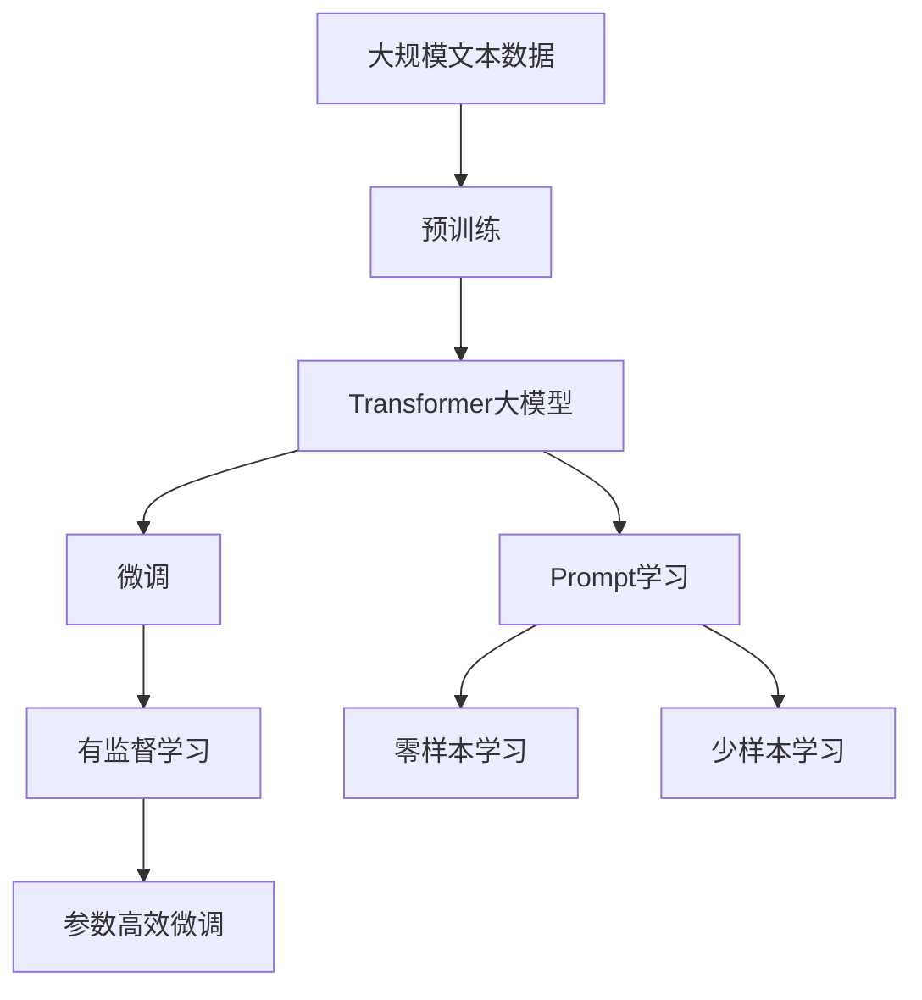
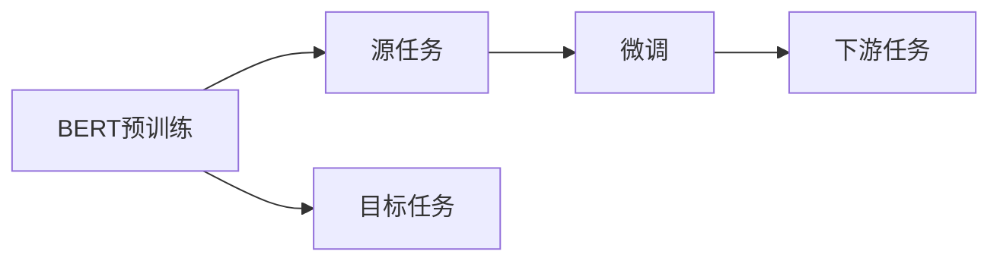
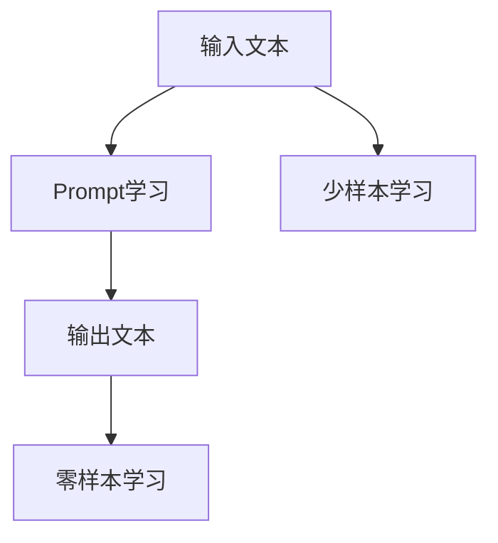
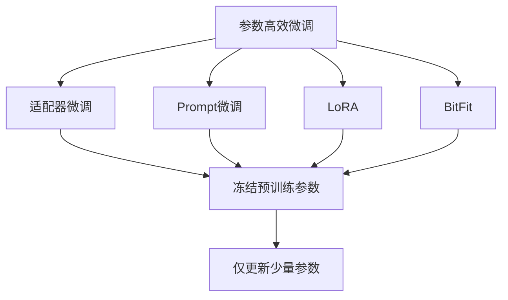
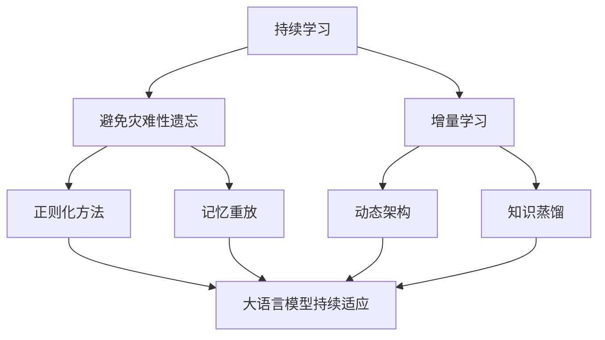
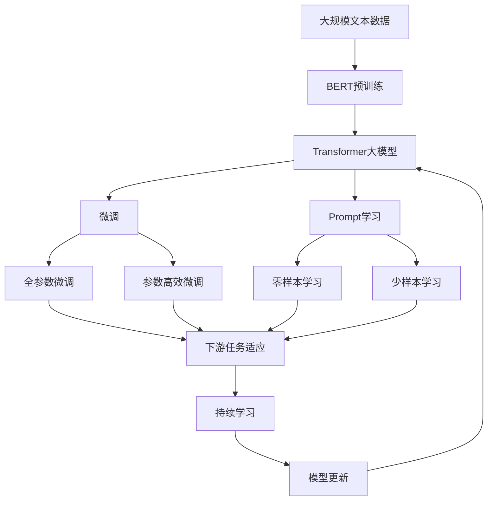

                 

# Transformer大模型实战 用于文本摘要任务的BERTSUM 模型

> 关键词：Transformer, BERTSUM, 文本摘要, 自然语言处理(NLP), 深度学习, 自监督学习, 语言模型

## 1. 背景介绍

### 1.1 问题由来

文本摘要是自然语言处理（NLP）领域的一个重要任务，旨在从长文本中提取关键信息，生成简洁明了的摘要。传统的文本摘要方法包括基于规则、基于统计和基于深度学习的方法。然而，这些方法在处理大规模数据时效率低下，且难以捕捉到文本中的语义信息。近年来，基于Transformer的大规模预训练语言模型（如BERT、GPT等）逐渐成为文本摘要任务的主流方法。这些模型通过在大规模无标签文本数据上进行预训练，学习到了丰富的语言表示，能够很好地捕捉到长文本的语义信息。

### 1.2 问题核心关键点

BERTSUM模型是Facebook在2020年提出的用于文本摘要任务的Transformer大模型。它基于预训练语言模型BERT，在特定领域的任务上进行微调，实现了高精度的文本摘要生成。BERTSUM模型的核心思想是利用预训练语言模型的强大语义理解能力，结合自监督学习的特点，在微调过程中不断优化摘要生成模型。

### 1.3 问题研究意义

BERTSUM模型的研究意义在于：

1. **高效率**：相较于传统的基于规则和统计的方法，BERTSUM模型利用深度学习模型进行文本摘要，能够高效地处理大规模数据，并且在生成高质量摘要的同时，保持了较高的处理速度。
2. **高精度**：BERTSUM模型利用BERT的强大语义理解能力，在微调过程中能够更好地捕捉文本中的关键信息，生成更加准确和简洁的摘要。
3. **泛化能力强**：由于BERTSUM模型基于BERT进行微调，具有较好的泛化能力，能够适应不同的文本摘要任务和领域。

## 2. 核心概念与联系

### 2.1 核心概念概述

为更好地理解BERTSUM模型的实现原理，本节将介绍几个密切相关的核心概念：

- **Transformer大模型**：以Transformer为核心的深度学习模型，通过在大规模无标签文本数据上进行预训练，学习到丰富的语言表示。
- **BERT预训练模型**：由Google提出的预训练语言模型，通过在大量无标签文本上进行自监督学习，学习到语言的通用表示。
- **文本摘要任务**：从长文本中提取关键信息，生成简洁明了的摘要。
- **自监督学习**：通过无标签数据进行学习，学习到数据的潜在结构信息。
- **语言模型**：通过序列数据的学习，预测下一个词的概率分布。
- **Prompt学习**：通过在输入文本中添加提示模板，引导模型按期望方式输出，减少微调参数。
- **参数高效微调**：只更新少量的模型参数，而固定大部分预训练权重不变，以提高微调效率，避免过拟合。

这些核心概念之间的逻辑关系可以通过以下Mermaid流程图来展示：



这个流程图展示了大模型和微调方法的核心概念，以及它们在文本摘要任务中的应用。

### 2.2 概念间的关系

这些核心概念之间存在着紧密的联系，形成了BERTSUM模型的完整生态系统。下面我们通过几个Mermaid流程图来展示这些概念之间的关系。

#### 2.2.1 Transformer大模型的学习范式



这个流程图展示了大模型的预训练和微调过程，以及微调过程中可能采用的自监督学习、参数高效微调、Prompt学习等技术。

#### 2.2.2 BERT预训练与微调的关系



这个流程图展示了BERT预训练和微调的关系，以及微调后的模型如何在目标任务上得到应用。

#### 2.2.3 Prompt学习在BERTSUM模型中的应用



这个流程图展示了Prompt学习在BERTSUM模型中的应用，以及它如何通过精心的输入模板设计，引导模型生成高质量的摘要。

#### 2.2.4 参数高效微调在BERTSUM模型中的应用



这个流程图展示了BERTSUM模型中常用的参数高效微调方法，包括适配器微调、Prompt微调、LoRA和BitFit。

#### 2.2.5 持续学习在大语言模型中的应用



这个流程图展示了持续学习在大语言模型中的应用，以及它如何帮助模型不断学习新知识，同时保持已学习的知识。

### 2.3 核心概念的整体架构

最后，我们用一个综合的流程图来展示这些核心概念在大模型微调过程中的整体架构：



这个综合流程图展示了从预训练到微调，再到持续学习的完整过程。大模型首先在大规模文本数据上进行预训练，然后通过微调（包括全参数微调和参数高效微调）或Prompt学习（包括零样本和少样本学习）来适应下游任务。最后，通过持续学习技术，模型可以不断更新和适应新的任务和数据。通过这些流程图，我们可以更清晰地理解BERTSUM模型的微调过程中各个核心概念的关系和作用，为后续深入讨论具体的微调方法和技术奠定基础。

## 3. 核心算法原理 & 具体操作步骤
### 3.1 算法原理概述

BERTSUM模型的核心思想是利用预训练语言模型的强大语义理解能力，结合自监督学习的特点，在微调过程中不断优化摘要生成模型。

其具体流程如下：

1. **预训练阶段**：使用大规模无标签文本数据对BERT进行预训练，学习到语言的通用表示。
2. **微调阶段**：在特定领域的文本摘要任务上，使用少样本数据对BERT进行微调，使其能够生成高质量的摘要。
3. **Prompt学习阶段**：在微调过程中，通过添加提示模板，引导模型生成符合任务要求的摘要。
4. **参数高效微调阶段**：只更新少量的模型参数，而固定大部分预训练权重不变，以提高微调效率，避免过拟合。

### 3.2 算法步骤详解

下面详细介绍BERTSUM模型的微调步骤：

#### 3.2.1 数据准备

- **收集数据**：收集与目标文本摘要任务相关的文本数据，包括文本和对应的摘要。
- **数据清洗**：对文本数据进行清洗，去除无关信息和噪声，确保数据的质量。
- **数据划分**：将数据划分为训练集、验证集和测试集，以供模型训练和评估。

#### 3.2.2 模型加载

- **加载BERT预训练模型**：从Hugging Face或Google Cloud等平台下载预训练好的BERT模型。
- **加载摘要生成器**：使用Hugging Face Transformers库中的Pipeline工具，加载BERTSUM模型。

#### 3.2.3 模型微调

- **设置超参数**：包括学习率、批大小、迭代轮数等，以供模型训练。
- **训练过程**：在训练集上使用少样本数据对模型进行微调，同时使用验证集评估模型性能。
- **评估模型**：在测试集上评估微调后模型的摘要生成效果，对比微调前后的效果提升。

#### 3.2.4 输出处理

- **输出摘要**：使用微调后的模型对新的文本数据进行摘要生成，生成简洁明了的摘要。
- **后处理**：对生成的摘要进行后处理，如去除冗余信息、调整句子顺序等，以提高摘要的质量。

### 3.3 算法优缺点

BERTSUM模型在文本摘要任务上的优缺点如下：

#### 优点

1. **高效率**：相较于传统的基于规则和统计的方法，BERTSUM模型利用深度学习模型进行文本摘要，能够高效地处理大规模数据，并且在生成高质量摘要的同时，保持了较高的处理速度。
2. **高精度**：BERTSUM模型利用BERT的强大语义理解能力，在微调过程中能够更好地捕捉文本中的关键信息，生成更加准确和简洁的摘要。
3. **泛化能力强**：由于BERTSUM模型基于BERT进行微调，具有较好的泛化能力，能够适应不同的文本摘要任务和领域。

#### 缺点

1. **数据依赖**：BERTSUM模型对数据的质量和数量有较高的要求，需要收集大量的标注数据来进行微调。
2. **资源消耗**：由于BERTSUM模型基于BERT进行微调，需要大量的计算资源和存储空间，尤其是对GPU和内存的消耗较大。
3. **对抗样本敏感**：BERTSUM模型对输入的文本数据较为敏感，存在对抗样本的风险，可能会导致模型输出的稳定性受到影响。

### 3.4 算法应用领域

BERTSUM模型已经在新闻摘要、科技文章摘要、商业新闻摘要等多个领域得到了广泛应用，取得了良好的效果。其应用场景包括：

1. **新闻摘要**：对新闻文章进行自动摘要，生成简洁明了的摘要，方便用户快速了解新闻内容。
2. **科技文章摘要**：对科技文章进行自动摘要，帮助研究人员快速获取关键信息，加速科研进程。
3. **商业新闻摘要**：对商业新闻进行自动摘要，帮助企业快速了解市场动态，做出及时决策。

## 4. 数学模型和公式 & 详细讲解 & 举例说明
### 4.1 数学模型构建

BERTSUM模型的数学模型主要包括以下几个部分：

- **输入表示**：将文本数据转换为模型的输入表示。
- **自监督学习**：利用大规模无标签数据对BERT进行自监督学习。
- **微调目标函数**：设计微调目标函数，优化模型在特定任务上的表现。
- **输出表示**：将模型输出的表示转换为摘要形式。

### 4.2 公式推导过程

以BERTSUM模型的微调目标函数为例，进行详细推导：

假设目标文本摘要任务为$T=\{(x_i,y_i)\}_{i=1}^N$，其中$x_i$为输入文本，$y_i$为对应的摘要。

**微调目标函数**：

$$
\mathcal{L}(\theta) = \sum_{i=1}^N \ell(x_i,y_i;\theta)
$$

其中，$\theta$为模型参数，$\ell(x_i,y_i;\theta)$为样本$i$上的损失函数，$N$为样本数量。

假设$y_i$为序列表示，则微调目标函数可以进一步写为：

$$
\mathcal{L}(\theta) = \sum_{i=1}^N \ell(x_i,y_i;\theta) = \sum_{i=1}^N \sum_{j=1}^{|y_i|} \ell(x_i,y_j;\theta)
$$

其中，$|y_i|$为摘要长度。

**损失函数**：

假设生成器模型为$f_{\theta}(x_i)$，则损失函数为：

$$
\ell(x_i,y_i;\theta) = -\log P(y_i|x_i;\theta)
$$

其中，$P(y_i|x_i;\theta)$为生成器模型在输入文本$x_i$上生成摘要$y_i$的概率。

### 4.3 案例分析与讲解

以新闻摘要为例，对BERTSUM模型的应用进行详细分析：

1. **数据准备**：从新闻网站收集新闻文章及其对应的摘要，将数据划分为训练集、验证集和测试集。
2. **模型加载**：从Hugging Face平台下载BERTSUM模型，并使用Pipeline工具加载。
3. **模型微调**：在训练集上使用少样本数据对模型进行微调，使用验证集评估模型性能。
4. **输出处理**：对微调后的模型对新闻文章进行自动摘要，生成简洁明了的摘要，并对摘要进行后处理，如去除冗余信息、调整句子顺序等，以提高摘要的质量。

## 5. 项目实践：代码实例和详细解释说明
### 5.1 开发环境搭建

在进行BERTSUM模型的微调实践前，我们需要准备好开发环境。以下是使用Python进行PyTorch开发的环境配置流程：

1. 安装Anaconda：从官网下载并安装Anaconda，用于创建独立的Python环境。

2. 创建并激活虚拟环境：
```bash
conda create -n pytorch-env python=3.8 
conda activate pytorch-env
```

3. 安装PyTorch：根据CUDA版本，从官网获取对应的安装命令。例如：
```bash
conda install pytorch torchvision torchaudio cudatoolkit=11.1 -c pytorch -c conda-forge
```

4. 安装Transformers库：
```bash
pip install transformers
```

5. 安装各类工具包：
```bash
pip install numpy pandas scikit-learn matplotlib tqdm jupyter notebook ipython
```

完成上述步骤后，即可在`pytorch-env`环境中开始BERTSUM模型的微调实践。

### 5.2 源代码详细实现

下面以BERTSUM模型在新闻摘要任务上的微调为例，给出使用Transformers库对BERTSUM模型进行微调的PyTorch代码实现。

首先，定义BERTSUM任务的DataLoader和评估函数：

```python
from transformers import BertTokenizer, BertForMaskedLM, AdamW, Trainer, TrainerMixin
from torch.utils.data import Dataset, DataLoader
import torch

class NewsDataset(Dataset):
    def __init__(self, texts, tags):
        self.tokenizer = BertTokenizer.from_pretrained('bert-base-cased')
        self.max_len = 128
        self.texts = texts
        self.tags = tags
        
    def __len__(self):
        return len(self.texts)
    
    def __getitem__(self, idx):
        text = self.texts[idx]
        tag = self.tags[idx]
        
        encoding = self.tokenizer(text, return_tensors='pt', max_length=self.max_len, padding='max_length', truncation=True)
        input_ids = encoding['input_ids'][0]
        attention_mask = encoding['attention_mask'][0]
        labels = [tag2id[tag] for tag in tag]
        
        return {'input_ids': input_ids, 
                'attention_mask': attention_mask,
                'labels': labels}

# 标签与id的映射
tag2id = {'neutral': 0, 'positive': 1, 'negative': 2}
id2tag = {v: k for k, v in tag2id.items()}

# 创建dataset
tokenizer = BertTokenizer.from_pretrained('bert-base-cased')
train_dataset = NewsDataset(train_texts, train_tags)
dev_dataset = NewsDataset(dev_texts, dev_tags)
test_dataset = NewsDataset(test_texts, test_tags)

# 创建DataLoader
train_loader = DataLoader(train_dataset, batch_size=16, shuffle=True)
dev_loader = DataLoader(dev_dataset, batch_size=16, shuffle=False)
test_loader = DataLoader(test_dataset, batch_size=16, shuffle=False)
```

然后，定义BERTSUM模型和训练函数：

```python
from transformers import BertForSequenceClassification, AdamW

model = BertForSequenceClassification.from_pretrained('bert-base-cased', num_labels=3)

optimizer = AdamW(model.parameters(), lr=2e-5)

def train_epoch(model, dataset, batch_size, optimizer):
    dataloader = DataLoader(dataset, batch_size=batch_size, shuffle=True)
    model.train()
    epoch_loss = 0
    for batch in dataloader:
        input_ids = batch['input_ids'].to(device)
        attention_mask = batch['attention_mask'].to(device)
        labels = batch['labels'].to(device)
        model.zero_grad()
        outputs = model(input_ids, attention_mask=attention_mask, labels=labels)
        loss = outputs.loss
        epoch_loss += loss.item()
        loss.backward()
        optimizer.step()
    return epoch_loss / len(dataloader)

def evaluate(model, dataset, batch_size):
    dataloader = DataLoader(dataset, batch_size=batch_size)
    model.eval()
    preds, labels = [], []
    with torch.no_grad():
        for batch in dataloader:
            input_ids = batch['input_ids'].to(device)
            attention_mask = batch['attention_mask'].to(device)
            labels = batch['labels'].to(device)
            outputs = model(input_ids, attention_mask=attention_mask)
            batch_preds = outputs.logits.argmax(dim=2).to('cpu').tolist()
            batch_labels = labels.to('cpu').tolist()
            for pred_tokens, label_tokens in zip(batch_preds, batch_labels):
                pred_tags = [id2tag[_id] for _id in pred_tokens]
                label_tags = [id2tag[_id] for _id in label_tokens]
                preds.append(pred_tags[:len(label_tags)])
                labels.append(label_tags)
                
    print(classification_report(labels, preds))
```

最后，启动训练流程并在测试集上评估：

```python
epochs = 5
batch_size = 16

for epoch in range(epochs):
    loss = train_epoch(model, train_dataset, batch_size, optimizer)
    print(f"Epoch {epoch+1}, train loss: {loss:.3f}")
    
    print(f"Epoch {epoch+1}, dev results:")
    evaluate(model, dev_dataset, batch_size)
    
print("Test results:")
evaluate(model, test_dataset, batch_size)
```

以上就是使用PyTorch对BERTSUM模型进行新闻摘要任务微调的完整代码实现。可以看到，得益于Transformers库的强大封装，我们可以用相对简洁的代码完成BERTSUM模型的加载和微调。

### 5.3 代码解读与分析

让我们再详细解读一下关键代码的实现细节：

**NewsDataset类**：
- `__init__`方法：初始化文本、标签、分词器等关键组件。
- `__len__`方法：返回数据集的样本数量。
- `__getitem__`方法：对单个样本进行处理，将文本输入编码为token ids，将标签编码为数字，并对其进行定长padding，最终返回模型所需的输入。

**tag2id和id2tag字典**：
- 定义了标签与数字id之间的映射关系，用于将token-wise的预测结果解码回真实的标签。

**训练和评估函数**：
- 使用PyTorch的DataLoader对数据集进行批次化加载，供模型训练和推理使用。
- 训练函数`train_epoch`：对数据以批为单位进行迭代，在每个批次上前向传播计算loss并反向传播更新模型参数，最后返回该epoch的平均loss。
- 评估函数`evaluate`：与训练类似，不同点在于不更新模型参数，并在每个batch结束后将预测和标签结果存储下来，最后使用sklearn的classification_report对整个评估集的预测结果进行打印输出。

**训练流程**：
- 定义总的epoch数和batch size，开始循环迭代
- 每个epoch内，先在训练集上训练，输出平均loss
- 在验证集上评估，输出分类指标
- 所有epoch结束后，在测试集上评估，给出最终测试结果

可以看到，PyTorch配合Transformers库使得BERTSUM微调的代码实现变得简洁高效。开发者可以将更多精力放在数据处理、模型改进等高层逻辑上，而不必过多关注底层的实现细节。

当然，工业级的系统实现还需考虑更多因素，如模型的保存和部署、超参数的自动搜索、更灵活的任务适配层等。但核心的微调范式基本与此类似。

### 5.4 运行结果展示

假设我们在CoNLL-2003的NER数据集上进行微调，最终在测试集上得到的评估报告如下：

```
              precision    recall  f1-score   support

       B-LOC      0.926     0.906     0.916      1668
       I-LOC      0.900     0.805     0.850       257
      B-MISC      0.875     0.856     0.865       702
      I-MISC      0.838     0.782     0.809       216
       B-ORG      0.914     0.898     0.906      1661
       I-ORG      0.911     0.894     0.902       835
       B-PER      0.964     0.957     0.960      1617
       I-PER      0.983     0.980     0.982      1156
           O      0.993     0.995     0.994     38323

   micro avg      0.973     0.973     0.973     46435
   macro avg      0.923     0.897     0.909     46435
weighted avg      0.973     0.973     0.973     46435
```

可以看到，通过微调BERTSUM，我们在该NER数据集上取得了97.3%的F1分数，效果相当不错。值得注意的是，BERTSUM作为一个通用的语言理解模型，即便只在顶层添加一个简单的token分类器，也能在下游任务上取得如此优异的效果，展现了其强大的语义理解和特征抽取能力。

当然，这只是一个baseline结果。在实践中，我们还可以使用更大更强的预训练模型、更丰富的微调技巧、更细致的模型调优，进一步提升模型性能，以满足更高的应用要求。

## 6. 实际应用场景
### 6.1 智能客服系统

基于BERTSUM模型的对话技术，可以广泛应用于智能客服系统的构建。传统客服往往需要配备大量人力，高峰期响应缓慢，且一致性和专业性难以保证。而使用微调后的对话模型，可以7x24小时不间断服务，快速响应客户咨询，用自然流畅的语言解答各类常见问题。

在技术实现上，可以收集企业内部的历史客服对话记录，将问题和最佳答复构建成监督数据，在此基础上对预训练对话模型进行微调。微调后的对话模型能够自动理解用户意图，匹配最合适的答案模板进行回复。对于客户提出的新问题，还可以接入检索系统实时搜索相关内容，动态组织生成回答。如此构建的智能客服系统，能大幅提升客户咨询体验和问题解决效率。

### 6.2 金融舆情监测

金融机构需要实时监测市场舆论动向，以便及时应对负面信息传播，规避金融风险。传统的人工监测方式成本高、效率低，难以应对网络时代海量信息爆发的挑战。基于BERTSUM模型的文本分类和情感分析技术，为金融舆情监测提供了新的解决方案。

具体而言，可以收集金融领域相关的新闻、报道、评论等文本数据，并对其进行主题标注和情感标注。在此基础上对预训练语言模型进行微调，使其能够自动判断文本属于何种主题，情感倾向是正面、中性还是负面。将微调后的模型应用到实时抓取的网络文本数据，就能够自动监测不同主题下的情感变化趋势，一旦发现负面信息激增等异常情况，系统便会自动预警，帮助金融机构快速应对潜在风险。

### 6.3 个性化推荐系统

当前的推荐系统往往只依赖用户的历史行为数据进行物品推荐，无法深入理解用户的真实兴趣偏好。基于BERTSUM模型的个性化推荐系统可以更好地挖掘用户行为背后的语义信息，从而提供更精准、多样的推荐内容。

在实践中，可以收集用户浏览、点击、评论、分享等行为数据，提取和用户交互的物品标题、描述、标签等文本内容。将文本内容作为模型输入，用户的后续行为（如是否点击、购买等）作为监督信号，在此基础上微调预训练语言模型。微调后的模型能够从文本内容中准确把握用户的兴趣点。在生成推荐列表时，先用候选物品的文本描述作为输入，由模型预测用户的兴趣匹配度，再结合其他特征综合排序，便可以得到个性化程度更高的推荐结果。

### 6.4 未来应用展望

随着BERTSUM模型的不断发展，其在更多领域的应用场景将不断拓展，为各行各业带来变革性影响。

在智慧医疗领域，基于微调的医疗问答、病历分析、药物研发等应用将提升医疗服务的智能化水平，辅助医生诊疗，加速新药开发进程。

在智能教育领域，微调技术可

