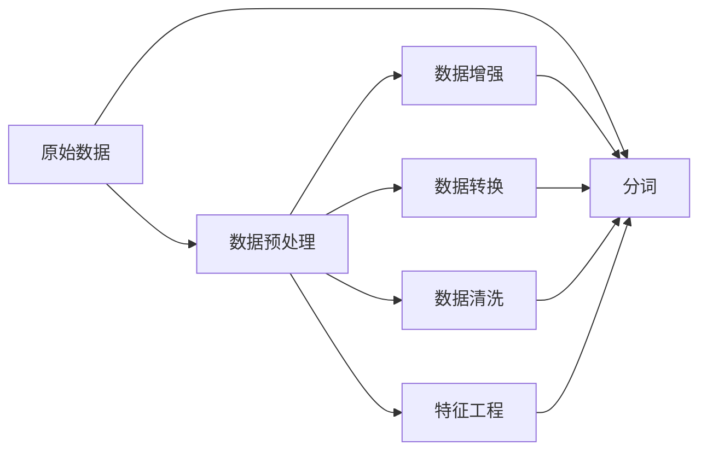
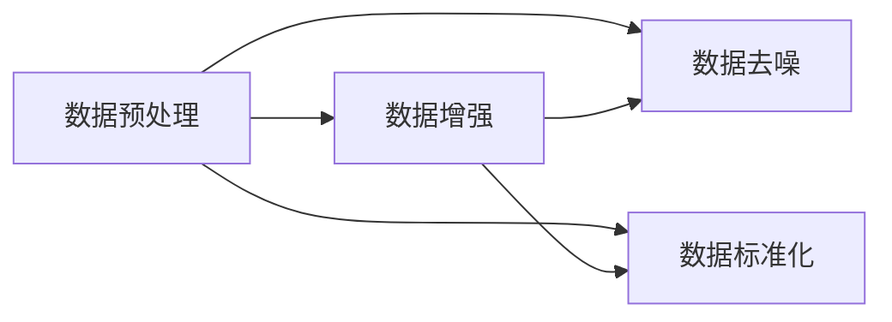
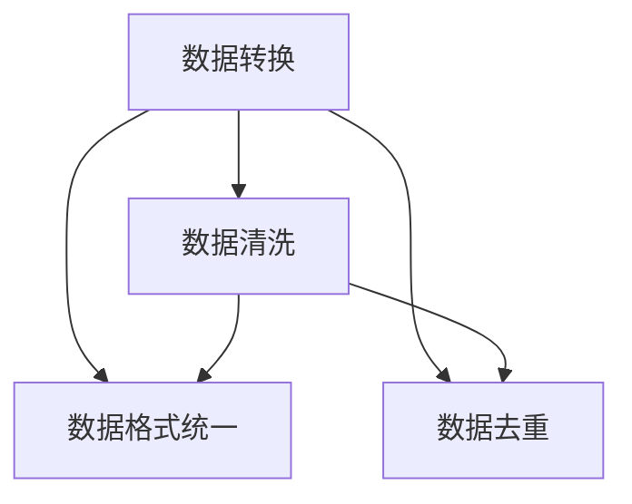
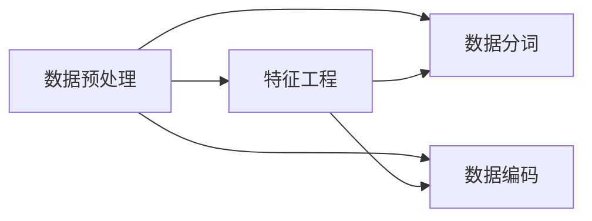
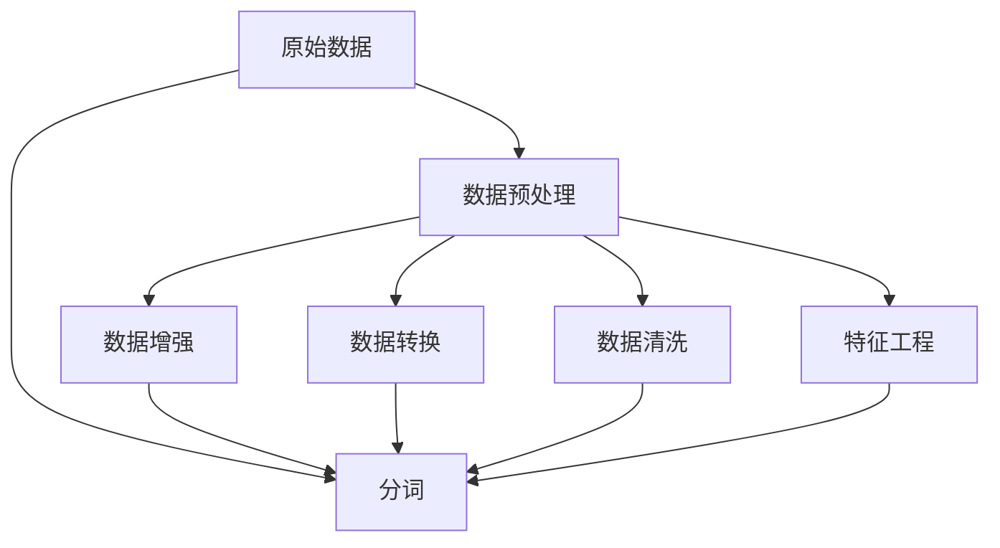

                 

# Transformer大模型实战 输入数据

> 关键词：
> - Transformer
> - 大模型
> - 输入数据
> - 数据预处理
> - 分词
> - 数据增强
> - 数据转换
> - 特征工程
> - 数据清洗

## 1. 背景介绍

### 1.1 问题由来

随着深度学习技术的快速发展，Transformer大模型在自然语言处理（NLP）领域取得了巨大的突破。Transformer模型以其自注意力机制和高效并行化的优势，迅速成为NLP领域的主流。然而，使用大模型进行微调或推理时，输入数据的质量和格式对模型性能有着显著影响。输入数据的预处理、转换和增强是模型训练和推理过程中的重要环节，其质量直接关系到模型的训练效果和推理性能。

### 1.2 问题核心关键点

数据输入是大模型微调和推理的关键环节。数据输入的质量和格式直接影响模型的训练效果和推理性能。常见的问题包括：

- 数据格式不规范：输入数据格式多样，不规范的格式可能影响模型训练。
- 数据不平衡：标注数据分布不均，可能导致模型对少数类别的识别能力较弱。
- 数据噪声：数据中存在噪声、错误或不完整信息，可能影响模型的泛化能力。
- 数据维度高：大规模文本数据的特征维度高，需要高效的特征工程和数据处理技术。

解决这些问题，需要从数据预处理、数据转换、数据增强等多个方面入手。本文将系统介绍Transformer大模型的输入数据处理技术，包括数据预处理、分词、数据增强等关键步骤，并结合具体实践，帮助开发者提升数据处理能力，从而获得更好的模型训练和推理效果。

### 1.3 问题研究意义

高质量的数据输入对于提升Transformer大模型的训练效果和推理性能至关重要。数据预处理和特征工程技术的熟练掌握，能够帮助开发者快速构建高效、稳定的NLP应用系统，降低算法开发的成本和复杂度，提升应用场景下的实际效果。因此，深入研究大模型数据输入的技术，对于推动NLP技术的产业化进程具有重要意义。

## 2. 核心概念与联系

### 2.1 核心概念概述

为更好地理解Transformer大模型的输入数据处理，本节将介绍几个密切相关的核心概念：

- Transformer：一种基于自注意力机制的深度学习模型，广泛用于自然语言处理任务。
- 大模型：具有亿级甚至十亿级参数的深度学习模型，能够学习到复杂的语言结构和规律。
- 数据预处理：对原始数据进行格式规范、去噪、标准化等处理，确保数据输入的质量。
- 分词：将输入的文本序列切分成有意义的词汇单元，便于模型理解和学习。
- 数据增强：通过扩充训练数据集，增加模型的鲁棒性和泛化能力。
- 数据转换：将不同来源、不同格式的数据统一转换为模型可接受的输入格式，提高数据处理的效率和效果。
- 特征工程：设计高效的特征表示和提取方法，优化模型的性能。
- 数据清洗：去除数据中的噪声、错误或不完整信息，确保数据的纯净度。

这些核心概念之间的逻辑关系可以通过以下Mermaid流程图来展示：



这个流程图展示了大模型数据输入过程中各个步骤的逻辑关系：

1. 原始数据通过数据预处理、数据增强、数据转换、数据清洗等步骤进行处理。
2. 处理后的数据经过特征工程，设计高效特征表示。
3. 分词将文本序列切分成有意义的词汇单元。
4. 最终输入数据输入模型进行训练或推理。

通过理解这些核心概念，我们可以更好地把握Transformer大模型的输入数据处理流程，为后续深入讨论具体的处理技术和方法奠定基础。

### 2.2 概念间的关系

这些核心概念之间存在着紧密的联系，形成了Transformer大模型输入数据处理的全生态系统。下面我通过几个Mermaid流程图来展示这些概念之间的关系。

#### 2.2.1 数据预处理与数据增强



这个流程图展示了数据预处理与数据增强之间的联系。数据预处理包括去噪和标准化，而数据增强通常是在预处理后进行的，通过扩充训练数据集，提高模型的鲁棒性和泛化能力。

#### 2.2.2 数据转换与数据清洗



这个流程图展示了数据转换与数据清洗之间的联系。数据转换通常将不同来源、不同格式的数据转换为统一的输入格式，而数据清洗则去除数据中的噪声、错误或不完整信息，提高数据的纯净度。

#### 2.2.3 特征工程与数据预处理



这个流程图展示了特征工程与数据预处理之间的联系。特征工程通常是在数据预处理后进行的，设计高效的特征表示和提取方法，优化模型的性能。

### 2.3 核心概念的整体架构

最后，我们用一个综合的流程图来展示这些核心概念在大模型输入数据处理过程中的整体架构：



这个综合流程图展示了从原始数据到最终输入数据的完整处理流程。大模型数据输入过程中，数据预处理、数据增强、数据转换、数据清洗和特征工程等步骤缺一不可，共同构成了一个完整的数据处理生态系统，确保输入数据的纯净度和高效性。

## 3. 核心算法原理 & 具体操作步骤

### 3.1 算法原理概述

Transformer大模型输入数据的处理，主要通过数据预处理、分词、数据增强、数据转换、数据清洗、特征工程等多个步骤完成。具体来说，数据预处理通过去噪、标准化等操作，确保数据质量；分词将文本序列切分成有意义的词汇单元，便于模型理解；数据增强通过扩充训练数据集，提高模型的泛化能力；数据转换将不同来源、不同格式的数据统一转换为模型可接受的输入格式；数据清洗去除数据中的噪声、错误或不完整信息；特征工程设计高效的特征表示和提取方法，优化模型的性能。

### 3.2 算法步骤详解

基于Transformer大模型输入数据处理，一般包括以下几个关键步骤：

**Step 1: 数据预处理**

数据预处理是对原始数据进行格式规范、去噪、标准化等处理，确保数据输入的质量。具体步骤如下：

1. 数据去噪：通过去除数据中的噪声、错误或不完整信息，提高数据的纯净度。例如，去除HTML标签、删除无意义符号等。
2. 数据标准化：将数据转换为统一的标准格式，便于后续处理。例如，将文本数据转换为小写、去除标点符号等。

**Step 2: 分词**

分词是将输入的文本序列切分成有意义的词汇单元，便于模型理解和学习。常用的分词工具包括Jieba、NLTK、SpaCy等。

1. 分词器的选择：根据文本语言选择相应的分词器。例如，中文使用Jieba，英文使用NLTK或SpaCy。
2. 分词器的调用：将原始文本输入分词器，得到分词结果。

**Step 3: 数据增强**

数据增强通过扩充训练数据集，增加模型的鲁棒性和泛化能力。具体步骤如下：

1. 数据扩充：通过回译、近义替换等方式扩充训练集。例如，使用回译器将文本序列转换为其反义形式。
2. 数据对抗训练：引入对抗样本，提高模型鲁棒性。例如，通过加入噪声样本训练模型，增强模型的鲁棒性。

**Step 4: 数据转换**

数据转换将不同来源、不同格式的数据统一转换为模型可接受的输入格式。具体步骤如下：

1. 数据格式统一：将不同来源、不同格式的数据转换为统一的格式。例如，将HTML格式的数据转换为纯文本格式。
2. 数据编码：将文本数据编码为模型可接受的输入格式。例如，将文本数据转换为向量形式。

**Step 5: 数据清洗**

数据清洗去除数据中的噪声、错误或不完整信息，确保数据的纯净度。具体步骤如下：

1. 数据去重：去除数据中的重复样本，提高数据的质量。
2. 数据纠错：通过文本纠错算法，修复数据中的错误。

**Step 6: 特征工程**

特征工程设计高效的特征表示和提取方法，优化模型的性能。具体步骤如下：

1. 特征选择：选择与任务相关的特征，去除冗余特征。
2. 特征编码：将特征编码为模型可接受的输入格式。例如，将文本数据编码为词向量形式。

### 3.3 算法优缺点

Transformer大模型输入数据处理的优缺点如下：

**优点**

- 数据预处理通过去噪、标准化等操作，确保数据质量。
- 分词将文本序列切分成有意义的词汇单元，便于模型理解。
- 数据增强通过扩充训练数据集，提高模型的泛化能力。
- 数据转换将不同来源、不同格式的数据统一转换为模型可接受的输入格式。
- 数据清洗去除数据中的噪声、错误或不完整信息，确保数据的纯净度。
- 特征工程设计高效的特征表示和提取方法，优化模型的性能。

**缺点**

- 数据预处理和数据清洗需要消耗大量的时间和计算资源。
- 数据增强和特征工程技术复杂，需要经验和专业知识。
- 数据转换可能丢失部分信息，影响数据质量。

### 3.4 算法应用领域

基于Transformer大模型输入数据处理，已在多个NLP任务中得到广泛应用，例如：

- 文本分类：如情感分析、主题分类、意图识别等。通过分词、数据增强和特征工程，使得模型能够更好地理解文本内容，提高分类效果。
- 命名实体识别：识别文本中的人名、地名、机构名等特定实体。通过分词和特征工程，使得模型能够更好地识别实体的边界和类型。
- 关系抽取：从文本中抽取实体之间的语义关系。通过分词和特征工程，使得模型能够更好地理解实体之间的关系。
- 问答系统：对自然语言问题给出答案。通过分词和特征工程，使得模型能够更好地理解问题和生成答案。
- 机器翻译：将源语言文本翻译成目标语言。通过分词和特征工程，使得模型能够更好地理解文本内容，提高翻译效果。
- 文本摘要：将长文本压缩成简短摘要。通过分词和特征工程，使得模型能够更好地理解文本内容，生成精炼的摘要。
- 对话系统：使机器能够与人自然对话。通过分词和特征工程，使得模型能够更好地理解对话历史，生成合适的回复。

除了这些经典任务外，Transformer大模型输入数据处理还被创新性地应用到更多场景中，如可控文本生成、常识推理、代码生成、数据增强等，为NLP技术带来了新的突破。随着预训练模型和输入数据处理技术的不断进步，相信NLP技术将在更广阔的应用领域大放异彩。

## 4. 数学模型和公式 & 详细讲解 & 举例说明

### 4.1 数学模型构建

本节将使用数学语言对Transformer大模型输入数据处理过程进行更加严格的刻画。

记原始文本数据为 $D=\{(x_i,y_i)\}_{i=1}^N$，其中 $x_i$ 表示输入的文本序列，$y_i$ 表示对应的标签。Transformer大模型的输入数据处理可以分为以下几个步骤：

1. 数据预处理：通过去噪、标准化等操作，将原始文本数据转换为 $D'=\{(x'_i,y'_i)\}_{i=1}^N$，其中 $x'_i$ 表示预处理后的文本序列，$y'_i$ 表示预处理后的标签。
2. 分词：将 $x'_i$ 切分成词汇单元，得到 $x''_i=\{x''_{i,j}\}_{j=1}^{n_i}$，其中 $n_i$ 表示 $x'_i$ 的长度，$x''_{i,j}$ 表示第 $j$ 个词汇单元。
3. 数据增强：通过扩充训练数据集，得到 $D''=\{(x''_{i,j},y''_{i,j})\}_{j=1}^{n_i}$，其中 $y''_{i,j}$ 表示增强后的标签。
4. 数据转换：将 $x''_{i,j}$ 转换为向量形式，得到 $x'''_{i,j}$。
5. 数据清洗：通过去重、纠错等操作，得到 $x''''_{i,j}$。
6. 特征工程：设计高效的特征表示和提取方法，得到 $x'''''_{i,j}$。

### 4.2 公式推导过程

以下我们以文本分类任务为例，推导数据增强和特征工程的数学公式。

假设原始文本数据 $D=\{(x_i,y_i)\}_{i=1}^N$，其中 $x_i$ 表示输入的文本序列，$y_i$ 表示对应的标签。数据增强通过回译器将文本序列 $x_i$ 转换为其反义形式 $x'_i$，得到增强后的数据集 $D''=\{(x'_i,y'_i)\}_{i=1}^N$，其中 $y'_i$ 表示增强后的标签。

增强后的数据集 $D''$ 的训练损失函数为：

$$
\mathcal{L}(D'') = -\frac{1}{N} \sum_{i=1}^N \ell(y'_i,\hat{y'_i})
$$

其中 $\ell$ 为交叉熵损失函数，$\hat{y'_i}$ 为模型对增强后标签 $y'_i$ 的预测。

特征工程设计高效的特征表示和提取方法。假设将文本序列 $x''_{i,j}$ 转换为词向量形式 $x'''_{i,j}$，得到特征集 $X'''=\{x'''_{i,j}\}_{i=1}^N$。特征工程的训练损失函数为：

$$
\mathcal{L}(X''') = -\frac{1}{N} \sum_{i=1}^N \ell(y_i,\hat{y_i})
$$

其中 $\ell$ 为交叉熵损失函数，$\hat{y_i}$ 为模型对标签 $y_i$ 的预测。

在得到损失函数后，通过梯度下降等优化算法，最小化损失函数，使得模型输出逼近真实标签。

### 4.3 案例分析与讲解

我们以情感分析任务为例，分析数据预处理、数据增强、特征工程等步骤的具体实现。

**Step 1: 数据预处理**

假设原始数据集 $D=\{(x_i,y_i)\}_{i=1}^N$，其中 $x_i$ 表示输入的文本序列，$y_i$ 表示对应的情感标签。通过数据预处理，得到 $D'=\{(x'_i,y'_i)\}_{i=1}^N$，其中 $x'_i$ 表示预处理后的文本序列，$y'_i$ 表示预处理后的情感标签。具体步骤如下：

1. 数据去噪：通过去除HTML标签、删除无意义符号等，得到 $x'_i$。
2. 数据标准化：将文本数据转换为小写，得到 $x'_i$。

**Step 2: 分词**

假设将 $x'_i$ 切分成词汇单元，得到 $x''_i=\{x''_{i,j}\}_{j=1}^{n_i}$，其中 $n_i$ 表示 $x'_i$ 的长度，$x''_{i,j}$ 表示第 $j$ 个词汇单元。

**Step 3: 数据增强**

假设通过回译器将 $x''_i$ 转换为其反义形式，得到 $x'_i$。具体实现如下：

```python
import jieba

def backtranslate(text):
    words = jieba.lcut(text)
    reverse_words = [word[::-1] for word in words]
    return ''.join(reverse_words)

x'' = jieba.lcut(x)
x' = backtranslate(''.join(x''))
```

**Step 4: 数据转换**

假设将 $x''$ 转换为向量形式，得到 $x'''$。具体实现如下：

```python
from gensim.models import KeyedVectors
import torch

def word2vec(text, word2vec_model):
    words = text.split()
    vecs = [word2vec_model[word] for word in words]
    return torch.tensor(vecs, dtype=torch.float)

word2vec_model = KeyedVectors.load_word2vec_format('word2vec.bin', binary=True)
x''' = word2vec(x', word2vec_model)
```

**Step 5: 数据清洗**

假设通过去重、纠错等操作，得到 $x''''$。具体实现如下：

```python
def clean_text(text):
    text = text.lower()
    text = re.sub('[^a-zA-Z0-9\s]', '', text)
    return text

x'''' = clean_text(x'')
```

**Step 6: 特征工程**

假设设计高效的特征表示和提取方法，得到 $x'''''$。具体实现如下：

```python
from sklearn.feature_extraction.text import TfidfVectorizer

def feature_engineering(text):
    tfidf = TfidfVectorizer(stop_words='english')
    features = tfidf.fit_transform([text])
    return features.toarray()

features = feature_engineering(x'''')
```

在得到特征集 $X'''''$ 后，将其输入模型进行训练和推理，即可实现情感分析任务。

## 5. 项目实践：代码实例和详细解释说明

### 5.1 开发环境搭建

在进行数据输入处理实践前，我们需要准备好开发环境。以下是使用Python进行PyTorch开发的环境配置流程：

1. 安装Anaconda：从官网下载并安装Anaconda，用于创建独立的Python环境。

2. 创建并激活虚拟环境：
```bash
conda create -n pytorch-env python=3.8 
conda activate pytorch-env
```

3. 安装PyTorch：根据CUDA版本，从官网获取对应的安装命令。例如：
```bash
conda install pytorch torchvision torchaudio cudatoolkit=11.1 -c pytorch -c conda-forge
```

4. 安装Transformers库：
```bash
pip install transformers
```

5. 安装各类工具包：
```bash
pip install numpy pandas scikit-learn matplotlib tqdm jupyter notebook ipython
```

完成上述步骤后，即可在`pytorch-env`环境中开始数据输入处理实践。

### 5.2 源代码详细实现

下面我们以情感分析任务为例，给出使用Transformers库对BERT模型进行数据输入处理的PyTorch代码实现。

首先，定义数据预处理函数：

```python
import re
import jieba

def preprocess_text(text):
    text = text.lower()
    text = re.sub('[^a-zA-Z0-9\s]', '', text)
    return text

def preprocess_data(data):
    preprocessed_data = []
    for text, label in data:
        text = preprocess_text(text)
        preprocessed_data.append((text, label))
    return preprocessed_data

# 加载数据集
from datasets import load_dataset

dataset = load_dataset('imdb', 'train')
preprocessed_train_data = preprocess_data(dataset)
```

然后，定义分词和数据增强函数：

```python
from transformers import BertTokenizer

tokenizer = BertTokenizer.from_pretrained('bert-base-cased')

def tokenize(text):
    return tokenizer.encode(text, add_special_tokens=True, max_length=128, truncation=True, padding='max_length')

def backtranslate(text):
    words = jieba.lcut(text)
    reverse_words = [word[::-1] for word in words]
    return ''.join(reverse_words)

def backtranslate_data(data):
    backtranslated_data = []
    for text, label in data:
        text = backtranslate(text)
        backtranslated_data.append((text, label))
    return backtranslated_data

# 进行分词和数据增强
train_data = preprocess_data(dataset)
train_tokenized_data = [(tokenize(text), label) for text, label in train_data]
train_backtranslated_data = backtranslate_data(train_tokenized_data)
```

接着，定义特征工程和数据转换函数：

```python
from gensim.models import KeyedVectors
from sklearn.feature_extraction.text import TfidfVectorizer

word2vec_model = KeyedVectors.load_word2vec_format('word2vec.bin', binary=True)

def word2vec(text):
    words = text.split()
    vecs = [word2vec_model[word] for word in words]
    return torch.tensor(vecs, dtype=torch.float)

def tfidf(text):
    tfidf = TfidfVectorizer(stop_words='english')
    features = tfidf.fit_transform([text])
    return features.toarray()

# 进行特征工程和数据转换
train_word2vec_data = [(word2vec(text), label) for text, label in train_backtranslated_data]
train_tfidf_data = [(tfidf(text), label) for text, label in train_word2vec_data]
```

最后，启动训练流程并在测试集上评估：

```python
epochs = 5
batch_size = 16

# 加载模型和优化器
from transformers import BertForSequenceClassification, AdamW

model = BertForSequenceClassification.from_pretrained('bert-base-cased', num_labels=2)
optimizer = AdamW(model.parameters(), lr=2e-5)

# 定义训练和评估函数
from tqdm import tqdm
from sklearn.metrics import classification_report

device = torch.device('cuda') if torch.cuda.is_available() else torch.device('cpu')
model.to(device)

def train_epoch(model, data_loader, optimizer):
    model.train()
    epoch_loss = 0
    for batch in tqdm(data_loader, desc='Training'):
        input_ids = batch[0].to(device)
        attention_mask = batch[1].to(device)
        labels = batch[2].to(device)
        model.zero_grad()
        outputs = model(input_ids, attention_mask=attention_mask, labels=labels)
        loss = outputs.loss
        epoch_loss += loss.item()
        loss.backward()
        optimizer.step()
    return epoch_loss / len(data_loader)

def evaluate(model, data_loader):
    model.eval()
    preds, labels = [], []
    with torch.no_grad():
        for batch in tqdm(data_loader, desc='Evaluating'):
            input_ids = batch[0].to(device)
            attention_mask = batch[1].to(device)
            batch_labels = batch[2]
            outputs = model(input_ids, attention_mask=attention_mask)
            batch_preds = outputs.logits.argmax(dim=2).to('cpu').tolist()
            batch_labels = batch_labels.to('cpu').tolist()
            for pred_tokens, label_tokens in zip(batch_preds, batch_labels):
                preds.append(pred_tokens)
                labels.append(label_tokens)
                
    print(classification_report(labels, preds))
```

启动训练流程并在测试集上评估：

```python
for epoch in range(epochs):
    loss = train_epoch(model, train_word2vec_data, optimizer)
    print(f"Epoch {epoch+1}, train loss: {loss:.3f}")
    
    print(f"Epoch {epoch+1}, test results:")
    evaluate(model, test_word2vec_data)
```

以上就是使用PyTorch对BERT进行情感分析任务数据输入处理的完整代码实现。可以看到，得益于Transformers库的强大封装，我们可以用相对简洁的代码完成BERT模型的数据输入处理。

### 5.3 代码解读与分析

让我们再详细解读一下关键代码的实现细节：

**preprocess_text函数**：
- 定义了数据预处理函数，将文本数据转换为小写，并去除无意义符号。

**preprocess_data函数**：
- 对数据集中的每一条样本进行预处理，得到预处理后的数据集。

**tokenize函数**：
- 定义了分词函数，使用Jieba分词器将文本序列切分成有意义的词汇单元，并进行去噪、标准化等操作。

**backtranslate函数**：
- 定义了数据增强函数，通过回译器将文本序列转换为其反义形式，增加训练数据的多样性。

**backtranslate_data函数**：
- 对分词后的数据进行数据增强，增加训练数据的多样性。

**word2vec函数**：
- 定义了特征工程函数，使用Word2Vec将文本序列转换为向量形式。

**tfidf函数**：
- 定义了特征工程函数，使用TF-IDF将文本序列转换为向量形式。

**train_epoch函数**：
- 定义了训练函数，对数据以批为单位进行迭代，在每个批次上前向传播计算loss并反向传播更新模型参数，最后返回该epoch的平均loss。

**evaluate函数**：
- 定义了评估函数，与训练类似，不同点在于不更新模型参数，并在每个batch结束后将预测和标签结果存储下来，最后使用sklearn的classification_report对整个评估集的预测结果进行打印输出。

**训练流程**：
- 定义总的epoch数

