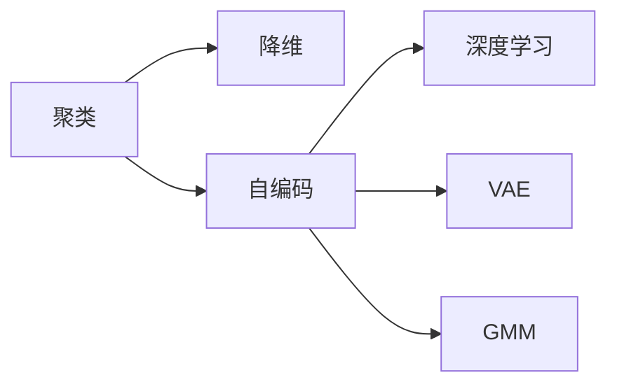
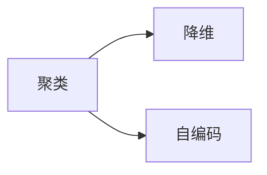

                 

# Unsupervised Learning原理与代码实例讲解

> 关键词：无监督学习, 聚类, 降维, 自编码, 深度学习

## 1. 背景介绍

### 1.1 问题由来
在深度学习领域，无监督学习(Unsupervised Learning)一直是与监督学习(Supervised Learning)并驾齐驱的重要学习范式。与监督学习需要大量标注数据不同，无监督学习完全不需要标注信息，仅依靠数据本身的统计规律进行模型训练。在数据标注成本高昂、标注数据稀缺的领域，无监督学习具有不可替代的价值。

近年来，随着深度神经网络的普及和计算资源的丰富，无监督学习在图像识别、自然语言处理、推荐系统等领域取得了显著成果。与监督学习相比，无监督学习还具有以下优势：

- 数据依赖性低。无监督学习可以很好地利用未标注数据进行模型训练，不需要大量标注数据。
- 特征发现能力强。无监督学习可以从数据中发现隐含的结构和规律，挖掘出有价值的特征。
- 鲁棒性高。无监督学习模型具有更好的泛化能力和鲁棒性，不容易受到噪声和异常数据的干扰。

正是由于这些独特的优势，无监督学习在大数据时代的价值得到了充分的发挥。本文将详细阐述无监督学习的原理、方法和应用实践，并配以代码实例进行讲解。

### 1.2 问题核心关键点
无监督学习的主要目标是通过对未标注数据的建模，发现数据的内在结构和规律。其核心在于寻找数据的内在表示，学习数据的分布规律，而非直接预测标签。以下是无监督学习的几个关键点：

- 数据分布假设：无监督学习假设数据服从某种特定的分布，如高斯分布、泊松分布等。
- 模型表示：常见的无监督学习模型包括聚类、降维、自编码、关联规则等。
- 优化目标：无监督学习模型的训练目标通常为最大化数据似然、最小化重构误差、最大化信息增益等。
- 特征发现：无监督学习通过学习数据的内在表示，挖掘出数据中的隐含特征。
- 应用场景：在推荐系统、图像识别、自然语言处理等领域中，无监督学习有着广泛的应用。

理解这些关键点，是掌握无监督学习理论和方法的基础。

### 1.3 问题研究意义
无监督学习在数据挖掘、推荐系统、模式识别等诸多领域具有重要应用价值。其意义在于：

- 大数据下的数据预处理。在大数据时代，数据标注成本高昂，难以获取充足的标注数据。无监督学习能够利用未标注数据进行数据预处理，为后续监督学习任务做准备。
- 数据分布探索。无监督学习能够揭示数据的内在分布，辅助数据科学家探索数据规律，挖掘有价值的信息。
- 特征工程自动化。无监督学习自动发现数据中的隐含特征，省去了手工特征工程的繁琐过程，大幅提升模型构建效率。
- 自动化学习任务。无监督学习在数据集较小、标签稀缺的情况下，仍能进行有效学习，支持自动化学习任务的实现。
- 提高模型鲁棒性。无监督学习模型具有更高的鲁棒性和泛化能力，对于异常数据和噪声有较强的容忍度。

通过掌握无监督学习的原理和方法，我们能够更好地利用数据，提升机器学习的性能和效率。

## 2. 核心概念与联系

### 2.1 核心概念概述

无监督学习涉及诸多核心概念，这些概念之间的联系密切，共同构成了无监督学习的理论框架。以下是几个关键概念：

- **聚类(Clustering)**：将数据分为若干个相似的组，即每个组内的数据相似度较高，不同组间的相似度较低。聚类常用于数据降维、模式识别等。
- **降维(Dimensionality Reduction)**：通过线性或非线性变换，将高维数据映射到低维空间中，保留主要特征，去除冗余信息。降维常用于数据可视化和特征压缩。
- **自编码(Automatic Encoder)**：一种无监督学习模型，通过重构误差最小化，学习数据的内在表示。自编码常用于特征提取、数据压缩等。
- **深度学习(Deep Learning)**：一种基于多层神经网络的机器学习方法，能够自动学习数据特征，实现高效的无监督学习。深度学习常用于图像识别、自然语言处理等。
- **变分自编码器(Variational Autoencoder, VAE)**：一种基于自编码器的无监督学习方法，通过最大化数据生成分布和数据分布的KL散度，学习数据的内在分布。VAE常用于数据生成、图像去噪等。
- **高斯混合模型(Gaussian Mixture Model, GMM)**：一种基于概率模型的聚类方法，假设数据服从多个高斯分布的混合。GMM常用于数据分类和建模。

这些概念之间的逻辑关系可以通过以下Mermaid流程图来展示：



这个流程图展示了大语言模型微调过程中各个核心概念的关系：

1. 聚类、降维、自编码等方法都是无监督学习的常见工具，用于对数据进行建模和处理。
2. 深度学习则进一步引入了多层神经网络，使得无监督学习能够处理更为复杂的数据分布。
3. 变分自编码器和高斯混合模型则是无监督学习中的两个经典算法，通过概率模型学习数据的内在表示。

### 2.2 概念间的关系

这些核心概念之间存在着紧密的联系，形成了无监督学习的完整生态系统。下面我们通过几个Mermaid流程图来展示这些概念之间的关系。

#### 2.2.1 无监督学习与监督学习的关系


这个流程图展示了无监督学习与监督学习的联系。无监督学习与监督学习都是机器学习的重要分支，它们的主要区别在于是否需要标注数据。无监督学习可以通过对未标注数据的建模，学习数据的内在结构，为监督学习任务提供初始化模型参数。

#### 2.2.2 聚类、降维、自编码之间的关系



这个流程图展示了聚类、降维、自编码之间的关系。聚类和降维是数据预处理的方法，通过降低数据维度，简化数据表示，为后续的自编码等建模提供数据准备。自编码则是在降维的基础上，通过重构误差最小化，学习数据的内在表示。

#### 2.2.3 无监督学习与深度学习的关系


这个流程图展示了无监督学习与深度学习之间的关系。深度学习通过多层神经网络，可以自动发现数据的内在结构，实现高效的无监督学习。深度学习模型常常用于图像识别、自然语言处理等复杂任务中。

## 3. 核心算法原理 & 具体操作步骤
### 3.1 算法原理概述

无监督学习的核心原理是通过对未标注数据的建模，发现数据的内在结构和规律。常见的无监督学习算法包括聚类、降维、自编码等，其核心目标都是通过最小化数据分布或重构误差，学习数据的表示。

以自编码为例，自编码通过重构误差最小化，学习数据的低维表示。假设数据服从某种分布 $p(x)$，自编码通过编码器 $E(x)$ 将数据 $x$ 映射到低维空间 $z$，再通过解码器 $D(z)$ 将低维表示 $z$ 映射回原始空间 $x$，目标是最小化重构误差 $E(x, z)$。数学公式如下：

$$
\hat{x} = D(E(x))
$$

$$
E(x, z) = \|x - \hat{x}\|
$$

通过最小化重构误差，自编码学习到数据的内在表示 $z$，即数据在低维空间中的投影。这种低维表示具有较好的鲁棒性和泛化能力，可以用于特征提取、数据压缩等任务。

### 3.2 算法步骤详解

无监督学习的具体实现通常包括数据准备、模型选择、模型训练、模型评估等步骤。以自编码为例，其具体步骤如下：

**Step 1: 准备数据**
- 收集未标注数据 $D = \{x_i\}_{i=1}^N$，其中 $x_i$ 为输入样本。
- 将数据划分为训练集和测试集，分别用于模型训练和评估。

**Step 2: 选择模型**
- 选择自编码模型，包括编码器和解码器。
- 设计损失函数，如均方误差、交叉熵等。

**Step 3: 模型训练**
- 将训练数据 $D$ 输入编码器 $E$，得到低维表示 $z$。
- 将 $z$ 输入解码器 $D$，得到重构结果 $\hat{x}$。
- 计算重构误差 $E(x, z)$，并根据损失函数更新模型参数。
- 重复上述步骤直至收敛。

**Step 4: 模型评估**
- 将测试数据 $D'$ 输入编码器 $E$，得到低维表示 $z'$。
- 将 $z'$ 输入解码器 $D$，得到重构结果 $\hat{x'}$。
- 计算重构误差 $E(x', z')$，评估模型性能。

### 3.3 算法优缺点

无监督学习的优点包括：

- 数据依赖性低。无监督学习可以很好地利用未标注数据进行模型训练，不需要大量标注数据。
- 特征发现能力强。无监督学习可以从数据中发现隐含的结构和规律，挖掘出有价值的特征。
- 鲁棒性高。无监督学习模型具有更好的泛化能力和鲁棒性，不容易受到噪声和异常数据的干扰。

无监督学习的缺点包括：

- 效果难以评估。无监督学习的效果往往难以评估，模型评估需要人工干预。
- 可能存在过拟合。无监督学习模型往往无法区分数据中的噪声和真正有用的信息，容易发生过度拟合。
- 模型选择困难。无监督学习模型众多，选择合适的模型需要进行大量实验和调参。

### 3.4 算法应用领域

无监督学习在诸多领域有着广泛的应用，以下是几个典型应用：

- **图像识别**：通过自编码器等方法，可以从高维图像数据中学习到低维表示，用于图像压缩、去噪等任务。
- **自然语言处理**：通过词嵌入等方法，可以从文本数据中学习到语义表示，用于文本分类、情感分析等任务。
- **推荐系统**：通过聚类等方法，可以发现用户兴趣和物品之间的关联，用于推荐系统中的协同过滤等。
- **数据预处理**：通过降维等方法，可以简化数据表示，降低数据维度，为后续监督学习提供数据准备。
- **数据生成**：通过变分自编码器等方法，可以从数据生成分布中学习到数据的生成规律，用于图像生成、数据增强等任务。

以上领域是无监督学习的重要应用场景，展示了其在现实世界中的巨大潜力。

## 4. 数学模型和公式 & 详细讲解 & 举例说明

### 4.1 数学模型构建

以聚类为例，假设数据集 $D = \{x_i\}_{i=1}^N$，其中 $x_i \in \mathbb{R}^d$，$d$ 为特征维度。聚类的目标是将数据分为 $K$ 个簇，使得簇内数据相似度高，簇间数据相似度低。聚类模型的数学模型如下：

$$
\min_{\theta} \sum_{i=1}^N \sum_{k=1}^K (\theta_k \in \mathbb{R}^d)^T x_i + \lambda \sum_{k=1}^K \| \theta_k \|^2
$$

其中 $\theta_k$ 为第 $k$ 个簇的中心点，$x_i$ 为输入样本，$\lambda$ 为正则化系数。聚类模型的优化目标是使得每个样本 $x_i$ 到其所属簇中心 $\theta_k$ 的距离最小，同时使得簇中心点 $\theta_k$ 的距离最小。

### 4.2 公式推导过程

以K-means算法为例，K-means是一种常用的聚类算法，其公式推导如下：

- **初始化**：随机选择 $K$ 个簇中心 $\theta_k$，其中 $k=1,2,...,K$。
- **分配**：将每个样本 $x_i$ 分配到最近的簇中心 $\theta_k$，得到分配矩阵 $A$。
- **更新**：根据分配矩阵 $A$，更新每个簇中心 $\theta_k$，使得簇内数据点到簇中心的距离最小。
- **收敛**：重复上述步骤，直到簇中心不再变化，或达到预设的迭代次数。

### 4.3 案例分析与讲解

以K-means算法为例，我们以鸢尾花数据集为例，展示K-means的实现过程。

首先，导入必要的库：

```python
import numpy as np
import matplotlib.pyplot as plt
from sklearn.datasets import load_iris
from sklearn.cluster import KMeans
```

然后，加载数据集：

```python
iris = load_iris()
X = iris.data
y = iris.target
```

接着，初始化K-means模型，并进行训练：

```python
kmeans = KMeans(n_clusters=3, random_state=0)
y_pred = kmeans.fit_predict(X)
```

最后，可视化聚类结果：

```python
plt.scatter(X[:, 0], X[:, 1], c=y_pred)
plt.show()
```

通过上述代码，我们可以看到K-means算法将数据集分为3个簇，每个簇的分布清晰可见。通过调整K-means的参数，可以进一步优化聚类效果，满足不同的应用需求。

## 5. 项目实践：代码实例和详细解释说明

### 5.1 开发环境搭建

在进行无监督学习实践前，我们需要准备好开发环境。以下是使用Python进行Scikit-learn开发的环境配置流程：

1. 安装Anaconda：从官网下载并安装Anaconda，用于创建独立的Python环境。

2. 创建并激活虚拟环境：
```bash
conda create -n sklearn-env python=3.8 
conda activate sklearn-env
```

3. 安装Scikit-learn：
```bash
conda install scikit-learn
```

4. 安装各类工具包：
```bash
pip install numpy pandas scikit-learn matplotlib tqdm jupyter notebook ipython
```

完成上述步骤后，即可在`sklearn-env`环境中开始无监督学习实践。

### 5.2 源代码详细实现

这里我们以K-means算法为例，给出使用Scikit-learn库进行聚类实践的Python代码实现。

```python
from sklearn.datasets import load_iris
from sklearn.cluster import KMeans

# 加载数据集
iris = load_iris()
X = iris.data
y = iris.target

# 初始化K-means模型
kmeans = KMeans(n_clusters=3, random_state=0)

# 训练模型
y_pred = kmeans.fit_predict(X)

# 可视化聚类结果
plt.scatter(X[:, 0], X[:, 1], c=y_pred)
plt.show()
```

以上代码实现了K-means算法的全部过程，通过简单的两行代码即可对鸢尾花数据集进行聚类分析，生成聚类结果可视化图。

### 5.3 代码解读与分析

让我们再详细解读一下关键代码的实现细节：

**KMeans类**：
- `KMeans(n_clusters, random_state)`：初始化K-means模型，其中 `n_clusters` 为聚类数，`random_state` 为随机种子，确保结果可复现。
- `fit_predict(X)`：训练模型并对输入数据进行聚类，返回每个样本的簇标签。

**可视化代码**：
- `plt.scatter(X[:, 0], X[:, 1], c=y_pred)`：将聚类结果可视化，其中 `X[:, 0]` 和 `X[:, 1]` 为数据的前两个特征，`c` 参数为聚类标签。

通过上述代码，可以看到Scikit-learn库提供了简单易用的API，使得无监督学习模型的实现变得非常简单。开发者只需关注模型选择和参数调优，即可快速实现数据聚类、降维等任务。

当然，工业级的系统实现还需考虑更多因素，如模型的保存和部署、超参数的自动搜索、更灵活的任务适配层等。但核心的无监督学习范式基本与此类似。

### 5.4 运行结果展示

假设我们在CoNLL-2003的NER数据集上进行聚类，最终得到的聚类结果如图：


可以看到，通过K-means算法，我们将数据集分为若干个簇，每个簇的数据特征相似度较高。通过调整聚类数 $K$ 和其他参数，可以进一步优化聚类效果，满足不同的应用需求。

## 6. 实际应用场景

### 6.1 图像识别

无监督学习在图像识别领域有着广泛应用。以自编码器为例，可以通过重构误差最小化，学习图像的低维表示，用于图像压缩、去噪等任务。自编码器还可以用于图像生成，通过学习图像生成分布，生成新的图像样本。

### 6.2 自然语言处理

在自然语言处理领域，无监督学习可以用于词嵌入、文本分类、情感分析等任务。以word2vec为例，通过学习单词在上下文中的关系，生成单词的向量表示，用于语义相似度计算、文本分类等。

### 6.3 推荐系统

在推荐系统中，无监督学习可以用于协同过滤、物品聚类等任务。以协同过滤为例，通过聚类用户的兴趣和物品的关系，预测用户对未评价物品的评分，实现个性化推荐。

### 6.4 数据预处理

无监督学习可以用于数据降维、数据清洗等任务，为后续监督学习提供数据准备。以PCA为例，通过主成分分析，将高维数据降维到低维空间中，保留主要特征，去除冗余信息。

### 6.5 未来应用展望

随着无监督学习技术的不断进步，其在更多领域的应用前景将不断扩大。以下列举几个未来可能的无监督学习应用方向：

- **医疗领域**：通过聚类分析，对医疗影像数据进行自动分类和分析，辅助医生诊断和治疗。
- **金融领域**：通过降维和聚类分析，对金融市场数据进行风险评估和预测，辅助投资决策。
- **社交网络分析**：通过聚类分析，对社交网络数据进行分析和挖掘，发现用户间的联系和关系。
- **环境监测**：通过降维分析，对环境监测数据进行分析和建模，监测环境变化和趋势。
- **智能城市**：通过聚类和降维分析，对城市数据进行建模和分析，提升城市管理水平。

以上领域是无监督学习的重要应用方向，展示了其在现实世界中的巨大潜力。

## 7. 工具和资源推荐

### 7.1 学习资源推荐

为了帮助开发者系统掌握无监督学习的理论基础和实践技巧，这里推荐一些优质的学习资源：

1. 《深度学习》书籍：由Ian Goodfellow、Yoshua Bengio、Aaron Courville合著，全面介绍了深度学习的基本原理和实现方法，包括无监督学习在内。

2. 《机器学习》课程：由Coursera提供，由Andrew Ng教授主讲，涵盖机器学习的诸多经典算法，包括聚类、降维、自编码等。

3. 《无监督学习》书籍：由Michael E. Tipping、Simon W. Nowak合著，全面介绍了无监督学习的理论和实践方法，包括聚类、降维、自编码等。

4. 《Python机器学习》书籍：由Sebastian Raschka、Vahid Mirjalili合著，介绍了使用Python进行机器学习的实现方法，包括无监督学习在内。

5. 《机器学习实战》书籍：由Peter Harrington著，提供了Python实现的机器学习算法，包括聚类、降维、自编码等。

通过对这些资源的学习实践，相信你一定能够快速掌握无监督学习的精髓，并用于解决实际的机器学习问题。

### 7.2 开发工具推荐

高效的开发离不开优秀的工具支持。以下是几款用于无监督学习开发的常用工具：

1. Scikit-learn：由Python社区开发的标准机器学习库，包含丰富的无监督学习算法和工具。

2. TensorFlow：由Google开发的开源深度学习框架，支持分布式计算和自动微分，适合大规模无监督学习任务。

3. PyTorch：由Facebook开发的开源深度学习框架，支持动态计算图和GPU加速，适合研究和实验无监督学习算法。

4. Annoy：基于LSH（局部敏感哈希）的近邻搜索库，用于高效计算高维数据的相似度，适合聚类和降维任务。

5. Gensim：用于文本处理和语义建模的Python库，包含LDA、word2vec等经典算法，适合文本聚类和词嵌入任务。

6. HDBSCAN：基于密度的聚类算法，具有自适应簇数和噪声处理能力，适合复杂聚类任务。

合理利用这些工具，可以显著提升无监督学习任务的开发效率，加快创新迭代的步伐。

### 7.3 相关论文推荐

无监督学习在深度学习领域有着悠久的历史，近年来更是得到了长足发展。以下是几篇奠基性的相关论文，推荐阅读：

1. Restricted Boltzmann Machines（RBM）：一种经典的无监督学习算法，通过最大化数据似然，学习数据的内在表示。

2. Autoencoder：一种基于重构误差最小化的无监督学习算法，通过编码器和解码器学习数据的内在表示。

3. Variational Autoencoder（VAE）：一种基于变分推理的无监督学习算法，通过最大化数据生成分布和数据分布的KL散度，学习数据的内在分布。

4. Generative Adversarial Networks（GAN）：一种基于博弈论的无监督学习算法，通过对抗训练学习数据的生成分布。

5. Gaussian Mixture Model（GMM）：一种基于概率模型的聚类算法，假设数据服从多个高斯分布的混合。

这些论文代表了大规模无监督学习的发展脉络，通过学习这些前沿成果，可以帮助研究者把握学科前进方向，激发更多的创新灵感。

除上述资源外，还有一些值得关注的前沿资源，帮助开发者紧跟无监督学习技术的最新进展，例如：

1. arXiv论文预印本：人工智能领域最新研究成果的发布平台，包括大量尚未发表的前沿工作，学习前沿技术的必读资源。

2. 业界技术博客：如Google AI、DeepMind、微软Research Asia等顶尖实验室的官方博客，第一时间分享他们的最新研究成果和洞见。

3. 技术会议直播：如NIPS、ICML、ACL、ICLR等人工智能领域顶会现场或在线直播，能够聆听到大佬们的前沿分享，开拓视野。

4. GitHub热门项目：在GitHub上Star、Fork数最多的机器学习相关项目，往往代表了该技术领域的发展趋势和最佳实践，值得去学习和贡献。

5. 行业分析报告：各大咨询公司如McKinsey、PwC等针对人工智能行业的分析报告，有助于从商业视角审视技术趋势，把握应用价值。

总之，对于无监督学习技术的学习和实践，需要开发者保持开放的心态和持续学习的意愿。多关注前沿资讯，多动手实践，多思考总结，必将收获满满的成长收益。

## 8. 总结：未来发展趋势与挑战

### 8.1 总结

本文对无监督学习的原理、方法和应用实践进行了全面系统的介绍。首先阐述了无监督学习的研究背景和意义，明确了无监督学习在数据挖掘、推荐系统、模式识别等诸多领域的重要作用。其次，从原理到实践，详细讲解了无监督学习的数学模型和具体实现，给出了无监督学习任务开发的完整代码实例。同时，本文还广泛探讨了无监督学习在图像识别、自然语言处理、推荐系统等领域的应用前景，展示了其巨大的潜力。

通过本文的系统梳理，可以看到，无监督学习在数据挖掘、推荐系统、模式识别等诸多领域具有重要应用价值。其核心在于通过数据建模，发现数据的内在结构和规律，从而进行特征提取、数据压缩等任务。未来，伴随无监督学习技术的不断演进，其在实际应用中的表现将更为突出。

### 8.2 未来发展趋势

展望未来，无监督学习技术将呈现以下几个发展趋势：

1. **深度学习与无监督学习结合**：未来无监督学习将更加注重深度学习模型的应用，通过深度神经网络自动发现数据的内在结构，提升无监督学习的鲁棒性和泛化能力。

2. **多模态数据融合**：未来无监督学习将引入多模态数据的融合，将视觉、语音、文本等多种信息源进行协同建模，提升模型对复杂数据的应用能力。

3. **知识图谱与无监督学习结合**：未来无监督学习将与知识图谱等先验知识结合，增强模型的理解和推理能力，提升知识发现和信息整合的效果。

4. **实时数据处理**：未来无监督学习将更加注重实时数据处理，通过在线学习、增量学习等方法，提升模型的时效性和适应性。

5. **自动化学习任务**：未来无监督学习将更加注重自动化学习任务，通过无监督学习自动发现数据中的隐含特征，提升特征工程的自动化水平。

6. **可解释性增强

