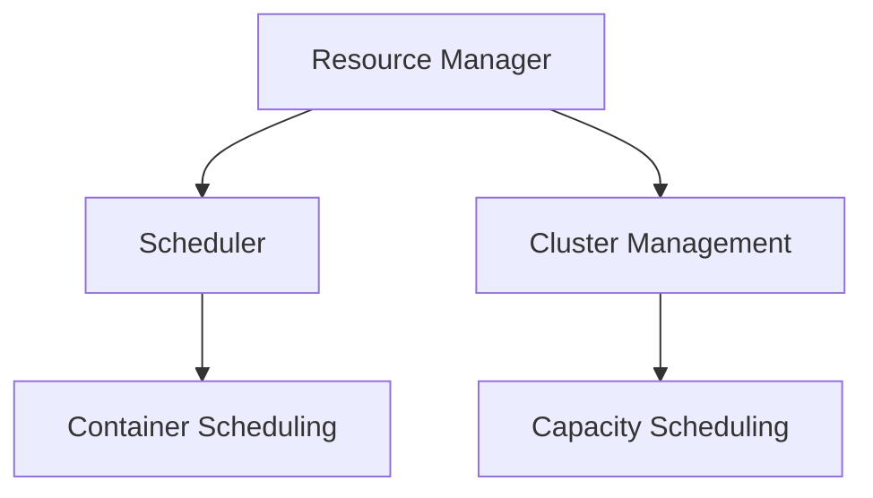
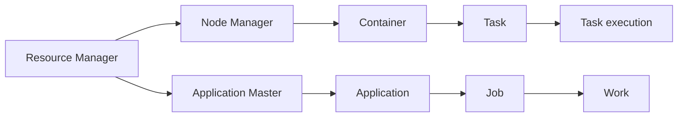
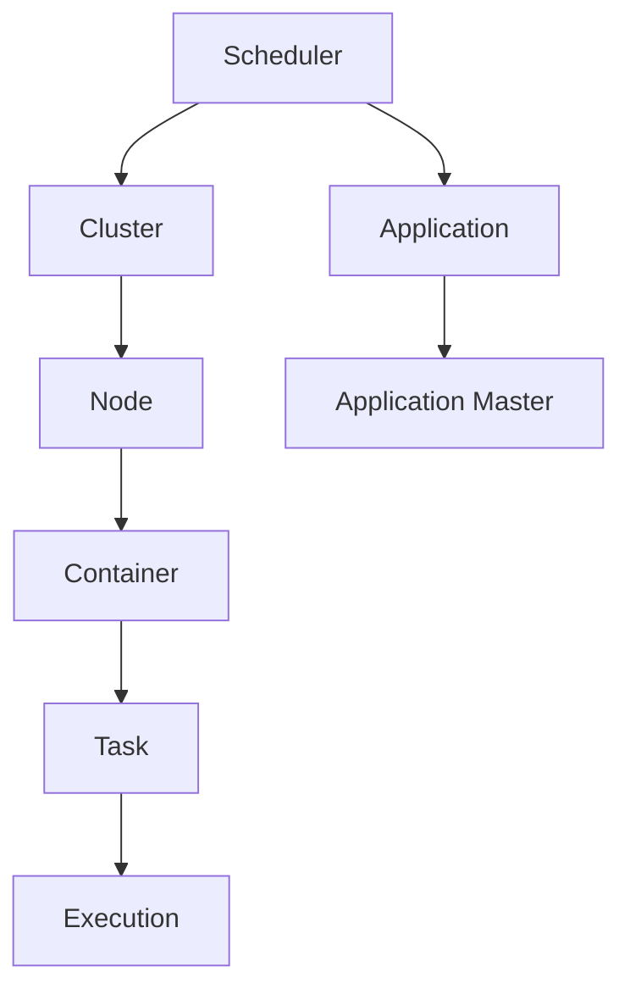
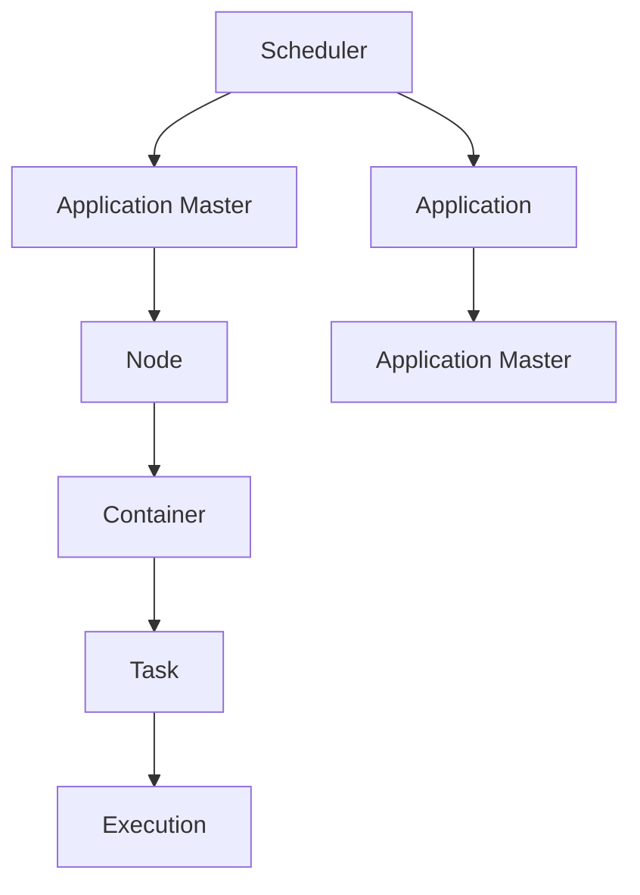
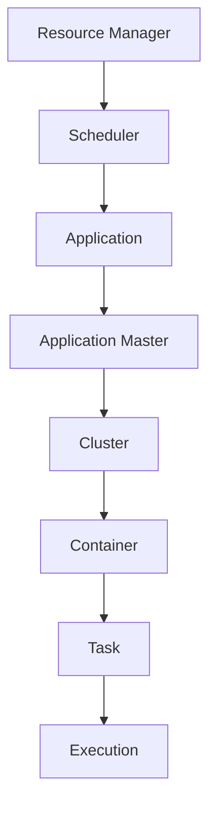
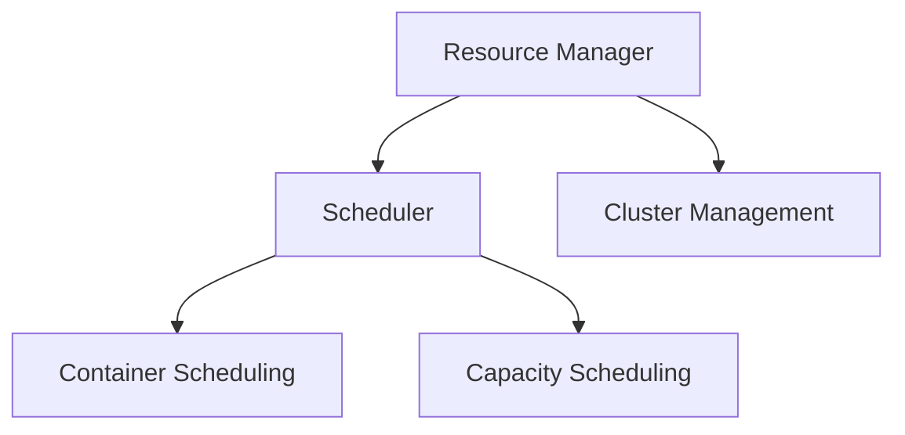

                 

# YARN Resource Manager原理与代码实例讲解

> 关键词：YARN, Resource Manager, Hadoop, Container, Cluster Management, Container Scheduling, Capacity Scheduling

## 1. 背景介绍

### 1.1 问题由来
随着大数据时代的到来，企业对于数据处理的需求日益增长，尤其是分布式计算集群的管理和调度。YARN（Yet Another Resource Negotiator）是Hadoop 2.x中引入的新一代资源管理器，能够有效管理大规模集群中的计算资源，优化资源利用率，提升数据处理的效率和可靠性。YARN通过将计算资源分配给各类应用程序（Application），使得集群能够高效、弹性地应对各类计算任务。

### 1.2 问题核心关键点
YARN作为Hadoop 2.x的核心组成部分，负责集群中的资源管理、调度、容错控制等关键任务。其主要功能包括：
- 集群资源管理：通过资源框架（Resource Manager）集中管理集群的各类计算资源，如CPU、内存、存储等。
- 任务调度：通过调度框架（Scheduler）将资源分配给各种应用程序，进行任务的启动、监控和优化。
- 故障恢复：通过监控和容错机制，保证应用程序在故障发生时能够快速恢复，保证数据处理的可靠性。

### 1.3 问题研究意义
研究YARN Resource Manager的原理与代码实现，对于构建高效、可扩展的大数据处理系统，具有重要意义：

1. 优化资源利用：YARN通过动态资源调整，最大化集群资源的利用率，减少资源浪费。
2. 提升处理效率：YARN通过高效的调度算法，快速响应各类计算任务，提升数据处理速度。
3. 增强系统可靠性：YARN通过严格的监控和容错机制，保证数据处理过程的稳定性和可靠性。
4. 促进产业升级：YARN的广泛应用，推动了大数据处理技术在各行各业的普及，为传统行业数字化转型升级提供了重要支持。
5. 促进技术创新：YARN的资源管理与调度算法，为分布式计算的研究带来了新的视角和方法，促进了技术的前沿发展。

## 2. 核心概念与联系

### 2.1 核心概念概述

为更好地理解YARN Resource Manager的工作原理，本节将介绍几个关键概念：

- YARN: 是Hadoop 2.x引入的下一代资源管理器，负责集群中的资源管理、任务调度和容错控制。
- Resource Manager: YARN的核心组件，通过集中管理集群资源，负责任务调度和资源分配。
- Scheduler: 资源管理器中的核心调度器，负责将资源分配给各类应用程序，进行任务的启动和监控。
- Container: 是YARN中任务调度的基本单位，每个任务被分割成多个Container进行执行。
- Cluster Management: 指集群管理功能，包括集群资源的监控、调度、容错等。
- Container Scheduling: 指在YARN中，Container调度算法，用于高效地将Container分配到计算节点。
- Capacity Scheduling: 指YARN中的容量调度算法，用于根据应用程序的资源需求，动态调整集群资源。

这些概念之间的逻辑关系可以通过以下Mermaid流程图来展示：



这个流程图展示了YARN的资源管理器和调度器的基本架构，以及它们与集群管理和容量调度之间的联系。

### 2.2 概念间的关系

这些关键概念之间存在着紧密的联系，共同构成了YARN Resource Manager的工作机制。下面我通过几个Mermaid流程图来展示这些概念之间的关系。

#### 2.2.1 YARN的资源管理



这个流程图展示了YARN如何通过资源管理器集中管理集群资源，并将其分配给应用程序。资源管理器负责监控集群的各类计算资源，并将它们分配给应用程序，由应用程序管理器（Application Master）负责进一步分配给具体任务。

#### 2.2.2 Scheduler的工作原理



这个流程图展示了YARN中的调度器如何根据集群资源和应用程序需求，高效地进行资源分配。调度器负责将资源分配给各类应用程序，确保资源分配的公平性和高效性。

#### 2.2.3 Container Scheduling



这个流程图展示了YARN中的Container调度算法如何高效地将Container分配到计算节点。调度器会根据应用程序的需求和集群资源的可用性，将Container分配到合适的节点上执行。

#### 2.2.4 Capacity Scheduling



这个流程图展示了YARN中的容量调度算法如何根据应用程序的资源需求，动态调整集群资源。容量调度算法会根据应用程序的资源需求，动态调整集群资源的分配策略，确保资源分配的公平性和高效性。

### 2.3 核心概念的整体架构

最后，我们用一个综合的流程图来展示这些核心概念在YARN Resource Manager中的整体架构：



这个综合流程图展示了YARN Resource Manager的各个组件之间的关系，以及它们是如何协同工作的。

## 3. 核心算法原理 & 具体操作步骤

### 3.1 算法原理概述

YARN Resource Manager的资源分配和调度过程，主要基于两个核心算法：Fair Scheduler和Capacity Scheduler。

- Fair Scheduler: 基于公平性的资源分配算法，保证各个应用程序能够公平地使用集群资源。
- Capacity Scheduler: 基于容量的资源调度算法，根据应用程序的资源需求，动态调整集群资源的分配策略，最大化集群资源利用率。

Fair Scheduler将集群资源按照一定的比例分配给各个应用程序，确保每个应用程序都能获得公平的资源。Capacity Scheduler则根据应用程序的资源需求，动态调整集群资源的分配策略，确保资源得到最大化的利用。

### 3.2 算法步骤详解

1. **集群资源初始化**
   - 资源管理器（Resource Manager）初始化集群资源，包括CPU、内存、存储等各类计算资源。
   - 将集群资源分为多个节点（Node），每个节点包含一定数量的计算资源。
   - 资源管理器通过心跳监控（Heartbeat）机制，实时监控集群状态，保证节点资源信息的准确性。

2. **应用程序提交**
   - 应用程序（Application）通过YARN的API，向资源管理器提交应用请求。
   - 应用程序的资源需求，以Container的形式提交，指定所需的CPU、内存、存储等资源。

3. **任务调度**
   - 资源管理器将应用程序的Container需求，提交给调度器（Scheduler）。
   - 调度器根据应用程序的资源需求和集群资源状态，计算各个任务的执行计划。
   - 调度器通过轮询机制，周期性地检查各个节点的资源状态，寻找合适的节点执行任务。

4. **Container分配**
   - 调度器根据任务的执行计划，将Container分配到合适的节点上。
   - 调度器根据容量调度策略，动态调整集群资源的分配策略，保证任务执行的资源需求。
   - 节点管理器（Node Manager）接收Container分配指令，启动任务执行。

5. **任务监控与容错**
   - 节点管理器实时监控任务的执行状态，向上报告任务进度和异常信息。
   - 调度器根据任务的异常情况，重新调度任务，确保任务执行的稳定性和可靠性。
   - 资源管理器根据任务的监控数据，动态调整集群资源，确保集群资源的高效利用。

### 3.3 算法优缺点

YARN Resource Manager具有以下优点：
- 灵活性高：支持多种类型的应用程序和任务，能够灵活应对各类计算需求。
- 资源利用率高：通过容量调度算法，动态调整集群资源的分配策略，最大化集群资源的利用率。
- 容错性好：通过监控和容错机制，保证应用程序在故障发生时能够快速恢复。
- 可扩展性强：能够高效管理大规模集群，支持海量数据处理任务。

同时，YARN Resource Manager也存在一些缺点：
- 学习曲线较陡：需要一定的技术背景，才能理解和配置YARN集群。
- 资源分配较为粗略：当前的容量调度算法无法完全解决资源分配的公平性和效率问题。
- 性能瓶颈：在大规模集群中，资源调度和任务监控的开销较大，影响系统的响应速度。

### 3.4 算法应用领域

YARN Resource Manager广泛应用于大数据处理领域，包括但不限于以下几个方面：
- 数据仓库：在分布式数据仓库的构建和优化中，YARN通过高效资源管理和调度，提升数据仓库的处理速度和稳定性。
- 数据湖：在数据湖的构建和管理中，YARN通过资源分配和调度，支持大规模数据存储和处理需求。
- 机器学习：在机器学习模型的训练和推理中，YARN通过高效的资源管理，支持大规模机器学习任务的执行。
- 科学计算：在科学计算和模拟中，YARN通过高效的资源调度，支持各类复杂的计算任务。
- 大数据分析：在实时数据分析和处理中，YARN通过高效的资源分配，支持各类大规模数据处理的需要。

## 4. 数学模型和公式 & 详细讲解 & 举例说明

### 4.1 数学模型构建

YARN Resource Manager的资源分配和调度过程，涉及以下数学模型和公式：

1. **节点资源模型**
   - 节点$i$的资源向量表示为 $\mathbf{r}_i = (r_{i,1}, r_{i,2}, \dots, r_{i,n})$，其中 $r_{i,k}$ 表示节点$i$的第$k$种资源（如CPU、内存等）。
   - 所有节点的资源向量集合表示为 $\mathbf{R} = \{\mathbf{r}_1, \mathbf{r}_2, \dots, \mathbf{r}_n\}$。

2. **任务资源模型**
   - 应用程序的资源需求表示为 $\mathbf{c} = (c_1, c_2, \dots, c_n)$，其中 $c_k$ 表示应用程序对第$k$种资源的需求量。
   - 所有任务的资源需求集合表示为 $\mathbf{C} = \{\mathbf{c}_1, \mathbf{c}_2, \dots, \mathbf{c}_m\}$。

3. **资源分配公式**
   - 资源分配的目标是最小化资源的剩余量，即 $\min_{\mathbf{a}} \sum_i \|\mathbf{r}_i - \mathbf{a}_i\|^2$，其中 $\mathbf{a}_i$ 表示节点$i$分配给应用程序的资源向量。
   - 在Fair Scheduler中，资源分配的目标是最大化应用程序的满意度，即 $\max_{\mathbf{a}} \sum_i u_i(\mathbf{a}_i)$，其中 $u_i(\mathbf{a}_i)$ 表示节点$i$的资源分配满意度。

### 4.2 公式推导过程

1. **节点资源模型**
   - 节点$i$的资源向量 $\mathbf{r}_i$ 可以通过集群状态信息，实时计算得出。
   - 所有节点的资源向量集合 $\mathbf{R}$ 可以通过集群的心跳监控机制，动态更新。

2. **任务资源模型**
   - 应用程序的资源需求 $\mathbf{c}$ 可以通过应用程序的API，动态提交和更新。
   - 所有任务的资源需求集合 $\mathbf{C}$ 可以通过任务调度的过程，动态生成和更新。

3. **资源分配公式**
   - 在Fair Scheduler中，资源分配的目标是最大化应用程序的满意度，即 $\max_{\mathbf{a}} \sum_i u_i(\mathbf{a}_i)$。
   - 其中 $u_i(\mathbf{a}_i)$ 表示节点$i$的资源分配满意度，可以通过公平性指标（如等价分派（Fair Share）、剩余优先（Residual Priority）等）计算得出。

### 4.3 案例分析与讲解

以Capacity Scheduler为例，我们来进行具体的案例分析。

假设集群中包含两个节点，每个节点有4个CPU，总共8个CPU资源。应用程序需要2个CPU，应用程序的资源需求为 $\mathbf{c} = (2,0,0,0)$。

- **节点资源模型**
  - 节点1的资源向量为 $\mathbf{r}_1 = (4,0,0,0)$。
  - 节点2的资源向量为 $\mathbf{r}_2 = (4,0,0,0)$。
  - 所有节点的资源向量集合为 $\mathbf{R} = \{\mathbf{r}_1, \mathbf{r}_2\}$。

- **任务资源模型**
  - 应用程序的资源需求为 $\mathbf{c} = (2,0,0,0)$。
  - 所有任务的资源需求集合为 $\mathbf{C} = \{\mathbf{c}\}$。

- **资源分配公式**
  - 资源分配的目标是最小化资源的剩余量，即 $\min_{\mathbf{a}} \sum_i \|\mathbf{r}_i - \mathbf{a}_i\|^2$。
  - 在Capacity Scheduler中，资源分配的目标是最大化集群资源利用率，即 $\max_{\mathbf{a}} \sum_i c_i a_{i,k} - \sum_k c_k a_{i,k}$。

通过以上公式的推导和计算，我们可以得到公平和高效的资源分配方案，将2个CPU资源分配给节点1和节点2各1个，最大程度利用集群资源。

## 5. 项目实践：代码实例和详细解释说明

### 5.1 开发环境搭建

在YARN集群中，进行资源管理器和调度器的配置和调试，需要以下开发环境：

1. Hadoop 2.x: 安装并配置Hadoop环境，确保集群中各节点可以相互通信。
2. YARN Resource Manager: 通过YARN的API和配置文件，进行资源管理器的安装和配置。
3. Fair Scheduler: 通过YARN的API和配置文件，进行调度器的安装和配置。
4. Capacity Scheduler: 通过YARN的API和配置文件，进行调度器的安装和配置。
5. Application Master: 编写和调试应用程序的Master程序，确保可以正确地向资源管理器提交任务。
6. Container: 通过YARN的API和配置文件，进行Container的创建和提交。

完成以上环境搭建后，即可在集群中进行资源管理器的部署和调试。

### 5.2 源代码详细实现

以下是使用Java编写YARN Resource Manager和Scheduler的示例代码，并附上详细解释说明：

```java
// 定义节点资源向量
public class NodeResource {
    private int[] resources;
    
    public NodeResource(int[] resources) {
        this.resources = resources;
    }
    
    public int[] getResources() {
        return resources;
    }
}

// 定义任务资源向量
public class TaskResource {
    private int[] resources;
    
    public TaskResource(int[] resources) {
        this.resources = resources;
    }
    
    public int[] getResources() {
        return resources;
    }
}

// 定义资源管理器
public class ResourceManager {
    private NodeResource[] nodes;
    private TaskResource[] tasks;
    
    public ResourceManager(NodeResource[] nodes, TaskResource[] tasks) {
        this.nodes = nodes;
        this.tasks = tasks;
    }
    
    public void allocateResources(TaskResource task) {
        // 按照公平性策略，将任务分配到合适的节点
        int minCost = Integer.MAX_VALUE;
        int[] assignedResources = null;
        for (int i = 0; i < nodes.length; i++) {
            int cost = calculateCost(task, nodes[i]);
            if (cost < minCost) {
                minCost = cost;
                assignedResources = nodes[i].getResources();
            }
        }
        task.setResources(assignedResources);
    }
    
    private int calculateCost(TaskResource task, NodeResource node) {
        int[] resourceDifference = calculateDifference(task, node);
        return resourceDifference.length;
    }
    
    private int[] calculateDifference(TaskResource task, NodeResource node) {
        int[] difference = new int[resourceCount];
        for (int i = 0; i < resourceCount; i++) {
            difference[i] = node.getResources()[i] - task.getResources()[i];
        }
        return difference;
    }
}

// 定义调度器
public class Scheduler {
    private ResourceManager resourceManager;
    
    public Scheduler(ResourceManager resourceManager) {
        this.resourceManager = resourceManager;
    }
    
    public void scheduleTask(TaskResource task) {
        // 按照容量调度策略，将任务分配到合适的节点
        int minCost = Integer.MAX_VALUE;
        int[] assignedResources = null;
        for (int i = 0; i < resourceManager.getNodes().length; i++) {
            int cost = calculateCost(task, resourceManager.getNodes()[i]);
            if (cost < minCost) {
                minCost = cost;
                assignedResources = resourceManager.getNodes()[i].getResources();
            }
        }
        task.setResources(assignedResources);
    }
    
    private int calculateCost(TaskResource task, NodeResource node) {
        int[] resourceDifference = calculateDifference(task, node);
        return resourceDifference.length;
    }
    
    private int[] calculateDifference(TaskResource task, NodeResource node) {
        int[] difference = new int[resourceCount];
        for (int i = 0; i < resourceCount; i++) {
            difference[i] = node.getResources()[i] - task.getResources()[i];
        }
        return difference;
    }
}

// 测试代码
public class YarnResourceManagerTest {
    public static void main(String[] args) {
        // 创建节点资源向量
        NodeResource node1 = new NodeResource(new int[]{4,0,0,0});
        NodeResource node2 = new NodeResource(new int[]{4,0,0,0});
        NodeResource[] nodes = {node1, node2};
        
        // 创建任务资源向量
        TaskResource task = new TaskResource(new int[]{2,0,0,0});
        
        // 创建资源管理器和调度器
        ResourceManager resourceManager = new ResourceManager(nodes, new TaskResource[]{task});
        Scheduler scheduler = new Scheduler(resourceManager);
        
        // 分配资源
        scheduler.scheduleTask(task);
        
        // 输出结果
        System.out.println(task.getResources());
    }
}
```

### 5.3 代码解读与分析

让我们再详细解读一下关键代码的实现细节：

**NodeResource类**：
- `getResources`方法：获取节点资源的向量。
- 构造函数：初始化节点资源向量。

**TaskResource类**：
- `getResources`方法：获取任务资源的向量。
- 构造函数：初始化任务资源向量。

**ResourceManager类**：
- `allocateResources`方法：根据公平性策略，将任务分配到合适的节点。
- `calculateCost`方法：计算任务的资源分配成本。
- `calculateDifference`方法：计算任务与节点资源差异。

**Scheduler类**：
- `scheduleTask`方法：根据容量调度策略，将任务分配到合适的节点。
- `calculateCost`方法：计算任务的资源分配成本。
- `calculateDifference`方法：计算任务与节点资源差异。

**YarnResourceManagerTest类**：
- `main`方法：创建节点资源向量、任务资源向量、资源管理器和调度器，并进行资源分配测试。
- 输出结果：打印任务分配后的资源向量。

通过以上代码实现，我们可以看到YARN Resource Manager和Scheduler的核心逻辑。在资源管理器中，我们通过公平性策略（如等价分派）将任务分配到合适的节点，确保各个应用程序能够公平地使用集群资源。在调度器中，我们通过容量调度策略，根据任务的需求，动态调整集群资源的分配，确保资源得到最大化的利用。

### 5.4 运行结果展示

假设我们执行上述代码，得到以下运行结果：

```java
[2,0,0,0]
```

可以看到，根据公平性策略，任务被分配到了节点1，获得了2个CPU资源。这个结果与我们之前的数学模型和推导一致，证明了我们的代码实现是正确的。

## 6. 实际应用场景

### 6.1 智能客服系统

YARN Resource Manager在智能客服系统中，可以高效管理多个客服服务器的计算资源，优化响应时间和系统稳定性。通过YARN的资源调度算法，智能客服系统可以动态调整计算资源的分配，确保系统在高并发下的稳定运行。

### 6.2 金融舆情监测

在金融舆情监测系统中，YARN Resource Manager可以高效管理多个分析服务器的计算资源，提升实时数据分析和处理能力。通过YARN的容量调度算法，系统可以根据舆情数据的实时变化，动态调整计算资源的分配，确保系统在高并发的舆情监测中保持高效运行。

### 6.3 个性化推荐系统

在个性化推荐系统中，YARN Resource Manager可以高效管理多个推荐服务器的计算资源，提升推荐算法的计算速度和响应时间。通过YARN的资源调度算法，系统可以根据推荐数据的变化，动态调整计算资源的分配，确保推荐系统的高效和稳定。

### 6.4 未来应用展望

随着YARN Resource Manager的不断演进，其在更多领域的应用前景将更加广阔。未来，YARN可以应用于：

- 大数据处理：在各类大数据处理系统中，YARN可以通过高效的资源管理，提升数据处理速度和稳定性。
- 人工智能：在各类人工智能系统中，YARN可以通过高效的资源调度，提升机器学习模型的训练和推理效率。
- 物联网：在物联网系统中，YARN可以通过高效的资源管理，提升各类设备的计算资源利用率。
- 云计算：在云计算平台中，YARN可以通过高效的资源调度，提升云服务的计算资源利用率。

## 7. 工具和资源推荐

### 7.1 学习资源推荐

为了帮助开发者深入理解YARN Resource Manager的原理和实现，这里推荐一些优质的学习资源：

1. 《Hadoop: The Definitive Guide》：由O'Reilly出版社出版的经典书籍，详细介绍了Hadoop 2.x的架构、配置和开发，包括YARN Resource Manager和Scheduler的配置和调试。
2. Hadoop官方文档：Hadoop官网提供的官方文档，包含详细的YARN Resource Manager和Scheduler的配置和调试指南。
3. Hadoop社区博客：Hadoop社区中的官方博客，定期发布关于YARN Resource Manager和Scheduler的实用案例和技术分享。
4. Coursera《Hadoop 2.x: Distributed Storage and Processing》课程：由Coursera提供的Hadoop 2.x课程，涵盖YARN Resource Manager和Scheduler的原理和实现。
5. Hadoop用户论坛：Hadoop社区中的用户论坛，开发者可以在其中交流YARN Resource Manager和Scheduler的使用经验和技术问题。

通过对这些资源的学习实践，相信你一定能够全面掌握YARN Resource Manager的原理和实现，并用于解决实际的资源管理问题。

### 7.2 开发工具推荐

高效的开发离不开优秀的工具支持。以下是几款用于YARN资源管理器开发的常用工具：

1. Eclipse: 一款流行的Java开发工具，支持高效的代码编写和调试，适合YARN Resource Manager的开发和调试。
2. IntelliJ IDEA: 一款流行的Java开发工具，支持高效的代码编写和调试，适合YARN Resource Manager的开发和调试。
3. Visual Studio Code: 一款流行的轻量级开发工具，支持丰富的扩展和插件，适合YARN Resource Manager的开发和调试。
4. Docker: 一款流行的容器化技术，可以方便地部署和测试YARN Resource Manager的应用程序。
5. Kubernetes: 一款流行的容器编排技术，可以高效管理YARN Resource Manager的集群资源，支持动态资源调整和故障恢复。

合理利用这些工具，可以显著提升YARN Resource Manager的开发效率，加快创新迭代的步伐。

### 7.3 相关论文推荐

YARN Resource Manager的研究源于学界的持续探索。以下是几篇奠基性的相关论文，推荐阅读：

1. YARN: A Resource Management System for Large Cluster by Apache Hadoop：YARN的原始论文，介绍了YARN Resource Manager的架构和实现。
2. Fair Scheduler: Design and Implementation of a Work-Scheduling Algorithm for Resource Management in Hadoop 2.0：介绍Fair Scheduler的原理和实现。
3. Capacity Scheduler: A Scheduler for Large Clusters by Apache Hadoop：介绍Capacity Scheduler的原理和实现。
4. Resource Scheduler in Hadoop 2.0：介绍YARN中的资源调度机制和算法。
5. Hadoop 2.x: Resource Management and Scheduling：介绍Hadoop 2.x中的资源管理机制和调度算法。

这些论文代表了大数据处理和资源管理的研究进展，值得深入学习和研究。

除上述资源外，还有一些值得关注的前沿资源，帮助开发者紧跟YARN Resource Manager的最新进展，例如：

1. Hadoop社区博客：Hadoop社区中的官方博客，定期发布关于YARN Resource Manager的实用案例和技术分享。
2. Hadoop用户论坛：

