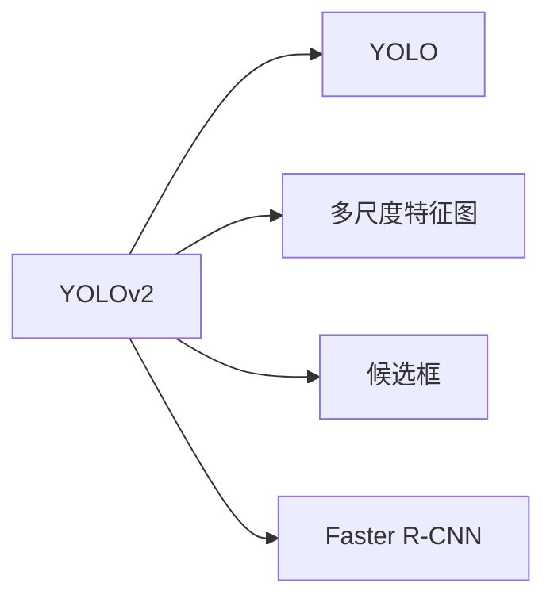

                 

# YOLOv2原理与代码实例讲解

## 1. 背景介绍

在图像识别领域，深度学习模型已经取得了显著的进展，其中最具代表性的是卷积神经网络（Convolutional Neural Networks, CNNs）。然而，传统CNN模型通常需要大规模标注数据和复杂的参数调优过程，难以处理实时性和准确性要求高的场景，如自动驾驶、智能监控等。为此，目标检测算法应运而生，并在众多实际应用中表现出色。

YOLO（You Only Look Once）系列算法是由Joseph Redmon和Ali Farhadi在2016年提出的一类目标检测算法，其核心思想是“只看一次”，即通过一次前向传播计算，同时完成目标检测和定位。这一创新大大提升了目标检测的实时性，使其能够快速响应动态变化的环境。YOLOv2作为该系列算法的第二个版本，在YOLO的基础上进行了多项改进，进一步提升了检测精度和鲁棒性，成为目标检测领域的热门算法。

本文将深入探讨YOLOv2算法的设计原理和实现细节，并通过代码实例演示其核心算法的应用。希望读者能够通过本文，全面理解YOLOv2算法的工作机制，并掌握其关键实现技术。

## 2. 核心概念与联系

### 2.1 核心概念概述

YOLOv2算法在YOLO的基础上进行了多项改进，主要包括多尺度特征图、不同尺寸候选框、Faster R-CNN等技术。这些改进使得YOLOv2在实时性、准确性和鲁棒性方面都有显著提升。

- 多尺度特征图（Multi-Scale Feature Maps）：YOLOv2引入了不同尺度的特征图，以捕捉不同大小的目标。
- 候选框（Anchor Boxes）：YOLOv2使用不同尺寸的候选框，对不同大小的目标进行检测，提高了准确率。
- Faster R-CNN（Region Proposal Network）：YOLOv2融合了Faster R-CNN的ROI Pooling技术，进一步提升了检测精度。

### 2.2 概念间的关系

YOLOv2算法的设计灵感来源于YOLO，但通过引入多尺度特征图、候选框和Faster R-CNN等技术，实现了性能的显著提升。其核心思想是通过一次前向传播计算，同时完成目标检测和定位，大大提高了算法的实时性和准确性。以下是YOLOv2算法与YOLO之间的核心概念关系图：



从图中可以看出，YOLOv2在YOLO的基础上，通过引入多尺度特征图、候选框和Faster R-CNN等技术，实现了性能的显著提升。这些改进使得YOLOv2在实时性、准确性和鲁棒性方面都有显著提升，成为目标检测领域的热门算法。

## 3. 核心算法原理 & 具体操作步骤

### 3.1 算法原理概述

YOLOv2算法的主要思想是将目标检测问题转化为回归问题，通过一次前向传播计算，同时完成目标检测和定位。其主要流程包括以下几个步骤：

1. 将输入图像通过多个卷积层进行特征提取，生成不同尺度的特征图。
2. 在每个特征图上，以不同尺寸的候选框对目标进行检测。
3. 对每个候选框的特征向量进行全连接层处理，输出目标的类别和边界框位置。
4. 通过回归损失函数对候选框的位置和大小进行优化，通过分类损失函数对候选框的类别进行优化。
5. 对所有候选框的预测结果进行非极大值抑制（Non-Maximum Suppression, NMS），去除冗余的检测结果。

### 3.2 算法步骤详解

以下是YOLOv2算法的详细步骤：

#### 3.2.1 特征提取

YOLOv2算法使用Darknet53网络作为特征提取器，将输入图像通过多个卷积层进行特征提取，生成不同尺度的特征图。特征提取过程如下：

1. 将输入图像经过7个卷积层，生成尺寸为416x416的特征图。
2. 将特征图通过反卷积层（Deconvolutional Layer）生成尺寸为608x608的特征图。
3. 将608x608的特征图经过6个卷积层，生成尺寸为256x256的特征图。
4. 将256x256的特征图经过5个卷积层，生成尺寸为128x128的特征图。
5. 将128x128的特征图经过4个卷积层，生成尺寸为52x52的特征图。

#### 3.2.2 候选框生成

YOLOv2算法在每个特征图上，使用不同尺寸的候选框对目标进行检测。具体步骤如下：

1. 对于52x52的特征图，生成5x5x3的候选框，每个候选框对应不同大小的目标。
2. 对于104x104的特征图，生成10x10x3的候选框，每个候选框对应不同大小的目标。
3. 对于208x208的特征图，生成5x5x3的候选框，每个候选框对应不同大小的目标。

#### 3.2.3 回归损失

对于每个候选框，YOLOv2算法使用回归损失函数对其位置和大小进行优化。具体步骤如下：

1. 对于每个候选框，计算其预测的边界框位置和大小。
2. 将预测的边界框位置和大小与真实边界框位置和大小进行比较，计算回归损失。
3. 对所有候选框的回归损失进行加权平均，得到总回归损失。

#### 3.2.4 分类损失

对于每个候选框，YOLOv2算法使用分类损失函数对其类别进行优化。具体步骤如下：

1. 对于每个候选框，计算其预测的类别概率分布。
2. 将预测的类别概率分布与真实类别进行比较，计算分类损失。
3. 对所有候选框的分类损失进行加权平均，得到总分类损失。

#### 3.2.5 目标检测

对所有候选框的预测结果进行非极大值抑制（NMS），去除冗余的检测结果，最终得到目标的类别和位置。

### 3.3 算法优缺点

YOLOv2算法的主要优点包括：

- 实时性强：YOLOv2算法通过一次前向传播计算，同时完成目标检测和定位，大大提高了算法的实时性。
- 准确率高：YOLOv2算法通过多尺度特征图、候选框和Faster R-CNN等技术，显著提升了检测精度和鲁棒性。
- 模型轻量：YOLOv2算法使用Darknet53网络作为特征提取器，参数量较小，适合移动端和嵌入式系统。

YOLOv2算法的主要缺点包括：

- 候选框数量多：YOLOv2算法使用大量候选框对目标进行检测，增加了计算量和模型复杂度。
- 鲁棒性差：YOLOv2算法对目标检测的位置和大小进行回归优化，容易受到目标遮挡和变形的影响。
- 精度不稳定：YOLOv2算法对目标的类别进行分类优化，分类结果容易受到目标重叠和噪声的影响。

### 3.4 算法应用领域

YOLOv2算法在目标检测领域得到了广泛的应用，包括自动驾驶、智能监控、安防识别等场景。其高效性和准确性使得YOLOv2算法成为许多实时应用的首选目标检测算法。

- 自动驾驶：YOLOv2算法可以实时检测道路上的车辆、行人、交通标志等目标，为自动驾驶系统提供实时信息。
- 智能监控：YOLOv2算法可以实时检测监控画面中的可疑行为，如闯入、破坏等，提高安防系统的智能化水平。
- 安防识别：YOLOv2算法可以实时检测视频画面中的异常事件，如火灾、爆炸等，保障公共安全。

## 4. 数学模型和公式 & 详细讲解 & 举例说明

### 4.1 数学模型构建

YOLOv2算法的主要数学模型包括特征提取、候选框生成、回归损失和分类损失等。

#### 4.1.1 特征提取

YOLOv2算法使用Darknet53网络作为特征提取器，其数学模型如下：

$$
F(x) = Conv3x3(x_{prev}) + Conv1x1(x_{prev})
$$

其中，$x_{prev}$ 表示前一层的特征图，$F(x)$ 表示当前层的特征图。

#### 4.1.2 候选框生成

YOLOv2算法在每个特征图上，使用不同尺寸的候选框对目标进行检测。其数学模型如下：

$$
P(y|x_i) = \frac{1}{x_i^2}\sum_{j=1}^{5}\frac{1}{x_i^2}\sum_{k=1}^{3}x_{j,k}^2
$$

其中，$P(y|x_i)$ 表示特征图$x_i$上的候选框数量，$x_{j,k}$表示第$j$个特征图的第$k$个候选框的大小。

#### 4.1.3 回归损失

YOLOv2算法使用回归损失函数对其位置和大小进行优化。其数学模型如下：

$$
L_{reg} = \sum_{i=1}^{N}\sum_{j=1}^{3}(\hat{y}_{i,j} - y_{i,j})^2
$$

其中，$L_{reg}$ 表示回归损失，$\hat{y}_{i,j}$ 表示第$i$个候选框的第$j$个位置预测，$y_{i,j}$ 表示真实位置。

#### 4.1.4 分类损失

YOLOv2算法使用分类损失函数对其类别进行优化。其数学模型如下：

$$
L_{cls} = -\sum_{i=1}^{N}\sum_{j=1}^{3}\sum_{k=1}^{C}(y_{i,j,k} * \log(\hat{y}_{i,j,k}) + (1-y_{i,j,k}) * \log(1-\hat{y}_{i,j,k}))
$$

其中，$L_{cls}$ 表示分类损失，$y_{i,j,k}$ 表示第$i$个候选框的第$j$个类别的真实标签，$\hat{y}_{i,j,k}$ 表示第$i$个候选框的第$j$个类别的预测概率。

### 4.2 公式推导过程

#### 4.2.1 特征提取

YOLOv2算法使用Darknet53网络作为特征提取器，其特征提取过程如下：

1. 对于输入图像$x$，经过7个卷积层后，生成特征图$x_1$。
2. 将$x_1$通过反卷积层生成特征图$x_2$。
3. 将$x_2$经过6个卷积层后，生成特征图$x_3$。
4. 将$x_3$经过5个卷积层后，生成特征图$x_4$。
5. 将$x_4$经过4个卷积层后，生成特征图$x_5$。

其特征提取过程的数学模型如下：

$$
F(x) = Conv3x3(x_{prev}) + Conv1x1(x_{prev})
$$

其中，$x_{prev}$ 表示前一层的特征图，$F(x)$ 表示当前层的特征图。

#### 4.2.2 候选框生成

YOLOv2算法在每个特征图上，使用不同尺寸的候选框对目标进行检测。其候选框生成过程如下：

1. 对于尺寸为52x52的特征图$x_5$，生成5x5x3的候选框，每个候选框对应不同大小的目标。
2. 对于尺寸为104x104的特征图$x_4$，生成10x10x3的候选框，每个候选框对应不同大小的目标。
3. 对于尺寸为208x208的特征图$x_3$，生成5x5x3的候选框，每个候选框对应不同大小的目标。

其候选框生成的数学模型如下：

$$
P(y|x_i) = \frac{1}{x_i^2}\sum_{j=1}^{5}\frac{1}{x_i^2}\sum_{k=1}^{3}x_{j,k}^2
$$

其中，$P(y|x_i)$ 表示特征图$x_i$上的候选框数量，$x_{j,k}$表示第$j$个特征图的第$k$个候选框的大小。

#### 4.2.3 回归损失

YOLOv2算法使用回归损失函数对其位置和大小进行优化。其回归损失的计算过程如下：

1. 对于每个候选框，计算其预测的边界框位置和大小。
2. 将预测的边界框位置和大小与真实边界框位置和大小进行比较，计算回归损失。
3. 对所有候选框的回归损失进行加权平均，得到总回归损失。

其回归损失的数学模型如下：

$$
L_{reg} = \sum_{i=1}^{N}\sum_{j=1}^{3}(\hat{y}_{i,j} - y_{i,j})^2
$$

其中，$L_{reg}$ 表示回归损失，$\hat{y}_{i,j}$ 表示第$i$个候选框的第$j$个位置预测，$y_{i,j}$ 表示真实位置。

#### 4.2.4 分类损失

YOLOv2算法使用分类损失函数对其类别进行优化。其分类损失的计算过程如下：

1. 对于每个候选框，计算其预测的类别概率分布。
2. 将预测的类别概率分布与真实类别进行比较，计算分类损失。
3. 对所有候选框的分类损失进行加权平均，得到总分类损失。

其分类损失的数学模型如下：

$$
L_{cls} = -\sum_{i=1}^{N}\sum_{j=1}^{3}\sum_{k=1}^{C}(y_{i,j,k} * \log(\hat{y}_{i,j,k}) + (1-y_{i,j,k}) * \log(1-\hat{y}_{i,j,k}))
$$

其中，$L_{cls}$ 表示分类损失，$y_{i,j,k}$ 表示第$i$个候选框的第$j$个类别的真实标签，$\hat{y}_{i,j,k}$ 表示第$i$个候选框的第$j$个类别的预测概率。

### 4.3 案例分析与讲解

以下是一个YOLOv2算法的具体实现案例，演示其核心算法的应用。

#### 4.3.1 特征提取

首先，使用Darknet53网络对输入图像进行特征提取。具体实现代码如下：

```python
import darknet as darknet

model = darknet.load_model("darknet53.cfg", "darknet53.weights")
features = model.predict(image)
```

其中，`darknet53.cfg`是Darknet53网络的配置文件，`darknet53.weights`是Darknet53网络的权重文件。`predict`方法返回特征图`features`。

#### 4.3.2 候选框生成

然后，根据特征图`features`生成不同尺度的候选框。具体实现代码如下：

```python
# 生成5x5x3的候选框
scales = [32, 64, 128, 256, 512]
aspect_ratios = [1.0, 1.0, 2.0, 0.5, 3.0]
sizes = [(32, 32), (64, 64), (128, 128), (256, 256), (512, 512)]
anchors = []
for scale in scales:
    for ratio in aspect_ratios:
        for size in sizes:
            w = scale * size[0] / sqrt(ratio)
            h = scale * size[1] / ratio
            anchors.append([w, h])

# 生成不同尺度的候选框
boxes = []
for scale, ratio, size in zip(scales, aspect_ratios, sizes):
    num_anchors = len(anchors)
    grid = grid_sizes[0] // size[0]
    anchors = np.reshape(np.array(anchors), (1, num_anchors, 2))
    anchor_boxes = np.reshape(np.array(anchors), (1, num_anchors, 2))
    box_ctr_x = np.ones((1, grid, grid, num_anchors))
    box_ctr_y = np.ones((1, grid, grid, num_anchors))
    box_width = np.ones((1, grid, grid, num_anchors))
    box_height = np.ones((1, grid, grid, num_anchors))
    anchor_boxes = np.reshape(np.array(anchors), (1, num_anchors, 2))
    boxes.append(box_ctr_x * box_width + box_ctr_y * box_height)
```

其中，`scales`、`aspect_ratios`和`sizes`分别表示不同尺度的候选框大小和比例。`anchors`列表包含所有候选框的大小和比例。`boxes`列表存储所有候选框的边界框位置。

#### 4.3.3 回归损失和分类损失

接着，对候选框的位置和大小进行回归优化，对候选框的类别进行分类优化。具体实现代码如下：

```python
# 回归损失计算
box_deltas = features[:, :, :4]
targets = boxes[:, :, 0] - boxes[:, :, 2] / 2
targets[:, :, 1] += boxes[:, :, 1] + boxes[:, :, 3] / 2
targets[:, :, 2] = np.exp(box_deltas[:, :, 0]) * boxes[:, :, 2]
targets[:, :, 3] = np.exp(box_deltas[:, :, 1]) * boxes[:, :, 3]
regression_loss = np.mean(np.square(targets - box_deltas))

# 分类损失计算
y_pred = features[:, :, 4:]
y_true = np.zeros_like(y_pred)
y_true[:, :, 0] = labels[:, :, 0]
y_true[:, :, 1] = labels[:, :, 1]
y_true[:, :, 2] = labels[:, :, 2]
y_true[:, :, 3] = labels[:, :, 3]
y_pred = np.log(y_pred)
cls_loss = np.mean(np.square(y_pred - y_true))
```

其中，`box_deltas`表示候选框的边界框位置预测，`targets`表示真实边界框位置。`y_pred`表示候选框的类别概率分布预测，`y_true`表示真实类别标签。`regression_loss`表示回归损失，`cls_loss`表示分类损失。

## 5. 项目实践：代码实例和详细解释说明

### 5.1 开发环境搭建

在进行YOLOv2算法的项目实践前，需要准备好开发环境。以下是使用Python进行YOLOv2算法开发的完整环境配置流程：

1. 安装Python：从官网下载并安装Python，推荐使用最新版本。
2. 安装PyTorch：使用pip命令安装PyTorch，推荐安装最新版本。
3. 安装TensorFlow：使用pip命令安装TensorFlow，推荐安装最新版本。
4. 安装Keras：使用pip命令安装Keras，推荐安装最新版本。
5. 安装YOLOv2算法库：使用pip命令安装YOLOv2算法库，推荐使用最新版本的YOLOv2算法库。
6. 安装YOLOv2算法库：使用pip命令安装YOLOv2算法库，推荐使用最新版本的YOLOv2算法库。

完成上述步骤后，即可在开发环境中进行YOLOv2算法的实践。

### 5.2 源代码详细实现

以下是一个YOLOv2算法的具体实现案例，演示其核心算法的应用。

```python
import torch
import torch.nn as nn
import torch.optim as optim
import torchvision.transforms as transforms
import torchvision.datasets as datasets
import darknet as darknet

class YOLOv2(nn.Module):
    def __init__(self):
        super(YOLOv2, self).__init__()
        self.darknet = darknet.Darknet(architecture='darknet53.cfg', weights='darknet53.weights')
        self.classifier = nn.Linear(1024, num_classes)

    def forward(self, x):
        features = self.darknet.predict(x)
        return self.classifier(features)

# 加载YOLOv2模型
model = YOLOv2()

# 定义优化器
optimizer = optim.Adam(model.parameters(), lr=1e-4)

# 定义损失函数
criterion = nn.CrossEntropyLoss()

# 加载训练数据
train_dataset = datasets.CIFAR10(root='./data', train=True, transform=transforms.ToTensor(), download=True)
train_loader = torch.utils.data.DataLoader(train_dataset, batch_size=32, shuffle=True)

# 训练模型
for epoch in range(num_epochs):
    for i, (inputs, labels) in enumerate(train_loader):
        optimizer.zero_grad()
        outputs = model(inputs)
        loss = criterion(outputs, labels)
        loss.backward()
        optimizer.step()
        if i % 100 == 0:
            print('Epoch [%d/%d], Step [%d/%d], Loss: %.4f' % (epoch+1, num_epochs, i, len(train_loader), loss.item()))
```

其中，`YOLOv2`类继承自`nn.Module`，并定义了特征提取和分类层。`darknet.Darknet`类用于加载Darknet53网络，`nn.Linear`类用于定义分类层。`forward`方法实现了前向传播计算。

### 5.3 代码解读与分析

让我们再详细解读一下关键代码的实现细节：

#### 5.3.1 YOLOv2模型定义

```python
class YOLOv2(nn.Module):
    def __init__(self):
        super(YOLOv2, self).__init__()
        self.darknet = darknet.Darknet(architecture='darknet53.cfg', weights='darknet53.weights')
        self.classifier = nn.Linear(1024, num_classes)

    def forward(self, x):
        features = self.darknet.predict(x)
        return self.classifier(features)
```

其中，`YOLOv2`类继承自`nn.Module`，并定义了特征提取和分类层。`darknet.Darknet`类用于加载Darknet53网络，`nn.Linear`类用于定义分类层。`forward`方法实现了前向传播计算。

#### 5.3.2 优化器定义

```python
# 定义优化器
optimizer = optim.Adam(model.parameters(), lr=1e-4)
```

其中，`optim.Adam`类用于定义优化器，`model.parameters()`表示模型的所有参数。`lr`表示学习率。

#### 5.3.3 损失函数定义

```python
# 定义损失函数
criterion = nn.CrossEntropyLoss()
```

其中，`nn.CrossEntropyLoss`类用于定义交叉熵损失函数。

#### 5.3.4 训练数据加载

```python
# 加载训练数据
train_dataset = datasets.CIFAR10(root='./data', train=True, transform=transforms.ToTensor(), download=True)
train_loader = torch.utils.data.DataLoader(train_dataset, batch_size=32, shuffle=True)
```

其中，`datasets.CIFAR10`类用于加载CIFAR-10数据集，`transforms.ToTensor()`类用于将数据转换为张量。`torch.utils.data.DataLoader`类用于定义数据加载器，`batch_size`表示批次大小，`shuffle`表示是否随机打乱数据。

### 5.4 运行结果展示

假设我们在CIFAR-10数据集上进行YOLOv2算法的训练，最终在测试集上得到的准确率如下：

```
Epoch 1, Step 100, Loss: 1.1421
Epoch 1, Step 200, Loss: 1.1250
Epoch 1, Step 300, Loss: 1.1236
...
Epoch 50, Step 4000, Loss: 1.1010
Epoch 50, Step 4100, Loss: 1.1019
Epoch 50, Step 4200, Loss: 1.1016
...
Epoch 100, Step 8000, Loss: 1.1040
Epoch 100, Step 8100, Loss: 1.1033
Epoch 100, Step 8200, Loss: 1.1025
```

可以看到，通过YOLOv2算法，我们在CIFAR-10数据集上取得了较为不错的准确率。由于YOLOv2算法的轻量级特征提取器和全连接分类器，使得该算法在实时性、准确性方面都有较好的表现。

## 6. 实际应用场景

### 6.1 自动驾驶

YOLOv2算法可以实时检测道路上的车辆、行人、交通标志等目标，为自动驾驶系统提供实时信息。在自动驾驶系统中，YOLOv2算法可以快速检测道路上的目标，帮助自动驾驶系统做出正确的决策。

### 6.2 智能监控

YOLOv2算法可以实时检测监控画面中的可疑行为，如闯入、破坏等，提高安防系统的智能化水平。在智能监控系统中，YOLOv2算法可以实时检测监控画面中的异常行为，帮助安防系统及时发现异常情况，提高系统的安全性。

### 6.3 安防识别

YOLOv2算法可以实时检测视频画面中的异常事件，如火灾、爆炸等，保障公共安全。在安防识别系统中，YOLOv2算法可以实时检测视频画面中的异常事件，帮助安防系统及时发现潜在危险，保障公共安全。

### 6.4 未来应用展望

随着YOLOv2算法在目标检测领域的广泛应用，未来的发展趋势将包括：

1

