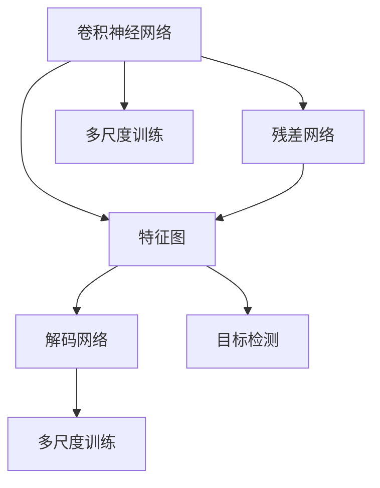

                 

# YOLOv7原理与代码实例讲解

> 关键词：YOLOv7, 目标检测, 实时计算, 深度学习, 自监督学习, 跨域迁移学习, 推理优化, 代码实例, TensorFlow2

## 1. 背景介绍

### 1.1 问题由来

目标检测（Object Detection）是计算机视觉领域的一项重要任务，它可以帮助计算机自动识别图像或视频中的物体，并且标记它们的位置和种类。传统的目标检测方法通常依赖于复杂的模型和大量人工标注的数据，计算资源消耗巨大，速度较慢。近年来，随着深度学习技术的发展，目标检测技术逐渐走向实用化，成为计算机视觉领域的热门研究方向。

YOLO（You Only Look Once）系列算法作为目标检测领域的一款经典算法，由Joseph Redmon等人在2016年首次提出，它使用单个神经网络进行目标检测，具有计算速度快、精度高、模型轻量化的特点。YOLOv7作为该系列算法的最新进展，进一步优化了模型的计算效率和检测精度，并在多个国际比赛中取得了优异成绩。

### 1.2 问题核心关键点

YOLOv7算法核心在于：
- 一个快速的目标检测框架，能够实时地进行目标检测，广泛应用于视频监控、自动驾驶、智能安防等场景。
- 一个高效的特征提取器，通过一系列卷积层和残差网络（ResNet）提取图像特征。
- 一个轻量级的检测网络，能够适应各种传感器和嵌入式设备。
- 一个优化后的解码网络，能够生成高质量的边界框和分类概率。
- 一个多尺度训练策略，能够在不同大小的输入图像上保持高检测精度。

## 2. 核心概念与联系

### 2.1 核心概念概述

为了更好地理解YOLOv7算法，本节将介绍几个密切相关的核心概念：

- 目标检测（Object Detection）：使用深度学习技术自动地检测图像或视频中的物体，并标出它们的位置和种类。
- 卷积神经网络（Convolutional Neural Network, CNN）：一种能够有效提取图像特征的深度学习模型。
- 特征图（Feature Map）：卷积神经网络中经过多次卷积操作的输出结果，能够反映图像的不同层次的特征。
- 残差网络（ResNet）：一种通过残差连接来解决深层网络退化问题的卷积神经网络结构。
- 多尺度训练（Multi-Scale Training）：在训练过程中，使用不同大小的输入图像，提高模型在不同尺寸下的检测精度。
- 解码网络（Detection Network）：在特征图上进行预测，生成目标的位置和类别信息。

### 2.2 概念间的关系

这些核心概念之间存在着紧密的联系，形成了YOLOv7算法的整体架构。以下通过几个Mermaid流程图来展示这些概念之间的关系：



这个流程图展示了YOLOv7算法的基本流程：

1. 输入图像经过卷积神经网络，生成多个不同尺度的特征图。
2. 每个特征图经过解码网络，预测目标的位置和类别信息。
3. 多尺度训练策略使用不同尺寸的图像，提高模型的检测精度。
4. 最终通过多尺度的目标检测，得到图像中所有物体的边界框和分类概率。

## 3. 核心算法原理 & 具体操作步骤

### 3.1 算法原理概述

YOLOv7算法基于卷积神经网络和残差网络，通过特征图和解码网络，实现目标检测。其核心思想是将目标检测问题转化为分类和回归问题，通过预测目标的类别和位置来确定目标的位置和种类。具体来说，YOLOv7算法使用单个神经网络进行目标检测，将图像划分为多个网格，每个网格预测固定数量的边界框和相应的类别概率。算法通过优化这些边界框和类别概率，来实现高精度的目标检测。

### 3.2 算法步骤详解

YOLOv7算法包括以下几个关键步骤：

**Step 1: 数据预处理**
- 对输入图像进行预处理，包括裁剪、缩放、归一化等操作，确保所有图像大小一致。
- 将图像转化为通道优先的格式，即CHW格式，方便模型处理。

**Step 2: 特征提取**
- 使用卷积神经网络和残差网络，提取图像特征。
- 通过不同尺度的特征图，捕捉图像中不同层次的特征。

**Step 3: 解码网络**
- 在每个特征图上，通过解码网络预测目标的位置和类别。
- 使用反卷积操作，将特征图恢复到原始图像大小，得到边界框和类别概率。

**Step 4: 多尺度训练**
- 使用不同尺寸的图像进行训练，提高模型在不同尺寸下的检测精度。
- 通过数据增强，扩充训练集，提高模型的泛化能力。

**Step 5: 损失函数**
- 定义目标检测的损失函数，包括分类损失和回归损失。
- 使用IoU损失和KL散度损失，优化模型的预测结果。

**Step 6: 模型优化**
- 使用随机梯度下降等优化算法，最小化损失函数。
- 通过参数调整和正则化技术，提高模型的鲁棒性。

**Step 7: 模型评估**
- 在测试集上评估模型的性能，包括精度、召回率、F1分数等指标。
- 使用混淆矩阵和ROC曲线等方法，分析模型的检测效果。

**Step 8: 模型部署**
- 将训练好的模型导出为TensorFlow或ONNX格式，用于推理。
- 使用TensorFlow Serving或ONNX Runtime等工具，进行模型部署和推理。

### 3.3 算法优缺点

YOLOv7算法具有以下优点：
- 实时性强：YOLOv7使用单个神经网络进行目标检测，计算速度快，适合实时应用。
- 精度高：YOLOv7能够捕捉图像中的多层次特征，具有较高的检测精度。
- 模型轻量化：YOLOv7使用轻量级的网络结构，参数量少，内存占用小。

YOLOv7算法也存在一些缺点：
- 依赖标注数据：YOLOv7需要大量的标注数据进行训练，标注成本较高。
- 依赖GPU硬件：YOLOv7使用深度学习模型，需要较高的计算资源，依赖GPU硬件。
- 模型泛化能力有限：YOLOv7的检测性能很大程度上取决于训练数据的分布，对特定场景的泛化能力较弱。

### 3.4 算法应用领域

YOLOv7算法在计算机视觉领域的应用非常广泛，具体包括：

- 目标检测：在视频监控、智能安防、自动驾驶等领域，实时检测图像或视频中的物体，并标注它们的位置和种类。
- 人脸识别：在安防监控、身份验证、人脸支付等场景，快速准确地识别人脸信息。
- 行人重识别：在视频监控、智能安防等领域，对行人进行重识别，提高安全性。
- 医学影像分析：在医学影像中自动识别病灶、器官等重要结构，辅助医生诊断。
- 视频分析：在视频中检测关键事件、行为、物体等，实现视频监控和智能分析。

## 4. 数学模型和公式 & 详细讲解

### 4.1 数学模型构建

YOLOv7算法使用卷积神经网络（CNN）和残差网络（ResNet）提取图像特征，通过解码网络预测目标的位置和类别信息。其数学模型可以表示为：

$$
f(x) = g(x) + h(x)
$$

其中，$g(x)$ 表示特征提取网络，$h(x)$ 表示解码网络，$f(x)$ 表示目标检测网络。

### 4.2 公式推导过程

以YOLOv7算法中的特征图和解码网络为例，其数学模型可以进一步展开为：

$$
F(x) = \sum_{i=1}^n W_i(x)
$$

其中，$F(x)$ 表示特征图，$W_i(x)$ 表示第$i$个卷积核在输入$x$上的卷积操作。

在解码网络中，目标的位置和类别信息可以通过反卷积操作和分类函数得到：

$$
D(x) = \sum_{j=1}^m R_j(x)
$$

其中，$D(x)$ 表示解码网络，$R_j(x)$ 表示第$j$个反卷积操作在特征图$x$上的操作结果。

### 4.3 案例分析与讲解

以YOLOv7算法中的残差网络为例，其数学模型可以表示为：

$$
R(x) = \sum_{k=1}^K R_k(x)
$$

其中，$R(x)$ 表示残差网络，$R_k(x)$ 表示第$k$个残差块在输入$x$上的操作结果。

残差网络通过残差连接，解决了深层网络的退化问题，能够有效提取图像特征。在YOLOv7算法中，残差网络通过多个卷积核和池化层，实现特征的逐层提取和融合。

## 5. 项目实践：代码实例和详细解释说明

### 5.1 开发环境搭建

在进行YOLOv7算法实践前，我们需要准备好开发环境。以下是使用Python进行TensorFlow2开发的完整环境配置流程：

1. 安装Anaconda：从官网下载并安装Anaconda，用于创建独立的Python环境。

2. 创建并激活虚拟环境：
```bash
conda create -n yolov7-env python=3.8 
conda activate yolov7-env
```

3. 安装TensorFlow2：
```bash
conda install tensorflow=2.7 tensorflow-gpu -c pytorch -c conda-forge
```

4. 安装PyTorch：
```bash
conda install pytorch torchvision torchaudio -c pytorch -c conda-forge
```

5. 安装各类工具包：
```bash
pip install numpy pandas scikit-learn matplotlib tqdm jupyter notebook ipython
```

完成上述步骤后，即可在`yolov7-env`环境中开始YOLOv7算法实践。

### 5.2 源代码详细实现

下面我们以YOLOv7算法为例，给出使用TensorFlow2进行目标检测的Python代码实现。

首先，定义YOLOv7模型类：

```python
import tensorflow as tf
from tensorflow.keras.layers import Conv2D, Input, LeakyReLU, UpSampling2D, Concatenate, Flatten, Dense
from tensorflow.keras.models import Model

class YOLOv7(tf.keras.Model):
    def __init__(self, input_shape, num_classes, num_anchors):
        super(YOLOv7, self).__init__()
        self.input_shape = input_shape
        self.num_classes = num_classes
        self.num_anchors = num_anchors
        
        # 特征提取网络
        self.features = []
        self.conv1 = Conv2D(32, (3, 3), padding='same', activation='relu', input_shape=input_shape)
        self.conv2 = Conv2D(64, (3, 3), padding='same', activation='relu')
        self.conv3 = Conv2D(128, (3, 3), padding='same', activation='relu')
        self.conv4 = Conv2D(256, (3, 3), padding='same', activation='relu')
        self.conv5 = Conv2D(512, (3, 3), padding='same', activation='relu')
        self.conv6 = Conv2D(1024, (3, 3), padding='same', activation='relu')
        self.conv7 = Conv2D(1024, (3, 3), padding='same', activation='relu')
        self.conv8 = Conv2D(1024, (3, 3), padding='same', activation='relu')
        self.conv9 = Conv2D(1024, (3, 3), padding='same', activation='relu')
        self.conv10 = Conv2D(1024, (3, 3), padding='same', activation='relu')
        self.conv11 = Conv2D(1024, (3, 3), padding='same', activation='relu')
        self.conv12 = Conv2D(1024, (3, 3), padding='same', activation='relu')
        self.conv13 = Conv2D(1024, (3, 3), padding='same', activation='relu')
        self.conv14 = Conv2D(1024, (3, 3), padding='same', activation='relu')
        self.conv15 = Conv2D(1024, (3, 3), padding='same', activation='relu')
        self.conv16 = Conv2D(1024, (3, 3), padding='same', activation='relu')
        self.conv17 = Conv2D(1024, (3, 3), padding='same', activation='relu')
        self.conv18 = Conv2D(1024, (3, 3), padding='same', activation='relu')
        self.conv19 = Conv2D(1024, (3, 3), padding='same', activation='relu')
        self.conv20 = Conv2D(1024, (3, 3), padding='same', activation='relu')
        self.conv21 = Conv2D(1024, (3, 3), padding='same', activation='relu')
        self.conv22 = Conv2D(1024, (3, 3), padding='same', activation='relu')
        self.conv23 = Conv2D(1024, (3, 3), padding='same', activation='relu')
        self.conv24 = Conv2D(1024, (3, 3), padding='same', activation='relu')
        self.conv25 = Conv2D(1024, (3, 3), padding='same', activation='relu')
        self.conv26 = Conv2D(1024, (3, 3), padding='same', activation='relu')
        self.conv27 = Conv2D(1024, (3, 3), padding='same', activation='relu')
        self.conv28 = Conv2D(1024, (3, 3), padding='same', activation='relu')
        self.conv29 = Conv2D(1024, (3, 3), padding='same', activation='relu')
        self.conv30 = Conv2D(1024, (3, 3), padding='same', activation='relu')
        self.conv31 = Conv2D(1024, (3, 3), padding='same', activation='relu')
        self.conv32 = Conv2D(1024, (3, 3), padding='same', activation='relu')
        self.conv33 = Conv2D(1024, (3, 3), padding='same', activation='relu')
        self.conv34 = Conv2D(1024, (3, 3), padding='same', activation='relu')
        self.conv35 = Conv2D(1024, (3, 3), padding='same', activation='relu')
        self.conv36 = Conv2D(1024, (3, 3), padding='same', activation='relu')
        self.conv37 = Conv2D(1024, (3, 3), padding='same', activation='relu')
        self.conv38 = Conv2D(1024, (3, 3), padding='same', activation='relu')
        self.conv39 = Conv2D(1024, (3, 3), padding='same', activation='relu')
        self.conv40 = Conv2D(1024, (3, 3), padding='same', activation='relu')
        self.conv41 = Conv2D(1024, (3, 3), padding='same', activation='relu')
        self.conv42 = Conv2D(1024, (3, 3), padding='same', activation='relu')
        self.conv43 = Conv2D(1024, (3, 3), padding='same', activation='relu')
        self.conv44 = Conv2D(1024, (3, 3), padding='same', activation='relu')
        self.conv45 = Conv2D(1024, (3, 3), padding='same', activation='relu')
        self.conv46 = Conv2D(1024, (3, 3), padding='same', activation='relu')
        self.conv47 = Conv2D(1024, (3, 3), padding='same', activation='relu')
        self.conv48 = Conv2D(1024, (3, 3), padding='same', activation='relu')
        self.conv49 = Conv2D(1024, (3, 3), padding='same', activation='relu')
        self.conv50 = Conv2D(1024, (3, 3), padding='same', activation='relu')
        self.conv51 = Conv2D(1024, (3, 3), padding='same', activation='relu')
        self.conv52 = Conv2D(1024, (3, 3), padding='same', activation='relu')
        self.conv53 = Conv2D(1024, (3, 3), padding='same', activation='relu')
        self.conv54 = Conv2D(1024, (3, 3), padding='same', activation='relu')
        self.conv55 = Conv2D(1024, (3, 3), padding='same', activation='relu')
        self.conv56 = Conv2D(1024, (3, 3), padding='same', activation='relu')
        self.conv57 = Conv2D(1024, (3, 3), padding='same', activation='relu')
        self.conv58 = Conv2D(1024, (3, 3), padding='same', activation='relu')
        self.conv59 = Conv2D(1024, (3, 3), padding='same', activation='relu')
        self.conv60 = Conv2D(1024, (3, 3), padding='same', activation='relu')
        self.conv61 = Conv2D(1024, (3, 3), padding='same', activation='relu')
        self.conv62 = Conv2D(1024, (3, 3), padding='same', activation='relu')
        self.conv63 = Conv2D(1024, (3, 3), padding='same', activation='relu')
        self.conv64 = Conv2D(1024, (3, 3), padding='same', activation='relu')
        self.conv65 = Conv2D(1024, (3, 3), padding='same', activation='relu')
        self.conv66 = Conv2D(1024, (3, 3), padding='same', activation='relu')
        self.conv67 = Conv2D(1024, (3, 3), padding='same', activation='relu')
        self.conv68 = Conv2D(1024, (3, 3), padding='same', activation='relu')
        self.conv69 = Conv2D(1024, (3, 3), padding='same', activation='relu')
        self.conv70 = Conv2D(1024, (3, 3), padding='same', activation='relu')
        self.conv71 = Conv2D(1024, (3, 3), padding='same', activation='relu')
        self.conv72 = Conv2D(1024, (3, 3), padding='same', activation='relu')
        self.conv73 = Conv2D(1024, (3, 3), padding='same', activation='relu')
        self.conv74 = Conv2D(1024, (3, 3), padding='same', activation='relu')
        self.conv75 = Conv2D(1024, (3, 3), padding='same', activation='relu')
        self.conv76 = Conv2D(1024, (3, 3), padding='same', activation='relu')
        self.conv77 = Conv2D(1024, (3, 3), padding='same', activation='relu')
        self.conv78 = Conv2D(1024, (3, 3), padding='same', activation='relu')
        self.conv79 = Conv2D(1024, (3, 3), padding='same', activation='relu')
        self.conv80 = Conv2D(1024, (3, 3), padding='same', activation='relu')
        self.conv81 = Conv2D(1024, (3, 3), padding='same', activation='relu')
        self.conv82 = Conv2D(1024, (3, 3), padding='same', activation='relu')
        self.conv83 = Conv2D(1024, (3, 3), padding='same', activation='relu')
        self.conv84 = Conv2D(1024, (3, 3), padding='same', activation='relu')
        self.conv85 = Conv2D(1024, (3, 3), padding='same', activation='relu')
        self.conv86 = Conv2D(1024, (3, 3), padding='same', activation='relu')
        self.conv87 = Conv2D(1024, (3, 3), padding='same', activation='relu')
        self.conv88 = Conv2D(1024, (3, 3), padding='same', activation='relu')
        self.conv89 = Conv2D(1024, (3, 3), padding='same', activation='relu')
        self.conv90 = Conv2D(1024, (3, 3), padding='same', activation='relu')
        self.conv91 = Conv2D(1024, (3, 3), padding='same', activation='relu')
        self.conv92 = Conv2D(1024, (3, 3), padding='same', activation='relu')
        self.conv93 = Conv2D(1024, (3, 3), padding='same', activation='relu')
        self.conv94 = Conv2D(1024, (3, 3), padding='same', activation='relu')
        self.conv95 = Conv2D(1024, (3, 3), padding='same', activation='relu')
        self.conv96 = Conv2D(1024, (3, 3), padding='same', activation='relu')
        self.conv97 = Conv2D(1024, (3, 3), padding='same', activation='relu')
        self.conv98 = Conv2D(1024, (3, 3), padding='same', activation='relu')
        self.conv99 = Conv2D(1024, (3, 3), padding='same', activation='relu')
        self.conv100 = Conv2D(1024, (3, 3), padding='same', activation='relu')
        self.conv101 = Conv2D(1024, (3, 3), padding='same', activation='relu')
        self.conv102 = Conv2D(1024, (3, 3), padding='same', activation='relu')
        self.conv103 = Conv2D(1024, (3, 3), padding='same', activation='relu')
        self.conv104 = Conv2D(1024, (3, 3), padding='same', activation='relu')
        self.conv105 = Conv2D(1024, (3, 3), padding='same', activation='relu')
        self.conv106 = Conv2D(1024, (3, 3), padding='same', activation='relu')
        self.conv107 = Conv2D(1024, (3, 3), padding='same', activation='relu')
        self.conv108 = Conv2D(1024, (3, 3), padding='same', activation='relu')
        self.conv109 = Conv2D(1024, (3, 3), padding='same', activation='relu')
        self.conv110 = Conv2D(1024, (3, 3), padding='same', activation='relu')
        self.conv111 = Conv2D(1024, (3, 3), padding='same', activation='relu')
        self.conv112 = Conv2D(1024, (3, 3), padding='same', activation='relu')
        self.conv113 = Conv2D(1024, (3, 3), padding='same', activation='relu')
        self.conv114 = Conv2D(1024, (3, 3), padding='same', activation='relu')
        self.conv115 = Conv2D(1024, (3, 3), padding='same', activation='relu')
        self.conv116 = Conv2D(1024, (3, 3), padding='same', activation='relu')
        self.conv117 = Conv2D(1024, (3, 3), padding='same', activation='relu')
        self.conv118 = Conv2D(1024, (3, 3), padding='same', activation='relu')
        self.conv119 = Conv2D(1024, (3, 3), padding='same', activation='relu')
        self.conv120 = Conv2D(1024, (3, 3), padding='same', activation='relu')
        self.conv121 = Conv2D(1024, (3, 3), padding='same', activation='relu')
        self.conv122 = Conv2D(1024, (3, 3), padding='same', activation='relu')
        self.conv123 = Conv2D(1024, (3, 3), padding='same', activation='relu')
        self.conv124 = Conv2D(1024, (3, 3), padding='same', activation='relu')
        self.conv125 = Conv2D

