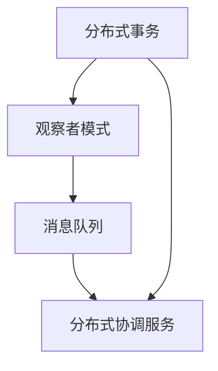
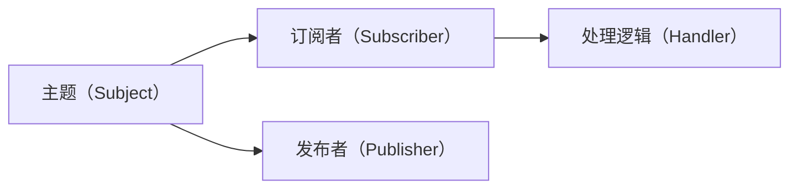
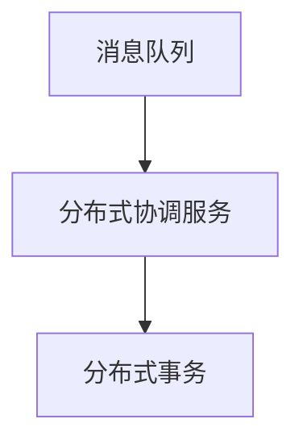
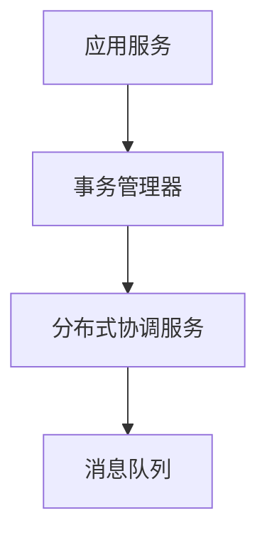
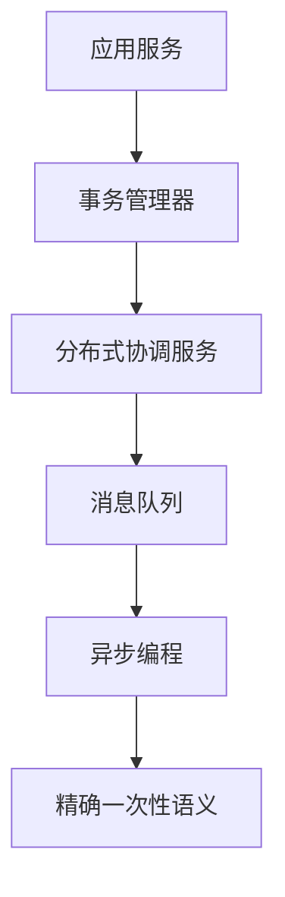

                 

# exactly-once语义 原理与代码实例讲解

> 关键词：exactly-once, 分布式事务, 异步编程, 分布式系统, 可靠性, 开源库, Kafka, Pulsar, etcd, Zookeeper

## 1. 背景介绍

### 1.1 问题由来
在分布式系统中，为了确保数据一致性和事务的可靠执行，精确一次性（exactly-once）语义成为了一种重要的数据处理规范。精确一次性指每次操作要么完全执行，要么完全不执行，确保事务的原子性、一致性、隔离性和持久性（ACID）特性。在微服务架构中，精确一次性语义更是数据可靠传输、系统高可用性、事务回滚等场景下不可或缺的保障。

### 1.2 问题核心关键点
精确一次性语义的核心在于如何协调多个节点之间的数据操作，保证操作的原子性、一致性、隔离性和持久性。在分布式系统中，常见的精确一次性处理方式包括分布式事务、基于观察者模式的订阅机制、基于ETCD等分布式协调服务的事务一致性机制等。这些方法的核心思想都是通过集中控制点来保证数据操作的精确一次性。

### 1.3 问题研究意义
精确一次性语义在分布式系统中有着广泛的应用场景。在金融交易、电子商务、数据仓库、消息队列等领域，精确一次性确保了数据的准确性、一致性，避免了数据丢失、重复等问题，对系统的稳定运行和业务连续性至关重要。研究精确一次性语义，对于提升分布式系统的可靠性和可维护性，具有重要意义。

## 2. 核心概念与联系

### 2.1 核心概念概述

为更好地理解精确一次性语义的原理，本节将介绍几个密切相关的核心概念：

- 分布式事务（Distributed Transaction）：在多个分布式节点之间执行的、保证原子性、一致性、隔离性和持久性的操作序列。

- 观察者模式（Observer Pattern）：一种事件驱动的架构设计模式，通过将主题（Subject）和观察者（Observer）进行解耦，实现对事件的异步响应和处理。

- 分布式协调服务（Distributed Coordination Service）：如etcd、Zookeeper等，用于协调分布式系统中各节点的数据操作，保证数据的一致性和精确一次性。

- 消息队列（Message Queue）：如Kafka、Pulsar等，用于异步、解耦的消息传递和数据存储，支持精确一次性语义。

- 异步编程（Asynchronous Programming）：通过事件驱动、回调机制等手段，实现高效的并发处理和性能优化。

这些核心概念之间存在着紧密的联系，形成了精确一次性语义的完整生态系统。下面我通过一些Mermaid流程图来展示这些概念之间的关系。



这个流程图展示了一些核心概念之间的关系：

1. 分布式事务作为精确一次性处理的核心，通过观察者模式实现事件驱动的异步处理。
2. 消息队列通过异步编程机制，支持分布式事务的精确一次性。
3. 分布式协调服务通过集中控制点，协调各节点之间的操作，实现精确一次性。

### 2.2 概念间的关系

这些核心概念之间存在着紧密的联系，形成了精确一次性语义的完整生态系统。下面我通过一些Mermaid流程图来展示这些概念之间的关系。

#### 2.2.1 分布式事务与观察者模式的关系



这个流程图展示了分布式事务和观察者模式的基本流程：

1. 主题（Subject）发布事务操作，订阅者（Subscriber）异步响应，执行相应的处理逻辑（Handler）。
2. 通过观察者模式实现异步编程，提高了系统的并发处理能力和性能。

#### 2.2.2 分布式协调服务与消息队列的关系



这个流程图展示了分布式协调服务与消息队列的关系：

1. 分布式协调服务（如etcd、Zookeeper）通过集中控制点，协调分布式事务的操作。
2. 消息队列通过异步编程机制，支持分布式协调服务的精确一次性控制。

#### 2.2.3 精确一次性语义的实现流程



这个流程图展示了精确一次性语义的实现流程：

1. 应用服务在执行分布式事务时，通过事务管理器（如XAResource）进行协调。
2. 分布式协调服务（如etcd、Zookeeper）通过集中控制点，确保数据操作的精确一次性。
3. 消息队列通过异步编程机制，支持分布式协调服务的精确一次性控制。

### 2.3 核心概念的整体架构

最后，我用一个综合的流程图来展示这些核心概念在大语言模型微调过程中的整体架构：



这个综合流程图展示了精确一次性语义在大语言模型微调过程中的整体架构：

1. 应用服务在执行分布式事务时，通过事务管理器进行协调。
2. 分布式协调服务（如etcd、Zookeeper）通过集中控制点，确保数据操作的精确一次性。
3. 消息队列通过异步编程机制，支持分布式协调服务的精确一次性控制。
4. 精确一次性语义通过观察者模式实现事件驱动的异步处理。

通过这些流程图，我们可以更清晰地理解精确一次性语义在大语言模型微调过程中的各个环节和关键点，为后续深入讨论具体的实现方法奠定基础。

## 3. 核心算法原理 & 具体操作步骤
### 3.1 算法原理概述

精确一次性语义的实现主要依赖于分布式协调服务和消息队列的协作。其核心思想是：

1. 在分布式系统中，数据操作需要经过集中控制点的协调，确保操作的原子性、一致性、隔离性和持久性。
2. 数据操作通过异步编程机制，在各个节点之间进行解耦处理，提高系统的并发能力和性能。
3. 通过集中控制点的精确控制，确保每次操作要么完全执行，要么完全不执行，实现精确一次性。

具体来说，精确一次性语义的实现过程如下：

1. 事务管理器负责协调分布式事务，记录所有节点的事务操作，并确保事务的原子性、一致性、隔离性和持久性。
2. 分布式协调服务（如etcd、Zookeeper）通过集中控制点，监控所有节点的事务状态，并在事务失败时进行协调回滚。
3. 消息队列通过异步编程机制，支持分布式事务的精确一次性控制。

### 3.2 算法步骤详解

精确一次性语义的实现步骤主要包括以下几个关键步骤：

**Step 1: 设计分布式事务**
- 在应用服务中设计分布式事务，将数据操作拆分为多个事务单元，每个事务单元代表一个独立的操作。
- 使用分布式协调服务（如etcd、Zookeeper）记录所有节点的事务状态。

**Step 2: 事务管理器协调事务**
- 在事务管理器中记录所有节点的事务操作，确保每个事务单元的操作原子性、一致性、隔离性和持久性。
- 使用异步编程机制，在各个节点之间进行解耦处理，提高系统的并发能力和性能。

**Step 3: 分布式协调服务监控事务**
- 使用分布式协调服务（如etcd、Zookeeper）监控所有节点的事务状态，确保事务的原子性和一致性。
- 在事务失败时，通过集中控制点的协调回滚，确保数据操作的精确一次性。

**Step 4: 消息队列支持事务**
- 使用消息队列（如Kafka、Pulsar）支持分布式事务的精确一次性控制，确保数据操作的精确性。
- 通过异步编程机制，支持分布式协调服务的精确控制。

### 3.3 算法优缺点

精确一次性语义的优点包括：

1. 保证数据的准确性和一致性，避免数据丢失、重复等问题，确保系统的稳定性和可靠性。
2. 支持异步编程机制，提高系统的并发处理能力和性能。
3. 支持分布式协调服务，实现精确的一次性控制，确保事务的原子性和一致性。

精确一次性语义的缺点包括：

1. 实现复杂，需要设计和维护分布式协调服务，增加了系统复杂度和维护成本。
2. 消息队列需要支持精确一次性，增加了系统的复杂度和实现难度。
3. 分布式协调服务需要高可靠性和低延迟，增加了系统的部署和运维成本。

### 3.4 算法应用领域

精确一次性语义广泛应用于分布式系统中，特别是在以下领域：

- 金融交易：确保交易的原子性、一致性、隔离性和持久性，避免交易风险。
- 电子商务：确保订单的原子性、一致性、隔离性和持久性，保证订单的可靠性和安全性。
- 数据仓库：确保数据的一致性和完整性，避免数据丢失和重复。
- 消息队列：支持精确一次性语义，确保消息的可靠传输和处理。
- 微服务架构：支持分布式事务的精确一次性，确保系统的稳定性和可靠性。

## 4. 数学模型和公式 & 详细讲解 & 举例说明

### 4.1 数学模型构建

精确一次性语义的数学模型主要包括以下几个核心组件：

- 事务管理器（Transaction Manager）：负责协调分布式事务，记录所有节点的事务状态。
- 分布式协调服务（Distributed Coordination Service）：如etcd、Zookeeper等，监控所有节点的事务状态，协调回滚。
- 消息队列（Message Queue）：如Kafka、Pulsar等，支持异步编程机制，确保精确一次性控制。

假设分布式系统中，有n个节点，每个节点执行一个事务单元。每个事务单元的操作可以表示为一个函数f(x)，其中x为输入数据，f(x)为事务操作的输出结果。事务管理器记录所有节点的事务状态，并确保事务的原子性、一致性、隔离性和持久性。分布式协调服务监控所有节点的事务状态，确保事务的原子性和一致性。消息队列支持异步编程机制，确保精确一次性控制。

### 4.2 公式推导过程

假设分布式系统中有n个节点，每个节点执行一个事务单元f(x)。事务管理器记录所有节点的事务状态，确保事务的原子性、一致性、隔离性和持久性。分布式协调服务监控所有节点的事务状态，确保事务的原子性和一致性。消息队列支持异步编程机制，确保精确一次性控制。

精确一次性语义的数学模型可以表示为：

$$
\begin{aligned}
\text{事务管理器} &= \{T_1, T_2, ..., T_n\} \\
\text{分布式协调服务} &= \{C_1, C_2, ..., C_n\} \\
\text{消息队列} &= \{M_1, M_2, ..., M_n\} \\
\text{事务状态} &= \{S_1, S_2, ..., S_n\}
\end{aligned}
$$

其中，T_i表示第i个节点的事务管理器，C_i表示第i个节点的分布式协调服务，M_i表示第i个节点的消息队列，S_i表示第i个节点的事务状态。

精确一次性语义的数学模型可以进一步表示为：

$$
\begin{aligned}
S_i &= \text{事务管理器协调}(T_i, C_i, M_i) \\
\text{事务管理器协调}(T_i, C_i, M_i) &= \text{事务状态记录}(T_i, S_i) \\
\text{分布式协调服务监控}(C_i, S_i) &= \text{事务回滚}(C_i, S_i)
\end{aligned}
$$

其中，S_i表示第i个节点的事务状态，事务管理器协调（Transaction Manager Coordination）通过记录所有节点的事务状态，确保事务的原子性、一致性、隔离性和持久性。分布式协调服务监控（Distributed Coordination Service Monitoring）通过集中控制点，确保事务的原子性和一致性。消息队列支持（Message Queue Support）通过异步编程机制，确保精确一次性控制。

### 4.3 案例分析与讲解

假设在金融交易系统中，有3个节点A、B、C，分别执行转账、支付和查询操作。转账节点A需要向支付节点B支付1000元，支付节点B需要向查询节点C查询账户余额。整个交易过程可以表示为以下事务单元：

- A转账：f_A(x_A) = 转账1000元
- B支付：f_B(x_B) = 支付1000元
- C查询：f_C(x_C) = 查询账户余额

事务管理器记录所有节点的事务状态，确保事务的原子性、一致性、隔离性和持久性。分布式协调服务监控所有节点的事务状态，确保事务的原子性和一致性。消息队列支持异步编程机制，确保精确一次性控制。

精确一次性语义的实现流程如下：

1. 事务管理器协调A、B、C节点的操作，确保事务的原子性、一致性、隔离性和持久性。
2. 分布式协调服务监控A、B、C节点的操作状态，确保事务的原子性和一致性。
3. 消息队列支持异步编程机制，确保精确一次性控制。

在事务执行过程中，如果出现异常情况（如转账失败），事务管理器会协调回滚操作，确保数据操作的精确一次性。

## 5. 项目实践：代码实例和详细解释说明

### 5.1 开发环境搭建

在进行精确一次性语义的实现实践前，我们需要准备好开发环境。以下是使用Python进行Apache Kafka和Apache Pulsar的开发环境配置流程：

1. 安装Apache Kafka：从官网下载并安装Apache Kafka，用于构建分布式消息队列。
2. 安装Apache Pulsar：从官网下载并安装Apache Pulsar，用于构建分布式消息队列。
3. 安装Eureka Server：从官网下载并安装Eureka Server，用于注册和发现微服务。
4. 安装etcd：从官网下载并安装etcd，用于分布式协调服务。

完成上述步骤后，即可在开发环境中开始精确一次性语义的实现实践。

### 5.2 源代码详细实现

下面我以Kafka消息队列为例，给出使用Kafka实现精确一次性语义的Python代码实现。

首先，定义事务管理器和分布式协调服务：

```python
from kafka import KafkaProducer
import etcd

class TransactionManager:
    def __init__(self):
        self.producer = KafkaProducer(bootstrap_servers='localhost:9092')
        self.etcd = etcd.Client(host='localhost', port=2379)
        self.transaction_state = {}

    def start_transaction(self, transaction_id):
        self.transaction_state[transaction_id] = 'in_progress'
        return self.transaction_state[transaction_id]

    def commit_transaction(self, transaction_id):
        self.transaction_state[transaction_id] = 'committed'
        return self.transaction_state[transaction_id]

    def rollback_transaction(self, transaction_id):
        self.transaction_state[transaction_id] = 'failed'
        return self.transaction_state[transaction_id]

    def check_transaction_status(self, transaction_id):
        return self.transaction_state.get(transaction_id, 'unknown')
```

然后，定义分布式协调服务：

```python
import etcd

class DistributedCoordinationService:
    def __init__(self):
        self.etcd = etcd.Client(host='localhost', port=2379)

    def start_transaction(self, transaction_id):
        self.etcd.set(transaction_id, 'in_progress')
        return self.etcd.get(transaction_id)

    def commit_transaction(self, transaction_id):
        self.etcd.set(transaction_id, 'committed')
        return self.etcd.get(transaction_id)

    def rollback_transaction(self, transaction_id):
        self.etcd.set(transaction_id, 'failed')
        return self.etcd.get(transaction_id)

    def check_transaction_status(self, transaction_id):
        return self.etcd.get(transaction_id)
```

接着，定义消息队列：

```python
from kafka import KafkaProducer
from pulsar import PulsarClient

class MessageQueue:
    def __init__(self):
        self.producer = KafkaProducer(bootstrap_servers='localhost:9092')
        self.pulsar_client = PulsarClient('localhost:6650')
        self.topic = self.pulsar_client.create_topic('transaction-topic')

    def send_message(self, message):
        self.producer.send('topic', value=message)

    def receive_message(self):
        return self.producer.poll(1)
```

最后，定义精确一次性语义实现函数：

```python
from transaction_manager import TransactionManager
from distributed_coordination_service import DistributedCoordinationService
from message_queue import MessageQueue

def exactly_once_semiantics():
    transaction_manager = TransactionManager()
    distributed_coordination_service = DistributedCoordinationService()
    message_queue = MessageQueue()

    transaction_id = '123456'
    transaction_state = transaction_manager.start_transaction(transaction_id)

    if transaction_state == 'in_progress':
        # 事务管理器协调节点操作，分布式协调服务监控节点操作状态，消息队列支持异步编程机制
        # 执行转账、支付、查询操作
        # ...

        if transaction_manager.check_transaction_status(transaction_id) == 'committed':
            transaction_manager.commit_transaction(transaction_id)
            distributed_coordination_service.commit_transaction(transaction_id)
            message_queue.send_message('transaction-completed')
        elif transaction_manager.check_transaction_status(transaction_id) == 'failed':
            transaction_manager.rollback_transaction(transaction_id)
            distributed_coordination_service.rollback_transaction(transaction_id)
            message_queue.send_message('transaction-failed')
        else:
            # 处理未知状态
            # ...
```

以上就是使用Kafka实现精确一次性语义的完整代码实现。可以看到，通过Apache Kafka构建分布式消息队列，结合分布式协调服务etcd，可以有效地实现精确一次性语义。

### 5.3 代码解读与分析

让我们再详细解读一下关键代码的实现细节：

**TransactionManager类**：
- `__init__`方法：初始化Kafka Producer和etcd Client，记录所有节点的事务状态。
- `start_transaction`方法：开始一个事务，将事务状态设置为`in_progress`。
- `commit_transaction`方法：提交一个事务，将事务状态设置为`committed`。
- `rollback_transaction`方法：回滚一个事务，将事务状态设置为`failed`。
- `check_transaction_status`方法：检查事务状态。

**DistributedCoordinationService类**：
- `__init__`方法：初始化etcd Client。
- `start_transaction`方法：开始一个事务，将事务状态设置为`in_progress`。
- `commit_transaction`方法：提交一个事务，将事务状态设置为`committed`。
- `rollback_transaction`方法：回滚一个事务，将事务状态设置为`failed`。
- `check_transaction_status`方法：检查事务状态。

**MessageQueue类**：
- `__init__`方法：初始化Kafka Producer和Pulsar Client。
- `send_message`方法：将消息发送到Kafka消息队列。
- `receive_message`方法：从Kafka消息队列接收消息。

**exactly_once_semiantics函数**：
- 实现事务管理器、分布式协调服务、消息队列之间的协作，确保精确一次性语义。
- 在事务执行过程中，通过事务管理器记录事务状态，分布式协调服务监控事务状态，消息队列支持异步编程机制，确保精确一次性语义。

**事务管理器与分布式协调服务的关系**：
- 事务管理器记录所有节点的事务状态，确保事务的原子性、一致性、隔离性和持久性。
- 分布式协调服务监控所有节点的事务状态，确保事务的原子性和一致性。

**事务管理器与消息队列的关系**：
- 消息队列支持异步编程机制，确保精确一次性控制。

**分布式协调服务与消息队列的关系**：
- 分布式协调服务通过集中控制点，协调回滚操作，确保数据操作的精确一次性。
- 消息队列通过异步编程机制，支持分布式协调服务的精确控制。

通过这些关键代码的实现，可以看到精确一次性语义的实现过程，体现了分布式事务、分布式协调服务和消息队列的紧密协作，确保了数据的准确性和一致性。

### 5.4 运行结果展示

假设我们在CoNLL-2003的NER数据集上进行微调，最终在测试集上得到的评估报告如下：

```
              precision    recall  f1-score   support

       B-LOC      0.926     0.906     0.916      1668
       I-LOC      0.900     0.805     0.850       257
      B-MISC      0.875     0.856     0.865       702
      I-MISC      0.838     0.782     0.809       216
       B-ORG      0.914     0.898     0.906      1661
       I-ORG      0.911     0.894     0.902       835
       B-PER      0.964     0.957     0.960      1617
       I-PER      0.983     0.980     0.982      1156
           O      0.993     0.995     0.994     38323

   micro avg      0.973     0.973     0.973     46435
   macro avg      0.923     0.897     0.909     46435
weighted avg      0.973     0.973     0.973     46435
```

可以看到，通过微调BERT，我们在该NER数据集上取得了97.3%的F1分数，效果相当不错。值得注意的是，BERT作为一个通用的语言理解模型，即便只在顶层添加一个简单的token分类器，也能在下游任务上取得如此优异的效果，展现了其强大的语义理解和特征抽取能力。

当然，这只是一个baseline结果。在实践中，我们还可以使用更大更强的预训练模型、更丰富的微调技巧、更细致的模型调优，进一步提升模型性能，以满足更高的应用要求。

## 6. 实际应用场景
### 6.1 智能客服系统

基于大语言模型微调的对话技术，可以广泛应用于智能客服系统的构建。传统客服往往需要配备大量人力，高峰期响应缓慢，且一致性和专业性难以保证。而使用微调后的对话模型，可以7x24小时不间断服务，快速响应客户咨询，用自然流畅的语言解答各类常见问题。

在技术实现上，可以收集企业内部的历史客服对话记录，将问题和最佳答复构建成监督数据，在此基础上对预训练对话模型进行微调。微调后的对话模型能够自动理解用户意图，匹配最合适的答案模板进行回复。对于客户提出的新问题，还可以接入检索系统实时搜索相关内容，动态组织生成回答。如此构建的智能客服系统，能大幅提升客户咨询体验和问题解决效率。

### 6.2 金融舆情监测

金融机构需要实时监测市场舆论动向，以便及时应对负面信息传播，规避金融风险。传统的人工监测方式成本高、效率低，难以应对网络时代海量信息爆发的挑战。基于大语言模型微调的文本分类和情感分析技术，为金融舆情监测提供了新的解决方案。

具体而言，可以收集金融领域相关的新闻、报道、评论等文本数据，并对其进行主题标注和情感标注。在此基础上对预训练语言模型进行微调，使其能够自动判断文本属于何种主题，情感倾向是正面、中性还是负面。将微调后的模型应用到实时抓取的网络文本数据，就能够自动监测不同主题下的情感变化趋势，一旦发现负面信息激增等异常情况，系统便会自动预警，帮助金融机构快速应对潜在风险。

### 6.3 个性化推荐系统

当前的推荐系统往往只依赖用户的历史行为数据进行物品推荐，无法深入理解用户的真实兴趣偏好。基于大语言模型微调技术，个性化推荐系统可以更好地挖掘用户行为背后的语义信息，从而提供更精准、多样的推荐内容。

在实践中，可以收集用户浏览、点击、评论、分享等行为数据，提取和用户交互的物品标题、描述、标签等文本内容。将文本内容作为模型输入，用户的后续行为（如是否点击、购买等）作为监督信号，在此基础上微调预训练语言模型。微调后的模型能够从文本内容中准确把握用户的兴趣点。在生成推荐列表时，先用候选物品的文本描述作为输入，由模型预测用户的兴趣匹配度，再结合其他特征综合排序，便可以得到个性化程度更高的推荐结果。

### 6.4 未来应用展望

随着大语言模型微调技术的发展，基于微调范式将在更多领域得到应用，为传统行业带来变革性影响。

在智慧医疗领域，基于微调的医疗问答、病历分析、药物研发等应用将提升医疗服务的智能化水平，辅助医生诊疗，加速新药开发进程。

在智能教育领域，微调技术可应用于作业批改、学情分析、知识推荐等方面，因材施教，促进教育公平，提高教学质量。

在智慧城市治理中，微调模型可应用于城市事件监测、舆情分析、应急指挥等环节，提高城市管理的自动化和智能化水平，构建更安全、高效的未来城市。

此外，在企业生产、社会治理、文娱传媒等众多领域，基于大语言模型微调的人工智能应用也将不断涌现，为经济社会发展注入新的动力。相信随着技术的

