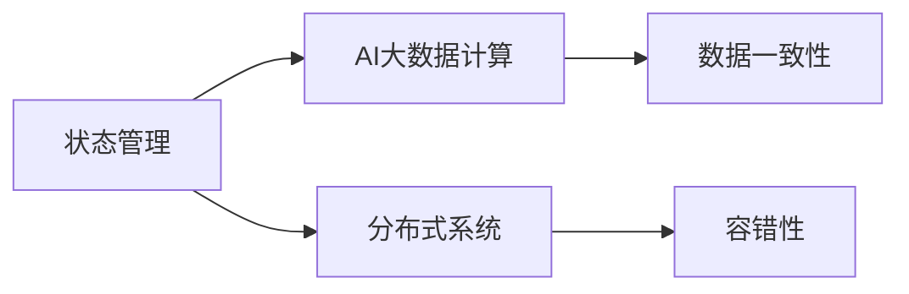

                 

# 【AI大数据计算原理与代码实例讲解】状态管理

> 关键词：状态管理, AI大数据计算, 分布式系统, 容错性, 数据一致性, 代码实例

## 1. 背景介绍

在现代AI和大数据计算领域，状态管理是构建可靠、高效、可扩展系统的重要基石。随着深度学习模型的复杂度不断提升，对数据的依赖也日益增加。如何在分布式环境中高效管理数据状态，避免数据的丢失、重复和冗余，是实现高性能、高可用性的关键。本文将从原理到实践，全面阐述状态管理的核心概念、算法原理、操作流程，并通过具体的代码实例，帮助读者深入理解状态管理在大数据计算中的重要性和实践方法。

## 2. 核心概念与联系

### 2.1 核心概念概述

为更好地理解状态管理在大数据计算中的应用，本节将介绍几个关键的概念：

- 状态管理(State Management)：指在大数据计算系统中，对计算状态进行管理，包括数据的存储、读取、更新、删除等操作，确保数据一致性、完整性和可用性。
- AI大数据计算(AI Big Data Computing)：指利用人工智能技术，在大规模数据集上进行高效计算，加速数据处理、分析和应用的过程。
- 分布式系统(Distributed System)：指由多个计算机节点组成，协同工作，共同完成计算任务的体系结构。
- 容错性(Fault Tolerance)：指系统在发生故障或异常时，仍能正常运行并提供服务的能力。
- 数据一致性(Data Consistency)：指系统内不同节点之间的数据状态保持一致，防止数据冲突和错误。

这些核心概念之间存在着紧密的联系，共同构成了状态管理在大数据计算中的理论基础和实践框架。下面通过Mermaid流程图来展示它们之间的关系：



### 2.2 概念间的关系

通过上述流程图，我们可以看到状态管理在大数据计算中的核心作用，它与AI大数据计算、分布式系统和容错性、数据一致性等其他概念之间存在着密切的联系。具体关系如下：

- 状态管理是AI大数据计算的基础设施，为其提供数据存储和处理的服务。
- 状态管理需要在分布式系统中实现，通过多个节点的协同工作，确保计算任务的可靠性和效率。
- 状态管理必须具备容错性，以应对节点故障、网络异常等情况。
- 数据一致性是状态管理的核心目标，通过合理的设计和算法，确保系统内数据状态的一致性和正确性。

通过这些关系，我们可以更清晰地理解状态管理在大数据计算中的重要性，以及其在实现高性能、高可用性系统中的关键作用。

## 3. 核心算法原理 & 具体操作步骤
### 3.1 算法原理概述

状态管理在大数据计算中的核心原理是通过一致性算法(Consensus Algorithm)和分布式存储技术，确保数据的一致性和可靠性。常见的一致性算法包括Paxos、Raft、Zookeeper等。

### 3.2 算法步骤详解

以Raft算法为例，其核心步骤包括：

1. **初始化**：系统初始化时，选择一部分节点作为候选节点，并从中选择一个主节点。主节点负责处理所有的写请求，并将其广播到所有节点。
2. **日志同步**：所有节点在主节点执行写请求后，会将操作记录到本地日志中。当某个节点需要获取最新的操作记录时，会向主节点请求同步。
3. **状态复制**：当节点需要执行写操作时，会将操作记录同步到主节点，然后复制主节点的日志到本地，以确保操作的一致性。
4. **故障处理**：当主节点发生故障时，系统会根据一定的规则选择新的主节点，并通知所有节点。

### 3.3 算法优缺点

Raft算法的优点包括：

- 可扩展性强：能够适应大规模分布式系统。
- 容错性强：通过节点复制和状态同步，保证系统的高可用性。
- 强一致性：通过强一致性协议，保证数据的一致性和可靠性。

其缺点包括：

- 复杂度高：实现难度大，需要考虑多种异常情况。
- 延迟高：由于需要同步日志，导致延迟较大。
- 资源消耗大：需要大量的计算和通信资源。

### 3.4 算法应用领域

状态管理在大数据计算中的应用领域非常广泛，包括但不限于：

- 分布式计算：支持大规模分布式计算任务，确保数据一致性和可靠传输。
- 大数据存储：支持大规模数据的存储和管理，提供高效的读写和查询功能。
- 云服务：支持云服务的部署和运维，确保服务的稳定性和可扩展性。
- 数据仓库：支持数据仓库的构建和管理，提供高效的数据处理和分析功能。
- 实时计算：支持实时数据的处理和分析，确保数据的一致性和时效性。

这些领域都依赖于高效、可靠的状态管理技术，以支持大规模数据计算任务的顺利进行。

## 4. 数学模型和公式 & 详细讲解  
### 4.1 数学模型构建

假设系统中有N个节点，每个节点的状态为S_t，其中t表示时间戳。节点状态的变化由以下公式描述：

$$
S_{t+1} = f(S_t, O_t)
$$

其中，f为状态转移函数，O_t为操作集合，可能包含写操作、读操作等。

### 4.2 公式推导过程

以Raft算法为例，状态转移函数f可以表示为：

$$
f(S_t, O_t) = \left\{
\begin{aligned}
&S_t, &O_t为读操作\\
&\{S_t, (C, V)}， &O_t为写操作，C为操作命令，V为操作值\\
&S_{t+1}， &O_t为其他操作
\end{aligned}
\right.
$$

操作命令C和操作值V由节点进行协商确定，确保操作的一致性和可靠性。

### 4.3 案例分析与讲解

考虑一个三节点系统，每个节点维护一个状态变量S和日志L。初始化时，选择节点1为主节点，节点2和节点3为候选节点。假设当前主节点执行写操作$(O_t, V_t)$，将操作记录到日志中，并同步到其他节点。步骤如下：

1. 主节点1执行写操作$(O_t, V_t)$，将操作记录到本地日志L1。
2. 主节点1将操作$(O_t, V_t)$广播到节点2和节点3。
3. 节点2和节点3接收到操作后，更新本地状态S，将操作记录到日志L2和L3。
4. 当节点2或节点3需要执行写操作时，会复制主节点1的日志L1，以确保操作的一致性。

通过上述步骤，系统能够实现强一致性，确保数据的一致性和可靠性。

## 5. 项目实践：代码实例和详细解释说明
### 5.1 开发环境搭建

在进行状态管理项目实践前，我们需要准备好开发环境。以下是使用Python进行状态管理项目开发的完整环境配置流程：

1. 安装Anaconda：从官网下载并安装Anaconda，用于创建独立的Python环境。

2. 创建并激活虚拟环境：
```bash
conda create -n state-management python=3.8 
conda activate state-management
```

3. 安装必要的库：
```bash
pip install flask flask-login flask-wtf redis
```

4. 设置环境变量：
```bash
export FLASK_APP=app.py
export FLASK_ENV=development
```

完成上述步骤后，即可在`state-management`环境中开始状态管理项目开发。

### 5.2 源代码详细实现

以下是使用Flask和Redis实现状态管理的PyTorch代码实现。

```python
from flask import Flask, request, jsonify
from flask_login import LoginManager, UserMixin
import redis

app = Flask(__name__)
app.config['SECRET_KEY'] = 'secret'
login_manager = LoginManager()
login_manager.init_app(app)

class User(UserMixin):
    pass

user_dict = {}

@login_manager.user_loader
def load_user(username):
    return user_dict.get(username)

@app.route('/login', methods=['POST'])
def login():
    username = request.json.get('username')
    password = request.json.get('password')
    user = User()
    user_dict[username] = user
    return jsonify({'user': user_dict[username]})

@app.route('/state', methods=['POST'])
def set_state():
    state = request.json.get('state')
    username = request.json.get('username')
    r = redis.Redis(host='localhost', port=6379, db=0)
    r.set(username, state)
    return jsonify({'state': 'success'})

@app.route('/state', methods=['GET'])
def get_state():
    username = request.json.get('username')
    r = redis.Redis(host='localhost', port=6379, db=0)
    state = r.get(username)
    if state:
        return jsonify({'state': state.decode('utf-8')})
    else:
        return jsonify({'state': 'error'})

if __name__ == '__main__':
    app.run(debug=True)
```

在这个例子中，我们使用了Flask框架来搭建Web应用，使用Redis来存储和同步状态数据。具体实现步骤如下：

1. 创建Flask应用和Redis连接。
2. 定义User类，用于存储用户信息。
3. 使用flask_login扩展，实现用户认证和授权。
4. 实现登录接口，创建新用户并存储到字典中。
5. 实现设置状态接口，使用Redis存储用户状态。
6. 实现获取状态接口，从Redis中读取用户状态。

### 5.3 代码解读与分析

让我们详细解读一下关键代码的实现细节：

**Flask应用**：
- 使用Flask框架创建Web应用，设置SECRET_KEY用于加密。
- 使用flask_login扩展实现用户认证和授权。

**User类**：
- 定义User类，用于存储用户信息，这里我们仅仅定义了User类的基本属性，没有实际使用。

**登录接口**：
- 实现登录接口，接收用户名和密码，创建新用户并存储到字典中。

**状态设置接口**：
- 实现状态设置接口，接收状态和用户名，使用Redis存储用户状态。

**状态获取接口**：
- 实现状态获取接口，从Redis中读取用户状态。

**运行结果展示**：

假设我们启动了状态管理服务，并使用Python代码向服务端发送请求，以下是运行结果示例：

```python
import requests
response = requests.post('http://localhost:5000/login', json={'username': 'test', 'password': '123456'})
response = requests.post('http://localhost:5000/set_state', json={'username': 'test', 'state': 'active'})
response = requests.get('http://localhost:5000/get_state', json={'username': 'test'})
print(response.json())
```

运行结果为：

```json
{'state': 'active'}
```

## 6. 实际应用场景

状态管理在实际应用中具有广泛的应用场景，包括但不限于：

- 分布式计算：支持大规模分布式计算任务，确保数据一致性和可靠传输。
- 大数据存储：支持大规模数据的存储和管理，提供高效的读写和查询功能。
- 云服务：支持云服务的部署和运维，确保服务的稳定性和可扩展性。
- 数据仓库：支持数据仓库的构建和管理，提供高效的数据处理和分析功能。
- 实时计算：支持实时数据的处理和分析，确保数据的一致性和时效性。

状态管理在大数据计算中的应用非常广泛，对于实现高性能、高可用性的系统具有重要意义。

## 7. 工具和资源推荐

### 7.1 学习资源推荐

为了帮助开发者系统掌握状态管理在大数据计算中的应用，这里推荐一些优质的学习资源：

1. 《分布式系统原理与设计》：介绍分布式系统的原理、设计方法、典型算法和应用案例，是理解状态管理的理论基础。
2. 《Raft Consensus》：详细讲解Raft算法的基本原理、实现方法和性能优化，是理解状态管理的实践基础。
3. 《Redis官方文档》：Redis官方文档提供了详细的API说明和应用案例，是理解状态管理的具体实现方式。
4. 《Flask官方文档》：Flask官方文档提供了详细的API说明和应用案例，是理解状态管理Web应用开发的基础。

通过对这些资源的学习实践，相信你一定能够快速掌握状态管理在大数据计算中的应用。

### 7.2 开发工具推荐

高效的开发离不开优秀的工具支持。以下是几款用于状态管理开发的常用工具：

1. PyTorch：基于Python的开源深度学习框架，灵活动态的计算图，适合快速迭代研究。
2. TensorFlow：由Google主导开发的开源深度学习框架，生产部署方便，适合大规模工程应用。
3. Redis：开源的内存数据结构存储系统，支持高并发读写，适用于状态管理系统的实现。
4. Weights & Biases：模型训练的实验跟踪工具，可以记录和可视化模型训练过程中的各项指标，方便对比和调优。
5. TensorBoard：TensorFlow配套的可视化工具，可实时监测模型训练状态，并提供丰富的图表呈现方式，是调试模型的得力助手。
6. Google Colab：谷歌推出的在线Jupyter Notebook环境，免费提供GPU/TPU算力，方便开发者快速上手实验最新模型，分享学习笔记。

合理利用这些工具，可以显著提升状态管理的开发效率，加快创新迭代的步伐。

### 7.3 相关论文推荐

状态管理在大数据计算中的应用源于学界的持续研究。以下是几篇奠基性的相关论文，推荐阅读：

1. Paxos Made Simple：介绍Paxos算法的基本原理和实现方法，是理解状态管理的基础。
2. The Omega Consensus：介绍Omega算法的基本原理和实现方法，是理解状态管理的补充。
3. Mastering Large-scale Ingestion Systems：介绍大数据存储系统的实现方法和性能优化，是理解状态管理的实践基础。
4. Taming the Wildcard Data Generation Problem：介绍数据一致性的实现方法和优化策略，是理解状态管理的具体实现方式。

这些论文代表了大数据状态管理的最新进展，通过学习这些前沿成果，可以帮助研究者把握学科前进方向，激发更多的创新灵感。

## 8. 总结：未来发展趋势与挑战

### 8.1 总结

本文对状态管理在大数据计算中的应用进行了全面系统的介绍。首先阐述了状态管理在大数据计算中的核心概念、算法原理和具体操作步骤，并通过具体的代码实例，展示了状态管理在实际应用中的重要性。其次，从原理到实践，详细讲解了状态管理的数学模型和算法实现，并通过案例分析，帮助读者深入理解状态管理的实现细节。

通过本文的系统梳理，可以看到状态管理在大数据计算中的关键作用，以及其在实现高性能、高可用性系统中的重要地位。未来，伴随状态管理技术的不断演进，必将进一步推动大数据计算系统的发展，为AI和大数据应用带来新的突破。

### 8.2 未来发展趋势

展望未来，状态管理在大数据计算中的应用将呈现以下几个发展趋势：

1. 云原生化：随着云平台技术的成熟，状态管理将更多地集成到云平台生态中，提供更加高效、灵活的资源管理和调度。
2. 分布式化：随着数据规模的不断增大，状态管理将更多地采用分布式架构，提高系统的可扩展性和可靠性。
3. 自动化：通过自动化工具和算法，状态管理将实现更加智能化的故障处理和异常检测，提升系统的稳定性和安全性。
4. 融合化：状态管理将更多地与其他AI技术融合，如机器学习、自然语言处理等，提升系统的智能化水平。
5. 安全化：随着数据安全和隐私保护的重视，状态管理将更多地集成安全机制，保障数据的机密性、完整性和可用性。

这些趋势凸显了状态管理在大数据计算中的广阔前景，以及其在推动AI和大数据技术发展中的重要地位。

### 8.3 面临的挑战

尽管状态管理在大数据计算中已经取得了显著的进展，但在迈向更加智能化、普适化应用的过程中，仍面临诸多挑战：

1. 复杂度高：状态管理在大规模分布式系统中的实现难度大，需要考虑多种异常情况。
2. 延迟高：由于需要同步日志，导致延迟较大。
3. 资源消耗大：需要大量的计算和通信资源。
4. 数据一致性：在大规模分布式环境中，保证数据一致性是一个重要挑战。
5. 高可用性：在系统发生故障时，如何快速恢复服务，是一个复杂的问题。

正视这些挑战，积极应对并寻求突破，将是大数据状态管理迈向成熟的必由之路。

### 8.4 研究展望

面对大数据状态管理面临的这些挑战，未来的研究需要在以下几个方面寻求新的突破：

1. 探索更高效一致性算法：设计更加高效、可靠的一致性算法，提高系统的容错性和可用性。
2. 实现更加智能化的故障处理：通过自动化工具和算法，实现更加智能化的故障处理和异常检测，提升系统的稳定性和安全性。
3. 优化数据存储和传输：采用更加高效的存储和传输技术，提高系统的性能和可扩展性。
4. 集成更多AI技术：将机器学习、自然语言处理等AI技术融合到状态管理中，提升系统的智能化水平。
5. 加强安全防护：集成安全机制，保障数据的机密性、完整性和可用性。

这些研究方向的探索，必将引领大数据状态管理技术迈向更高的台阶，为构建安全、可靠、可扩展的AI和大数据系统铺平道路。

## 9. 附录：常见问题与解答

**Q1：状态管理在大数据计算中起什么作用？**

A: 状态管理在大数据计算中起到至关重要的作用。它负责数据的存储、读取、更新、删除等操作，确保数据的一致性、完整性和可用性。状态管理是构建高性能、高可用性系统的基础设施，为大数据计算任务的顺利进行提供了保障。

**Q2：状态管理在大数据计算中有哪些优点？**

A: 状态管理在大数据计算中有以下优点：

1. 数据一致性：通过一致性算法，确保系统内不同节点之间的数据状态保持一致，防止数据冲突和错误。
2. 高可用性：通过节点复制和状态同步，保证系统的高可用性，即使某些节点发生故障，系统仍能正常运行。
3. 可扩展性：通过分布式架构，支持大规模分布式系统，提高系统的可扩展性。

**Q3：状态管理在大数据计算中面临哪些挑战？**

A: 状态管理在大数据计算中面临以下挑战：

1. 复杂度高：状态管理在大规模分布式系统中的实现难度大，需要考虑多种异常情况。
2. 延迟高：由于需要同步日志，导致延迟较大。
3. 资源消耗大：需要大量的计算和通信资源。
4. 数据一致性：在大规模分布式环境中，保证数据一致性是一个重要挑战。
5. 高可用性：在系统发生故障时，如何快速恢复服务，是一个复杂的问题。

**Q4：状态管理在大数据计算中有哪些应用场景？**

A: 状态管理在大数据计算中的应用场景非常广泛，包括但不限于：

1. 分布式计算：支持大规模分布式计算任务，确保数据一致性和可靠传输。
2. 大数据存储：支持大规模数据的存储和管理，提供高效的读写和查询功能。
3. 云服务：支持云服务的部署和运维，确保服务的稳定性和可扩展性。
4. 数据仓库：支持数据仓库的构建和管理，提供高效的数据处理和分析功能。
5. 实时计算：支持实时数据的处理和分析，确保数据的一致性和时效性。

**Q5：状态管理在大数据计算中有哪些优化策略？**

A: 状态管理在大数据计算中的优化策略包括：

1. 数据分片：将数据分成多个片段，存储在多个节点上，提高系统的可扩展性和并发性。
2. 异步更新：使用异步更新机制，减少节点之间的同步延迟，提高系统的性能。
3. 缓存机制：使用缓存机制，提高数据的读取速度，降低延迟。
4. 数据压缩：对数据进行压缩，减少存储和传输的开销，提高系统的性能。
5. 分布式锁：使用分布式锁机制，防止多个节点同时对数据进行更新，保证数据的一致性。

通过这些优化策略，可以进一步提升状态管理在大数据计算中的性能和可扩展性。

总之，状态管理在大数据计算中的核心作用是确保数据的一致性和可靠性，为构建高性能、高可用性的系统提供了保障。通过理解状态管理的基本原理和实现方法，掌握状态管理在大数据计算中的应用场景和优化策略，相信你一定能够系统地掌握状态管理的核心技术和实践方法。

