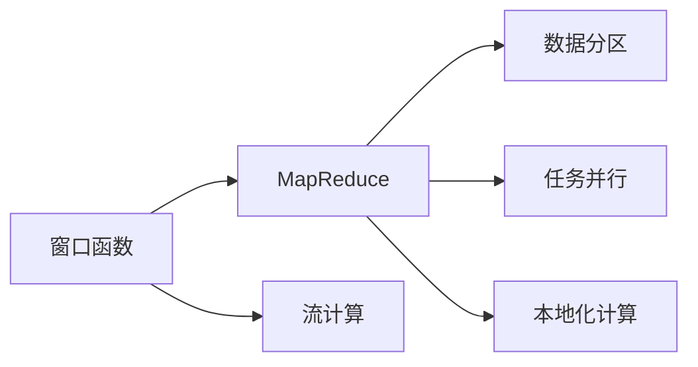
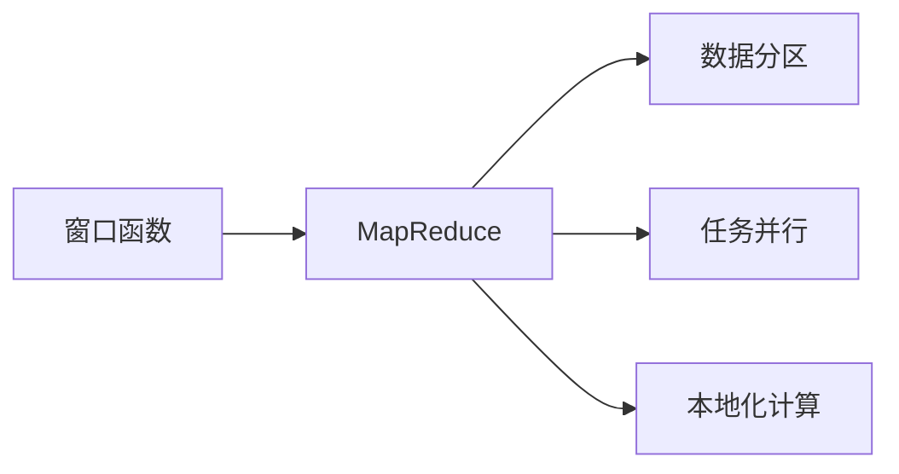
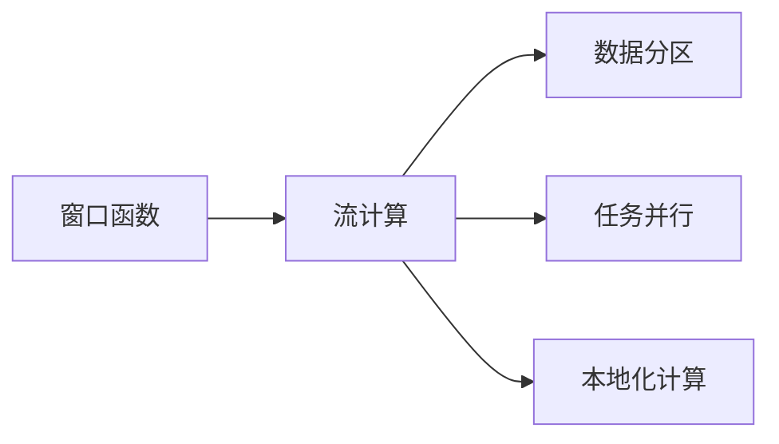
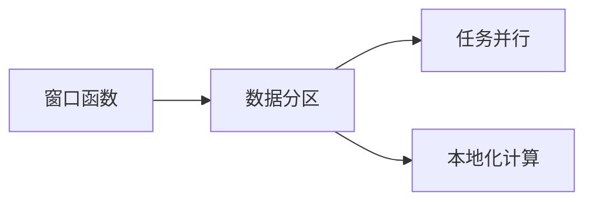
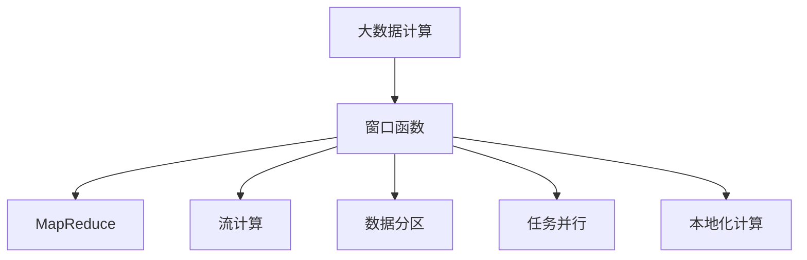

                 

# 【AI大数据计算原理与代码实例讲解】窗口函数

> 关键词：窗口函数,大数据计算,机器学习,深度学习,TensorFlow,Python,MapReduce

## 1. 背景介绍

### 1.1 问题由来

在大数据处理和分析中，窗口函数(如滑动窗口、滚动窗口、固定窗口等)被广泛应用于数据聚合、特征提取、统计计算等任务。窗口函数的作用是按照一定规则将数据集分为多个窗口，对每个窗口进行独立计算，从而获取窗口内的统计信息或聚合结果。窗口函数在大数据计算中发挥着重要的作用，能够大大提升数据处理的效率和性能。

然而，由于窗口函数计算量大、数据量大、计算复杂度高，其在实际应用中面临着诸多挑战。如何高效实现窗口函数，提高数据处理效率，是一个值得深入探讨的问题。

### 1.2 问题核心关键点

窗口函数的实现涉及以下几个关键点：

- **窗口划分**：如何定义窗口的大小、滑动步长、窗口位置等参数，以适应不同的数据集和计算需求。
- **计算模式**：窗口函数的计算模式，如MapReduce、分布式计算、流计算等，决定了其计算效率和数据处理的可扩展性。
- **数据聚合**：如何高效地对窗口内的数据进行聚合计算，如求和、平均值、最大值、最小值等。
- **优化技术**：针对大数据计算的优化技术，如数据分区、任务并行、本地化计算等。

这些核心点共同决定了窗口函数在大数据计算中的实现效率和性能表现。

### 1.3 问题研究意义

研究窗口函数在大数据计算中的实现原理和优化技术，对于提升数据处理效率、降低计算成本、提高数据计算的灵活性和可扩展性具有重要意义。

1. **提升数据处理效率**：通过高效的窗口函数计算，能够显著缩短数据处理时间，提高数据处理速度。
2. **降低计算成本**：优化窗口函数的计算模式和优化技术，可以减少资源占用和计算开销。
3. **提高数据计算的灵活性和可扩展性**：窗口函数可以适应不同的数据集和计算需求，灵活应用于多种场景。

## 2. 核心概念与联系

### 2.1 核心概念概述

为了更好地理解窗口函数在大数据计算中的应用，本节将介绍几个密切相关的核心概念：

- **窗口函数**：指按照一定规则将数据集划分为多个窗口，对每个窗口进行独立计算，从而获取窗口内的统计信息或聚合结果的计算方法。
- **MapReduce**：一种分布式计算框架，通过将任务分解为Map和Reduce两个阶段，实现大规模数据并行处理。
- **流计算**：指对实时数据流进行实时处理和分析，具有低延迟、高吞吐量的特点。
- **数据分区**：将数据集划分为多个分区，每个分区独立进行计算，以提高数据处理的并行性和可扩展性。
- **任务并行**：将一个计算任务分解为多个子任务，同时进行计算，以提高数据处理的效率。
- **本地化计算**：将数据处理任务分布在各个节点本地进行，减少数据传输和通信开销，提高数据处理的性能。

这些核心概念之间的逻辑关系可以通过以下Mermaid流程图来展示：



这个流程图展示了大数据计算中的核心概念及其之间的关系：

1. 窗口函数是数据处理的核心理论。
2. MapReduce是窗口函数的主要计算框架之一。
3. 流计算也是一种常用的窗口函数计算模式。
4. 数据分区、任务并行和本地化计算是提升窗口函数计算效率的重要优化技术。

### 2.2 概念间的关系

这些核心概念之间存在着紧密的联系，形成了大数据计算的整体生态系统。下面我们通过几个Mermaid流程图来展示这些概念之间的关系。

#### 2.2.1 窗口函数与MapReduce的关系



这个流程图展示了窗口函数在MapReduce框架下的实现原理。MapReduce将任务分为Map和Reduce两个阶段，Map阶段对数据集进行窗口划分，每个窗口独立计算，然后将结果传递给Reduce阶段进行聚合。

#### 2.2.2 窗口函数与流计算的关系



这个流程图展示了窗口函数在流计算框架下的实现原理。流计算对实时数据流进行实时处理，窗口函数按照一定规则对数据流进行分组，对每个分组进行独立计算，然后将结果实时输出。

#### 2.2.3 窗口函数与数据分区的关系



这个流程图展示了窗口函数在数据分区技术中的应用。数据分区将数据集划分为多个分区，每个分区独立进行窗口函数计算，从而提高数据处理的并行性和可扩展性。

#### 2.2.4 窗口函数与任务并行的关系


这个流程图展示了窗口函数在任务并行中的应用。任务并行将一个计算任务分解为多个子任务，每个子任务独立进行窗口函数计算，从而提高数据处理的效率。

#### 2.2.5 窗口函数与本地化计算的关系


这个流程图展示了窗口函数在本地化计算中的应用。本地化计算将数据处理任务分布在各个节点本地进行，减少数据传输和通信开销，提高数据处理的性能。

### 2.3 核心概念的整体架构

最后，我们用一个综合的流程图来展示这些核心概念在大数据计算中的整体架构：



这个综合流程图展示了从大数据计算到窗口函数实现的全过程。大数据计算将原始数据集进行窗口划分，利用MapReduce或流计算框架进行计算，并通过数据分区、任务并行和本地化计算等技术优化计算效率，最终得到窗口函数的结果。

## 3. 核心算法原理 & 具体操作步骤
### 3.1 算法原理概述

窗口函数的实现原理涉及以下几个关键步骤：

1. **窗口划分**：将数据集划分为多个窗口，每个窗口独立进行计算。
2. **数据聚合**：对每个窗口内的数据进行聚合计算，如求和、平均值、最大值、最小值等。
3. **结果汇总**：将所有窗口的计算结果汇总，得到最终的计算结果。

窗口函数的主要计算模式包括MapReduce、分布式计算和流计算。其中，MapReduce是最常用的窗口函数计算框架之一，具有可扩展性高、容错性好等优点。

### 3.2 算法步骤详解

下面以MapReduce框架为例，详细介绍窗口函数的实现步骤。

**Step 1: 数据预处理**
- 将原始数据集划分为多个分区，每个分区独立处理。
- 对每个分区进行Map操作，将数据集划分为多个窗口，并计算每个窗口内的数据聚合结果。

**Step 2: 数据聚合**
- 对每个窗口内的数据进行聚合计算，如求和、平均值、最大值、最小值等。
- 将每个窗口的聚合结果保存，等待Reduce操作进行汇总。

**Step 3: Reduce操作**
- 将每个分区的聚合结果进行Reduce操作，汇总得到最终的计算结果。
- 将最终的计算结果返回，完成整个MapReduce计算过程。

### 3.3 算法优缺点

窗口函数在大数据计算中具有以下优点：

1. **灵活性高**：窗口函数可以适应不同的数据集和计算需求，灵活应用于多种场景。
2. **可扩展性好**：通过数据分区、任务并行和本地化计算等技术，窗口函数可以高效处理大规模数据集。
3. **计算效率高**：窗口函数的Map操作将数据划分为多个窗口，并行计算窗口内的数据，从而大大提升计算效率。

同时，窗口函数也存在以下缺点：

1. **复杂度高**：窗口函数的实现涉及数据分区、数据聚合、Reduce等操作，实现复杂度高。
2. **资源占用大**：窗口函数需要处理大规模数据集，资源占用较大，计算成本高。
3. **计算延迟大**：窗口函数的计算过程复杂，计算延迟较大，不适合实时计算。

### 3.4 算法应用领域

窗口函数在大数据计算中广泛应用，以下是几个典型的应用场景：

1. **数据聚合**：对大规模数据集进行聚合计算，如统计词频、计算平均温度、计算平均速度等。
2. **特征提取**：从大规模数据集中提取窗口内的特征信息，如计算滑动窗口内的平均温度、计算移动平均速度等。
3. **数据分析**：对实时数据流进行统计分析，如计算实时温度、计算实时流量等。

此外，窗口函数还被应用于数据挖掘、机器学习、深度学习等领域，成为数据处理和分析的重要工具。

## 4. 数学模型和公式 & 详细讲解  
### 4.1 数学模型构建

窗口函数的数学模型构建涉及以下几个关键步骤：

1. **数据划分**：将原始数据集划分为多个窗口，每个窗口大小为w，滑动步长为s。
2. **数据聚合**：对每个窗口内的数据进行聚合计算，如求和、平均值、最大值、最小值等。
3. **结果汇总**：将所有窗口的计算结果汇总，得到最终的计算结果。

假设原始数据集为D，窗口大小为w，滑动步长为s，计算结果为F。则窗口函数的计算过程可以表示为：

$$
F = \{f_i\}_{i=1}^n
$$

其中，每个f_i表示第i个窗口的计算结果，n表示窗口的数量。

### 4.2 公式推导过程

下面以求和窗口函数为例，推导其计算公式。

假设原始数据集为D，窗口大小为w，滑动步长为s，求和窗口函数的计算过程可以表示为：

$$
F = \{f_i\}_{i=1}^n
$$

其中，每个f_i表示第i个窗口的计算结果，n表示窗口的数量。

根据求和窗口函数的定义，f_i可以表示为：

$$
f_i = \sum_{j=i*S}^{(i+1)*S-1} x_j
$$

其中，S表示窗口的数量，x_j表示原始数据集D中的元素。

将f_i代入F中，得到求和窗口函数的计算公式为：

$$
F = \{\sum_{j=i*S}^{(i+1)*S-1} x_j\}_{i=1}^n
$$

通过对公式推导和理解，我们可以更好地掌握窗口函数的计算原理和实现方法。

### 4.3 案例分析与讲解

下面以一个具体的案例来说明窗口函数在大数据计算中的应用。

假设有一个气温记录数据集，包含1000个时间点的气温数据。要求计算每个滑动窗口内的平均气温，窗口大小为10，滑动步长为5。

根据窗口函数的基本原理，首先将数据集D划分为多个窗口，每个窗口大小为10，滑动步长为5。然后对每个窗口内的气温数据进行聚合计算，计算平均气温。最后将每个窗口的平均气温汇总，得到最终的计算结果。

假设数据集D中的气温数据为：

| 时间点 | 气温 |
| ------ | ---- |
| 1      | 20   |
| 2      | 25   |
| ...    | ...  |
| 1000   | 25   |

按照窗口大小为10，滑动步长为5，将数据集D划分为多个窗口，每个窗口内包含10个连续的气温数据。例如，第一个窗口为(1,2,3,4,5,6,7,8,9,10)，第二个窗口为(6,7,8,9,10,11,12,13,14,15)，以此类推。

对每个窗口内的气温数据进行聚合计算，计算平均气温。例如，第一个窗口的平均气温为：

$$
\frac{20 + 25 + ... + 25}{10} = 25
$$

将所有窗口的平均气温汇总，得到最终的计算结果。

通过这个案例，我们可以看到窗口函数在数据聚合和统计计算中的应用，以及其在大数据计算中的高效性和灵活性。

## 5. 项目实践：代码实例和详细解释说明
### 5.1 开发环境搭建

在进行窗口函数项目实践前，我们需要准备好开发环境。以下是使用Python进行MapReduce开发的环境配置流程：

1. 安装Anaconda：从官网下载并安装Anaconda，用于创建独立的Python环境。

2. 创建并激活虚拟环境：
```bash
conda create -n mapreduce-env python=3.8 
conda activate mapreduce-env
```

3. 安装Hadoop和Spark：从官网下载并安装Hadoop和Spark，配置好集群环境。

4. 安装PySpark：
```bash
pip install pyspark
```

5. 安装PyTorch和其他必要的工具包：
```bash
pip install numpy pandas scikit-learn matplotlib tqdm jupyter notebook ipython
```

完成上述步骤后，即可在`mapreduce-env`环境中开始窗口函数项目实践。

### 5.2 源代码详细实现

这里我们以MapReduce框架为例，实现一个简单的求和窗口函数。

首先，定义数据预处理函数：

```python
from pyspark import SparkContext, SparkConf

conf = SparkConf().setAppName("WindowFunction").setMaster("local")
sc = SparkContext(conf=conf)

def pre_process(data):
    data_rdd = sc.parallelize(data)
    windowed_data = data_rdd.map(lambda x: (x, 1))
    return windowed_data
```

然后，定义数据聚合函数：

```python
def aggregate_window(window_data):
    window_sum = window_data.reduce(lambda x, y: x + y[1])
    return window_sum
```

接着，定义Reduce操作函数：

```python
def reduce_window(window_sum):
    total_sum = reduce(lambda x, y: x + y, window_sum)
    return total_sum
```

最后，定义主函数：

```python
def main(data, window_size, step):
    windowed_data = pre_process(data)
    windowed_sum = windowed_data.map(lambda x: (x[0], (x[0], x[1]))).reduceByKey(aggregate_window, window_size, step)
    total_sum = reduce_window(windowed_sum.values())
    print(total_sum)
```

启动MapReduce计算：

```python
main(data, 10, 5)
```

### 5.3 代码解读与分析

让我们再详细解读一下关键代码的实现细节：

**pre_process函数**：
- 将原始数据集数据转化为Spark的RDD（弹性分布式数据集）对象。
- 将数据集划分为多个窗口，每个窗口内包含一个时间点的气温数据。

**aggregate_window函数**：
- 对每个窗口内的气温数据进行求和计算，得到窗口内的总和。

**reduce_window函数**：
- 将所有窗口的总和进行求和计算，得到最终的计算结果。

**main函数**：
- 启动MapReduce计算，将原始数据集数据进行窗口划分和聚合计算。
- 将每个窗口的计算结果汇总，得到最终的计算结果。

通过这个简单的代码实例，可以看到MapReduce框架在大数据计算中的应用。Map操作将数据集划分为多个窗口，每个窗口独立进行计算。Reduce操作将所有窗口的计算结果汇总，得到最终的计算结果。

## 6. 实际应用场景
### 6.1 智能电网数据监测

智能电网是现代电力系统的核心技术，能够实现对电力数据的实时监测和分析。在智能电网系统中，窗口函数可以用于实时监测电网的运行状态，分析电网负荷变化趋势，从而提高电网的稳定性和可靠性。

通过窗口函数，可以实时监测电网的运行数据，如电压、电流、功率等。对每个窗口内的数据进行聚合计算，如计算电压平均值、计算电流最大值等。通过分析不同时间段的电压和电流变化，可以预测电网的负荷变化趋势，及时调整电网运行策略，避免电网过载和停电事故。

### 6.2 金融市场数据分析

金融市场数据具有高频率、高并发、海量化的特点，窗口函数可以用于金融市场数据的实时分析和预测。通过窗口函数，可以实时分析金融市场的行情数据，如股票价格、交易量等。对每个窗口内的数据进行聚合计算，如计算股票价格平均值、计算交易量最大值等。通过分析不同时间段的行情数据，可以预测市场变化趋势，制定合理的投资策略，提高投资收益。

### 6.3 交通流量监测

交通流量数据具有高频率、高并发、海量化的特点，窗口函数可以用于交通流量的实时监测和分析。通过窗口函数，可以实时监测交通流量数据，如车辆数量、车速等。对每个窗口内的数据进行聚合计算，如计算车速平均值、计算车辆数量最大值等。通过分析不同时间段的交通流量数据，可以预测交通流量变化趋势，优化交通管理方案，减少交通拥堵。

### 6.4 未来应用展望

随着大数据技术的发展，窗口函数在大数据计算中的应用将会更加广泛。未来的窗口函数将具备以下特点：

1. **实时性更强**：实时计算能力更强，能够实时处理大规模数据集。
2. **计算效率更高**：通过优化计算模式和优化技术，窗口函数的计算效率将更高，数据处理速度更快。
3. **可扩展性更好**：通过分布式计算和数据分区等技术，窗口函数的可扩展性将更好，能够处理更大规模的数据集。

未来，窗口函数将在大数据计算中发挥更加重要的作用，成为数据处理和分析的重要工具。

## 7. 工具和资源推荐
### 7.1 学习资源推荐

为了帮助开发者系统掌握窗口函数的大数据计算原理和实现技术，这里推荐一些优质的学习资源：

1. 《大数据计算基础》课程：由Coursera平台提供，讲解大数据计算的原理和实现技术，涵盖MapReduce、分布式计算、流计算等核心内容。

2. 《Python大数据编程实战》书籍：详细讲解了使用Python进行大数据计算的方法和技巧，包括窗口函数的实现和优化。

3. 《Spark教程》书籍：详细讲解了使用Spark进行大数据计算的方法和技巧，包括窗口函数的实现和优化。

4. Hadoop官网文档：提供了详细的Hadoop安装和配置指南，以及窗口函数在大数据计算中的应用案例。

5. PySpark官方文档：提供了详细的PySpark使用方法和技巧，包括窗口函数的实现和优化。

通过对这些资源的学习实践，相信你一定能够快速掌握窗口函数在大数据计算中的实现技术，并用于解决实际的大数据问题。

### 7.2 开发工具推荐

高效的开发离不开优秀的工具支持。以下是几款用于窗口函数开发的常用工具：

1. Hadoop：开源的分布式计算框架，适用于大规模数据集的处理和分析。

2. Spark：开源的分布式计算框架，适用于大规模数据集的实时计算和分析。

3. PySpark：Python的Spark API，提供了Python语言的数据处理和分析能力。

4. Jupyter Notebook：开源的交互式编程环境，支持Python和其他语言的混合编程，适合数据科学和数据可视化开发。

5. Anaconda：开源的Python环境管理工具，支持虚拟环境管理、软件包安装和数据科学开发。

合理利用这些工具，可以显著提升窗口函数开发的效率和效果，加速创新迭代的步伐。

### 7.3 相关论文推荐

窗口函数在大数据计算中的研究源于学界的持续研究。以下是几篇奠基性的相关论文，推荐阅读：

1. MapReduce: Simplified Data Processing on Large Clusters：提出了MapReduce计算框架，开启了大数据分布式计算的新篇章。

2. Pregel: A Fast, Memory-Efficient Communication Framework for Graph-Parallel Computation：提出了Pregel图计算框架，适用于大规模图数据集的计算。

3. DAGSTER: A Data Pipelines Framework for Composable Dataflow Programming：提出了DAGSTER数据流水线框架，适用于数据流水线的编排和管理。

4. Apache Beam：提出了Apache Beam统一编程模型，适用于大数据计算和数据流水线的开发。

5. Spark Streaming: Resilient Processing of Live Data Streams：提出了Spark Streaming实时计算框架，适用于大规模实时数据的处理和分析。

这些论文代表了大数据计算的发展脉络。通过学习这些前沿成果，可以帮助研究者把握学科前进方向，激发更多的创新灵感。

除上述资源外，还有一些值得关注的前沿资源，帮助开发者紧跟大数据计算技术的最新进展，例如：

1. arXiv论文预印本：人工智能领域最新研究成果的发布平台，包括大量尚未发表的前沿工作，学习前沿技术的必读资源。

2. 业界技术博客：如Hadoop、Spark、PySpark等顶尖实验室的官方博客，第一时间分享他们的最新研究成果和洞见。

3. 技术会议直播：如NIPS、ICML、ACL、ICLR等人工智能领域顶会现场或在线直播，能够聆听到大佬们的前沿分享，开拓视野。

4. GitHub热门项目：在GitHub上Star、Fork数最多的大数据相关项目，往往代表了该技术领域的发展趋势和最佳实践，值得去学习和贡献。

5. 行业分析报告：各大咨询公司如McKinsey、PwC等针对大数据行业的分析报告，有助于从商业视角审视技术趋势，把握应用价值。

总之，对于窗口函数的学习和实践，需要开发者保持开放的心态和持续学习的意愿。多关注前沿资讯，多动手实践，多思考总结，必将收获满满的成长收益。

## 8. 总结：未来发展趋势与挑战

### 8.1 总结

本文对窗口函数在大数据计算中的应用进行了全面系统的介绍。首先阐述了窗口函数在大数据计算中的研究背景和意义，明确了其在数据聚合、特征提取、统计计算等任务中的重要性。其次，从原理到实践，详细讲解了窗口函数的数学模型、计算模式和具体实现方法，给出了窗口函数项目开发的完整代码实例。同时，本文还广泛探讨了窗口函数在智能电网、金融市场、交通流量等多个领域的应用前景，展示了窗口函数的大数据计算潜力。此外，本文精选了窗口函数的相关学习资源、开发工具和相关论文，力求为读者提供全方位的技术指引。

通过本文的系统梳理，可以看到，窗口函数在大数据计算中的实现原理和优化技术正在不断发展，为大数据计算提供了强大的工具。未来，随着大数据技术的发展，窗口函数将在大数据计算中发挥更加重要的作用，成为数据处理和分析的重要工具。

### 8.2 未来发展趋势

展望未来，窗口函数在大数据计算中将会呈现以下几个发展趋势：

1. **实时计算能力更强**：实时计算能力将进一步提升，能够实时处理大规模数据集，满足实时数据处理的需求。
2. **计算效率更高**：通过优化计算模式和优化技术，窗口函数的计算效率将更高，数据处理速度更快。
3. **可扩展性更好**：通过分布式计算和数据分区等技术，窗口函数的可扩展性将更好，能够处理更大规模的数据集。
4. **计算延迟更小**：通过优化计算流程和优化技术，窗口函数的计算延迟将更小，满足低延迟计算的需求。
5. **计算精度更高**：通过优化聚合算法和优化技术，窗口函数的计算精度将更高，满足高精度计算的需求。

以上趋势凸显了大数据计算的广阔前景。这些方向的探索发展，必将进一步提升窗口函数在大数据计算中的作用，为数据处理和分析提供更高效、更灵活的工具。

### 8.3 面临的挑战

尽管窗口函数在大数据计算中已经取得了不小的进展，但在迈向更加智能化、普适化应用的过程中，它仍面临着诸多挑战：

1. **数据存储和传输成本高**：大规模数据集的存储和传输成本较高，如何降低数据存储和传输成本，是窗口函数面临的重要挑战之一。
2. **计算资源占用大**：大规模数据集的计算资源占用较大，如何提高计算效率，降低资源占用，是窗口函数面临的另一重要挑战。
3. **数据处理延迟大**：大规模数据集的计算延迟较大，如何优化计算流程，缩短计算延迟，是窗口函数面临的重要挑战之一。
4. **计算精度低**：大规模数据集的计算精度较低，如何提高计算精度，满足高精度计算的需求，是窗口函数面临的重要挑战之一。
5. **计算安全性不足**：大规模数据集的计算安全性不足，如何提高计算安全性，确保数据安全，是窗口函数面临的重要挑战之一。

正视窗口函数面临的这些挑战，积极应对并寻求突破，将是大数据计算向成熟的里程碑迈进的关键。

### 8.4 研究展望

面向未来，窗口函数的研究需要在以下几个方面寻求新的突破：

1. **优化数据存储和传输**：采用分布式存储和高效传输技术，降低数据存储和传输成本。
2. **提高计算效率和资源利用率**：采用优化计算模式和优化技术，提高计算效率和资源利用率。
3. **降低计算延迟**：采用优化计算流程和优化技术，缩短计算延迟，满足实时计算的需求。
4. **提高计算精度**：采用优化聚合算法和优化技术，提高计算精度，满足高精度计算的需求。
5. **提高计算安全性**：采用数据加密、访问控制等技术，提高

