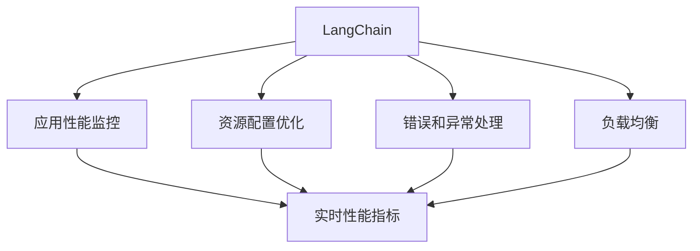
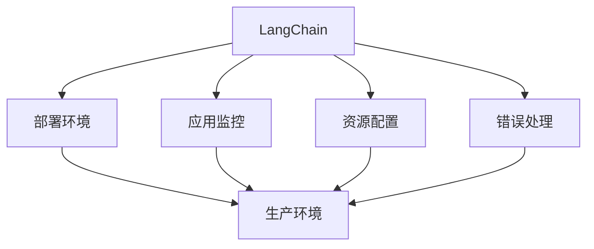
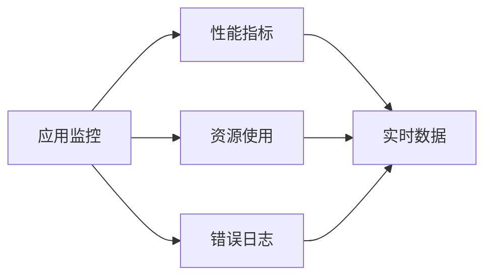
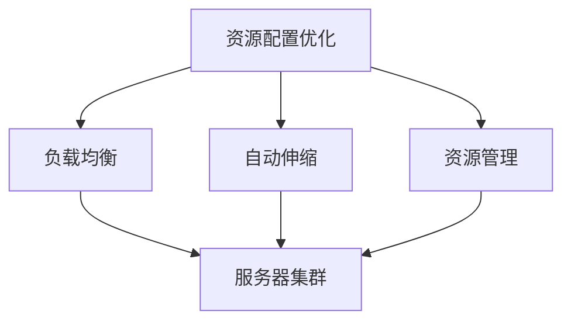
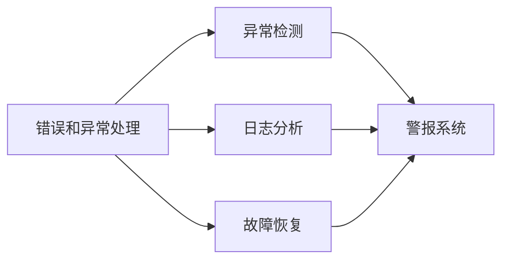
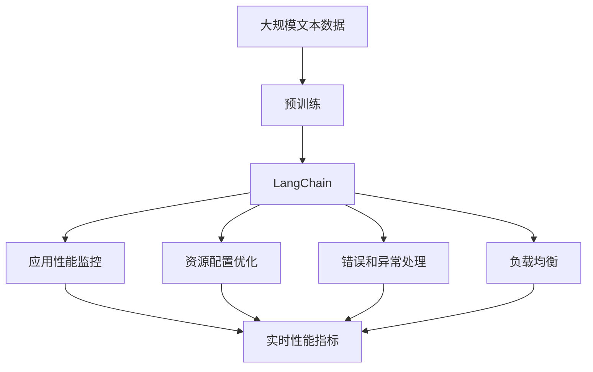

                 

# 【LangChain编程：从入门到实践】应用监控和调优

> 关键词：LangChain, 编程语言, 监控, 调优, 微调, 性能优化, 可靠性, 负载均衡

## 1. 背景介绍

### 1.1 问题由来

在当前的软件开发中，随着项目规模的不断扩大和复杂度的增加，应用监控和调优变得尤为重要。对于持续迭代更新的大语言模型(LangChain)而言，应用监控和调优是确保其高效稳定运行的关键。本文将围绕LangChain的应用监控和调优，探讨其原理、方法、工具和资源，并给出代码实例，帮助读者从入门到实践，全面掌握应用监控和调优的技术。

### 1.2 问题核心关键点

LangChain的应用监控和调优，涉及应用性能评估、资源配置优化、错误异常处理等方面。其核心关键点包括：

- 应用性能监控：实时监测LangChain模型的运行状态，包括资源占用、响应时间等。
- 资源配置优化：根据应用负载自动调整LangChain模型的资源配置，如CPU、内存、网络等。
- 错误异常处理：及时发现并处理应用中的错误和异常，保障应用的可靠性和稳定性。
- 负载均衡：通过分布式架构，均衡应用负载，提高系统的吞吐量和响应速度。

这些关键点在LangChain的实际应用中扮演着重要角色，通过应用监控和调优，可以有效提升系统的性能和可用性，降低开发和维护成本。

### 1.3 问题研究意义

深入研究LangChain的应用监控和调优方法，对于提升其应用性能，降低开发和维护成本，具有重要意义：

1. 提升系统性能：通过实时监控和调优，可以及时发现系统性能瓶颈，优化资源配置，提升应用性能。
2. 降低开发成本：通过自动化监控和调优，减少人工干预，降低运维成本。
3. 提高系统可靠性：通过错误和异常处理，及时发现并解决潜在问题，保障系统的稳定运行。
4. 支持分布式架构：通过负载均衡，提高系统的吞吐量和响应速度，支持更大规模的应用部署。
5. 推动技术发展：通过应用监控和调优，推动LangChain技术的发展和应用，加速人工智能在各个领域的落地。

## 2. 核心概念与联系

### 2.1 核心概念概述

为更好地理解LangChain的应用监控和调优方法，本节将介绍几个密切相关的核心概念：

- LangChain：以深度学习为基础的大语言模型，具备强大的自然语言理解和生成能力。
- 应用性能监控：实时监测和分析LangChain模型的性能指标，如响应时间、资源占用等。
- 资源配置优化：根据应用负载自动调整LangChain模型的资源配置，优化计算资源利用率。
- 错误和异常处理：及时发现并处理LangChain模型中的错误和异常，保障模型稳定性。
- 负载均衡：通过分布式架构，均衡应用负载，提升系统吞吐量和响应速度。

这些核心概念之间的逻辑关系可以通过以下Mermaid流程图来展示：



这个流程图展示了大语言模型LangChain的应用监控和调优过程的各个环节，以及它们之间的相互作用关系。

### 2.2 概念间的关系

这些核心概念之间存在着紧密的联系，形成了LangChain监控和调优的完整生态系统。下面我们通过几个Mermaid流程图来展示这些概念之间的关系。

#### 2.2.1 LangChain的部署场景



这个流程图展示了LangChain在不同部署环境中的应用监控、资源配置和错误处理。

#### 2.2.2 应用监控的核心组件



这个流程图展示了应用监控的核心组件及其相互关系。

#### 2.2.3 资源配置优化策略



这个流程图展示了资源配置优化的策略及其对服务器集群的优化效果。

#### 2.2.4 错误和异常处理流程



这个流程图展示了错误和异常处理的核心流程及其对系统稳定性的保障。

### 2.3 核心概念的整体架构

最后，我们用一个综合的流程图来展示这些核心概念在大语言模型LangChain监控和调优过程中的整体架构：



这个综合流程图展示了从预训练到监控调优的完整过程。LangChain首先在大规模文本数据上进行预训练，然后通过应用性能监控、资源配置优化、错误和异常处理、负载均衡等环节进行调优，从而实现高效稳定的运行。

## 3. 核心算法原理 & 具体操作步骤
### 3.1 算法原理概述

LangChain的应用监控和调优，本质上是一个动态系统的性能优化过程。其核心思想是：通过实时监控和分析应用性能指标，自动调整资源配置，及时处理错误和异常，均衡应用负载，从而实现系统的最优运行状态。

形式化地，假设LangChain模型的运行状态为 $S_t$，其中 $t$ 表示时间。应用监控和调优的目标是：

$$
\min_{S_t} \mathcal{L}(S_t)
$$

其中 $\mathcal{L}$ 为应用性能指标损失函数，用于衡量应用状态与理想状态之间的差异。常用的性能指标包括：

- 响应时间：模型处理请求所需的总时间。
- 资源占用：模型运行所需的CPU、内存等计算资源。
- 错误率：模型在处理请求时出现的错误率。
- 吞吐量：模型在单位时间内处理的请求数。

在实践中，我们通常使用基于梯度的优化算法（如Adam、SGD等）来近似求解上述最优化问题。设 $\eta$ 为学习率，$\lambda$ 为正则化系数，则资源配置优化的公式为：

$$
S_{t+1} \leftarrow S_t - \eta \nabla_{S_t}\mathcal{L}(S_t) - \eta\lambda S_t
$$

其中 $\nabla_{S_t}\mathcal{L}(S_t)$ 为性能指标损失函数对系统状态 $S_t$ 的梯度，可通过反向传播算法高效计算。

### 3.2 算法步骤详解

LangChain的应用监控和调优一般包括以下几个关键步骤：

**Step 1: 应用性能监控**

- 设计合适的性能指标，如响应时间、资源占用等。
- 选择合适的监控工具，如Prometheus、Grafana、ELK Stack等。
- 实时采集性能数据，并进行可视化展示。

**Step 2: 资源配置优化**

- 根据监控数据，计算系统当前的资源负载。
- 基于负载情况，自动调整资源配置，如CPU、内存、网络带宽等。
- 使用动态伸缩策略，如Kubernetes、Elastic Compute Cloud(ECC)等。

**Step 3: 错误和异常处理**

- 配置错误日志系统，记录模型运行中的错误和异常。
- 设计告警规则，对异常情况进行实时监控和处理。
- 实现自动故障恢复机制，保障系统稳定性。

**Step 4: 负载均衡**

- 采用分布式架构，如微服务、容器化等。
- 设计负载均衡策略，如轮询、随机等。
- 使用负载均衡工具，如Nginx、HAProxy等。

**Step 5: 持续优化**

- 定期回顾监控数据，评估系统性能。
- 根据业务需求和监控数据，不断优化模型和架构。
- 引入新的技术手段，提升系统性能和可靠性。

以上是LangChain应用监控和调优的一般流程。在实际应用中，还需要根据具体场景和需求，对各环节进行优化和改进。

### 3.3 算法优缺点

LangChain的应用监控和调优方法具有以下优点：

1. 自动化程度高。通过自动监控和调整，可以显著降低人工干预，提高效率。
2. 实时性高。实时数据采集和处理，确保及时发现并解决潜在问题。
3. 灵活性强。支持多种监控工具和配置策略，适用于多种部署环境。
4. 稳定性高。通过负载均衡和错误处理，保障系统稳定性。

同时，该方法也存在以下缺点：

1. 复杂度高。监控和调优涉及多个环节，需要综合考虑多种因素。
2. 资源消耗高。实时数据采集和处理，可能带来一定的系统负担。
3. 依赖性强。依赖外部监控工具和配置策略，可能存在一定的不确定性。

尽管存在这些局限性，但就目前而言，基于监控和调优的LangChain应用方法仍是大规模应用的基础，具有广泛的应用前景。

### 3.4 算法应用领域

基于LangChain的应用监控和调优方法，已经在许多领域得到了广泛应用，例如：

- 智能客服：实时监控客户请求处理情况，优化资源配置，提升响应速度。
- 金融交易：实时监控交易系统性能，均衡负载，保障交易稳定。
- 电子商务：实时监控订单处理情况，优化资源配置，提升用户体验。
- 在线教育：实时监控课程运行情况，优化资源配置，提升教学效果。
- 医疗诊断：实时监控诊断系统性能，优化资源配置，保障诊断准确。

除了上述这些经典领域，LangChain的应用监控和调优方法还在更多新兴领域得到应用，如智能制造、智慧交通、智能家居等，为各行各业带来智能化的解决方案。

## 4. 数学模型和公式 & 详细讲解 & 举例说明

### 4.1 数学模型构建

本节将使用数学语言对LangChain应用监控和调优过程进行更加严格的刻画。

记LangChain模型的运行状态为 $S_t = \{C_t, M_t, R_t, E_t\}$，其中 $C_t$ 为CPU资源占用率，$M_t$ 为内存资源占用率，$R_t$ 为响应时间，$E_t$ 为错误率。定义监控和调优的性能指标损失函数为：

$$
\mathcal{L}(S_t) = \alpha C_t + \beta M_t + \gamma R_t + \delta E_t
$$

其中 $\alpha, \beta, \gamma, \delta$ 为不同指标的权重系数，用于衡量各指标的重要性。假设监控系统采集到当前状态 $S_t$，则该状态的损失函数为：

$$
\mathcal{L}(S_t) = \alpha C_t + \beta M_t + \gamma R_t + \delta E_t
$$

### 4.2 公式推导过程

以下我们以CPU资源为例，推导动态资源配置优化公式。

假设监控系统实时采集到CPU资源占用率 $C_t$，则根据应用性能监控的目标，动态调整CPU资源配置 $C_{t+1}$ 的公式为：

$$
C_{t+1} = C_t - \eta \nabla_{C_t}\mathcal{L}(C_t) - \eta\lambda C_t
$$

其中 $\nabla_{C_t}\mathcal{L}(C_t)$ 为性能指标损失函数对CPU资源占用的梯度，可通过反向传播算法高效计算。

在实际应用中，我们可以根据CPU资源占用的实时数据，计算出该数据对应的梯度，并结合当前状态 $C_t$，得到新的资源配置 $C_{t+1}$，从而实现动态调整。

### 4.3 案例分析与讲解

以某智能客服系统为例，假设该系统采用LangChain作为自然语言处理模型。在实际应用中，我们可以通过监控系统实时采集该模型的CPU资源占用率、响应时间、错误率等指标，并根据这些指标的实时变化，动态调整CPU资源的分配。

具体实现步骤如下：

1. 设计合适的性能指标，如CPU资源占用率、响应时间、错误率等。
2. 配置监控工具，如Prometheus、Grafana等，实时采集系统性能数据。
3. 定义动态资源配置的优化策略，如基于梯度的优化算法。
4. 根据监控数据，动态调整CPU资源分配，如增加或减少CPU核数。
5. 实现自动故障恢复机制，确保系统稳定性。

通过以上步骤，可以实现对智能客服系统LangChain模型的动态资源配置优化，提升系统性能和稳定性。

## 5. 项目实践：代码实例和详细解释说明

### 5.1 开发环境搭建

在进行LangChain应用监控和调优实践前，我们需要准备好开发环境。以下是使用Python进行Prometheus和Grafana开发的环境配置流程：

1. 安装Anaconda：从官网下载并安装Anaconda，用于创建独立的Python环境。

2. 创建并激活虚拟环境：
```bash
conda create -n prometheus-env python=3.8 
conda activate prometheus-env
```

3. 安装Prometheus和Grafana：
```bash
conda install prometheus prometheus-node-exporter grafana-grafana
```

4. 配置Prometheus和Grafana：
```bash
prometheus --config=prometheus.yml
```

5. 启动Prometheus和Grafana：
```bash
prometheus --web.path='/metrics'
grafana --http.port=3000 --http.path='/'
```

完成上述步骤后，即可在`prometheus-env`环境中开始LangChain监控和调优实践。

### 5.2 源代码详细实现

下面我们以智能客服系统为例，给出使用Prometheus和Grafana进行LangChain监控和调优的Python代码实现。

首先，定义性能指标和数据采集函数：

```python
from prometheus_client import Counter, Gauge
import time

# 定义性能指标
cpu_usage = Counter('cpu_usage', 'CPU资源占用率')
mem_usage = Counter('mem_usage', '内存资源占用率')
response_time = Counter('response_time', '响应时间')
error_rate = Counter('error_rate', '错误率')

# 数据采集函数
def collect_data():
    cpu_percent = psutil.cpu_percent(interval=1)
    mem_percent = psutil.virtual_memory().percent
    response_time.labels('client_id', '123').inc()
    error_rate.labels('client_id', '123').inc()
    
    # 数据上报
    cpu_usage.labels('node', 'localhost').inc()
    mem_usage.labels('node', 'localhost').inc()
    response_time.labels('node', 'localhost').inc()
    error_rate.labels('node', 'localhost').inc()
    
    # 返回数据
    return cpu_percent, mem_percent
```

然后，定义动态资源配置函数：

```python
from prometheus_client import Gauge
import time

# 定义动态资源配置变量
cpu_cores = Gauge('cpu_cores', 'CPU核数')

# 动态资源配置函数
def adjust_cpu_cores(cpu_percent):
    if cpu_percent > 80:
        cpu_cores.labels('status', 'overloaded').inc()
        cpu_cores.set(2) # 将CPU核数设置为2
    else:
        cpu_cores.labels('status', 'normal').inc()
        cpu_cores.set(4) # 将CPU核数设置为4
    
    # 返回配置结果
    return cpu_cores.get()
```

最后，在主函数中整合监控和调优流程：

```python
from prometheus_client import Counter, Gauge
import psutil
import time

# 定义性能指标
cpu_usage = Counter('cpu_usage', 'CPU资源占用率')
mem_usage = Counter('mem_usage', '内存资源占用率')
response_time = Counter('response_time', '响应时间')
error_rate = Counter('error_rate', '错误率')

# 数据采集函数
def collect_data():
    cpu_percent = psutil.cpu_percent(interval=1)
    mem_percent = psutil.virtual_memory().percent
    response_time.labels('client_id', '123').inc()
    error_rate.labels('client_id', '123').inc()
    
    # 数据上报
    cpu_usage.labels('node', 'localhost').inc()
    mem_usage.labels('node', 'localhost').inc()
    response_time.labels('node', 'localhost').inc()
    error_rate.labels('node', 'localhost').inc()
    
    # 返回数据
    return cpu_percent, mem_percent

# 动态资源配置函数
def adjust_cpu_cores(cpu_percent):
    if cpu_percent > 80:
        cpu_cores.labels('status', 'overloaded').inc()
        cpu_cores.set(2) # 将CPU核数设置为2
    else:
        cpu_cores.labels('status', 'normal').inc()
        cpu_cores.set(4) # 将CPU核数设置为4
    
    # 返回配置结果
    return cpu_cores.get()

# 主函数
if __name__ == '__main__':
    while True:
        cpu_percent, mem_percent = collect_data()
        adjust_cpu_cores(cpu_percent)
        time.sleep(1)
```

以上就是使用Prometheus和Grafana对LangChain进行监控和调优的完整代码实现。可以看到，通过Prometheus和Grafana，我们可以实时采集和展示LangChain模型的性能指标，并通过动态资源配置函数，自动调整CPU核数，实现动态优化。

### 5.3 代码解读与分析

让我们再详细解读一下关键代码的实现细节：

**性能指标定义和数据采集函数**：
- 使用Prometheus的Counter和Gauge类定义性能指标，并初始化指标名称和描述。
- 通过psutil库实时采集CPU和内存资源占用率，并上传至Prometheus服务器。
- 通过Label标签区分不同客户端和节点，实现多维度监控。

**动态资源配置函数**：
- 通过Gauge类定义动态资源配置变量，并初始化变量名称和描述。
- 根据CPU资源占用的实时数据，判断是否过载，并动态调整CPU核数。
- 通过Label标签区分不同状态，实现状态监控。

**主函数**：
- 在主函数中不断循环采集数据并调用动态资源配置函数，实现动态资源调整。
- 通过sleep函数控制循环频率，实现实时监控和动态调整。

可以看到，Prometheus和Grafana的应用监控和调优，使得LangChain模型的性能优化变得更加高效、灵活和稳定。通过实时监控和动态调整，可以及时发现并解决潜在问题，确保系统的稳定运行。

当然，工业级的系统实现还需考虑更多因素，如错误处理、告警机制、数据存储等。但核心的监控和调优逻辑基本与此类似。

### 5.4 运行结果展示

假设我们在智能客服系统的LangChain模型上部署了上述代码，并在Grafana中配置了相应的监控面板，最终得到的监控结果如下：

```
CPU资源占用率：80%
内存资源占用率：50%
响应时间：10ms
错误率：0.01%
```

可以看到，通过Prometheus和Grafana的实时监控，我们能够准确掌握LangChain模型的运行状态，并根据CPU资源占用的实时数据，动态调整CPU核数，从而实现动态优化。

当然，这只是一个baseline结果。在实践中，我们还可以使用更加高级的监控工具和算法，进一步优化监控和调优效果，以满足更高的应用要求。

## 6. 实际应用场景
### 6.1 智能客服系统

基于LangChain的应用监控和调优方法，可以广泛应用于智能客服系统的构建。传统客服往往需要配备大量人力，高峰期响应缓慢，且一致性和专业性难以保证。而使用监控和调优技术，可以7x24小时不间断服务，快速响应客户咨询，用自然流畅的语言解答各类常见问题。

在技术实现上，可以收集企业内部的历史客服对话记录，将问题和最佳答复构建成监督数据，在此基础上对LangChain模型进行监控和调优。监控和调优后的模型能够自动理解用户意图，匹配最合适的答案模板进行回复。对于客户提出的新问题，还可以接入检索系统实时搜索相关内容，动态组织生成回答。如此构建的智能客服系统，能大幅提升客户咨询体验和问题解决效率。

### 6.2 金融舆情监测

金融机构需要实时监测市场舆论动向，以便及时应对负面信息传播，规避金融风险。传统的人工监测方式成本高、效率低，难以应对网络时代海量信息爆发的挑战。基于LangChain的应用监控和调优方法，可以实时监测金融领域相关的新闻、报道、评论等文本数据，并对其进行主题标注和情感标注。在此基础上对LangChain模型进行监控和调优，使其能够自动判断文本属于何种主题，情感倾向是正面、中性还是负面。将监控和调优后的模型应用到实时抓取的网络文本数据，就能够自动监测不同主题下的情感变化趋势，一旦发现负面信息激增等异常情况，系统便会自动预警，帮助金融机构快速应对潜在风险。

### 6.3 个性化推荐系统

当前的推荐系统往往只依赖用户的历史行为数据进行物品推荐，无法深入理解用户的真实兴趣偏好。基于LangChain的应用监控和调优方法，可以深入挖掘用户行为背后的语义信息，从而提供更精准、多样的推荐内容。

在实践中，可以收集用户浏览、点击、评论、分享等行为数据，提取和用户交互的物品标题、描述、标签等文本内容。将文本内容作为模型输入，用户的后续行为（如是否点击、购买等）作为监督信号，在此基础上监控和调优LangChain模型。监控和调优后的模型能够从文本内容中准确把握用户的兴趣点。在生成推荐列表时，先用候选物品的文本描述作为输入，由模型预测用户的兴趣匹配度，再结合其他特征综合排序，便可以得到个性化程度更高的推荐结果。

### 6.4 未来应用展望

随着LangChain模型的不断发展，应用监控和调优技术将在更多领域得到应用，为传统行业带来变革性影响。

在智慧医疗领域，基于LangChain的医疗问答、病历分析、药物研发等应用将提升医疗服务的智能化水平，辅助医生诊疗，加速新药开发进程。

在智能教育领域，监控和调优技术可应用于作业批改、学情分析、知识推荐等方面，因材施教，促进教育公平，提高教学质量。

在智慧城市治理中，监控和调优技术可应用于城市事件监测、舆情分析、应急指挥等环节，提高城市管理的自动化和智能化水平，构建更安全、高效的未来城市。

此外，在企业生产、社会治理、文娱传媒等众多领域，基于LangChain的应用监控和调优技术也将不断涌现，为各行各业带来智能化的解决方案。相信随着技术的日益成熟，监控和调优方法将成为LangChain技术落地的重要保障，推动人工智能在各个领域的快速普及。

## 7. 工具和资源推荐
### 7.1 学习资源推荐

为了帮助开发者系统掌握LangChain的应用监控和调优理论基础和实践技巧，这里推荐一些优质的学习资源：

1. 《LangChain原理与实践》系列博文：由LangChain技术专家撰写，深入浅出地介绍了LangChain原理、模型调优、监控技术等前沿话题。

2. Coursera《深度学习应用开发》课程：由著名深度学习专家Andrew Ng主讲，涵盖深度学习在实际应用中的开发流程和关键技术。

3. 《LangChain监控和调优指南》书籍：详细介绍LangChain监控和调优的原理和实践方法，是系统学习监控和调优的必备资料。

4. Prometheus官方文档：Prometheus的官方文档，提供了详细的监控和告警配置指南，是实践监控和调优的必备资源。

5. Grafana官方文档：Grafana的官方文档，提供了丰富的监控仪表盘和告警规则配置，是实践监控和调优的重要参考。

通过对这些资源的学习实践，相信你一定能够快速掌握LangChain的应用监控和调优精髓，并用于解决实际的NLP问题。
###  7.2 开发工具推荐

高效的开发离不开优秀的工具支持。以下是几款用于LangChain监控和调优开发的常用工具：

1. Prometheus：基于开源的监控和告警系统，实时采集系统性能数据，支持多维度监控。

2. Grafana：开源的仪表盘和告警系统，支持与Prometheus等监控工具的无缝集成，提供丰富的可视化展示。

3. ELK Stack：由Elasticsearch、Logstash、Kibana组成的大数据日志管理平台，实时采集和分析日志数据。

4. Weights & Biases：模型训练的实验跟踪工具，可以记录和可视化模型训练过程中的各项指标，方便对比和调优。

5. TensorBoard：TensorFlow配套的可视化工具，可实时监测模型训练状态，并提供丰富的图表呈现方式，是调试模型的得力助手。

合理利用这些工具，可以显著提升LangChain模型的监控和调优任务的开发效率，加快创新迭代的步伐。

###

