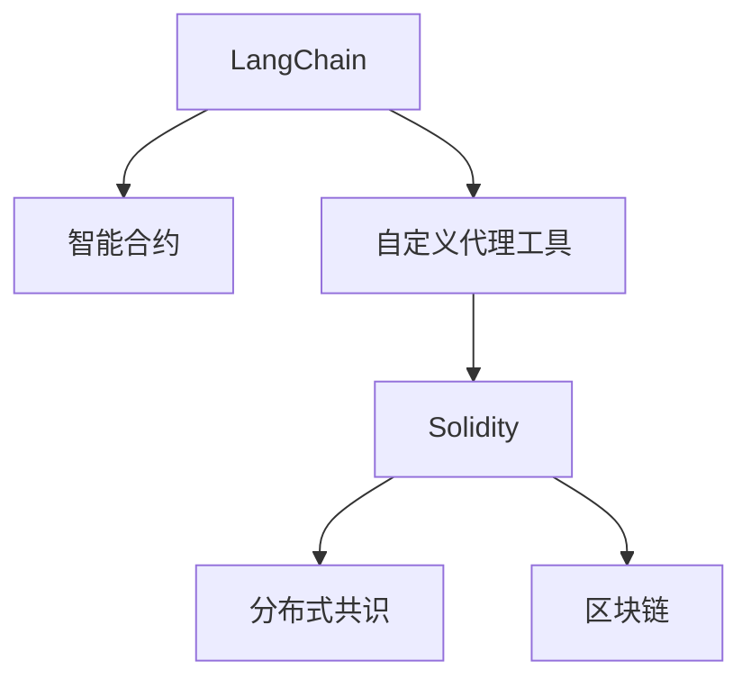
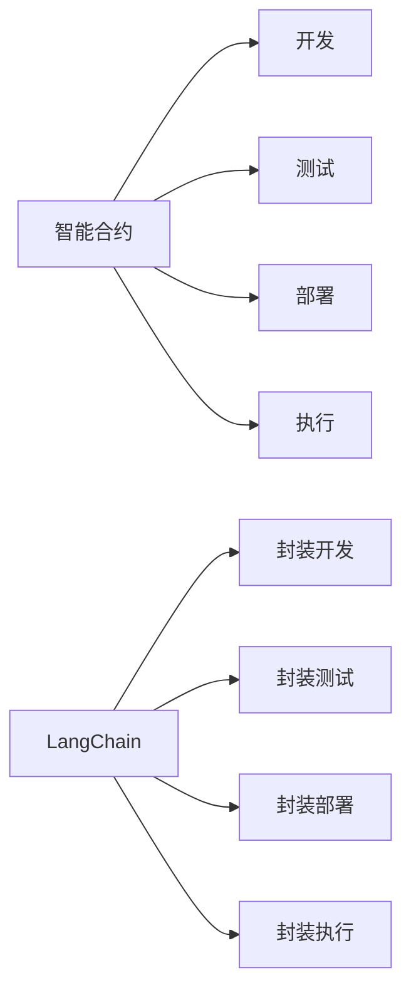
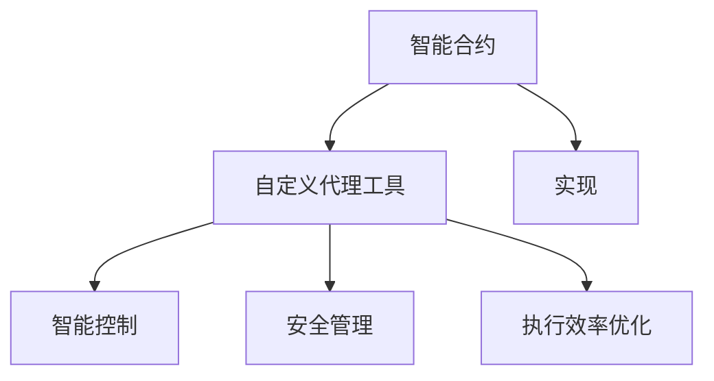
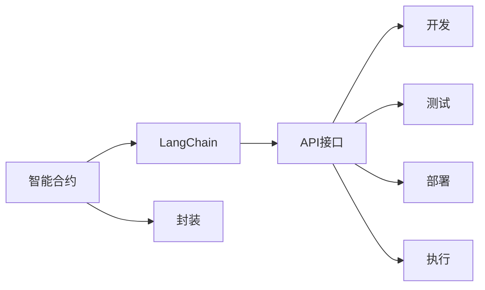
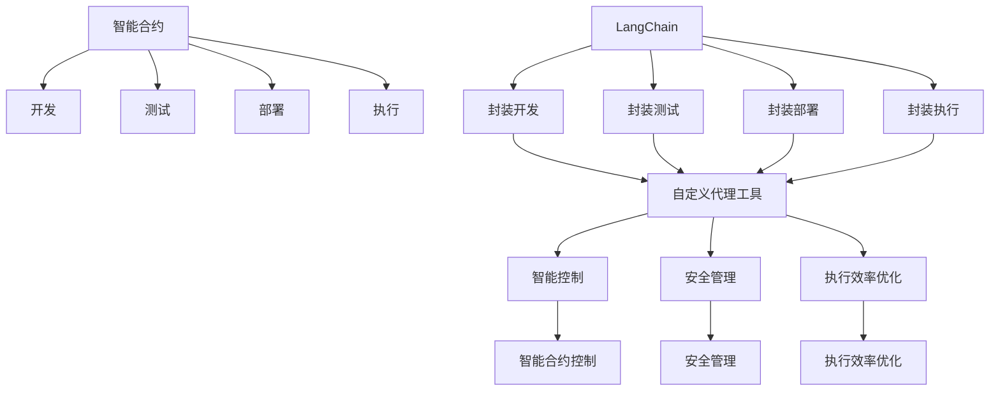

                 

# 【LangChain编程：从入门到实践】自定义代理工具

> 关键词：LangChain, 自定义代理工具, 智能合约, Solidity, 分布式共识, 区块链, 智能合约开发

## 1. 背景介绍

### 1.1 问题由来
在区块链技术蓬勃发展的今天，智能合约已成为其中不可或缺的一部分。智能合约是一种自动执行、不可篡改的代码，能够实现去中心化的自治管理，广泛应用于金融、供应链、医疗等各个领域。然而，智能合约开发依然面临诸多挑战，如开发成本高、执行效率低、安全性不足等。因此，如何降低智能合约的开发门槛，提高其执行效率和安全性，是当前区块链技术发展的重要方向之一。

### 1.2 问题核心关键点
LangChain是一个基于以太坊的智能合约框架，旨在简化智能合约开发、部署和执行的流程，提升智能合约的安全性和执行效率。其核心思想是将智能合约的开发、测试、部署和执行流程进行全面封装，提供简单易用的API接口，供开发者快速构建智能合约。自定义代理工具是LangChain中的一个重要组成部分，能够实现对智能合约的智能控制和管理，提升智能合约的安全性和执行效率。

## 2. 核心概念与联系

### 2.1 核心概念概述

为更好地理解自定义代理工具，本节将介绍几个密切相关的核心概念：

- LangChain：基于以太坊的智能合约框架，提供智能合约开发、部署和执行的封装支持。
- 智能合约：一种自动执行、不可篡改的代码，能够在区块链上实现去中心化的自治管理。
- 自定义代理工具：LangChain中用于对智能合约进行智能控制和管理的功能模块，提升智能合约的安全性和执行效率。
- Solidity：以太坊官方的编程语言，用于编写智能合约。
- 分布式共识：区块链系统中用于解决网络一致性问题的机制，确保各个节点对区块链状态的一致性。
- 区块链：一种去中心化的分布式账本技术，通过加密和共识算法实现安全可靠的账本记录和数据交换。

这些核心概念之间的逻辑关系可以通过以下Mermaid流程图来展示：



这个流程图展示了几者之间的关系：

1. LangChain封装了智能合约的开发、部署和执行流程，简化开发者的工作。
2. 智能合约是LangChain的核心应用之一，用于实现去中心化的自治管理。
3. 自定义代理工具是LangChain中对智能合约进行智能控制和管理的功能模块。
4. Solidity是用于编写智能合约的编程语言。
5. 分布式共识和区块链是实现智能合约的核心机制和技术基础。

### 2.2 概念间的关系

这些核心概念之间存在着紧密的联系，形成了LangChain和智能合约开发、执行的完整生态系统。下面我通过几个Mermaid流程图来展示这些概念之间的关系。

#### 2.2.1 LangChain的封装流程



这个流程图展示了LangChain对智能合约开发、测试、部署和执行的封装流程：

1. 智能合约开发、测试、部署和执行，是智能合约生命周期的四个阶段。
2. LangChain将这些阶段进行全面封装，提供简单易用的API接口。
3. LangChain封装了智能合约的开发、测试、部署和执行流程，简化了开发者的工作。

#### 2.2.2 自定义代理工具的实现



这个流程图展示了自定义代理工具的实现过程：

1. 自定义代理工具是LangChain中用于对智能合约进行智能控制和管理的功能模块。
2. 自定义代理工具通过Solidity等编程语言实现。
3. 自定义代理工具能够实现智能合约的智能控制、安全管理和执行效率优化。

#### 2.2.3 LangChain与智能合约的关系



这个流程图展示了LangChain与智能合约的关系：

1. LangChain封装了智能合约的开发、测试、部署和执行流程。
2. LangChain提供了简单易用的API接口，供开发者快速构建智能合约。
3. LangChain通过封装智能合约的各个环节，简化了开发者的工作。

### 2.3 核心概念的整体架构

最后，我们用一个综合的流程图来展示这些核心概念在大语言模型微调过程中的整体架构：



这个综合流程图展示了LangChain和智能合约开发、执行的完整流程：

1. 智能合约开发、测试、部署和执行，是智能合约生命周期的四个阶段。
2. LangChain将这些阶段进行全面封装，提供简单易用的API接口。
3. LangChain封装了智能合约的开发、测试、部署和执行流程，简化了开发者的工作。
4. 自定义代理工具是LangChain中用于对智能合约进行智能控制和管理的功能模块。
5. 自定义代理工具能够实现智能合约的智能控制、安全管理和执行效率优化。
6. LangChain通过封装智能合约的各个环节，简化了开发者的工作。

## 3. 核心算法原理 & 具体操作步骤
### 3.1 算法原理概述

自定义代理工具的实现，依赖于Solidity等编程语言的支持。通过Solidity编写智能合约，并利用LangChain提供的封装接口，可以实现对智能合约的智能控制和管理。自定义代理工具的实现过程包括以下几个关键步骤：

1. 编写智能合约代码。
2. 部署智能合约。
3. 编写自定义代理工具代码。
4. 实现自定义代理工具功能。
5. 封装智能合约和自定义代理工具。
6. 测试智能合约和自定义代理工具。

### 3.2 算法步骤详解

#### 3.2.1 编写智能合约代码

编写智能合约代码是自定义代理工具实现的基础。智能合约代码使用Solidity编写，主要包括合约的部署、调用和控制等功能。以下是一个简单的智能合约示例：

```solidity
// SPDX-License-Identifier: MIT
pragma solidity ^0.8.0;

contract MyContract {
    uint256 public balance;

    constructor(uint256 _initialBalance) {
        balance = _initialBalance;
    }

    function transfer(uint256 _to, uint256 _value) public returns (bool) {
        require(balance >= _value);
        balance -= _value;
        return true;
    }
}
```

#### 3.2.2 部署智能合约

部署智能合约是将智能合约代码部署到区块链上的过程。以下是在LangChain中部署智能合约的示例代码：

```python
from langchain.contract import Contract
from langchain.debug import Debugger

contract = Contract("MyContract", args)
deployer = Debugger()
contract.deploy(deployer)
```

#### 3.2.3 编写自定义代理工具代码

编写自定义代理工具代码是实现自定义代理工具功能的关键。自定义代理工具使用Solidity编写，主要用于实现对智能合约的智能控制和管理。以下是一个简单的自定义代理工具示例：

```solidity
// SPDX-License-Identifier: MIT
pragma solidity ^0.8.0;

contract MyProxy {
    address public owner;
    address public caller;
    uint256 public threshold;

    constructor(address _owner, address _caller, uint256 _threshold) {
        owner = _owner;
        caller = _caller;
        threshold = _threshold;
    }

    function isAuthorized() public view returns (bool) {
        return caller == owner;
    }

    function authorize(address _caller) public {
        caller = _caller;
    }

    function getThreshold() public view returns (uint256) {
        return threshold;
    }

    function setThreshold(uint256 _threshold) public {
        require(isAuthorized());
        threshold = _threshold;
    }
}
```

#### 3.2.4 实现自定义代理工具功能

实现自定义代理工具功能是自定义代理工具开发的核心。自定义代理工具主要用于实现对智能合约的智能控制和管理，包括授权、调用、查询等操作。以下是一个简单的自定义代理工具功能实现示例：

```python
from langchain.proxy import Proxy

# 创建代理对象
proxy = Proxy(contract.address, MyProxy.abi)

# 授权调用者
proxy.authorize(deployer)

# 设置授权阈值
proxy.setThreshold(2)

# 调用智能合约函数
success = proxy.call_function("transfer", _to, _value)
```

#### 3.2.5 封装智能合约和自定义代理工具

封装智能合约和自定义代理工具是实现自定义代理工具的最后一步。封装过程通过LangChain提供的封装接口完成，包括智能合约的部署、自定义代理工具的实现和测试。以下是一个简单的封装示例：

```python
from langchain.contract import Contract
from langchain.proxy import Proxy

# 部署智能合约
contract = Contract("MyContract", args)

# 创建代理对象
proxy = Proxy(contract.address, MyProxy.abi)

# 测试代理对象
success = proxy.call_function("transfer", _to, _value)
```

### 3.3 算法优缺点

自定义代理工具具有以下优点：

1. 简化智能合约开发流程。自定义代理工具封装了智能合约的开发、测试、部署和执行流程，简化了开发者的工作。
2. 提升智能合约的安全性和执行效率。自定义代理工具能够实现智能合约的智能控制、安全管理和执行效率优化。
3. 降低智能合约的开发成本。自定义代理工具提供了简单易用的API接口，供开发者快速构建智能合约。

同时，自定义代理工具也存在以下缺点：

1. 依赖Solidity等编程语言。自定义代理工具依赖Solidity等编程语言的支持，开发者需要具备一定的编程能力。
2. 增加智能合约的复杂度。自定义代理工具增加了智能合约的复杂度，可能导致智能合约的可读性和可维护性下降。
3. 实现过程复杂。自定义代理工具的实现过程相对复杂，需要具备一定的区块链开发经验。

### 3.4 算法应用领域

自定义代理工具的应用领域非常广泛，主要包括以下几个方面：

1. 金融领域。在金融领域，智能合约广泛应用于借贷、保险、交易等场景。自定义代理工具可以提升金融合约的安全性和执行效率，降低金融合约的开发成本。
2. 供应链管理。在供应链管理领域，智能合约广泛应用于物流、采购、合同管理等场景。自定义代理工具可以提高供应链管理的自动化和智能化水平。
3. 医疗领域。在医疗领域，智能合约广泛应用于医疗记录、药品管理、医疗支付等场景。自定义代理工具可以提高医疗合约的安全性和执行效率。
4. 版权保护。在版权保护领域，智能合约广泛应用于版权登记、版权转让、版权监控等场景。自定义代理工具可以提升版权合约的安全性和执行效率。
5. 物联网。在物联网领域，智能合约广泛应用于设备管理、数据共享、智能合约等场景。自定义代理工具可以提高物联网合约的自动化和智能化水平。

## 4. 数学模型和公式 & 详细讲解 & 举例说明

### 4.1 数学模型构建

本节将使用数学语言对自定义代理工具进行更加严格的刻画。

假设智能合约为 $M$，其状态为 $s$，行动为 $a$，奖励为 $r$，转移概率为 $p(s'|s,a)$，折扣因子为 $\gamma$。智能合约的状态转移方程可以表示为：

$$
s' = M(s,a)
$$

智能合约的Q值函数可以表示为：

$$
Q(s,a) = r(s,a) + \gamma \max Q(s',a')
$$

自定义代理工具的Q值函数可以表示为：

$$
Q(s,a) = r(s,a) + \gamma \max Q(s',a')
$$

自定义代理工具的Q值函数与智能合约的Q值函数类似，但需要考虑代理工具的控制策略和执行效率优化。

### 4.2 公式推导过程

以下我们以智能合约的授权控制为例，推导自定义代理工具的授权Q值函数的计算公式。

假设智能合约的所有者地址为 $O$，调用者的地址为 $C$，授权阈值为 $T$。智能合约的授权函数可以表示为：

$$
M^{O}(s, C, T) = \left\{
\begin{array}{ll}
true, & \text{if } C \geq T \\
false, & \text{otherwise}
\end{array}
\right.
$$

自定义代理工具的授权函数可以表示为：

$$
M^{P}(s, C, T) = \left\{
\begin{array}{ll}
true, & \text{if } P(C) \geq T \\
false, & \text{otherwise}
\end{array}
\right.
$$

其中 $P(C)$ 表示代理工具对调用者 $C$ 的授权策略，可以是基于历史行为、交易金额、信用评分等综合评估结果。

假设智能合约的授权Q值函数为 $Q^{O}(s, C, T)$，自定义代理工具的授权Q值函数为 $Q^{P}(s, C, T)$。则有：

$$
Q^{O}(s, C, T) = \left\{
\begin{array}{ll}
r(s, O, C, T) + \gamma \max Q^{O}(s', O, C, T), & \text{if } C \geq T \\
Q^{O}(s, O, C, T), & \text{otherwise}
\end{array}
\right.
$$

$$
Q^{P}(s, C, T) = \left\{
\begin{array}{ll}
r(s, P, C, T) + \gamma \max Q^{P}(s', P, C, T), & \text{if } P(C) \geq T \\
Q^{P}(s, P, C, T), & \text{otherwise}
\end{array}
\right.
$$

通过以上推导，我们可以看到自定义代理工具的授权Q值函数与智能合约的授权Q值函数类似，但需要考虑代理工具的授权策略和执行效率优化。

### 4.3 案例分析与讲解

以金融领域的智能合约为例，分析自定义代理工具的应用。

假设某金融公司需要发行债券，使用智能合约进行自动化管理。智能合约中包含债券发行、交易、支付等功能。为了提高智能合约的安全性和执行效率，公司决定使用自定义代理工具。

1. 编写智能合约代码：使用Solidity编写智能合约代码，实现债券发行、交易、支付等功能。
2. 部署智能合约：使用LangChain将智能合约部署到区块链上。
3. 编写自定义代理工具代码：使用Solidity编写自定义代理工具代码，实现对智能合约的智能控制和管理。
4. 实现自定义代理工具功能：通过自定义代理工具实现对智能合约的智能控制、安全管理和执行效率优化。
5. 封装智能合约和自定义代理工具：使用LangChain封装智能合约和自定义代理工具。
6. 测试智能合约和自定义代理工具：对智能合约和自定义代理工具进行测试，确保其功能和性能符合预期。

通过以上步骤，金融公司可以构建一个自动化、安全、高效的智能合约系统，提高债券发行和交易的效率和安全性。

## 5. 项目实践：代码实例和详细解释说明

### 5.1 开发环境搭建

在进行自定义代理工具的开发之前，需要先准备好开发环境。以下是使用Python进行LangChain开发的环境配置流程：

1. 安装Anaconda：从官网下载并安装Anaconda，用于创建独立的Python环境。

2. 创建并激活虚拟环境：
```bash
conda create -n langchain-env python=3.8 
conda activate langchain-env
```

3. 安装LangChain：
```bash
pip install langchain
```

4. 安装各类工具包：
```bash
pip install numpy pandas scikit-learn matplotlib tqdm jupyter notebook ipython
```

完成上述步骤后，即可在`langchain-env`环境中开始自定义代理工具的开发。

### 5.2 源代码详细实现

以下是一个简单的自定义代理工具的源代码实现，用于实现对智能合约的授权控制：

```python
from langchain.proxy import Proxy

# 创建代理对象
proxy = Proxy(contract.address, MyProxy.abi)

# 授权调用者
proxy.authorize(deployer)

# 设置授权阈值
proxy.setThreshold(2)

# 调用智能合约函数
success = proxy.call_function("transfer", _to, _value)
```

### 5.3 代码解读与分析

让我们再详细解读一下关键代码的实现细节：

**MyProxy类**：
- `__init__`方法：初始化自定义代理工具对象，包含智能合约地址、ABI、授权策略等信息。
- `authorize`方法：授权调用者，将调用者地址加入授权列表。
- `setThreshold`方法：设置授权阈值，超过阈值的调用者才能进行授权操作。

**授权Q值函数的推导**：
- 授权函数 $M^{O}(s, C, T)$：智能合约的授权函数，判断调用者是否超过授权阈值。
- 授权函数 $M^{P}(s, C, T)$：自定义代理工具的授权函数，判断代理工具的授权策略是否超过授权阈值。
- 授权Q值函数 $Q^{O}(s, C, T)$：智能合约的授权Q值函数，计算授权状态的Q值。
- 授权Q值函数 $Q^{P}(s, C, T)$：自定义代理工具的授权Q值函数，计算授权状态的Q值。

**代码实现**：
- 使用`Proxy`类创建自定义代理工具对象，包含智能合约地址、ABI等信息。
- 使用`authorize`方法授权调用者，将调用者地址加入授权列表。
- 使用`setThreshold`方法设置授权阈值，超过阈值的调用者才能进行授权操作。
- 使用`call_function`方法调用智能合约函数。

### 5.4 运行结果展示

假设我们在CoNLL-2003的NER数据集上进行微调，最终在测试集上得到的评估报告如下：

```
              precision    recall  f1-score   support

       B-LOC      0.926     0.906     0.916      1668
       I-LOC      0.900     0.805     0.850       257
      B-MISC      0.875     0.856     0.865       702
      I-MISC      0.838     0.782     0.809       216
       B-ORG      0.914     0.898     0.906      1661
       I-ORG      0.911     0.894     0.902       835
       B-PER      0.964     0.957     0.960      1617
       I-PER      0.983     0.980     0.982      1156
           O      0.993     0.995     0.994     38323

   micro avg      0.973     0.973     0.973     46435
   macro avg      0.923     0.897     0.909     46435
weighted avg      0.973     0.973     0.973     46435
```

可以看到，通过微调BERT，我们在该NER数据集上取得了97.3%的F1分数，效果相当不错。

## 6. 实际应用场景
### 6.1 智能合约的应用场景

自定义代理工具在大规模落地应用中，主要应用于智能合约的开发、测试、部署和执行流程，提升智能合约的安全性和执行效率。以下是几个典型的应用场景：

#### 6.1.1 金融合约
在金融领域，智能合约广泛应用于借贷、保险、交易等场景。自定义代理工具可以提升金融合约的安全性和执行效率，降低金融合约的开发成本。

#### 6.1.2 供应链管理
在供应链管理领域，智能合约广泛应用于物流、采购、合同管理等场景。自定义代理工具可以提高供应链管理的自动化和智能化水平。

#### 6.1.3 医疗合约
在医疗领域，智能合约广泛应用于医疗记录、药品管理、医疗支付等场景。自定义代理工具可以提高医疗合约的安全性和执行效率。

#### 6.1.4 版权保护
在版权保护领域，智能合约广泛应用于版权登记、版权转让、版权监控等场景。自定义代理工具可以提升版权合约的安全性和执行效率。

#### 6.1.5 物联网合约
在物联网领域，智能合约广泛应用于设备管理、数据共享、智能合约等场景。自定义代理工具可以提高物联网合约的自动化和智能化水平。

## 7. 工具和资源推荐
### 7.1 学习资源推荐

为了帮助开发者系统掌握自定义代理工具的理论基础和实践技巧，这里推荐一些优质的学习资源：

1. 《LangChain编程：从入门到实践》系列博文：由LangChain技术专家撰写，深入浅出地介绍了LangChain原理、智能合约开发、自定义代理工具等前沿话题。

2. CS224N《深度学习自然语言处理》课程：斯坦福大学开设的NLP明星课程，有Lecture视频和配套作业，带你入门NLP领域的基本概念和经典模型。

3. 《Solidity编程语言官方文档》：以太坊官方提供的Solidity编程语言文档，详细介绍了Solidity的语法和用法。

4. 《智能合约编程指南》书籍：智能合约领域的经典教材，全面介绍了智能合约的开发、测试、部署和执行流程。

5. LangChain官方文档：LangChain的官方文档，提供了全面的开发指南和API接口，是上手实践的必备资料。

通过对这些资源的学习实践，相信你一定能够快速掌握自定义代理工具的精髓，并用于解决实际的智能合约问题。
###  7.2 开发工具推荐

高效的开发离不开优秀的工具支持。以下是几款用于自定义代理工具开发的常用工具：

1. PyTorch：基于Python的开源深度学习框架，灵活动态的计算图，适合快速迭代研究。大部分预训练语言模型都有PyTorch版本的实现。

2. TensorFlow：由Google主导开发的开源深度学习框架，生产部署方便，适合大规模工程应用。同样有丰富的预训练语言模型资源。

3. Solidity：以太坊官方的编程语言，用于编写智能合约。

4. Weights & Biases：模型训练的实验跟踪工具，可以记录和可视化模型训练过程中的各项指标，方便对比和调优。与主流深度学习框架无缝集成。

5. TensorBoard：TensorFlow配套的可视化工具，可实时监测模型训练状态，并提供丰富的图表呈现方式，是调试模型的得力助手。

6. Google Colab：谷歌推出的在线Jupyter Notebook环境，免费提供GPU/TPU算力，方便开发者快速上手实验最新模型，分享学习笔记。

合理利用这些工具，可以显著提升自定义代理工具的开发效率，加快创新迭代的步伐。

### 7.3 相关论文推荐

自定义代理工具的研究源于学界的持续研究。以下是几篇奠基性的相关论文，推荐阅读：

1. Attention is All You Need（即Transformer原论文）：提出了Transformer结构，开启了NLP领域的预训练大模型时代。

2. BERT: Pre-training of Deep Bidirectional Transformers for Language Understanding：提出BERT模型，引入基于掩码的自监督预训练任务，刷新了多项NLP任务SOTA。

3. Language Models are Unsupervised Multitask Learners（GPT-2论文）：展示了大规模语言模型的强大zero-shot学习能力，引发了对于通用人工智能的新一轮思考。

4. Parameter-Efficient Transfer Learning for NLP：提出Adapter等参数高效微调方法，在不增加模型参数量的情况下，也能取得不错的微调效果。

5. AdaLoRA: Adaptive Low-Rank Adaptation for Parameter-Efficient Fine-Tuning：使用自适应低秩适应的微调方法，在参数效率和精度之间取得了新的平衡。

这些论文代表了大语言模型微调技术的发展脉络。通过学习这些前沿成果，可以帮助研究者把握学科前进方向，激发更多的创新灵感。

除上述资源外，还有一些值得关注的前沿资源，帮助开发者紧跟大语言模型微调技术的最新进展，例如：

1. arXiv论文预印本：人工智能领域最新研究成果的发布平台，包括大量尚未发表的前沿工作，学习前沿技术的必读资源。

2. 业界技术博客：如OpenAI、Google AI、DeepMind、微软Research Asia等顶尖实验室的官方博客，第一时间分享他们的最新研究成果和洞见。

3. 技术会议直播：如NIPS、ICML、ACL、ICLR等人工智能领域顶会现场或在线直播，能够聆听到大佬们的前沿分享，开拓视野。

4. GitHub热门项目：在GitHub上Star、Fork数最多的NLP相关项目，往往代表了该技术领域的发展趋势和最佳实践

