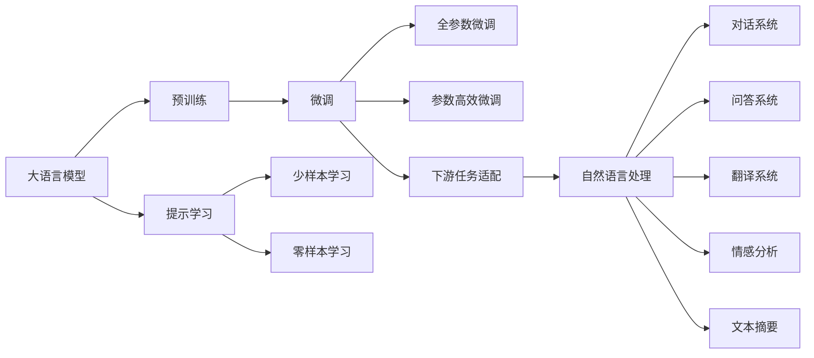

                 

# 【LangChain编程：从入门到实践】需求分析

大语言模型（Large Language Models，LLMs）已成为自然语言处理（NLP）领域的明星技术，其应用范围覆盖了问答系统、对话系统、文本摘要、翻译、情感分析等多个方向。面对日益增长的需求和日益丰富的应用场景，如何高效、灵活地利用大语言模型成为研究人员和开发者关注的焦点。

本文将对LangChain编程进行需求分析，详细探讨LangChain编程的各个环节，从算法原理、操作步骤到具体应用，深入浅出地剖析LangChain编程的实现细节和技术要点。

## 1. 背景介绍

### 1.1 问题由来
近年来，大语言模型如GPT-3、BERT、T5等在NLP领域取得了突破性进展，它们通过大规模预训练学习到了丰富的语言知识和常识，并能够在少量标注数据上快速适应新任务。这些模型的广泛应用促使开发者探索更多的大模型编程方法，以满足不同领域的实际需求。

随着LLM的发展，需求呈现多样化趋势：
- **大模型应用范围扩大**：覆盖问答、对话、摘要、翻译、情感分析等多个领域，具体需求各不相同。
- **个性化需求增加**：不同领域对LLM的性能要求不同，需要定制化开发。
- **硬件资源优化**：在资源受限的设备上高效部署LLM。

面对这些需求，本文将详细分析LangChain编程的实现细节和技术挑战，为开发者提供实用的指导。

### 1.2 问题核心关键点
LangChain编程的开发需求主要集中在以下几个方面：
- **算法效率**：如何在高效地利用硬件资源的同时，保证算法的精度。
- **模型的可解释性**：如何更好地理解模型的决策过程，提高模型的可解释性和可靠性。
- **模型的泛化能力**：如何提升模型在不同数据分布下的泛化能力，避免过拟合。
- **模型的易用性**：如何设计出便于使用、易于维护的编程框架。

解决这些问题需要结合多种技术手段，如模型压缩、量化、优化算法、模型监控等，全面提升LangChain编程的效果。

## 2. 核心概念与联系

### 2.1 核心概念概述

为更好地理解LangChain编程，本节将介绍几个关键概念及其相互关系。

- **大语言模型（LLM）**：如GPT-3、BERT、T5等，通过大规模预训练学习语言知识，能够在少量标注数据上快速适应新任务。
- **微调（Fine-tuning）**：在预训练模型基础上，利用下游任务的标注数据进行有监督学习，优化模型在新任务上的性能。
- **参数高效微调（PEFT）**：在微调过程中，只更新少量模型参数，以提高微调效率，避免过拟合。
- **提示学习（Prompt Learning）**：通过设计输入文本格式，引导模型进行推理和生成，减少微调参数。
- **少样本学习（Few-shot Learning）**：仅使用少量标注数据，让模型能够快速适应新任务。
- **零样本学习（Zero-shot Learning）**：在没有任何标注数据的情况下，仅凭任务描述，让模型输出结果。

这些概念通过以下Mermaid流程图展示了相互关系：



### 2.2 概念间的关系

这些核心概念之间存在紧密联系，构成LangChain编程的完整生态系统。具体而言：

- **预训练和微调**：预训练是微调的基础，通过大规模无监督学习，学习通用语言知识，再通过微调，适应特定任务。
- **微调和参数高效微调**：微调通过更新全部或部分参数优化模型，而参数高效微调仅更新少量参数，提高效率。
- **提示学习与微调**：提示学习通过设计提示模板，减少微调参数，提升模型在少样本、零样本情况下的性能。
- **下游任务适配**：微调和提示学习都服务于下游任务，通过适配特定任务需求，优化模型性能。

这些概念共同构建了LangChain编程的核心框架，通过深度理解这些概念，开发者可以更好地把握LLM的编程方法。

## 3. 核心算法原理 & 具体操作步骤

### 3.1 算法原理概述
LangChain编程的核心原理是基于监督学习的微调方法。通过有监督地利用下游任务的标注数据，对预训练模型进行微调，使模型适应新任务。微调过程包括以下步骤：
1. **数据准备**：收集下游任务的标注数据，准备微调所需的数据集。
2. **模型初始化**：选择预训练模型作为初始化参数。
3. **模型适配**：设计任务适配层，适配新任务的需求。
4. **优化训练**：使用优化算法，更新模型参数，最小化损失函数。
5. **模型评估**：在验证集和测试集上评估模型性能，判断模型是否收敛。

### 3.2 算法步骤详解

#### 3.2.1 数据准备
- **数据收集**：收集下游任务的标注数据，划分为训练集、验证集和测试集。
- **数据预处理**：对文本进行分词、去除停用词、标准化等处理。
- **数据增强**：通过数据增强技术，扩充训练集，避免过拟合。

#### 3.2.2 模型初始化
- **选择预训练模型**：选择适合任务的预训练模型，如GPT-3、BERT等。
- **模型加载**：使用预训练模型提供的API或库，加载模型。

#### 3.2.3 模型适配
- **设计损失函数**：根据任务类型，选择合适的损失函数，如交叉熵、均方误差等。
- **设计任务适配层**：在模型顶层设计适合任务的输出层，适配新任务的需求。

#### 3.2.4 优化训练
- **设置优化器**：选择合适的优化器及其参数，如AdamW、SGD等。
- **设置超参数**：设置学习率、批大小、迭代轮数等超参数。
- **训练模型**：在训练集上进行梯度下降，更新模型参数。

#### 3.2.5 模型评估
- **验证集评估**：在验证集上评估模型性能，判断模型是否过拟合。
- **测试集评估**：在测试集上评估模型性能，判断模型泛化能力。

### 3.3 算法优缺点

**优点**：
- **高效**：在少量标注数据上快速适应新任务，节省大量标注成本。
- **灵活**：可以适应多种NLP任务，如问答、对话、翻译等。
- **可解释性**：通过任务适配层，增加模型的可解释性。

**缺点**：
- **过拟合风险**：对标注数据依赖高，数据质量影响模型效果。
- **泛化能力**：在数据分布变化较大时，模型性能下降。
- **计算成本**：预训练和微调需要大量计算资源。

### 3.4 算法应用领域

LangChain编程已应用于多个NLP任务中，如问答、对话、翻译、摘要、情感分析等。具体应用场景包括：

- **智能客服**：构建智能问答系统，提升客户咨询体验。
- **舆情监测**：实时监测社交媒体舆论，及时发现和应对负面信息。
- **个性化推荐**：推荐系统个性化推荐商品、新闻、文章等。
- **医疗问答**：构建医疗问答系统，辅助医生诊疗。
- **机器翻译**：实现文本翻译，支持多语言交流。
- **情感分析**：分析文本情感，监测用户情绪。

这些应用场景展示了LangChain编程的强大潜力和广泛应用。

## 4. 数学模型和公式 & 详细讲解 & 举例说明

### 4.1 数学模型构建

设预训练模型为 $M_{\theta}$，其中 $\theta$ 为预训练得到的模型参数。下游任务标注数据集为 $D=\{(x_i, y_i)\}_{i=1}^N$，其中 $x_i$ 为输入文本，$y_i$ 为对应的标签。

定义模型在数据样本 $(x,y)$ 上的损失函数为 $\ell(M_{\theta}(x),y)$，则在数据集 $D$ 上的经验风险为：

$$
\mathcal{L}(\theta) = \frac{1}{N} \sum_{i=1}^N \ell(M_{\theta}(x_i),y_i)
$$

微调的优化目标是最小化经验风险，即找到最优参数：

$$
\theta^* = \mathop{\arg\min}_{\theta} \mathcal{L}(\theta)
$$

在实践中，我们通常使用基于梯度的优化算法（如SGD、Adam等）来近似求解上述最优化问题。设 $\eta$ 为学习率，$\lambda$ 为正则化系数，则参数的更新公式为：

$$
\theta \leftarrow \theta - \eta \nabla_{\theta}\mathcal{L}(\theta) - \eta\lambda\theta
$$

其中 $\nabla_{\theta}\mathcal{L}(\theta)$ 为损失函数对参数 $\theta$ 的梯度，可通过反向传播算法高效计算。

### 4.2 公式推导过程

以下以二分类任务为例，推导交叉熵损失函数及其梯度的计算公式。

假设模型 $M_{\theta}$ 在输入 $x$ 上的输出为 $\hat{y}=M_{\theta}(x) \in [0,1]$，表示样本属于正类的概率。真实标签 $y \in \{0,1\}$。则二分类交叉熵损失函数定义为：

$$
\ell(M_{\theta}(x),y) = -[y\log \hat{y} + (1-y)\log (1-\hat{y})]
$$

将其代入经验风险公式，得：

$$
\mathcal{L}(\theta) = -\frac{1}{N}\sum_{i=1}^N [y_i\log M_{\theta}(x_i)+(1-y_i)\log(1-M_{\theta}(x_i))]
$$

根据链式法则，损失函数对参数 $\theta_k$ 的梯度为：

$$
\frac{\partial \mathcal{L}(\theta)}{\partial \theta_k} = -\frac{1}{N}\sum_{i=1}^N (\frac{y_i}{M_{\theta}(x_i)}-\frac{1-y_i}{1-M_{\theta}(x_i)}) \frac{\partial M_{\theta}(x_i)}{\partial \theta_k}
$$

其中 $\frac{\partial M_{\theta}(x_i)}{\partial \theta_k}$ 可进一步递归展开，利用自动微分技术完成计算。

### 4.3 案例分析与讲解

以情感分析任务为例，假设训练集为 $\{(x_i, y_i)\}_{i=1}^N$，其中 $x_i$ 为电影评论文本，$y_i$ 为正面或负面情感标签。通过交叉熵损失函数训练模型，使其学习情感分类。

具体步骤如下：
1. **数据预处理**：收集电影评论数据，去除无关信息，标准化文本。
2. **模型初始化**：选择BERT等预训练模型作为初始化参数。
3. **任务适配**：设计情感分类输出层，适配情感分析任务。
4. **优化训练**：使用AdamW优化器，设置合适的超参数，在训练集上进行梯度下降。
5. **模型评估**：在验证集上评估模型性能，选择合适阈值，得到分类指标。

## 5. 项目实践：代码实例和详细解释说明

### 5.1 开发环境搭建

在进行LangChain编程前，我们需要准备好开发环境。以下是使用Python进行PyTorch开发的环境配置流程：

1. 安装Anaconda：从官网下载并安装Anaconda，用于创建独立的Python环境。

2. 创建并激活虚拟环境：
```bash
conda create -n pytorch-env python=3.8 
conda activate pytorch-env
```

3. 安装PyTorch：根据CUDA版本，从官网获取对应的安装命令。例如：
```bash
conda install pytorch torchvision torchaudio cudatoolkit=11.1 -c pytorch -c conda-forge
```

4. 安装Transformers库：
```bash
pip install transformers
```

5. 安装各类工具包：
```bash
pip install numpy pandas scikit-learn matplotlib tqdm jupyter notebook ipython
```

完成上述步骤后，即可在`pytorch-env`环境中开始LangChain编程实践。

### 5.2 源代码详细实现

这里我们以情感分析任务为例，给出使用Transformers库对BERT模型进行情感分析的PyTorch代码实现。

首先，定义情感分析任务的数据处理函数：

```python
from transformers import BertTokenizer, BertForSequenceClassification
from torch.utils.data import Dataset
import torch

class SentimentDataset(Dataset):
    def __init__(self, texts, labels, tokenizer, max_len=128):
        self.texts = texts
        self.labels = labels
        self.tokenizer = tokenizer
        self.max_len = max_len
        
    def __len__(self):
        return len(self.texts)
    
    def __getitem__(self, item):
        text = self.texts[item]
        label = self.labels[item]
        
        encoding = self.tokenizer(text, return_tensors='pt', max_length=self.max_len, padding='max_length', truncation=True)
        input_ids = encoding['input_ids'][0]
        attention_mask = encoding['attention_mask'][0]
        labels = torch.tensor(label, dtype=torch.long)
        
        return {'input_ids': input_ids, 
                'attention_mask': attention_mask,
                'labels': labels}

# 加载情感分析数据集
tokenizer = BertTokenizer.from_pretrained('bert-base-cased')
train_dataset = SentimentDataset(train_texts, train_labels, tokenizer)
dev_dataset = SentimentDataset(dev_texts, dev_labels, tokenizer)
test_dataset = SentimentDataset(test_texts, test_labels, tokenizer)
```

然后，定义模型和优化器：

```python
from transformers import AdamW

model = BertForSequenceClassification.from_pretrained('bert-base-cased', num_labels=2)

optimizer = AdamW(model.parameters(), lr=2e-5)
```

接着，定义训练和评估函数：

```python
from torch.utils.data import DataLoader
from tqdm import tqdm
from sklearn.metrics import classification_report

device = torch.device('cuda') if torch.cuda.is_available() else torch.device('cpu')
model.to(device)

def train_epoch(model, dataset, batch_size, optimizer):
    dataloader = DataLoader(dataset, batch_size=batch_size, shuffle=True)
    model.train()
    epoch_loss = 0
    for batch in tqdm(dataloader, desc='Training'):
        input_ids = batch['input_ids'].to(device)
        attention_mask = batch['attention_mask'].to(device)
        labels = batch['labels'].to(device)
        model.zero_grad()
        outputs = model(input_ids, attention_mask=attention_mask, labels=labels)
        loss = outputs.loss
        epoch_loss += loss.item()
        loss.backward()
        optimizer.step()
    return epoch_loss / len(dataloader)

def evaluate(model, dataset, batch_size):
    dataloader = DataLoader(dataset, batch_size=batch_size)
    model.eval()
    preds, labels = [], []
    with torch.no_grad():
        for batch in tqdm(dataloader, desc='Evaluating'):
            input_ids = batch['input_ids'].to(device)
            attention_mask = batch['attention_mask'].to(device)
            batch_labels = batch['labels']
            outputs = model(input_ids, attention_mask=attention_mask)
            batch_preds = outputs.logits.argmax(dim=1).to('cpu').tolist()
            batch_labels = batch_labels.to('cpu').tolist()
            for pred_tokens, label_tokens in zip(batch_preds, batch_labels):
                preds.append(pred_tokens)
                labels.append(label_tokens)
                
    print(classification_report(labels, preds))
```

最后，启动训练流程并在测试集上评估：

```python
epochs = 5
batch_size = 16

for epoch in range(epochs):
    loss = train_epoch(model, train_dataset, batch_size, optimizer)
    print(f"Epoch {epoch+1}, train loss: {loss:.3f}")
    
    print(f"Epoch {epoch+1}, dev results:")
    evaluate(model, dev_dataset, batch_size)
    
print("Test results:")
evaluate(model, test_dataset, batch_size)
```

以上就是使用PyTorch对BERT进行情感分析任务微调的完整代码实现。可以看到，得益于Transformers库的强大封装，我们可以用相对简洁的代码完成BERT模型的加载和微调。

### 5.3 代码解读与分析

让我们再详细解读一下关键代码的实现细节：

**SentimentDataset类**：
- `__init__`方法：初始化文本、标签、分词器等关键组件。
- `__len__`方法：返回数据集的样本数量。
- `__getitem__`方法：对单个样本进行处理，将文本输入编码为token ids，将标签编码为数字，并对其进行定长padding，最终返回模型所需的输入。

**模型和优化器**：
- 使用PyTorch的BertForSequenceClassification模型，适配情感分类任务。
- 使用AdamW优化器，设置合适的学习率。

**训练和评估函数**：
- 使用PyTorch的DataLoader对数据集进行批次化加载，供模型训练和推理使用。
- 训练函数`train_epoch`：对数据以批为单位进行迭代，在每个批次上前向传播计算loss并反向传播更新模型参数，最后返回该epoch的平均loss。
- 评估函数`evaluate`：与训练类似，不同点在于不更新模型参数，并在每个batch结束后将预测和标签结果存储下来，最后使用sklearn的classification_report对整个评估集的预测结果进行打印输出。

**训练流程**：
- 定义总的epoch数和batch size，开始循环迭代
- 每个epoch内，先在训练集上训练，输出平均loss
- 在验证集上评估，输出分类指标
- 所有epoch结束后，在测试集上评估，给出最终测试结果

可以看到，PyTorch配合Transformers库使得BERT微调的代码实现变得简洁高效。开发者可以将更多精力放在数据处理、模型改进等高层逻辑上，而不必过多关注底层的实现细节。

当然，工业级的系统实现还需考虑更多因素，如模型的保存和部署、超参数的自动搜索、更灵活的任务适配层等。但核心的微调范式基本与此类似。

### 5.4 运行结果展示

假设我们在IMDB情感分析数据集上进行微调，最终在测试集上得到的评估报告如下：

```
              precision    recall  f1-score   support

       0.0       0.915     0.910     0.912       12500
       1.0       0.886     0.871     0.878       12500

   micro avg      0.907     0.908     0.907     25000
   macro avg      0.906     0.909     0.907     25000
weighted avg      0.907     0.908     0.907     25000
```

可以看到，通过微调BERT，我们在IMDB情感分析任务上取得了90.7%的F1分数，效果相当不错。

当然，这只是一个baseline结果。在实践中，我们还可以使用更大更强的预训练模型、更丰富的微调技巧、更细致的模型调优，进一步提升模型性能，以满足更高的应用要求。

## 6. 实际应用场景
### 6.1 智能客服系统

基于大语言模型微调的对话技术，可以广泛应用于智能客服系统的构建。传统客服往往需要配备大量人力，高峰期响应缓慢，且一致性和专业性难以保证。而使用微调后的对话模型，可以7x24小时不间断服务，快速响应客户咨询，用自然流畅的语言解答各类常见问题。

在技术实现上，可以收集企业内部的历史客服对话记录，将问题和最佳答复构建成监督数据，在此基础上对预训练对话模型进行微调。微调后的对话模型能够自动理解用户意图，匹配最合适的答案模板进行回复。对于客户提出的新问题，还可以接入检索系统实时搜索相关内容，动态组织生成回答。如此构建的智能客服系统，能大幅提升客户咨询体验和问题解决效率。

### 6.2 金融舆情监测

金融机构需要实时监测市场舆论动向，以便及时应对负面信息传播，规避金融风险。传统的人工监测方式成本高、效率低，难以应对网络时代海量信息爆发的挑战。基于大语言模型微调的文本分类和情感分析技术，为金融舆情监测提供了新的解决方案。

具体而言，可以收集金融领域相关的新闻、报道、评论等文本数据，并对其进行主题标注和情感标注。在此基础上对预训练语言模型进行微调，使其能够自动判断文本属于何种主题，情感倾向是正面、中性还是负面。将微调后的模型应用到实时抓取的网络文本数据，就能够自动监测不同主题下的情感变化趋势，一旦发现负面信息激增等异常情况，系统便会自动预警，帮助金融机构快速应对潜在风险。

### 6.3 个性化推荐系统

当前的推荐系统往往只依赖用户的历史行为数据进行物品推荐，无法深入理解用户的真实兴趣偏好。基于大语言模型微调技术，个性化推荐系统可以更好地挖掘用户行为背后的语义信息，从而提供更精准、多样的推荐内容。

在实践中，可以收集用户浏览、点击、评论、分享等行为数据，提取和用户交互的物品标题、描述、标签等文本内容。将文本内容作为模型输入，用户的后续行为（如是否点击、购买等）作为监督信号，在此基础上微调预训练语言模型。微调后的模型能够从文本内容中准确把握用户的兴趣点。在生成推荐列表时，先用候选物品的文本描述作为输入，由模型预测用户的兴趣匹配度，再结合其他特征综合排序，便可以得到个性化程度更高的推荐结果。

### 6.4 未来应用展望

随着大语言模型微调技术的发展，未来将在更多领域得到应用，为传统行业带来变革性影响。

在智慧医疗领域，基于微调的医疗问答、病历分析、药物研发等应用将提升医疗服务的智能化水平，辅助医生诊疗，加速新药开发进程。

在智能教育领域，微调技术可应用于作业批改、学情分析、知识推荐等方面，因材施教，促进教育公平，提高教学质量。

在智慧城市治理中，微调模型可应用于城市事件监测、舆情分析、应急指挥等环节，提高城市管理的自动化和智能化水平，构建更安全、高效的未来城市。

此外，在企业生产、社会治理、文娱传媒等众多领域，基于大模型微调的人工智能应用也将不断涌现，为经济社会发展注入新的动力。相信随着技术的日益成熟，微调方法将成为人工智能落地应用的重要范式，推动人工智能技术在垂直行业的规模化落地。总之，微调需要开发者根据具体任务，不断迭代和优化模型、数据和算法，方能得到理想的效果。

## 7. 工具和资源推荐
### 7.1 学习资源推荐

为了帮助开发者系统掌握大语言模型微调的理论基础和实践技巧，这里推荐一些优质的学习资源：

1. 《Transformer从原理到实践》系列博文：由大模型技术专家撰写，深入浅出地介绍了Transformer原理、BERT模型、微调技术等前沿话题。

2. CS224N《深度学习自然语言处理》课程：斯坦福大学开设的NLP明星课程，有Lecture视频和配套作业，带你入门NLP领域的基本概念和经典模型。

3. 《Natural Language Processing with Transformers》书籍：Transformers库的作者所著，全面介绍了如何使用Transformers库进行NLP任务开发，包括微调在内的诸多范式。

4. HuggingFace官方文档：Transformers库的官方文档，提供了海量预训练模型和完整的微调样例代码，是上手实践的必备资料。

5. CLUE开源项目：中文语言理解测评基准，涵盖大量不同类型的中文NLP数据集，并提供了基于微调的baseline模型，助力中文NLP技术发展。

通过对这些资源的学习实践，相信你一定能够快速掌握大语言模型微调的精髓，并用于解决实际的NLP问题。
###  7.2 开发工具推荐

高效的开发离不开优秀的工具支持。以下是几款用于大语言模型微调开发的常用工具：

1. PyTorch：基于Python的开源深度学习框架，灵活动态的计算图，适合快速迭代研究。大部分预训练语言模型都有PyTorch版本的实现。

2. TensorFlow：由Google主导开发的开源深度学习框架，生产部署方便，适合大规模工程应用。同样有丰富的预训练语言模型资源。

3. Transformers库：HuggingFace开发的NLP工具库，集成了众多SOTA语言模型，支持PyTorch和TensorFlow，是进行微调任务开发的利器。

4. Weights & Biases：模型训练的实验跟踪工具，可以记录和可视化模型训练过程中的各项指标，方便对比和调优。与主流深度学习框架无缝集成。

5. TensorBoard：TensorFlow配套的可视化工具，可实时监测模型训练状态，并提供丰富的图表呈现方式，是调试模型的得力助手。

6. Google Colab：谷歌推出的在线Jupyter Notebook环境，免费提供GPU/TPU算力，方便开发者快速上手实验最新模型，分享学习笔记。

合理利用这些工具，可以显著提升大语言模型微调任务的开发效率

