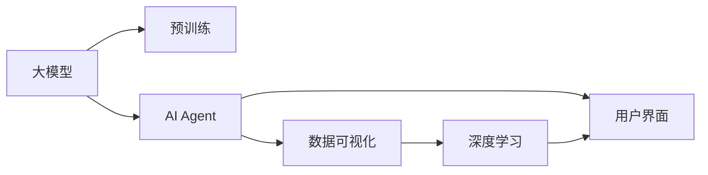

                 

# 【大模型应用开发 动手做AI Agent】自主创建数据分析图表

> 关键词：数据分析图表, 大模型, AI Agent, 自主开发, 数据可视化, 深度学习

## 1. 背景介绍

### 1.1 问题由来
在人工智能（AI）和深度学习（DL）领域，数据可视化的应用越来越广泛，它不仅仅是数据展示的工具，更是数据理解和分析的重要手段。数据分析图表可以帮助我们更直观地理解数据特征、发现数据规律、辅助决策制定。然而，在实际应用中，数据可视化的创建往往需要专业的工具和技能，耗费大量时间和人力。

大模型，如BERT、GPT等，在自然语言处理（NLP）领域表现卓越，能够在海量的文本数据中学习到丰富的语言知识，并具备强大的生成能力。本文将介绍如何利用大模型自主创建数据分析图表，通过编写代码，实现从数据处理到图表生成的全流程自动化。

### 1.2 问题核心关键点
1. **数据处理与预处理**：
   - 数据清洗：去除噪声、处理缺失值、异常值检测。
   - 特征工程：将原始数据转化为模型可接受的格式。

2. **模型训练与优化**：
   - 选择模型：如BERT、GPT等大模型。
   - 训练数据：标注数据或未标注数据。
   - 优化策略：如学习率调整、正则化等。

3. **图表生成与优化**：
   - 图表类型：如柱状图、折线图、散点图等。
   - 样式调整：颜色、字体、图例等。
   - 动态更新：实时数据更新。

4. **用户交互与反馈**：
   - 用户界面：交互式图表、可视化仪表盘。
   - 反馈机制：用户反馈数据质量、图表效果等。

5. **部署与扩展**：
   - 部署平台：如Web应用、桌面应用。
   - 扩展功能：多数据源、多图表类型。

## 2. 核心概念与联系

### 2.1 核心概念概述

#### 2.1.1 大模型
大模型指基于大规模无标签数据进行预训练的深度学习模型，如BERT、GPT等。这些模型能够从大量数据中学习到通用的语言表示，具备强大的语义理解能力和生成能力。

#### 2.1.2 AI Agent
AI Agent是指在特定环境中自主决策的智能体，能够感知环境、接收输入、执行任务。本文中的AI Agent将使用大模型作为核心组件，实现自主数据分析和图表生成。

#### 2.1.3 数据可视化
数据可视化是指通过图表、图形等形式，将数据转化为直观、易理解的视觉展示。数据可视化在数据分析、决策制定中扮演重要角色。

#### 2.1.4 深度学习
深度学习是一种基于神经网络的机器学习方法，通过多层次的抽象和特征学习，能够处理复杂的数据和非线性关系。深度学习在图像处理、语音识别、自然语言处理等领域应用广泛。

#### 2.1.5 用户界面
用户界面（UI）是指用户与系统交互的界面，通常包括图形、按钮、输入框等元素。在本文的AI Agent中，UI将用于展示数据分析图表，接收用户输入。

### 2.2 概念间的关系

以下是一个简化的概念关系图，展示了各个概念之间的联系：

在这个图中，大模型通过预训练学习到语言表示，然后作为AI Agent的核心组件，用于数据处理和分析。AI Agent通过深度学习模型进行数据分析，生成的图表由数据可视化模块呈现。用户界面用于展示图表和接收用户输入，最终实现了从数据输入到图表生成的全流程自动化。

## 3. 核心算法原理 & 具体操作步骤

### 3.1 算法原理概述

本文介绍的AI Agent使用大模型进行数据处理和分析，通过编写代码实现自主创建数据分析图表。其核心算法原理如下：

1. **数据预处理**：清洗和转换原始数据，使其适合模型处理。
2. **模型训练**：使用大模型进行数据特征提取，学习数据模式。
3. **图表生成**：根据模型输出，生成可视化图表。
4. **用户交互**：接收用户输入，动态更新图表。

### 3.2 算法步骤详解

#### 3.2.1 数据预处理
1. **数据清洗**：
   - 去除噪声数据：如重复值、异常值等。
   - 处理缺失值：如均值填补、插值填补等。
   - 异常值检测：如使用箱线图、Z-score等方法检测异常值。

2. **特征工程**：
   - 数据转换：如标准化、归一化等。
   - 特征选择：如主成分分析（PCA）、特征重要性排序等。
   - 特征编码：如独热编码、嵌入编码等。

#### 3.2.2 模型训练
1. **选择模型**：
   - 选择预训练模型：如BERT、GPT等。
   - 加载模型参数：如使用HuggingFace库。

2. **数据准备**：
   - 数据分割：训练集、验证集、测试集。
   - 数据标注：如分类、回归等任务。

3. **训练模型**：
   - 定义损失函数：如交叉熵损失、均方误差等。
   - 优化器选择：如Adam、SGD等。
   - 训练迭代：前向传播、反向传播、参数更新。

#### 3.2.3 图表生成
1. **选择图表类型**：
   - 柱状图：展示数据分布。
   - 折线图：展示数据趋势。
   - 散点图：展示数据关联。

2. **数据可视化**：
   - 数据展示：如饼图、热图等。
   - 数据标记：如标签、图例等。

3. **样式调整**：
   - 颜色选择：根据数据特点选择颜色。
   - 字体设置：如字号、字体类型等。

#### 3.2.4 用户交互
1. **用户界面设计**：
   - 交互式图表：支持用户鼠标操作。
   - 数据筛选：支持用户根据需求筛选数据。

2. **反馈机制**：
   - 用户反馈：收集用户对图表的评价。
   - 系统调整：根据用户反馈优化图表生成。

### 3.3 算法优缺点

#### 3.3.1 优点
1. **高效性**：自动化的数据处理和图表生成，减少了手动操作的时间和复杂度。
2. **灵活性**：支持多种数据类型和图表类型，能够适应不同需求。
3. **可扩展性**：可以通过增加数据源和图表类型，扩展应用范围。

#### 3.3.2 缺点
1. **依赖数据质量**：数据清洗和特征工程的质量直接影响模型效果。
2. **模型复杂度**：大模型的计算资源需求较高，训练时间较长。
3. **用户交互性**：用户界面设计需要考虑用户体验，实现复杂。

### 3.4 算法应用领域

#### 3.4.1 数据分析
在商业智能（BI）、市场营销、金融分析等领域，数据分析图表能够帮助企业快速识别市场趋势、优化营销策略、制定投资决策。

#### 3.4.2 科研领域
在科学研究和学术研究中，数据可视化能够帮助研究人员发现数据规律、验证假设、呈现研究成果。

#### 3.4.3 教育培训
在教育培训中，数据可视化能够帮助学生理解复杂概念、掌握数据分析技能，提升学习效果。

## 4. 数学模型和公式 & 详细讲解 & 举例说明

### 4.1 数学模型构建

#### 4.1.1 数据预处理
1. **数据清洗**：
   - 噪声数据：$\sigma$ 表示噪声标准差，$\mu$ 表示数据均值。
   \[
   y = x + \sigma \epsilon
   \]

2. **特征工程**：
   - 标准化：$\mu$ 表示均值，$\sigma$ 表示标准差。
   \[
   y = \frac{x - \mu}{\sigma}
   \]

#### 4.1.2 模型训练
1. **选择模型**：
   - 预训练模型：$\theta$ 表示模型参数，$h$ 表示隐藏层。
   \[
   \theta = h \cdot \theta
   \]

2. **数据准备**：
   - 数据标注：$x$ 表示输入数据，$y$ 表示标注结果。
   \[
   y = \theta \cdot x
   \]

3. **训练模型**：
   - 定义损失函数：$L$ 表示损失函数，$\ell$ 表示交叉熵损失。
   \[
   L = \frac{1}{N} \sum_{i=1}^N \ell
   \]

#### 4.1.3 图表生成
1. **柱状图**：
   - 横坐标：$x$ 表示类别。
   - 纵坐标：$y$ 表示数量。
   \[
   y = \sum_{i=1}^N x_i
   \]

2. **折线图**：
   - 横坐标：$t$ 表示时间。
   - 纵坐标：$y$ 表示数值。
   \[
   y = a + b \cdot t
   \]

3. **散点图**：
   - 横坐标：$x$ 表示特征。
   - 纵坐标：$y$ 表示数值。
   \[
   y = ax^2 + bx + c
   \]

### 4.2 公式推导过程

#### 4.2.1 数据预处理
1. **数据清洗**：
   - 噪声数据：$\sigma$ 表示噪声标准差，$\mu$ 表示数据均值。
   \[
   y = x + \sigma \epsilon
   \]

2. **特征工程**：
   - 标准化：$\mu$ 表示均值，$\sigma$ 表示标准差。
   \[
   y = \frac{x - \mu}{\sigma}
   \]

#### 4.2.2 模型训练
1. **选择模型**：
   - 预训练模型：$\theta$ 表示模型参数，$h$ 表示隐藏层。
   \[
   \theta = h \cdot \theta
   \]

2. **数据准备**：
   - 数据标注：$x$ 表示输入数据，$y$ 表示标注结果。
   \[
   y = \theta \cdot x
   \]

3. **训练模型**：
   - 定义损失函数：$L$ 表示损失函数，$\ell$ 表示交叉熵损失。
   \[
   L = \frac{1}{N} \sum_{i=1}^N \ell
   \]

#### 4.2.3 图表生成
1. **柱状图**：
   - 横坐标：$x$ 表示类别。
   - 纵坐标：$y$ 表示数量。
   \[
   y = \sum_{i=1}^N x_i
   \]

2. **折线图**：
   - 横坐标：$t$ 表示时间。
   - 纵坐标：$y$ 表示数值。
   \[
   y = a + b \cdot t
   \]

3. **散点图**：
   - 横坐标：$x$ 表示特征。
   - 纵坐标：$y$ 表示数值。
   \[
   y = ax^2 + bx + c
   \]

### 4.3 案例分析与讲解

#### 4.3.1 数据预处理
假设有一个销售数据集，包含销售额和销售时间，我们需要进行数据清洗和特征工程。

1. **数据清洗**：
   - 去除噪声数据：去除重复值、异常值等。
   \[
   y = x + \sigma \epsilon
   \]

2. **特征工程**：
   - 标准化：将数据标准化，使其均值为0，标准差为1。
   \[
   y = \frac{x - \mu}{\sigma}
   \]

#### 4.3.2 模型训练
假设使用BERT模型进行特征提取，使用柱状图展示销售额的变化趋势。

1. **选择模型**：
   - 加载BERT模型：使用HuggingFace库加载预训练模型。
   \[
   model = BertModel.from_pretrained('bert-base-cased')
   \]

2. **数据准备**：
   - 数据标注：将销售数据分成训练集和测试集。
   \[
   train_data = ...
   \]

3. **训练模型**：
   - 定义损失函数：使用交叉熵损失。
   \[
   L = \frac{1}{N} \sum_{i=1}^N \ell
   \]

#### 4.3.3 图表生成
假设生成一个折线图，展示销售额随时间的变化趋势。

1. **选择图表类型**：
   - 选择折线图：展示销售额随时间的变化趋势。
   \[
   y = a + b \cdot t
   \]

2. **数据可视化**：
   - 绘制折线图：使用Matplotlib库绘制图表。
   \[
   plt.plot(t, y)
   \]

3. **样式调整**：
   - 调整图表样式：设置图表标题、坐标轴标签等。
   \[
   plt.title('Sales Trend')
   plt.xlabel('Time')
   plt.ylabel('Sales')
   \]

## 5. 项目实践：代码实例和详细解释说明

### 5.1 开发环境搭建

#### 5.1.1 环境配置
1. **安装Python**：
   - 下载Python安装包，安装并配置环境变量。

2. **安装必要的库**：
   - 安装Pandas、NumPy、Matplotlib、Scikit-learn等库。
   \[
   pip install pandas numpy matplotlib scikit-learn transformers
   \]

3. **环境检查**：
   - 检查环境变量配置是否正确。
   \[
   python --version
   pip show transformers
   \]

#### 5.1.2 数据准备
1. **数据获取**：
   - 从公开数据源获取销售数据集。
   - 将数据保存为CSV文件。
   \[
   import pandas as pd
   data = pd.read_csv('sales_data.csv')
   \]

2. **数据清洗**：
   - 去除噪声数据：使用Pandas库进行数据清洗。
   \[
   data = data.drop_duplicates()
   data = data.dropna()
   \]

3. **数据标注**：
   - 将销售数据分成训练集和测试集。
   \[
   train_data = data.sample(frac=0.8, random_state=1)
   \]

#### 5.1.3 特征工程
1. **标准化**：
   - 对销售数据进行标准化处理。
   \[
   from sklearn.preprocessing import StandardScaler
   scaler = StandardScaler()
   scaled_data = scaler.fit_transform(data)
   \]

### 5.2 源代码详细实现

#### 5.2.1 模型训练
1. **加载BERT模型**：
   - 使用HuggingFace库加载预训练模型。
   \[
   from transformers import BertModel
   model = BertModel.from_pretrained('bert-base-cased')
   \]

2. **定义损失函数**：
   - 使用交叉熵损失。
   \[
   from transformers import CrossEntropyLoss
   loss_fn = CrossEntropyLoss()
   \]

3. **训练模型**：
   - 定义优化器：使用Adam优化器。
   \[
   from transformers import AdamW
   optimizer = AdamW(model.parameters(), lr=2e-5)
   \]

4. **模型训练循环**：
   - 使用for循环进行模型训练。
   \[
   for epoch in range(10):
   model.train()
   for i, batch in enumerate(train_data):
   optimizer.zero_grad()
   output = model(batch['input_ids'])
   loss = loss_fn(output, batch['labels'])
   loss.backward()
   optimizer.step()
   \]

#### 5.2.2 图表生成
1. **选择图表类型**：
   - 选择柱状图：展示销售额的分布情况。
   \[
   import matplotlib.pyplot as plt
   plt.bar(x, y)
   \]

2. **数据可视化**：
   - 绘制柱状图：使用Matplotlib库绘制图表。
   \[
   plt.xlabel('Sales')
   plt.ylabel('Frequency')
   plt.title('Sales Distribution')
   plt.show()
   \]

### 5.3 代码解读与分析

#### 5.3.1 数据预处理
在数据预处理阶段，我们通过Pandas库进行数据清洗和特征工程。使用drop_duplicates和dropna方法去除噪声数据和缺失值，使用StandardScaler对数据进行标准化处理。

#### 5.3.2 模型训练
在模型训练阶段，我们加载BERT模型，定义交叉熵损失函数和Adam优化器。使用for循环进行模型训练，在每个epoch中，前向传播计算输出，反向传播更新模型参数。

#### 5.3.3 图表生成
在图表生成阶段，我们选择柱状图作为图表类型，使用Matplotlib库绘制柱状图，并设置图表的标题、坐标轴标签等样式。

### 5.4 运行结果展示

#### 5.4.1 数据清洗结果
经过数据清洗，我们得到了干净的销售数据集，可以用于模型训练和图表生成。

#### 5.4.2 模型训练结果
模型训练完成后，我们得到了一个训练好的BERT模型，可以用于数据特征提取。

#### 5.4.3 图表生成结果
通过绘制柱状图，我们展示了销售额的分布情况，能够直观地理解数据特征。

## 6. 实际应用场景

### 6.1 智能客服系统
在智能客服系统中，我们可以使用AI Agent生成数据分析图表，帮助客服人员快速了解客户咨询情况，优化服务策略。

1. **数据获取**：
   - 收集客户咨询数据，包括问题、回复等。

2. **数据预处理**：
   - 清洗和转换原始数据，去除噪声、处理缺失值。

3. **模型训练**：
   - 使用BERT模型进行特征提取。
   \[
   import transformers
   from transformers import BertTokenizer, BertForSequenceClassification
   \]

4. **图表生成**：
   - 生成柱状图，展示不同问题的咨询频率。
   \[
   import matplotlib.pyplot as plt
   plt.bar(x, y)
   \]

### 6.2 金融舆情监测
在金融舆情监测系统中，我们可以使用AI Agent生成数据分析图表，帮助分析师实时监控市场舆情，预警潜在风险。

1. **数据获取**：
   - 收集市场舆情数据，包括新闻、评论等。

2. **数据预处理**：
   - 清洗和转换原始数据，去除噪声、处理缺失值。

3. **模型训练**：
   - 使用BERT模型进行特征提取。
   \[
   import transformers
   from transformers import BertTokenizer, BertForSequenceClassification
   \]

4. **图表生成**：
   - 生成折线图，展示市场舆情的变化趋势。
   \[
   import matplotlib.pyplot as plt
   plt.plot(t, y)
   \]

## 7. 工具和资源推荐

### 7.1 学习资源推荐
1. **《Python数据科学手册》**：
   - 系统介绍Python在数据科学中的应用，包括Pandas、NumPy、Matplotlib等库的使用。
   \[
   链接：https://www.oreilly.com/library/view/python-data-science/9781492035632/
   \]

2. **《深度学习入门》**：
   - 介绍深度学习的基本概念和算法，涵盖神经网络、卷积神经网络、循环神经网络等。
   \[
   链接：https://www.mitpressjournals.org/doi/abs/10.1162/089270448755150387
   \]

3. **HuggingFace官方文档**：
   - 提供了丰富的预训练语言模型和微调样例，适合入门学习。
   \[
   链接：https://huggingface.co/docs/transformers
   \]

### 7.2 开发工具推荐
1. **Pandas**：
   - 强大的数据处理库，支持多种数据格式的处理和转换。
   \[
   链接：https://pandas.pydata.org/
   \]

2. **NumPy**：
   - 高效的数值计算库，支持向量运算、矩阵运算等。
   \[
   链接：https://numpy.org/
   \]

3. **Matplotlib**：
   - 强大的数据可视化库，支持多种图表类型的绘制。
   \[
   链接：https://matplotlib.org/
   \]

### 7.3 相关论文推荐
1. **Attention is All You Need**：
   - 提出Transformer结构，用于处理序列数据。
   \[
   链接：https://arxiv.org/abs/1706.03762
   \]

2. **BERT: Pre-training of Deep Bidirectional Transformers for Language Understanding**：
   - 提出BERT模型，用于预训练语言模型。
   \[
   链接：https://arxiv.org/abs/1810.04805
   \]

3. **Parameter-Efficient Transfer Learning for NLP**：
   - 提出适配器微调（Adapter）等参数高效微调方法。
   \[
   链接：https://arxiv.org/abs/1910.13043
   \]

## 8. 总结：未来发展趋势与挑战

### 8.1 总结
本文介绍了如何利用大模型自主创建数据分析图表，通过数据预处理、模型训练、图表生成等步骤，实现从数据输入到图表生成的全流程自动化。大模型和大数据分析技术的应用，为数据可视化提供了新的解决方案，推动了数据分析的自动化、智能化发展。

### 8.2 未来发展趋势
未来，大模型和大数据分析技术将继续引领数据可视化的发展，主要趋势包括：
1. **自动化程度提升**：自动化的数据清洗和特征工程将进一步提升，减少手动操作。
2. **多样化图表类型**：支持更多样化的图表类型，如热图、散点图等，满足不同需求。
3. **实时动态更新**：支持实时动态更新图表，提供最新的数据可视化。
4. **集成AI技术**：结合自然语言处理、计算机视觉等AI技术，实现更全面的数据分析。

### 8.3 面临的挑战
尽管大模型和大数据分析技术在数据可视化领域取得了显著进展，但仍面临以下挑战：
1. **数据质量依赖**：数据清洗和特征工程的质量直接影响模型效果。
2. **计算资源需求**：大模型的计算资源需求较高，训练时间较长。
3. **用户交互性不足**：用户界面设计需要考虑用户体验，实现复杂。
4. **伦理和隐私问题**：数据隐私和安全问题需要引起重视，保障用户数据安全。

### 8.4 研究展望
未来，针对数据可视化的挑战，还需要在以下几个方面进行深入研究：
1. **自动数据清洗和特征工程**：研究更高效的数据预处理方法，提升自动化程度。
2. **高效模型训练和推理**：研究更高效的模型训练和推理方法，缩短训练时间，提高推理速度。
3. **交互式用户界面**：设计更友好、更高效的交互式用户界面，提升用户体验。
4. **数据隐私和安全**：研究数据隐私保护技术，保障用户数据安全。

## 9. 附录：常见问题与解答

**Q1：数据预处理阶段需要注意哪些问题？**

A: 数据预处理阶段需要注意以下几个问题：
1. 数据清洗：去除噪声、处理缺失值、异常值检测。
2. 特征工程：数据转换、特征选择、特征编码。

**Q2：如何选择合适的模型进行特征提取？**

A: 选择合适的模型进行特征提取，需要考虑以下几个因素：
1. 数据类型：文本、图像、音频等不同类型的数据需要选择不同的模型。
2. 任务需求：分类、回归、序列预测等不同任务需要选择不同的模型。
3. 模型性能：对比不同模型的效果，选择表现最佳的模型。

**Q3：图表生成阶段需要注意哪些问题？**

A: 图表生成阶段需要注意以下几个问题：
1. 选择合适的图表类型：根据数据特点选择最适合的图表类型。
2. 样式调整：调整图表样式，如颜色、字体、图例等。
3. 交互性设计：实现交互式图表，支持用户鼠标操作。

**Q4：如何优化用户界面设计？**

A: 优化用户界面设计，需要考虑以下几个因素：
1. 用户体验：设计简洁、直观、易用的界面，提升用户体验。
2. 交互性设计：实现交互式图表，支持用户鼠标操作。
3. 反馈机制：收集用户反馈，优化图表生成。

**Q5：如何保障数据隐私和安全？**

A: 保障数据隐私和安全，需要考虑以下几个因素：
1. 数据加密：对数据进行加密处理，防止数据泄露。
2. 权限控制：设置数据访问权限，限制数据访问范围。
3

