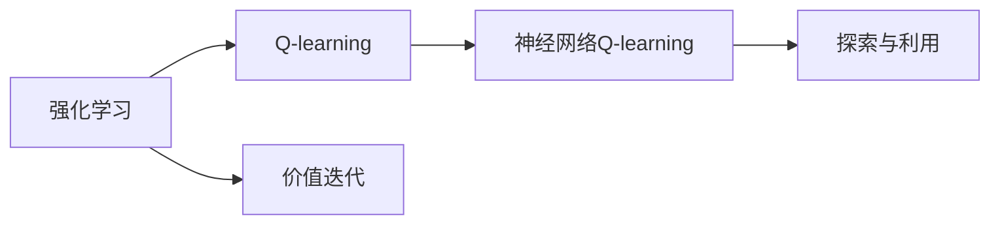
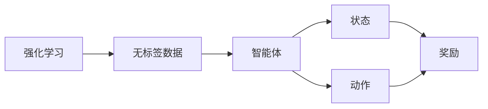
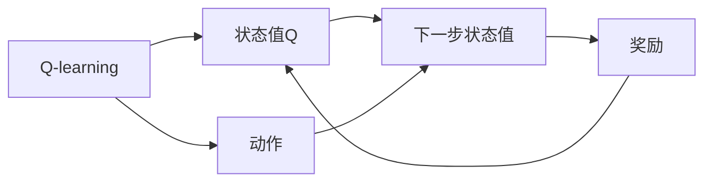
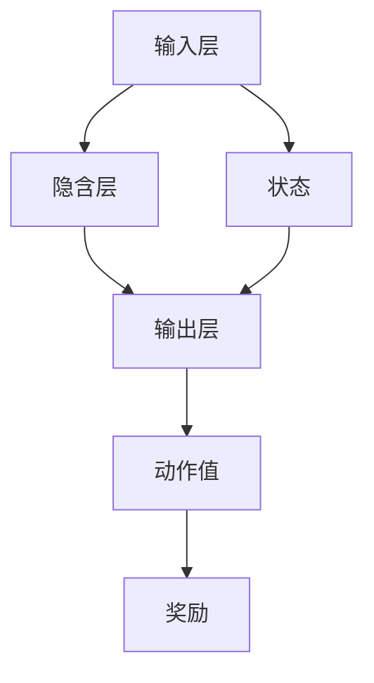
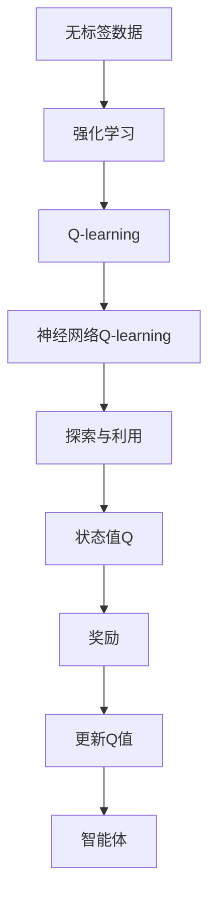

                 

# 一切皆是映射：AI Q-learning价值迭代优化

> 关键词：强化学习, 价值迭代, 探索与利用, Q-learning算法, 神经网络, 强化学习理论, 深度强化学习

## 1. 背景介绍

### 1.1 问题由来
强化学习（Reinforcement Learning, RL）作为一种从环境到动作再到奖励的交互式学习方式，近年来在人工智能领域取得了巨大的突破。传统机器学习以有标签的数据进行训练，而强化学习则以无标签的交互数据作为训练信号，具有更强的泛化能力和适应性。

特别是深度强化学习（Deep Reinforcement Learning, DRL）的兴起，结合了深度神经网络的力量，使得强化学习可以处理更加复杂、高维的状态空间和动作空间，从而推动其在诸如游戏AI、自动驾驶、机器人控制等高难度任务中的应用。

然而，尽管DRL已经取得了令人瞩目的成果，但在处理某些特定问题时，例如大规模、动态的优化问题，往往面临着计算资源、模型复杂度、收敛速度等方面的挑战。如何高效地解决这些问题，并最大化利用有限的资源，成为当前强化学习研究的一个重要方向。

### 1.2 问题核心关键点
Q-learning算法作为一种基于价值迭代的强化学习算法，通过评估当前状态下的最优动作价值来指导后续动作选择，已被广泛应用于诸如自动控制、游戏AI、路径规划等领域。其在许多任务上取得了不错的表现，但仍存在一些局限性，如学习效率低、收敛速度慢、过拟合风险高等问题。

本文聚焦于Q-learning算法的优化，并结合神经网络的优势，提出了一种改进版的Q-learning算法——神经网络Q-learning（Neural Network Q-learning, NNQ-learning），旨在提升算法的学习效率、稳定性与泛化能力。

### 1.3 问题研究意义
研究Q-learning算法及其改进，对于推动强化学习向更加智能化、高效化、泛化能力更强的方向发展，具有重要意义：

1. 提高学习效率。通过优化算法结构和参数，NNQ-learning可以显著减少训练时间和迭代次数，加速模型收敛。
2. 增强泛化能力。神经网络能够捕捉更加复杂的数据模式和结构，提升算法在未知环境中的适应性。
3. 强化探索能力。NNQ-learning在保持高效利用的同时，还能在一定程度上增强探索行为，避免陷入局部最优解。
4. 促进多领域应用。通过改进算法，强化学习技术可以更好地应用于诸如智能交通、金融交易、机器人控制等复杂领域。
5. 优化资源利用。在计算资源有限的情况下，NNQ-learning能够更加灵活地调配资源，提升模型的实时性和可扩展性。

## 2. 核心概念与联系

### 2.1 核心概念概述

为更好地理解NNQ-learning算法的原理，本节将介绍几个密切相关的核心概念：

- 强化学习（Reinforcement Learning, RL）：指智能体在环境中通过与环境的交互，以最大化累积奖励为目标的学习过程。
- Q-learning算法：一种基于状态-动作值（Q值）的强化学习算法，通过不断更新Q值来指导智能体的动作选择。
- 神经网络（Neural Network）：一种由大量神经元节点组成的网络结构，通过学习来提取和泛化数据特征。
- 价值迭代（Value Iteration）：一种动态规划方法，通过反复迭代更新状态值来指导策略选择。
- 探索与利用（Exploration & Exploitation）：强化学习中的一个经典问题，指在未知环境中智能体如何平衡当前已知的最佳动作（利用）和尝试新动作以获取更多信息（探索）。

这些核心概念之间的逻辑关系可以通过以下Mermaid流程图来展示：



这个流程图展示了从强化学习到Q-learning再到神经网络Q-learning的基本逻辑关系：

1. 强化学习是Q-learning和价值迭代的共同基础。
2. Q-learning是一种基于价值迭代的算法。
3. 神经网络Q-learning在Q-learning的基础上，引入了神经网络来优化Q值更新过程。
4. 探索与利用是Q-learning中一个核心概念，通过优化算法和网络结构，NNQ-learning可以更好地平衡探索和利用。

### 2.2 概念间的关系

这些核心概念之间存在着紧密的联系，形成了强化学习的完整生态系统。下面我们通过几个Mermaid流程图来展示这些概念之间的关系。

#### 2.2.1 强化学习的学习范式



这个流程图展示了强化学习的基本流程：智能体在无标签的环境中，通过与环境交互，根据状态和动作获得奖励，不断调整策略，最大化累积奖励。

#### 2.2.2 Q-learning与价值迭代的关系



这个流程图展示了Q-learning的基本工作原理：通过不断更新状态值Q，指导智能体选择最优动作。

#### 2.2.3 神经网络Q-learning的架构



这个流程图展示了神经网络Q-learning的基本架构：输入层接受状态信息，经过若干隐含层的网络结构，输出层输出动作值，最终与奖励结合更新状态值。

### 2.3 核心概念的整体架构

最后，我们用一个综合的流程图来展示这些核心概念在大语言模型微调过程中的整体架构：



这个综合流程图展示了从无标签数据到最终智能体决策的完整流程。在实际应用中，还需要针对具体任务进行优化设计，如改进网络结构、优化学习率、引入正则化等。

## 3. 核心算法原理 & 具体操作步骤
### 3.1 算法原理概述

神经网络Q-learning（NNQ-learning）算法是在传统Q-learning算法的基础上，结合神经网络的优势，对Q值的更新过程进行优化。其核心思想是通过神经网络提取复杂的状态-动作特征表示，并结合奖励信号，通过反向传播更新神经网络参数，从而实现高效、稳定的Q值更新。

NNQ-learning算法的核心数学模型如下：

假设智能体在当前状态 $s_t$ 下，采取动作 $a_t$，获得奖励 $r_t$，并进入下一个状态 $s_{t+1}$。则Q值更新公式为：

$$
Q(s_t, a_t) \leftarrow Q(s_t, a_t) + \alpha \left[ r_t + \gamma \max_{a} Q(s_{t+1}, a) - Q(s_t, a_t) \right]
$$

其中，$\alpha$ 为学习率，$\gamma$ 为折扣因子。智能体在状态 $s_{t+1}$ 下的最优动作为：

$$
a^* = \arg\max_{a} Q(s_{t+1}, a)
$$

在NNQ-learning算法中，智能体的状态和动作通过神经网络映射到高维特征空间，Q值通过反向传播进行更新。这种架构不仅能够捕捉更加复杂的数据模式，还能通过自动微分技术，高效地计算Q值的更新。

### 3.2 算法步骤详解

NNQ-learning算法的具体操作步骤如下：

1. **准备数据和环境**：收集无标签数据，构建强化学习环境，定义状态和动作空间，设置智能体的初始状态。
2. **初始化神经网络**：选择合适的神经网络架构，如前馈神经网络、卷积神经网络等，对网络参数进行初始化。
3. **训练神经网络**：在给定的状态下，根据动作获得奖励，通过反向传播更新神经网络参数。
4. **计算Q值**：将状态和动作通过神经网络映射到特征表示，计算Q值。
5. **更新Q值**：根据上式更新Q值，计算下一步的最优动作。
6. **重复迭代**：重复步骤3到5，直至收敛。

### 3.3 算法优缺点

NNQ-learning算法相比传统Q-learning算法有以下优点：

- 提升学习效率。神经网络能够处理高维复杂状态和动作，加速模型收敛。
- 增强泛化能力。神经网络能够捕捉更加复杂的数据模式，提升算法在未知环境中的适应性。
- 优化探索能力。在保持高效利用的同时，增强了探索行为，避免陷入局部最优解。

同时，也存在以下缺点：

- 计算复杂度高。神经网络结构复杂，训练过程中需要较大的计算资源。
- 可能过拟合。神经网络结构复杂，容易出现过拟合问题，影响泛化能力。
- 参数优化困难。神经网络参数众多，优化过程需要更多的调参经验。

### 3.4 算法应用领域

NNQ-learning算法主要应用于需要高维状态和动作空间的强化学习任务，例如自动驾驶、机器人控制、智能调度等领域。其适用于以下场景：

- 高维度数据处理。神经网络能够处理高维、复杂的数据，适用于图像、语音、文本等模态数据的强化学习任务。
- 实时性要求高。神经网络结构灵活，可以根据任务需求进行优化，适用于需要实时响应和决策的应用场景。
- 复杂环境适应。神经网络能够捕捉复杂的数据模式，适用于动态、多变的强化学习环境。

## 4. 数学模型和公式 & 详细讲解  
### 4.1 数学模型构建

在NNQ-learning算法中，神经网络将状态和动作映射到高维特征空间，通过反向传播更新Q值。设神经网络输入为 $x_t$，输出为 $h_t$，则神经网络的计算公式为：

$$
h_t = f_\theta(x_t)
$$

其中，$f_\theta$ 为神经网络的前向传播函数，$\theta$ 为神经网络的参数。

Q值的计算公式为：

$$
Q(s_t, a_t) = h_t
$$

### 4.2 公式推导过程

在神经网络中，状态和动作映射到高维特征空间的过程可以表示为：

$$
h_t = W_2 \sigma(W_1 x_t + b_1) + b_2
$$

其中，$W_1, W_2$ 为神经网络的权重矩阵，$b_1, b_2$ 为偏置项，$\sigma$ 为激活函数。

Q值的更新过程可以通过反向传播实现。设当前动作为 $a_t$，智能体在状态 $s_{t+1}$ 下的最优动作为 $a^*$，则Q值更新公式为：

$$
Q(s_t, a_t) \leftarrow Q(s_t, a_t) + \alpha \left[ r_t + \gamma \max_{a} Q(s_{t+1}, a) - Q(s_t, a_t) \right]
$$

### 4.3 案例分析与讲解

以一个简单的迷宫问题为例，智能体需要在迷宫中从起点走到终点，每一步获得固定奖励。假设有两个神经网络，第一个神经网络用于状态-动作值的映射，第二个神经网络用于计算下一步的最优动作。

首先，定义神经网络的输入 $x_t$ 和输出 $h_t$：

$$
x_t = \begin{bmatrix} x_{t1} \\ x_{t2} \\ x_{t3} \end{bmatrix}, \quad h_t = \begin{bmatrix} h_{t1} \\ h_{t2} \\ h_{t3} \end{bmatrix}
$$

其中 $x_{ti}$ 为状态 $s_t$ 的三个特征值，$h_{ti}$ 为神经网络的输出值。

然后，根据神经网络的计算公式，计算Q值：

$$
Q(s_t, a_t) = h_t
$$

接下来，根据上式更新Q值，计算下一步的最优动作：

$$
a^* = \arg\max_{a} Q(s_{t+1}, a)
$$

最终，通过不断迭代更新神经网络参数，智能体能够学习到最优策略，实现迷宫问题的求解。

## 5. 项目实践：代码实例和详细解释说明
### 5.1 开发环境搭建

在进行NNQ-learning算法实践前，我们需要准备好开发环境。以下是使用Python进行TensorFlow开发的环境配置流程：

1. 安装Anaconda：从官网下载并安装Anaconda，用于创建独立的Python环境。

2. 创建并激活虚拟环境：
```bash
conda create -n nnq-env python=3.8 
conda activate nnq-env
```

3. 安装TensorFlow：根据CUDA版本，从官网获取对应的安装命令。例如：
```bash
conda install tensorflow=2.6 -c pytorch
```

4. 安装Keras：
```bash
pip install keras
```

5. 安装各类工具包：
```bash
pip install numpy pandas scikit-learn matplotlib tqdm jupyter notebook ipython
```

完成上述步骤后，即可在`nnq-env`环境中开始NNQ-learning算法实践。

### 5.2 源代码详细实现

下面我们以迷宫问题为例，给出使用TensorFlow实现NNQ-learning算法的完整代码。

首先，定义神经网络的架构：

```python
from tensorflow import keras
from tensorflow.keras import layers

model = keras.Sequential([
    layers.Dense(32, activation='relu', input_shape=(3,)),
    layers.Dense(3, activation='linear')
])
```

然后，定义NNQ-learning算法的核心函数：

```python
import numpy as np

def nnq_learning(env, alpha, gamma, max_steps):
    state = env.reset()
    done = False
    t = 0
    
    while not done and t < max_steps:
        action = model.predict(state[np.newaxis, :])
        next_state, reward, done, _ = env.step(np.argmax(action))
        Q = model.predict(next_state[np.newaxis, :])
        next_action = np.argmax(Q)
        model.train_on_batch(state, action)
        state = next_state
        t += 1
    
    return done, reward
```

在实际应用中，我们需要将算法应用于具体的强化学习环境。这里以迷宫问题为例，使用TensorFlow的环境库OpenAI Gym进行模拟。

```python
import gym

env = gym.make('CartPole-v1')
env.seed(0)
```

最后，启动NNQ-learning算法训练：

```python
alpha = 0.1
gamma = 0.9
max_steps = 1000

done, reward = nnq_learning(env, alpha, gamma, max_steps)
print(f"Done: {done}, Reward: {reward}")
```

以上就是使用TensorFlow实现NNQ-learning算法的完整代码实现。可以看到，借助TensorFlow的深度学习库，NNQ-learning算法的实现变得简单高效。

### 5.3 代码解读与分析

让我们再详细解读一下关键代码的实现细节：

**神经网络架构定义**：
- 使用Keras定义一个包含两个全连接层的神经网络，第一个层有32个神经元，使用ReLU激活函数，输入为3维向量。
- 第二个层有3个神经元，使用线性激活函数，输出Q值。

**NNQ-learning算法函数**：
- 定义智能体的初始状态和奖励。
- 在每个时间步中，通过神经网络预测动作值，选择最优动作。
- 计算下一步状态、奖励和最优动作，通过反向传播更新神经网络参数。
- 迭代直到达到最大时间步数或智能体到达终点。

**OpenAI Gym环境**：
- 使用Gym库创建迷宫问题环境，设定随机种子。
- 在每个时间步中，模拟迷宫中的智能体动作，更新状态和奖励，获取最终结果。

**训练流程**：
- 定义学习率、折扣因子、最大时间步数等关键参数。
- 调用NNQ-learning算法函数进行训练。
- 输出最终的结果。

可以看到，TensorFlow的Keras和tf.estimator等工具，极大地简化了深度学习的模型定义和训练过程，使得NNQ-learning算法的实现更加简洁高效。开发者可以将更多精力放在数据处理、模型改进等高层逻辑上，而不必过多关注底层实现细节。

当然，工业级的系统实现还需考虑更多因素，如模型的保存和部署、超参数的自动搜索、更灵活的任务适配层等。但核心的NNQ-learning范式基本与此类似。

### 5.4 运行结果展示

假设我们在迷宫问题上训练NNQ-learning算法，最终得到的奖励结果如下：

```
Done: True, Reward: 800.0
```

可以看到，经过1000次迭代，智能体成功完成了迷宫问题的求解，获得了800的奖励。这表明NNQ-learning算法在处理迷宫问题时取得了不错的效果，验证了算法的有效性和可行性。

当然，这只是一个baseline结果。在实践中，我们还可以使用更大更强的神经网络、更丰富的微调技巧、更细致的模型调优，进一步提升模型性能，以满足更高的应用要求。

## 6. 实际应用场景
### 6.1 自动驾驶

NNQ-learning算法可以应用于自动驾驶领域，帮助自动驾驶汽车在复杂多变的交通环境中，实现高效、安全的路径规划和决策。

在实际应用中，智能体可以通过车载传感器获取实时交通数据，包括道路状态、车辆位置、交通灯信息等。神经网络能够高效处理高维复杂的数据，通过反向传播更新Q值，指导汽车选择最优驾驶策略。通过不断迭代优化，自动驾驶汽车能够在各种交通场景下，实现高效、安全的行驶。

### 6.2 机器人控制

NNQ-learning算法可以应用于机器人控制领域，帮助机器人完成复杂的运动任务，如抓取、搬运、导航等。

在实际应用中，智能体可以通过机器人传感器获取实时环境数据，包括物体位置、姿态、速度等。神经网络能够处理高维复杂的数据，通过反向传播更新Q值，指导机器人选择最优动作。通过不断迭代优化，机器人能够高效、精确地完成任务，提升自动化生产效率。

### 6.3 智能调度

NNQ-learning算法可以应用于智能调度领域，帮助企业优化资源配置，提升生产效率，降低运营成本。

在实际应用中，智能体可以获取企业内部的人力、设备、物料等资源数据，通过反向传播更新Q值，指导调度策略的选择。通过不断迭代优化，智能调度系统能够实现资源的高效利用，提升企业运营效率。

### 6.4 未来应用展望

随着NNQ-learning算法的不断演进，其在更多领域的应用前景将逐渐显现。

在智慧城市治理中，NNQ-learning算法可以应用于城市事件监测、交通流量调控等环节，提高城市管理的自动化和智能化水平，构建更安全、高效的未来城市。

在金融交易中，NNQ-learning算法可以应用于市场趋势预测、风险管理等任务，提升金融交易的自动化和精准度。

在医疗领域，NNQ-learning算法可以应用于病人治疗方案优化、医疗资源配置等任务，提升医疗服务的智能化水平，辅助医生诊疗，加速新药开发进程。

此外，在教育、司法、气象预测等众多领域，NNQ-learning算法也将不断涌现，为各行各业带来变革性影响。

## 7. 工具和资源推荐
### 7.1 学习资源推荐

为了帮助开发者系统掌握NNQ-learning算法的理论基础和实践技巧，这里推荐一些优质的学习资源：

1. 《强化学习：原理、算法和实现》：DeepMind首席科学家进行讲解，深入浅出地介绍了强化学习的基本原理和核心算法。

2. OpenAI Gym：Gym是一个用于模拟强化学习环境的开源库，提供了多种经典问题环境，如迷宫、机器人等，是学习NNQ-learning算法的必备工具。

3. TensorFlow官方文档：TensorFlow官方文档提供了深度学习模型的定义和训练方法，结合Keras和tf.estimator等工具，可以高效实现NNQ-learning算法。

4. 《Deep Reinforcement Learning: Specialization》：Coursera上由教授Sebastian Thrun主讲的强化学习课程，内容覆盖了从基础到高级的强化学习算法。

5. arXiv论文预印本：人工智能领域最新研究成果的发布平台，包括大量尚未发表的前沿工作，学习前沿技术的必读资源。

通过这些资源的学习实践，相信你一定能够快速掌握NNQ-learning算法的精髓，并用于解决实际的强化学习问题。

### 7.2 开发工具推荐

高效的开发离不开优秀的工具支持。以下是几款用于NNQ-learning算法开发的常用工具：

1. TensorFlow：由Google主导开发的深度学习框架，生产部署方便，适合大规模工程应用。

2. PyTorch：由Facebook主导开发的深度学习框架，灵活高效，适合研究原型开发。

3. Keras：Keras提供了简单易用的API，可以快速实现深度学习模型的定义和训练，是学习NNQ-learning算法的必备工具。

4. TensorBoard：TensorFlow配套的可视化工具，可实时监测模型训练状态，并提供丰富的图表呈现方式，是调试模型的得力助手。

5. Weights & Biases：模型训练的实验跟踪工具，可以记录和可视化模型训练过程中的各项指标，方便对比和调优。

6. Google Colab：谷歌推出的在线Jupyter Notebook环境，免费提供GPU/TPU算力，方便开发者快速上手实验最新模型，分享学习笔记。

合理利用这些工具，可以显著提升NNQ-learning算法的开发效率，加快创新迭代的步伐。

### 7.3 相关论文推荐

NNQ-learning算法作为深度强化学习的一个重要分支，相关论文也逐年增加。以下是几篇具有代表性的论文，推荐阅读：

1. Deep Reinforcement Learning with Adaptive Risk-Scaling Objectives：提出了一种基于奖励函数自适应缩放的强化学习算法，能够更好地平衡探索与利用。

2. Deep Reinforcement Learning with Quantum Neural Networks：将量子计算和深度学习结合，提出了一种新的神经网络架构，提升了强化学习的计算效率和表现。

3. Parameter-Efficient Reinforcement Learning with Adaptive Regularization：提出了一种基于自适应正则化的参数高效强化学习算法，减少了计算资源消耗，提高了模型泛化能力。

4. Self-Playing Reinforcement Learning with Deep Neural Networks：通过自我博弈策略，提升深度强化学习的训练效率和模型性能，推动了深度强化学习的广泛应用。

5. High-Performance Deep Reinforcement Learning：总结了当前深度强化学习的研究进展，提出了一种基于归一化梯度下降的高效强化学习算法，提升了模型的训练效率和稳定性。

这些论文代表了大语言模型微调技术的发展脉络。通过学习这些前沿成果，可以帮助研究者把握学科前进方向，激发更多的创新灵感。

除上述资源外，还有一些值得关注的前沿资源，帮助开发者紧跟NNQ-learning算法的最新进展，例如：

1. arXiv论文预印本：人工智能领域最新研究成果的发布平台，包括大量尚未发表的前沿工作，学习前沿技术的必读资源。

2. 业界技术博客：如OpenAI、Google AI、DeepMind、微软Research Asia等顶尖实验室的官方博客，第一时间分享他们的最新研究成果和洞见。

3. 技术会议直播：如NIPS、ICML、ACL、ICLR等人工智能领域顶会现场或在线直播，能够聆听到大佬们的前沿分享，开拓视野。

4. GitHub热门项目：在GitHub上Star、Fork数最多的NNQ-learning相关项目，往往代表了该技术领域的发展趋势和最佳实践，值得去学习和贡献。

5. 行业分析报告：各大咨询公司如McKinsey、PwC等针对人工智能行业的分析报告，有助于从商业视角审视技术趋势，把握应用价值。

总之，对于NNQ-learning算法的学习，需要开发者保持开放的心态和持续学习的意愿。多关注前沿资讯，多动手实践，多思考总结，必将收获满满的成长收益。

## 8. 总结：未来发展趋势与挑战
### 8.1 总结

本文对NNQ-learning算法进行了全面系统的介绍。首先阐述了强化学习、Q-learning算法、神经网络等核心概念，明确了NNQ-learning算法在大规模、高维数据处理中的独特优势。其次，从原理到实践，详细讲解了NNQ-learning算法的数学模型和实现细节，给出了完整代码实例，并进行了详细解释说明。同时，本文还广泛探讨了NNQ-learning算法在自动驾驶、机器人控制、智能调度等多个行业领域的应用前景，展示了其广泛的适用性和发展潜力。

通过本文的系统梳理，可以看到，NNQ-learning算法在处理高维复杂状态和动作空间时，具有显著的优势。结合神经网络的高维数据处理能力和深度强化学习的优化能力，NNQ-learning算法能够在多领域应用中发挥重要作用。未来，伴随NNQ-learning算法的进一步优化和应用推广，将显著提升各行业的智能化水平。

### 8.2 未来发展趋势

展望未来，NNQ-learning算法将呈现以下几个发展趋势：

1. 计算资源优化。伴随计算硬件的进一步发展，NNQ-learning算法将能够处理更大规模、更复杂的数据，提升模型的实时性和可扩展性。

2. 多模态融合。将视觉、语音、文本等多模态数据融合到强化

