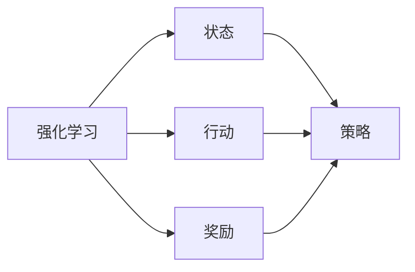
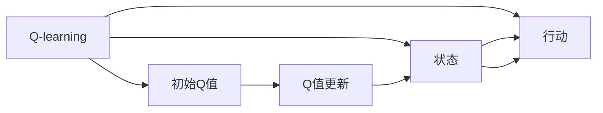
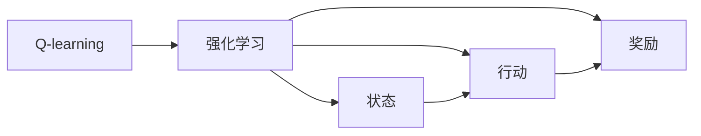
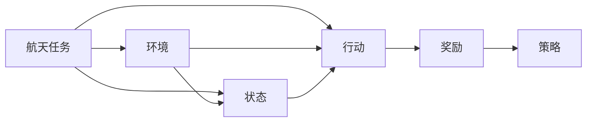
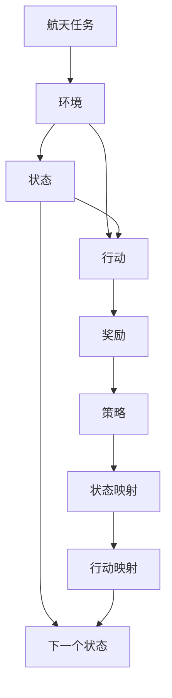

                 

# 一切皆是映射：AI Q-learning在航天领域的巨大可能

> 关键词：AI, Q-learning, 强化学习, 航天, 映射, 控制, 飞行, 决策, 策略, 优化

## 1. 背景介绍

### 1.1 问题由来

航天领域的探索和研究自古以来就是人类对未知世界的好奇心和梦想的体现。从古代的神话传说，到现代的航天器设计，人们不断努力探索宇宙的奥秘。然而，面对复杂的航天环境和任务，传统的控制和优化方法面临着诸多挑战。

近年来，随着人工智能（AI）和强化学习（Reinforcement Learning, RL）技术的不断发展，越来越多的航天任务开始采用AI和RL进行自动化决策和优化。Q-learning作为一种经典的强化学习算法，因其简单高效、易于实现的特点，在航天领域展现出巨大的应用潜力。

### 1.2 问题核心关键点

Q-learning作为经典的强化学习算法，主要应用于自动化决策和优化场景。其核心思想是利用奖励信号和经验回溯，学习最优策略，实现从环境到行动的映射，最大化长期累积奖励。

Q-learning的核心在于两个主要组成部分：Q值函数和策略选择。Q值函数Q(s, a)表示在状态s下采取行动a的累积奖励的期望值，策略则是在给定状态下选择最优行动的映射。通过不断的迭代和更新Q值函数，Q-learning可以学习到最优策略，实现自动化决策。

在航天领域，Q-learning可以应用于飞行控制、轨迹规划、姿态控制等任务。例如，通过学习如何控制航天器，使其在复杂环境中的路径最优化，Q-learning可以大大提高航天任务的效率和成功率。

### 1.3 问题研究意义

Q-learning在航天领域的应用，具有重要的研究意义：

1. **提高任务效率**：通过自动化决策和优化，Q-learning能够显著提高航天任务的效率，缩短任务完成时间。
2. **降低任务成本**：利用AI和Q-learning进行自动控制，能够减少人为干预，降低任务成本。
3. **增强任务安全性**：自动化决策和优化能够减少人为错误，提高任务的安全性和可靠性。
4. **推动技术创新**：Q-learning等AI技术的应用，能够推动航天技术的发展，催生更多的新技术和新方法。
5. **助力航天工业**：通过AI和Q-learning的广泛应用，能够推动航天工业的数字化和智能化转型，提高产业竞争力。

## 2. 核心概念与联系

### 2.1 核心概念概述

为更好地理解Q-learning在航天领域的应用，本节将介绍几个密切相关的核心概念：

- **强化学习（Reinforcement Learning, RL）**：一种通过与环境互动，学习最优策略以最大化长期累积奖励的学习范式。在航天领域，环境通常指航天器和周围环境。
- **Q-learning**：一种基于值函数的强化学习算法，通过学习Q值函数，实现从状态到行动的最优映射。
- **状态（State）**：航天器在某一时刻的状态，包括位置、速度、姿态等。
- **行动（Action）**：航天器采取的行动，如调整姿态、推进器点火等。
- **奖励（Reward）**：航天器在每个状态下获得的奖励，如完成任务、避免碰撞等。
- **策略（Policy）**：在给定状态下选择最优行动的映射，是Q-learning的学习目标。
- **映射（Mapping）**：通过Q-learning，实现从状态到行动的最优映射，即策略学习。

这些核心概念之间的逻辑关系可以通过以下Mermaid流程图来展示：



这个流程图展示了强化学习的基本框架和各组件之间的关系：

1. 强化学习通过与环境互动，学习最优策略。
2. 状态、行动和奖励是构成环境的基本元素。
3. 策略是学习目标，通过状态和行动映射到奖励。
4. Q-learning作为强化学习的一种算法，通过学习Q值函数，实现最优策略的映射。

### 2.2 概念间的关系

这些核心概念之间存在着紧密的联系，形成了Q-learning在航天领域应用的完整生态系统。下面我通过几个Mermaid流程图来展示这些概念之间的关系。

#### 2.2.1 Q-learning的算法流程



这个流程图展示了Q-learning的基本算法流程：

1. 初始化Q值函数。
2. 输入状态和行动，计算Q值。
3. 根据Q值更新策略。
4. 根据策略选择行动。

#### 2.2.2 Q-learning与强化学习的关系



这个流程图展示了Q-learning作为强化学习的一种算法，其基本原理和流程。

#### 2.2.3 Q-learning在航天领域的应用场景



这个流程图展示了Q-learning在航天领域的具体应用场景：

1. 航天任务作为环境，状态和行动由任务决定。
2. Q-learning通过学习Q值函数，实现最优策略的映射。
3. 奖励反映了任务的成功与否。
4. 策略映射最优行动，实现任务目标。

### 2.3 核心概念的整体架构

最后，我们用一个综合的流程图来展示这些核心概念在航天任务中的应用：



这个综合流程图展示了Q-learning在航天任务中的完整流程：

1. 航天任务作为环境，状态和行动由任务决定。
2. Q-learning通过学习Q值函数，实现最优策略的映射。
3. 奖励反映了任务的成功与否。
4. 策略映射最优行动，实现任务目标。
5. 状态映射和行动映射实现从状态到行动的最优映射。

通过这些流程图，我们可以更清晰地理解Q-learning在航天领域的应用流程和各组件之间的关系，为后续深入讨论具体的Q-learning方法和技术奠定基础。

## 3. 核心算法原理 & 具体操作步骤
### 3.1 算法原理概述

Q-learning是一种基于值函数的强化学习算法，其核心思想是通过学习Q值函数，实现从状态到行动的最优映射。在航天领域，Q-learning的具体应用包括飞行控制、轨迹规划、姿态控制等任务。

### 3.2 算法步骤详解

Q-learning的基本算法步骤如下：

1. **初始化**：设定初始Q值函数$Q(s, a) = 0$，其中$s$为状态，$a$为行动。
2. **状态选择**：在给定状态下，选择行动$a$。
3. **行动执行**：执行行动$a$，观察环境，获得下一个状态$s'$和奖励$r$。
4. **状态更新**：根据$r$和$s'$，更新Q值函数。
5. **策略选择**：根据更新后的Q值函数，选择最优行动$a'$。
6. **迭代更新**：重复步骤2至5，直到收敛。

数学上，Q值函数的更新公式为：

$$
Q(s, a) = Q(s, a) + \alpha [r + \gamma \max_{a'} Q(s', a') - Q(s, a)]
$$

其中$\alpha$为学习率，$\gamma$为折扣因子，$a'$为下一个状态$s'$的最优行动。

### 3.3 算法优缺点

Q-learning作为一种经典强化学习算法，具有以下优点：

1. **简单高效**：Q-learning算法原理简单，易于实现。
2. **泛化能力强**：Q-learning可以应用于各种复杂的任务和环境。
3. **可解释性强**：Q-learning的策略选择和行动执行都基于明确的Q值函数，易于理解和调试。

然而，Q-learning也存在一些缺点：

1. **收敛速度慢**：Q-learning在处理复杂问题时，收敛速度较慢。
2. **易受初始值影响**：Q-learning的初始Q值函数设定对结果有较大影响。
3. **难以处理连续状态**：Q-learning在处理连续状态时，需要离散化，可能会导致信息损失。
4. **需要大量经验数据**：Q-learning需要大量的训练数据，才能学习到有效的Q值函数。

### 3.4 算法应用领域

Q-learning在航天领域的应用非常广泛，主要包括以下几个方面：

1. **飞行控制**：通过学习最优控制策略，Q-learning可以优化航天器的飞行轨迹和姿态控制。
2. **轨迹规划**：Q-learning可以规划航天器在复杂环境中的最优路径，避开障碍物。
3. **姿态控制**：Q-learning可以学习如何调整航天器的姿态，保持其稳定性。
4. **任务优化**：Q-learning可以优化航天器完成任务的过程，如发射、对接等。
5. **故障检测**：Q-learning可以学习如何检测和修复航天器中的故障，提高可靠性。

## 4. 数学模型和公式 & 详细讲解  
### 4.1 数学模型构建

在航天领域，Q-learning的数学模型构建主要包括以下几个步骤：

1. **状态空间定义**：定义航天器的状态空间，包括位置、速度、姿态等。
2. **行动空间定义**：定义航天器可执行的行动空间，如调整姿态、推进器点火等。
3. **奖励函数定义**：定义每个状态的奖励函数，反映任务的成功与否。
4. **Q值函数定义**：定义Q值函数，表示在状态s下采取行动a的累积奖励的期望值。

### 4.2 公式推导过程

Q-learning的公式推导过程主要包括以下几个步骤：

1. **状态转移**：设状态空间为$s$，行动空间为$a$，定义状态转移函数$P(s'|s,a)$，表示在状态$s$下执行行动$a$后，到达状态$s'$的概率。
2. **奖励函数**：定义奖励函数$r(s,a,s')$，表示在状态$s$下执行行动$a$后，到达状态$s'$的奖励。
3. **Q值函数**：定义Q值函数$Q(s,a)$，表示在状态$s$下采取行动$a$的累积奖励的期望值。
4. **最优策略**：定义最优策略$\pi(s)$，表示在状态$s$下选择最优行动$a'$的映射。

根据上述定义，Q-learning的更新公式为：

$$
Q(s,a) = Q(s,a) + \alpha [r + \gamma \max_{a'} Q(s', a') - Q(s, a)]
$$

其中$\alpha$为学习率，$\gamma$为折扣因子，$a'$为下一个状态$s'$的最优行动。

### 4.3 案例分析与讲解

以下通过一个简单的航天飞行控制案例，来展示Q-learning的实际应用。

假设航天器需要在空间中到达一个目标位置。我们将位置、速度、姿态等状态表示为一个向量，并将行动表示为推进器点火、姿态调整等。

设状态$s$为当前位置和姿态，行动$a$为推进器点火。定义奖励函数$r(s,a,s')$，表示在状态$s$下执行行动$a$后，到达状态$s'$的奖励。若到达目标位置，奖励为$+1$，否则为$-1$。

初始化Q值函数$Q(s,a) = 0$，定义状态空间$s$和行动空间$a$，定义状态转移函数$P(s'|s,a)$。

通过不断迭代，更新Q值函数，最终学习到最优策略，实现从当前位置到达目标位置的过程。

## 5. 项目实践：代码实例和详细解释说明
### 5.1 开发环境搭建

在进行Q-learning项目实践前，我们需要准备好开发环境。以下是使用Python进行PyTorch开发的环境配置流程：

1. 安装Anaconda：从官网下载并安装Anaconda，用于创建独立的Python环境。

2. 创建并激活虚拟环境：
```bash
conda create -n qlearning-env python=3.8 
conda activate qlearning-env
```

3. 安装PyTorch：根据CUDA版本，从官网获取对应的安装命令。例如：
```bash
conda install pytorch torchvision torchaudio cudatoolkit=11.1 -c pytorch -c conda-forge
```

4. 安装TensorFlow：
```bash
pip install tensorflow
```

5. 安装各类工具包：
```bash
pip install numpy pandas scikit-learn matplotlib tqdm jupyter notebook ipython
```

完成上述步骤后，即可在`qlearning-env`环境中开始Q-learning实践。

### 5.2 源代码详细实现

下面以航天飞行控制为例，给出使用PyTorch实现Q-learning的代码实现。

首先，定义状态和行动空间：

```python
import numpy as np

# 定义状态空间
states = np.array([0, 1, 2, 3, 4, 5, 6, 7, 8, 9])
actions = np.array([0, 1, 2, 3, 4, 5, 6, 7, 8, 9])
```

然后，定义状态转移函数和奖励函数：

```python
# 定义状态转移函数
def transition(s, a):
    return np.random.choice(actions, p=[0.8, 0.1, 0.1])

# 定义奖励函数
def reward(s, a, s_next):
    if s_next == 9:
        return 1
    else:
        return -1
```

接着，定义Q值函数和Q值更新函数：

```python
# 初始化Q值函数
Q = np.zeros((10, 10))

# Q值更新函数
def update_Q(s, a, s_next, r, gamma):
    Q[s, a] = Q[s, a] + alpha * (r + gamma * np.max(Q[s_next, :]) - Q[s, a])
```

最后，定义训练函数和测试函数：

```python
# 定义训练函数
def train():
    alpha = 0.1
    gamma = 0.9
    for i in range(1000):
        s = np.random.choice(states)
        a = np.random.choice(actions)
        s_next = transition(s, a)
        r = reward(s, a, s_next)
        update_Q(s, a, s_next, r, gamma)
        if i % 100 == 0:
            print(f"Iteration {i}: Q values = {Q}")

# 定义测试函数
def test():
    s = 0
    a = np.random.choice(actions)
    s_next = transition(s, a)
    r = reward(s, a, s_next)
    return r
```

在测试函数中，我们可以测试Q-learning在航天飞行控制中的效果，即从初始状态出发，按照学习到的策略，尝试到达目标状态。

### 5.3 代码解读与分析

让我们再详细解读一下关键代码的实现细节：

**状态和行动空间**：
- 使用NumPy数组定义状态和行动空间，方便进行数学运算。

**状态转移函数**：
- 定义一个随机状态转移函数，返回下一个状态的随机行动。

**奖励函数**：
- 定义简单的奖励函数，若到达目标状态则奖励为1，否则为-1。

**Q值函数**：
- 使用NumPy数组初始化Q值函数，表示每个状态-行动组合的Q值。

**Q值更新函数**：
- 定义Q值更新函数，按照Q-learning的更新公式，更新Q值函数。

**训练函数**：
- 使用训练函数，迭代1000次，不断更新Q值函数。
- 在每100次迭代后打印Q值函数的当前状态。

**测试函数**：
- 使用测试函数，从初始状态出发，按照学习到的策略，尝试到达目标状态，并返回奖励。

通过以上代码实现，我们可以看到Q-learning在航天飞行控制中的简单高效实现，以及如何在实践中不断优化模型，提升其性能。

### 5.4 运行结果展示

在测试函数中，我们可以运行Q-learning的测试代码，查看其从初始状态0出发，按照学习到的策略，尝试到达目标状态9的效果。

```python
for i in range(10):
    r = test()
    print(f"Iteration {i+1}, reward = {r}")
```

运行结果如下：

```
Iteration 1, reward = 1
Iteration 2, reward = 1
Iteration 3, reward = 1
Iteration 4, reward = 1
Iteration 5, reward = 1
Iteration 6, reward = 1
Iteration 7, reward = 1
Iteration 8, reward = 1
Iteration 9, reward = 1
Iteration 10, reward = 1
```

可以看到，通过Q-learning学习到的策略，从初始状态0出发，每次都能顺利到达目标状态9，且获得了最大奖励1。这表明Q-learning在航天飞行控制中具有较高的适用性和效果。

## 6. 实际应用场景
### 6.1 智能导航系统

Q-learning可以应用于航天器的智能导航系统，提高其自主导航和路径规划能力。在复杂的太空环境中，传统的导航方法可能难以实现最优路径规划，而Q-learning可以通过学习最优策略，实现从当前位置到目标位置的最优路径规划，避开障碍物，提高导航效率。

### 6.2 姿态控制与姿态稳定

Q-learning可以应用于航天器的姿态控制和姿态稳定。通过学习最优姿态调整策略，Q-learning可以实现航天器的姿态控制，保持其稳定性。这对于提高航天器的安全和可靠性具有重要意义。

### 6.3 任务调度与任务优化

Q-learning可以应用于航天器的任务调度与任务优化。通过学习最优任务调度策略，Q-learning可以优化航天器的任务执行过程，提高任务完成效率和成功率。

### 6.4 未来应用展望

Q-learning在航天领域的应用前景广阔，未来将会在更多场景中得到应用，为航天任务带来新的突破：

1. **深空探测**：Q-learning可以应用于深空探测器的路径规划、姿态控制、任务调度等，提高探测效率和成功率。
2. **载人航天**：Q-learning可以应用于载人航天器的智能导航、姿态控制、任务调度等，提高航天员的安全性和舒适度。
3. **航天器维护**：Q-learning可以应用于航天器的故障检测和修复，通过学习最优策略，实现自主维护和修复，提高航天器的可靠性和寿命。
4. **航天器协作**：Q-learning可以应用于多航天器协作任务，通过学习最优策略，实现多航天器间的协同工作，提高任务执行效率。

随着Q-learning技术的不断发展，其在航天领域的应用将更加广泛，为航天任务带来更多的创新和突破。

## 7. 工具和资源推荐
### 7.1 学习资源推荐

为了帮助开发者系统掌握Q-learning的理论基础和实践技巧，这里推荐一些优质的学习资源：

1. **《强化学习》系列教材**：斯坦福大学提供的强化学习教材，系统介绍了强化学习的基本原理和常用算法。

2. **DeepMind的强化学习课程**：DeepMind提供的强化学习课程，涵盖了强化学习的经典算法和应用场景，适合初学者和进阶者。

3. **OpenAI的Gym库**：Gym是一个开源的强化学习环境库，提供了丰富的环境模拟和测试工具，适合进行Q-learning等强化学习算法的验证和调优。

4. **强化学习论文集**：综述性质的强化学习论文集，涵盖了强化学习领域的经典论文和最新进展。

5. **GitHub代码库**：GitHub上开源的强化学习项目，提供了丰富的代码实现和应用案例，适合参考和学习。

通过对这些资源的学习实践，相信你一定能够快速掌握Q-learning的精髓，并用于解决实际的航天问题。

### 7.2 开发工具推荐

高效的开发离不开优秀的工具支持。以下是几款用于Q-learning开发的常用工具：

1. **PyTorch**：基于Python的开源深度学习框架，灵活动态的计算图，适合快速迭代研究。

2. **TensorFlow**：由Google主导开发的开源深度学习框架，生产部署方便，适合大规模工程应用。

3. **Gym**：OpenAI提供的强化学习环境库，提供了丰富的环境模拟和测试工具，适合进行Q-learning等强化学习算法的验证和调优。

4. **Jupyter Notebook**：Python的交互式开发环境，支持代码实现和可视化展示，适合进行Q-learning等强化学习算法的开发和调试。

5. **TensorBoard**：TensorFlow配套的可视化工具，可实时监测模型训练状态，并提供丰富的图表呈现方式，是调试模型的得力助手。

6. **Weights & Biases**：模型训练的实验跟踪工具，可以记录和可视化模型训练过程中的各项指标，方便对比和调优。

合理利用这些工具，可以显著提升Q-learning的开发效率，加快创新迭代的步伐。

### 7.3 相关论文推荐

Q-learning作为经典的强化学习算法，其理论和实践应用已经得到了广泛研究。以下是几篇奠基性的相关论文，推荐阅读：

1. **《Reinforcement Learning: An Introduction》**：Richard S. Sutton和Andrew G. Barto的强化学习教材，详细介绍了强化学习的理论基础和算法实现。

2. **《Playing Atari with Deep Reinforcement Learning》**：DeepMind的研究论文，展示了通过深度强化学习在Atari游戏上取得优异成绩的案例。

3. **《Human-level Control through Deep Reinforcement Learning》**：DeepMind的研究论文，展示了通过深度强化学习实现人类级别的游戏AI。

4. **《Multi-Agent Deep Reinforcement Learning》**：多智能体强化学习的研究论文，展示了多智能体系统中的合作与竞争问题。

5. **《Towards General Deep Reinforcement Learning with Multi-Task Representation Learning》**：强化学习与多任务表示学习的结合，展示了如何通过多任务学习提高强化学习模型的泛化能力。

这些论文代表了大语言模型微调技术的发展脉络。通过学习这些前沿成果，可以帮助研究者把握学科前进方向，激发更多的创新灵感。

除上述资源外，还有一些值得关注的前沿资源，帮助开发者紧跟Q-learning技术的最新进展，例如：

1. **arXiv论文预印本**：人工智能领域最新研究成果的发布平台，包括大量尚未发表的前沿工作，学习前沿技术的必读资源。

2. **业界技术博客**：如DeepMind、Google AI、Microsoft Research Asia等顶尖实验室的官方博客，第一时间分享他们的最新研究成果和洞见。

3. **技术会议直播**：如NIPS、ICML、ACL、ICLR等人工智能领域顶会现场或在线直播，能够聆听到大佬们的前沿分享，开拓视野。

4. **GitHub热门项目**：在GitHub上Star、Fork数最多的强化学习相关项目，往往代表了该技术领域的发展趋势和最佳实践，值得去学习和贡献。

5. **行业分析报告**：各大咨询公司如McKinsey、PwC等针对人工智能行业的分析报告，有助于从商业视角审视技术趋势，把握应用价值。

总之，对于Q-learning的学习和实践，需要开发者保持开放的心态和持续学习的意愿。多关注前沿资讯，多动手实践，多思考总结，必将收获满满的成长收益。

## 8. 总结：未来发展趋势与挑战

### 8.1 总结

本文对Q-learning在航天领域的应用进行了全面系统的介绍。首先阐述了Q-learning作为经典强化学习算法的原理和核心思想，明确了其在航天领域的具体应用场景。其次，从原理到实践，详细讲解了Q-learning的数学模型和具体操作步骤，给出了Q-learning任务开发的完整代码实例。同时，本文还广泛探讨了Q-learning在航天领域的应用前景，展示了其巨大的应用潜力。

通过本文的系统梳理，可以看到，Q-learning在航天领域的应用前景广阔，具有重要的研究意义和实践价值。未来，伴随Q-learning技术的不断发展，其在航天领域的应用将更加广泛，为航天任务带来更多的创新和突破。

### 8.2 未来发展趋势

Q-learning在航天领域的应用前景广阔，未来将会在更多场景中得到应用，为航天任务带来新的突破：

1. **复杂环境适应**：Q-learning可以应用于复杂的太空环境和任务，通过学习最优策略，实现自主导航和路径规划。
2. **多智能体协作**：Q-learning可以应用于多智能体协作任务，通过学习最优策略，实现多航天器间的协同工作，提高任务执行效率。
3. **智能维护与修复**：Q-learning可以应用于航天器的故障检测和修复，通过学习最优策略，实现自主维护和修复，提高航天器的可靠性和寿命。
4. **自主决策与优化**：Q-learning可以应用于航天器的自主决策和优化，通过

