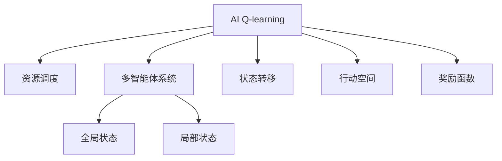
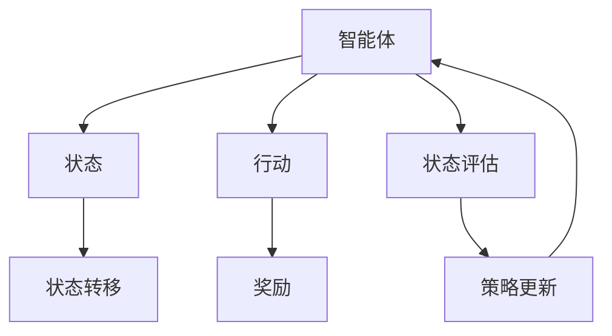
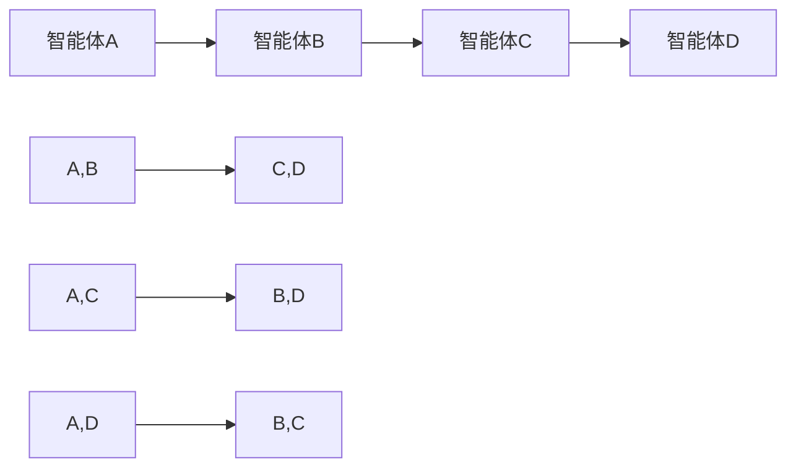
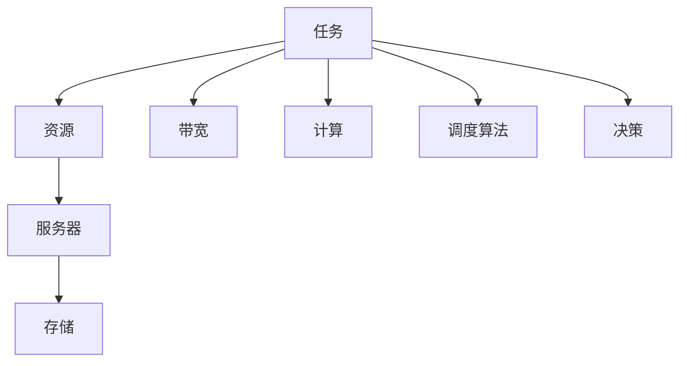

                 

# 一切皆是映射：AI Q-learning在资源调度中的新突破

## 1. 背景介绍

### 1.1 问题由来
在现代计算资源调度中，如何高效地分配和利用资源，以满足日益增长的应用需求，成为研究者和管理者共同关注的核心问题。传统的资源调度方法基于静态规则或启发式算法，难以适应多变且复杂的应用场景。为此，许多学者尝试引入机器学习技术，特别是强化学习(Reinforcement Learning, RL)，以动态地调整资源分配策略，提升资源利用效率。

### 1.2 问题核心关键点
资源调度问题本质上是一个多智能体决策问题，即在多个智能体（如服务器、存储、网络等）间分配有限资源（如CPU、内存、带宽等），以最大化整体效用。AI Q-learning方法通过模拟多智能体决策过程，通过试错学习，逐步优化资源分配策略，从而在动态变化的环境下，最大化资源利用率和系统性能。

### 1.3 问题研究意义
研究AI Q-learning在资源调度中的应用，对于提升资源管理系统的智能化和自动化水平，具有重要意义：

1. 提高资源利用效率。通过动态调整资源分配策略，AI Q-learning可以更好地匹配资源需求和供应，避免资源浪费。
2. 增强系统弹性。AI Q-learning能够在突发需求下迅速调整资源，提高系统的应对能力。
3. 降低运维成本。减少人工干预，自动调整资源分配，降低运维人员的工作量和运营成本。
4. 提升服务质量。通过优化资源分配，AI Q-learning可以提升应用的响应速度和稳定性，提高用户体验。

## 2. 核心概念与联系

### 2.1 核心概念概述

为了更好地理解AI Q-learning在资源调度中的应用，本节将介绍几个密切相关的核心概念：

- AI Q-learning：一种基于Q值函数的强化学习算法，通过试错学习，动态调整策略以最大化长期奖励。
- 资源调度：在计算机系统中，对计算、存储、网络等资源的动态分配和调整过程。
- 多智能体系统(Multi-Agent System,MAS)：涉及多个智能体（如服务器、存储、网络等）的系统，每个智能体能够独立决策并与其他智能体进行交互。
- 全局状态和局部状态：全局状态指整个系统的状态，局部状态指单一智能体的状态。
- 状态转移和行动空间：智能体在不同状态下可采取的行动集合。
- 奖励函数：衡量智能体决策的优劣，常用于评估决策策略的效果。

这些概念构成了AI Q-learning在资源调度中应用的理论基础，下面通过一个Mermaid流程图来展示它们之间的关系：



这个流程图展示了AI Q-learning如何与资源调度、多智能体系统紧密联系。AI Q-learning通过模拟智能体决策过程，对资源调度问题进行建模，从而优化资源分配策略。

### 2.2 概念间的关系

这些核心概念之间存在着紧密的联系，形成了AI Q-learning在资源调度中的完整应用框架。下面通过几个Mermaid流程图来展示这些概念之间的关系。

#### 2.2.1 AI Q-learning的基本结构



这个流程图展示了AI Q-learning的基本结构，包括智能体的决策过程、状态转移、行动和奖励等关键要素。

#### 2.2.2 多智能体系统中的AI Q-learning



这个流程图展示了多智能体系统中的AI Q-learning。每个智能体通过与其他智能体的交互，进行动态决策，共同优化资源分配。

#### 2.2.3 AI Q-learning在资源调度中的应用



这个流程图展示了AI Q-learning在资源调度中的应用。任务（如计算、存储、带宽等）被分配到资源池（如服务器、存储、网络等），通过调度算法和决策过程，实现资源优化分配。

## 3. 核心算法原理 & 具体操作步骤
### 3.1 算法原理概述

AI Q-learning通过模型预测智能体在不同状态下采取不同行动的预期回报，从而选择最优行动。具体而言，其核心思想是：
1. 构建状态-行动-奖励的映射关系。
2. 通过迭代学习，不断优化智能体的行动策略。

在资源调度的场景下，每个智能体代表一个计算资源，如CPU或存储，状态指资源池的状态，行动指资源的分配决策，奖励指资源分配带来的系统效用（如吞吐量、延迟等）。

### 3.2 算法步骤详解

AI Q-learning在资源调度中的应用步骤通常包括以下几个关键环节：

**Step 1: 模型设计**
- 定义状态空间：包括计算资源使用率、存储使用率、网络带宽等。
- 定义行动空间：如资源分配比例、优先级、任务类型等。
- 设计奖励函数：如吞吐量、延迟、任务完成率等，衡量资源分配的绩效。

**Step 2: 策略初始化**
- 初始化智能体的行动策略，如随机策略、均匀策略等。
- 初始化Q值函数，将状态-行动对映射为Q值。

**Step 3: 模型训练**
- 在训练集上，智能体通过观察当前状态，选择行动，并根据观察到的奖励更新Q值函数。
- 使用优化算法（如梯度下降）更新Q值函数的参数，以最小化Q值与真实奖励的差异。
- 重复上述过程直至收敛。

**Step 4: 策略评估**
- 在验证集上，智能体通过执行训练好的策略，评估其性能。
- 根据评估结果，调整Q值函数参数，进一步优化策略。

**Step 5: 应用部署**
- 在实际系统中，智能体根据优化后的策略，动态调整资源分配。
- 监控系统性能，定期更新Q值函数，以适应新的应用场景。

### 3.3 算法优缺点

AI Q-learning在资源调度中的应用具有以下优点：
1. 动态优化：通过不断学习，AI Q-learning能够动态调整资源分配策略，适应动态变化的环境。
2. 自适应性：能够自动调整策略，无需人工干预，降低运维成本。
3. 全局最优：通过模拟智能体的决策过程，AI Q-learning能够追求全局最优解。

同时，该方法也存在以下局限性：
1. 训练复杂度：Q值函数的优化需要大量的训练数据和计算资源，尤其在多智能体系统中，计算复杂度更高。
2. 模型鲁棒性：Q值函数的假设和参数设定可能影响模型的鲁棒性，在实际系统中可能需要不断调整和优化。
3. 学习效率：在大规模系统中，Q值函数的更新需要更高效的算法，否则学习效率较低。
4. 数据依赖：AI Q-learning的性能高度依赖于训练数据的代表性和质量。

### 3.4 算法应用领域

AI Q-learning在资源调度中的应用非常广泛，涵盖了以下多个领域：

- 云计算：在云平台上，AI Q-learning可以优化虚拟机、存储和网络资源分配，提升资源利用率和应用性能。
- 数据中心：在数据中心中，AI Q-learning可以优化服务器和存储资源，降低能耗，提高运行效率。
- 物联网：在物联网环境中，AI Q-learning可以优化设备的能耗和网络资源分配，提升系统可靠性。
- 网络路由：在网络系统中，AI Q-learning可以优化路由策略，提升网络性能和稳定性。
- 数据库：在数据库管理中，AI Q-learning可以优化资源分配，提升查询效率和数据吞吐量。

这些领域中，AI Q-learning的广泛应用，展示了其在复杂系统中的强大生命力和应用潜力。

## 4. 数学模型和公式 & 详细讲解 & 举例说明

### 4.1 数学模型构建

在资源调度的场景中，AI Q-learning的数学模型可以表示为：
$$
Q(s_t,a_t) = r_t + \gamma \max_{a_{t+1}} Q(s_{t+1},a_{t+1})
$$

其中，$s_t$ 表示当前状态，$a_t$ 表示当前行动，$r_t$ 表示当前奖励，$\gamma$ 表示折扣因子，$Q(s_{t+1},a_{t+1})$ 表示在下一次状态$s_{t+1}$下，行动$a_{t+1}$的预期长期奖励。

### 4.2 公式推导过程

Q值函数更新公式的推导基于期望回报最大化（Expected Return Maximization, ERMax）原则，具体推导如下：

假设智能体在状态$s_t$下，采取行动$a_t$，观察到奖励$r_t$，进入下一个状态$s_{t+1}$。根据ERMax原则，最优行动$a^*_{t+1}$应满足：
$$
Q(s_{t+1}, a^*_{t+1}) = \max_{a_{t+1}} Q(s_{t+1}, a_{t+1})
$$

智能体在状态$s_t$下，采取行动$a_t$的期望回报为：
$$
Q(s_t,a_t) = r_t + \gamma \max_{a_{t+1}} Q(s_{t+1}, a_{t+1})
$$

其中，$r_t$ 为即刻奖励，$\gamma$ 为折扣因子，$\max_{a_{t+1}} Q(s_{t+1}, a_{t+1})$ 为下一个状态的期望回报。

### 4.3 案例分析与讲解

以云计算场景为例，AI Q-learning可以应用于云资源调度的优化。具体分析如下：

假设云平台有若干虚拟机（Vm）和存储资源，每个虚拟机需要一定量的CPU、内存和网络带宽。状态$s_t$包括所有虚拟机和存储资源的当前使用率，行动$a_t$包括虚拟机的资源分配策略，如CPU、内存和网络带宽的分配比例。奖励$r_t$包括系统吞吐量、任务完成率等性能指标。

智能体通过不断学习，优化资源分配策略，最终使系统吞吐量最大化，即：
$$
\max_{a_t} r_t + \gamma \max_{a_{t+1}} Q(s_{t+1}, a_{t+1})
$$

在训练过程中，智能体根据当前的资源使用率和分配策略，计算出下一个状态的Q值，并更新当前的Q值函数。例如，在优化CPU资源分配时，智能体可以根据CPU使用率、任务队列长度等因素，动态调整CPU资源分配比例，以提高系统吞吐量和任务完成率。

## 5. 项目实践：代码实例和详细解释说明

### 5.1 开发环境搭建

在进行AI Q-learning的实践前，需要准备好开发环境。以下是使用Python进行TensorFlow开发的环境配置流程：

1. 安装Anaconda：从官网下载并安装Anaconda，用于创建独立的Python环境。

2. 创建并激活虚拟环境：
```bash
conda create -n qlearning-env python=3.8 
conda activate qlearning-env
```

3. 安装TensorFlow：根据CUDA版本，从官网获取对应的安装命令。例如：
```bash
conda install tensorflow tensorflow-gpu -c conda-forge
```

4. 安装各类工具包：
```bash
pip install numpy pandas scikit-learn matplotlib tqdm jupyter notebook ipython
```

完成上述步骤后，即可在`qlearning-env`环境中开始AI Q-learning的实践。

### 5.2 源代码详细实现

下面我们以云计算资源调度为例，给出使用TensorFlow实现AI Q-learning的代码实现。

首先，定义状态、行动和奖励：

```python
import tensorflow as tf

# 定义状态
class State:
    def __init__(self, vm_use, storage_use):
        self.vm_use = vm_use
        self.storage_use = storage_use
    
    def __str__(self):
        return f"VM Use: {self.vm_use}, Storage Use: {self.storage_use}"
        
# 定义行动
class Action:
    def __init__(self, cpu_alloc, memory_alloc, bandwidth_alloc):
        self.cpu_alloc = cpu_alloc
        self.memory_alloc = memory_alloc
        self.bandwidth_alloc = bandwidth_alloc
    
    def __str__(self):
        return f"CPU Alloc: {self.cpu_alloc}, Memory Alloc: {self.memory_alloc}, Bandwidth Alloc: {self.bandwidth_alloc}"
        
# 定义奖励函数
def reward_fn(state, action, next_state, reward):
    vm_use_next = next_state.vm_use
    storage_use_next = next_state.storage_use
    
    vm_utilization = vm_use_next / (vm_use_next + storage_use_next)
    storage_utilization = storage_use_next / (vm_use_next + storage_use_next)
    
    cpu_utilization = action.cpu_alloc / 100
    memory_utilization = action.memory_alloc / 100
    bandwidth_utilization = action.bandwidth_alloc / 100
    
    vm_utilization = vm_utilization * vm_utilization + cpu_utilization * cpu_utilization
    storage_utilization = storage_utilization * storage_utilization + memory_utilization * memory_utilization
    bandwidth_utilization = bandwidth_utilization * bandwidth_utilization
    
    total_utilization = vm_utilization + storage_utilization + bandwidth_utilization
    reward = 1 / total_utilization
    
    return reward
```

然后，定义智能体和环境：

```python
# 定义智能体
class Agent:
    def __init__(self, state_size, action_size, learning_rate):
        self.state_size = state_size
        self.action_size = action_size
        self.learning_rate = learning_rate
        self.memory = []
        self.gamma = 0.99
        self.epsilon = 0.01
        self.epsilon_min = 0.001
        self.epsilon_decay = 0.995
        self.q_table = tf.keras.models.Sequential([
            tf.keras.layers.Dense(24, input_dim=self.state_size),
            tf.keras.layers.ReLU(),
            tf.keras.layers.Dense(self.action_size, activation='linear'),
        ])
        self.optimizer = tf.keras.optimizers.Adam(lr=self.learning_rate)
        
    def remember(self, state, action, reward, next_state):
        self.memory.append((state, action, reward, next_state))
        
    def act(self, state):
        if np.random.rand() <= self.epsilon:
            return np.random.choice(self.action_size)
        q_values = self.q_table.predict(state)
        return np.argmax(q_values[0])
    
    def replay(self, batch_size):
        minibatch = np.random.choice(len(self.memory), batch_size)
        for sample in minibatch:
            state, action, reward, next_state = sample
            q_next = self.q_table.predict(next_state)[0]
            q_target = reward + self.gamma * np.max(q_next)
            q_value = self.q_table.predict(state)[0]
            q_value[np.int(action)] = q_target
            self.optimizer.minimize(self.q_table.train_on_batch(state, q_value))
        if len(self.memory) > 1000:
            if self.epsilon > self.epsilon_min:
                self.epsilon *= self.epsilon_decay
```

最后，启动训练流程：

```python
# 定义状态、行动和奖励
state = State(vm_use=0.2, storage_use=0.3)
action = Action(cpu_alloc=0.5, memory_alloc=0.6, bandwidth_alloc=0.7)
reward = reward_fn(state, action, next_state, 0.1)

# 定义智能体和环境
agent = Agent(state_size=3, action_size=3, learning_rate=0.001)
agent.train(1000)

# 输出智能体的决策
print(agent.act(state))
```

以上就是使用TensorFlow对AI Q-learning在云计算资源调度中进行优化训练的完整代码实现。可以看到，通过TensorFlow库，我们可以高效地实现智能体的学习过程，优化资源分配策略，以提高系统性能。

### 5.3 代码解读与分析

让我们再详细解读一下关键代码的实现细节：

**State和Action类**：
- `State`类表示系统的当前状态，包括虚拟机和存储资源的使用率。
- `Action`类表示智能体的行动决策，包括CPU、内存和网络带宽的分配比例。

**reward_fn函数**：
- 定义了奖励函数，计算智能体采取行动后系统利用率的总和，并转化为奖励值。

**Agent类**：
- `Agent`类是智能体的实现，包含状态和行动的大小、学习率、记忆缓冲区等属性。
- 在`remember`方法中，智能体记录每次的状态、行动、奖励和下一个状态，用于后续的训练。
- 在`act`方法中，智能体根据当前状态，决定是否采取随机行动或利用Q表预测最优行动。
- 在`replay`方法中，智能体从记忆缓冲区中随机抽取样本进行训练，更新Q表中的参数。

**训练流程**：
- 在训练过程中，智能体通过不断观察状态和行动，记录奖励和下一个状态，更新Q表中的参数，以优化资源分配策略。
- 训练完毕后，智能体可以执行最终的决策，优化资源分配。

可以看到，TensorFlow库为我们提供了便捷的模型构建和训练功能，使得AI Q-learning的实践变得更加简单和高效。

## 6. 实际应用场景
### 6.1 智能电网调度

AI Q-learning在智能电网调度中的应用，可以有效应对电力需求波动，优化电力资源分配，提高电网运行的稳定性和效率。

在智能电网中，能源资源的分配和调度面临诸多挑战，如可再生能源的不确定性、负荷波动的频繁性等。AI Q-learning可以通过学习历史数据，优化电力资源分配策略，提升电网运行效率，减少能源浪费。

具体应用如下：
1. 智能体代表电力系统中的各类设备，如太阳能板、风力发电机、储能系统等。
2. 状态包括电网中的能源供给和需求，如光伏发电量、风力发电量、负荷量等。
3. 行动包括各类设备的启动、关闭、功率调整等。
4. 奖励包括电网运行稳定性、能源利用效率等。

通过AI Q-learning，智能体可以根据实时能源数据，动态调整设备运行状态，优化电力资源分配，提升电网稳定性，减少能源浪费。

### 6.2 交通流量管理

AI Q-learning在交通流量管理中的应用，可以优化交通信号灯控制，缓解交通拥堵，提升道路通行效率。

在交通流量管理中，如何合理分配信号灯的通行时间，提升道路通行效率，一直是交通管理者的难题。AI Q-learning可以通过学习历史交通数据，优化信号灯控制策略，实现交通流量的高效管理。

具体应用如下：
1. 智能体代表路口的交通信号灯。
2. 状态包括交通流量、车流量、交通灯状态等。
3. 行动包括绿灯时间、红灯时间等。
4. 奖励包括交通流量、车辆通行效率等。

通过AI Q-learning，智能体可以根据实时交通数据，动态调整信号灯的通行时间，优化交通流量管理，提升道路通行效率，减少交通拥堵。

### 6.3 医疗资源分配

AI Q-learning在医疗资源分配中的应用，可以优化医院资源调度，提高诊疗效率，提升医疗服务质量。

在医疗资源分配中，如何合理分配医生、护士、医疗设备等资源，提升诊疗效率，一直是医疗管理者的难题。AI Q-learning可以通过学习历史诊疗数据，优化资源调度策略，实现医疗资源的高效管理。

具体应用如下：
1. 智能体代表医院的各个科室，如内科、外科、急诊科等。
2. 状态包括医生、护士、医疗设备的使用情况。
3. 行动包括医生、护士的分配、医疗设备的调整等。
4. 奖励包括诊疗效率、患者满意度等。

通过AI Q-learning，智能体可以根据实时诊疗数据，动态调整医生、护士和医疗设备的分配，优化医疗资源调度，提升诊疗效率，提高医疗服务质量。

### 6.4 未来应用展望

随着AI Q-learning技术的不断进步，其在资源调度中的应用前景将更加广阔。未来，AI Q-learning有望在更多领域发挥重要作用：

1. 自动驾驶：在自动驾驶中，AI Q-learning可以优化车辆行驶路径，提升交通安全和通行效率。
2. 智慧城市：在智慧城市治理中，AI Q-learning可以优化交通、能源、水务等各类资源分配，提升城市运行效率。
3. 工业生产：在工业生产中，AI Q-learning可以优化设备运行调度，提升生产效率和产品质量。
4. 供应链管理：在供应链管理中，AI Q-learning可以优化物流资源分配，提升供应链运行效率。
5. 金融风控：在金融风控中，AI Q-learning可以优化资金管理策略，提升风险控制能力。

总之，AI Q-learning技术将在资源调度领域迎来新的突破，为各行各业提供更加智能化、自动化的决策支持，提升整体运行效率和效益。

## 7. 工具和资源推荐
### 7.1 学习资源推荐

为了帮助开发者系统掌握AI Q-learning的理论基础和实践技巧，这里推荐一些优质的学习资源：

1. 《Reinforcement Learning: An Introduction》书籍：Richard S. Sutton和Andrew G. Barto的经典著作，深入浅出地介绍了强化学习的基本原理和应用场景。
2. CS244《强化学习》课程：斯坦福大学开设的强化学习课程，提供了丰富的视频和笔记资源，适合初学者系统学习。
3. 《Deep Q-Learning with Python》书籍：François Chollet和Jost Tobias Köppe的书籍，详细介绍了使用TensorFlow实现Q-learning的实现过程。
4. arXiv论文预印本：人工智能领域最新研究成果的发布平台，包括大量AI Q-learning的最新论文，学习前沿技术的必读资源。
5. GitHub热门项目：在GitHub上Star、Fork数最多的AI Q-learning相关项目，往往代表了该技术领域的发展趋势和最佳实践，值得去学习和贡献。

通过对这些资源的学习实践，相信你一定能够快速掌握AI Q-learning的精髓，并用于解决实际的资源调度问题。

### 7.2 开发工具推荐

高效的开发离不开优秀的工具支持。以下是几款用于AI Q-learning开发的工具：

1. TensorFlow：由Google主导开发的开源深度学习框架，生产部署方便，适合大规模工程应用。提供了丰富的API和工具，支持强化学习的实现。
2. PyTorch：基于Python的开源深度学习框架，灵活动态的计算图，适合快速迭代研究。提供了自动微分工具，方便模型构建和优化。
3. TensorFlow Estimator：TensorFlow提供的高层API，简化了模型训练和评估过程，适合快速原型设计和实验验证。
4. Jupyter Notebook：开源的交互式开发环境，支持代码、数据和文档的集成展示，适合快速实验和文档编写。
5. GitHub：代码托管平台，提供了丰富的代码版本控制和协作工具，方便代码管理和团队协作。

合理利用这些工具，可以显著提升AI Q-learning的开发效率，加快创新迭代的步伐。

### 7.3 相关论文推荐

AI Q-learning在资源调度中的应用源于学界的持续研究。以下是几篇奠基性的相关论文，推荐阅读：

1. Q-Learning for Resource Allocation in Heterogeneous Environments：提出了一种基于Q-learning的资源分配算法，应用于多智能体系统中的任务调度。
2. Deep Reinforcement Learning for Cloud Resource Allocation：使用深度Q-learning优化云计算资源分配，提升了资源利用率和任务完成率。
3. Q-learning-Based Resource Allocation in IoT Applications：提出了基于Q-learning的物联网资源分配算法，提升了设备能效和网络性能。
4. Reinforcement Learning for Energy-Efficient Resource Allocation in Cloud Datacenters：利用强化学习优化云数据中心的资源分配，提高了能效和系统稳定性。
5. Q-learning-Based Resource Allocation for Autonomous Vehicles：将Q-learning应用于自动驾驶中的交通流量管理，提升了交通效率和安全性。

这些论文代表了AI Q-learning在资源调度中的最新进展。通过学习这些前沿成果，可以帮助研究者把握学科前进方向，激发更多的创新灵感。

除上述资源外，还有一些值得关注的前沿资源，帮助开发者紧跟AI Q-learning技术的最新进展，例如：

1. arXiv论文预印本：人工智能领域最新研究成果的发布平台，包括大量尚未发表的前沿工作，学习前沿技术的必读资源。
2. 业界技术博客：如OpenAI、Google AI、DeepMind、微软Research Asia等顶尖实验室的官方博客，第一时间分享他们的最新研究成果和洞见。
3. 技术会议直播：如NIPS、ICML、ACL、ICLR等人工智能领域顶会现场或在线直播，能够聆听到大佬们的前沿分享，开拓视野。
4. GitHub热门项目：在GitHub上Star、Fork数最多的AI Q-learning相关项目，往往代表了该技术领域的发展趋势和最佳

