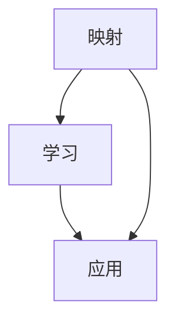
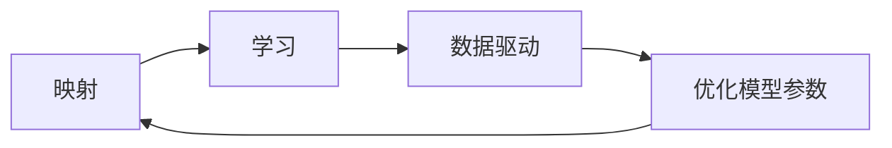
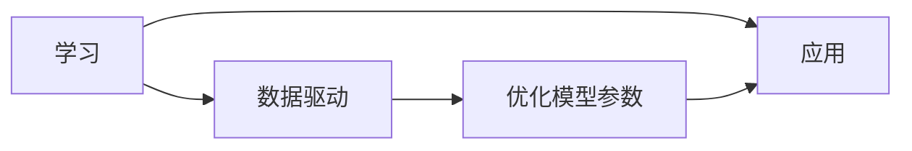
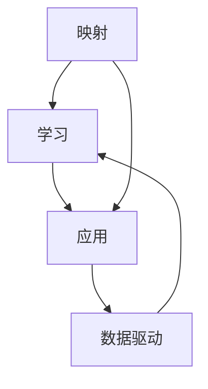
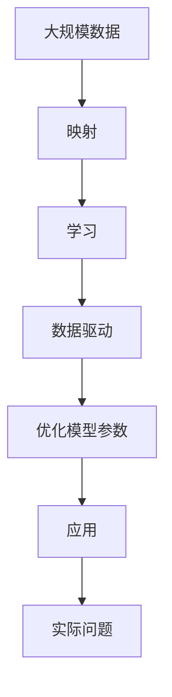

                 

# 一切皆是映射：AI人工智能原理与应用实战简介

> 关键词：人工智能, 映射, 大数据, 机器学习, 深度学习, 自然语言处理, 计算机视觉, 推荐系统

## 1. 背景介绍

### 1.1 问题由来

随着计算机技术的飞速发展，人工智能（AI）已经成为驱动未来科技进步的核心动力。在众多AI应用中，机器学习（Machine Learning, ML）和深度学习（Deep Learning, DL）占据了重要地位。它们通过数据驱动的方式，使计算机系统能够学习模式，从而进行预测、分类、生成等任务。

在早期，AI主要通过符号规则进行逻辑推理，但这种“理性”思维方式往往难以应对现实世界中的复杂性和不确定性。而随着大数据时代的到来，AI开始转向基于数据驱动的“感知学习”。在这个过程中，AI能够从大量数据中提取出有意义的特征，并在新的数据上应用这些特征，做出合理的预测或决策。

### 1.2 问题核心关键点

AI的核心在于将现实世界的复杂现象映射为计算模型中的简单表示。这种映射过程需要基于数据进行学习，通过不断优化模型参数，使其能够更好地适应新数据的分布。这种学习机制的核心便是“映射”，而映射的方式则多种多样。

AI的映射机制主要分为两大类：符号映射和统计映射。符号映射通过逻辑推理和规则定义进行数据处理，如专家系统中的IF-THEN规则。而统计映射则通过概率和统计方法，利用大量数据进行学习，如深度学习中的神经网络。

在实际应用中，AI通过将现实世界的映射应用于各种问题，如自然语言处理（Natural Language Processing, NLP）、计算机视觉（Computer Vision, CV）、推荐系统（Recommendation System）等，已经取得了巨大的成功。

### 1.3 问题研究意义

了解AI的映射机制及其在实际应用中的表现，对于从事AI相关研究或应用开发的人员具有重要意义：

1. **洞察问题本质**：通过学习AI的映射机制，能够更深入地理解问题的本质，从而设计出更为有效的解决方案。
2. **提升系统性能**：掌握各种映射方式的特点和适用场景，有助于在实际项目中选取最优的算法和模型。
3. **拓展应用领域**：AI的映射机制不仅适用于已有的领域，还能够被拓展到更多新兴领域，如医疗、金融、物流等，带来新的发展机遇。
4. **促进知识迁移**：通过学习AI的映射机制，能够在不同领域之间进行知识迁移，提升AI技术在各领域的应用水平。
5. **推动技术进步**：深入理解AI的映射机制，有助于推动AI技术的发展，解决更多复杂的现实问题。

## 2. 核心概念与联系

### 2.1 核心概念概述

AI的核心概念包括多个层次，从基础的“映射”机制，到高层的“学习”机制，再到实际的“应用”机制。这些概念之间相互关联，形成了AI技术的完整框架。

- **映射（Mapping）**：将现实世界的复杂现象映射为计算模型中的简单表示。
- **学习（Learning）**：通过数据驱动的方式，不断优化模型参数，使其能够适应新数据的分布。
- **应用（Application）**：将学习到的模型应用于各种实际问题，如NLP、CV、推荐系统等。

这些概念之间的关系可以通过以下Mermaid流程图来展示：



### 2.2 概念间的关系

这些核心概念之间存在着紧密的联系，形成了AI技术的完整生态系统。下面我们通过几个Mermaid流程图来展示这些概念之间的关系。

#### 2.2.1 映射和学习的关联



这个流程图展示了映射和学习的关联。学习是通过数据驱动的方式，不断优化模型参数，使其能够更好地适应新数据的分布。

#### 2.2.2 学习与应用的关系



这个流程图展示了学习与应用的关系。学习是通过数据驱动的方式，优化模型参数，从而使其能够应用于各种实际问题。

#### 2.2.3 映射、学习与应用的整体架构



这个综合流程图展示了映射、学习与应用的整体架构。映射是学习的起点，学习是为了更好地应用，应用则是映射的最终目标。

### 2.3 核心概念的整体架构

最后，我们用一个综合的流程图来展示这些核心概念在大规模应用中的整体架构：



这个综合流程图展示了从大规模数据到应用实际问题的完整过程。大规模数据通过映射被转化为了计算模型中的简单表示，通过学习不断优化模型参数，最终应用于实际问题中。

## 3. 核心算法原理 & 具体操作步骤
### 3.1 算法原理概述

AI的映射和学习机制主要依赖于数学和统计方法。其中，概率论和统计学提供了模型学习的理论基础，而线性代数和微积分则提供了优化算法的基础。这些数学工具构成了AI的核心算法原理。

在大规模应用中，AI通过将数据映射为计算模型中的简单表示，学习这些表示，并将其应用于实际问题中。例如，在NLP中，AI可以将文本映射为词向量，学习这些词向量之间的关系，然后用于文本分类、情感分析等任务。

### 3.2 算法步骤详解

AI的映射和学习机制通常包括以下几个关键步骤：

**Step 1: 数据准备**

1. **数据收集**：收集现实世界中的大量数据，用于映射和学习的训练。
2. **数据预处理**：对数据进行清洗、归一化、分词等处理，以便于后续的映射和模型训练。

**Step 2: 特征提取**

1. **特征选择**：根据任务需求，选择或设计合适的特征进行映射。
2. **特征转换**：利用统计方法和映射算法，将原始数据转换为计算模型中的简单表示。

**Step 3: 模型训练**

1. **模型选择**：选择合适的模型，如神经网络、决策树等。
2. **参数优化**：利用数据驱动的方式，不断优化模型参数，使其能够适应新数据的分布。

**Step 4: 模型应用**

1. **模型部署**：将训练好的模型部署到实际应用中，进行预测或分类。
2. **结果评估**：对模型的预测结果进行评估，优化模型性能。

### 3.3 算法优缺点

AI的映射和学习机制具有以下优点：

1. **数据驱动**：能够从大规模数据中学习规律，适用于各种复杂的现实问题。
2. **模型可解释性**：通过选择和设计合适的特征，能够使模型的决策过程透明化。
3. **泛化能力强**：通过不断优化模型参数，能够适应新数据的分布。

同时，AI的映射和学习机制也存在一些缺点：

1. **数据依赖性**：模型的性能依赖于数据的质量和数量，数据不足或数据偏差可能导致模型表现不佳。
2. **计算资源消耗大**：大规模数据和复杂模型的训练和部署需要大量的计算资源。
3. **模型复杂性**：复杂的模型可能难以理解和调试，需要专业知识进行维护和优化。

### 3.4 算法应用领域

AI的映射和学习机制在多个领域中得到了广泛应用，例如：

- **自然语言处理（NLP）**：通过将文本映射为词向量，学习这些向量之间的关系，实现文本分类、情感分析、机器翻译等任务。
- **计算机视觉（CV）**：通过将图像映射为特征向量，学习这些向量的表示，实现图像分类、目标检测、图像生成等任务。
- **推荐系统（Recommendation System）**：通过将用户行为映射为特征向量，学习这些向量的关系，实现个性化推荐。
- **金融预测**：通过将历史数据映射为特征向量，学习这些向量的关系，实现股票预测、风险评估等任务。
- **医疗诊断**：通过将医学数据映射为特征向量，学习这些向量的关系，实现疾病诊断、治疗方案推荐等任务。

## 4. 数学模型和公式 & 详细讲解 & 举例说明

### 4.1 数学模型构建

AI的映射和学习机制通常基于概率模型和统计模型。以下是一个简单的线性回归模型的构建过程：

1. **数据准备**：收集历史数据，将每个数据点表示为$(x_i, y_i)$，其中$x_i$为输入特征，$y_i$为输出标签。
2. **特征提取**：将输入特征$x_i$转换为向量表示$\vec{x_i}$。
3. **模型选择**：选择线性回归模型$y_i = \vec{w} \cdot \vec{x_i} + b$，其中$\vec{w}$为权重向量，$b$为偏置项。
4. **模型训练**：利用最小二乘法优化模型参数$\vec{w}$和$b$，使得预测值与真实值之间的误差最小化。

### 4.2 公式推导过程

以线性回归模型为例，我们推导其最小二乘法的公式。设样本数为$N$，输入特征为$\vec{x_i} = (x_{i1}, x_{i2}, ..., x_{id})^T$，输出标签为$y_i$，权重向量为$\vec{w} = (w_1, w_2, ..., w_d)^T$，偏置项为$b$。则线性回归模型的预测值$\hat{y_i}$为：

$$
\hat{y_i} = \vec{w} \cdot \vec{x_i} + b
$$

其误差平方和$L$为：

$$
L = \sum_{i=1}^{N}(y_i - \hat{y_i})^2 = \sum_{i=1}^{N}(y_i - \vec{w} \cdot \vec{x_i} - b)^2
$$

为了最小化误差平方和，我们需要对模型参数$\vec{w}$和$b$进行优化。最小二乘法的目标是最小化$L$，即：

$$
\min_{\vec{w}, b} L
$$

通过对$L$对$\vec{w}$和$b$求偏导数，并令其为0，我们可以得到：

$$
\vec{w} = (\frac{1}{N}\sum_{i=1}^{N}\vec{x_i}\vec{x_i}^T)^{-1}(\frac{1}{N}\sum_{i=1}^{N}\vec{x_i}y_i)
$$

$$
b = \frac{1}{N}\sum_{i=1}^{N}y_i - \vec{w} \cdot \bar{\vec{x}}_i
$$

其中$\bar{\vec{x}}_i$为输入特征的平均值。

### 4.3 案例分析与讲解

以图像分类为例，我们利用卷积神经网络（Convolutional Neural Network, CNN）进行图像分类。

1. **数据准备**：收集大量图像数据，将其分为训练集和测试集。
2. **特征提取**：利用卷积层和池化层提取图像特征，将其转换为高维向量表示。
3. **模型选择**：选择多层的卷积神经网络模型，利用softmax层输出分类概率。
4. **模型训练**：利用交叉熵损失函数优化模型参数，使得预测结果与真实标签之间的误差最小化。
5. **模型应用**：将训练好的模型应用于新的图像数据，进行分类预测。

## 5. 项目实践：代码实例和详细解释说明

### 5.1 开发环境搭建

在Python中进行AI项目开发，需要进行环境配置。以下是Python开发环境的搭建流程：

1. **安装Python**：下载并安装最新版本的Python，建议选择3.7及以上版本。
2. **安装Anaconda**：从官网下载并安装Anaconda，用于创建独立的Python环境。
3. **创建虚拟环境**：
```bash
conda create -n ai-env python=3.7
conda activate ai-env
```
4. **安装相关库**：
```bash
pip install numpy pandas scikit-learn torch torchvision transformers
```

### 5.2 源代码详细实现

我们以Keras框架实现线性回归模型为例，展示其代码实现。

```python
import numpy as np
from sklearn.datasets import load_boston
from sklearn.model_selection import train_test_split
from sklearn.metrics import mean_squared_error
from tensorflow.keras.models import Sequential
from tensorflow.keras.layers import Dense, Input
from tensorflow.keras.optimizers import Adam

# 加载波士顿房价数据集
boston = load_boston()
X = boston.data
y = boston.target

# 划分训练集和测试集
X_train, X_test, y_train, y_test = train_test_split(X, y, test_size=0.2, random_state=42)

# 构建模型
model = Sequential()
model.add(Dense(units=1, input_dim=X_train.shape[1]))
model.compile(optimizer=Adam(), loss='mean_squared_error')

# 训练模型
model.fit(X_train, y_train, epochs=100, batch_size=32, verbose=0)

# 评估模型
y_pred = model.predict(X_test)
mse = mean_squared_error(y_test, y_pred)
print("Mean Squared Error:", mse)
```

### 5.3 代码解读与分析

上述代码实现了线性回归模型的训练和评估，关键步骤包括：

1. **数据准备**：加载波士顿房价数据集，将其分为训练集和测试集。
2. **模型构建**：使用Keras框架构建一个简单的线性回归模型，包含一个输入层和一个输出层。
3. **模型训练**：利用Adam优化器，最小化均方误差，训练模型100个epoch。
4. **模型评估**：在测试集上评估模型的预测结果，计算均方误差。

## 6. 实际应用场景

### 6.1 金融风险评估

在金融领域，AI被广泛用于风险评估。通过将历史数据映射为特征向量，学习这些向量的关系，可以预测股票的涨跌趋势、市场风险等。例如，利用机器学习模型对客户的信用评分进行预测，可以降低金融机构的坏账率，提高风险控制能力。

### 6.2 医疗影像诊断

在医疗领域，AI被用于影像诊断。通过将影像数据映射为特征向量，学习这些向量的关系，可以辅助医生进行疾病诊断和治疗方案的推荐。例如，利用卷积神经网络对医疗影像进行分类，可以自动识别肿瘤、骨折等疾病，提高诊断效率和准确性。

### 6.3 智能推荐系统

在推荐系统中，AI被用于个性化推荐。通过将用户行为映射为特征向量，学习这些向量的关系，可以推荐用户可能感兴趣的商品、文章等。例如，利用协同过滤算法和深度学习模型，可以为用户生成个性化的商品推荐列表，提升用户体验和满意度。

### 6.4 未来应用展望

随着AI技术的不断发展，未来AI的应用场景将会更加广泛和深入。以下是几个可能的未来应用方向：

1. **智能交通管理**：利用AI对交通数据进行分析，预测交通流量，优化交通信号灯控制，减少拥堵，提高交通效率。
2. **智慧城市建设**：利用AI对城市数据进行综合分析，优化城市管理，提升公共服务质量。
3. **智能客服系统**：利用AI进行自然语言处理，提供24小时不间断的客服支持，提升客户满意度。
4. **智能制造**：利用AI对生产数据进行实时分析，优化生产流程，提高生产效率和产品质量。

## 7. 工具和资源推荐

### 7.1 学习资源推荐

以下是一些推荐的AI学习资源：

1. **《深度学习》（Ian Goodfellow）**：系统介绍深度学习的基本概念和算法，适合入门学习。
2. **《机器学习实战》（Peter Harrington）**：通过Python代码实现机器学习算法，适合实践学习。
3. **Coursera的《机器学习》课程**：由斯坦福大学教授Andrew Ng开设，涵盖机器学习的基本概念和算法，适合系统学习。
4. **Kaggle竞赛平台**：参与各种数据科学竞赛，积累实战经验。
5. **GitHub代码库**：学习前沿的AI代码实现，提升编程能力。

### 7.2 开发工具推荐

以下是一些推荐的AI开发工具：

1. **TensorFlow**：由Google开发的深度学习框架，支持分布式计算，适合大规模项目开发。
2. **PyTorch**：由Facebook开发的深度学习框架，灵活易用，适合研究开发。
3. **Keras**：基于TensorFlow和Theano的高层API，易于上手，适合快速原型开发。
4. **Jupyter Notebook**：用于数据分析和模型训练的交互式开发环境，适合快速迭代和实验。
5. **VSCode**：轻量级的代码编辑器，支持Python和其他编程语言，适合代码开发。

### 7.3 相关论文推荐

以下是一些推荐的AI相关论文：

1. **《ImageNet分类》（Alex Krizhevsky et al.）**：提出深度卷积神经网络，在ImageNet数据集上取得突破性成绩。
2. **《自然语言处理的深度学习》（Yoshua Bengio et al.）**：全面介绍深度学习在自然语言处理中的应用。
3. **《深度学习与人类智慧》（Deng Xu et al.）**：探讨深度学习与人类智慧之间的关系，具有深度思考。
4. **《深度学习理论与应用》（Jerry Zhang）**：系统介绍深度学习的理论基础和应用案例，适合综合学习。
5. **《人工智能的未来》（Ian Goodfellow）**：探讨人工智能的未来发展方向和潜在风险，具有前瞻性。

## 8. 总结：未来发展趋势与挑战

### 8.1 研究成果总结

本文对AI的映射和学习机制进行了详细介绍，涵盖从基础概念到具体应用的各个方面。通过系统梳理，我们可以更好地理解AI技术的内在逻辑和实际应用。

### 8.2 未来发展趋势

AI的未来发展趋势主要包括以下几个方向：

1. **多模态学习**：融合视觉、语音、文本等多种模态数据，提升AI的感知能力。
2. **联邦学习**：在保护用户隐私的前提下，利用分布式数据进行模型训练，提升AI的泛化能力。
3. **自适应学习**：通过实时数据流进行动态学习，提升AI的适应性和鲁棒性。
4. **可解释性**：增强AI模型的可解释性，提升用户信任和接受度。
5. **自主学习**：赋予AI更高的自主性和智能性，提升其决策能力和创新能力。

### 8.3 面临的挑战

AI的发展也面临着一些挑战：

1. **数据质量和数量**：数据质量和数量不足，可能导致模型性能不佳。
2. **计算资源限制**：大规模数据和复杂模型的训练和部署需要大量计算资源。
3. **模型复杂性**：复杂的模型难以理解和调试，需要专业知识进行维护和优化。
4. **伦理和安全性**：AI模型可能存在偏见和伦理问题，需要严格的监管和控制。
5. **隐私保护**：AI模型的训练和应用涉及大量数据，需要保护用户隐私。

### 8.4 研究展望

面对AI发展中的挑战，未来的研究方向可能包括以下几个方面：

1. **数据增强技术**：通过数据增强，提升数据质量和数量，提高模型性能。
2. **模型压缩技术**：通过模型压缩，降低计算资源消耗，提高模型效率。
3. **解释性技术**：通过可解释性技术，提升AI模型的可理解和可解释性。
4. **隐私保护技术**：通过隐私保护技术，保护用户数据隐私。
5. **联邦学习技术**：通过联邦学习，提升AI模型的泛化能力和鲁棒性。

## 9. 附录：常见问题与解答

### Q1: AI的核心是什么？

A: AI的核心在于将现实世界的复杂现象映射为计算模型中的简单表示，并通过数据驱动的方式不断优化模型参数，使其能够适应新数据的分布。

### Q2: AI的映射和学习的具体步骤是什么？

A: AI的映射和学习通常包括以下几个步骤：数据准备、特征提取、模型训练和模型应用。数据准备包括数据收集和预处理，特征提取包括选择或设计合适的特征进行映射，模型训练包括选择和优化模型参数，模型应用包括将训练好的模型部署到实际问题中进行预测或分类。

### Q3: AI的应用领域有哪些？

A: AI在多个领域中得到了广泛应用，包括自然语言处理、计算机视觉、推荐系统、金融预测、医疗诊断等。

### Q4: AI的优缺点有哪些？

A: AI的优点包括数据驱动、模型可解释性强、泛化能力强。缺点包括数据依赖性强、计算资源消耗大、模型复杂性高。

### Q5: AI的未来发展趋势是什么？

A: AI的未来发展趋势包括多模态学习、联邦学习、自适应学习、可解释性增强、自主学习能力提升。

---

作者：禅与计算机程序设计艺术 / Zen and the Art of Computer Programming

