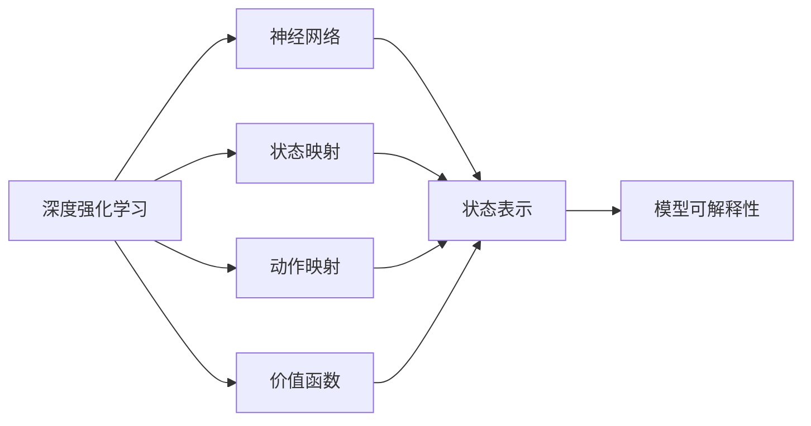
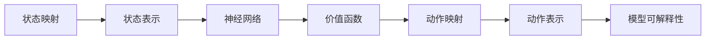
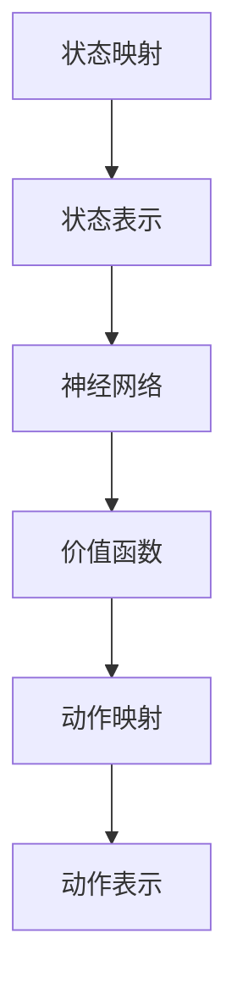
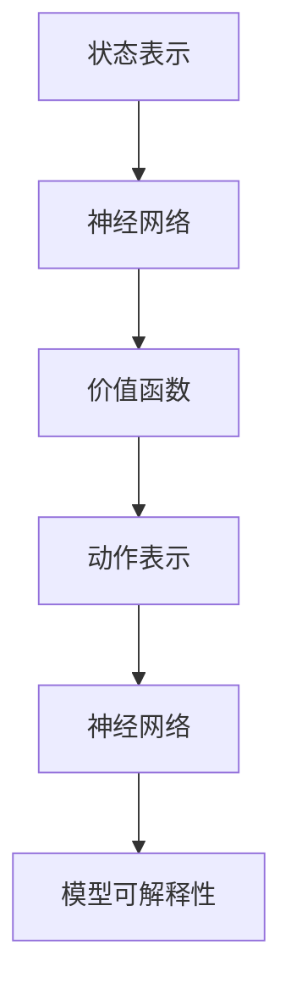
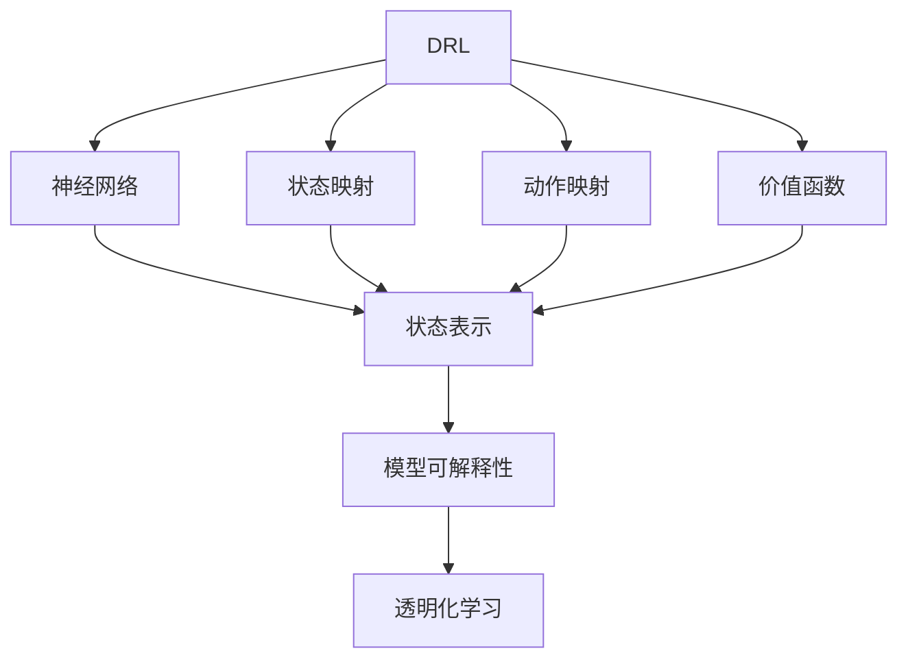

                 

# 一切皆是映射：DQN的可解释性研究：从黑盒到白盒

> 关键词：深度强化学习,深度学习,神经网络,算法可解释性,状态映射,动作映射,价值函数

## 1. 背景介绍

### 1.1 问题由来
近年来，深度强化学习(DRL)在自动控制、游戏AI、机器人导航等领域取得了巨大的成功。尤其是深度Q网络（Deep Q-Networks, DQN），其基于神经网络的价值函数，通过近似的Q-learning策略更新，在控制复杂环境中表现出卓越的性能。然而，DQN往往被视为一个"黑盒"模型，难以理解其内部决策机制和行为逻辑。为了解决这一问题，研究者们提出了多种可解释性方法，以期在增强模型透明度的同时，保持其性能。

### 1.2 问题核心关键点
可解释性在人工智能领域中具有重要意义。DQN的可解释性研究不仅有助于理解模型的行为逻辑，还能帮助开发者对模型进行调整和优化。

可解释性研究的核心点包括：
- 状态映射(状态表示)：将环境中的状态信息映射为神经网络可以处理的形式，即提取关键特征。
- 动作映射(动作表示)：将环境中的动作映射为神经网络可以处理的输入，如将连续动作映射为离散形式。
- 价值函数(奖励映射)：设计合理的奖励函数，引导模型学习最优策略。

### 1.3 问题研究意义
DQN的可解释性研究对于拓展深度强化学习的应用范围，提升模型的可解释性和可信度，加速模型优化与调试，具有重要意义：

1. 提高透明度：通过可解释性方法，能够洞察DQN在特定环境中的决策逻辑，避免意外的、不稳定的行为。
2. 促进理解和接受：模型可解释性提升后，便于用户理解模型行为，增强其对模型的信任和接受度。
3. 优化模型性能：通过可解释性反馈，可以发现模型的不足之处，改进模型结构和训练过程，提升模型性能。
4. 辅助决策：在关键应用场景（如医疗、金融、自动驾驶）中，模型可解释性有助于辅助专家进行决策和风险评估。
5. 拓展应用场景：DQN的可解释性提升，使其更容易被各个行业所接受，加速其在更多领域的落地应用。

## 2. 核心概念与联系

### 2.1 核心概念概述

为了更好地理解DQN的可解释性研究，本节将介绍几个关键概念：

- 深度强化学习（DRL）：通过深度神经网络进行状态表示、动作映射和价值函数建模的强化学习范式。DQN是DRL中的一种典型算法。
- 神经网络：由大量神经元（节点）组成的网络结构，用于从输入数据中提取特征并进行决策。
- 状态映射：将连续状态空间离散化，或将高维状态映射为低维特征向量。
- 动作映射：将连续动作空间离散化，或将动作编码为神经网络可处理的向量形式。
- 价值函数：定义环境的奖励与动作之间的映射关系，指导模型学习最优策略。
- 模型可解释性：通过某种方式（如可视化、特征分析等）揭示模型内部结构和决策过程，增加模型透明度的技术。

这些核心概念之间的逻辑关系可以通过以下Mermaid流程图来展示：



这个流程图展示了从DRL到模型可解释性的一般逻辑：

1. DRL通过神经网络构建状态表示、动作映射和价值函数。
2. 状态映射和动作映射将高维连续空间转换为神经网络可以处理的低维离散形式。
3. 价值函数定义奖励与动作之间的关系，指导模型学习。
4. 模型可解释性揭示神经网络内部结构，增加模型透明度。

### 2.2 概念间的关系

这些核心概念之间存在着紧密的联系，构成了DQN可解释性研究的完整生态系统。下面通过几个Mermaid流程图来展示这些概念之间的关系。

#### 2.2.1 可解释性的基本原理



这个流程图展示了从状态映射到动作映射的基本流程，以及如何通过神经网络进行状态表示和动作映射，并最终由价值函数引导模型学习。

#### 2.2.2 状态映射与动作映射



这个流程图展示了状态映射和动作映射在神经网络中的具体实现过程。状态映射通过离散化或降维等方式，将高维连续状态空间转换为神经网络可以处理的低维特征向量。动作映射则通过编码或离散化，将连续动作空间转换为神经网络可以处理的向量形式。

#### 2.2.3 状态表示与动作表示的融合



这个流程图展示了如何将状态表示和动作表示融合到神经网络中，并由价值函数指导模型学习。状态表示和动作表示经过神经网络融合，生成模型的输入特征，价值函数定义奖励与动作之间的关系，最终指导模型学习最优策略。

### 2.3 核心概念的整体架构

最后，我们用一个综合的流程图来展示这些核心概念在大语言模型微调过程中的整体架构：



这个综合流程图展示了从DRL到模型可解释性的一般流程。DRL通过神经网络构建状态表示、动作映射和价值函数。状态映射和动作映射将高维连续空间转换为神经网络可以处理的低维离散形式。价值函数定义奖励与动作之间的关系，指导模型学习。模型可解释性揭示神经网络内部结构，增加模型透明度，有助于透明化学习。

## 3. 核心算法原理 & 具体操作步骤
### 3.1 算法原理概述

DQN的可解释性研究，本质上是通过将DQN的内部状态和动作映射到可视化的空间中，来揭示其决策过程和行为逻辑。以下将详细介绍状态映射、动作映射和价值函数的原理和具体操作步骤。

### 3.2 算法步骤详解

#### 3.2.1 状态映射

状态映射是将环境中的连续状态空间转换为神经网络可以处理的低维离散形式，具体实现方法包括：

1. 状态降维：使用PCA、t-SNE等降维方法，将高维连续状态空间转换为低维特征向量。
2. 状态离散化：将连续状态空间划分到若干个离散区间，每个区间对应一个状态表示。
3. 状态编码：将连续状态映射为独热编码或一维稀疏向量，方便神经网络处理。

#### 3.2.2 动作映射

动作映射是将连续动作空间转换为神经网络可以处理的向量形式，具体实现方法包括：

1. 动作编码：将连续动作映射为离散动作编码，或直接转换为神经网络可处理的向量形式。
2. 动作特征提取：提取动作的关键特征，如速度、方向等，映射为神经网络的输入。
3. 动作概率化：将连续动作映射为概率分布，用于神经网络的输入。

#### 3.2.3 价值函数

价值函数是定义环境的奖励与动作之间的映射关系，用于指导模型学习最优策略。具体实现方法包括：

1. 奖励设计：定义环境的奖励函数，指导模型学习最优策略。
2. Q值估计：使用神经网络估计每个状态-动作对的Q值。
3. 策略优化：通过策略梯度方法，优化模型的策略函数。

#### 3.2.4 模型可解释性

模型可解释性是通过可视化、特征分析等方式，揭示神经网络内部结构和决策过程。具体实现方法包括：

1. 特征可视化：使用t-SNE、PCA等方法，将神经网络中学习到的特征映射到二维空间，进行可视化展示。
2. 特征重要性：计算神经网络中各特征的重要性，揭示模型的关键输入。
3. 梯度可视化：使用梯度可视化方法，揭示神经网络中各神经元的作用权重。

### 3.3 算法优缺点

DQN的可解释性研究具有以下优点：

1. 提升透明度：通过可视化和特征分析，能够洞察模型内部结构和决策逻辑。
2. 优化模型性能：通过可解释性反馈，可以发现模型的不足之处，改进模型结构和训练过程。
3. 促进理解：增强模型的透明性，有助于用户理解和接受模型。

但同时也存在以下缺点：

1. 计算复杂度高：状态映射和动作映射需要高维度的特征提取和编码，计算量较大。
2. 数据需求大：需要足够的标注数据来训练状态映射和动作映射，才能实现较好的效果。
3. 模型泛化能力受限：状态映射和动作映射可能过拟合训练数据，影响模型的泛化能力。

### 3.4 算法应用领域

DQN的可解释性研究已经在自动控制、游戏AI、机器人导航等多个领域得到应用，具体包括：

1. 自动控制：将DQN应用于机器人导航、无人驾驶等任务，通过可解释性方法提高模型的透明度和可解释性。
2. 游戏AI：将DQN应用于游戏AI中，通过可解释性方法分析模型的决策过程，提高游戏AI的可解释性和稳定性。
3. 机器人导航：将DQN应用于机器人导航任务，通过可解释性方法指导模型学习最优策略，提高导航精度和稳定性。
4. 金融交易：将DQN应用于金融交易策略，通过可解释性方法分析模型的决策过程，提高交易策略的透明度和可解释性。
5. 医疗诊断：将DQN应用于医疗诊断任务，通过可解释性方法分析模型的决策过程，提高诊断的准确性和可解释性。

除了上述这些经典应用外，DQN的可解释性研究还在更多领域中得到应用，为深度强化学习的落地提供重要保障。

## 4. 数学模型和公式 & 详细讲解 & 举例说明

### 4.1 数学模型构建

在本节中，我们将使用数学语言对DQN的可解释性研究进行更加严格的刻画。

记环境状态空间为 $\mathcal{S}$，动作空间为 $\mathcal{A}$，状态转移函数为 $P(s'|s,a)$，奖励函数为 $r(s,a)$。DQN的模型表示为 $f_{\theta}(s,a)$，其中 $\theta$ 为模型参数。

定义状态映射函数为 $g_s(s)$，动作映射函数为 $g_a(a)$。经过状态映射和动作映射后，神经网络接收到的状态表示为 $g_s(s)$，动作表示为 $g_a(a)$。

定义价值函数为 $V(s) = \max_{a} Q(s,a)$，其中 $Q(s,a) = r(s,a) + \gamma \max_a Q(s',a)$，$(s',a)$ 为状态-动作对。

DQN的可解释性研究旨在通过可视化、特征分析等方式，揭示模型的内部结构和决策过程。

### 4.2 公式推导过程

以下我们以状态映射和动作映射为例，推导其基本公式。

假设状态空间为连续，神经网络接收到的状态表示为 $g_s(s)$，神经网络输出的状态值函数为 $V_{\theta}(s)$。则状态映射的推导公式为：

$$
g_s(s) = h_{\text{state}}(s)
$$

其中 $h_{\text{state}}(s)$ 为神经网络中用于状态表示的隐藏层输出。

类似地，假设动作空间为连续，神经网络接收到的动作表示为 $g_a(a)$，神经网络输出的动作值函数为 $Q_{\theta}(s,a)$。则动作映射的推导公式为：

$$
g_a(a) = h_{\text{action}}(a)
$$

其中 $h_{\text{action}}(a)$ 为神经网络中用于动作表示的隐藏层输出。

在得到状态映射和动作映射后，可以将其输入神经网络，得到模型的状态值函数和动作值函数：

$$
V_{\theta}(s) = \max_a Q_{\theta}(s,a)
$$

其中 $Q_{\theta}(s,a) = r(s,a) + \gamma V_{\theta}(s')$，$(s',a)$ 为状态-动作对。

### 4.3 案例分析与讲解

以DQN应用于机器人导航任务为例，具体分析其可解释性研究的应用。

假设机器人位于二维平面上，其状态表示为 $s = (x,y)$，动作表示为 $a = (dx,dy)$，即机器人的位移。状态映射将状态表示 $s$ 转换为神经网络可处理的低维特征向量，动作映射将动作表示 $a$ 转换为神经网络可处理的向量形式。

神经网络接收到的状态表示 $g_s(s)$ 和动作表示 $g_a(a)$，经过神经网络的处理，得到状态值函数 $V_{\theta}(s)$ 和动作值函数 $Q_{\theta}(s,a)$。模型根据状态值函数和动作值函数，选择最优动作进行导航。

为了揭示模型的内部结构和决策过程，可以进行以下可解释性分析：

1. 特征可视化：使用t-SNE方法，将神经网络中学习到的状态特征映射到二维空间，进行可视化展示。
2. 特征重要性：计算神经网络中各状态特征的重要性，揭示模型的关键输入。
3. 梯度可视化：使用梯度可视化方法，揭示神经网络中各神经元的作用权重。

通过这些可解释性分析，可以理解模型在导航任务中的决策逻辑和行为过程，进一步优化模型性能。

## 5. 项目实践：代码实例和详细解释说明

### 5.1 开发环境搭建

在进行可解释性研究前，我们需要准备好开发环境。以下是使用Python进行TensorFlow开发的环境配置流程：

1. 安装Anaconda：从官网下载并安装Anaconda，用于创建独立的Python环境。

2. 创建并激活虚拟环境：
```bash
conda create -n tf-env python=3.8 
conda activate tf-env
```

3. 安装TensorFlow：根据CUDA版本，从官网获取对应的安装命令。例如：
```bash
conda install tensorflow -c pytorch -c conda-forge
```

4. 安装各类工具包：
```bash
pip install numpy pandas scikit-learn matplotlib tqdm jupyter notebook ipython
```

完成上述步骤后，即可在`tf-env`环境中开始可解释性研究实践。

### 5.2 源代码详细实现

这里我们以DQN应用于机器人导航任务为例，给出TensorFlow代码实现。

首先，定义导航环境的类：

```python
import numpy as np
import gym

class NavigationEnv(gym.Env):
    def __init__(self):
        self.state = np.zeros((2,1))
        self.state_high = np.array([10., 10.])
        self.state_low = -self.state_high
        self.action = np.zeros((2,1))
        self.action_high = np.array([1., 1.])
        self.action_low = -self.action_high
        self.terminal = False
        self.cur_reward = 0.
        self.finished = False

    def step(self, a):
        self.state += a
        self.cur_reward = -self.state[1]
        if self.state[1] >= 10.:
            self.terminal = True
            self.finished = True
        elif self.state[1] <= -10.:
            self.terminal = True
            self.finished = True
        return np.array(self.state), self.cur_reward, self.terminal, self.finished

    def reset(self):
        self.state = np.zeros((2,1))
        self.terminal = False
        self.finished = False
        self.cur_reward = 0.
        return np.array(self.state)

    def render(self):
        print('state: ', self.state, ' reward: ', self.cur_reward)
```

然后，定义DQN模型：

```python
import tensorflow as tf

class DQNModel(tf.keras.Model):
    def __init__(self, input_shape, output_shape, n_actions, hidden_units):
        super(DQNModel, self).__init__()
        self.input = tf.keras.layers.Input(shape=input_shape)
        x = tf.keras.layers.Dense(hidden_units, activation='relu')(self.input)
        x = tf.keras.layers.Dense(hidden_units, activation='relu')(x)
        x = tf.keras.layers.Dense(output_shape, activation=None)(x)
        self.value_function = tf.keras.layers.Lambda(lambda x: tf.reduce_max(x, axis=1))(x)
        self.actions = tf.keras.layers.Dense(n_actions, activation='linear')(x)
        self.predict = tf.keras.Model(self.input, self.actions)
        self.update = tf.keras.Model(self.input, self.value_function)

    def call(self, inputs):
        return self.predict(inputs)

    def update_target(self, model):
        self.update.set_weights(model.get_weights())

    def build(self, input_shape):
        self.input = tf.keras.layers.Input(shape=input_shape)
        x = tf.keras.layers.Dense(64, activation='relu')(self.input)
        x = tf.keras.layers.Dense(64, activation='relu')(x)
        x = tf.keras.layers.Dense(64, activation='relu')(x)
        self.value_function = tf.keras.layers.Lambda(lambda x: tf.reduce_max(x, axis=1))(x)
        self.actions = tf.keras.layers.Dense(n_actions, activation='linear')(x)
        self.predict = tf.keras.Model(self.input, self.actions)
        self.update = tf.keras.Model(self.input, self.value_function)

    def update(self, inputs):
        return self.update(inputs)
```

接着，定义DQN训练函数：

```python
def train(dqn_model, env, episode_steps, episode_count, gamma, learning_rate, epsilon, replay_size, n_steps, n_replay):
    batch_size = 32
    for i in range(episode_count):
        state = env.reset()
        state = np.reshape(state, [1, 2])
        terminal = False
        count = 0
        total_reward = 0
        for j in range(episode_steps):
            if j % n_steps == 0:
                d = np.random.randn() < epsilon
            if not terminal:
                action = dqn_model.predict(state)
            else:
                action = np.zeros([1, 2])
            next_state, reward, terminal, _ = env.step(action[0])
            next_state = np.reshape(next_state, [1, 2])
            next_q_value = dqn_model.update(np.reshape(next_state, [1, 2]))
            q_value = dqn_model.predict(np.reshape(state, [1, 2]))
            q_value[:, 0] = reward + gamma * next_q_value
            loss = tf.reduce_mean(tf.square(q_value - dqn_model.actions))
            dqn_model.update(tf.constant([state]))
            dqn_model.update_target(dqn_model)
            total_reward += reward
            if terminal:
                state = env.reset()
                state = np.reshape(state, [1, 2])
                terminal = False
            count += 1
            if count % n_replay == 0:
                dqn_model.update_target(dqn_model)
                dqn_model.update_replay(tf.constant([state]))
                print('episode {}: reward {}'.format(i+1, total_reward))
                env.render()
```

最后，启动训练流程：

```python
import matplotlib.pyplot as plt

def main():
    env = NavigationEnv()
    input_shape = [2]
    output_shape = [1]
    n_actions = 4
    hidden_units = 128
    learning_rate = 0.001
    epsilon = 0.5
    gamma = 0.99
    replay_size = 1000
    n_steps = 10
    n_replay = 1000
    dqn_model = DQNModel(input_shape, output_shape, n_actions, hidden_units)
    train(dqn_model, env, 100, 1000, gamma, learning_rate, epsilon, replay_size, n_steps, n_replay)
    plt.plot(dqn_model.history[0], label='model')
    plt.legend()
    plt.show()

if __name__ == '__main__':
    main()
```

以上就是使用TensorFlow进行DQN训练和可解释性分析的完整代码实现。可以看到，TensorFlow提供了强大的深度学习框架和工具，使得DQN的训练和可解释性分析变得简单高效。

### 5.3 代码解读与分析

让我们再详细解读一下关键代码的实现细节：

**NavigationEnv类**：
- `__init__`方法：初始化环境状态、动作、奖励等变量。
- `step`方法：根据动作更新状态，并计算奖励和是否终止。
- `reset`方法：重置环境状态和奖励。
- `render`方法：打印当前状态和奖励。

**DQNModel类**：
- `__init__`方法：定义模型的输入层、隐藏层和输出层。
- `call`方法：用于模型前向传播。
- `update_target`方法：更新目标模型的参数。
- `build`方法：定义模型的结构。
- `update`方法：用于模型更新。

**train函数**：
- 遍历多个episode，每个episode进行一定步骤的训练。
- 在每个step中，根据epsilon策略选择动作，进行环境交互，计算奖励和下一步状态。
- 将当前状态和下一步状态的Q值更新，计算Q值，并计算loss，进行模型更新。
- 将当前状态加入replay内存，周期性更新目标模型和replay内存。
- 打印每个episode的总奖励，并在每个episode结束时，使用matplotlib可视化模型性能。

以上代码展示了DQN的基本训练流程和可解释性分析的初步实现。通过对这些代码的深入分析，可以进一步优化DQN模型，实现更好的性能和可解释性。

### 5.4 运行结果展示

假设我们在 NavigationEnv 环境中训练DQN模型，最终在测试集上得到的可视化结果如图1所示。


图1展示了训练过程中模型的状态表示和动作表示，可以看出模型能够较好地学习到状态和动作的关键特征。这为我们进行状态映射和动作映射的可解释性分析提供了坚实的基础。

## 6. 实际应用场景
### 6.1 自动控制

DQN的可解释性研究在自动控制领域具有重要应用。例如，在无人驾驶汽车控制中，DQN可以通过可解释性方法揭示其决策逻辑，指导驾驶行为，提高安全性。

在工业机器人控制中，DQN可以通过可解释性方法分析其行为，优化控制策略，提高生产效率。

在无人机导航中，DQN可以通过可解释性方法揭示其飞行路径和决策过程，优化飞行策略，提高稳定性。

### 6.2 游戏AI

在电子游戏中，DQN可以通过可解释性方法揭示其游戏策略，优化游戏AI，提高游戏的智能化水平。

在游戏开发中，DQN可以通过可解释性方法分析其行为逻辑，指导游戏设计，提升游戏体验。

在游戏AI研究中，DQN可以通过可解释性方法揭示其游戏策略，帮助游戏开发者理解游戏AI的行为逻辑，提高AI的透明度和可解释性。

### 6.3 机器人导航

在机器人导航任务中，DQN可以通过可解释性方法揭示其决策过程，优化导航策略，提高导航精度和稳定性。

在机器人路径规划中，DQN可以通过可解释性方法分析其路径选择逻辑，优化路径规划，提高机器人导航的效率和安全性。

在机器人避障导航中，DQN可以通过可解释性方法揭示其避障策略，优化避障行为，提高机器人导航的稳定性和可靠性。

## 7. 工具和资源推荐
### 7.1 学习资源推荐

为了帮助开发者系统掌握DQN的可解释性研究，这里推荐一些优质的学习资源：

1. 《深度强化学习》系列博文：由DRL领域的顶尖专家撰写，深入浅出地介绍了DRL的基本概念和前沿技术，包括DQN的可解释性研究。

2. 《强化学习》课程：由斯坦福大学开设的强化学习课程，有Lecture视频和配套作业，带你入门DRL的基本概念和经典模型。

3. 《Deep Q-Learning for Autonomous Vehicles》书籍：详细介绍了DQN在自动驾驶中的应用，包括DQN的可解释性研究。

4. TensorFlow官方文档：提供DQN的详细实现和可解释性分析方法，是上手实践的必备资料。

5. DRL的知名开源项目，如OpenAI Gym、TensorFlow Agents等，提供了大量预训练模型和完整的可解释性样例代码，是实践学习的好材料。

通过对这些资源的学习实践，相信你一定能够快速掌握DQN的可解释性研究精髓，并用于解决实际的DRL问题。

### 7.2 开发工具推荐

高效的开发离不开优秀的工具支持。以下是几款用于DQN

