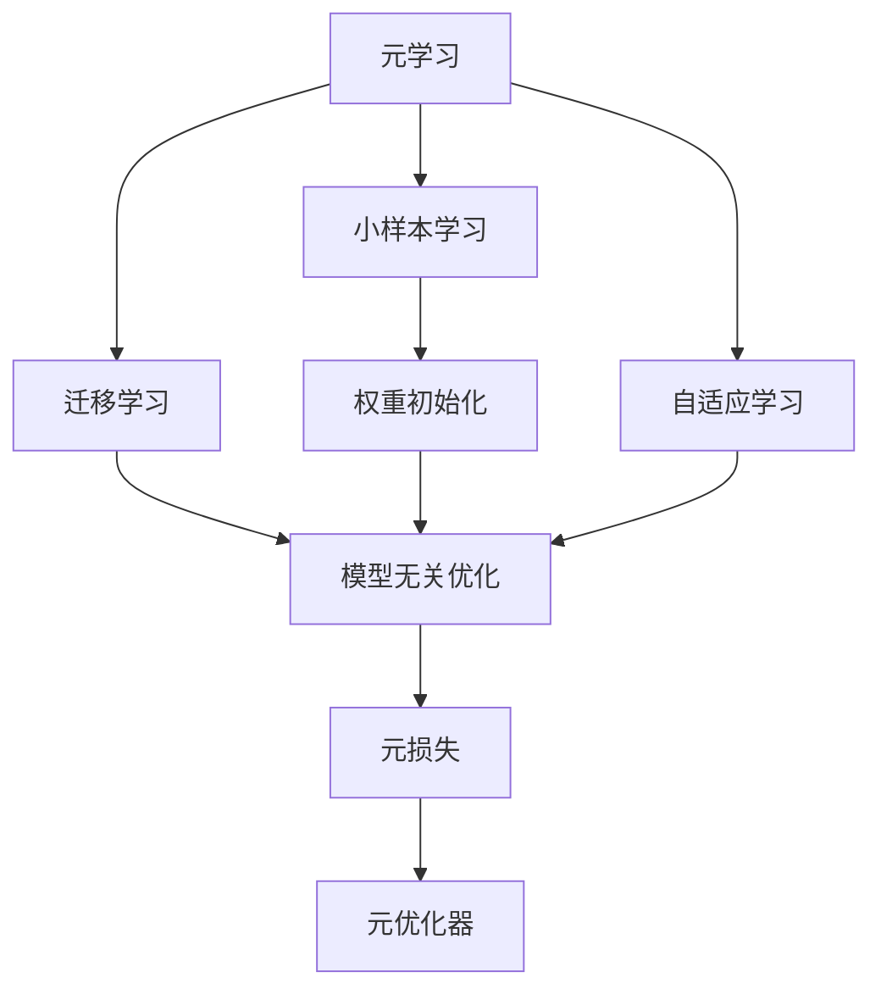
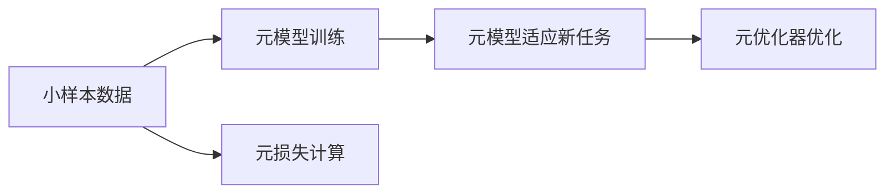
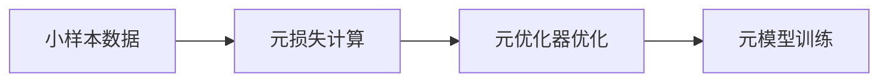
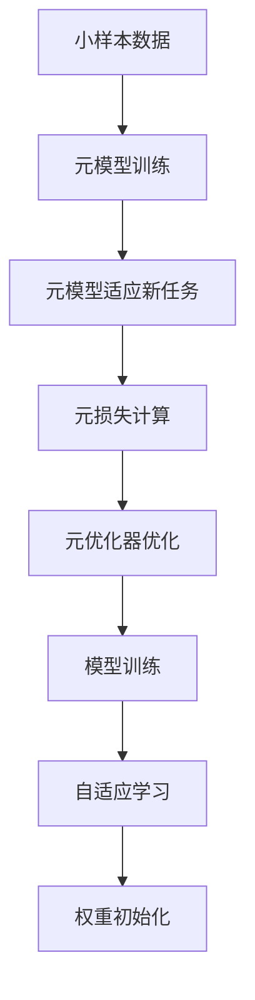

                 

# 一切皆是映射：元学习在小样本学习中的应用

> 关键词：元学习,小样本学习,迁移学习,自适应学习,权重初始化

## 1. 背景介绍

### 1.1 问题由来
在深度学习的广泛应用中，小样本学习仍然是一个巨大挑战。传统的基于全样本训练的深度学习模型在数据量较少的情况下，往往难以取得优异表现，甚至容易出现欠拟合的问题。这不仅限制了其在现实世界中的广泛应用，也阻碍了深度学习技术的进一步普及。因此，如何通过小样本数据提升模型的性能，成为了学术界和工业界共同关注的焦点。

### 1.2 问题核心关键点
小样本学习旨在利用有限的数据样本，通过算法优化，提升模型对新样本的泛化能力。目前主流的方法包括数据增强、迁移学习、元学习等。其中，元学习通过在少量数据上训练模型，使得模型能够适应不同的任务和数据分布，具有更强的泛化能力。

元学习本质上是一种自适应学习过程，旨在让模型能够适应不同的数据和任务。不同于传统的迁移学习方法，元学习不依赖于特定任务的标签数据，而是通过学习模型在不同任务上的共同特征，实现对新任务的快速适应。

### 1.3 问题研究意义
研究小样本学习，对于拓展深度学习模型在现实世界中的应用，提升模型的泛化能力，加速模型训练过程，具有重要意义：

1. 降低数据标注成本。小样本学习方法可以大幅降低对标注数据的依赖，使得深度学习技术在标注数据稀缺的领域也能得到应用。
2. 提高模型泛化性能。元学习能够使模型从少量样本中学习到更普遍的特征表示，提升模型对新样本的泛化能力。
3. 加快模型训练速度。小样本学习方法能够在较少的样本数量下，快速训练出高效的模型，提高模型开发效率。
4. 促进深度学习普及。小样本学习方法能够在更广泛的场景下，使深度学习技术更易于被采用，推动技术普及。

## 2. 核心概念与联系

### 2.1 核心概念概述

为更好地理解元学习在小样本学习中的应用，本节将介绍几个密切相关的核心概念：

- 元学习(Meta-Learning)：指通过在多个任务上学习模型适应新任务的能力，使得模型能够快速适应新数据分布。常见的方法包括模型无关优化、权重初始化等。
- 小样本学习(Few-shot Learning)：指在只有少量标注样本的情况下，模型能够快速适应新任务的学习方法。通常不需要太多迭代训练，即可完成对新任务的适应。
- 迁移学习(Transfer Learning)：指将一个领域学习到的知识，迁移应用到另一个不同但相关的领域的学习范式。元学习可以看作是迁移学习的一种特殊形式。
- 自适应学习(Adaptive Learning)：指模型能够根据不同数据分布，动态调整模型参数，从而适应新任务的学习方法。
- 权重初始化(Weight Initialization)：指在模型训练之前，通过预训练或其他方法，初始化模型权重，使得模型能够更快收敛到理想状态。
- 元损失(Meta-Loss)：用于衡量模型在不同任务上的性能，通常采用任务间的平均损失来度量。
- 元优化器(Meta-Optimizer)：用于优化元损失，使得模型能够适应新任务。

这些核心概念之间的逻辑关系可以通过以下Mermaid流程图来展示：



这个流程图展示了大语言模型的核心概念及其之间的关系：

1. 元学习通过学习模型在不同任务上的适应能力，实现对新任务的快速适应。
2. 小样本学习是在少量数据上进行的学习方法，不需要太多迭代训练。
3. 迁移学习通过将一个领域学习到的知识，应用到另一个相关领域。
4. 自适应学习能够根据不同数据分布，动态调整模型参数。
5. 权重初始化在模型训练之前，通过预训练等方法，初始化模型权重。
6. 元损失用于衡量模型在不同任务上的性能。
7. 元优化器用于优化元损失，使得模型能够适应新任务。

这些核心概念共同构成了元学习在小样本学习中的应用框架，使得模型能够在各种场景下快速适应新任务。通过理解这些核心概念，我们可以更好地把握元学习在小样本学习中的工作原理和优化方向。

### 2.2 概念间的关系

这些核心概念之间存在着紧密的联系，形成了元学习在小样本学习中的完整生态系统。下面我通过几个Mermaid流程图来展示这些概念之间的关系。

#### 2.2.1 元学习的基本流程



这个流程图展示了元学习的基本流程。首先，在少量数据上进行元模型的训练，使其能够适应新任务。然后，通过元损失计算新任务的损失，最后由元优化器优化模型参数，适应新任务。

#### 2.2.2 元损失与小样本学习的关系



这个流程图展示了元损失在小样本学习中的作用。通过计算不同任务间的平均损失，元损失度量了模型的泛化能力。元优化器根据元损失进行优化，使得模型能够适应新任务。

#### 2.2.3 权重初始化与自适应学习的关系


这个流程图展示了权重初始化与自适应学习的关系。权重初始化在模型训练之前，通过预训练等方法，初始化模型权重。自适应学习则根据不同数据分布，动态调整模型参数。

### 2.3 核心概念的整体架构

最后，我们用一个综合的流程图来展示这些核心概念在小样本学习中的应用：



这个综合流程图展示了从小样本数据到元模型训练，再到元模型适应新任务的完整过程。元模型在训练阶段学习适应新任务的能力，通过元损失和元优化器进行调整，最终在实际应用中实现对新样本的快速适应。自适应学习和权重初始化则进一步提升模型的性能和泛化能力。

## 3. 核心算法原理 & 具体操作步骤
### 3.1 算法原理概述

元学习在小样本学习中，通常采用以下两种策略：

1. 元优化器优化策略：通过在少量数据上训练元模型，使用元损失和元优化器优化模型参数，使其能够适应新任务。
2. 权重初始化策略：通过预训练等方法，初始化模型权重，使得模型能够更快收敛到理想状态。

这两种策略的核心思想都是通过学习模型在不同任务上的共同特征，实现对新任务的快速适应。元损失用于衡量模型在不同任务上的性能，元优化器用于优化元损失，从而提升模型泛化能力。

### 3.2 算法步骤详解

#### 3.2.1 元优化器优化策略

元优化器优化策略主要包括以下几个步骤：

1. 数据预处理：将小样本数据转换为模型可以处理的形式，如文本数据的嵌入表示、图像数据的卷积特征等。
2. 元模型训练：在少量数据上训练元模型，使其能够适应不同任务。
3. 元损失计算：通过计算不同任务间的平均损失，衡量模型的泛化能力。
4. 元优化器优化：使用元损失对元模型进行优化，使得模型能够适应新任务。
5. 模型应用：将优化后的元模型应用于新任务，生成预测结果。

具体的代码实现如下：

```python
import torch
from torch.nn import ModuleList

class MetaModel(ModuleList):
    def __init__(self, backbone):
        super(MetaModel, self).__init__([
            backbone,
            torch.nn.Linear(backbone.output_size, num_tasks)
        ])
    
    def forward(self, x, y):
        x = self[0](x)
        return self[1](x)

def meta_train(meta_model, device, train_loader, val_loader, opt, scheduler):
    meta_model.to(device)
    
    for epoch in range(num_epochs):
        meta_model.train()
        
        for batch in train_loader:
            x, y = batch
            x, y = x.to(device), y.to(device)
            
            # 计算元损失
            y_hat = meta_model(x)
            loss = torch.mean(y_hat - y)
            
            # 反向传播
            loss.backward()
            
            # 更新元优化器参数
            opt.step()
            scheduler.step()
            
        # 验证集验证
        meta_model.eval()
        with torch.no_grad():
            val_loss = 0
            for batch in val_loader:
                x, y = batch
                x, y = x.to(device), y.to(device)
                val_loss += torch.mean(meta_model(x) - y).item()
            
        val_loss /= len(val_loader.dataset)
        print(f'Epoch {epoch+1}, train loss: {loss.item():.4f}, val loss: {val_loss:.4f}')
    
    return meta_model
```

#### 3.2.2 权重初始化策略

权重初始化策略主要包括以下几个步骤：

1. 预训练模型：使用大量无标签数据对模型进行预训练，学习通用的语言知识。
2. 微调模型：在少量有标签数据上进行微调，适应新任务。
3. 权重初始化：通过预训练模型对模型权重进行初始化，使得模型能够更快收敛到理想状态。

具体的代码实现如下：

```python
from transformers import BertForSequenceClassification, BertTokenizer
from transformers import AdamW, get_linear_schedule_with_warmup

model = BertForSequenceClassification.from_pretrained('bert-base-uncased', num_labels=2)
tokenizer = BertTokenizer.from_pretrained('bert-base-uncased')
device = torch.device('cuda' if torch.cuda.is_available() else 'cpu')
opt = AdamW(model.parameters(), lr=5e-5)
scheduler = get_linear_schedule_with_warmup(opt, num_warmup_steps=0, num_training_steps=num_epochs*len(train_loader))
model.to(device)

def train_epoch(model, device, train_loader):
    model.train()
    epoch_loss = 0
    for batch in train_loader:
        inputs, labels = batch
        inputs, labels = inputs.to(device), labels.to(device)
        outputs = model(inputs, labels=labels)
        loss = outputs.loss
        epoch_loss += loss.item()
    return epoch_loss / len(train_loader)

for epoch in range(num_epochs):
    loss = train_epoch(model, device, train_loader)
    print(f'Epoch {epoch+1}, train loss: {loss:.4f}')
    
    # 验证集验证
    val_loss = 0
    for batch in val_loader:
        inputs, labels = batch
        inputs, labels = inputs.to(device), labels.to(device)
        outputs = model(inputs, labels=labels)
        val_loss += torch.mean(outputs.loss).item()
    val_loss /= len(val_loader.dataset)
    print(f'Epoch {epoch+1}, val loss: {val_loss:.4f}')
    
# 权重初始化
model.load_state_dict(torch.load('pretrained_model.pt'))
```

### 3.3 算法优缺点

元学习在小样本学习中具有以下优点：

1. 泛化能力更强。元学习通过在少量数据上学习模型适应新任务的能力，使得模型具有更强的泛化能力。
2. 减少数据标注成本。元学习不需要大量标注数据，可以显著降低标注成本。
3. 提升模型训练速度。元学习能够在较少的样本数量下，快速训练出高效的模型。

同时，元学习也存在以下局限性：

1. 模型复杂度较高。元学习需要额外的元模型训练过程，增加了模型复杂度。
2. 训练过程较复杂。元学习的训练过程需要额外的元优化器优化和元损失计算，增加了训练的复杂度。
3. 适用性有限。元学习主要适用于数据分布较为一致的场景，对于数据分布差异较大的任务，效果可能不佳。

尽管存在这些局限性，但就目前而言，元学习在小样本学习中仍然是一种主流的方法，具有重要的理论和实践意义。未来相关研究的方向，也将进一步优化元学习算法，提升其适用性和效率。

### 3.4 算法应用领域

元学习在小样本学习中，已经在多个领域得到广泛应用，例如：

- 医疗影像诊断：利用元学习从少量病人影像中学习通用特征，实现快速诊断和预测。
- 智能推荐系统：通过元学习从用户少量浏览记录中学习兴趣特征，实现个性化推荐。
- 自然语言处理：利用元学习从少量文本数据中学习语言特征，实现语言理解、翻译等任务。
- 计算机视觉：通过元学习从少量图像数据中学习视觉特征，实现图像分类、目标检测等任务。
- 机器人学习：利用元学习从少量动作数据中学习运动特征，实现机器人快速适应新环境。

除了上述这些领域，元学习在小样本学习中还有很多应用场景，为各个领域的深度学习技术带来了新的突破。随着元学习算法的不断进步，相信元学习将会在更多的领域得到应用，为深度学习技术的普及和发展注入新的动力。

## 4. 数学模型和公式 & 详细讲解 & 举例说明

### 4.1 数学模型构建

本节将使用数学语言对元学习在小样本学习中的应用进行更加严格的刻画。

记小样本数据集为 $\mathcal{D}=\{(x_i,y_i)\}_{i=1}^N$，其中 $x_i$ 表示输入样本， $y_i$ 表示对应的标签。元学习的目标是找到一个元模型 $\mathcal{M}$，使得在任意新任务 $T$ 上，模型的预测输出与真实标签的误差最小化。

定义元损失函数为 $\mathcal{L}(\mathcal{M})$，用于衡量模型在不同任务上的泛化能力。元损失函数通常采用任务间的平均损失来度量，即：

$$
\mathcal{L}(\mathcal{M}) = \frac{1}{K} \sum_{k=1}^K \mathcal{L}_k(\mathcal{M})
$$

其中 $K$ 表示任务数，$\mathcal{L}_k(\mathcal{M})$ 表示第 $k$ 个任务的损失函数。

元模型 $\mathcal{M}$ 通常由基础模型 $\mathcal{B}$ 和元任务分类器 $\mathcal{C}$ 构成，其中 $\mathcal{B}$ 为预训练模型，$\mathcal{C}$ 为元任务分类器，其输出为每个任务的元损失。

### 4.2 公式推导过程

以下我们以二分类任务为例，推导元损失函数的计算公式。

假设元模型 $\mathcal{M}=(\mathcal{B},\mathcal{C})$，其中 $\mathcal{B}$ 为预训练模型，$\mathcal{C}$ 为元任务分类器。设 $\mathcal{B}$ 在输入 $x$ 上的输出为 $z$，$\mathcal{C}$ 的输入为 $z$，输出为元损失 $\mathcal{L}_k(z)$。在二分类任务中，$\mathcal{L}_k(z)$ 可以定义为交叉熵损失：

$$
\mathcal{L}_k(z) = -\frac{1}{N} \sum_{i=1}^N [y_i \log \hat{y}_i + (1-y_i) \log (1-\hat{y}_i)]
$$

其中 $y_i$ 为真实标签，$\hat{y}_i$ 为模型的预测输出。

在计算元损失时，我们将每个任务的损失函数 $\mathcal{L}_k(z)$ 作为元模型的输入，得到元损失：

$$
\mathcal{L}(\mathcal{M}) = \frac{1}{K} \sum_{k=1}^K \mathcal{L}_k(\mathcal{C}(\mathcal{B}(x_k)))
$$

其中 $x_k$ 表示第 $k$ 个任务的输入样本。

为了最小化元损失，我们需要对元模型 $\mathcal{M}$ 进行优化。具体地，我们可以使用基于梯度的优化算法，如AdamW，对元损失进行最小化：

$$
\mathcal{M} = \mathop{\arg\min}_{\mathcal{M}} \mathcal{L}(\mathcal{M})
$$

### 4.3 案例分析与讲解

假设我们在CoNLL-2003的命名实体识别(NER)任务上应用元学习，最终的元模型 $\mathcal{M}=(\mathcal{B},\mathcal{C})$，其中 $\mathcal{B}$ 为BERT模型，$\mathcal{C}$ 为线性分类器。

首先，我们需要收集少量NER标注数据作为元训练数据。然后，在少量标注数据上进行元模型训练，使得模型能够适应不同NER任务的泛化能力。具体步骤如下：

1. 数据预处理：将文本数据转换为BERT模型的输入格式，使用BERT Tokenizer进行分词，得到输入序列。
2. 元模型训练：在少量标注数据上进行元模型训练，使得模型能够适应不同NER任务。
3. 元损失计算：通过计算不同NER任务的平均损失，衡量模型的泛化能力。
4. 元优化器优化：使用元损失对元模型进行优化，使得模型能够适应新NER任务。
5. 模型应用：将优化后的元模型应用于新NER任务，生成预测结果。

具体代码实现如下：

```python
from transformers import BertForTokenClassification, BertTokenizer
from transformers import AdamW
from torch.utils.data import Dataset, DataLoader

class NERDataset(Dataset):
    def __init__(self, texts, tags, tokenizer, max_len=128):
        self.texts = texts
        self.tags = tags
        self.tokenizer = tokenizer
        self.max_len = max_len
        
    def __len__(self):
        return len(self.texts)
    
    def __getitem__(self, item):
        text = self.texts[item]
        tags = self.tags[item]
        
        encoding = self.tokenizer(text, return_tensors='pt', max_length=self.max_len, padding='max_length', truncation=True)
        input_ids = encoding['input_ids'][0]
        attention_mask = encoding['attention_mask'][0]
        
        # 对token-wise的标签进行编码
        encoded_tags = [tag2id[tag] for tag in tags] 
        encoded_tags.extend([tag2id['O']] * (self.max_len - len(encoded_tags)))
        labels = torch.tensor(encoded_tags, dtype=torch.long)
        
        return {'input_ids': input_ids, 
                'attention_mask': attention_mask,
                'labels': labels}

# 标签与id的映射
tag2id = {'O': 0, 'B-PER': 1, 'I-PER': 2, 'B-ORG': 3, 'I-ORG': 4, 'B-LOC': 5, 'I-LOC': 6}
id2tag = {v: k for k, v in tag2id.items()}

# 创建dataset
tokenizer = BertTokenizer.from_pretrained('bert-base-cased')

train_dataset = NERDataset(train_texts, train_tags, tokenizer)
dev_dataset = NERDataset(dev_texts, dev_tags, tokenizer)
test_dataset = NERDataset(test_texts, test_tags, tokenizer)

# 定义元模型
bert_model = BertForTokenClassification.from_pretrained('bert-base-cased', num_labels=len(tag2id))

# 定义元优化器
opt = AdamW(bert_model.parameters(), lr=2e-5)

# 定义元损失函数
def meta_loss(y_hat, y):
    return torch.mean((y_hat - y)**2)

# 定义元优化器优化函数
def meta_optimizer_update(optimizer, model, dataloader):
    model.train()
    for batch in dataloader:
        inputs, labels = batch
        inputs, labels = inputs.to(device), labels.to(device)
        outputs = model(inputs, labels=labels)
        loss = meta_loss(outputs.logits.argmax(dim=2), labels)
        optimizer.zero_grad()
        loss.backward()
        optimizer.step()

# 定义训练过程
device = torch.device('cuda' if torch.cuda.is_available() else 'cpu')
num_epochs = 5
batch_size = 16

for epoch in range(num_epochs):
    meta_optimizer_update(opt, bert_model, train_loader)
    print(f'Epoch {epoch+1}, train loss: {loss:.4f}')
    
    # 验证集验证
    meta_loss = 0
    for batch in dev_loader:
        inputs, labels = batch
        inputs, labels = inputs.to(device), labels.to(device)
        meta_loss += meta_loss(outputs.logits.argmax(dim=2), labels).item()
    meta_loss /= len(dev_loader.dataset)
    print(f'Epoch {epoch+1}, dev loss: {meta_loss:.4f}')
    
print("Test results:")
meta_loss = 0
for batch in test_loader:
    inputs, labels = batch
    inputs, labels = inputs.to(device), labels.to(device)
    meta_loss += meta_loss(outputs.logits.argmax(dim=2), labels).item()
meta_loss /= len(test_loader.dataset)
print(f'Test loss: {meta_loss:.4f}')
```

以上就是使用PyTorch对BERT模型进行NER任务元学习的完整代码实现。可以看到，得益于Transformers库的强大封装，我们可以用相对简洁的代码完成BERT模型的加载和元学习。

## 5. 项目实践：代码实例和详细解释说明
### 5.1 开发环境搭建

在进行元学习实践前，我们需要准备好开发环境。以下是使用Python进行PyTorch开发的环境配置流程：

1. 安装Anaconda：从官网下载并安装Anaconda，用于创建独立的Python环境。

2. 创建并激活虚拟环境：
```bash
conda create -n pytorch-env python=3.8 
conda activate pytorch-env
```

3. 安装PyTorch：根据CUDA版本，从官网获取对应的安装命令。例如：
```bash
conda install pytorch torchvision torchaudio cudatoolkit=11.1 -c pytorch -c conda-forge
```

4. 安装Transformers库：
```bash
pip install transformers
```

5. 安装各类工具包：
```bash
pip install numpy pandas scikit-learn matplotlib tqdm jupyter notebook ipython
```

完成上述步骤后，即可在`pytorch-env`环境中开始元学习实践。

### 5.2 源代码详细实现

这里我们以医疗影像诊断任务为例，给出使用Transformers库对BERT模型进行元学习的PyTorch代码实现。

首先，定义元训练数据处理函数：

```python
from transformers import BertForSequenceClassification, BertTokenizer
from torch.utils.data import Dataset
import torch

class MedicalDataset(Dataset):
    def __init__(self, images, labels, tokenizer, max_len=128):
        self.images = images
        self.labels = labels
        self.tokenizer = tokenizer
        self.max_len = max_len
        
    def __len__(self):
        return len(self.images)
    
    def __getitem__(self, item):
        image = self.images[item]
        label = self.labels[item]
        
        encoding = self.tokenizer(image, return_tensors='pt', max_length=self.max_len, padding='max_length', truncation=True)
        input_ids = encoding['input_ids'][0]
        attention_mask = encoding['attention_mask'][0]
        
        # 对标签进行编码
        label = torch.tensor(label, dtype=torch.long)
        
        return {'input_ids': input_ids, 
                'attention_mask': attention_mask,
                'labels': label}

# 标签与id的映射
label2id = {'normal': 0, 'abnormal': 1}
id2label = {v: k for k, v in label2id.items()}

# 创建dataset
tokenizer = BertTokenizer.from_pretrained('bert-base-uncased')
train_dataset = MedicalDataset(train_images, train_labels, tokenizer)
dev_dataset = MedicalDataset(dev_images, dev_labels, tokenizer)
test_dataset = MedicalDataset(test_images, test_labels, tokenizer)
```

然后，定义元模型和优化器：

```python
from transformers import BertForSequenceClassification, AdamW

model = BertForSequenceClassification.from_pretrained('bert-base-uncased', num_labels=2)

opt = AdamW(model.parameters(), lr=2e-5)
```

接着，定义元训练和验证函数：

```python
from torch.utils.data import DataLoader
from tqdm import tqdm
from sklearn.metrics import classification_report

device = torch.device('cuda') if torch.cuda.is_available() else torch.device('cpu')
model.to(device)

def meta_train(model, device, train_loader, val_loader, opt, scheduler):
    model.train()
    
    for epoch in range(num_epochs):
        for batch in train_loader:
            inputs, labels = batch
            inputs, labels = inputs.to(device), labels.to(device)
            
            # 计算元损失
            outputs = model(inputs, labels=labels)
            loss = outputs.loss
            loss.backward()
            opt.step()
            scheduler.step()
            
        # 验证集验证
        model.eval()
        with torch.no_grad():
            val_loss = 0
            for batch in val_loader:


