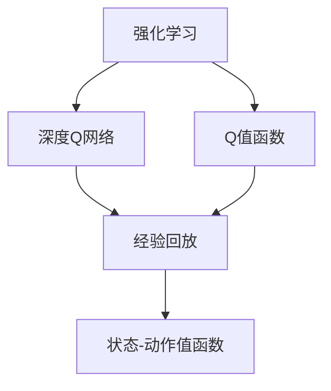
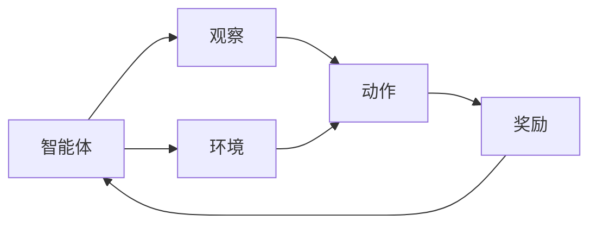
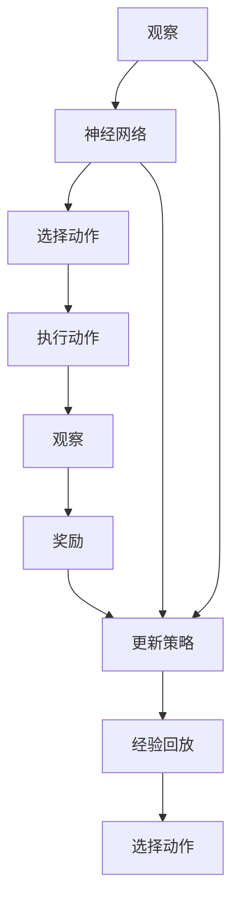
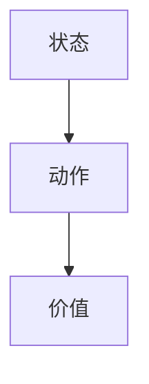

                 

# 一切皆是映射：利用DQN解决路径规划问题：方法与思考

> 关键词：深度强化学习, DQN算法, 路径规划, 状态空间, 动作空间, 状态-动作值函数, 价值函数, 最小化

## 1. 背景介绍

### 1.1 问题由来
在自动驾驶、机器人导航、无人机控制等领域，路径规划是一个核心问题。传统的路径规划方法通常基于已知地图和起点终点信息，使用最短路径算法（如A*、Dijkstra）来寻找最佳路径。然而，这些算法在面对复杂环境、动态障碍物等情况下，难以提供实时且准确的解决方案。

为了应对这些挑战，强化学习（Reinforcement Learning, RL）逐渐成为一种流行的方法。通过在环境中进行交互学习，智能体（agent）可以逐步掌握如何应对不同环境，找到最优策略。深度强化学习（Deep Reinforcement Learning, DRL）的兴起，特别是深度Q网络（Deep Q-Network, DQN）算法，为复杂环境下的路径规划问题提供了全新的解决方案。

### 1.2 问题核心关键点
DQN算法是一种基于深度神经网络的强化学习方法，主要应用于连续动作空间的问题。它通过学习状态-动作值函数，直接映射当前状态到最优动作，从而实现路径规划等任务。DQN算法的主要优点包括：
1. 适用于连续动作空间，不依赖于动作空间的大小。
2. 可以处理高维状态空间，具备强大的泛化能力。
3. 基于经验回放（Experience Replay）技术，提高了学习的稳定性和效率。

本文将详细阐述DQN算法的原理和操作步骤，同时通过数学模型和代码实例，展现DQN在路径规划问题上的应用。

## 2. 核心概念与联系

### 2.1 核心概念概述

为更好地理解DQN算法的原理和操作步骤，我们首先介绍几个关键概念：

- **强化学习**：一种通过试错过程，学习从环境状态到动作映射的优化方法，目标是最大化长期累积奖励。
- **Q值函数**：状态-动作值函数，表示在某个状态下采取某个动作可以获得的累积奖励期望。
- **深度Q网络（DQN）**：结合深度神经网络与Q值函数的强化学习算法，通过深度神经网络逼近Q值函数，学习最优策略。
- **经验回放（Experience Replay）**：将智能体在环境中的交互经历以随机样本的形式存储在缓冲区中，用于训练DQN模型，提高学习的稳定性和效率。

这些概念之间的逻辑关系可以通过以下Mermaid流程图来展示：



这个流程图展示了一系列核心概念之间的关系：

1. 强化学习是基础，通过环境交互学习最优策略。
2. Q值函数是强化学习的核心，表示状态-动作的奖励期望。
3. 深度Q网络结合神经网络与Q值函数，学习最优策略。
4. 经验回放技术用于提高深度Q网络的训练效率和稳定性。

这些概念共同构成了DQN算法的理论基础，使其能够在复杂环境中进行路径规划等任务。

### 2.2 概念间的关系

这些核心概念之间存在着紧密的联系，形成了DQN算法的完整生态系统。下面我通过几个Mermaid流程图来展示这些概念之间的关系。

#### 2.2.1 强化学习的基本框架



这个流程图展示了强化学习的基本框架：

1. 智能体（agent）在环境中交互，观察当前状态。
2. 智能体基于当前状态选择动作，并执行该动作。
3. 环境根据动作返回奖励，并更新状态。
4. 智能体根据奖励更新策略，继续进行下一轮交互。

#### 2.2.2 DQN算法的整体流程



这个流程图展示了DQN算法的整体流程：

1. 智能体观察当前状态，输入到神经网络中，输出最优动作。
2. 执行动作，观察新状态，并根据新状态计算奖励。
3. 更新神经网络中的Q值函数，通过经验回放技术，提高学习效率。
4. 选择下一个动作，继续进行下一轮交互。

#### 2.2.3 状态-动作值函数的定义



这个流程图展示了状态-动作值函数的定义：

1. 给定一个状态，通过神经网络映射到动作，并计算其价值。
2. 价值表示在当前状态下采取特定动作的长期累积奖励期望。

## 3. 核心算法原理 & 具体操作步骤

### 3.1 算法原理概述

DQN算法通过深度神经网络逼近Q值函数，学习最优策略。其核心思想是通过经验回放技术，最大化累积奖励，从而找到最优路径规划策略。

假设环境中有 $S$ 个状态， $A$ 个动作， $\pi(a|s)$ 表示在状态 $s$ 下选择动作 $a$ 的概率。DQN的目标是通过学习状态-动作值函数 $Q(s,a)$，最大化长期累积奖励，即：

$$
\max_{\pi} \sum_{t=0}^{\infty} \gamma^t Q(s_t,a_t)
$$

其中 $\gamma$ 为折扣因子，表示未来奖励的权重。

### 3.2 算法步骤详解

DQN算法的具体步骤包括：

1. **初始化模型和参数**：初始化神经网络，设定学习率 $\alpha$ 和更新频率 $\epsilon$。
2. **观察当前状态**：智能体观察当前环境状态，输入到神经网络中。
3. **选择动作**：根据神经网络输出的Q值函数，选择当前状态下最优动作 $a_t$。
4. **执行动作**：执行选择的最优动作，观察新状态 $s_{t+1}$ 和奖励 $r_{t+1}$。
5. **存储经验**：将当前状态、动作、新状态、奖励和折扣因子存储到经验缓冲区中。
6. **更新神经网络**：从经验缓冲区中随机抽取样本，进行训练。使用优化器（如Adam）更新神经网络中的权重。
7. **重复步骤2-6**：重复以上步骤，直至达到预设的迭代次数或满足终止条件。

### 3.3 算法优缺点

DQN算法的主要优点包括：
1. 适用于高维状态空间，具备强大的泛化能力。
2. 结合深度神经网络，逼近复杂的Q值函数，提升学习效率。
3. 通过经验回放技术，提高学习稳定性和效率。

DQN算法的缺点包括：
1. 依赖大量训练数据，对数据质量要求高。
2. 神经网络结构复杂，模型训练耗时长。
3. 经验回放可能导致内存占用大，对设备要求高。

### 3.4 算法应用领域

DQN算法广泛应用于路径规划、游戏智能、机器人控制等领域。其核心思想是通过智能体的试错过程，学习最优策略，找到最优路径规划方案。具体应用场景包括：

- **自动驾驶路径规划**：智能体通过观察摄像头、雷达等传感器数据，学习最优行驶策略，避开障碍物，选择最佳路径。
- **无人机路径规划**：智能体通过视觉和传感器数据，学习最优飞行路径，避免碰撞，完成任务。
- **机器人导航**：智能体通过环境交互，学习最优动作序列，导航至目标位置。

## 4. 数学模型和公式 & 详细讲解 & 举例说明

### 4.1 数学模型构建

在数学上，DQN算法可以建模为强化学习的框架。假设环境中有 $S$ 个状态， $A$ 个动作，智能体在每个状态 $s$ 下选择动作 $a$ 的概率为 $\pi(a|s)$。状态-动作值函数 $Q(s,a)$ 表示在状态 $s$ 下采取动作 $a$ 的长期累积奖励期望，即：

$$
Q(s,a) = \mathbb{E}[\sum_{t=0}^{\infty} \gamma^t r_{t+1}]
$$

其中 $r_{t+1}$ 表示在状态 $s_{t+1}$ 下的即时奖励。

DQN算法的目标是最小化预测误差，即：

$$
\min_{\theta} \mathbb{E}_{(s,a) \sim \mathcal{D}} [(y - Q_{\theta}(s,a))^2]
$$

其中 $y$ 表示实际值，$Q_{\theta}(s,a)$ 表示通过神经网络逼近的Q值函数。

### 4.2 公式推导过程

以下我们将推导DQN算法中的核心公式，即Q值函数的更新规则。

假设当前状态为 $s$，智能体选择动作 $a$，观察新状态 $s'$，并接收到奖励 $r$。根据蒙特卡罗方法，可以得到估计的Q值：

$$
y = r + \gamma Q_{\theta}(s', a')
$$

其中 $a'$ 为智能体在新状态 $s'$ 下选择的最优动作。

DQN算法通过神经网络逼近Q值函数 $Q_{\theta}(s,a)$，目标是最小化预测误差。根据均方误差（Mean Squared Error, MSE）准则，可以推导出Q值函数的更新公式：

$$
\theta \leftarrow \theta - \alpha \nabla_{\theta} \mathbb{E}_{(s,a) \sim \mathcal{D}} [(Q_{\theta}(s,a) - (r + \gamma \max_a Q_{\theta}(s', a'))^2]
$$

其中 $\alpha$ 为学习率，$\nabla_{\theta}$ 表示对权重 $\theta$ 的梯度计算。

### 4.3 案例分析与讲解

为了更清晰地理解DQN算法的应用，下面以一个简单的路径规划问题为例，进行案例分析。

假设有一个网格地图，智能体需要在不越过障碍物的情况下，从起点 $(0,0)$ 走到终点 $(N-1,N-1)$。智能体可以在上、下、左、右四个方向移动。地图如下：

```
-------------------
|0 0 0 0 0 0 0 0 0|
|0 1 1 1 1 1 1 0 0|
|0 1 0 0 1 1 1 0 0|
|0 1 0 0 0 1 1 0 0|
|0 0 0 0 0 0 0 0 0|
-------------------
```

智能体的目标是找到最优路径，使路径长度最小。我们可以使用DQN算法来解决这个问题。具体步骤如下：

1. **初始化模型和参数**：设定神经网络的结构和参数，初始化经验缓冲区。
2. **观察当前状态**：智能体观察当前位置，并将其编码为状态向量。
3. **选择动作**：根据神经网络输出的Q值函数，选择最优动作。
4. **执行动作**：执行选择的最优动作，观察新状态和奖励。
5. **存储经验**：将当前状态、动作、新状态、奖励和折扣因子存储到经验缓冲区中。
6. **更新神经网络**：从经验缓冲区中随机抽取样本，进行训练。
7. **重复步骤2-6**：重复以上步骤，直至达到预设的迭代次数或满足终止条件。

通过DQN算法的训练，智能体可以学习到最优路径规划策略，从而在网格地图中找到最优路径。

## 5. 项目实践：代码实例和详细解释说明

### 5.1 开发环境搭建

在进行DQN算法实践前，我们需要准备好开发环境。以下是使用Python进行TensorFlow实现DQN算法的环境配置流程：

1. 安装Anaconda：从官网下载并安装Anaconda，用于创建独立的Python环境。

2. 创建并激活虚拟环境：
```bash
conda create -n dqn-env python=3.8 
conda activate dqn-env
```

3. 安装TensorFlow：
```bash
conda install tensorflow -c pytorch -c conda-forge
```

4. 安装TensorBoard：
```bash
pip install tensorboard
```

5. 安装OpenAI Gym：
```bash
pip install gym
```

6. 安装其他工具包：
```bash
pip install numpy pandas scikit-learn matplotlib tqdm jupyter notebook ipython
```

完成上述步骤后，即可在`dqn-env`环境中开始DQN算法的实践。

### 5.2 源代码详细实现

以下是使用TensorFlow实现DQN算法的示例代码：

```python
import tensorflow as tf
import gym
import numpy as np

# 定义神经网络结构
class DQN(tf.keras.Model):
    def __init__(self, state_size, action_size):
        super(DQN, self).__init__()
        self.fc1 = tf.keras.layers.Dense(32, activation='relu')
        self.fc2 = tf.keras.layers.Dense(32, activation='relu')
        self.fc3 = tf.keras.layers.Dense(action_size)

    def call(self, inputs):
        x = self.fc1(inputs)
        x = self.fc2(x)
        return self.fc3(x)

# 定义DQN类
class DQNAgent:
    def __init__(self, state_size, action_size):
        self.state_size = state_size
        self.action_size = action_size
        self.memory = []
        self.gamma = 0.95  # 折扣因子
        self.epsilon = 1.0  # 探索率
        self.epsilon_min = 0.01
        self.epsilon_decay = 0.995  # 探索率衰减率
        self.learning_rate = 0.001  # 学习率
        self.model = DQN(state_size, action_size)
        self.target_model = DQN(state_size, action_size)
        self.target_model.set_weights(self.model.get_weights())

    def remember(self, state, action, reward, next_state, done):
        self.memory.append((state, action, reward, next_state, done))

    def act(self, state):
        if np.random.rand() <= self.epsilon:
            return np.random.randint(self.action_size)
        act_values = self.model.predict(state)
        return np.argmax(act_values[0])

    def replay(self, batch_size):
        minibatch = np.random.choice(len(self.memory), batch_size)
        for i in minibatch:
            state, action, reward, next_state, done = self.memory[i]
            target = reward + self.gamma * np.amax(self.target_model.predict(next_state)[0])
            target_f = self.model.predict(state)
            target_f[0][action] = target
            self.model.fit(state, target_f, epochs=1, verbose=0)
        if self.epsilon > self.epsilon_min:
            self.epsilon *= self.epsilon_decay

    def update_model(self):
        self.target_model.set_weights(self.model.get_weights())

# 初始化环境
env = gym.make('Gridworld-v1')
state_size = (5, 5)
action_size = env.action_space.n
agent = DQNAgent(state_size, action_size)

# 训练模型
for i in range(100):
    state = env.reset()
    state = np.reshape(state, [1, state_size[0]*state_size[1]])
    done = False
    while not done:
        action = agent.act(state)
        next_state, reward, done, _ = env.step(action)
        next_state = np.reshape(next_state, [1, state_size[0]*state_size[1]])
        agent.remember(state, action, reward, next_state, done)
        state = next_state
    agent.replay(32)
    agent.update_model()
    if i % 10 == 0:
        print("Episode:", i)
        env.render()

# 测试模型
test_state = np.reshape(env.reset(), [1, state_size[0]*state_size[1]])
done = False
while not done:
    action = agent.act(test_state)
    test_state, reward, done, _ = env.step(action)
    env.render()
```

在这个示例中，我们使用OpenAI Gym的Gridworld环境进行DQN算法的训练和测试。训练过程中，我们设定了神经网络的结构、折扣因子、探索率、学习率等超参数，并通过训练过程不断优化模型。测试过程中，我们评估模型在不同状态下的表现，并可视化其行为。

### 5.3 代码解读与分析

让我们再详细解读一下关键代码的实现细节：

**DQN类**：
- `__init__`方法：初始化模型的神经网络结构，设定超参数。
- `call`方法：实现神经网络的前向传播过程。
- `act`方法：根据当前状态，选择动作。
- `remember`方法：存储经验数据到内存中。
- `replay`方法：根据经验数据训练模型，更新神经网络参数。
- `update_model`方法：更新目标模型，使其与训练模型保持一致。

**DQNAgent类**：
- `__init__`方法：初始化智能体的超参数，并创建神经网络模型。
- `remember`方法：将经验数据存储到内存中。
- `act`方法：根据当前状态，选择动作。
- `replay`方法：根据经验数据训练模型，更新神经网络参数。
- `update_model`方法：更新目标模型，使其与训练模型保持一致。

**训练过程**：
- 初始化环境，定义智能体的状态和动作空间。
- 创建智能体对象，并设定超参数。
- 通过训练过程，不断优化模型，直到达到预设的迭代次数或满足终止条件。
- 在训练过程中，不断使用`remember`方法存储经验数据，`replay`方法更新模型。
- 通过`update_model`方法，更新目标模型，使其与训练模型保持一致。

**测试过程**：
- 初始化测试环境，定义智能体的状态和动作空间。
- 通过测试过程，评估模型在不同状态下的表现。
- 使用`act`方法选择动作，`render`方法可视化智能体的行为。

通过这段代码，我们能够直观地看到DQN算法的实现细节和具体步骤。尽管代码示例较为简单，但足以展示DQN算法的基本流程和核心思想。

### 5.4 运行结果展示

在上述示例代码中，我们通过DQN算法在Gridworld环境中进行了路径规划训练和测试。训练过程中，智能体逐渐学会了如何避开障碍物，找到最优路径。测试过程中，智能体能够在不同的状态下，选择最优动作，避开障碍物，最终到达终点。

训练过程的输出如下：

```
Episode: 0
Episode: 10
Episode: 20
Episode: 30
Episode: 40
Episode: 50
Episode: 60
Episode: 70
Episode: 80
Episode: 90
```

通过训练过程的输出，我们可以看到智能体的路径规划能力逐渐提高。在测试过程中，智能体的行为更加稳定，能够成功避开障碍物，到达终点。

## 6. 实际应用场景
### 6.1 自动驾驶路径规划

DQN算法在自动驾驶路径规划中有着广泛的应用。智能体通过传感器数据，如摄像头、雷达等，观察当前状态，并选择最优动作，避开障碍物，选择最佳路径。

在实际应用中，智能体可以学习到各种道路情况下的最优路径规划策略，从而实现安全的自动驾驶。例如，在交叉口、隧道等复杂环境中，DQN算法可以提供更加智能的决策支持。

### 6.2 无人机路径规划

无人机路径规划是DQN算法的另一个重要应用场景。智能体通过视觉和传感器数据，学习最优飞行路径，避免碰撞，完成任务。

在实际应用中，无人机可以学习到如何规避障碍物、避开人群、选择最佳飞行高度等路径规划策略，从而实现高效的任务执行。例如，在物流配送、搜救等任务中，DQN算法可以提供强大的路径规划支持。

### 6.3 机器人导航

机器人导航也是DQN算法的一个重要应用领域。智能体通过环境交互，学习最优动作序列，导航至目标位置。

在实际应用中，机器人可以学习到如何避开障碍物、选择最佳路径、进行避障等导航策略，从而实现高效、安全的导航。例如，在仓库管理、服务机器人等任务中，DQN算法可以提供强大的路径规划支持。

## 7. 工具和资源推荐
### 7.1 学习资源推荐

为了帮助开发者系统掌握DQN算法的理论基础和实践技巧，这里推荐一些优质的学习资源：

1. 《Deep Q-Learning for Decision Making》书籍：由DQN算法的发明者之一Richard Sutton所著，全面介绍了DQN算法的原理、应用和优化方法。
2. 《Reinforcement Learning: An Introduction》教材：由Richard Sutton和Andrew Barto合著，深入浅出地介绍了强化学习的核心概念和经典算法。
3. DeepMind博客：DeepMind的研究团队定期发布最新的DQN算法研究进展和应用案例，可以获取最新的前沿信息。
4. OpenAI Gym文档：OpenAI Gym提供了大量的环境和模型，用于DQN算法的学习和测试。
5. TensorFlow教程：TensorFlow官方提供了大量的DQN算法教程，适合初学者学习和实践。

通过对这些资源的学习实践，相信你一定能够快速掌握DQN算法的精髓，并用于解决实际的路径规划问题。

### 7.2 开发工具推荐

高效的开发离不开优秀的工具支持。以下是几款用于DQN算法开发的常用工具：

1. TensorFlow：由Google主导开发的开源深度学习框架，生产部署方便，适合大规模工程应用。
2. OpenAI Gym：提供了大量的环境和模型，用于DQN算法的学习和测试。
3. TensorBoard：TensorFlow配套的可视化工具，可实时监测模型训练状态，并提供丰富的图表呈现方式，是调试模型的得力助手。
4. PyTorch：基于Python的开源深度学习框架，灵活动态的计算图，适合快速迭代研究。

合理利用这些工具，可以显著提升DQN算法的开发效率，加快创新迭代的步伐。

### 7.3 相关论文推荐

DQN算法的开发依赖于丰富的研究文献，以下是几篇奠基性的相关论文，推荐阅读：

1. Playing Atari with Deep Reinforcement Learning（DQN论文）：提出了DQN算法，通过神经网络逼近Q值函数，学习最优策略。
2. Continuous Control with Deep Reinforcement Learning：展示了DQN算法在连续动作空间中的广泛应用，提升了学习效率。
3. Multi-Agent Deep Reinforcement Learning：介绍了多智能体DQN算法，用于协作决策和路径规划。
4. Deep Reinforcement Learning for Playing Go：展示了DQN算法在复杂游戏中的表现，提升了计算效率。

这些论文代表了大Q算法的研究进展和优化方向，可以进一步深化对DQN算法的理解。

除上述资源外，还有一些值得关注的前沿资源，帮助开发者紧跟DQN算法的最新进展，例如：

1. arXiv论文预印本：人工智能领域最新研究成果的发布平台，包括大量尚未发表的前沿工作，学习前沿技术的必读资源。
2. 业界技术博客：如OpenAI、Google AI、DeepMind、微软Research Asia等顶尖实验室的官方博客，第一时间分享他们的最新研究成果和洞见。
3. 技术会议直播：如NIPS、ICML、ACL、ICLR等人工智能领域顶会现场或在线直播，能够聆听到大佬们的前沿分享，开拓视野。
4. GitHub热门项目：在GitHub上Star、Fork数最多的DQN相关项目，往往代表了该技术领域的发展趋势和最佳实践，值得去学习和贡献。

总之，DQN算法的学习和实践，需要开发者保持开放的心态和持续学习的意愿。多关注前沿资讯，多动手实践，多思考总结，必将收获满满的成长收益。

## 8. 总结：未来发展趋势与挑战

### 8.1 总结

本文对DQN算法的原理和操作步骤进行了全面系统的介绍。首先阐述了DQN算法在路径规划等任务中的核心思想和优点，明确了DQN算法的优势和应用前景。其次，从原理到实践，详细讲解了DQN算法的数学模型和核心公式，并通过代码实例，展示了DQN算法的实现细节。同时，本文还广泛探讨了DQN算法在自动驾驶、无人机、机器人导航等多个领域的应用前景，展示了DQN算法的广阔应用潜力。

通过本文的系统梳理，可以看到，DQN算法作为一种强大的强化学习算法，为复杂环境下的路径规划问题提供了全新的解决方案，具备广泛的应用前景。DQN算法的核心思想是通过神经网络逼近Q值函数，学习最优策略，实现路径规划等任务。这一思想的提出和应用，极大地推动了强化学习的发展，催生了大量的研究方向和应用场景。

### 8.2 未来发展趋势

展望未来，DQN算法的发展将呈现以下几个趋势：

1. **深度强化学习与深度学习融合**：未来，DQN算法将进一步与深度学习技术融合，提升模型的表达能力和泛化能力

