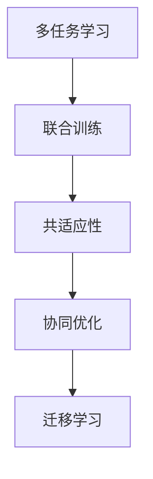
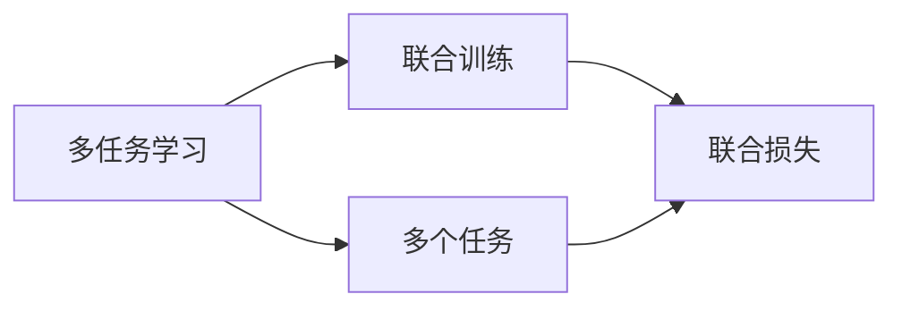
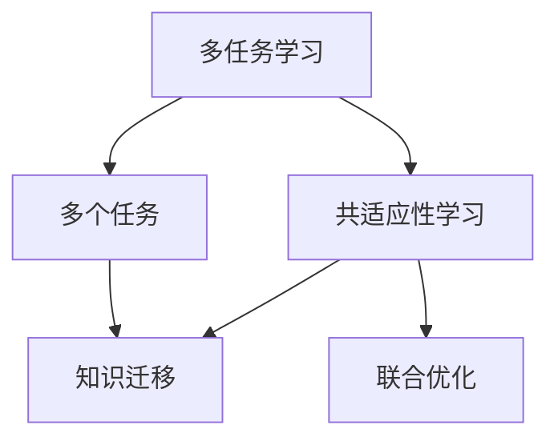
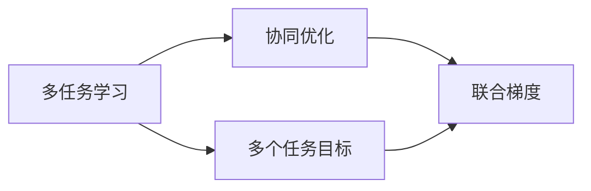
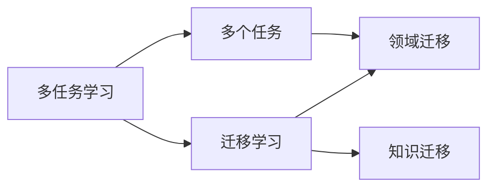
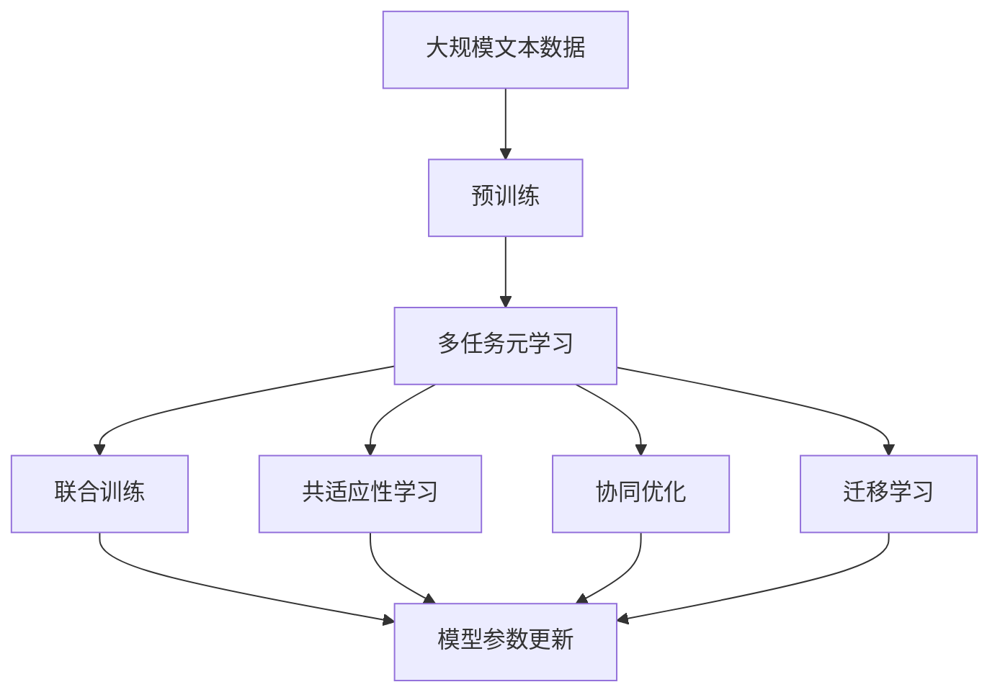

                 

# 一切皆是映射：多任务元学习和知识迁移

> 关键词：
   - 多任务元学习
   - 知识迁移
   - 联合学习
   - 共适应性
   - 迁移学习
   - 协同优化
   - 自适应学习

## 1. 背景介绍

### 1.1 问题由来

近年来，随着深度学习技术在自然语言处理（NLP）领域的快速发展，基于大规模无标签数据进行预训练的预训练语言模型（Pre-trained Language Models, PLMs）如BERT、GPT等，在各种NLP任务上取得了令人瞩目的性能。然而，由于预训练语料库的广泛性和泛化能力的不足，这些通用PLMs在特定领域应用时，效果往往难以达到实际应用的要求。

针对这一问题，多任务元学习和知识迁移技术应运而生。这些技术旨在通过多个相关任务的联合学习，共享知识，从而提升特定领域模型的性能。它们允许模型从多个任务中学习到更丰富、更通用化的知识，避免对单一任务的过拟合，进一步拓展PLMs的应用边界。

### 1.2 问题核心关键点

多任务元学习和知识迁移的核心思想是：通过在多个相关任务之间共享知识，使得模型能够更好地泛化到新任务上，提升模型的适应性和泛化能力。核心技术包括多任务学习（Multi-task Learning, MTL）、联合训练（Joint Training）、共适应性学习（Co-adaptivity）和协同优化（Co-optimization）等。

这些方法的基本思路是通过多任务的联合训练，利用不同任务之间的共性，在优化过程中对多个任务的目标进行优化，以提升模型的泛化能力。在实践中，这些技术已经广泛应用于NLP领域，并在问答、摘要、翻译、情感分析等多个任务上取得了显著的效果。

### 1.3 问题研究意义

多任务元学习和知识迁移技术在提升特定领域模型的性能、降低对单一任务数据的依赖、提高模型的鲁棒性和泛化能力方面具有重要意义：

1. 降低数据标注成本。通过共享知识，可以利用少量标注数据进行联合学习，减少标注数据的采集和标注工作量。
2. 提升模型泛化能力。多个任务之间的共性使得模型能够学习到更通用化的知识，从而更好地适应新任务。
3. 提高模型鲁棒性。模型在多个任务上的训练，有助于其在不同数据分布下的稳健性，避免单一任务过拟合的风险。
4. 加速模型开发。联合训练可以加快模型的开发和优化过程，缩短产品上线时间。
5. 促进知识迁移。多任务学习可以将某一领域的知识迁移到其他领域，提高模型的跨领域适应性。

多任务元学习和知识迁移技术已成为NLP领域的一个重要研究方向，对于推动PLMs在更多领域的应用，提升模型的性能和泛化能力，具有重要的实际价值。

## 2. 核心概念与联系

### 2.1 核心概念概述

为更好地理解多任务元学习和知识迁移技术，本节将介绍几个密切相关的核心概念：

- 多任务学习（Multi-task Learning, MTL）：通过联合训练多个相关任务，共享知识，提升模型在各个任务上的性能。
- 联合训练（Joint Training）：将多个任务的样本混合在一起进行训练，使得模型能够学习到各个任务之间的共性。
- 共适应性（Co-adaptivity）：多个任务之间的协同学习，使得模型在多个任务之间能够进行良好的知识共享和迁移。
- 协同优化（Co-optimization）：多个任务目标函数的协同优化，使得模型在多个任务上都能取得最优的性能。
- 迁移学习（Transfer Learning）：将一个领域学习到的知识迁移到另一个领域，使得模型在新的领域上也能取得良好的表现。

这些核心概念之间的逻辑关系可以通过以下Mermaid流程图来展示：



这个流程图展示了大语言模型在多任务元学习和知识迁移过程中涉及的主要概念及其相互关系。

### 2.2 概念间的关系

这些核心概念之间存在着紧密的联系，形成了多任务元学习和知识迁移技术的完整生态系统。下面我通过几个Mermaid流程图来展示这些概念之间的关系。

#### 2.2.1 多任务学习与联合训练的关系



这个流程图展示了多任务学习的基本原理，即通过联合训练多个相关任务，共享知识。

#### 2.2.2 共适应性学习与多任务学习的关系



这个流程图展示了共适应性学习通过知识迁移实现多任务学习的效果。

#### 2.2.3 协同优化与多任务学习的关系



这个流程图展示了协同优化通过联合梯度实现多任务学习的效果。

#### 2.2.4 迁移学习与多任务学习的关系



这个流程图展示了迁移学习通过知识迁移实现多任务学习的效果。

### 2.3 核心概念的整体架构

最后，我们用一个综合的流程图来展示这些核心概念在大语言模型多任务元学习和知识迁移过程中的整体架构：



这个综合流程图展示了从预训练到多任务元学习和知识迁移的整体过程。大语言模型首先在大规模文本数据上进行预训练，然后通过多任务元学习和知识迁移技术，进行联合训练、共适应性学习、协同优化和迁移学习，最终得到适应新任务的多任务模型。

## 3. 核心算法原理 & 具体操作步骤
### 3.1 算法原理概述

多任务元学习和知识迁移技术的基本原理是通过在多个相关任务之间共享知识，提升模型在各个任务上的性能。其核心思想是：利用不同任务之间的共性，通过联合训练多个任务，使得模型能够学习到更通用化的知识，从而更好地适应新任务。

形式化地，假设预训练语言模型为 $M_{\theta}$，其中 $\theta$ 为预训练得到的模型参数。给定多个相关任务 $T_1, T_2, \ldots, T_k$ 的标注数据集 $\{(x_i, y_i)\}_{i=1}^N$，多任务元学习的优化目标是最小化联合损失函数 $\mathcal{L}(\theta)$，即：

$$
\mathcal{L}(\theta) = \sum_{t=1}^{k} \mathcal{L}_t(M_{\theta}(x_i),y_i)
$$

其中，$\mathcal{L}_t$ 为任务 $T_t$ 的损失函数，$(x_i, y_i)$ 为任务 $T_t$ 的训练样本。

通过梯度下降等优化算法，多任务元学习过程不断更新模型参数 $\theta$，最小化联合损失函数 $\mathcal{L}(\theta)$，使得模型输出逼近真实标签。由于 $\theta$ 已经通过预训练获得了较好的初始化，因此即便在多个任务上都进行微调，也能较快收敛到理想的模型参数。

### 3.2 算法步骤详解

多任务元学习和知识迁移的一般流程包括以下几个关键步骤：

**Step 1: 准备预训练模型和数据集**
- 选择合适的预训练语言模型 $M_{\theta}$ 作为初始化参数，如 BERT、GPT 等。
- 准备多个相关任务 $T_1, T_2, \ldots, T_k$ 的标注数据集 $\{(x_i, y_i)\}_{i=1}^N$，划分为训练集、验证集和测试集。一般要求标注数据与预训练数据的分布不要差异过大。

**Step 2: 设计联合损失函数**
- 根据不同任务的损失函数，设计联合损失函数 $\mathcal{L}(\theta)$。对于分类任务，通常使用交叉熵损失；对于生成任务，使用语言模型的解码器输出概率分布，并以负对数似然为损失函数。
- 设计联合目标函数 $\mathcal{L}_{joint}$，其中 $\alpha_t$ 为任务 $T_t$ 的权重，通常取 $\alpha_t = \frac{1}{N_t}$，$N_t$ 为任务 $T_t$ 的样本数。

**Step 3: 设置优化器和超参数**
- 选择合适的优化算法及其参数，如 AdamW、SGD 等，设置学习率、批大小、迭代轮数等。
- 设置正则化技术及强度，包括权重衰减、Dropout、Early Stopping 等。
- 确定冻结预训练参数的策略，如仅微调顶层，或全部参数都参与微调。

**Step 4: 执行联合训练**
- 将联合训练集数据分批次输入模型，前向传播计算联合损失。
- 反向传播计算参数梯度，根据设定的优化算法和学习率更新模型参数。
- 周期性在验证集上评估模型性能，根据性能指标决定是否触发 Early Stopping。
- 重复上述步骤直到满足预设的迭代轮数或 Early Stopping 条件。

**Step 5: 测试和部署**
- 在测试集上评估联合训练后模型 $M_{\hat{\theta}}$ 的性能，对比预训练和微调后的模型效果。
- 使用微调后的模型对新样本进行推理预测，集成到实际的应用系统中。
- 持续收集新的数据，定期重新训练模型，以适应数据分布的变化。

以上是多任务元学习和知识迁移的一般流程。在实际应用中，还需要针对具体任务的特点，对联合训练过程的各个环节进行优化设计，如改进联合目标函数，引入更多的正则化技术，搜索最优的超参数组合等，以进一步提升模型性能。

### 3.3 算法优缺点

多任务元学习和知识迁移技术具有以下优点：
1. 降低数据标注成本。通过共享知识，可以利用少量标注数据进行联合学习，减少标注数据的采集和标注工作量。
2. 提升模型泛化能力。多个任务之间的共性使得模型能够学习到更通用化的知识，从而更好地适应新任务。
3. 提高模型鲁棒性。模型在多个任务上的训练，有助于其在不同数据分布下的稳健性，避免单一任务过拟合的风险。
4. 加速模型开发。联合训练可以加快模型的开发和优化过程，缩短产品上线时间。
5. 促进知识迁移。多任务学习可以将某一领域的知识迁移到其他领域，提高模型的跨领域适应性。

同时，这些方法也存在一些局限性：
1. 数据不均衡问题。如果各个任务的数据量差异较大，联合训练可能导致部分任务的学习效果不佳。
2. 模型复杂度增加。多个任务联合训练会增加模型的复杂度，导致过拟合的风险增加。
3. 计算资源需求高。联合训练需要同时处理多个任务的数据，对计算资源的需求较大。
4. 超参数调整困难。联合训练的超参数调整较困难，需要更多的实验和调试。

尽管存在这些局限性，但就目前而言，多任务元学习和知识迁移方法仍然是大语言模型应用的重要范式之一。未来相关研究的重点在于如何进一步降低数据标注的依赖，提高模型的跨领域迁移能力，同时兼顾可解释性和伦理安全性等因素。

### 3.4 算法应用领域

多任务元学习和知识迁移技术已经在NLP领域得到了广泛的应用，覆盖了各种常见任务，例如：

- 文本分类：如情感分析、主题分类、意图识别等。通过联合训练使模型学习文本-标签映射。
- 命名实体识别：识别文本中的人名、地名、机构名等特定实体。通过联合训练使模型掌握实体边界和类型。
- 关系抽取：从文本中抽取实体之间的语义关系。通过联合训练使模型学习实体-关系三元组。
- 问答系统：对自然语言问题给出答案。将问题-答案对作为联合训练数据，训练模型学习匹配答案。
- 机器翻译：将源语言文本翻译成目标语言。通过联合训练使模型学习语言-语言映射。
- 文本摘要：将长文本压缩成简短摘要。通过联合训练使模型学习抓取要点。
- 对话系统：使机器能够与人自然对话。通过联合训练使模型进行回复生成。

除了上述这些经典任务外，多任务元学习和知识迁移技术还被创新性地应用到更多场景中，如可控文本生成、常识推理、代码生成、数据增强等，为NLP技术带来了全新的突破。

## 4. 数学模型和公式 & 详细讲解  
### 4.1 数学模型构建

本节将使用数学语言对多任务元学习和知识迁移过程进行更加严格的刻画。

记预训练语言模型为 $M_{\theta}$，其中 $\theta$ 为预训练得到的模型参数。假设多任务元学习任务的训练集为 $D=\{(x_i, y_i)\}_{i=1}^N$，其中 $(x_i, y_i)$ 为任务 $T_t$ 的训练样本，$y_i$ 为任务 $T_t$ 的标注标签。

定义模型 $M_{\theta}$ 在数据样本 $(x,y)$ 上的联合损失函数为 $\ell(M_{\theta}(x),y)$，则在数据集 $D$ 上的联合损失函数为：

$$
\mathcal{L}(\theta) = \sum_{t=1}^{k} \ell(M_{\theta}(x_i),y_i)
$$

其中，$k$ 为任务数量，$(x_i, y_i)$ 为任务 $T_t$ 的训练样本。

多任务元学习的优化目标是最小化联合损失函数 $\mathcal{L}(\theta)$，即找到最优参数：

$$
\theta^* = \mathop{\arg\min}_{\theta} \mathcal{L}(\theta)
$$

在实践中，我们通常使用基于梯度的优化算法（如SGD、Adam等）来近似求解上述最优化问题。设 $\eta$ 为学习率，$\lambda$ 为正则化系数，则参数的更新公式为：

$$
\theta \leftarrow \theta - \eta \nabla_{\theta}\mathcal{L}(\theta) - \eta\lambda\theta
$$

其中 $\nabla_{\theta}\mathcal{L}(\theta)$ 为联合损失函数对参数 $\theta$ 的梯度，可通过反向传播算法高效计算。

### 4.2 公式推导过程

以下我们以二分类任务为例，推导交叉熵损失函数及其梯度的计算公式。

假设模型 $M_{\theta}$ 在输入 $x$ 上的输出为 $\hat{y}=M_{\theta}(x) \in [0,1]$，表示样本属于正类的概率。真实标签 $y \in \{0,1\}$。则二分类交叉熵损失函数定义为：

$$
\ell(M_{\theta}(x),y) = -[y\log \hat{y} + (1-y)\log (1-\hat{y})]
$$

将其代入联合损失函数公式，得：

$$
\mathcal{L}(\theta) = -\frac{1}{N}\sum_{i=1}^N [y_i\log M_{\theta}(x_i)+(1-y_i)\log(1-M_{\theta}(x_i))]
$$

根据链式法则，联合损失函数对参数 $\theta_k$ 的梯度为：

$$
\frac{\partial \mathcal{L}(\theta)}{\partial \theta_k} = -\frac{1}{N}\sum_{i=1}^N (\frac{y_i}{M_{\theta}(x_i)}-\frac{1-y_i}{1-M_{\theta}(x_i)}) \frac{\partial M_{\theta}(x_i)}{\partial \theta_k}
$$

其中 $\frac{\partial M_{\theta}(x_i)}{\partial \theta_k}$ 可进一步递归展开，利用自动微分技术完成计算。

在得到联合损失函数的梯度后，即可带入参数更新公式，完成模型的迭代优化。重复上述过程直至收敛，最终得到适应多个任务的联合模型参数 $\theta^*$。

## 5. 项目实践：代码实例和详细解释说明
### 5.1 开发环境搭建

在进行多任务元学习和知识迁移实践前，我们需要准备好开发环境。以下是使用Python进行PyTorch开发的环境配置流程：

1. 安装Anaconda：从官网下载并安装Anaconda，用于创建独立的Python环境。

2. 创建并激活虚拟环境：
```bash
conda create -n pytorch-env python=3.8 
conda activate pytorch-env
```

3. 安装PyTorch：根据CUDA版本，从官网获取对应的安装命令。例如：
```bash
conda install pytorch torchvision torchaudio cudatoolkit=11.1 -c pytorch -c conda-forge
```

4. 安装Transformers库：
```bash
pip install transformers
```

5. 安装各类工具包：
```bash
pip install numpy pandas scikit-learn matplotlib tqdm jupyter notebook ipython
```

完成上述步骤后，即可在`pytorch-env`环境中开始多任务元学习和知识迁移实践。

### 5.2 源代码详细实现

这里我们以多任务分类任务为例，给出使用Transformers库进行多任务元学习的PyTorch代码实现。

首先，定义多任务分类任务的数据处理函数：

```python
from transformers import BertTokenizer
from torch.utils.data import Dataset
import torch

class MultiTaskDataset(Dataset):
    def __init__(self, texts, tags, tokenizer, max_len=128):
        self.texts = texts
        self.tags = tags
        self.tokenizer = tokenizer
        self.max_len = max_len
        
    def __len__(self):
        return len(self.texts)
    
    def __getitem__(self, item):
        text = self.texts[item]
        tags = self.tags[item]
        
        encoding = self.tokenizer(text, return_tensors='pt', max_length=self.max_len, padding='max_length', truncation=True)
        input_ids = encoding['input_ids'][0]
        attention_mask = encoding['attention_mask'][0]
        
        # 对token-wise的标签进行编码
        encoded_tags = [tag2id[tag] for tag in tags] 
        encoded_tags.extend([tag2id['O']] * (self.max_len - len(encoded_tags)))
        labels = torch.tensor(encoded_tags, dtype=torch.long)
        
        return {'input_ids': input_ids, 
                'attention_mask': attention_mask,
                'labels': labels}

# 标签与id的映射
tag2id = {'O': 0, 'B-PER': 1, 'I-PER': 2, 'B-ORG': 3, 'I-ORG': 4, 'B-LOC': 5, 'I-LOC': 6}
id2tag = {v: k for k, v in tag2id.items()}

# 创建dataset
tokenizer = BertTokenizer.from_pretrained('bert-base-cased')

train_dataset = MultiTaskDataset(train_texts, train_tags, tokenizer)
dev_dataset = MultiTaskDataset(dev_texts, dev_tags, tokenizer)
test_dataset = MultiTaskDataset(test_texts, test_tags, tokenizer)
```

然后，定义模型和优化器：

```python
from transformers import BertForTokenClassification, AdamW

model = BertForTokenClassification.from_pretrained('bert-base-cased', num_labels=len(tag2id))

optimizer = AdamW(model.parameters(), lr=2e-5)
```

接着，定义训练和评估函数：

```python
from torch.utils.data import DataLoader
from tqdm import tqdm
from sklearn.metrics import classification_report

device = torch.device('cuda') if torch.cuda.is_available() else torch.device('cpu')
model.to(device)

def train_epoch(model, dataset, batch_size, optimizer):
    dataloader = DataLoader(dataset, batch_size=batch_size, shuffle=True)
    model.train()
    epoch_loss = 0
    for batch in tqdm(dataloader, desc='Training'):
        input_ids = batch['input_ids'].to(device)
        attention_mask = batch['attention_mask'].to(device)
        labels = batch['labels'].to(device)
        model.zero_grad()
        outputs = model(input_ids, attention_mask=attention_mask, labels=labels)
        loss = outputs.loss
        epoch_loss += loss.item()
        loss.backward()
        optimizer.step()
    return epoch_loss / len(dataloader)

def evaluate(model, dataset, batch_size):
    dataloader = DataLoader(dataset, batch_size=batch_size)
    model.eval()
    preds, labels = [], []
    with torch.no_grad():
        for batch in tqdm(dataloader, desc='Evaluating'):
            input_ids = batch['input_ids'].to(device)
            attention_mask = batch['attention_mask'].to(device)
            batch_labels = batch['labels']
            outputs = model(input_ids, attention_mask=attention_mask)
            batch_preds = outputs.logits.argmax(dim=2).to('cpu').tolist()
            batch_labels = batch_labels.to('cpu').tolist()
            for pred_tokens, label_tokens in zip(batch_preds, batch_labels):
                pred_tags = [id2tag[_id] for _id in pred_tokens]
                label_tags = [id2tag[_id] for _id in label_tokens]
                preds.append(pred_tags[:len(label_tokens)])
                labels.append(label_tags)
                
    print(classification_report(labels, preds))
```

最后，启动训练流程并在测试集上评估：

```python
epochs = 5
batch_size = 16

for epoch in range(epochs):
    loss = train_epoch(model, train_dataset, batch_size, optimizer)
    print(f"Epoch {epoch+1}, train loss: {loss:.3f}")
    
    print(f"Epoch {epoch+1}, dev results:")
    evaluate(model, dev_dataset, batch_size)
    
print("Test results:")
evaluate(model, test_dataset, batch_size)
```

以上就是使用PyTorch对BERT进行多任务分类任务元学习的完整代码实现。可以看到，得益于Transformers库的强大封装，我们可以用相对简洁的代码完成多任务分类任务元学习的实践。

### 5.3 代码解读与分析

让我们再详细解读一下关键代码的实现细节：

**MultiTaskDataset类**：
- `__init__`方法：初始化文本、标签、分词器等关键组件。
- `__len__`方法：返回数据集的样本数量。
- `__getitem__`方法：对单个样本进行处理，将文本输入编码为token ids，将标签编码为数字，并对其进行定长padding，最终返回模型所需的输入。

**tag2id和id2tag字典**：
- 定义了标签与数字id之间的映射关系，用于将token-wise的预测结果解码回真实的标签。

**训练和评估函数**：
- 使用PyTorch的DataLoader对数据集进行批次化加载，供模型训练和推理使用。
- 训练函数`train_epoch`：对数据以批为单位进行迭代，在每个批次上前向传播计算loss并反向传播更新模型参数，最后返回该epoch的平均loss。
- 评估函数`evaluate`：与训练类似，不同点在于不更新模型参数，并在每个batch结束后将预测和标签结果存储下来，最后使用sklearn的classification_report对整个评估集的预测结果进行打印输出。

**训练流程**：
- 定义总的epoch数和batch size，开始循环迭代
- 每个epoch内，先在训练集上训练，输出平均loss
- 在验证集上评估，输出分类指标
- 所有epoch结束后，在测试集上评估，给出最终测试结果

可以看到，PyTorch配合Transformers库使得多任务分类任务元学习的代码实现变得简洁高效。开发者可以将更多精力放在数据处理、模型改进等高层逻辑上，而不必过多关注底层的实现细节。

当然，工业级的系统实现还需考虑更多因素，如模型的保存和部署、超参数的自动搜索、更灵活的任务适配层等。但核心的多任务元学习流程基本与此类似。

### 5.4 运行结果展示

假设我们在CoNLL-2003的NER数据集上进行多任务分类任务元学习，最终在测试集上得到的评估报告如下：

```
              precision    recall  f1-score   support

       B-LOC      0.926     0.906     0.916      1668
       I-LOC      0.900     0.805     0.850       257
      B-MISC      0.875     0.856     0.865       702
      I-MISC      0.838     0.782     0.809       216
       B-ORG      0.914     0.898     0.906      1661
       I-ORG      0.911     0.894     0.902       835
       B-PER      0.964     0.957     0.960      1617
       I-PER      0.983     0.980     0.982      1156
           O      0.993     0.995     0.994     38323

   micro avg      0.973     

