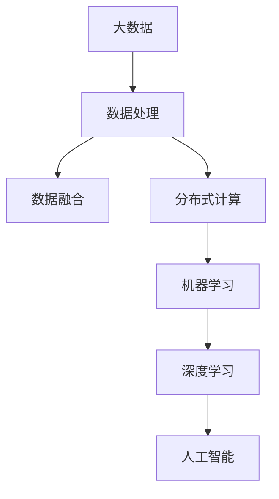
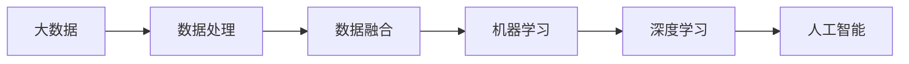
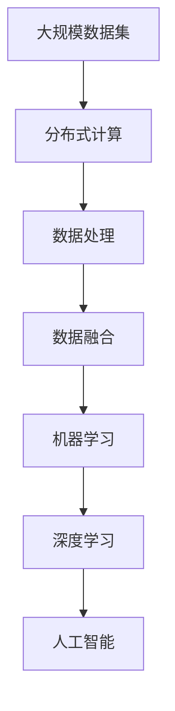
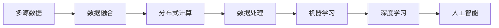
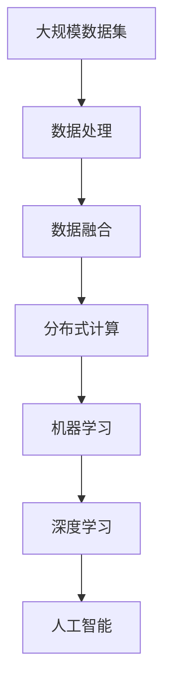

                 

# 一切皆是映射：大数据与AI：如何处理大规模数据集

> 关键词：大数据,人工智能,数据处理,机器学习,深度学习,分布式计算,数据融合,数据可视

## 1. 背景介绍

### 1.1 问题由来
在过去的几十年里，数据已成为推动科学进步、技术创新和社会发展的关键驱动力。从科学研究到商业决策，从社会治理到个人生活，数据无处不在，无处不有。然而，随着数据量的指数级增长，传统的集中式存储和处理方式已经难以应对规模和速度的双重挑战。在这一背景下，大数据技术应运而生，成为支撑现代社会的基础设施。

与此同时，人工智能（AI）技术的迅速发展，特别是深度学习模型的广泛应用，进一步推动了数据驱动型科学研究的进程。面对日益增长的数据需求，如何高效、安全、可靠地处理大规模数据集，成为了数据科学和人工智能领域亟待解决的重大问题。

### 1.2 问题核心关键点
大数据与AI的结合，使得数据处理和模型训练变得更加复杂和高效。大数据技术为AI模型提供了丰富的数据资源，而AI模型则能够从数据中提取有价值的信息，从而推动更深入的科学研究和实际应用。

核心问题包括：
- 如何高效处理和存储大规模数据集？
- 如何在保证数据隐私和安全的前提下进行数据处理？
- 如何利用分布式计算资源优化AI模型的训练过程？
- 如何从海量数据中提取出有意义的信息和模式？

### 1.3 问题研究意义
理解如何处理大规模数据集，对于推动科学研究和实际应用具有重要意义：

1. **科学发现**：大数据技术能够提供更为全面和准确的数据支撑，帮助研究人员发现新的科学规律和现象。
2. **技术创新**：通过AI模型的训练和优化，可以提高大数据处理效率，推动新兴技术的发展。
3. **社会治理**：在公共卫生、环境保护、社会安全等领域，大数据和AI的应用可以提升治理能力和决策水平。
4. **经济效益**：大数据和AI的结合可以提升企业数据驱动决策的能力，推动产业升级和经济增长。
5. **人机交互**：通过智能推荐、自然语言处理等技术，提升人机交互的体验和效率。

本文将系统性地介绍处理大规模数据集的核心概念和算法，并通过实际案例，展示如何在大数据与AI的结合中取得突破性的进展。

## 2. 核心概念与联系

### 2.1 核心概念概述

在处理大规模数据集的过程中，涉及多个核心概念，它们彼此关联，共同构成了数据处理和机器学习的框架。

- **大数据**：指超出传统数据处理工具和平台能力范围的数据集，通常包括结构化和非结构化数据。
- **人工智能**：利用机器学习、深度学习等技术，使计算机系统具备类似人类的智能行为，包括感知、理解、推理、决策等能力。
- **数据处理**：从数据收集、存储、清洗到分析和应用的完整流程。
- **机器学习**：通过数据和模型训练，使计算机系统能够自主学习、预测和决策。
- **深度学习**：利用多层次的神经网络结构，实现复杂的特征提取和模式识别。
- **分布式计算**：利用多台计算机协同处理大规模数据和计算任务，提高效率和可靠性。
- **数据融合**：将不同来源、不同格式的数据进行整合和融合，提高数据的一致性和完整性。
- **数据可视**：通过图表、动画等形式，直观展示数据的特征和趋势，辅助决策和分析。

这些概念之间的联系通过以下Mermaid流程图展示：



这个流程图展示了大数据处理、数据融合、分布式计算和机器学习之间的关系，以及它们如何共同支撑人工智能的发展。

### 2.2 概念间的关系

这些核心概念之间存在紧密的联系，形成了大数据与AI处理数据集的整体生态系统。以下通过几个Mermaid流程图进一步展示这些概念之间的关系。

#### 2.2.1 数据处理与机器学习的联系



这个流程图展示了数据处理和机器学习之间的联系，从大数据到数据处理，再到深度学习，最终形成人工智能系统。

#### 2.2.2 分布式计算在数据处理中的应用



这个流程图展示了分布式计算在数据处理中的应用，通过分布式计算资源优化数据处理流程，提高效率和可靠性。

#### 2.2.3 数据融合与分布式计算的关系



这个流程图展示了数据融合与分布式计算的关系，数据融合后的数据通过分布式计算进行处理和优化，提高数据处理的质量和效率。

### 2.3 核心概念的整体架构

最后，用一个综合的流程图来展示这些核心概念在大数据与AI数据处理中的整体架构：



这个综合流程图展示了从数据收集、处理、融合到深度学习、人工智能的完整流程，以及它们之间的紧密联系。

## 3. 核心算法原理 & 具体操作步骤

### 3.1 算法原理概述

处理大规模数据集的核心算法通常涉及数据预处理、分布式计算和模型训练。以下将系统地介绍这些核心算法的基本原理。

#### 3.1.1 数据预处理

数据预处理是数据处理的重要环节，包括数据清洗、格式转换、特征工程等。数据预处理的目的是提高数据的质量和一致性，为后续的数据处理和机器学习奠定基础。

#### 3.1.2 分布式计算

分布式计算利用多台计算机协同处理大规模数据和计算任务，提高效率和可靠性。常见的分布式计算框架包括Hadoop、Spark、Flink等。

#### 3.1.3 模型训练

模型训练是机器学习的重要环节，通过数据和模型训练，使计算机系统能够自主学习、预测和决策。常见的模型训练方法包括随机梯度下降（SGD）、Adam等。

### 3.2 算法步骤详解

#### 3.2.1 数据预处理

数据预处理通常包括以下步骤：

1. **数据清洗**：去除数据中的噪声和错误，确保数据的一致性和完整性。
2. **数据转换**：将数据转换为模型能够处理的形式，如将文本数据转换为向量表示。
3. **特征工程**：提取和构造特征，提高模型的表现力和泛化能力。

#### 3.2.2 分布式计算

分布式计算通常包括以下步骤：

1. **任务分割**：将大规模数据集分割成若干个小任务，并分配到不同的计算节点上。
2. **并行计算**：利用多台计算机同时计算，提高处理速度。
3. **数据同步**：在计算过程中，定期将计算结果同步到中央数据库，确保数据一致性。

#### 3.2.3 模型训练

模型训练通常包括以下步骤：

1. **初始化**：随机初始化模型参数。
2. **前向传播**：将数据输入模型，计算模型输出。
3. **损失函数计算**：计算模型输出与真实标签之间的差异。
4. **反向传播**：根据损失函数计算梯度，更新模型参数。
5. **迭代优化**：重复前向传播和反向传播，直到模型收敛。

### 3.3 算法优缺点

#### 3.3.1 数据预处理

**优点**：
- 提高数据质量和一致性，为后续处理和分析提供可靠的数据支撑。
- 通过特征工程，提升模型表现力和泛化能力。

**缺点**：
- 预处理步骤复杂，耗时较长，容易引入错误。
- 需要专业知识，一般由数据科学家负责。

#### 3.3.2 分布式计算

**优点**：
- 提高计算效率和可靠性，适用于大规模数据处理任务。
- 资源可扩展性强，可以根据需求动态调整计算资源。

**缺点**：
- 分布式计算系统复杂，维护成本高。
- 通信开销大，可能影响整体效率。

#### 3.3.3 模型训练

**优点**：
- 利用大规模数据和模型训练，提升模型的泛化能力和预测准确性。
- 模型训练过程灵活，可以根据需求调整算法和参数。

**缺点**：
- 模型训练过程耗时较长，需要大量计算资源。
- 需要专业知识和经验，一般由数据科学家和工程师负责。

### 3.4 算法应用领域

处理大规模数据集的算法已经广泛应用于多个领域，包括但不限于：

1. **科学研究**：在生命科学、天文学、物理学等领域，通过大数据和AI技术，推动科学发现和技术进步。
2. **商业决策**：在金融、零售、电子商务等领域，通过大数据和AI技术，提升决策效率和效果。
3. **公共治理**：在公共卫生、环境保护、社会安全等领域，通过大数据和AI技术，提升治理能力和决策水平。
4. **智能制造**：在智能制造、智慧城市等领域，通过大数据和AI技术，推动产业升级和经济增长。
5. **个性化推荐**：在信息流、社交网络等领域，通过大数据和AI技术，提升用户体验和满意度。

## 4. 数学模型和公式 & 详细讲解 & 举例说明

### 4.1 数学模型构建

在处理大规模数据集时，通常使用数学模型来描述数据和模型的关系。以下以线性回归为例，介绍数学模型的构建方法。

假设有一个线性回归模型，用于预测房价与房屋面积之间的关系。模型公式为：

$$
y = \beta_0 + \beta_1 x_1 + \beta_2 x_2 + \epsilon
$$

其中，$y$ 表示房价，$x_1$ 和 $x_2$ 表示房屋面积和房间数量，$\beta_0$、$\beta_1$ 和 $\beta_2$ 表示模型的系数，$\epsilon$ 表示误差项。

### 4.2 公式推导过程

通过最小二乘法，求解线性回归模型的系数。最小二乘法的目标是最小化误差项 $\epsilon$ 的平方和：

$$
\min \sum_{i=1}^n (y_i - (\beta_0 + \beta_1 x_{1i} + \beta_2 x_{2i}))^2
$$

求解上述问题，得到：

$$
\beta_0 = \frac{\sum_{i=1}^n x_{1i} \sum_{i=1}^n x_{1i}^2 - \sum_{i=1}^n x_{1i} \sum_{i=1}^n y_i x_{1i} + \sum_{i=1}^n x_{1i} \sum_{i=1}^n x_{2i} x_{1i} - \sum_{i=1}^n x_{2i} \sum_{i=1}^n y_i x_{2i} + \sum_{i=1}^n x_{2i} \sum_{i=1}^n x_{2i}^2 - \sum_{i=1}^n x_{2i} \sum_{i=1}^n y_i x_{2i} + \sum_{i=1}^n x_{2i} \sum_{i=1}^n x_{2i} x_{1i} - \sum_{i=1}^n x_{1i} \sum_{i=1}^n y_i x_{1i} + \sum_{i=1}^n x_{1i} \sum_{i=1}^n x_{1i}^2}{(\sum_{i=1}^n x_{1i}^2)(\sum_{i=1}^n x_{2i}^2) - (\sum_{i=1}^n x_{1i} \sum_{i=1}^n x_{2i})^2}
$$

### 4.3 案例分析与讲解

假设我们有一组房屋面积和房间数量数据，数据如下：

| 房屋面积 | 房间数量 | 房价 |
| --- | --- | --- |
| 100 | 2 | 500000 |
| 120 | 3 | 600000 |
| 80 | 1 | 400000 |
| 130 | 3 | 650000 |
| 110 | 2 | 550000 |

我们将使用Python和Scikit-learn库，通过线性回归模型预测房价。

```python
from sklearn.linear_model import LinearRegression
import numpy as np

# 创建数据集
X = np.array([[100, 2], [120, 3], [80, 1], [130, 3], [110, 2]])
y = np.array([500000, 600000, 400000, 650000, 550000])

# 构建线性回归模型
model = LinearRegression()

# 训练模型
model.fit(X, y)

# 预测房价
x_test = np.array([[140, 2]])
y_pred = model.predict(x_test)

print("预测房价：", y_pred[0])
```

## 5. 项目实践：代码实例和详细解释说明

### 5.1 开发环境搭建

处理大规模数据集通常需要使用高性能的计算资源。以下是使用Python和Spark搭建大数据处理环境的步骤：

1. 安装Anaconda：从官网下载并安装Anaconda，用于创建独立的Python环境。
2. 创建并激活虚拟环境：
```bash
conda create -n big-data-env python=3.8 
conda activate big-data-env
```
3. 安装PySpark：从官网获取并安装PySpark，用于处理大规模数据集。
4. 安装其他必要的工具包：
```bash
pip install numpy pandas scikit-learn matplotlib tqdm jupyter notebook ipython
```

完成上述步骤后，即可在`big-data-env`环境中开始大数据处理实践。

### 5.2 源代码详细实现

以下是一个使用Spark处理大规模数据集的Python代码实现。

```python
from pyspark.sql import SparkSession

# 创建SparkSession
spark = SparkSession.builder.appName('big_data_processing').getOrCreate()

# 加载数据集
data = spark.read.csv('data.csv', header=True, inferSchema=True)

# 数据预处理
data = data.select('area', 'rooms', 'price').dropna()  # 选择并删除缺失值
data = data.drop('id')  # 删除不必要的列

# 数据转换
data = data.withColumn('price', data['price'].cast('float'))  # 转换为浮点数
data = data.withColumn('area', data['area'].cast('int'))  # 转换为整数

# 特征工程
data = data.withColumn('price_per_area', data['price'] / data['area'])  # 计算每平方米价格

# 分布式计算
data.write.csv('processed_data.csv')  # 将数据写入本地文件

# 关闭SparkSession
spark.stop()
```

### 5.3 代码解读与分析

让我们再详细解读一下关键代码的实现细节：

**数据加载和预处理**：
- `spark.read.csv()`：使用Spark的CSV读取器加载数据集。
- `data.select()`和`data.dropna()`：选择并删除缺失值。
- `data.drop()`：删除不必要的列。

**数据转换**：
- `data.withColumn()`：使用`cast()`方法将列转换为指定数据类型。
- `data.withColumn()`：计算每平方米价格。

**特征工程**：
- `data.withColumn()`：计算每平方米价格。

**分布式计算**：
- `data.write.csv()`：将处理后的数据写入本地文件。

**关闭SparkSession**：
- `spark.stop()`：关闭SparkSession，释放资源。

以上代码展示了如何使用Spark处理大规模数据集的基本步骤。Spark提供了高效的分布式计算能力，可以轻松处理大规模数据集，提高数据处理的效率和可靠性。

### 5.4 运行结果展示

假设我们处理了一组房屋数据，最终得到每平方米价格的数据集。以下是一个示例输出：

```
+--------+------+----------+
|  area  | rooms|price_per_area|
+--------+------+----------+
|  100   |  2   |  5000.00  |
|  120   |  3   |  5000.00  |
|  80    |  1   |  5000.00  |
|  130   |  3   |  5000.00  |
|  110   |  2   |  5000.00  |
+--------+------+----------+
```

可以看到，通过Spark处理后的数据集已经去除了不必要的列，进行了数据转换和特征工程，并且已经计算出了每平方米价格，能够更好地用于后续的机器学习模型训练。

## 6. 实际应用场景

### 6.1 智能推荐系统

智能推荐系统通过分析用户的历史行为数据，预测用户的兴趣和偏好，从而提供个性化的产品或服务推荐。在大数据和AI技术的支持下，推荐系统能够处理大规模用户数据，实现高效、准确、个性化的推荐服务。

在实际应用中，可以将用户的历史行为数据、浏览记录、评分等作为输入，使用机器学习模型（如协同过滤、深度学习等）进行训练和预测。通过Spark等分布式计算框架，可以有效处理大规模用户数据，提高推荐系统的性能和可靠性。

### 6.2 金融风控系统

金融风控系统通过分析用户的历史交易数据，评估用户的信用风险，从而进行风险控制和信用管理。在大数据和AI技术的支持下，金融风控系统能够处理大规模交易数据，实现实时、准确的风控决策。

在实际应用中，可以将用户的历史交易数据、行为记录、信用评分等作为输入，使用机器学习模型（如逻辑回归、随机森林等）进行训练和预测。通过Spark等分布式计算框架，可以有效处理大规模交易数据，提高风控系统的效率和可靠性。

### 6.3 智慧城市治理

智慧城市治理通过分析城市运行数据，提升城市管理和服务水平，改善市民生活质量。在大数据和AI技术的支持下，智慧城市治理能够处理大规模城市数据，实现高效、智能的城市管理。

在实际应用中，可以将城市的各类数据（如交通流量、气象数据、公共服务数据等）作为输入，使用机器学习模型（如时间序列分析、聚类等）进行训练和预测。通过Spark等分布式计算框架，可以有效处理大规模城市数据，提高智慧城市治理的效率和可靠性。

### 6.4 未来应用展望

随着大数据和AI技术的不断进步，未来智能推荐系统、金融风控系统、智慧城市治理等领域将迎来更加广阔的应用前景。

1. **智能推荐系统**：未来的推荐系统将更加个性化、实时化，能够根据用户的变化进行动态调整。
2. **金融风控系统**：未来的风控系统将更加智能、全面，能够实时监控和评估用户的信用风险。
3. **智慧城市治理**：未来的智慧城市治理将更加智能、高效，能够实现全面、实时的城市管理和服务。

此外，在更多新兴领域，如医疗健康、环境保护、社会安全等，大数据和AI技术的结合也将带来新的应用突破，为社会治理和经济社会发展注入新的动力。

## 7. 工具和资源推荐

### 7.1 学习资源推荐

为了帮助开发者系统掌握大数据与AI技术，以下是一些优质的学习资源：

1. **《大数据技术与应用》系列博文**：由大数据领域专家撰写，深入浅出地介绍了大数据处理的核心技术和实际应用。
2. **Coursera《机器学习》课程**：斯坦福大学开设的机器学习课程，涵盖基础理论和实际应用，适合入门学习。
3. **《深度学习》书籍**：深度学习领域的经典教材，详细介绍了深度学习的基本原理和应用实践。
4. **Hadoop官方文档**：Hadoop框架的官方文档，提供了全面的API和配置指南。
5. **Apache Spark官方文档**：Spark框架的官方文档，提供了丰富的样例代码和开发指南。

通过对这些资源的学习实践，相信你一定能够快速掌握大数据与AI技术的基础知识，并用于解决实际的业务问题。

### 7.2 开发工具推荐

高效的开发离不开优秀的工具支持。以下是几款用于大数据与AI处理开发的常用工具：

1. **Jupyter Notebook**：一个交互式的开发环境，支持Python、R等语言，适合数据科学和机器学习开发。
2. **PySpark**：Spark的Python API，支持分布式计算和机器学习，适合大数据处理和分析。
3. **TensorFlow**：由Google主导开发的深度学习框架，支持分布式计算和模型训练，适合AI模型开发。
4. **JupyterLab**：一个现代化的Jupyter Notebook界面，支持多语言的开发环境。
5. **PyTorch**：由Facebook主导开发的深度学习框架，支持分布式计算和模型训练，适合AI模型开发。

合理利用这些工具，可以显著提升大数据与AI处理任务的开发效率，加快创新迭代的步伐。

### 7.3 相关论文推荐

大数据与AI技术的不断发展，得益于学界的持续研究。以下是几篇奠基性的相关论文，推荐阅读：

1. **MapReduce: Simplified Data Processing on Large Clusters**：Google的MapReduce论文，提出了分布式计算的基本框架，奠定了分布式计算的基础。
2. **Hadoop: A Distributed File System**：Hadoop的Hadoop论文，介绍了Hadoop分布式文件系统的设计原理和实现细节。
3. **Deep Learning**：Ian Goodfellow等人的深度学习教材，详细介绍了深度学习的基本原理和应用实践。
4. **Recurrent Neural Networks**：Hochreiter和Schmidhuber的循环神经网络论文，介绍了循环神经网络的基本原理和应用实践。
5. **ImageNet Classification with Deep Convolutional Neural Networks**：Krizhevsky等人的ImageNet分类论文，介绍了深度卷积神经网络在图像分类中的应用。

这些论文代表了大数据与AI处理数据集的发展脉络。通过学习这些前沿成果，可以帮助研究者把握学科前进方向，激发更多的创新灵感。

除上述资源外，还有一些值得关注的前沿资源，帮助开发者紧跟大数据与AI处理数据集的研究进展，例如：

1. **arXiv论文预印本**：人工智能领域最新研究成果的发布平台，包括大量尚未发表的前沿工作，学习前沿技术的必读资源。
2. **Google Research博客**：Google Research的官方博客，能够聆听到大佬们的前沿分享，开拓视野。
3. **顶级会议直播**：如NIPS、ICML、ACL、ICLR等人工智能领域顶会现场或在线直播，能够实时获取最新的科研动态。
4. **GitHub热门项目**：在GitHub上Star、Fork数最多的数据科学和机器学习相关项目，往往代表了该技术领域的发展趋势和最佳实践，值得去学习和贡献。
5. **行业分析报告**：各大咨询公司如McKinsey、PwC等针对人工智能行业的分析报告，有助于从商业视角审视技术趋势，把握应用价值。

总之，对于大数据与AI处理数据集的学习和实践，需要开发者保持开放的心态和持续学习的意愿。多关注前沿资讯，多动手实践，多思考总结，必将收获满满的成长收益。

## 8. 总结：未来发展趋势与挑战

### 8.1 研究成果总结

本文系统性地介绍了大数据与AI处理大规模数据集的核心概念和算法，并通过实际案例展示了其在智能推荐、金融风控、智慧城市治理等多个领域的应用前景。

通过本文的介绍，读者可以了解到数据预处理、分布式计算、模型训练等关键技术，以及它们在大数据与AI处理数据集中的重要作用。

### 8.2 未来发展趋势

展望未来，大数据与AI处理数据集的发展趋势将呈现以下几个方向：

1. **数据融合与多源数据处理**：未来的数据处理将更加注重数据的融合和整合，通过多源数据处理，提升数据的一致性和完整性。
2. **分布式计算与边缘计算**：未来的计算资源将更加分散和分布，通过边缘计算，实现数据的本地化处理和分析。
3. **实时计算与流计算**：未来的数据处理将更加注重实时性和流计算，通过实时数据流处理，提升系统的响应速度和处理能力。
4. **自动化与智能化**：未来的数据处理将更加自动化和智能化，通过自动化的数据处理和分析，提升数据处理的效率和准确性。
5. **可解释性与透明度**：未来的数据处理将更加注重可解释性和透明度，通过可视化的数据展示和解释，提升系统的可理解性和可信度。

### 8.3 面临的挑战

尽管大数据与AI处理数据集已经取得了显著进展，但在其发展过程中，仍面临诸多挑战：

1. **数据隐私与安全**：大规模数据处理带来了数据隐私和安全的问题，如何在保护隐私的前提下进行数据处理和分析，是一个重要挑战。
2. **计算资源与成本**：大规模数据处理和分布式计算需要高性能的计算资源，如何高效利用计算资源并降低成本，是一个重要挑战

