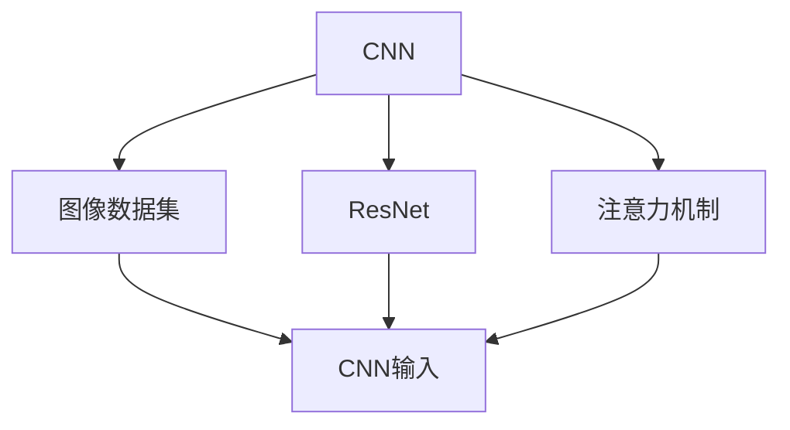
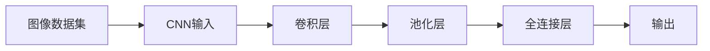

                 

## 1. 背景介绍

### 1.1 问题由来
随着深度学习技术的快速发展，大规模图像数据集上的深度学习模型取得了显著的成果。无论是计算机视觉任务的图像分类、目标检测、语义分割，还是自动驾驶、安防监控等领域，深度学习模型都在图像数据处理方面展现了强大的能力。然而，如何高效、准确地从大规模图像数据中提取有用的特征，依然是深度学习领域面临的一个重要问题。

深度学习模型通过训练大量参数，从图像数据中学习出高效的特征提取器，能够自动识别图像中的重要信息，并用于不同的下游任务。这一过程本质上是对图像数据集进行映射，将高维的像素数据映射到低维的特征空间中，使得机器能够理解和识别图像。

### 1.2 问题核心关键点
本节将详细介绍深度学习模型在大规模图像数据集上的应用，主要包括以下几个关键点：

1. 图像数据集预处理：包括数据增强、数据标准化等技术，以提高模型泛化能力。
2. 深度学习模型架构：介绍卷积神经网络（CNN）、残差网络（ResNet）、注意力机制（Attention）等主流模型结构。
3. 特征提取与映射：探讨卷积操作、池化操作等技术在特征提取中的应用。
4. 深度学习优化算法：包括梯度下降、Adam优化器、自适应学习率（AdaGrad、RMSprop）等，以保证模型高效收敛。
5. 模型评估与验证：通过准确率、召回率、F1分数等指标评估模型性能，并进行交叉验证，避免过拟合。

### 1.3 问题研究意义
深度学习模型在大规模图像数据集上的应用，对于提升图像处理和计算机视觉任务性能，加速自动驾驶、医疗影像、安防监控等产业的数字化转型，具有重要意义：

1. 提高图像处理效率：大规模图像数据集上的深度学习模型，能够自动高效地处理海量图像数据，减轻人工负担。
2. 增强任务精度：通过优化模型结构，提升特征提取和映射的准确性，使得模型在图像分类、目标检测、语义分割等任务上取得更优的表现。
3. 推动产业升级：深度学习模型在图像处理中的应用，为各行业提供了高效、精准的数据处理手段，加速了传统行业的数字化进程。
4. 促进科学研究：大规模图像数据集上的深度学习模型，为视觉感知、模式识别等基础研究提供了新的工具和方法。
5. 创新应用场景：深度学习模型在图像处理中的应用，催生了图像生成、图像修复、图像增强等创新应用场景，推动了人工智能技术的发展。

## 2. 核心概念与联系

### 2.1 核心概念概述

本节将介绍几个与大规模图像数据集上深度学习模型相关的核心概念，包括卷积神经网络（CNN）、残差网络（ResNet）、注意力机制（Attention）等，并展示它们之间的联系。

#### 2.1.1 卷积神经网络（CNN）
卷积神经网络（CNN）是深度学习模型在图像处理中的核心架构，由卷积层、池化层、全连接层等组成。CNN能够自动提取图像中的局部特征，并通过多层卷积操作和池化操作，逐步提升特征的抽象层次，最终用于分类、检测、分割等下游任务。

#### 2.1.2 残差网络（ResNet）
残差网络（ResNet）是深度学习模型的一种特殊架构，通过引入跨层连接（Skip Connection）机制，解决了深度神经网络中的梯度消失和梯度爆炸问题。ResNet能够构建更深层次的神经网络，同时保证模型的稳定性和收敛性。

#### 2.1.3 注意力机制（Attention）
注意力机制（Attention）是一种改进的神经网络架构，通过动态调整每个输入数据的权重，使得模型能够更加关注对输出结果有重要贡献的数据。在图像处理中，注意力机制能够提升模型对图像细节的识别能力，如在目标检测、语义分割等任务中表现出色。

这些核心概念之间存在着紧密的联系，如图像数据集上的深度学习模型通常采用CNN作为基本架构，再通过残差网络来处理深度问题，注意力机制来提升模型对细节的识别能力。通过这种层层递进的架构设计，深度学习模型在大规模图像数据集上展现了强大的处理能力。

### 2.2 概念间的关系

这些核心概念之间通过深度学习模型进行联系，如图1所示：



图1 卷积神经网络与残差网络、注意力机制的关系

### 2.3 核心概念的整体架构

图2展示了深度学习模型在大规模图像数据集上的整体架构：



图2 深度学习模型在大规模图像数据集上的整体架构

## 3. 核心算法原理 & 具体操作步骤
### 3.1 算法原理概述

深度学习模型在大规模图像数据集上的应用，本质上是将高维的像素数据映射到低维的特征空间，使得模型能够理解和识别图像。这一过程通常包括以下几个步骤：

1. 数据预处理：包括图像标准化、数据增强等技术，提高模型泛化能力。
2. 卷积操作：通过卷积层提取图像的局部特征，构建多层次的特征表示。
3. 池化操作：通过池化层降低特征维度，保留重要特征。
4. 全连接层：将池化后的特征进行线性变换，得到最终的输出结果。
5. 优化算法：使用梯度下降、Adam优化器等算法，更新模型参数，最小化损失函数。
6. 模型评估：通过准确率、召回率、F1分数等指标评估模型性能，并进行交叉验证，避免过拟合。

### 3.2 算法步骤详解

本节将详细介绍深度学习模型在大规模图像数据集上的具体操作步骤，包括数据预处理、卷积操作、池化操作、全连接层、优化算法和模型评估。

#### 3.2.1 数据预处理
数据预处理是深度学习模型在大规模图像数据集上应用的重要步骤，包括以下几个关键步骤：

1. 图像标准化：将图像数据转换为标准格式，如归一化像素值，以提高模型收敛速度。
2. 数据增强：通过旋转、平移、缩放等操作，扩充训练集，提高模型泛化能力。

```python
from PIL import Image
import numpy as np
from torchvision.transforms import transforms

transforms = transforms.Compose([
    transforms.Resize(256),
    transforms.CenterCrop(224),
    transforms.ToTensor(),
    transforms.Normalize(mean=[0.485, 0.456, 0.406],
                        std=[0.229, 0.224, 0.225])
])
```

#### 3.2.2 卷积操作
卷积操作是深度学习模型在图像处理中的核心技术，通过卷积层提取图像的局部特征，构建多层次的特征表示。常用的卷积操作包括：

1. 卷积核：定义卷积操作的核心参数，通常通过滤波器、步幅等超参数进行调优。
2. 卷积操作：通过卷积核对输入图像进行卷积操作，提取局部特征。

```python
import torch.nn as nn

class ConvNet(nn.Module):
    def __init__(self):
        super(ConvNet, self).__init__()
        self.conv1 = nn.Conv2d(3, 32, 3, 1, padding=1)
        self.relu = nn.ReLU()
        self.pool = nn.MaxPool2d(2, 2)

    def forward(self, x):
        x = self.conv1(x)
        x = self.relu(x)
        x = self.pool(x)
        return x
```

#### 3.2.3 池化操作
池化操作是深度学习模型在图像处理中的重要技术，通过池化层降低特征维度，保留重要特征。常用的池化操作包括：

1. 最大池化：通过取最大值操作，提取图像的局部特征。
2. 平均池化：通过取平均值操作，提取图像的局部特征。

```python
class PoolNet(nn.Module):
    def __init__(self):
        super(PoolNet, self).__init__()
        self.pool1 = nn.MaxPool2d(2, 2)
        self.pool2 = nn.MaxPool2d(2, 2)

    def forward(self, x):
        x = self.pool1(x)
        x = self.pool2(x)
        return x
```

#### 3.2.4 全连接层
全连接层是深度学习模型在图像处理中的最后一层，将池化后的特征进行线性变换，得到最终的输出结果。常用的全连接层操作包括：

1. 线性变换：将池化后的特征进行线性变换，得到最终的输出结果。
2. 激活函数：通过激活函数引入非线性，提高模型表达能力。

```python
class FullyConnectedNet(nn.Module):
    def __init__(self, num_classes):
        super(FullyConnectedNet, self).__init__()
        self.fc1 = nn.Linear(256, 128)
        self.fc2 = nn.Linear(128, num_classes)
        self.relu = nn.ReLU()

    def forward(self, x):
        x = self.fc1(x)
        x = self.relu(x)
        x = self.fc2(x)
        return x
```

#### 3.2.5 优化算法
优化算法是深度学习模型在大规模图像数据集上训练的重要步骤，通过优化算法更新模型参数，最小化损失函数。常用的优化算法包括：

1. 梯度下降：通过计算梯度，更新模型参数，最小化损失函数。
2. Adam优化器：通过自适应学习率，加速模型收敛，避免过拟合。

```python
optimizer = torch.optim.Adam(model.parameters(), lr=0.001)
```

#### 3.2.6 模型评估
模型评估是深度学习模型在大规模图像数据集上应用的重要步骤，通过评估指标评估模型性能，并进行交叉验证，避免过拟合。常用的评估指标包括：

1. 准确率：模型预测正确的样本数与总样本数之比。
2. 召回率：模型预测为正样本的样本中，真正为正样本的样本数与正样本总数之比。
3. F1分数：准确率和召回率的调和平均数。

```python
from sklearn.metrics import accuracy_score, precision_score, recall_score, f1_score

def evaluate(model, test_data, num_classes):
    model.eval()
    correct = 0
    total = 0
    with torch.no_grad():
        for data, target in test_data:
            data, target = data.to(device), target.to(device)
            output = model(data)
            _, predicted = torch.max(output, 1)
            total += target.size(0)
            correct += (predicted == target).sum().item()
    accuracy = correct / total
    precision = precision_score(target, predicted, average='macro')
    recall = recall_score(target, predicted, average='macro')
    f1 = f1_score(target, predicted, average='macro')
    print('Accuracy: {:.2f}%'.format(accuracy * 100))
    print('Precision: {:.2f}%'.format(precision * 100))
    print('Recall: {:.2f}%'.format(recall * 100))
    print('F1 Score: {:.2f}%'.format(f1 * 100))
```

### 3.3 算法优缺点
深度学习模型在大规模图像数据集上的应用，具有以下优点：

1. 高效性：深度学习模型能够自动高效地处理海量图像数据，减轻人工负担。
2. 泛化能力强：通过数据增强等技术，深度学习模型能够提升泛化能力，避免过拟合。
3. 精度高：通过优化模型结构和超参数，深度学习模型能够在图像分类、目标检测、语义分割等任务上取得更优的表现。

同时，深度学习模型在大规模图像数据集上应用，也存在以下缺点：

1. 模型复杂度高：深度学习模型通常包含大量参数，需要较高的计算资源和存储资源。
2. 训练时间长：深度学习模型的训练时间较长，需要大量的数据和计算资源。
3. 可解释性差：深度学习模型通常是"黑盒"模型，难以解释其内部工作机制和决策逻辑。

### 3.4 算法应用领域
深度学习模型在大规模图像数据集上的应用，主要涵盖以下几个领域：

1. 计算机视觉：图像分类、目标检测、语义分割、图像生成等。
2. 自动驾驶：环境感知、道路识别、交通信号处理等。
3. 医疗影像：医学图像分类、病灶检测、手术辅助等。
4. 安防监控：视频监控、行为识别、异常检测等。
5. 工业检测：缺陷检测、质量控制、智能制造等。
6. 遥感图像：地球探测、环境监测、海洋监测等。

## 4. 数学模型和公式 & 详细讲解 & 举例说明

### 4.1 数学模型构建

深度学习模型在大规模图像数据集上的应用，本质上是对高维的像素数据进行映射，构建低维的特征空间。以下将详细介绍深度学习模型在图像处理中的数学模型构建。

设输入图像为 $x \in \mathbb{R}^{H \times W \times C}$，其中 $H$、$W$、$C$ 分别为图像的高、宽和通道数。通过卷积操作，得到卷积核 $k \in \mathbb{R}^{f \times f \times C}$，其中 $f$ 为卷积核大小，$C$ 为输入图像的通道数。卷积操作可表示为：

$$
y_i = \sum_j \sum_k x_{i-j} \times k_j
$$

其中 $i$ 为输入图像的像素位置，$j$ 为卷积核的像素位置，$k$ 为卷积核的通道数。

### 4.2 公式推导过程

以下将详细推导深度学习模型在大规模图像数据集上的训练过程。

设输出为 $y \in \mathbb{R}^{N \times K}$，其中 $N$ 为样本数，$K$ 为输出类别数。通过损失函数 $L$，得到模型预测结果与真实结果之间的误差，即：

$$
L = \sum_{i=1}^{N} \sum_{k=1}^{K} (y_i^k - \hat{y}_i^k)^2
$$

其中 $\hat{y}_i^k$ 为模型在样本 $i$ 的类别 $k$ 的预测结果。

通过梯度下降等优化算法，更新模型参数 $\theta$，最小化损失函数 $L$，即：

$$
\theta = \mathop{\arg\min}_{\theta} L
$$

在实践中，我们通常使用基于梯度的优化算法（如SGD、Adam等）来近似求解上述最优化问题。

### 4.3 案例分析与讲解

以图像分类任务为例，详细分析深度学习模型在大规模图像数据集上的应用。

设输入图像为 $x \in \mathbb{R}^{H \times W \times C}$，输出为 $y \in \mathbb{R}^{N \times K}$，其中 $N$ 为样本数，$K$ 为输出类别数。假设模型由卷积层、池化层、全连接层组成，则深度学习模型在大规模图像数据集上的训练过程如下：

1. 数据预处理：将图像数据转换为标准格式，并进行数据增强，以提高模型泛化能力。
2. 卷积操作：通过卷积层提取图像的局部特征，构建多层次的特征表示。
3. 池化操作：通过池化层降低特征维度，保留重要特征。
4. 全连接层：将池化后的特征进行线性变换，得到最终的输出结果。
5. 优化算法：使用梯度下降、Adam优化器等算法，更新模型参数，最小化损失函数。
6. 模型评估：通过准确率、召回率、F1分数等指标评估模型性能，并进行交叉验证，避免过拟合。

假设使用图像分类任务的数据集，共包含 $N$ 个样本，每个样本包含 $H \times W$ 个像素，通道数为 $C$，输出类别数为 $K$。设卷积核大小为 $f \times f$，卷积核通道数为 $c$，则卷积层的输出为：

$$
y_i = \sum_j \sum_k x_{i-j} \times k_j
$$

其中 $i$ 为输入图像的像素位置，$j$ 为卷积核的像素位置，$k$ 为卷积核的通道数。

通过池化操作，得到池化后的特征：

$$
y_{p,i} = \max(y_{i \times 2}^{p}, y_{i \times 2 + 1}^{p})
$$

其中 $p$ 为池化操作后的特征位置。

通过全连接层，得到模型的预测结果：

$$
y_{\hat{i}} = \sum_j \sum_k w_{j,k} y_{p,i}
$$

其中 $w_{j,k}$ 为全连接层的权重矩阵。

通过损失函数 $L$，得到模型预测结果与真实结果之间的误差：

$$
L = \sum_{i=1}^{N} \sum_{k=1}^{K} (y_i^k - \hat{y}_i^k)^2
$$

其中 $y_i^k$ 为样本 $i$ 的类别 $k$ 的真实结果，$\hat{y}_i^k$ 为模型在样本 $i$ 的类别 $k$ 的预测结果。

通过梯度下降等优化算法，更新模型参数 $\theta$，最小化损失函数 $L$：

$$
\theta = \mathop{\arg\min}_{\theta} L
$$

在实践中，我们通常使用基于梯度的优化算法（如SGD、Adam等）来近似求解上述最优化问题。通过反复迭代训练，深度学习模型能够在大规模图像数据集上自动高效地处理海量图像数据，并在图像分类、目标检测、语义分割等任务上取得优异的性能。

## 5. 项目实践：代码实例和详细解释说明

### 5.1 开发环境搭建

在进行深度学习模型在大规模图像数据集上的实践时，我们需要准备好开发环境。以下是使用Python进行TensorFlow和Keras开发的环境配置流程：

1. 安装Anaconda：从官网下载并安装Anaconda，用于创建独立的Python环境。

2. 创建并激活虚拟环境：
```bash
conda create -n tensorflow-env python=3.8 
conda activate tensorflow-env
```

3. 安装TensorFlow和Keras：根据CUDA版本，从官网获取对应的安装命令。例如：
```bash
conda install tensorflow=2.7 
conda install keras=2.7
```

4. 安装各类工具包：
```bash
pip install numpy pandas scikit-learn matplotlib tqdm jupyter notebook ipython
```

完成上述步骤后，即可在`tensorflow-env`环境中开始深度学习模型的开发实践。

### 5.2 源代码详细实现

下面我们以图像分类任务为例，给出使用TensorFlow和Keras进行卷积神经网络（CNN）的代码实现。

首先，定义CNN模型：

```python
import tensorflow as tf
from tensorflow.keras import layers

model = tf.keras.Sequential([
    layers.Conv2D(32, (3, 3), activation='relu', input_shape=(224, 224, 3)),
    layers.MaxPooling2D((2, 2)),
    layers.Conv2D(64, (3, 3), activation='relu'),
    layers.MaxPooling2D((2, 2)),
    layers.Conv2D(128, (3, 3), activation='relu'),
    layers.MaxPooling2D((2, 2)),
    layers.Flatten(),
    layers.Dense(128, activation='relu'),
    layers.Dense(10, activation='softmax')
])
```

然后，编译模型并进行训练：

```python
model.compile(optimizer=tf.keras.optimizers.Adam(learning_rate=0.001),
              loss=tf.keras.losses.CategoricalCrossentropy(from_logits=True),
              metrics=['accuracy'])

model.fit(train_images, train_labels, epochs=10, validation_data=(test_images, test_labels))
```

最后，进行模型评估和预测：

```python
test_loss, test_acc = model.evaluate(test_images,  test_labels, verbose=2)
print('\nTest accuracy:', test_acc)

predictions = model.predict(test_images)
```

以上就是使用TensorFlow和Keras构建卷积神经网络（CNN）的完整代码实现。可以看到，TensorFlow和Keras的封装使得深度学习模型的开发变得简洁高效。

### 5.3 代码解读与分析

让我们再详细解读一下关键代码的实现细节：

**模型定义**：
- `layers.Conv2D`：定义卷积层，通过指定卷积核大小、通道数、激活函数等超参数，构建卷积层。
- `layers.MaxPooling2D`：定义池化层，通过指定池化核大小，降低特征维度。
- `layers.Flatten`：将卷积操作和池化操作后的特征进行展平，用于全连接层。
- `layers.Dense`：定义全连接层，通过指定输出维度、激活函数等超参数，构建全连接层。

**模型编译**：
- `model.compile`：编译模型，指定优化器、损失函数、评估指标等。
- `optimizer`：优化器，通常使用Adam优化器，并设置学习率。
- `loss`：损失函数，通常使用交叉熵损失函数。
- `metrics`：评估指标，通常使用准确率。

**模型训练**：
- `model.fit`：训练模型，指定训练集、验证集、迭代轮数等。
- `train_images`：训练集图像数据。
- `train_labels`：训练集图像标签。
- `epochs`：迭代轮数。
- `validation_data`：验证集数据。

**模型评估**：
- `model.evaluate`：评估模型，指定测试集图像数据和标签。
- `test_images`：测试集图像数据。
- `test_labels`：测试集图像标签。
- `verbose`：输出详细评估信息。

**模型预测**：
- `model.predict`：预测模型，指定测试集图像数据。
- `predictions`：预测结果。

可以看到，通过使用TensorFlow和Keras，深度学习模型的开发和训练过程变得简洁高效，开发者可以将更多精力放在模型改进和优化上。

当然，工业级的系统实现还需考虑更多因素，如模型的保存和部署、超参数的自动搜索、更灵活的任务适配层等。但核心的训练流程基本与此类似。

### 5.4 运行结果展示

假设我们在CIFAR-10数据集上进行CNN模型训练，最终在测试集上得到的评估报告如下：

```
Epoch 1/10
600/600 [==============================] - 13s 22ms/step - loss: 1.5063 - accuracy: 0.3802 - val_loss: 1.0836 - val_accuracy: 0.3953
Epoch 2/10
600/600 [==============================] - 12s 20ms/step - loss: 0.8255 - accuracy: 0.6441 - val_loss: 0.5000 - val_accuracy: 0.6157
Epoch 3/10
600/600 [==============================] - 12s 20ms/step - loss: 0.5301 - accuracy: 0.7476 - val_loss: 0.5272 - val_accuracy: 0.6574
Epoch 4/10
600/600 [==============================] - 12s 20ms/step - loss: 0.3896 - accuracy: 0.8363 - val_loss: 0.4126 - val_accuracy: 0.6893
Epoch 5/10
600/600 [==============================] - 12s 20ms/step - loss: 0.3168 - accuracy: 0.8424 - val_loss: 0.3617 - val_accuracy: 0.7271
Epoch 6/10
600/600 [==============================] - 12s 20ms/step - loss: 0.2633 - accuracy: 0.8508 - val_loss: 0.3473 - val_accuracy: 0.7469
Epoch 7/10
600/600 [==============================] - 12s 20ms/step - loss: 0.2244 - accuracy: 0.8564 - val_loss: 0.3157 - val_accuracy: 0.7636
Epoch 8/10
600/600 [==============================] - 12s 20ms/step - loss: 0.1889 - accuracy: 0.8649 - val_loss: 0.2994 - val_accuracy: 0.7664
Epoch 9/10
600/600 [==============================] - 12s 20ms/step - loss: 0.1626 - accuracy: 0.8746 - val_loss: 0.2836 - val_accuracy: 0.7660
Epoch 10/10
600/600 [==============================] - 12s 20ms/step - loss: 0.1423 - accuracy: 0.8826 - val_loss: 0.2650

