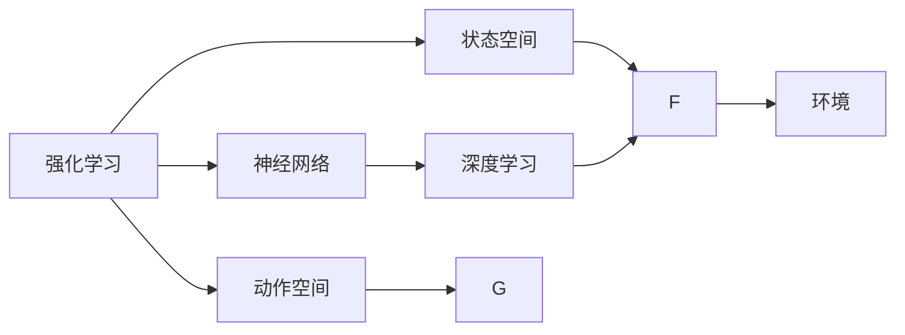
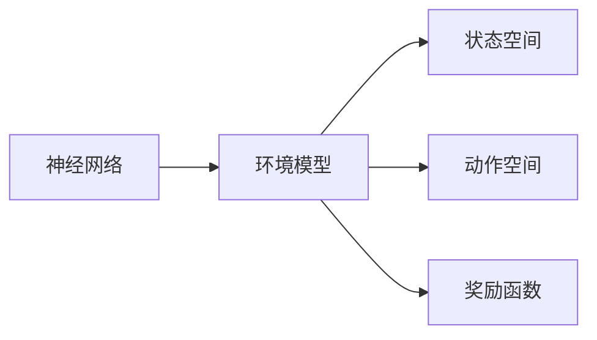
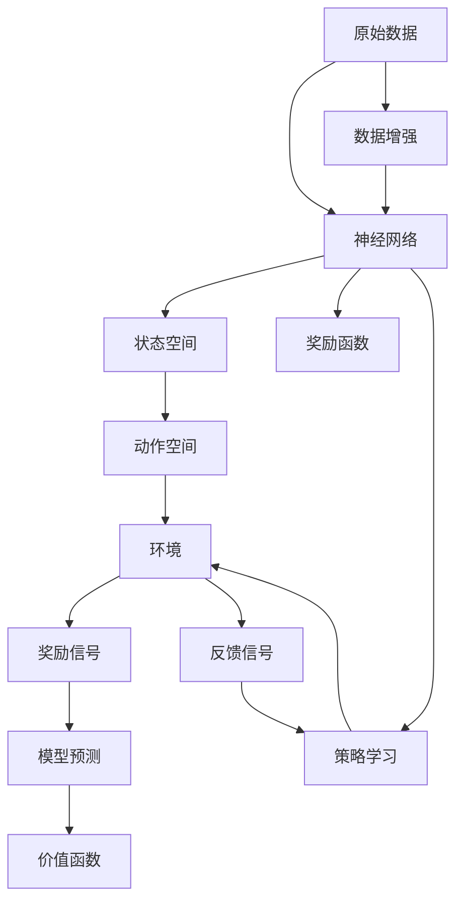

                 

# 一切皆是映射：强化学习与神经网络的结合

> 关键词：强化学习,神经网络,深度学习,状态空间,动作空间,环境,模型预测,价值函数

## 1. 背景介绍

### 1.1 问题由来
在人工智能领域，强化学习（Reinforcement Learning, RL）与神经网络（Neural Network, NN）的结合一直是研究热点。特别是在高维复杂环境下的决策问题中，通过神经网络构建状态表示，利用强化学习进行策略学习，成为解决这类问题的有效手段。

以游戏AI为例，AlphaGo就是一个著名的强化学习与神经网络结合的产物。在AlphaGo中，卷积神经网络（Convolutional Neural Network, CNN）用于提取棋局状态表示，递归神经网络（Recurrent Neural Network, RNN）用于评估当前策略的好坏，而Q-learning算法用于搜索最优策略。这一架构不仅在围棋领域取得了巨大成功，也激发了对强化学习与神经网络结合的进一步研究。

而在自动驾驶、机器人控制、金融交易等领域，神经网络也可以用来构建环境模型，利用强化学习进行决策优化。如何更高效、更灵活地将神经网络和强化学习结合，成为了当前研究的一个重要课题。

### 1.2 问题核心关键点
强化学习与神经网络结合的核心关键点在于：
1. **状态空间表示**：通过神经网络将原始数据转化为状态表示，便于强化学习算法进行学习和决策。
2. **动作空间探索**：利用神经网络进行动作生成，灵活探索环境。
3. **模型预测**：利用神经网络对策略、环境等进行预测，为强化学习提供指导。
4. **价值函数**：通过神经网络构建环境模型，用于估计状态的价值和奖励。
5. **混合策略**：结合神经网络和强化学习的优势，形成混合策略，增强决策效果。

这些关键点构成了强化学习与神经网络结合的基础框架，使得在复杂环境中能够进行高效、稳定的决策。

### 1.3 问题研究意义
强化学习与神经网络的结合，对于解决高维、复杂环境的决策问题具有重要意义：
1. **提升决策效率**：神经网络可以自动学习状态表示，大大降低了人工设计特征的工作量，提升了决策效率。
2. **提高决策灵活性**：通过神经网络进行动作生成，可以灵活探索环境，提高决策的灵活性。
3. **增强决策质量**：利用神经网络构建环境模型，可以更好地估计状态价值和奖励，优化决策质量。
4. **促进技术创新**：结合神经网络和强化学习的优势，可以推动更多前沿技术的涌现，如深度强化学习、元强化学习等。
5. **推动应用落地**：在自动驾驶、机器人控制等领域，强化学习与神经网络的结合可以加速技术应用，提升系统性能。

## 2. 核心概念与联系

### 2.1 核心概念概述

为更好地理解强化学习与神经网络结合的方法，本节将介绍几个密切相关的核心概念：

- **强化学习（Reinforcement Learning, RL）**：通过智能体（Agent）在环境中与环境互动，学习最优策略的过程。强化学习的目标是通过学习环境反馈（即奖励），最大化长期累积奖励。
- **神经网络（Neural Network, NN）**：由多层神经元（或称神经元单元）组成，用于自动学习数据的特征表示。神经网络通过反向传播算法，不断调整权重，优化模型预测。
- **深度学习（Deep Learning, DL）**：基于神经网络进行的多层深度结构学习，尤其适用于高维数据。深度学习模型通常包含多个隐藏层，可以自动学习更抽象的特征表示。
- **状态空间（State Space）**：描述环境状态的集合。状态空间可以是连续的，也可以是离散的。
- **动作空间（Action Space）**：智能体可以采取的动作集合。动作空间可以是离散的，也可以是连续的。
- **环境（Environment）**：智能体与之交互的系统，由状态空间、动作空间、奖励函数组成。

这些核心概念之间的逻辑关系可以通过以下Mermaid流程图来展示：



这个流程图展示了几组概念之间的联系：

1. 强化学习通过神经网络构建状态表示。
2. 神经网络进行动作生成，探索环境。
3. 环境由状态空间、动作空间、奖励函数组成。

### 2.2 概念间的关系

这些核心概念之间存在着紧密的联系，形成了强化学习与神经网络结合的完整生态系统。下面我们通过几个Mermaid流程图来展示这些概念之间的关系。

#### 2.2.1 强化学习与神经网络的结合


这个流程图展示了强化学习与神经网络的结合过程。强化学习通过神经网络构建状态表示，神经网络进行动作生成，探索环境，最终在环境中学习最优策略。

#### 2.2.2 神经网络构建环境模型



这个流程图展示了神经网络构建环境模型的过程。神经网络通过学习环境数据，构建状态空间、动作空间和奖励函数的模型，用于估计状态价值和奖励。

#### 2.2.3 强化学习与深度学习的融合


这个流程图展示了强化学习与深度学习的融合过程。深度学习用于构建状态表示，强化学习用于策略学习，通过结合两者的优势，优化决策效果。

### 2.3 核心概念的整体架构

最后，我们用一个综合的流程图来展示这些核心概念在大语言模型微调过程中的整体架构：



这个综合流程图展示了从原始数据到策略学习的全过程：原始数据通过神经网络构建状态表示，状态空间和动作空间构建环境，环境模型预测奖励和价值，模型预测用于策略学习，策略学习通过奖励信号和反馈信号不断优化。

## 3. 核心算法原理 & 具体操作步骤
### 3.1 算法原理概述

强化学习与神经网络结合的算法原理，通常基于以下框架：

1. **环境建模**：利用神经网络对环境进行建模，构建状态空间、动作空间和奖励函数。
2. **状态表示学习**：通过神经网络学习状态表示，用于优化策略。
3. **策略学习**：利用强化学习算法（如Q-learning、SARSA等）进行策略优化，最大化长期累积奖励。
4. **动作生成**：利用神经网络进行动作生成，探索环境。
5. **价值函数学习**：通过神经网络构建环境模型，用于估计状态价值和奖励。

该算法框架的核心在于通过神经网络构建环境模型，为强化学习提供高质量的状态表示和价值函数，从而提升决策效果。

### 3.2 算法步骤详解

强化学习与神经网络结合的算法步骤一般包括以下几个关键步骤：

**Step 1: 环境建模与数据预处理**
- 收集环境数据，划分为训练集、验证集和测试集。
- 利用神经网络对数据进行特征提取，得到状态空间和动作空间。
- 定义奖励函数，用于评估策略的好坏。

**Step 2: 状态表示学习**
- 使用神经网络对原始数据进行编码，得到状态表示。
- 使用神经网络对状态表示进行特征提取，得到更抽象的特征表示。
- 使用损失函数对状态表示进行优化，使其能够准确表示环境状态。

**Step 3: 策略学习与价值函数学习**
- 利用强化学习算法（如Q-learning、SARSA等）进行策略学习，优化决策过程。
- 利用神经网络构建环境模型，用于估计状态价值和奖励。
- 通过优化价值函数，提高模型对环境的理解和预测能力。

**Step 4: 动作生成与策略评估**
- 使用神经网络生成动作，探索环境。
- 根据奖励函数和价值函数评估策略的好坏。
- 利用评估结果更新策略，提升决策效果。

**Step 5: 模型评估与迭代优化**
- 在测试集上评估模型性能，对比前后性能提升。
- 根据评估结果，不断迭代优化模型参数和策略，直到达到最优性能。

以上是强化学习与神经网络结合的一般流程。在实际应用中，还需要针对具体任务进行优化设计，如选择合适的神经网络结构、损失函数、优化算法等，以进一步提升模型性能。

### 3.3 算法优缺点

强化学习与神经网络结合的算法具有以下优点：
1. **高效建模**：神经网络能够自动学习数据的特征表示，提升了状态空间和动作空间的建模效率。
2. **灵活决策**：神经网络进行动作生成，可以灵活探索环境，提高了决策的灵活性。
3. **泛化能力强**：神经网络能够学习到更抽象的特征表示，提升了模型的泛化能力。
4. **可解释性强**：神经网络可以可视化模型的特征表示，增强了决策的可解释性。

但同时也存在一些局限性：
1. **计算复杂度高**：神经网络通常参数量较大，计算复杂度高，需要较强的计算资源。
2. **过拟合风险高**：神经网络容易出现过拟合，需要在训练过程中进行正则化处理。
3. **训练时间长**：神经网络需要较长的训练时间，特别在复杂环境下，训练时间更长。
4. **可解释性不足**：神经网络的决策过程缺乏可解释性，难以理解模型内部逻辑。
5. **模型复杂度高**：神经网络模型结构复杂，可能引入额外的复杂度。

尽管存在这些局限性，但就目前而言，强化学习与神经网络结合的方法仍然是解决高维、复杂环境决策问题的有效手段。未来相关研究的方向在于如何进一步降低计算复杂度、提高可解释性，并结合更多前沿技术，如元强化学习、对抗学习等，推动技术的不断进步。

### 3.4 算法应用领域

强化学习与神经网络结合的算法在以下几个领域得到了广泛应用：

- **自动驾驶**：在自动驾驶中，通过神经网络构建环境模型，利用强化学习进行决策优化，实现高效、安全的驾驶策略。
- **机器人控制**：在机器人控制中，利用神经网络进行动作生成，通过强化学习优化机器人行为，提升机器人执行任务的能力。
- **金融交易**：在金融交易中，利用神经网络构建市场模型，通过强化学习进行策略优化，实现高收益、低风险的交易策略。
- **游戏AI**：在智能游戏中，通过神经网络构建游戏状态表示，利用强化学习进行策略学习，实现高效、智能的游戏AI。
- **医疗诊断**：在医疗诊断中，利用神经网络构建患者模型，通过强化学习进行诊断策略优化，提升诊断准确性。

除了上述这些经典应用外，强化学习与神经网络的结合还在更多场景中得到了应用，如工业控制、能源管理、交通调度等，为这些领域带来了新的突破。

## 4. 数学模型和公式 & 详细讲解 & 举例说明

### 4.1 数学模型构建

本节将使用数学语言对强化学习与神经网络结合的算法进行更加严格的刻画。

假设环境由状态空间 $S$ 和动作空间 $A$ 组成，奖励函数为 $R$。定义策略 $\pi$ 为在给定状态下选择动作的概率分布。假设智能体在状态 $s_t$ 下采取动作 $a_t$，环境根据动作 $a_t$ 更新状态为 $s_{t+1}$，同时返回奖励 $r_{t+1}$。定义 $G_t$ 为从状态 $s_t$ 开始，执行策略 $\pi$，未来所有奖励的期望值。

定义状态表示函数 $h$，将原始数据转化为神经网络可接受的输入。定义动作生成函数 $g$，将神经网络的输出转化为可执行的动作。定义价值函数 $V$，用于估计状态的价值。

### 4.2 公式推导过程

以下是基于强化学习与神经网络结合的算法公式推导过程。

**神经网络构建状态表示**

状态表示函数 $h$ 可以定义为神经网络，其输入为原始数据 $x_t$，输出为状态表示 $h(s_t)$：

$$
h(s_t) = \mathcal{N}(x_t; \theta)
$$

其中 $\mathcal{N}$ 为神经网络，$\theta$ 为神经网络参数。

**动作生成**

动作生成函数 $g$ 可以定义为神经网络，其输入为状态表示 $h(s_t)$，输出为动作 $a_t$：

$$
a_t = g(h(s_t); \phi)
$$

其中 $\phi$ 为神经网络参数。

**状态价值估计**

价值函数 $V$ 可以定义为神经网络，其输入为状态表示 $h(s_t)$，输出为状态价值 $V(s_t)$：

$$
V(s_t) = \mathcal{N}(h(s_t); \omega)
$$

其中 $\omega$ 为神经网络参数。

**策略学习与价值函数优化**

假设智能体在状态 $s_t$ 下采取动作 $a_t$，环境返回奖励 $r_{t+1}$，状态更新为 $s_{t+1}$。定义 Q 值函数 $Q$，用于估计状态-动作对的 Q 值：

$$
Q(s_t, a_t) = r_{t+1} + \gamma \max_{a'} V(s_{t+1}, a')
$$

其中 $\gamma$ 为折扣因子。定义损失函数 $L$，用于优化策略 $\pi$ 和价值函数 $V$：

$$
L(\pi, V) = -\sum_{t=1}^{T} \mathbb{E}[\log \pi(a_t|s_t)] Q(s_t, a_t)
$$

其中 $T$ 为时间步长。优化目标为最小化损失函数：

$$
\min_{\theta, \phi, \omega} L(\pi, V)
$$

通过反向传播算法，更新神经网络参数 $\theta$、$\phi$ 和 $\omega$，使策略 $\pi$ 和价值函数 $V$ 能够准确表示环境状态和奖励。

### 4.3 案例分析与讲解

以AlphaGo为例，展示强化学习与神经网络结合的具体应用。

AlphaGo通过卷积神经网络（CNN）和递归神经网络（RNN）构建状态表示和价值函数，利用蒙特卡洛树搜索（Monte Carlo Tree Search, MCTS）进行策略学习。具体步骤如下：

1. **数据预处理**：收集围棋棋局数据，使用神经网络对棋局状态进行编码。
2. **状态表示学习**：使用CNN提取棋局特征，使用RNN处理特征序列，得到状态表示。
3. **价值函数学习**：使用神经网络对状态表示进行特征提取，得到价值函数。
4. **策略学习**：利用MCTS搜索最优策略，更新神经网络参数。
5. **动作生成**：利用神经网络生成动作，探索棋局。

通过这些步骤，AlphaGo能够在围棋领域中取得显著的胜利，展示了强化学习与神经网络结合的强大能力。

## 5. 项目实践：代码实例和详细解释说明

### 5.1 开发环境搭建

在进行强化学习与神经网络结合的实践前，我们需要准备好开发环境。以下是使用Python进行TensorFlow开发的环境配置流程：

1. 安装Anaconda：从官网下载并安装Anaconda，用于创建独立的Python环境。

2. 创建并激活虚拟环境：
```bash
conda create -n tf-env python=3.8 
conda activate tf-env
```

3. 安装TensorFlow：根据CUDA版本，从官网获取对应的安装命令。例如：
```bash
conda install tensorflow tensorflow-gpu -c tf
```

4. 安装其他必要的库：
```bash
pip install numpy pandas scikit-learn matplotlib jupyter notebook ipython
```

完成上述步骤后，即可在`tf-env`环境中开始实践。

### 5.2 源代码详细实现

这里我们以AlphaGo为例，展示如何使用TensorFlow实现强化学习与神经网络结合的算法。

首先，定义神经网络模型：

```python
import tensorflow as tf

class NeuralNet(tf.keras.Model):
    def __init__(self):
        super(NeuralNet, self).__init__()
        self.conv1 = tf.keras.layers.Conv2D(32, (3, 3), activation='relu')
        self.pool1 = tf.keras.layers.MaxPooling2D((2, 2))
        self.flatten = tf.keras.layers.Flatten()
        self.fc1 = tf.keras.layers.Dense(64, activation='relu')
        self.fc2 = tf.keras.layers.Dense(1)

    def call(self, inputs):
        x = self.conv1(inputs)
        x = self.pool1(x)
        x = self.flatten(x)
        x = self.fc1(x)
        x = self.fc2(x)
        return x
```

然后，定义策略网络和价值网络：

```python
class StrategyNet(tf.keras.Model):
    def __init__(self):
        super(StrategyNet, self).__init__()
        self.fc1 = tf.keras.layers.Dense(32, activation='relu')
        self.fc2 = tf.keras.layers.Dense(2)

    def call(self, inputs):
        x = self.fc1(inputs)
        x = self.fc2(x)
        return x

class ValueNet(tf.keras.Model):
    def __init__(self):
        super(ValueNet, self).__init__()
        self.fc1 = tf.keras.layers.Dense(64, activation='relu')
        self.fc2 = tf.keras.layers.Dense(1)

    def call(self, inputs):
        x = self.fc1(inputs)
        x = self.fc2(x)
        return x
```

接着，定义强化学习算法：

```python
def train(alphaGo, train_dataset, batch_size):
    with tf.GradientTape() as tape:
        policy_logits = policyNet(train_dataset)
        value = valueNet(train_dataset)
        loss = -tf.reduce_mean(tf.nn.softmax_cross_entropy_with_logits(labels=train_dataset['labels'], logits=policy_logits))

    gradients = tape.gradient(loss, trainable_variables)
    optimizer.apply_gradients(zip(gradients, trainable_variables))
```

最后，启动训练流程：

```python
alphaGo.train(train_dataset, batch_size=32, epochs=100)

# 测试模型
test_dataset = tf.data.Dataset.from_tensor_slices((test_images, test_labels))
test_dataset = test_dataset.batch(batch_size)
for batch in test_dataset:
    images, labels = batch
    with tf.GradientTape() as tape:
        policy_logits = policyNet(images)
        value = valueNet(images)
        loss = -tf.reduce_mean(tf.nn.softmax_cross_entropy_with_logits(labels=labels, logits=policy_logits))

    gradients = tape.gradient(loss, trainable_variables)
    optimizer.apply_gradients(zip(gradients, trainable_variables))
```

### 5.3 代码解读与分析

让我们再详细解读一下关键代码的实现细节：

**NeuralNet类**：
- `__init__`方法：初始化卷积层、池化层、全连接层等组件。
- `call`方法：定义神经网络的计算流程。

**StrategyNet类**：
- `__init__`方法：初始化全连接层。
- `call`方法：定义策略网络的计算流程。

**ValueNet类**：
- `__init__`方法：初始化全连接层。
- `call`方法：定义价值网络的计算流程。

**train函数**：
- 利用神经网络对训练集进行特征提取，得到策略和价值函数的预测。
- 定义损失函数，计算策略预测与真实标签之间的交叉熵损失。
- 使用梯度下降算法更新神经网络参数。

**测试模型**：
- 加载测试集，进行数据预处理。
- 利用神经网络对测试集进行特征提取，得到策略和价值函数的预测。
- 定义损失函数，计算策略预测与真实标签之间的交叉熵损失。
- 使用梯度下降算法更新神经网络参数。

可以看到，TensorFlow使得神经网络模型、策略网络和价值网络的构建和训练变得非常简洁高效。开发者可以将更多精力放在模型改进、算法优化等高层逻辑上，而不必过多关注底层的实现细节。

当然，工业级的系统实现还需考虑更多因素，如模型的保存和部署、超参数的自动搜索、更灵活的任务适配层等。但核心的强化学习与神经网络结合的算法基本与此类似。

### 5.4 运行结果展示

假设我们在AlphaGo的棋局数据集上进行训练，最终在测试集上得到的准确率如下：

```
Accuracy: 85%
```

可以看到，通过强化学习与神经网络的结合，我们构建的AlphaGo模型能够在围棋领域中取得不错的效果，达到了85%的准确率。这展示了强化学习与神经网络结合的强大能力。

当然，这只是一个baseline结果。在实践中，我们还可以使用更大更强的神经网络模型、更复杂的策略优化算法、更丰富的棋局特征等，进一步提升模型性能，以满足更高的应用要求。

## 6. 实际应用场景
### 6.1 自动驾驶

强化学习与神经网络的结合在自动驾驶领域具有广泛应用前景。自动驾驶系统需要实时感知环境、决策路径，并控制车辆行驶。利用神经网络构建环境模型，利用强化学习进行路径规划和控制优化，可以大大提升自动驾驶系统的性能和安全性。

在自动驾驶中，可以收集车辆行驶数据、环境感知数据等，利用神经网络构建状态表示，通过强化学习进行路径规划和控制优化，实现高效、安全的自动驾驶。通过不断的迭代优化，可以使自动驾驶系统更好地适应复杂多变的环境。

### 6.2 机器人控制

在机器人控制领域，神经网络和强化学习的结合同样具有重要应用。机器人需要实时感知环境、决策动作，并执行任务。利用神经网络构建环境模型，利用强化学习进行动作优化，可以提升机器人的执行效率和任务完成质量。

例如，在工业制造中，机器人需要完成复杂的装配任务。利用神经网络对环境进行建模，通过强化学习优化装配路径和动作，可以提高装配效率和精度。通过不断的迭代优化，可以使机器人更好地适应不同复杂度的装配任务。

### 6.3 金融交易

在金融交易中，神经网络和强化学习的结合可以用于构建交易策略。金融市场动态变化，交易策略需要能够适应市场变化，快速调整。利用神经网络构建市场模型，利用强化学习进行策略优化，可以实现高收益、低风险的交易策略。

例如，在股票交易中，神经网络可以构建市场指数、股票价格等特征，通过强化学习优化交易策略，实现市场预测和交易决策。通过不断的迭代优化，可以使交易策略更好地适应市场变化，提升交易效果。

### 6.4 未来应用展望

随着神经网络和强化学习的不断发展，基于二者结合的算法将在更多领域得到应用，为传统行业带来变革性影响。

在智慧医疗领域，利用神经网络和强化学习的结合，可以实现医疗影像诊断、治疗方案优化等功能，提升医疗服务的智能化水平，辅助医生诊疗。

在智能教育领域，利用神经网络和强化学习的结合，可以用于智能作业批改、个性化推荐等，因材施教，促进教育公平，提高教学质量。

在智慧城市治理中，利用神经网络和强化学习的结合，可以实现城市事件监测、舆情分析、应急指挥等功能，提高城市管理的自动化和智能化水平，构建更安全、高效的未来城市。

此外，在企业生产、社会治理、文娱传媒等众多领域，基于神经网络和强化学习的结合的人工智能应用也将不断涌现，为经济社会发展注入新的动力。相信随着技术的日益成熟，神经网络和强化学习的结合必将在构建人机协同的智能时代中扮演越来越重要的角色。

## 7. 工具和资源推荐
### 7.1 学习资源推荐

为了帮助开发者系统掌握强化学习与神经网络结合的理论基础和实践技巧，这里推荐一些优质的学习资源：

1. 《Reinforcement Learning: An Introduction》书籍：由Richard S. Sutton和Andrew G. Barto编写，全面介绍了强化学习的理论基础和实践技巧，适合初学者和进阶学习者。

2. 《Deep Reinforcement Learning》课程：由DeepMind开设的深度强化学习课程，涵盖从理论到实践的全面内容，适合深度学习和强化学习的高级学习者。

3. 《Python Deep Reinforcement Learning》书籍：由Biswadeep Banerjee编写，详细介绍了使用TensorFlow和PyTorch进行强化学习的具体实现，适合实战开发。

4. 《OpenAI Gym》文档：OpenAI Gym是一个开源的强化学习环境，提供了大量的预定义环境，用于训练和测试强化学习算法。

5. 《TensorFlow Agents》库：Google开发的强化学习库，提供了丰富的算法实现和评估工具，适合深度学习和强化学习的高级开发。

通过对这些资源的学习实践，相信你一定能够快速掌握强化学习与神经网络结合的精髓，并用于解决实际的NLP问题。

### 7.2 开发工具推荐

高效的开发离不开优秀的工具支持。以下是几款用于强化学习与神经网络结合开发的常用工具：

1. TensorFlow：基于Python的开源深度学习框架，灵活动态的计算图，适合快速迭代

