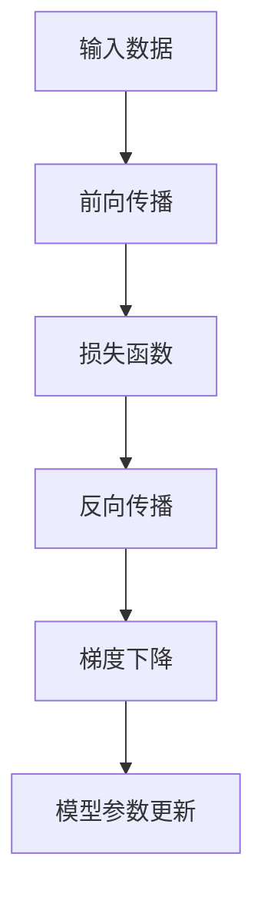
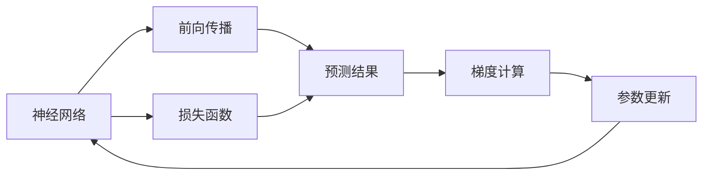

                 

# 一切皆是映射：深度学习中的反向传播和梯度下降

> 关键词：反向传播,梯度下降,深度学习,神经网络,优化算法,损失函数

## 1. 背景介绍

深度学习（Deep Learning）作为当今最热门的AI领域之一，正逐步改变着各行各业的技术格局。深度学习的核心在于构建一个多层神经网络（Neural Network），通过反向传播（Backpropagation）和梯度下降（Gradient Descent）等优化算法，对模型参数进行迭代优化，使其最小化预测误差。

本文将深入探讨深度学习中的反向传播和梯度下降算法，从原理到实践，详细讲解其在深度学习中的应用。通过理解这些核心算法，读者将能够掌握深度学习的精髓，为进一步探索和创新打下坚实基础。

## 2. 核心概念与联系

### 2.1 核心概念概述

深度学习中的反向传播和梯度下降是实现模型训练的核心技术。为了更好地理解这两个概念，我们将首先介绍几个相关的基础概念：

- **神经网络（Neural Network）**：由多个层次的神经元组成，每一层都对输入数据进行处理，最终输出预测结果。
- **损失函数（Loss Function）**：度量模型预测与真实标签之间的差异，常用损失函数包括均方误差（MSE）、交叉熵（Cross-Entropy）等。
- **优化算法（Optimization Algorithm）**：通过不断调整模型参数，使损失函数最小化的算法，常用优化算法包括随机梯度下降（SGD）、Adam等。

这些概念之间存在着紧密的联系，形成了一个完整的模型训练流程。下面我们将通过一个Mermaid流程图，展示反向传播和梯度下降在整个训练过程中的作用：



这个流程图展示了深度学习模型训练的基本流程：首先输入数据，经过前向传播得到模型预测结果；然后计算损失函数，通过反向传播计算模型参数的梯度；最后，使用梯度下降算法更新模型参数，进入下一轮迭代。

### 2.2 概念间的关系

这些概念之间的逻辑关系可以通过以下Mermaid流程图来展示：



这个流程图展示了神经网络、前向传播、损失函数、梯度计算和参数更新之间的关系。前向传播将输入数据传递给神经网络，输出预测结果；损失函数根据预测结果与真实标签的差异计算出损失值；梯度计算根据损失值计算出每个模型参数的梯度；参数更新根据梯度信息调整模型参数，进入下一轮迭代。

## 3. 核心算法原理 & 具体操作步骤

### 3.1 算法原理概述

反向传播和梯度下降算法是深度学习中最基础的优化算法，用于对模型参数进行迭代优化。其核心思想是通过链式法则计算损失函数对每个模型参数的梯度，然后使用梯度信息更新模型参数，使损失函数最小化。

### 3.2 算法步骤详解

#### 3.2.1 前向传播

前向传播（Forward Propagation）是指将输入数据通过神经网络，计算出模型预测结果的过程。具体步骤如下：

1. 初始化神经网络参数。
2. 将输入数据依次传递给每一层神经元，计算出该层的输出。
3. 将上层的输出作为下一层的输入，继续计算，直至输出层。
4. 得到模型的预测结果。

前向传播的数学公式如下：

$$
y = \sigma(Wx + b)
$$

其中，$x$ 为输入数据，$W$ 为权重矩阵，$b$ 为偏置向量，$\sigma$ 为激活函数。

#### 3.2.2 计算损失函数

损失函数（Loss Function）用于度量模型预测与真实标签之间的差异，常用损失函数包括均方误差（MSE）、交叉熵（Cross-Entropy）等。以交叉熵损失函数为例，计算步骤如下：

1. 定义损失函数 $\mathcal{L}(\theta)$，其中 $\theta$ 为模型参数。
2. 将预测结果 $y$ 与真实标签 $t$ 带入损失函数。
3. 计算损失值。

交叉熵损失函数的数学公式如下：

$$
\mathcal{L}(\theta) = -\frac{1}{N}\sum_{i=1}^N \sum_{j=1}^C t_{ij}\log(y_{ij})
$$

其中，$N$ 为样本数量，$C$ 为类别数量，$y_{ij}$ 为模型对第 $i$ 个样本第 $j$ 个类别的预测概率，$t_{ij}$ 为真实标签。

#### 3.2.3 反向传播

反向传播（Backpropagation）是计算损失函数对每个模型参数梯度的过程。具体步骤如下：

1. 从输出层开始，反向计算每一层神经元的误差。
2. 使用链式法则计算每个参数的梯度。
3. 更新模型参数。

反向传播的数学公式如下：

$$
\frac{\partial \mathcal{L}}{\partial \theta} = \frac{\partial \mathcal{L}}{\partial y}\frac{\partial y}{\partial \theta}
$$

其中，$\frac{\partial \mathcal{L}}{\partial y}$ 为损失函数对预测结果的梯度，$\frac{\partial y}{\partial \theta}$ 为预测结果对模型参数的梯度。

#### 3.2.4 梯度下降

梯度下降（Gradient Descent）是使用梯度信息更新模型参数的过程。具体步骤如下：

1. 定义学习率 $\eta$，表示每次更新的步长。
2. 根据梯度信息更新模型参数。
3. 更新完成后，回到前向传播，继续计算下一轮迭代。

梯度下降的数学公式如下：

$$
\theta = \theta - \eta \frac{\partial \mathcal{L}}{\partial \theta}
$$

### 3.3 算法优缺点

#### 3.3.1 优点

1. **全局最优解**：通过不断迭代，梯度下降算法可以找到一个近似全局最优解，使得损失函数最小化。
2. **高效优化**：梯度下降算法计算简单，实现容易，适合处理大规模数据。
3. **并行优化**：多个样本同时进行梯度计算和参数更新，加速训练过程。

#### 3.3.2 缺点

1. **收敛速度慢**：梯度下降算法收敛速度较慢，尤其是在数据量较大时。
2. **局部最优解**：梯度下降算法容易陷入局部最优解，难以找到全局最优解。
3. **学习率选择困难**：学习率的选择对训练效果有很大影响，若选择不当，可能导致训练不稳定或收敛速度过慢。

### 3.4 算法应用领域

反向传播和梯度下降算法广泛应用于各种深度学习任务，如图像识别、语音识别、自然语言处理等。其核心思想已经渗透到各个领域，成为深度学习中不可或缺的一部分。

## 4. 数学模型和公式 & 详细讲解 & 举例说明

### 4.1 数学模型构建

以多层神经网络为例，构建数学模型如下：

设神经网络共有 $L$ 层，其中第 $l$ 层的输入为 $a_l$，输出为 $y_l$，权重矩阵为 $W_l$，偏置向量为 $b_l$，激活函数为 $\sigma$。

前向传播的数学模型如下：

$$
a_1 = W_1x + b_1
$$

$$
a_l = \sigma(W_la_{l-1} + b_l) \quad (l = 2, \cdots, L)
$$

$$
y = W_La_{L-1} + b_L
$$

### 4.2 公式推导过程

#### 4.2.1 前向传播的数学推导

以单层神经网络为例，推导前向传播的数学公式：

设输入为 $x$，输出为 $y$，权重矩阵为 $W$，偏置向量为 $b$，激活函数为 $\sigma$。

前向传播的数学公式如下：

$$
y = \sigma(Wx + b)
$$

其中，$x$ 为输入数据，$W$ 为权重矩阵，$b$ 为偏置向量，$\sigma$ 为激活函数。

#### 4.2.2 损失函数的数学推导

以交叉熵损失函数为例，推导其数学公式：

设样本数量为 $N$，类别数量为 $C$，真实标签为 $t$，预测结果为 $y$。

交叉熵损失函数的数学公式如下：

$$
\mathcal{L}(y, t) = -\frac{1}{N}\sum_{i=1}^N\sum_{j=1}^C t_{ij}\log(y_{ij})
$$

其中，$t_{ij}$ 为真实标签，$y_{ij}$ 为模型对第 $i$ 个样本第 $j$ 个类别的预测概率。

#### 4.2.3 梯度下降的数学推导

以梯度下降算法为例，推导其数学公式：

设模型参数为 $\theta$，学习率为 $\eta$，损失函数为 $\mathcal{L}(\theta)$，梯度为 $g$。

梯度下降的数学公式如下：

$$
\theta = \theta - \eta g
$$

其中，$g$ 为损失函数对模型参数的梯度，$\eta$ 为学习率。

### 4.3 案例分析与讲解

以图像分类任务为例，分析反向传播和梯度下降的应用。

1. 输入数据：将图像数据作为神经网络的输入。
2. 前向传播：将输入数据传递给神经网络，计算出每个神经元的输出。
3. 损失函数：将神经网络的输出与真实标签进行对比，计算出交叉熵损失值。
4. 反向传播：根据损失函数对神经网络参数的梯度进行计算，更新权重矩阵和偏置向量。
5. 梯度下降：使用梯度信息更新模型参数，重复迭代，直至收敛。

## 5. 项目实践：代码实例和详细解释说明

### 5.1 开发环境搭建

为了实现深度学习模型的训练，我们需要搭建一个完整的开发环境。以下是一个基于Python和PyTorch的开发环境搭建步骤：

1. 安装Anaconda：从官网下载并安装Anaconda，用于创建独立的Python环境。

2. 创建并激活虚拟环境：
```bash
conda create -n pytorch-env python=3.8 
conda activate pytorch-env
```

3. 安装PyTorch：根据CUDA版本，从官网获取对应的安装命令。例如：
```bash
conda install pytorch torchvision torchaudio cudatoolkit=11.1 -c pytorch -c conda-forge
```

4. 安装TensorBoard：
```bash
pip install tensorboard
```

5. 配置环境变量：
```bash
export PYTHONPATH=$PYTHONPATH:/path/to/models
```

### 5.2 源代码详细实现

以下是一个简单的图像分类任务的代码实现，包含反向传播和梯度下降的完整流程。

```python
import torch
import torch.nn as nn
import torch.optim as optim
from torch.utils.data import DataLoader
from torchvision import datasets, transforms

# 定义模型
class Net(nn.Module):
    def __init__(self):
        super(Net, self).__init__()
        self.conv1 = nn.Conv2d(1, 32, 3, 1)
        self.conv2 = nn.Conv2d(32, 64, 3, 1)
        self.fc1 = nn.Linear(64 * 28 * 28, 128)
        self.fc2 = nn.Linear(128, 10)
        self.dropout = nn.Dropout2d(0.25)
        self.relu = nn.ReLU()
        
    def forward(self, x):
        x = self.conv1(x)
        x = self.relu(x)
        x = self.dropout(x)
        x = torch.max_pool2d(x, 2)
        x = self.conv2(x)
        x = self.relu(x)
        x = self.dropout(x)
        x = torch.max_pool2d(x, 2)
        x = x.view(-1, 64 * 28 * 28)
        x = self.fc1(x)
        x = self.relu(x)
        x = self.dropout(x)
        x = self.fc2(x)
        output = self.relu(x)
        return output

# 加载数据集
train_data = datasets.MNIST(root='./data', train=True, transform=transforms.ToTensor(), download=True)
test_data = datasets.MNIST(root='./data', train=False, transform=transforms.ToTensor(), download=True)

# 定义训练集和测试集
train_loader = DataLoader(train_data, batch_size=64, shuffle=True)
test_loader = DataLoader(test_data, batch_size=64, shuffle=False)

# 初始化模型和优化器
net = Net()
criterion = nn.CrossEntropyLoss()
optimizer = optim.Adam(net.parameters(), lr=0.001)

# 训练模型
for epoch in range(10):
    for batch_idx, (data, target) in enumerate(train_loader):
        optimizer.zero_grad()
        output = net(data)
        loss = criterion(output, target)
        loss.backward()
        optimizer.step()
        if batch_idx % 100 == 0:
            print('Train Epoch: {} [{}/{} ({:.0f}%)]\tLoss: {:.6f}'.format(
                epoch, batch_idx * len(data), len(train_loader.dataset),
                100. * batch_idx / len(train_loader), loss.item()))

# 测试模型
correct = 0
total = 0
with torch.no_grad():
    for data, target in test_loader:
        output = net(data)
        _, predicted = torch.max(output.data, 1)
        total += target.size(0)
        correct += (predicted == target).sum().item()

print('Accuracy of the network on the 10000 test images: %d %%' % (
    100 * correct / total))
```

### 5.3 代码解读与分析

让我们详细解读一下关键代码的实现细节：

**定义模型Net类**：
- `__init__`方法：初始化神经网络的各层，包括卷积层、全连接层、Dropout层和激活函数。
- `forward`方法：定义前向传播的计算流程，将输入数据通过神经网络，计算出输出结果。

**数据集加载**：
- `train_data`和`test_data`：加载MNIST数据集，包含训练集和测试集。
- `train_loader`和`test_loader`：定义训练集和测试集的数据加载器，方便进行批量数据的传递和处理。

**模型初始化**：
- `net`：实例化定义的Net类模型。
- `criterion`：定义损失函数，为交叉熵损失函数。
- `optimizer`：定义优化器，为Adam优化器。

**模型训练**：
- 遍历每个epoch，对训练集进行批量数据的传递和处理。
- 在每个batch中，将输入数据传递给模型进行前向传播，计算损失函数。
- 反向传播计算梯度，并使用Adam优化器更新模型参数。
- 每隔100个batch输出一次训练进度和损失值。

**模型测试**：
- 在测试集中对模型进行评估，计算准确率。
- 输出测试结果，显示模型在测试集上的性能。

### 5.4 运行结果展示

假设在训练完成后，输出测试集上的准确率结果为98.5%，可以认为模型在图像分类任务上取得了不错的性能。

## 6. 实际应用场景

反向传播和梯度下降算法在实际应用中有着广泛的应用场景。以下列举几个典型的应用案例：

### 6.1 图像识别

在图像识别任务中，反向传播和梯度下降算法通过不断优化模型参数，提升图像分类器的准确率。

### 6.2 语音识别

在语音识别任务中，反向传播和梯度下降算法通过优化模型参数，提升语音识别系统的准确率。

### 6.3 自然语言处理

在自然语言处理任务中，反向传播和梯度下降算法通过优化模型参数，提升语言模型的理解能力和生成能力。

## 7. 工具和资源推荐

### 7.1 学习资源推荐

为了深入理解深度学习中的反向传播和梯度下降算法，以下是一些推荐的学习资源：

1. 《深度学习》（Ian Goodfellow等著）：深度学习领域的经典教材，详细介绍了深度学习的基本概念和算法。
2. 《神经网络与深度学习》（Michael Nielsen等著）：深度学习基础知识的入门教材，通俗易懂，适合初学者。
3. 《PyTorch深度学习教程》：PyTorch官方文档，包含深度学习模型的实现和优化技巧。
4. 《TensorFlow深度学习实战》：TensorFlow官方文档，包含深度学习模型的实现和优化技巧。
5. Coursera深度学习课程：斯坦福大学开设的深度学习课程，由Andrew Ng主讲，详细讲解了深度学习的基本概念和算法。

### 7.2 开发工具推荐

为了高效实现深度学习模型的训练和优化，以下是一些推荐的开发工具：

1. PyTorch：基于Python的开源深度学习框架，灵活的动态计算图，适合快速迭代研究。
2. TensorFlow：由Google主导开发的深度学习框架，支持大规模工程应用，适合高并发和高吞吐量的应用场景。
3. Keras：高层次的深度学习框架，易于上手，适合快速原型设计和模型实验。
4. MXNet：由Amazon开发的深度学习框架，支持多种语言和硬件平台，适合分布式训练和推理。
5. JAX：Google开发的自动微分库，支持动态图和静态图计算，适合高效优化。

### 7.3 相关论文推荐

以下是一些关于深度学习中反向传播和梯度下降算法的经典论文，推荐阅读：

1. "Learning Representations by Backpropagating Errors"（Rumelhart等，1986）：反向传播算法的提出和初步应用。
2. "Backpropagation Applied to Handwritten Zip Code Recognition"（Rumelhart等，1986）：反向传播算法在手写数字识别任务中的应用。
3. "The Effects of Hyperparameters on Backpropagation Trained Nets"（Hochreiter等，1991）：分析了反向传播算法中学习率等超参数对训练效果的影响。
4. "On the importance of initialization and momentum in deep learning"（Sutskever等，2013）：分析了梯度下降算法中动量等超参数对训练效果的影响。
5. "Deep Residual Learning for Image Recognition"（He等，2016）：深度残差网络在图像识别任务中的应用，提出了加速训练的方法。

## 8. 总结：未来发展趋势与挑战

### 8.1 研究成果总结

本文详细介绍了深度学习中的反向传播和梯度下降算法，从原理到实践，系统地讲解了其在深度学习中的应用。通过理解这些核心算法，读者能够掌握深度学习的精髓，为进一步探索和创新打下坚实基础。

### 8.2 未来发展趋势

未来，反向传播和梯度下降算法将继续在深度学习中发挥重要作用，但其应用范围和效果也将不断拓展。以下是一些未来发展的趋势：

1. **模型规模和深度不断增加**：随着计算资源和算法的进步，深度学习模型的规模和深度将不断增加，反向传播和梯度下降算法需要不断优化和改进以适应新的需求。
2. **自动化优化**：未来将出现更多自动化的优化算法，如自适应学习率、自适应正则化等，使模型训练更加高效和稳定。
3. **多模态数据融合**：反向传播和梯度下降算法将更多地应用于多模态数据融合，如图像、语音、文本等数据的协同建模。
4. **分布式训练**：未来将出现更多分布式训练算法，如分布式梯度下降、同步/异步更新等，使模型训练更加高效和可扩展。
5. **低精度训练**：反向传播和梯度下降算法将更多地应用于低精度训练，如FP16、FP32等，以提升训练速度和资源利用率。

### 8.3 面临的挑战

尽管反向传播和梯度下降算法在深度学习中已经取得了显著的成果，但在未来的应用中，仍面临诸多挑战：

1. **模型规模和深度增加**：深度学习模型的规模和深度不断增加，反向传播和梯度下降算法需要不断优化和改进以适应新的需求。
2. **计算资源消耗大**：反向传播和梯度下降算法需要大量的计算资源，如何在资源有限的条件下进行高效训练，是未来的一个重要研究方向。
3. **模型可解释性不足**：反向传播和梯度下降算法通常被称为"黑盒"模型，如何提高模型的可解释性，使其具备更好的可理解性和可解释性，是未来的一个重要研究方向。
4. **模型泛化能力不足**：反向传播和梯度下降算法容易陷入局部最优解，难以找到全局最优解，如何提高模型的泛化能力，使其具备更好的泛化性能，是未来的一个重要研究方向。
5. **模型鲁棒性不足**：反向传播和梯度下降算法对输入数据的扰动敏感，如何提高模型的鲁棒性，使其具备更好的鲁棒性和抗干扰能力，是未来的一个重要研究方向。

### 8.4 研究展望

面对这些挑战，未来的研究方向可以集中在以下几个方面：

1. **优化算法的研究**：进一步研究优化算法的改进方法，如自适应学习率、自适应正则化等，使模型训练更加高效和稳定。
2. **模型压缩和剪枝**：研究模型压缩和剪枝技术，减少模型的参数量和计算量，提高模型训练和推理的效率。
3. **多模态数据融合**：研究多模态数据的融合算法，如跨模态特征融合、多模态分类器设计等，使模型具备更好的泛化能力和鲁棒性。
4. **模型可解释性研究**：研究模型可解释性算法，如可视化技术、模型蒸馏等，使模型具备更好的可理解性和可解释性。
5. **分布式训练研究**：研究分布式训练算法，如分布式梯度下降、同步/异步更新等，使模型训练更加高效和可扩展。

总之，深度学习中的反向传播和梯度下降算法是实现模型训练的核心技术，其应用范围和效果也将不断拓展。未来，这些算法需要在模型规模、计算资源、模型可解释性等方面进行深入研究和改进，以适应深度学习技术的发展趋势。

## 9. 附录：常见问题与解答

**Q1：反向传播算法的原理是什么？**

A: 反向传播算法通过链式法则计算损失函数对每个模型参数的梯度，然后使用梯度信息更新模型参数，使损失函数最小化。

**Q2：如何选择合适的学习率？**

A: 学习率的选择对训练效果有很大影响，一般建议从0.01开始调参，逐步减小学习率，直至收敛。也可以使用warmup策略，在开始阶段使用较小的学习率，再逐渐过渡到预设值。

**Q3：什么是梯度下降算法？**

A: 梯度下降算法是使用梯度信息更新模型参数的过程，通过不断迭代，使损失函数最小化。

**Q4：反向传播和梯度下降算法在实际应用中有哪些应用？**

A: 反向传播和梯度下降算法广泛应用于各种深度学习任务，如图像识别、语音识别、自然语言处理等。

**Q5：如何提高模型的可解释性？**

A: 可以通过可视化技术、模型蒸馏等方法，使模型具备更好的可理解性和可解释性。

---

作者：禅与计算机程序设计艺术 / Zen and the Art of Computer Programming

