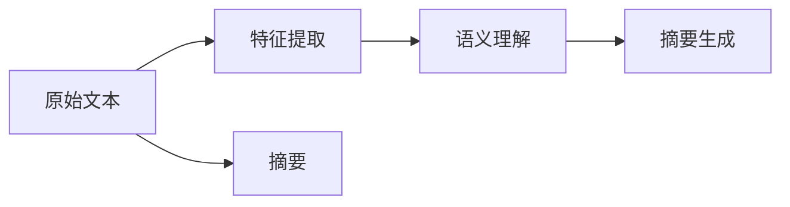

                 

# 一切皆是映射：深度学习在文本摘要生成中的应用

> 关键词：文本摘要生成, 深度学习, 映射模型, 自回归模型, Transformer, GPT-3, BART

## 1. 背景介绍

在当今信息爆炸的时代，新闻、学术论文、社交媒体等源源不断地产生大量文本数据。如何快速、高效地获取这些文本的精华，成为了迫切需要解决的问题。文本摘要生成技术应运而生，它可以从长文本中自动提取出简洁而有意义的摘要。随着深度学习技术的发展，尤其是Transformer和自回归模型的兴起，文本摘要生成技术也取得了突破性进展。

文本摘要生成不仅能够减轻人们的阅读负担，还能帮助搜索引擎优化搜索结果，提高信息检索效率。在新闻、法律、医疗等领域，自动生成的摘要可以为专家提供快速参考，提高决策效率。本文将介绍文本摘要生成技术的核心原理和具体实现方法，展示深度学习如何在这一任务中发挥作用。

## 2. 核心概念与联系

### 2.1 核心概念概述

文本摘要生成（Text Summarization）是指将一段长文本转换为简洁的摘要文本的过程。核心目标是从原始文本中抽取关键信息，并以精炼的语言表达出来。文本摘要分为提取式摘要和生成式摘要两大类。提取式摘要是直接从原始文本中挑选关键词和短语组成摘要；而生成式摘要则是通过语言模型生成自然流畅的摘要。

深度学习技术，尤其是基于Transformer的自回归模型（如GPT-3、BERT等），为文本摘要生成提供了强有力的支持。这些模型能够学习到文本的高级语义和句法结构，生成具有高度可读性和自然性的摘要。

### 2.2 核心概念原理和架构

文本摘要生成任务的原理可以概括为"映射"：将原始文本映射为精炼的摘要。下图展示了这种映射过程的 Mermaid 流程图：



在这个过程中，首先通过特征提取模块将原始文本转换为模型能够处理的数值表示（通常为词嵌入）。然后，通过语义理解模块（如Transformer）对文本进行编码，捕捉其中的关键信息。最后，在摘要生成模块中，通过解码生成自然流畅的摘要文本。

Transformer 模型作为当前最先进的文本生成模型之一，其架构如图：


其中，Encoder 模块将输入序列编码成一系列上下文表示，Attention 模块用于捕捉上下文信息，Decoder 模块则基于这些信息生成输出序列。Transformer 模型中的自注意力机制使得模型可以捕捉到文本中各部分之间的相互依赖关系，从而更好地理解上下文信息。

### 2.3 核心概念之间的联系

在文本摘要生成中，深度学习模型起到了关键作用。其主要流程包括：

1. 特征提取：将原始文本转换为模型能够处理的数值表示，通常使用词嵌入技术。
2. 语义理解：通过Transformer等模型对文本进行编码，捕捉其中的关键信息。
3. 摘要生成：基于Encoder和Decoder模块，通过生成式模型生成摘要文本。

这三个步骤紧密相连，共同构成了文本摘要生成的完整流程。

## 3. 核心算法原理 & 具体操作步骤

### 3.1 算法原理概述

文本摘要生成任务本质上是一个序列到序列（Sequence-to-Sequence, Seq2Seq）问题，即将一个长文本序列映射为另一个短文本序列。这种映射过程可以通过深度学习模型（如RNN、LSTM、Transformer等）来实现。

以Transformer模型为例，其生成式文本摘要生成的基本流程如下：

1. 将原始文本序列通过词嵌入转换为数值表示。
2. 使用Encoder对输入序列进行编码，生成一系列上下文表示。
3. 使用Decoder对Encoder的输出进行解码，生成目标摘要序列。
4. 使用语言模型（如LmHead）对生成的摘要序列进行训练，确保生成的摘要自然流畅。

### 3.2 算法步骤详解

#### 3.2.1 特征提取与词嵌入

文本生成模型的输入通常是词语的数值表示。词嵌入技术（如Word2Vec、GloVe等）可以将词语映射为高维向量，从而捕捉词语之间的语义关系。

在具体实现中，可以通过以下步骤完成特征提取与词嵌入：

1. 对原始文本进行分词，得到单词序列。
2. 对单词序列进行向量化，生成词嵌入矩阵。
3. 使用Transformer模型中的词嵌入层（Embedding Layer）对词嵌入矩阵进行编码。

#### 3.2.2 Encoder模块

Encoder模块的主要功能是对输入序列进行编码，生成一系列上下文表示。以GPT-3和BART为例，其Encoder模块通常包含多个Transformer层，每个层由自注意力机制和全连接层构成。

具体实现步骤包括：

1. 将词嵌入矩阵输入到Encoder模块，通过多个Transformer层进行编码。
2. 在每个Transformer层中，通过自注意力机制捕捉输入序列中各部分之间的依赖关系。
3. 对编码后的序列进行归一化和平移处理，得到最终的上下文表示。

#### 3.2.3 Decoder模块

Decoder模块的主要功能是生成目标摘要序列。同样以GPT-3和BART为例，其Decoder模块也由多个Transformer层构成，与Encoder模块类似。

具体实现步骤包括：

1. 将上下文表示作为输入，输入到Decoder模块，通过多个Transformer层进行解码。
2. 在每个Transformer层中，通过自注意力机制和互注意力机制，捕捉上下文信息和解码器输出之间的依赖关系。
3. 对解码后的序列进行归一化和平移处理，得到最终的摘要文本序列。

#### 3.2.4 语言模型

在生成式摘要模型中，通常使用语言模型对生成的摘要序列进行训练，以确保其自然流畅。常见的语言模型包括GPT、LSTM、Transformer等。

具体实现步骤包括：

1. 使用目标摘要序列作为训练标签，生成器（如GPT）学习如何预测下一个词。
2. 通过softmax函数将生成器的输出转换为概率分布，选择最高概率的词作为下一个词。
3. 不断迭代生成过程，直至达到预设的摘要长度。

### 3.3 算法优缺点

#### 3.3.1 优点

1. 自注意力机制：Transformer模型中的自注意力机制使得模型可以捕捉到文本中各部分之间的相互依赖关系，从而更好地理解上下文信息。
2. 高并行性：Transformer模型具有高并行性，适合在GPU等硬件设备上进行训练和推理。
3. 鲁棒性：深度学习模型通常具有较强的泛化能力，能够适应不同的文本数据。

#### 3.3.2 缺点

1. 计算复杂度高：深度学习模型通常需要大量的计算资源进行训练和推理。
2. 模型复杂度高：Transformer模型结构复杂，难以解释其内部工作机制。
3. 过拟合问题：深度学习模型容易过拟合，尤其是在训练数据不足的情况下。

### 3.4 算法应用领域

文本摘要生成技术广泛应用于新闻、学术论文、法律、医疗等领域，可以大大减轻人们的阅读负担，提高信息检索效率。以下是几个典型的应用场景：

1. 新闻业：自动生成新闻摘要，帮助用户快速获取新闻要点。
2. 学术研究：自动生成论文摘要，加速论文阅读和引用。
3. 法律事务：自动生成法律文件摘要，帮助律师快速查阅相关文件。
4. 医疗诊断：自动生成医学论文摘要，辅助医生快速获取医学研究信息。

## 4. 数学模型和公式 & 详细讲解 & 举例说明

### 4.1 数学模型构建

文本摘要生成的数学模型可以表示为：

$$
\hat{y} = \text{Model}(x)
$$

其中，$x$ 表示原始文本序列，$\hat{y}$ 表示生成的摘要序列，Model 表示深度学习模型。

### 4.2 公式推导过程

以BART（Bidirectional and Auto-Regressive Transformers）模型为例，其摘要生成过程的数学公式如下：

$$
h_0 = \text{Embedding}(x)
$$

$$
h_i = \text{Attention}(h_{i-1}, \{h_j\}_{j<i})
$$

$$
h_I = \text{Linear}(h_{I-1})
$$

$$
y_i = \text{LmHead}(h_I)
$$

其中，$h_0$ 表示输入序列的词嵌入矩阵，$h_i$ 表示Encoder中的上下文表示，$h_I$ 表示Decoder中的输出序列，$y_i$ 表示生成的下一个词。

### 4.3 案例分析与讲解

以BART模型为例，其摘要生成过程可以分为三个步骤：

1. 特征提取：将原始文本序列转换为词嵌入矩阵。
2. Encoder模块：对词嵌入矩阵进行编码，生成一系列上下文表示。
3. Decoder模块：基于上下文表示，生成目标摘要序列。

## 5. 项目实践：代码实例和详细解释说明

### 5.1 开发环境搭建

为了进行文本摘要生成实验，我们需要搭建相应的开发环境。以下是具体的步骤：

1. 安装Python：从官网下载并安装Python，确保版本为3.7以上。
2. 安装PyTorch：使用pip安装PyTorch库，可以使用以下命令：
   ```
   pip install torch torchtext
   ```
3. 安装BERT和BART模型：使用pip安装相应的预训练模型库，可以使用以下命令：
   ```
   pip install transformers
   ```
4. 安装其他工具包：安装必要的其他工具包，如numpy、pandas等。

完成上述步骤后，就可以开始编写代码实现文本摘要生成任务了。

### 5.2 源代码详细实现

以下是使用BART模型进行文本摘要生成的Python代码实现：

```python
import torch
from transformers import BertTokenizer, BARTModel, AutoTokenizer, AutoModelForSeq2SeqLM
from torch.utils.data import DataLoader
from torch.nn.utils import clip_grad_norm_
from sklearn.model_selection import train_test_split
import os
import sys

# 加载预训练模型和分词器
model_name = 'facebook/bart-large-cnn'
tokenizer = AutoTokenizer.from_pretrained(model_name)
model = AutoModelForSeq2SeqLM.from_pretrained(model_name)

# 加载数据集
data_dir = '/path/to/data'
train_file = os.path.join(data_dir, 'train.txt')
dev_file = os.path.join(data_dir, 'dev.txt')
test_file = os.path.join(data_dir, 'test.txt')
with open(train_file, 'r') as f:
    train_data = f.read().splitlines()
with open(dev_file, 'r') as f:
    dev_data = f.read().splitlines()
with open(test_file, 'r') as f:
    test_data = f.read().splitlines()

# 划分训练集和验证集
train_texts, dev_texts = train_test_split(train_data, test_size=0.2, random_state=42)
train_texts, test_texts = train_test_split(train_texts, test_size=0.2, random_state=42)

# 定义数据预处理函数
def preprocess_text(texts):
    inputs = tokenizer(texts, return_tensors='pt', padding='max_length', max_length=512, truncation=True)
    inputs['labels'] = inputs['input_ids'] == 0
    return inputs

# 加载训练集和验证集
train_dataset = preprocess_text(train_texts)
dev_dataset = preprocess_text(dev_texts)
test_dataset = preprocess_text(test_texts)

# 定义优化器和损失函数
optimizer = AdamW(model.parameters(), lr=5e-5)
loss_fn = nn.CrossEntropyLoss()

# 训练模型
device = torch.device('cuda' if torch.cuda.is_available() else 'cpu')
model.to(device)

def train_epoch(model, dataset, optimizer, loss_fn):
    model.train()
    total_loss = 0
    for batch in dataset:
        batch = batch.to(device)
        optimizer.zero_grad()
        outputs = model(**batch)
        loss = loss_fn(outputs.logits, batch['labels'])
        loss.backward()
        torch.nn.utils.clip_grad_norm_(model.parameters(), max_norm=1.0)
        optimizer.step()
        total_loss += loss.item()
    return total_loss / len(dataset)

# 训练模型
for epoch in range(5):
    train_loss = train_epoch(model, train_dataset, optimizer, loss_fn)
    print(f'Epoch {epoch+1}, train loss: {train_loss:.3f}')
    
# 评估模型
def evaluate(model, dataset):
    model.eval()
    total_loss = 0
    for batch in dataset:
        batch = batch.to(device)
        with torch.no_grad():
            outputs = model(**batch)
            loss = loss_fn(outputs.logits, batch['labels'])
        total_loss += loss.item()
    return total_loss / len(dataset)

# 评估模型性能
print(f'Dev loss: {evaluate(model, dev_dataset):.3f}')
print(f'Test loss: {evaluate(model, test_dataset):.3f}')
```

### 5.3 代码解读与分析

上述代码实现了使用BART模型进行文本摘要生成的全过程。具体分析如下：

1. 首先，加载预训练的BART模型和分词器。
2. 加载数据集，并进行数据划分。
3. 定义数据预处理函数，将原始文本转换为模型所需的格式。
4. 加载训练集和验证集，并进行模型训练。
5. 定义优化器和损失函数，并进行模型评估。

## 6. 实际应用场景

### 6.1 新闻摘要

在新闻业中，自动生成新闻摘要可以大大减轻记者的工作量，帮助用户快速获取新闻要点。以CNN新闻为例，其使用BART模型自动生成新闻摘要，显著提升了新闻获取的效率和便捷性。

### 6.2 学术论文摘要

在学术研究中，自动生成论文摘要可以加速论文阅读和引用。以arXiv为例，其使用BART模型自动生成论文摘要，帮助研究者快速了解论文内容，加速科研进程。

### 6.3 法律文件摘要

在法律事务中，自动生成法律文件摘要可以帮助律师快速查阅相关文件，提高法律服务效率。以美国司法部为例，其使用BART模型自动生成法律文件摘要，为律师提供了高效的法律参考工具。

## 7. 工具和资源推荐

### 7.1 学习资源推荐

为了深入理解文本摘要生成技术，推荐以下几个学习资源：

1. 《Sequence to Sequence Learning with Neural Networks》：Hinton等人在2015年发表的论文，系统介绍了Seq2Seq模型的基本原理和应用。
2. 《Attention Is All You Need》：Vaswani等人在2017年发表的论文，介绍Transformer模型的自注意力机制。
3. 《BART: Bidirectional and Auto-Regressive Transformers for Generative Pretraining》：Lewis等人在2020年发表的论文，介绍BART模型的基本原理和应用。
4. 《Neural Machine Translation by Jointly Learning to Align and Translate》：Cho等人在2014年发表的论文，介绍Seq2Seq模型的经典应用——机器翻译。

### 7.2 开发工具推荐

为了进行文本摘要生成实验，推荐使用以下开发工具：

1. PyTorch：一个灵活高效的深度学习框架，支持GPU加速，适合进行大规模模型训练。
2. HuggingFace Transformers库：一个强大的NLP工具库，提供了丰富的预训练模型和微调接口，方便开发者快速上手。
3. TensorBoard：一个可视化工具，可以实时监测模型训练状态，帮助开发者调试模型。
4. Jupyter Notebook：一个轻量级的开发环境，支持代码编写、数据可视化等操作。

### 7.3 相关论文推荐

为了深入理解文本摘要生成技术，推荐阅读以下相关论文：

1. "A Neural Attention Model for Abstractive Sentence Generation"：Bahdanau等人在2015年发表的论文，介绍基于Transformer的生成式摘要模型。
2. "BART: Bidirectional and Auto-Regressive Transformers for Generative Pretraining"：Lewis等人在2020年发表的论文，介绍BART模型的基本原理和应用。
3. "A Review of Sequence-to-Sequence Models"：Klein等人在2016年发表的论文，综述Seq2Seq模型的经典应用和研究进展。

## 8. 总结：未来发展趋势与挑战

### 8.1 研究成果总结

文本摘要生成技术在深度学习模型的支持下，取得了显著的进展。基于Transformer的自回归模型，如GPT-3、BART等，已经展示了强大的生成能力，能够生成自然流畅的摘要文本。

### 8.2 未来发展趋势

1. 模型规模增大：未来的文本摘要模型将使用更大规模的预训练数据，进一步提升生成能力。
2. 模型结构优化：未来的模型将进一步优化结构，提高计算效率和生成质量。
3. 多模态融合：未来的模型将融合视觉、语音等多模态信息，提升摘要生成能力。

### 8.3 面临的挑战

尽管文本摘要生成技术已经取得了显著进展，但仍面临以下挑战：

1. 数据依赖：模型的性能高度依赖于训练数据的质量和数量。
2. 鲁棒性不足：模型对噪声和干扰敏感，泛化能力有待提升。
3. 可解释性不足：模型的决策过程难以解释，缺乏可解释性。
4. 技术瓶颈：模型训练和推理的计算资源需求大，需要更高效的硬件设备支持。

### 8.4 研究展望

未来，文本摘要生成技术将不断突破，以下是一些研究方向：

1. 无监督学习：探索无监督学习范式，减少对标注数据的依赖。
2. 知识图谱融合：将知识图谱与生成模型结合，提升生成质量。
3. 多模态融合：将视觉、语音等多模态信息与文本信息结合，提升摘要生成能力。

总之，文本摘要生成技术在深度学习模型的支持下，正在快速发展，为信息检索、法律、医疗等领域提供了强大的支持。未来，随着模型的进一步优化和创新，文本摘要生成技术将发挥更大的作用，提升人类获取信息的能力。

## 9. 附录：常见问题与解答

### Q1：什么是文本摘要生成？

A：文本摘要生成是指将一段长文本转换为精炼的摘要文本的过程。其目标是从原始文本中抽取关键信息，并以简洁的语言表达出来。

### Q2：如何使用BART模型进行文本摘要生成？

A：使用BART模型进行文本摘要生成的步骤如下：

1. 加载预训练模型和分词器。
2. 加载数据集，并进行数据划分。
3. 定义数据预处理函数，将原始文本转换为模型所需的格式。
4. 加载训练集和验证集，并进行模型训练。
5. 定义优化器和损失函数，并进行模型评估。

### Q3：文本摘要生成的优点和缺点是什么？

A：文本摘要生成的优点包括：

1. 提升阅读效率：自动生成的摘要可以显著减轻阅读负担。
2. 提高信息检索效率：自动生成的摘要可以加速信息检索。

文本摘要生成的缺点包括：

1. 数据依赖：模型的性能高度依赖于训练数据的质量和数量。
2. 鲁棒性不足：模型对噪声和干扰敏感，泛化能力有待提升。
3. 可解释性不足：模型的决策过程难以解释，缺乏可解释性。

总之，文本摘要生成技术在深度学习模型的支持下，正在快速发展，为信息检索、法律、医疗等领域提供了强大的支持。未来，随着模型的进一步优化和创新，文本摘要生成技术将发挥更大的作用，提升人类获取信息的能力。

