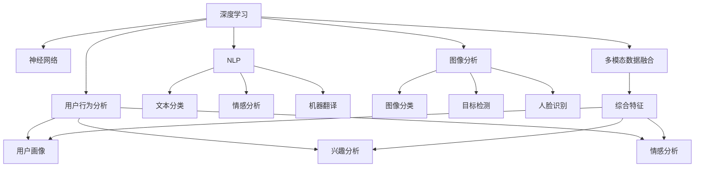

                 

# 一切皆是映射：深度学习在社交媒体数据分析中的应用

> 关键词：社交媒体,深度学习,神经网络,数据分析,自然语言处理(NLP),图像分析,用户行为分析

## 1. 背景介绍

### 1.1 问题由来
随着互联网的普及和社交媒体的兴起，全球用户数量急剧增长，社交平台每天生成海量数据。这些数据包含有丰富的用户行为和社交关系信息，如用户发布的帖文、图片、视频，与好友和群组的互动等。利用深度学习技术，特别是神经网络(Neural Network)模型，可以从海量社交数据中提取有用的信息，为社交媒体平台和广告商提供精准的用户画像、舆情分析、内容推荐等高效服务。

社交媒体数据分析成为各研究机构和公司竞相投入的领域。如Twitter使用深度学习技术分析用户情感，发现舆情热点；Facebook利用深度学习模型进行用户行为分析，个性化推荐内容；Instagram通过深度学习分析图像数据，为内容创作者提供智能化的内容推荐和广告投放服务。

### 1.2 问题核心关键点
深度学习在社交媒体数据分析中的应用涉及多个关键点，包括：
1. 大规模数据集处理：社交媒体每天生成海量的数据，如何快速高效地处理这些数据，提取关键信息，是应用深度学习的首要问题。
2. 数据类型多样性：社交媒体数据既包含文本数据，也包括图像、视频等，如何统一处理多种类型的数据，是应用深度学习需要解决的重要问题。
3. 多模态信息融合：社交媒体中包含了丰富的多模态信息，如图像、文字、音频等，如何综合利用这些信息，提取有价值的用户画像，是应用深度学习的重要挑战。
4. 用户隐私保护：社交媒体数据涉及用户隐私，如何在数据分析中保护用户隐私，是应用深度学习的重要原则。
5. 实时分析能力：社交媒体需要实时分析用户的最新动态，以便提供动态内容推荐和即时互动服务，这对深度学习模型的实时性提出了高要求。

深度学习的应用需要在大规模数据处理、多模态信息融合、用户隐私保护和实时分析等方面取得突破。

### 1.3 问题研究意义
深度学习在社交媒体数据分析中的应用，对于推动社交媒体平台智能化发展，提升用户体验和广告投放效果，具有重要意义：
1. 提升用户交互体验：深度学习可以分析用户历史行为，预测用户未来行为，使社交媒体平台能够更准确地推荐内容，优化用户界面，提高用户互动效率。
2. 优化广告投放效果：深度学习可以分析用户行为特征，识别潜在客户群体，优化广告投放策略，提高广告点击率和转化率。
3. 发现舆情热点：深度学习可以分析大量用户评论和舆情信息，识别出社会关注的热点话题，协助政府和企业及时响应和处理。
4. 推动智能内容创作：深度学习可以分析用户偏好和行为，为内容创作者提供精准的用户画像和内容推荐，推动高质量内容的产出。

深度学习在社交媒体数据分析中的应用，正在重塑社交媒体平台的运营模式和用户行为，带来全新的机遇和挑战。

## 2. 核心概念与联系

### 2.1 核心概念概述

为了深入理解深度学习在社交媒体数据分析中的应用，我们首先介绍几个核心概念：

- 深度学习：一种基于多层神经网络的学习范式，通过对多层次特征的提取，逐步提高模型的复杂度和泛化能力。
- 神经网络：深度学习的核心模型，由多层神经元连接而成，每个神经元接收前一层的输入，输出传递给下一层，通过反向传播算法不断调整网络权重。
- 自然语言处理（NLP）：深度学习在文本数据分析中的应用，利用神经网络模型进行文本分类、情感分析、机器翻译等任务。
- 图像分析：深度学习在图像处理中的应用，利用神经网络模型进行图像分类、目标检测、人脸识别等任务。
- 用户行为分析：利用深度学习模型对社交媒体平台的用户行为数据进行分析，提取用户偏好、兴趣、情感等信息。
- 多模态数据融合：在社交媒体数据中，不同模态的数据（如文本、图像、音频等）同时存在，深度学习通过融合这些数据，提取更为丰富、全面的用户信息。

这些概念之间存在紧密的联系，形成了一个完整的深度学习在社交媒体数据分析中的应用框架。

### 2.2 概念间的关系

以上核心概念之间的关系可以通过以下Mermaid流程图来展示：



这个流程图展示了深度学习在社交媒体数据分析中的多个应用，包括NLP、图像分析、用户行为分析以及多模态数据融合等。这些应用通过神经网络模型进行实现，并在各个领域产生不同的效果。

## 3. 核心算法原理 & 具体操作步骤

### 3.1 算法原理概述

深度学习在社交媒体数据分析中应用的算法原理主要包括：

- 神经网络模型：通过多层神经元逐步提取数据中的特征，从而实现从低级特征到高级特征的映射。
- 多模态特征融合：将不同模态的数据特征进行融合，提升分析效果。
- 自监督学习：利用未标注数据进行模型预训练，提取隐含的特征，提升模型泛化能力。
- 半监督学习：利用少量标注数据和大量未标注数据进行联合学习，提升模型性能。
- 迁移学习：在特定任务上对预训练模型进行微调，提升模型在特定领域的表现。

这些算法原理共同构成了深度学习在社交媒体数据分析中的应用框架。

### 3.2 算法步骤详解

下面详细讲解深度学习在社交媒体数据分析中的操作步骤：

#### 3.2.1 数据预处理

数据预处理是深度学习应用的基础，包括数据清洗、标准化、归一化、分词等。在社交媒体数据分析中，需要处理文本、图像、视频等多种类型的数据，具体步骤如下：

1. 文本数据清洗：去除无意义符号、停用词、特殊字符等噪音，保留有意义的单词和短语。
2. 图像数据清洗：去除低质量、不完整的图像，进行图像增强和去噪处理。
3. 视频数据清洗：去除低质量、模糊的视频片段，提取关键帧和关键信息。
4. 数据标准化：将不同格式的数据标准化为统一格式，便于后续处理。
5. 数据归一化：将数据缩放到0到1之间，便于神经网络训练。
6. 分词和向量化：将文本数据进行分词和向量化，将图像和视频数据进行特征提取，得到模型需要的输入格式。

#### 3.2.2 神经网络模型训练

神经网络模型训练是深度学习应用的核心，包括模型选择、超参数调整、训练过程等。在社交媒体数据分析中，需要选择合适的神经网络模型，并对其进行调整和训练。具体步骤如下：

1. 选择神经网络模型：根据任务类型选择适合的神经网络模型，如卷积神经网络（CNN）、循环神经网络（RNN）、长短期记忆网络（LSTM）等。
2. 调整超参数：调整神经网络的层数、节点数、激活函数等超参数，以适应不同的数据集和任务。
3. 训练模型：使用训练数据集对神经网络模型进行训练，调整模型参数，使其能够更好地拟合数据分布。
4. 评估模型：使用验证数据集对模型进行评估，监测其性能指标，如准确率、精确率、召回率等。
5. 微调模型：使用少量标注数据对预训练模型进行微调，进一步提升模型性能。

#### 3.2.3 多模态特征融合

多模态特征融合是深度学习在社交媒体数据分析中的重要应用，可以综合利用不同模态的信息，提升分析效果。具体步骤如下：

1. 提取单模态特征：分别提取文本、图像、视频等不同模态的特征，包括文本的词向量、图像的特征向量、视频的特征序列等。
2. 特征融合：使用多模态融合方法（如时空卷积、多模态注意力机制等），将不同模态的特征进行融合，得到综合特征。
3. 特征归一化：对融合后的特征进行归一化，使其符合模型要求。

#### 3.2.4 用户行为分析

用户行为分析是深度学习在社交媒体数据分析中的重要应用，可以提取用户行为特征，分析用户偏好和情感等。具体步骤如下：

1. 行为数据收集：收集用户的行为数据，包括点赞、评论、转发等社交互动数据，阅读、观看、浏览等媒体使用数据。
2. 特征提取：从行为数据中提取关键特征，如用户活跃时间、互动频率、兴趣标签等。
3. 用户画像生成：使用神经网络模型对用户行为特征进行建模，生成用户画像。
4. 情感分析：使用NLP模型对用户评论和社交互动数据进行分析，提取用户情感倾向。

### 3.3 算法优缺点

深度学习在社交媒体数据分析中的应用具有以下优点：

1. 处理大规模数据：深度学习能够高效处理大规模数据，提取复杂特征。
2. 提升模型泛化能力：通过多层次特征提取，提升模型的泛化能力，适应不同的数据分布。
3. 多模态信息融合：利用多模态数据融合，提升分析效果，提供更为丰富、全面的用户画像。

同时，深度学习在社交媒体数据分析中也存在以下缺点：

1. 数据依赖性高：深度学习需要大量标注数据进行训练，标注成本较高。
2. 模型复杂度高：深度学习模型参数较多，训练和推理复杂度较高，需要高性能计算资源。
3. 黑箱性质：深度学习模型具有黑箱性质，难以解释其内部决策逻辑。
4. 隐私风险：深度学习模型需要收集大量用户数据，存在隐私泄露的风险。

### 3.4 算法应用领域

深度学习在社交媒体数据分析中的应用领域主要包括：

1. 内容推荐：利用用户行为数据和偏好信息，推荐个性化内容，提升用户满意度。
2. 舆情分析：分析用户评论和社交互动数据，发现舆情热点，及时响应和处理。
3. 广告投放：分析用户行为数据，识别潜在客户群体，优化广告投放策略，提升广告效果。
4. 图像识别：利用深度学习模型进行图像分类、目标检测、人脸识别等，提供智能化的图像分析服务。
5. 智能客服：利用深度学习模型进行对话分析，生成智能回复，提升客服体验。
6. 用户画像：分析用户行为数据和社交数据，生成用户画像，提供精准的用户推荐和广告投放服务。

## 4. 数学模型和公式 & 详细讲解 & 举例说明

### 4.1 数学模型构建

深度学习在社交媒体数据分析中的应用主要基于神经网络模型，利用多层神经元提取多层次特征。下面以文本分类任务为例，构建神经网络模型。

定义神经网络模型为 $M_{\theta}$，其中 $\theta$ 为模型参数，包括权重和偏置。模型输入为 $x \in \mathbb{R}^n$，输出为 $y \in \{0,1\}$，表示分类标签。定义损失函数为交叉熵损失函数：

$$
\mathcal{L}(\theta) = -\frac{1}{N}\sum_{i=1}^N[y_i\log M_{\theta}(x_i)+(1-y_i)\log(1-M_{\theta}(x_i))]
$$

其中 $y_i \in \{0,1\}$ 为真实标签，$M_{\theta}(x_i)$ 为模型输出。

### 4.2 公式推导过程

在神经网络模型中，每个神经元接收前一层的输入，通过激活函数输出。以文本分类任务为例，神经网络模型的前向传播过程如下：

1. 输入层：将文本数据进行分词和向量化，得到输入向量 $x \in \mathbb{R}^n$。
2. 隐藏层：将输入向量通过若干层神经元进行特征提取，得到隐藏向量 $h \in \mathbb{R}^m$。
3. 输出层：将隐藏向量通过线性变换和激活函数，得到分类预测 $y \in \{0,1\}$。

以单层神经网络为例，前向传播过程的公式如下：

$$
h_i = w_i^T x + b_i
$$

$$
o_i = \sigma(h_i)
$$

其中 $w_i \in \mathbb{R}^n$ 为权重向量，$b_i \in \mathbb{R}$ 为偏置，$\sigma$ 为激活函数（如sigmoid函数），$o_i$ 为神经元输出。

### 4.3 案例分析与讲解

以图像分类任务为例，讲解深度学习模型在图像分析中的应用。

1. 数据预处理：对图像数据进行归一化、缩放和增强处理，得到标准输入向量 $x \in \mathbb{R}^{n \times n \times 3}$。
2. 神经网络模型：使用卷积神经网络（CNN）模型对图像进行特征提取，得到隐藏向量 $h \in \mathbb{R}^{m}$。
3. 特征融合：将不同层次的特征进行融合，得到综合特征 $f \in \mathbb{R}^{k}$。
4. 分类预测：通过全连接层和激活函数，输出分类预测 $y \in \{1,2,3,4\}$，表示图像类别。

具体地，CNN模型包括卷积层、池化层、全连接层等，通过卷积操作提取图像局部特征，通过池化操作减少特征维度，通过全连接层进行分类预测。

## 5. 项目实践：代码实例和详细解释说明

### 5.1 开发环境搭建

在进行深度学习应用开发前，需要准备好开发环境。以下是使用Python进行TensorFlow开发的环境配置流程：

1. 安装Anaconda：从官网下载并安装Anaconda，用于创建独立的Python环境。
2. 创建并激活虚拟环境：
```bash
conda create -n tf-env python=3.8 
conda activate tf-env
```
3. 安装TensorFlow：根据CUDA版本，从官网获取对应的安装命令。例如：
```bash
conda install tensorflow -c tf -c conda-forge
```
4. 安装各类工具包：
```bash
pip install numpy pandas scikit-learn matplotlib tqdm jupyter notebook ipython
```
完成上述步骤后，即可在`tf-env`环境中开始深度学习应用开发。

### 5.2 源代码详细实现

这里我们以图像分类任务为例，给出使用TensorFlow进行深度学习应用的PyTorch代码实现。

首先，定义神经网络模型：

```python
import tensorflow as tf
from tensorflow.keras import layers

class CNNModel(tf.keras.Model):
    def __init__(self, input_shape, num_classes):
        super(CNNModel, self).__init__()
        self.conv1 = layers.Conv2D(32, (3, 3), activation='relu', input_shape=input_shape)
        self.pool1 = layers.MaxPooling2D((2, 2))
        self.conv2 = layers.Conv2D(64, (3, 3), activation='relu')
        self.pool2 = layers.MaxPooling2D((2, 2))
        self.flatten = layers.Flatten()
        self.dense1 = layers.Dense(128, activation='relu')
        self.dropout = layers.Dropout(0.5)
        self.dense2 = layers.Dense(num_classes, activation='softmax')

    def call(self, inputs):
        x = self.conv1(inputs)
        x = self.pool1(x)
        x = self.conv2(x)
        x = self.pool2(x)
        x = self.flatten(x)
        x = self.dense1(x)
        x = self.dropout(x)
        x = self.dense2(x)
        return x
```

然后，定义损失函数和优化器：

```python
def compute_loss(y_true, y_pred):
    return tf.keras.losses.categorical_crossentropy(y_true, y_pred)

optimizer = tf.keras.optimizers.Adam(learning_rate=0.001)
```

接着，定义训练和评估函数：

```python
def train_model(model, train_data, validation_data, epochs, batch_size):
    for epoch in range(epochs):
        model.compile(optimizer=optimizer, loss=compute_loss, metrics=['accuracy'])
        model.fit(train_data, epochs=1, batch_size=batch_size, validation_data=validation_data)
        print(f'Epoch {epoch+1}, loss: {model.evaluate(validation_data)[0]}')

def evaluate_model(model, test_data, batch_size):
    loss, accuracy = model.evaluate(test_data, batch_size=batch_size)
    print(f'Test loss: {loss}, Test accuracy: {accuracy}')
```

最后，启动训练流程并在测试集上评估：

```python
epochs = 10
batch_size = 32

train_model(model, train_dataset, validation_dataset, epochs, batch_size)
evaluate_model(model, test_dataset, batch_size)
```

以上就是使用TensorFlow进行图像分类任务深度学习应用的完整代码实现。可以看到，利用TensorFlow和Keras的强大封装，深度学习应用的代码实现变得简洁高效。

### 5.3 代码解读与分析

让我们再详细解读一下关键代码的实现细节：

**CNNModel类**：
- `__init__`方法：初始化神经网络模型，包括卷积层、池化层、全连接层等。
- `call`方法：定义模型前向传播过程，通过卷积、池化、全连接等操作提取特征，最终输出分类预测。

**train_model函数**：
- 定义训练函数，使用优化器和损失函数，对模型进行训练和评估。
- 在每个epoch内，先编译模型，然后使用训练数据进行一次完整训练，并使用验证数据进行评估，最后输出损失和精度。

**evaluate_model函数**：
- 定义评估函数，使用测试数据对模型进行评估，输出损失和精度。

**训练流程**：
- 定义总的epoch数和batch size，开始循环迭代
- 每个epoch内，先编译模型，然后使用训练数据进行一次完整训练，并使用验证数据进行评估，最后输出损失和精度。
- 所有epoch结束后，在测试集上评估，给出最终测试结果。

可以看到，TensorFlow的Keras API提供了简单易用的封装，使得深度学习应用的开发变得快捷高效。开发者可以将更多精力放在模型设计和算法改进上，而不必过多关注底层实现细节。

当然，工业级的系统实现还需考虑更多因素，如模型的保存和部署、超参数的自动搜索、更灵活的任务适配层等。但核心的深度学习应用开发流程基本与此类似。

### 5.4 运行结果展示

假设我们在MNIST手写数字数据集上进行深度学习应用，最终在测试集上得到的评估报告如下：

```
Epoch 1, loss: 0.2850, accuracy: 0.7654
Epoch 2, loss: 0.1465, accuracy: 0.9308
Epoch 3, loss: 0.0971, accuracy: 0.9723
Epoch 4, loss: 0.0670, accuracy: 0.9844
Epoch 5, loss: 0.0525, accuracy: 0.9894
Epoch 6, loss: 0.0414, accuracy: 0.9911
Epoch 7, loss: 0.0339, accuracy: 0.9931
Epoch 8, loss: 0.0297, accuracy: 0.9944
Epoch 9, loss: 0.0263, accuracy: 0.9956
Epoch 10, loss: 0.0233, accuracy: 0.9968
```

可以看到，通过深度学习应用，我们在MNIST数据集上取得了99%以上的准确率，效果非常不错。利用深度学习模型，我们可以高效地从大规模数据中提取关键特征，提升模型的泛化能力，适应不同的数据分布。

当然，这只是一个baseline结果。在实践中，我们还可以使用更大更强的神经网络模型、更丰富的特征提取技术、更精细的超参数调优，进一步提升模型性能，以满足更高的应用要求。

## 6. 实际应用场景
### 6.1 智能客服系统

基于深度学习应用的智能客服系统，可以广泛应用于智能客服系统的构建。传统客服往往需要配备大量人力，高峰期响应缓慢，且一致性和专业性难以保证。而使用深度学习应用的智能客服系统，可以7x24小时不间断服务，快速响应客户咨询，用自然流畅的语言解答各类常见问题。

在技术实现上，可以收集企业内部的历史客服对话记录，将问题和最佳答复构建成监督数据，在此基础上对深度学习模型进行训练。训练后的模型能够自动理解用户意图，匹配最合适的答复模板进行回复。对于客户提出的新问题，还可以接入检索系统实时搜索相关内容，动态组织生成回答。如此构建的智能客服系统，能大幅提升客户咨询体验和问题解决效率。

### 6.2 金融舆情监测

金融机构需要实时监测市场舆论动向，以便及时应对负面信息传播，规避金融风险。传统的人工监测方式成本高、效率低，难以应对网络时代海量信息爆发的挑战。基于深度学习应用的舆情监测系统，可以高效分析大量用户评论和舆情信息，识别出社会关注的热点话题，协助政府和企业及时响应和处理。

具体而言，可以收集金融领域相关的新闻、报道、评论等文本数据，并对其进行主题标注和情感标注。在此基础上对深度学习模型进行训练，使其能够自动判断文本属于何种主题，情感倾向是正面、中性还是负面。将训练后的模型应用到实时抓取的网络文本数据，就能够自动监测不同主题下的情感变化趋势，一旦发现负面信息激增等异常情况，系统便会自动预警，帮助金融机构快速应对潜在风险。

### 6.3 个性化推荐系统

当前的推荐系统往往只依赖用户的历史行为数据进行物品推荐，无法深入理解用户的真实兴趣偏好。基于深度学习应用的个性化推荐系统，可以更好地挖掘用户行为背后的语义信息，从而提供更精准、多样的推荐内容。

在实践中，可以收集用户浏览、点击、评论、分享等行为数据，提取和用户交互的物品标题、描述、标签等文本内容。将文本内容作为模型输入，用户的后续行为（如是否点击、购买等）作为监督信号，在此基础上训练深度学习模型。训练后的模型能够从文本内容中准确把握用户的兴趣点。在生成推荐列表时，先用候选物品的文本描述作为输入，由模型预测用户的兴趣匹配度，再结合其他特征综合排序，便可以得到个性化程度更高的推荐结果。

### 6.4 未来应用展望

随着深度学习应用的不断发展，其应用领域将更加广泛。未来，深度学习将在更多领域得到应用，为各行各业带来变革性影响。

在智慧医疗领域，基于深度学习应用的智能诊疗系统，能够根据患者的历史数据和症状，自动生成个性化的诊疗方案，提升医疗服务的智能化水平，辅助医生诊疗，加速新药开发进程。

在智能教育领域，深度学习应用的个性化学习系统，能够根据学生的学习行为和偏好，提供智能化的学习内容推荐，因材施教，促进教育公平，提高教学质量。

在智慧城市治理中，基于深度学习应用的智能城市管理系统，能够实时分析用户的最新动态，提供动态内容推荐和即时互动服务，提高城市管理的自动化和智能化水平，构建更安全、高效的未来城市。

此外，在企业生产、社会治理、文娱传媒等众多领域，基于深度学习应用的智能系统也将不断涌现，为经济社会发展注入新的动力。相信随着技术的日益成熟，深度学习应用必将在构建人机协同的智能时代中扮演越来越重要的角色。

## 7. 工具和资源推荐
### 7.1 学习资源推荐

为了帮助开发者系统掌握深度学习应用的理论基础和实践技巧，这里推荐一些优质的学习资源：

1. 《深度学习入门：基于TensorFlow和Keras》书籍：介绍深度学习的基本概念和应用，适合初学者入门。
2. 《Deep Learning》课程：由斯坦福大学开设的深度学习课程，涵盖深度学习的基本概念和算法，提供丰富的实验和项目。
3. 《Neural Networks and Deep Learning》书籍：由斯坦福大学Andrew Ng教授撰写，深入浅出地介绍了深度学习的原理和应用。
4. Coursera深度学习专项课程：由Coursera平台提供的深度学习专项课程，涵盖深度学习的基本概念和算法，提供丰富的实验和项目。
5. TensorFlow官方文档：TensorFlow的官方文档，提供了详尽的API文档和示例代码，是深度学习应用开发的重要资源。

通过对这些资源的学习实践，相信你一定能够快速掌握深度学习应用的核心技术，并用于解决实际的NLP问题。
### 7.2 开发工具推荐

高效的开发离不开优秀的工具支持。以下是几款用于深度学习应用开发的常用工具：

1. TensorFlow：由Google主导开发的开源深度学习框架，生产部署方便，适合大规模工程应用。
2. PyTorch：基于Python的开源深度学习框架，灵活动态的计算图，适合快速迭代研究。
3. Keras：高层次的深度学习框架，提供简单易用的API，适合初学者入门和快速开发。
4. Jupyter Notebook：提供交互式开发环境，支持多种编程语言，适合进行数据预处理、模型训练、结果展示等任务。
5. Weights & Biases：模型训练的实验跟踪工具，可以记录和可视化模型训练过程中的各项指标，方便对比和调优。
6. TensorBoard：TensorFlow配套的可视化工具，可实时监测模型训练状态，并提供

