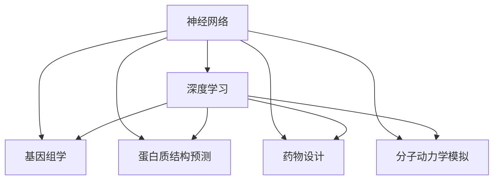
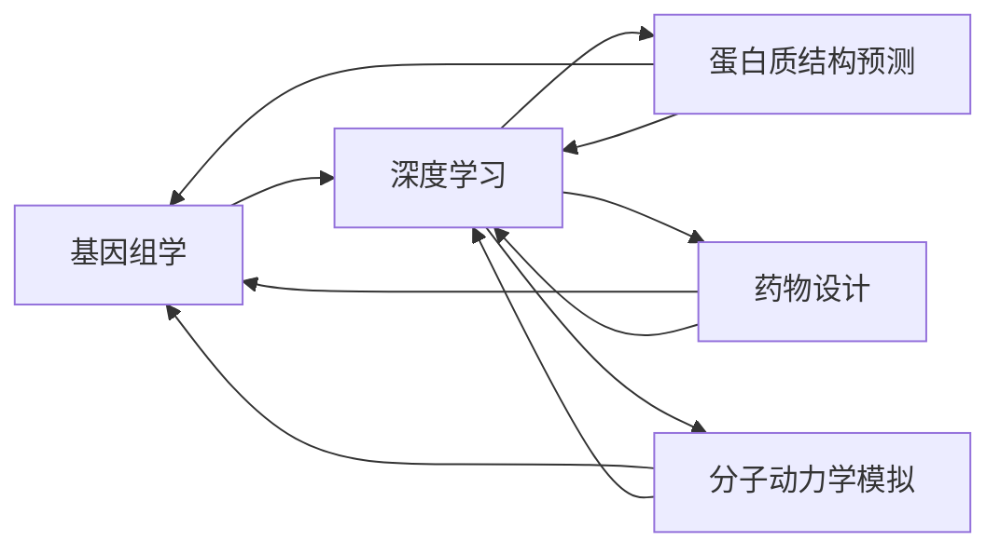
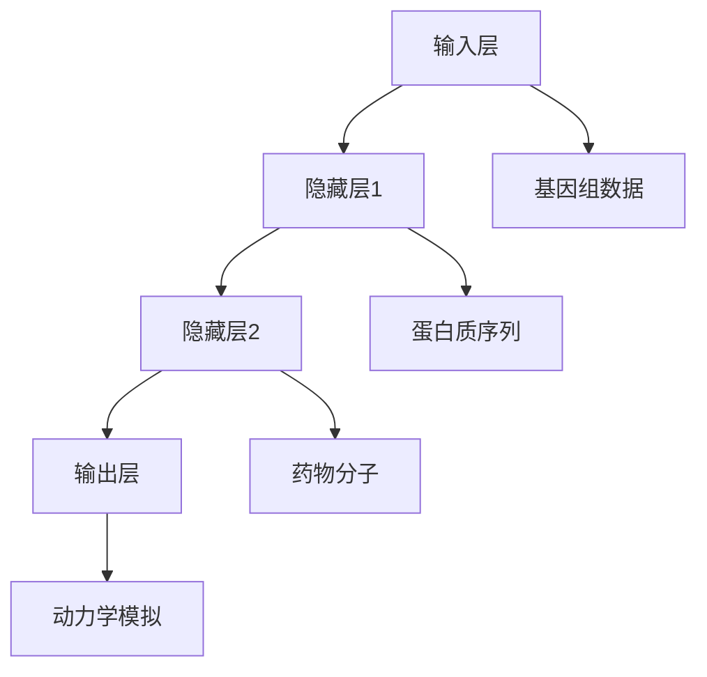

                 

# 一切皆是映射：神经网络在生物信息学中的应用前景

> 关键词：神经网络,生物信息学,深度学习,基因组学,蛋白质结构预测,药物设计,分子动力学模拟

## 1. 背景介绍

### 1.1 问题由来

随着人工智能技术的迅猛发展，深度学习在生物信息学领域的应用也取得了显著进展。从基因组学到蛋白质结构预测，从药物设计到分子动力学模拟，神经网络以其强大的数据处理能力和泛化能力，为生物信息学的研究提供了新的视角和工具。神经网络在生物信息学中的应用，不仅极大地提升了数据处理的效率和精度，还推动了该领域理论与实验研究的结合，成为当前生物信息学研究的热点方向。

### 1.2 问题核心关键点

神经网络在生物信息学中的应用，其核心在于通过构建复杂的非线性映射模型，将高维数据映射到低维空间，从而揭示数据之间的内在关联和规律。神经网络的应用主要涉及以下几个方面：

1. **基因组学**：神经网络被用于分析基因序列、基因表达、蛋白质功能等高维数据，以揭示生物体的基因调控机制和进化关系。
2. **蛋白质结构预测**：通过神经网络对氨基酸序列进行编码，预测蛋白质的三维结构，进而理解蛋白质的功能和作用。
3. **药物设计**：利用神经网络对化合物结构和生物活性进行关联分析，加速新药研发过程。
4. **分子动力学模拟**：神经网络被用于模拟分子在时间和空间上的动态行为，以研究分子间的相互作用和反应机制。

这些应用展示了神经网络在生物信息学领域强大的数据建模和预测能力，同时也对神经网络的算法原理和模型设计提出了更高的要求。

### 1.3 问题研究意义

神经网络在生物信息学中的应用，对于推动生物信息学的理论研究和实验研究具有重要意义：

1. **提高数据处理效率**：神经网络能够高效地处理大规模生物信息数据，显著提升数据处理的效率和精度。
2. **揭示数据规律**：通过复杂的数据映射，神经网络能够揭示高维数据之间的内在关联，为生物信息学研究提供新的视角。
3. **加速实验研究**：神经网络的预测能力能够辅助实验设计，缩短实验周期，降低实验成本。
4. **促进学科交叉**：神经网络的应用促进了生物信息学与其他学科（如物理学、化学、计算机科学等）的交叉融合，推动了跨学科研究的发展。

## 2. 核心概念与联系

### 2.1 核心概念概述

为了更好地理解神经网络在生物信息学中的应用，本节将介绍几个密切相关的核心概念：

- **神经网络(Neural Networks)**：一种通过多层非线性变换实现数据映射的算法，常用于图像识别、自然语言处理、语音识别等领域。
- **深度学习(Deep Learning)**：一种基于多层神经网络实现的学习算法，通过不断增加网络层数和参数，提高模型对复杂数据的拟合能力。
- **基因组学(Genomics)**：研究生物体遗传信息的空间结构、功能和进化的科学，主要包括基因组测序、基因表达分析、蛋白质功能预测等。
- **蛋白质结构预测(Protein Structure Prediction)**：利用计算机模拟技术预测蛋白质的三维结构，以便理解其功能和作用。
- **药物设计(Pharmaceutical Drug Design)**：利用计算机模拟技术预测药物分子的生物活性，以加速新药研发过程。
- **分子动力学模拟(Molecular Dynamics Simulation)**：通过计算机模拟分子在时间和空间上的动态行为，研究分子间的相互作用和反应机制。

这些核心概念之间的逻辑关系可以通过以下Mermaid流程图来展示：



这个流程图展示了一组核心概念之间的关系：

1. 神经网络是深度学习的基础，提供了复杂的非线性映射能力。
2. 深度学习技术被应用于基因组学、蛋白质结构预测、药物设计和分子动力学模拟等多个领域，以提高数据处理的效率和精度。
3. 各个生物信息学应用领域通过神经网络和深度学习技术，揭示了高维数据之间的内在关联和规律，推动了该领域的理论研究和实验研究。

### 2.2 概念间的关系

这些核心概念之间存在着紧密的联系，形成了神经网络在生物信息学应用的完整生态系统。下面我们通过几个Mermaid流程图来展示这些概念之间的关系。

#### 2.2.1 神经网络在生物信息学中的应用流程


这个流程图展示了神经网络在生物信息学中从数据预处理到结果分析的完整应用流程：

1. 对原始数据进行预处理，包括数据清洗、特征提取、归一化等步骤。
2. 构建神经网络模型，选择合适的网络结构、激活函数、损失函数等。
3. 使用训练数据对模型进行训练，优化模型参数。
4. 在验证集上评估模型性能，选择最优模型。
5. 应用模型对新数据进行预测，分析预测结果。

#### 2.2.2 深度学习在生物信息学中的应用场景



这个流程图展示了深度学习在生物信息学中的多个应用场景：

1. 深度学习在基因组学中的应用，包括基因序列分析和基因表达分析。
2. 深度学习在蛋白质结构预测中的应用，通过学习氨基酸序列与三维结构之间的映射关系。
3. 深度学习在药物设计中的应用，通过学习化合物结构与生物活性的关联。
4. 深度学习在分子动力学模拟中的应用，通过学习分子动态行为。

#### 2.2.3 神经网络在生物信息学中的模型架构



这个流程图展示了神经网络在生物信息学中的基本模型架构：

1. 输入层接受原始数据，包括基因组数据、蛋白质序列、药物分子和分子动力学模拟数据。
2. 隐藏层通过多层非线性变换实现数据映射。
3. 输出层产生最终的预测结果，如基因表达分析结果、蛋白质结构预测结果、药物分子生物活性预测结果和分子动力学模拟结果。

## 3. 核心算法原理 & 具体操作步骤
### 3.1 算法原理概述

神经网络在生物信息学中的应用，主要基于深度学习框架进行数据映射。其核心思想是通过构建多层非线性映射，将高维输入数据映射到低维输出空间，从而揭示数据之间的内在关联和规律。

假设输入数据为 $\mathbf{x} \in \mathbb{R}^d$，输出数据为 $\mathbf{y} \in \mathbb{R}^k$，则神经网络的映射关系可以表示为：

$$
\mathbf{y} = f(\mathbf{x}, \mathbf{W}, \mathbf{b})
$$

其中，$f(\cdot)$ 表示神经网络的前向传播过程，$\mathbf{W}$ 和 $\mathbf{b}$ 表示神经网络各层的权重和偏置。神经网络的前向传播过程通常包括多个隐藏层，每一层包含多个神经元，每一神经元的输出通过激活函数进行非线性映射。

### 3.2 算法步骤详解

神经网络在生物信息学中的应用，一般包括以下几个关键步骤：

**Step 1: 数据预处理**
- 对原始数据进行清洗、去噪、归一化等预处理，以便于神经网络的训练和预测。
- 将高维数据转换为低维向量，以便神经网络进行映射。

**Step 2: 神经网络模型构建**
- 选择合适的神经网络架构，如卷积神经网络、循环神经网络、深度神经网络等。
- 设定网络层数、每层神经元数量、激活函数、损失函数等关键参数。
- 构建数据流图，定义网络的前向传播过程。

**Step 3: 模型训练**
- 使用训练数据对神经网络进行训练，优化模型参数。
- 选择合适的优化算法，如梯度下降、Adam等。
- 设置合适的学习率和迭代次数。
- 使用正则化技术，如L2正则、Dropout等，避免过拟合。

**Step 4: 模型评估**
- 使用验证集对训练好的模型进行评估，选择最优模型。
- 计算模型在验证集上的性能指标，如准确率、精确率、召回率等。
- 分析模型在验证集上的错误类型，改进模型架构。

**Step 5: 模型应用**
- 使用训练好的模型对新数据进行预测，输出预测结果。
- 分析预测结果，提取有价值的信息。
- 根据需要对预测结果进行后处理，如筛选、排序、分类等。

### 3.3 算法优缺点

神经网络在生物信息学中的应用，具有以下优点：

1. **高效的数据处理能力**：神经网络能够高效处理大规模高维数据，显著提升数据处理的效率和精度。
2. **强大的泛化能力**：神经网络通过多层非线性映射，能够学习复杂的非线性关系，具有较强的泛化能力。
3. **灵活的模型架构**：神经网络的架构设计灵活，可以根据任务需求进行优化。
4. **可解释性强**：神经网络的模型架构和参数学习过程具有可解释性，便于理解和调试。

同时，神经网络在生物信息学中的应用也存在一些局限性：

1. **数据依赖性强**：神经网络需要大量的标注数据进行训练，数据获取成本较高。
2. **模型复杂度高**：神经网络的模型架构复杂，训练和预测过程耗时较长。
3. **参数调整难度大**：神经网络的参数调整需要大量的实验和调试，难以找到最优参数。
4. **可解释性差**：神经网络通常被认为是"黑盒"模型，难以解释其内部工作机制。

### 3.4 算法应用领域

神经网络在生物信息学中的应用，主要涉及以下几个领域：

1. **基因组学**：通过神经网络对基因序列和表达数据进行分析，揭示基因调控机制和进化关系。
2. **蛋白质结构预测**：利用神经网络对氨基酸序列进行编码，预测蛋白质的三维结构。
3. **药物设计**：利用神经网络对化合物结构和生物活性进行关联分析，加速新药研发过程。
4. **分子动力学模拟**：利用神经网络对分子在时间和空间上的动态行为进行模拟，研究分子间的相互作用和反应机制。

此外，神经网络在生物信息学中的应用还包括生物信息可视化、基因表达网络分析、生物信息模式识别等领域。

## 4. 数学模型和公式 & 详细讲解 & 举例说明
### 4.1 数学模型构建

神经网络在生物信息学中的应用，通常基于多层感知机(Multilayer Perceptron, MLP)进行建模。假设输入数据为 $\mathbf{x} \in \mathbb{R}^d$，输出数据为 $\mathbf{y} \in \mathbb{R}^k$，则神经网络的结构可以表示为：

$$
\mathbf{y} = f(\mathbf{x}, \mathbf{W}, \mathbf{b})
$$

其中，$\mathbf{W}$ 和 $\mathbf{b}$ 表示神经网络各层的权重和偏置。前向传播过程通常包括多个隐藏层，每一层包含多个神经元，每一神经元的输出通过激活函数进行非线性映射。

### 4.2 公式推导过程

以基因组学中的基因表达数据分析为例，假设输入数据为基因表达矩阵 $\mathbf{X} \in \mathbb{R}^{n \times d}$，输出数据为基因表达因子 $\mathbf{y} \in \mathbb{R}^{n \times k}$，则神经网络的映射关系可以表示为：

$$
\mathbf{y} = \mathbf{W}_l \cdot \sigma(\mathbf{W}_{l-1} \cdot \sigma(\ldots \sigma(\mathbf{W}_1 \cdot \mathbf{x} + \mathbf{b}_1) + \mathbf{b}_2) + \ldots + \mathbf{b}_l)
$$

其中，$\sigma(\cdot)$ 表示激活函数，如ReLU、Sigmoid等。$\mathbf{W}_l$ 和 $\mathbf{b}_l$ 表示第 $l$ 层的权重和偏置。

### 4.3 案例分析与讲解

假设我们使用神经网络对基因表达矩阵进行分类分析，其中输入数据为基因表达矩阵 $\mathbf{X} \in \mathbb{R}^{n \times d}$，输出数据为基因表达因子 $\mathbf{y} \in \mathbb{R}^{n \times k}$，其中 $k=2$，表示两个基因表达类别。假设神经网络包含两个隐藏层，每一层包含100个神经元，使用ReLU激活函数，最终输出层为softmax激活函数。则神经网络的结构可以表示为：

$$
\mathbf{y} = \mathbf{W}_l \cdot \sigma(\mathbf{W}_{l-1} \cdot \sigma(\mathbf{W}_1 \cdot \mathbf{x} + \mathbf{b}_1) + \mathbf{b}_2) + \mathbf{b}_3)
$$

其中，$\mathbf{W}_1 \in \mathbb{R}^{100 \times d}$，$\mathbf{W}_2 \in \mathbb{R}^{100 \times 100}$，$\mathbf{W}_3 \in \mathbb{R}^{k \times 100}$，$\mathbf{b}_1 \in \mathbb{R}^{100}$，$\mathbf{b}_2 \in \mathbb{R}^{100}$，$\mathbf{b}_3 \in \mathbb{R}^{k}$。

假设我们使用交叉熵损失函数对模型进行训练，则损失函数可以表示为：

$$
\mathcal{L} = -\frac{1}{N}\sum_{i=1}^N \sum_{j=1}^k y_{i,j} \log \hat{y}_{i,j}
$$

其中，$y_{i,j}$ 表示第 $i$ 个样本属于第 $j$ 类的真实标签，$\hat{y}_{i,j}$ 表示模型预测第 $i$ 个样本属于第 $j$ 类的概率。

假设我们使用随机梯度下降算法对模型进行优化，则模型参数的更新公式可以表示为：

$$
\mathbf{W}_l \leftarrow \mathbf{W}_l - \eta \frac{\partial \mathcal{L}}{\partial \mathbf{W}_l}
$$

其中，$\eta$ 表示学习率。

## 5. 项目实践：代码实例和详细解释说明
### 5.1 开发环境搭建

在进行生物信息学神经网络项目实践前，我们需要准备好开发环境。以下是使用Python进行TensorFlow开发的环境配置流程：

1. 安装Anaconda：从官网下载并安装Anaconda，用于创建独立的Python环境。

2. 创建并激活虚拟环境：
```bash
conda create -n tf-env python=3.8 
conda activate tf-env
```

3. 安装TensorFlow：根据CUDA版本，从官网获取对应的安装命令。例如：
```bash
conda install tensorflow=2.5 -c pytorch -c conda-forge
```

4. 安装各类工具包：
```bash
pip install numpy pandas scikit-learn matplotlib tensorflow_hub
```

完成上述步骤后，即可在`tf-env`环境中开始神经网络项目实践。

### 5.2 源代码详细实现

下面我们以基因组学中的基因表达数据分析为例，给出使用TensorFlow进行神经网络建模和训练的Python代码实现。

首先，定义神经网络模型的参数和函数：

```python
import tensorflow as tf
from tensorflow.keras.layers import Dense, Dropout, Activation
from tensorflow.keras import Sequential
from tensorflow.keras.optimizers import Adam

class NeuralNet(tf.keras.Model):
    def __init__(self, input_size, hidden_size, output_size):
        super(NeuralNet, self).__init__()
        self.dense1 = Dense(hidden_size, input_shape=(input_size,)) 
        self.dropout1 = Dropout(0.2)
        self.dense2 = Dense(hidden_size)
        self.dropout2 = Dropout(0.2)
        self.dense3 = Dense(output_size)
        self.activation = Activation('softmax')
        
    def call(self, inputs):
        x = self.dense1(inputs)
        x = self.dropout1(x)
        x = self.dense2(x)
        x = self.dropout2(x)
        x = self.dense3(x)
        return self.activation(x)
```

然后，定义数据处理函数和模型训练函数：

```python
def preprocess_data(data):
    # 数据预处理，包括归一化等操作
    return processed_data

def train_model(model, x_train, y_train, x_val, y_val, epochs, batch_size):
    model.compile(loss='categorical_crossentropy', optimizer=Adam(learning_rate=0.001), metrics=['accuracy'])
    history = model.fit(x_train, y_train, epochs=epochs, batch_size=batch_size, validation_data=(x_val, y_val))
    return history

# 定义训练数据和标签
x_train, y_train = preprocess_data(train_data)
x_val, y_val = preprocess_data(val_data)

# 定义神经网络模型
model = NeuralNet(input_size, hidden_size, output_size)

# 训练模型
history = train_model(model, x_train, y_train, x_val, y_val, epochs, batch_size)

# 评估模型
test_data, test_labels = preprocess_data(test_data)
test_loss, test_acc = model.evaluate(test_data, test_labels)
print('Test Accuracy:', test_acc)
```

最后，使用训练好的模型进行基因表达数据的预测：

```python
# 加载测试数据
test_data, test_labels = preprocess_data(test_data)

# 使用训练好的模型进行预测
predictions = model.predict(test_data)
```

以上就是使用TensorFlow对基因表达数据进行神经网络建模和训练的完整代码实现。可以看到，得益于TensorFlow的强大封装，我们可以用相对简洁的代码实现复杂的神经网络模型。

### 5.3 代码解读与分析

让我们再详细解读一下关键代码的实现细节：

**NeuralNet类**：
- `__init__`方法：初始化神经网络模型，定义各层参数和函数。
- `call`方法：定义前向传播过程，通过各层函数实现数据的映射。

**数据处理函数**：
- `preprocess_data`方法：对原始数据进行预处理，包括归一化、标准化等操作。

**模型训练函数**：
- `train_model`方法：定义训练函数，使用TensorFlow的`fit`方法对模型进行训练和评估。

**训练数据和标签**：
- 定义训练数据和标签，通过`preprocess_data`方法对数据进行预处理。

**神经网络模型**：
- 定义神经网络模型，使用`NeuralNet`类初始化模型。
- 定义模型的各层参数和函数。
- 定义模型的激活函数和损失函数。

**模型评估**：
- 使用训练好的模型对测试数据进行预测。
- 使用`evaluate`方法评估模型性能，输出测试集的准确率。

**代码示例**：
- 使用`Sequential`模型对多个神经网络层进行堆叠。
- 定义各层的参数和函数。
- 使用`compile`方法定义模型的损失函数和优化器。
- 使用`fit`方法进行模型的训练和评估。

可以看到，TensorFlow提供了一整套完整的深度学习框架，方便开发者进行模型的设计和训练。对于更复杂的应用场景，开发者可以灵活利用TensorFlow的API，构建自定义的神经网络模型。

## 6. 实际应用场景
### 6.1 智能医疗系统

基于神经网络技术的生物信息学应用，在智能医疗系统中具有广阔的应用前景。智能医疗系统通过分析患者的历史数据，提供个性化的诊疗方案，大幅提高了医疗服务的效率和准确性。

在技术实现上，可以收集患者的历史病历、基因组数据、实验室检查结果等，将数据输入到训练好的神经网络模型中进行分析。模型能够从这些高维数据中提取有价值的信息，如疾病风险、基因表达水平等，从而辅助医生进行诊断和治疗。对于新来的患者，系统也可以基于神经网络模型的预测结果，提供个性化的诊疗建议。

### 6.2 新药研发平台

神经网络在药物设计中的应用，为新药研发提供了新的思路和工具。传统的药物设计方法依赖于大量的实验数据，耗时耗资巨大。神经网络可以通过对化合物结构和生物活性的关联分析，加速新药研发过程。

在技术实现上，可以收集化合物结构、分子质量、溶解度等数据，将这些数据输入到训练好的神经网络模型中进行分析。模型能够预测化合物对特定生物目标的活性，从而筛选出潜在的新药候选。新药研发平台可以基于神经网络模型的预测结果，进一步进行实验验证和优化。

### 6.3 生物信息学研究工具

神经网络在生物信息学中的应用，为研究者提供了强大的工具支持。研究者可以利用神经网络进行基因组数据分析、蛋白质结构预测、基因表达分析等，揭示生物体的高维数据之间的内在关联和规律。

在技术实现上，研究者可以利用神经网络模型对生物信息学数据进行分类、回归、聚类等分析，揭示数据之间的关联和规律。研究者还可以利用神经网络模型进行图像识别、文本处理、信号分析等任务，为生物信息学研究提供新的视角和方法。

### 6.4 未来应用展望

随着神经网络技术的不断进步，其在生物信息学中的应用将越来越广泛。未来，神经网络技术将在以下几个领域得到应用：

1. **基因组学**：神经网络将被用于基因组测序、基因表达分析、基因突变检测等任务，提高基因组学研究的数据处理效率和精度。
2. **蛋白质结构预测**：神经网络将被用于蛋白质结构预测、蛋白质功能分析等任务，揭示蛋白质的三维结构和功能机制。
3. **药物设计**：神经网络将被用于药物分子设计、药物活性预测等任务，加速新药研发过程。
4. **分子动力学模拟**：神经网络将被用于分子动力学模拟、分子反应预测等任务，研究分子在时间和空间上的动态行为。
5. **生物信息可视化**：神经网络将被用于生物信息数据的可视化，揭示数据之间的内在关联和规律。
6. **生物信息模式识别**：神经网络将被用于生物信息数据的模式识别，发现新的生物信息学规律和知识。

这些应用展示了神经网络在生物信息学领域的强大潜力和广泛应用前景，相信未来神经网络技术将在更多领域得到应用，推动生物信息学研究的发展。

## 7. 工具和资源推荐
### 7.1 学习资源推荐

为了帮助开发者系统掌握神经网络在生物信息学中的应用，这里推荐一些优质的学习资源：

1. **《深度学习在生物信息学中的应用》系列博文**：由深度学习领域专家撰写，深入浅出地介绍了深度学习在基因组学、蛋白质结构预测、药物设计等领域的应用。

2. **Coursera《深度学习在生物信息学中的应用》课程**：斯坦福大学开设的深度学习课程，涵盖了深度学习在生物信息学中的应用，提供了丰富的案例和作业。

3. **《生物信息学与深度学习》书籍**：详细介绍了深度学习在生物信息学中的应用，包括基因组学、蛋白质结构预测、药物设计等领域。

4. **DeepMind AI博文**：DeepMind团队发布的一系列深度学习技术在生物信息学中的应用，包含最新的研究进展和技术细节。

5. **BioArXiv预印本**：生物信息学领域的前沿研究成果，包含深度学习在生物信息学中的应用和探索。

通过对这些资源的学习实践，相信你一定能够快速掌握神经网络在生物信息学中的应用，并用于解决实际的生物信息学问题。

### 7.2 开发工具推荐

高效的开发离不开优秀的工具支持。以下是几款用于神经网络在生物信息学中应用的常用工具：

1. **TensorFlow**：基于Python的开源深度学习框架，灵活动态的计算图，适合快速迭代研究。TensorFlow提供了丰富的预训练模型和神经网络API，方便开发者进行深度学习模型的设计和训练。

2. **PyTorch**：基于Python的开源深度学习框架，灵活性高，支持动态计算图，适合进行复杂的深度学习研究。PyTorch提供了丰富的神经网络API，方便开发者进行深度学习模型的设计和训练。

3. **BioPython**：Python生物信息学库，提供了丰富的生物信息学数据处理和分析工具，方便开发者进行生物信息学数据预处理和分析。

4. **Bioconductor**：R语言生物信息学库，提供了丰富的生物信息学数据处理和分析工具，方便开发者进行生物信息学数据预处理和分析。

5. **Anaconda**：Python环境管理工具，可以创建和管理多个Python环境，方便开发者进行不同深度学习模型的开发和测试。

合理利用这些工具，可以显著提升神经网络在生物信息学中的应用开发效率，加快创新迭代的步伐。

### 

