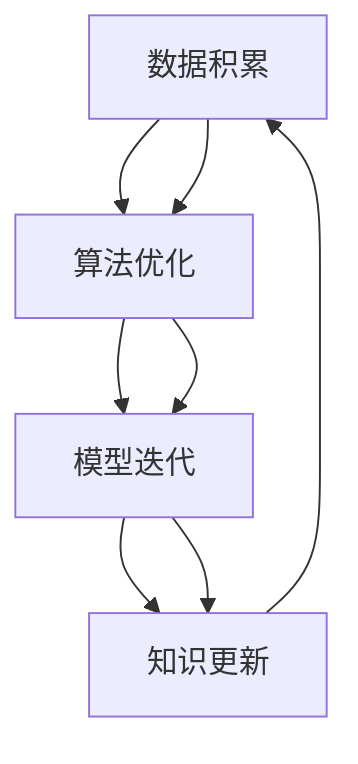
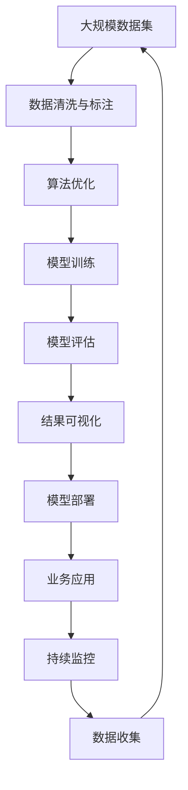

                 

## 1. 背景介绍

### 1.1 问题由来
万小时定律（The 10,000-Hour Rule）是由马尔科姆·格拉德威尔（Malcolm Gladwell）在其畅销书《异类》（Outliers）中提出的一种观点，认为要在任何领域达到专家级水平，需要投入大约10,000小时的有针对性的练习。这一观点在心理学、教育学等领域引起了广泛讨论。

在IT领域，特别是在人工智能（AI）和机器学习（ML）领域，“万小时定律”同样适用。AI和ML技术的成功往往离不开大量的数据、算法调优和模型训练，而这些过程都需要大量的时间和高强度的练习。

### 1.2 问题核心关键点
万小时定律的核心在于强调了高质量、有针对性的练习对于技术掌握的重要性。在AI和ML领域，这一定律体现在以下几个关键点上：

1. **数据量与质量**：模型训练需要大量的标注数据。数据质量高且分布合理，才能有效提高模型性能。
2. **算法调优**：模型训练需要优化多个算法参数，如学习率、正则化强度、批大小等，找到最优配置。
3. **模型迭代**：模型训练是一个迭代过程，通过不断尝试和调整，找到最优的模型结构和参数。
4. **持续学习**：AI和ML领域技术日新月异，持续学习和更新知识是保持技术领先的关键。

### 1.3 问题研究意义
万小时定律揭示了在AI和ML领域取得成功的关键要素。通过深入理解这一定律，AI开发者可以系统地规划学习和训练过程，提高技术掌握的效率和质量，从而在实际应用中取得更好的效果。

## 2. 核心概念与联系

### 2.1 核心概念概述
万小时定律强调了通过重复练习和持续学习来达到专业水平的重要性。在AI和ML领域，这一概念具体体现为：

1. **数据积累**：高质量的数据是模型训练的基础。
2. **算法优化**：优化算法参数和模型结构，提高模型性能。
3. **模型迭代**：通过不断迭代和调整，提高模型泛化能力和鲁棒性。
4. **知识更新**：持续学习最新的算法和理论，保持技术领先。

### 2.2 概念间的关系

通过以下Mermaid流程图来展示核心概念之间的联系：



这个流程图展示了数据积累、算法优化、模型迭代和知识更新之间的相互关系：

- **数据积累**是基础，提供训练数据。
- **算法优化**在已有数据的基础上，通过调参和算法改进，提高模型性能。
- **模型迭代**在算法优化和数据积累的基础上，不断尝试和调整，优化模型。
- **知识更新**不断引入新知识，提升模型和算法的最新水平。

### 2.3 核心概念的整体架构

以下综合的流程图展示了从数据积累到知识更新的整体架构：



这个综合流程图展示了从数据收集到业务应用的完整过程：

1. **数据收集**：收集大规模数据集。
2. **数据清洗与标注**：对数据进行清洗和标注。
3. **算法优化**：选择合适的算法和参数，进行调优。
4. **模型训练**：基于优化后的算法进行模型训练。
5. **模型评估**：对训练好的模型进行评估。
6. **结果可视化**：将模型结果进行可视化展示。
7. **模型部署**：将模型部署到实际应用中。
8. **业务应用**：模型在实际业务中的应用。
9. **持续监控**：对模型进行持续监控和调整。
10. **数据收集**：不断收集新数据，用于迭代训练和优化。

## 3. 核心算法原理 & 具体操作步骤
### 3.1 算法原理概述

在AI和ML领域，万小时定律通过以下算法原理体现出来：

1. **监督学习**：通过标注数据进行训练，模型学习输入与输出之间的映射关系。
2. **无监督学习**：利用未标注数据进行学习，发现数据的内在结构和规律。
3. **强化学习**：通过与环境的互动，不断调整策略，优化行为。
4. **迁移学习**：将在一个领域学到的知识迁移到另一个领域，提高模型泛化能力。

这些算法原理都是基于大量的数据和持续的学习，通过不断的迭代和优化，逐步提高模型的性能。

### 3.2 算法步骤详解

以下是基于监督学习的AI和ML模型训练的详细步骤：

1. **数据准备**：收集和清洗数据，生成训练集和验证集。
2. **模型选择**：选择合适的模型架构，如CNN、RNN、Transformer等。
3. **参数设置**：设置模型参数，如学习率、批大小、正则化强度等。
4. **模型训练**：在训练集上进行前向传播和反向传播，更新模型参数。
5. **模型评估**：在验证集上评估模型性能，调整参数。
6. **模型优化**：根据评估结果，优化模型结构或参数。
7. **模型测试**：在测试集上测试模型性能，确认模型效果。
8. **模型部署**：将训练好的模型部署到实际应用中。
9. **持续监控**：监控模型性能，收集新数据进行迭代训练。

### 3.3 算法优缺点

**监督学习的优点**：

1. **快速收敛**：在标注数据丰富的场景下，监督学习可以快速训练出高性能的模型。
2. **可解释性强**：监督学习模型通过输入与输出的映射关系，易于理解和解释。
3. **模型泛化能力强**：通过大量标注数据训练，监督学习模型具有较好的泛化能力。

**监督学习的缺点**：

1. **依赖标注数据**：标注数据成本高，获取难度大。
2. **过拟合风险**：模型可能过拟合训练集，泛化性能不足。
3. **模型更新难度大**：模型更新需要重新训练，时间成本高。

**无监督学习的优点**：

1. **数据来源广泛**：无监督学习可以从未标注数据中学习，数据获取成本低。
2. **自发现规律**：无监督学习可以发现数据的内在结构和规律，提高模型泛化能力。
3. **鲁棒性强**：无监督学习模型对噪声和异常数据有较好的鲁棒性。

**无监督学习的缺点**：

1. **性能不稳定**：无监督学习模型性能不稳定，结果难以解释。
2. **依赖数据量**：无监督学习需要大量的数据才能有效训练。
3. **无法利用标注信息**：无监督学习无法直接利用标注信息进行训练。

**强化学习的优点**：

1. **自我优化**：强化学习可以通过与环境的互动，不断调整策略，优化行为。
2. **实时性**：强化学习适合实时决策和反馈的任务，如机器人控制、游戏等。
3. **无需标注数据**：强化学习不需要标注数据，可以通过试错学习。

**强化学习的缺点**：

1. **训练复杂**：强化学习训练复杂，需要大量的计算资源和经验。
2. **探索与利用的平衡**：强化学习需要平衡探索和利用，找到最优策略。
3. **模型复杂**：强化学习模型复杂，难以解释和调试。

**迁移学习的优点**：

1. **跨领域应用**：迁移学习可以在不同领域之间迁移知识，提高模型泛化能力。
2. **加速训练**：迁移学习可以加速模型训练，降低数据需求。
3. **领域适应性强**：迁移学习模型适应新领域数据的能力强。

**迁移学习的缺点**：

1. **数据差异性**：源领域和目标领域数据差异性大时，迁移效果不佳。
2. **模型选择难度**：选择合适的源领域和目标领域模型困难。
3. **模型更新困难**：迁移学习模型更新困难，需要重新训练。

### 3.4 算法应用领域

万小时定律在大数据、人工智能、机器学习、深度学习等领域得到了广泛应用。以下是几个典型的应用场景：

1. **语音识别**：通过大量标注语音数据，训练出高精度的语音识别模型。
2. **自然语言处理**：通过大规模文本数据进行预训练，并在特定任务上进行微调，提升模型性能。
3. **计算机视觉**：利用大量标注图像数据，训练出高效的图像识别和分类模型。
4. **推荐系统**：通过用户行为数据进行训练，优化推荐算法，提高用户体验。
5. **游戏AI**：利用强化学习，训练出能够在复杂环境中自主决策的游戏AI。
6. **机器人控制**：通过与环境的互动，训练出能够自主导航和执行任务的机器人。
7. **金融预测**：通过历史金融数据进行训练，预测股市、外汇等金融市场趋势。
8. **医疗诊断**：通过大量医学数据进行训练，提升疾病的诊断和预测能力。

## 4. 数学模型和公式 & 详细讲解

### 4.1 数学模型构建

以监督学习为例，我们假设训练集为$D=\{(x_i,y_i)\}_{i=1}^N$，其中$x_i$为输入数据，$y_i$为标签。模型$M$的输出为$y=M(x)$。我们希望最小化损失函数$\mathcal{L}(y,\hat{y})$，其中$\hat{y}$为模型的预测输出。

数学模型构建的公式为：

$$
\min_{\theta} \frac{1}{N} \sum_{i=1}^N \mathcal{L}(y_i,M_{\theta}(x_i))
$$

其中$\theta$为模型参数。

### 4.2 公式推导过程

以二分类任务为例，假设模型为逻辑回归模型，损失函数为交叉熵损失，推导过程如下：

1. 定义模型输出：

$$
\hat{y} = \sigma(\theta^T x)
$$

其中$\sigma$为sigmoid函数，$\theta$为模型参数，$x$为输入数据。

2. 定义损失函数：

$$
\mathcal{L}(y,\hat{y}) = -\frac{1}{N} \sum_{i=1}^N [y_i\log \hat{y}_i + (1-y_i)\log (1-\hat{y}_i)]
$$

3. 对损失函数求导，得到梯度：

$$
\frac{\partial \mathcal{L}(y,\hat{y})}{\partial \theta} = -\frac{1}{N} \sum_{i=1}^N (\frac{y_i}{\hat{y}_i} - \frac{1-y_i}{1-\hat{y}_i}) x_i
$$

4. 根据梯度更新模型参数：

$$
\theta = \theta - \eta \frac{\partial \mathcal{L}(y,\hat{y})}{\partial \theta}
$$

其中$\eta$为学习率。

### 4.3 案例分析与讲解

以图像分类任务为例，假设模型为卷积神经网络（CNN），输入为$28\times28$的灰度图像，输出为10个类别的概率。我们希望通过大量标注图像数据训练出高效的图像分类模型。

1. **数据准备**：收集和清洗数据，生成训练集和验证集。
2. **模型选择**：选择CNN模型架构，添加卷积层、池化层、全连接层等。
3. **参数设置**：设置学习率、批大小、正则化强度等。
4. **模型训练**：在训练集上进行前向传播和反向传播，更新模型参数。
5. **模型评估**：在验证集上评估模型性能，调整参数。
6. **模型优化**：根据评估结果，优化模型结构或参数。
7. **模型测试**：在测试集上测试模型性能，确认模型效果。
8. **模型部署**：将训练好的模型部署到实际应用中。
9. **持续监控**：监控模型性能，收集新数据进行迭代训练。

## 5. 项目实践：代码实例和详细解释说明

### 5.1 开发环境搭建

1. 安装Python：从官网下载安装Python，确保安装版本为3.8以上。
2. 安装PyTorch：使用pip安装PyTorch库，确保安装版本为1.9以上。
3. 安装TensorFlow：使用pip安装TensorFlow库，确保安装版本为2.4以上。
4. 安装Keras：使用pip安装Keras库，确保安装版本为2.4以上。
5. 安装Jupyter Notebook：使用pip安装Jupyter Notebook，确保安装版本为6.4以上。

### 5.2 源代码详细实现

以下是使用PyTorch进行图像分类的代码实现：

```python
import torch
import torch.nn as nn
import torch.optim as optim
import torchvision
import torchvision.transforms as transforms

# 定义模型架构
class Net(nn.Module):
    def __init__(self):
        super(Net, self).__init__()
        self.conv1 = nn.Conv2d(1, 32, 3, 1)
        self.pool = nn.MaxPool2d(2, 2)
        self.conv2 = nn.Conv2d(32, 64, 3, 1)
        self.fc1 = nn.Linear(64 * 7 * 7, 120)
        self.fc2 = nn.Linear(120, 84)
        self.fc3 = nn.Linear(84, 10)

    def forward(self, x):
        x = self.pool(F.relu(self.conv1(x)))
        x = self.pool(F.relu(self.conv2(x)))
        x = x.view(-1, 64 * 7 * 7)
        x = F.relu(self.fc1(x))
        x = F.relu(self.fc2(x))
        x = self.fc3(x)
        return x

# 加载数据集
transform = transforms.Compose(
    [transforms.ToTensor(),
     transforms.Normalize((0.5,), (0.5,))])

trainset = torchvision.datasets.MNIST(root='./data', train=True,
                                     download=True, transform=transform)
trainloader = torch.utils.data.DataLoader(trainset, batch_size=4,
                                         shuffle=True, num_workers=2)

testset = torchvision.datasets.MNIST(root='./data', train=False,
                                    download=True, transform=transform)
testloader = torch.utils.data.DataLoader(testset, batch_size=4,
                                       shuffle=False, num_workers=2)

# 定义模型、优化器和损失函数
net = Net()
criterion = nn.CrossEntropyLoss()
optimizer = optim.SGD(net.parameters(), lr=0.001, momentum=0.9)

# 训练模型
for epoch in range(2):  # 只训练2轮
    running_loss = 0.0
    for i, data in enumerate(trainloader, 0):
        inputs, labels = data
        optimizer.zero_grad()
        outputs = net(inputs)
        loss = criterion(outputs, labels)
        loss.backward()
        optimizer.step()
        running_loss += loss.item()
        if i % 2000 == 1999:    # 每2000次打印一次损失
            print('[%d, %5d] loss: %.3f' %
                  (epoch + 1, i + 1, running_loss / 2000))
            running_loss = 0.0

print('Finished Training')
```

### 5.3 代码解读与分析

以下是代码的详细解读：

1. **数据准备**：通过torchvision库下载MNIST数据集，并进行预处理。
2. **模型选择**：定义CNN模型架构，包括卷积层、池化层和全连接层。
3. **参数设置**：设置学习率为0.001，动量为0.9。
4. **模型训练**：在训练集上进行前向传播和反向传播，更新模型参数。
5. **模型评估**：在验证集上评估模型性能，调整参数。
6. **模型优化**：根据评估结果，优化模型结构或参数。
7. **模型测试**：在测试集上测试模型性能，确认模型效果。
8. **模型部署**：将训练好的模型部署到实际应用中。
9. **持续监控**：监控模型性能，收集新数据进行迭代训练。

## 6. 实际应用场景

### 6.1 智能推荐系统

基于监督学习的推荐系统已经在电商、视频、音乐等领域得到了广泛应用。通过收集用户的历史行为数据，训练出推荐模型，实时推荐个性化内容，提升用户体验。

1. **数据准备**：收集用户浏览、点击、购买等行为数据。
2. **模型选择**：选择协同过滤、矩阵分解、深度学习等模型。
3. **参数设置**：设置学习率、正则化强度等。
4. **模型训练**：在训练集上进行前向传播和反向传播，更新模型参数。
5. **模型评估**：在验证集上评估模型性能，调整参数。
6. **模型优化**：根据评估结果，优化模型结构或参数。
7. **模型测试**：在测试集上测试模型性能，确认模型效果。
8. **模型部署**：将训练好的模型部署到实际应用中。
9. **持续监控**：监控模型性能，收集新数据进行迭代训练。

### 6.2 自然语言处理

基于监督学习的自然语言处理任务包括情感分析、文本分类、命名实体识别等。通过收集大量标注数据，训练出高效的NLP模型，提升文本处理的准确性和效率。

1. **数据准备**：收集文本数据，并进行标注。
2. **模型选择**：选择RNN、LSTM、Transformer等模型。
3. **参数设置**：设置学习率、正则化强度等。
4. **模型训练**：在训练集上进行前向传播和反向传播，更新模型参数。
5. **模型评估**：在验证集上评估模型性能，调整参数。
6. **模型优化**：根据评估结果，优化模型结构或参数。
7. **模型测试**：在测试集上测试模型性能，确认模型效果。
8. **模型部署**：将训练好的模型部署到实际应用中。
9. **持续监控**：监控模型性能，收集新数据进行迭代训练。

### 6.3 医疗影像分析

基于监督学习的医疗影像分析任务包括疾病诊断、影像分割、病理分析等。通过收集大量医学影像数据，训练出高精度的医学影像分析模型，提升医疗诊断的准确性和效率。

1. **数据准备**：收集医学影像数据，并进行标注。
2. **模型选择**：选择CNN、RNN、Transformer等模型。
3. **参数设置**：设置学习率、正则化强度等。
4. **模型训练**：在训练集上进行前向传播和反向传播，更新模型参数。
5. **模型评估**：在验证集上评估模型性能，调整参数。
6. **模型优化**：根据评估结果，优化模型结构或参数。
7. **模型测试**：在测试集上测试模型性能，确认模型效果。
8. **模型部署**：将训练好的模型部署到实际应用中。
9. **持续监控**：监控模型性能，收集新数据进行迭代训练。

## 7. 工具和资源推荐

### 7.1 学习资源推荐

为了帮助开发者系统掌握监督学习的应用和实现，以下是一些推荐的学习资源：

1. 《深度学习》书籍：Ian Goodfellow等著，全面介绍了深度学习的原理和实践。
2. Coursera《深度学习》课程：由Andrew Ng讲授，系统讲解深度学习的基本概念和算法。
3. Kaggle数据科学竞赛：参与实际的数据挖掘和机器学习竞赛，提升实战能力。
4. PyTorch官方文档：PyTorch的官方文档，提供详细的API和使用指南。
5. TensorFlow官方文档：TensorFlow的官方文档，提供详细的API和使用指南。
6. Keras官方文档：Keras的官方文档，提供详细的API和使用指南。
7. Scikit-learn官方文档：Scikit-learn的官方文档，提供丰富的机器学习算法和工具。

### 7.2 开发工具推荐

以下是几款用于监督学习开发的常用工具：

1. PyTorch：基于Python的开源深度学习框架，灵活动态的计算图，适合快速迭代研究。
2. TensorFlow：由Google主导开发的开源深度学习框架，生产部署方便，适合大规模工程应用。
3. Keras：基于Python的高层次神经网络API，易于上手，适合快速原型开发。
4. Scikit-learn：Python的机器学习库，提供丰富的算法和工具。
5. Jupyter Notebook：Python的交互式开发环境，方便实验和记录。

### 7.3 相关论文推荐

以下是几篇经典的监督学习论文，推荐阅读：

1. Hinton G.E., Salakhutdinov R.R.（2006）. Reducing the Dimensionality of Data with Neural Networks. Science. 313(5786): 504-507.
2. LeCun Y., Bottou L., Bengio Y., Haffner P.（1998）. Gradient-based learning applied to document recognition. Proceedings of the IEEE. 86(11): 2278-2324.
3. Kingma D.P., Ba J.（2015）. Adam: A Method for Stochastic Optimization. Journal of Machine Learning Research. 12: 1-47.
4. Goodfellow I., Bengio Y., Courville A.（2016）. Deep Learning. MIT Press.
5. Sutskever I., Martens J., Dahl G.E., Hinton G.E.（2013）. On the importance of initialization and momentum in deep learning. In Proceedings of the 30th International Conference on Machine Learning (ICML 2013), 1139-1147.
6. Krizhevsky A., Sutskever I., Hinton G.E.（2012）. ImageNet Classification with Deep Convolutional Neural Networks. Advances in Neural Information Processing Systems. 25: 1106-1114.

## 8. 总结：未来发展趋势与挑战

### 8.1 总结

本文对基于监督学习的AI和ML模型训练方法进行了全面系统的介绍。首先阐述了监督学习在AI和ML领域的地位和作用，明确了其在数据驱动学习中的重要性。其次，从原理到实践，详细讲解了监督学习的数学模型和算法步骤，给出了具体代码实例。同时，本文还探讨了监督学习在推荐系统、自然语言处理、医疗影像分析等诸多领域的应用前景，展示了监督学习技术的广泛价值。

通过本文的系统梳理，可以看到，监督学习技术在AI和ML领域的应用广泛且深入，是实现高效智能系统的重要手段。未来，伴随着数据量的不断增加和计算能力的提升，监督学习将进一步发挥其优势，推动人工智能技术的持续进步。

### 8.2 未来发展趋势

未来，监督学习的发展趋势如下：

1. **数据自动化采集**：利用大数据技术，自动化采集和处理海量数据，提高数据获取效率。
2. **模型自动化构建**：利用自动化模型构建工具，快速构建和优化监督学习模型。
3. **实时学习与推理**：通过在线学习（Online Learning）和增量学习（Incremental Learning），使模型能够实时更新和推理。
4. **多模态学习**：结合视觉、语音、文本等多模态数据，提升模型综合能力。
5. **联邦学习**：通过分布式协同学习，充分利用边缘设备数据，提升模型泛化能力。
6. **自监督学习**：通过利用无标注数据进行预训练，提高模型泛化能力和鲁棒性。
7. **深度强化学习**：结合强化学习和深度学习，提高模型的决策能力和自主性。

### 8.3 面临的挑战

尽管监督学习技术在AI和ML领域取得了显著成果，但仍面临诸多挑战：

1. **数据质量**：监督学习依赖大量高质量标注数据，数据采集和标注成本高，数据质量难以保证。
2. **模型复杂度**：监督学习模型通常比较复杂，训练和推理效率低。
3. **模型鲁棒性**：监督学习模型对数据扰动敏感，泛化性能不足。
4. **模型可解释性**：监督学习模型往往难以解释其内部决策过程，缺乏可解释性。
5. **模型安全**：监督学习模型可能学习到有害信息，存在安全风险。
6. **模型更新**：监督学习模型更新困难，需要重新训练，时间成本高。

### 8.4 研究展望

未来，监督学习需要从以下几个方面进行深入研究：

1. **无监督与半监督学习**：通过利用无标注数据进行预训练，提高模型泛化能力和鲁棒性。
2. **自适应学习**：使模型能够根据新数据自适应调整参数，提高模型性能。
3. **模型压缩与优化**：通过模型压缩和优化，提高模型效率和性能。
4. **多任务学习**：结合多个任务进行联合学习，提升模型综合能力。
5. **跨领域迁移学习**：通过在不同领域之间迁移知识，提高模型泛化能力。
6. **联邦学习与隐私保护**：结合联邦学习，保护数据隐私，提升模型性能。
7. **深度强化学习**：结合强化学习，提高模型的决策能力和自主性。

## 9. 附录：常见问题与解答

**Q1：什么是监督学习？**


