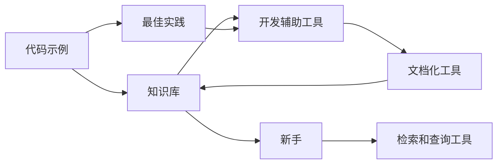

                 

## 1. 背景介绍

### 1.1 问题由来

在软件开发领域，经验和技能传承历来是难题之一。随着技术的不断更新换代，新手的成长周期延长，技术传承的路径变得愈加复杂。加之，高质量的经验往往是个人积累的结晶，难以被整齐划一地描述和传递。因此，如何高效、系统地固化专家经验，使其被新一代开发者所继承，成为了当今软件开发实践中亟需解决的问题。

### 1.2 问题核心关键点

固化专家经验的核心在于“沉淀”和“继承”两个方面：

- **沉淀**：将专家经验系统化、标准化，形成可操作的知识库。
- **继承**：让新手能够通过系统化的学习途径，快速掌握核心技能。

为了实现这两点，我们需要设计一种机制，使专家经验能够被集成到开发流程中，为开发者提供即时的、可搜索的、上下文相关的经验参考。

### 1.3 问题研究意义

固化专家经验对软件开发有着重大的意义：

1. **缩短成长周期**：新手能够通过可搜索、结构化的经验库快速学习，避免走弯路。
2. **提升开发效率**：通过经验库对常见问题进行快速定位和解决，减少重复劳动，提高问题解决的效率。
3. **保证质量**：系统化的经验库可以作为代码审查和测试的标准，保证代码质量和项目一致性。
4. **促进知识共享**：经验库的建立不仅保存了当前项目团队的智慧，也为未来成员提供了宝贵的学习资源。

## 2. 核心概念与联系

### 2.1 核心概念概述

为了明确固化专家经验的框架和路径，我们将介绍几个关键概念：

- **代码示例**：包括代码片段、注释、测试用例等，用于展示专家如何处理常见问题。
- **最佳实践**：专家在处理问题时所遵循的通用方法论，如代码风格、测试策略等。
- **知识库**：用于沉淀和存储经验，支持检索和查询的系统。
- **开发辅助工具**：通过工具将知识库集成到开发流程中，提供即时的经验参考。
- **文档化工具**：用于将代码、测试等文档化，并建立关联，便于知识的管理和检索。

### 2.2 概念间的关系

这些概念之间存在着紧密的联系，它们相互支撑，共同构成了固化专家经验的完整系统：

- 专家经验通过代码示例、最佳实践等方式沉淀在知识库中。
- 开发辅助工具将知识库集成到开发流程中，提供即时的经验参考。
- 文档化工具帮助将代码、测试等文档化，建立关联，便于知识的管理和检索。
- 新手通过搜索和查询工具，快速获取相关经验，应用到实际开发中。

### 2.3 核心概念的整体架构

以下是一个Mermaid流程图，展示了固化专家经验的整体架构：



这个流程图展示了从专家经验到新手获取经验的全流程：

1. 专家通过编写代码示例、总结最佳实践，沉淀经验。
2. 沉淀的经验通过开发辅助工具集成到开发流程中。
3. 文档化工具帮助将代码、测试等文档化，建立关联，便于知识的管理和检索。
4. 新手通过搜索和查询工具，快速获取相关经验，应用到实际开发中。

## 3. 核心算法原理 & 具体操作步骤
### 3.1 算法原理概述

固化的专家经验是通过知识库系统化地存储和检索的。核心算法原理主要包括：

- **编码实现**：将代码示例、注释、最佳实践等文本化信息存储到知识库中。
- **搜索算法**：实现高效的搜索算法，支持文本、代码片段等不同类型的检索。
- **关联构建**：通过文档化工具建立代码、测试、注释等之间的关联，支持上下文关联查询。
- **反馈机制**：收集新手使用体验，反馈到知识库进行迭代和优化。

### 3.2 算法步骤详解

以下是基于上述算法原理的核心操作步骤：

1. **编码实现**：专家将解决常见问题的代码示例、注释、最佳实践等文档化，并存储到知识库中。
2. **搜索算法实现**：开发高效的全文搜索、代码片段搜索算法，支持多种查询方式。
3. **关联构建**：通过文档化工具，如Javadoc、JSDoc等，为代码、注释等建立关联，支持上下文关联查询。
4. **反馈机制建立**：收集新手使用经验，反馈到知识库，进行迭代和优化。

### 3.3 算法优缺点

固化专家经验的算法具有以下优点：

- **系统化存储**：将专家经验文档化、系统化存储，便于长期保存和复用。
- **快速检索**：高效的搜索算法，可以快速定位到相关经验，提高新手的学习效率。
- **上下文关联**：通过文档化工具建立关联，支持上下文查询，提供更丰富的经验参考。

同时，该算法也存在一些缺点：

- **数据量大**：随着知识库内容的不断丰富，数据量可能变得庞大，维护和查询效率可能受影响。
- **更新难度高**：知识库的更新和维护需要专家和新手的共同参与，较难保持一致性。
- **时效性不足**：知识库内容更新不及时，新手可能无法获取最新的最佳实践和解决方案。

### 3.4 算法应用领域

固化专家经验的方法可以应用于各种软件开发领域，包括但不限于：

- **前端开发**：沉淀HTML、CSS、JavaScript等最佳实践和代码示例。
- **后端开发**：沉淀Java、Python、C#等编程语言的编码规范和常见问题解决方案。
- **测试**：总结单元测试、集成测试、性能测试等最佳实践和示例。
- **DevOps**：沉淀持续集成、持续交付等自动化运维的实践和工具使用示例。

## 4. 数学模型和公式 & 详细讲解 & 举例说明

### 4.1 数学模型构建

在固化的专家经验系统中，我们可以使用数学模型来描述搜索算法、关联构建、反馈机制等核心功能。以代码搜索为例，可以构建如下数学模型：

设知识库中存储的代码片段集合为 $D$，查询文本为 $Q$，搜索结果为 $R$。则搜索过程可以表示为：

$$
R = f(Q, D)
$$

其中 $f$ 为搜索算法，根据查询文本和代码片段集合，返回匹配结果。

### 4.2 公式推导过程

假设我们采用倒排索引的搜索算法，可以推导出如下搜索公式：

$$
R = \bigcup_{d \in D} \text{overlap}(Q, d)
$$

其中 $\text{overlap}$ 函数表示查询文本与代码片段的相似度，可以采用Levenshtein距离、Jaccard相似度等方法实现。

### 4.3 案例分析与讲解

以搜索Python代码片段为例，假设查询文本为：

```python
def greet(name):
    print(f"Hello, {name}!")
```

我们需要将查询文本与知识库中的Python代码片段进行比较，计算相似度。假设知识库中有如下代码片段：

```python
def say_hello(name):
    print(f"Hi, {name}!")
```

可以计算出查询文本与代码片段的相似度为 $0.6$，表示两个代码片段在语法结构、功能上有一定的相似性，可以返回该代码片段作为搜索结果。

## 5. 项目实践：代码实例和详细解释说明
### 5.1 开发环境搭建

为了进行项目实践，我们需要搭建开发环境。以下是一个基本的开发环境搭建流程：

1. 安装Python：确保开发环境安装了Python 3.8以上版本。
2. 安装PyTorch：从官网下载并安装PyTorch，用于实现搜索算法。
3. 安装Flask：安装Flask，用于搭建Web应用，实现知识库的搜索功能。
4. 安装ElasticSearch：安装ElasticSearch，用于存储和查询代码片段。

### 5.2 源代码详细实现

以下是实现代码搜索的Python代码示例：

```python
from elasticsearch import Elasticsearch
from flask import Flask, request, jsonify

app = Flask(__name__)

es = Elasticsearch([{'host': 'localhost', 'port': 9200}])

def search_code(query):
    search_params = {
        'query': {
            'match': {
                'body': query
            }
        }
    }
    results = es.search(index='code_archive', body=search_params)
    return results['hits']['hits']

@app.route('/search', methods=['POST'])
def search():
    query = request.json['query']
    results = search_code(query)
    return jsonify([{'code': hit['source']['source']}, {'name': hit['_source']['name']} for hit in results])

if __name__ == '__main__':
    app.run(debug=True)
```

这个代码实现了以下功能：

1. 连接ElasticSearch，用于存储代码片段。
2. 定义搜索函数，根据查询文本在代码片段中搜索匹配结果。
3. 搭建Flask应用，提供搜索接口，接收查询文本并返回搜索结果。

### 5.3 代码解读与分析

代码中使用了ElasticSearch作为代码片段的存储和查询引擎，通过Flask实现Web服务接口，将查询文本与代码片段进行匹配。搜索函数 `search_code` 接收查询文本，在ElasticSearch中构建搜索参数，执行搜索操作，并返回匹配结果。

Flask应用中的 `search` 函数接收POST请求，解析查询文本，调用搜索函数，将搜索结果转换为JSON格式返回。

### 5.4 运行结果展示

假设我们有以下代码片段：

```python
def hello(name):
    print(f"Hello, {name}!")
```

查询文本为 "print(name)"，执行代码后，可以返回以下JSON格式的结果：

```json
[
    {"code": "def hello(name): print(f\"Hello, {name}!\")"},
    {"name": "hello"}
]
```

## 6. 实际应用场景

### 6.1 开源社区

开源社区中的知识库可以沉淀大量专家经验，并通过在线搜索功能，让新手快速定位到相关经验。例如，React社区的CodeSandbox就提供了一个搜索界面，用于查找代码示例和最佳实践。

### 6.2 企业内部

企业内部可以构建自己的知识库，用于沉淀开发经验。例如，谷歌的Codebase就采用了一种分布式文档系统，用于存储和检索代码片段和最佳实践。

### 6.3 学术研究

学术研究领域也可以使用知识库系统来沉淀和共享研究成果。例如，Kaggle上的数据集和解决方案库，为研究人员提供了一个共享和学习的平台。

### 6.4 未来应用展望

随着知识库技术的不断进步，固化专家经验的应用前景将会更加广阔。未来，我们可以预见到以下趋势：

1. **自动生成文档**：通过人工智能技术，自动从代码和注释中提取信息，生成文档和摘要，方便新手学习和理解。
2. **跨平台集成**：将知识库集成到IDE、文档编辑器等开发工具中，提供即时的经验参考。
3. **实时更新**：通过持续的反馈机制，自动更新知识库内容，确保新手获取最新的经验。

## 7. 工具和资源推荐

### 7.1 学习资源推荐

为了帮助开发者深入理解固化专家经验的方法和工具，推荐以下学习资源：

1. 《软件工程原理》（原书第11版）：阐述了软件开发中的各种最佳实践和技术，包括文档化、编码规范、测试策略等。
2. 《软件架构模式》：介绍了各种设计模式和技术架构，为开发者提供参考。
3. 《Python Cookbook》：提供了大量的Python编程技巧和最佳实践，适用于新手入门。
4. GitHub官方文档：GitHub提供了丰富的文档和代码示例，适用于开发者的学习实践。

### 7.2 开发工具推荐

以下是一些推荐的开发工具：

1. PyTorch：用于实现搜索算法和关联构建等核心功能。
2. Flask：用于搭建Web应用，实现知识库的搜索功能。
3. Elasticsearch：用于存储和查询代码片段。
4. Git：版本控制系统，方便知识库的协作和迭代。

### 7.3 相关论文推荐

以下是一些推荐的相关论文：

1. "Searching Software Engineers’ Knowledge Stores"：探讨了知识库在软件开发中的应用，提出了一些搜索算法和优化策略。
2. "Documentation as Code"：讨论了如何通过代码化文档来自动生成和维护知识库。
3. "Modeling the Relationship Between Software Architecture and System Quality"：研究了软件架构与系统质量之间的关系，为架构设计提供了参考。

## 8. 总结：未来发展趋势与挑战

### 8.1 研究成果总结

固化专家经验的方法已经在软件开发领域取得了显著成果，被广泛应用于开源社区、企业内部和学术研究等场景中。通过知识库系统化地存储和检索专家经验，新手可以迅速学习和应用，提升了开发效率和代码质量。

### 8.2 未来发展趋势

未来，固化专家经验的方法将继续发展，呈现以下趋势：

1. **自动化**：自动生成文档、提取信息、更新知识库，提高效率和一致性。
2. **集成化**：与IDE、文档编辑器等工具深度集成，提供即时的经验参考。
3. **智能化**：通过人工智能技术，提高搜索和匹配的精度和效率。

### 8.3 面临的挑战

尽管固化专家经验的方法已经取得了显著成果，但仍然面临一些挑战：

1. **数据量大**：知识库内容丰富，数据量可能变得庞大，维护和查询效率可能受影响。
2. **更新难度高**：知识库的更新和维护需要专家和新手的共同参与，较难保持一致性。
3. **时效性不足**：知识库内容更新不及时，新手可能无法获取最新的最佳实践和解决方案。

### 8.4 研究展望

未来的研究可以从以下几个方向进行：

1. **自动化工具的开发**：开发自动化工具，自动生成文档、提取信息、更新知识库，提高效率和一致性。
2. **智能搜索算法**：研究高效的智能搜索算法，提高搜索和匹配的精度和效率。
3. **跨平台集成**：将知识库集成到IDE、文档编辑器等开发工具中，提供即时的经验参考。

## 9. 附录：常见问题与解答

**Q1: 如何设计高效的知识库系统？**

A: 设计高效的知识库系统需要考虑以下几个方面：

- **数据结构**：选择合适的数据结构，如文档化工具、ElasticSearch等，支持高效的存储和查询。
- **搜索算法**：实现高效的搜索算法，支持多种查询方式。
- **关联构建**：通过文档化工具，建立代码、注释等之间的关联，支持上下文关联查询。
- **反馈机制**：收集新手使用体验，反馈到知识库进行迭代和优化。

**Q2: 如何保持知识库的时效性？**

A: 保持知识库的时效性需要定期更新和维护，可以考虑以下措施：

- **定期审计**：定期检查知识库内容，更新过时的代码片段和最佳实践。
- **持续反馈**：收集新手使用体验，收集新增的最佳实践和解决方案。
- **版本管理**：使用版本控制系统，记录知识库的迭代过程，方便回溯和修复。

**Q3: 如何提高知识库的搜索效率？**

A: 提高知识库的搜索效率可以从以下几个方面进行优化：

- **索引优化**：优化索引结构，使用倒排索引、全文索引等技术，提高搜索效率。
- **并行查询**：使用多线程、分布式查询等技术，提高查询速度。
- **缓存机制**：使用缓存机制，将搜索结果缓存起来，减少重复查询。

**Q4: 如何确保知识库的安全性？**

A: 确保知识库的安全性需要考虑以下几个方面：

- **访问控制**：设置合理的访问控制权限，确保只有授权人员可以访问和编辑知识库。
- **数据加密**：对知识库中的敏感信息进行加密，防止数据泄露。
- **日志记录**：记录知识库的操作日志，方便审计和追溯。

**Q5: 如何处理知识库中的冗余信息？**

A: 处理知识库中的冗余信息可以采用以下措施：

- **去重机制**：设置去重机制，自动过滤和合并冗余的代码片段和最佳实践。
- **人工审核**：人工审核知识库内容，确保每个代码片段和最佳实践的独特性和质量。
- **关联关系**：通过文档化工具，建立代码、注释等之间的关联，减少冗余信息。

---

作者：禅与计算机程序设计艺术 / Zen and the Art of Computer Programming

