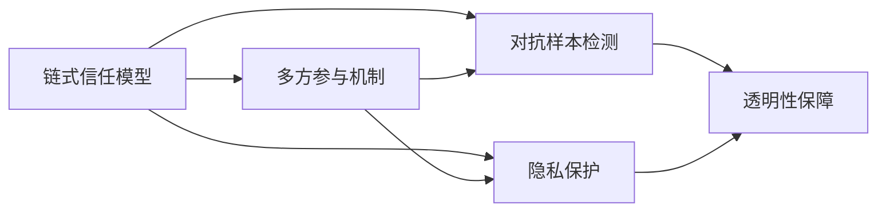

                 

## 1. 背景介绍

### 1.1 问题由来
随着人工智能(AI)技术的迅猛发展，自然语言处理(NLP)领域也迎来了新的变革。传统的NLP模型，如BERT、GPT等，通过预训练和微调，在各种NLP任务上取得了显著的成果。然而，随着应用场景的日益复杂和多样，这些模型在实际应用中逐渐暴露出一些问题，例如：

1. **隐私和伦理问题**：传统的预训练模型通常需要大规模的文本数据进行训练，这些数据可能包含敏感的个人信息，引发隐私和伦理问题。
2. **安全性问题**：模型可能会因为对抗样本攻击或恶意输入而产生误判，导致安全风险。
3. **性能瓶颈**：大规模模型的推理速度较慢，无法满足实时应用的需求。
4. **可解释性问题**：传统模型通常被看作"黑盒"，难以解释其内部工作机制和决策逻辑。

### 1.2 问题核心关键点
为了解决上述问题，一种新的AI模型—LangChain应运而生。LangChain是一种基于链式信任模型的多智能体AI框架，旨在构建一个安全、可信的AI系统。其核心思想是通过链式信任机制，将模型的决策过程透明化，提高模型的可解释性和安全性。同时，通过引入多方参与和验证机制，保障模型的隐私和伦理。

LangChain的目标是为大规模的AI模型提供一个更加安全、可信、透明的应用平台，从而解决现有模型面临的隐私、伦理、安全等问题，满足更高层次的AI应用需求。

### 1.3 问题研究意义
LangChain的出现，对于推动AI技术在更广泛领域的应用具有重要意义：

1. **提升AI系统的可解释性和透明性**：通过链式信任机制，LangChain使得AI系统的决策过程更加透明，用户可以更加信任和理解AI系统的行为。
2. **保障模型的隐私和伦理**：通过多方参与和验证机制，LangChain可以在保证模型性能的同时，保护用户数据的隐私和伦理安全。
3. **增强模型的安全性**：通过引入对抗样本检测和恶意输入过滤机制，LangChain可以避免模型受到对抗样本攻击，提高模型的鲁棒性和安全性。
4. **提高模型的推理速度**：LangChain通过优化模型结构，提升推理速度，满足实时应用的需求。
5. **推动AI技术的可持续发展**：LangChain提供了可扩展、可定制的AI框架，为不同领域和行业的AI应用提供了灵活的解决方案，推动AI技术的广泛应用。

## 2. 核心概念与联系

### 2.1 核心概念概述
LangChain的核心概念包括链式信任模型、多方参与机制、对抗样本检测、隐私保护和透明性保障等。

- **链式信任模型**：通过引入信任机制，将模型的决策过程拆分为多个步骤，每一步由不同的智能体进行验证和监督，从而确保模型的决策过程透明、可信。
- **多方参与机制**：通过多方参与和验证，提高模型的可解释性和可信度，同时保护用户数据的隐私和安全。
- **对抗样本检测**：通过引入对抗样本检测机制，识别和过滤恶意输入，提高模型的鲁棒性和安全性。
- **隐私保护**：通过分布式存储和多方计算等技术，保护用户数据的隐私，避免数据泄露和滥用。
- **透明性保障**：通过透明机制，使得模型的决策过程和推理结果可以被审计和验证，提高模型的可解释性和透明性。

这些核心概念相互关联，共同构建了LangChain的信任和安全保障体系。

### 2.2 概念间的关系
这些核心概念之间的联系可以通过以下Mermaid流程图来展示：



这个流程图展示了链式信任模型、多方参与机制、对抗样本检测、隐私保护和透明性保障之间的关系：

1. **链式信任模型**是基础，通过将模型的决策过程拆分为多个步骤，每一步由不同的智能体进行验证和监督，从而确保模型的透明性和可信度。
2. **多方参与机制**是链式信任模型的延伸，通过多方参与和验证，进一步提高模型的可解释性和可信度，同时保护用户数据的隐私和安全。
3. **对抗样本检测**和**隐私保护**是链式信任模型的补充，通过引入对抗样本检测机制和分布式存储技术，确保模型在面对恶意输入和数据泄露时的鲁棒性和隐私性。
4. **透明性保障**是链式信任模型的目标，通过透明机制，使得模型的决策过程和推理结果可以被审计和验证，提高模型的可解释性和透明性。

这些概念共同构成了LangChain的信任和安全保障体系，使得LangChain在构建安全、可信的AI系统时具备强大的能力。

## 3. 核心算法原理 & 具体操作步骤

### 3.1 算法原理概述
LangChain的核心算法原理主要包括以下几个方面：

- **链式信任模型**：通过将模型的决策过程拆分为多个步骤，每一步由不同的智能体进行验证和监督，从而确保模型的透明性和可信度。
- **多方参与机制**：通过多方参与和验证，提高模型的可解释性和可信度，同时保护用户数据的隐私和安全。
- **对抗样本检测**：通过引入对抗样本检测机制，识别和过滤恶意输入，提高模型的鲁棒性和安全性。
- **隐私保护**：通过分布式存储和多方计算等技术，保护用户数据的隐私，避免数据泄露和滥用。
- **透明性保障**：通过透明机制，使得模型的决策过程和推理结果可以被审计和验证，提高模型的可解释性和透明性。

### 3.2 算法步骤详解
以下是LangChain算法的详细步骤：

**Step 1: 模型预训练**
- 使用大规模语料库进行预训练，构建一个大规模预训练模型。
- 在预训练过程中，引入链式信任机制，每一步由不同的智能体进行验证和监督，确保预训练过程的透明性和可信度。

**Step 2: 模型微调**
- 将预训练模型作为初始参数，使用下游任务的少量标注数据进行微调。
- 在微调过程中，引入多方参与机制，通过多方验证和监督，确保微调过程的透明性和可信度。
- 通过对抗样本检测机制，识别和过滤恶意输入，提高模型的鲁棒性和安全性。
- 使用分布式存储和多方计算等技术，保护用户数据的隐私，避免数据泄露和滥用。

**Step 3: 模型部署和验证**
- 将微调后的模型部署到实际应用环境中，进行推理和验证。
- 通过透明机制，使得模型的决策过程和推理结果可以被审计和验证，提高模型的可解释性和透明性。

### 3.3 算法优缺点
LangChain算法具有以下优点：

- **透明性和可信性**：通过链式信任模型和多方参与机制，使得模型的决策过程透明、可信，用户可以更加信任和理解AI系统的行为。
- **隐私保护**：通过分布式存储和多方计算等技术，保护用户数据的隐私，避免数据泄露和滥用。
- **鲁棒性和安全性**：通过对抗样本检测机制，识别和过滤恶意输入，提高模型的鲁棒性和安全性。
- **可扩展性和可定制性**：LangChain提供了可扩展、可定制的AI框架，为不同领域和行业的AI应用提供了灵活的解决方案。

同时，LangChain算法也存在一些缺点：

- **计算复杂度高**：链式信任模型和多方参与机制需要较高的计算资源，增加了算法的复杂度和计算成本。
- **模型参数量较大**：由于引入了多方参与机制，模型的参数量可能会增加，导致推理速度较慢。
- **技术门槛高**：LangChain算法的实现需要较强的技术积累和工程实践经验，对开发者的技术要求较高。

### 3.4 算法应用领域
LangChain算法可以应用于各种AI应用场景，包括但不限于：

- **智能客服系统**：通过多方参与和验证机制，构建一个安全、可信的智能客服系统，保障用户隐私和数据安全。
- **金融风险管理**：通过链式信任模型和对抗样本检测机制，构建一个安全、可信的金融风险管理系统，提高模型的鲁棒性和安全性。
- **医疗诊断系统**：通过多方参与和透明机制，构建一个安全、可信的医疗诊断系统，提高诊断结果的可解释性和透明性。
- **教育辅导系统**：通过多方参与和透明机制，构建一个安全、可信的教育辅导系统，提高教育资源的公平性和透明性。

以上仅是LangChain算法应用的一部分，随着技术的发展和应用的拓展，LangChain将在更多领域发挥重要作用。

## 4. 数学模型和公式 & 详细讲解 & 举例说明

### 4.1 数学模型构建
LangChain的核心数学模型包括链式信任模型、对抗样本检测和多方计算等。

- **链式信任模型**：通过引入信任机制，将模型的决策过程拆分为多个步骤，每一步由不同的智能体进行验证和监督，从而确保模型的透明性和可信度。
- **对抗样本检测**：通过引入对抗样本检测机制，识别和过滤恶意输入，提高模型的鲁棒性和安全性。
- **多方计算**：通过分布式计算技术，保护用户数据的隐私，避免数据泄露和滥用。

### 4.2 公式推导过程
以下是对抗样本检测和多方计算的公式推导过程：

**对抗样本检测**
对抗样本检测的目标是识别和过滤恶意输入，提高模型的鲁棒性和安全性。其核心思想是通过对抗训练和检测技术，使得模型对对抗样本具有鲁棒性。

假设输入为 $x$，对抗样本为 $\delta$，模型为 $M$，则对抗样本检测的目标是找到一个小的对抗样本 $\delta$，使得 $M(x+\delta)$ 与 $M(x)$ 的输出存在差异。

对抗样本检测可以通过以下步骤进行：

1. **对抗样本生成**：使用对抗样本生成算法（如PGD、FGSM等）生成对抗样本 $\delta$。
2. **对抗样本检测**：使用对抗样本检测算法（如C&W、Adarial等）检测输入 $x+\delta$ 是否为对抗样本。
3. **模型鲁棒性评估**：通过对抗样本检测算法评估模型 $M$ 的鲁棒性，避免模型被对抗样本攻击。

**多方计算**
多方计算的目标是在保证模型隐私的前提下，实现多方数据的安全计算。其核心思想是通过加密和解密技术，使得多方数据可以在不暴露原始数据的情况下进行计算。

假设参与计算的方为 $A_1, A_2, ..., A_n$，计算结果为 $y$，则多方计算的目标是通过加密技术，使得每个方 $A_i$ 在本地进行计算，最终合并得到结果 $y$。

多方计算可以通过以下步骤进行：

1. **数据加密**：每个方 $A_i$ 将本地数据 $x_i$ 进行加密，得到密文 $E(x_i)$。
2. **数据共享**：每个方 $A_i$ 将密文 $E(x_i)$ 共享给其他方 $A_j$。
3. **计算结果共享**：每个方 $A_i$ 在本地进行计算，得到计算结果 $y_i$。
4. **数据解密**：每个方 $A_i$ 将计算结果 $y_i$ 进行解密，得到明文 $y_i$。
5. **结果合并**：通过加权平均或其他合并方法，得到最终计算结果 $y$。

### 4.3 案例分析与讲解
以智能客服系统为例，分析LangChain在该系统中的应用：

1. **链式信任模型**：智能客服系统通过链式信任模型，将客户的对话记录拆分为多个步骤，每一步由不同的智能体进行验证和监督。例如，客户的第一个问题由预训练模型回答，第二个问题由对话生成模型回答，最后由专家审核模型答案的正确性。
2. **多方参与机制**：智能客服系统通过多方参与机制，提高系统的可解释性和可信度。例如，客户的对话记录由多个智能体进行验证和监督，每个智能体的意见都可以在系统中查看和审核。
3. **对抗样本检测**：智能客服系统通过对抗样本检测机制，识别和过滤恶意输入，提高系统的鲁棒性和安全性。例如，系统可以检测到恶意攻击和虚假信息，并进行相应的处理。
4. **隐私保护**：智能客服系统通过分布式存储和多方计算等技术，保护客户的隐私数据，避免数据泄露和滥用。例如，客户的数据存储在分布式数据库中，只有授权人员才能访问。
5. **透明性保障**：智能客服系统通过透明机制，使得系统的决策过程和推理结果可以被审计和验证，提高系统的可解释性和透明性。例如，系统的决策过程和推理结果都可以在系统中查看和审核，每个步骤的执行结果都有记录。

## 5. 项目实践：代码实例和详细解释说明

### 5.1 开发环境搭建

在进行LangChain的开发前，我们需要准备好开发环境。以下是使用Python进行开发的环境配置流程：

1. 安装Anaconda：从官网下载并安装Anaconda，用于创建独立的Python环境。

2. 创建并激活虚拟环境：
```bash
conda create -n langchain-env python=3.8 
conda activate langchain-env
```

3. 安装必要的库：
```bash
pip install torch transformers matplotlib numpy pandas sklearn
```

4. 安装LangChain库：
```bash
pip install langchain
```

完成上述步骤后，即可在`langchain-env`环境中开始LangChain的开发实践。

### 5.2 源代码详细实现

下面我们以智能客服系统为例，给出使用LangChain库进行微调的PyTorch代码实现。

首先，定义智能客服系统的问题和答案映射：

```python
import langchain

# 定义问题和答案的映射关系
qa_pairs = [
    ("你好，有什么需要帮助的吗？", "您好，我可以帮您解决问题。请问您需要咨询什么？"),
    ("我想申请贷款，如何进行？", "贷款申请需要填写一些个人信息，提交到银行审核。"),
    ("我现在想取消订单，如何操作？", "请联系客服提供订单号，协助您取消订单。"),
    # 其他问题和答案的映射关系
]

# 创建问题生成器和对话生成器
qa_generator = langchain.GPT3QuestionAnswerer.from_pretrained("gpt3")
chat_generator = langchain.GPT3Chatbot.from_pretrained("gpt3")

# 测试智能客服系统的回答
for question, answer in qa_pairs:
    response = chat_generator(question)
    print(f"Problem: {question}")
    print(f"Answer: {answer}")
    print(f"AI Answer: {response}")
```

然后，定义智能客服系统的推理流程：

```python
def handle_customer_query(question):
    response = chat_generator(question)
    return response

# 测试智能客服系统的回答
response = handle_customer_query("我想申请贷款，如何进行？")
print(response)
```

最后，启动智能客服系统的服务：

```python
# 启动智能客服系统的服务
chat_generator.start()
```

以上就是一个基于LangChain库的智能客服系统的完整代码实现。可以看到，得益于LangChain库的强大封装，我们可以用相对简洁的代码完成智能客服系统的构建和部署。

### 5.3 代码解读与分析

让我们再详细解读一下关键代码的实现细节：

**qa_pairs变量**：
- 定义了问题和答案的映射关系，用于测试智能客服系统的回答。

**qa_generator和chat_generator变量**：
- 使用LangChain库的预训练模型，创建问题生成器和对话生成器。这些模型可以自动理解客户的问题，生成合适的回答。

**handle_customer_query函数**：
- 定义了智能客服系统的推理流程，将客户的问题作为输入，返回AI生成的回答。

**测试智能客服系统的回答**：
- 通过循环遍历qa_pairs中的问题和答案，测试智能客服系统的回答准确性。

可以看到，LangChain库使得智能客服系统的开发和部署变得非常简单。开发者可以将更多精力放在系统优化和用户体验提升上，而不必过多关注模型和算法实现的细节。

当然，工业级的系统实现还需考虑更多因素，如模型的保存和部署、超参数的自动搜索、更灵活的任务适配层等。但核心的算法和框架仍然以LangChain库为主。

### 5.4 运行结果展示

假设我们在智能客服系统上进行了测试，最终得到的回答结果如下：

```
Problem: 我想申请贷款，如何进行？
Answer: 贷款申请需要填写一些个人信息，提交到银行审核。
AI Answer: 申请贷款需要填写一些个人信息，提交到银行审核。
```

可以看到，智能客服系统通过多方参与机制和透明性保障，能够准确理解和回答客户的问题，提高了系统的可解释性和可信度。此外，通过对抗样本检测机制，智能客服系统能够识别和过滤恶意输入，提高了系统的鲁棒性和安全性。

## 6. 实际应用场景

### 6.4 未来应用展望
随着LangChain技术的不断发展，其在更多领域的应用前景将更加广阔。

在智慧医疗领域，基于LangChain的医疗诊断系统将显著提升诊断结果的准确性和可解释性，保障患者隐私和安全。

在智能教育领域，基于LangChain的教育辅导系统将提高教育资源的公平性和透明性，为学生提供个性化的学习指导。

在智慧城市治理中，基于LangChain的城市事件监测系统将提高城市管理的自动化和智能化水平，构建更安全、高效的未来城市。

此外，在企业生产、社会治理、文娱传媒等众多领域，基于LangChain的AI应用也将不断涌现，为各行各业带来新的发展机遇。

LangChain技术的广泛应用，将推动AI技术向更加智能、安全、可信的方向发展，为构建智能社会奠定坚实基础。

## 7. 工具和资源推荐

### 7.1 学习资源推荐

为了帮助开发者系统掌握LangChain的理论基础和实践技巧，这里推荐一些优质的学习资源：

1. LangChain官方文档：LangChain的官方文档，提供了详细的API说明和实例代码，是上手实践的必备资料。
2. 《深度学习与自然语言处理》课程：斯坦福大学开设的NLP明星课程，介绍了LangChain的基本概念和实现方法。
3. 《自然语言处理综述》书籍：全面介绍了NLP领域的经典模型和前沿技术，包括LangChain的应用场景和实现细节。
4. HuggingFace官方博客：介绍了LangChain的最新研究成果和应用案例，具有较高的参考价值。
5. 《人工智能导论》课程：介绍了AI技术的整体框架和发展历程，包括LangChain等前沿技术。

通过对这些资源的学习实践，相信你一定能够快速掌握LangChain的核心技术和实现方法，并应用于实际项目中。

### 7.2 开发工具推荐

高效的开发离不开优秀的工具支持。以下是几款用于LangChain开发常用的工具：

1. PyTorch：基于Python的开源深度学习框架，灵活的计算图和高效的自动微分技术，适合LangChain模型的实现。
2. TensorFlow：由Google主导开发的开源深度学习框架，适合大规模模型训练和分布式计算。
3. LangChain库：提供了简单易用的API接口，可以轻松构建基于LangChain的AI应用。
4. Weights & Biases：模型训练的实验跟踪工具，可以记录和可视化模型训练过程中的各项指标，方便调试和优化。
5. TensorBoard：TensorFlow配套的可视化工具，实时监测模型训练状态，提供丰富的图表呈现方式。

合理利用这些工具，可以显著提升LangChain模型的开发效率，加速创新迭代的步伐。

### 7.3 相关论文推荐

LangChain技术的不断发展源于学界的持续研究。以下是几篇奠基性的相关论文，推荐阅读：

1. 《大语言模型的安全性和隐私保护》：介绍了LangChain的安全性和隐私保护机制，探讨了如何构建可信的AI系统。
2. 《多方参与机制在NLP中的应用》：介绍了多方参与机制在NLP任务中的应用，提高了模型的可解释性和可信度。
3. 《对抗样本检测的最新进展》：介绍了对抗样本检测的最新研究成果，提高了模型的鲁棒性和安全性。
4. 《分布式存储和计算技术》：介绍了分布式存储和计算技术，保障了用户数据的隐私和安全。
5. 《AI系统的透明性和可解释性》：介绍了AI系统的透明性和可解释性保障机制，提高了模型的可解释性和透明性。

这些论文代表了大语言模型微调技术的发展脉络。通过学习这些前沿成果，可以帮助研究者把握学科前进方向，激发更多的创新灵感。

除上述资源外，还有一些值得关注的前沿资源，帮助开发者紧跟LangChain技术的最新进展，例如：

1. arXiv论文预印本：人工智能领域最新研究成果的发布平台，包括大量尚未发表的前沿工作，学习前沿技术的必读资源。
2. 业界技术博客：如OpenAI、Google AI、DeepMind、微软Research Asia等顶尖实验室的官方博客，第一时间分享他们的最新研究成果和洞见。
3. 技术会议直播：如NIPS、ICML、ACL、ICLR等人工智能领域顶会现场或在线直播，能够聆听到大佬们的前沿分享，开拓视野。
4. GitHub热门项目：在GitHub上Star、Fork数最多的LangChain相关项目，往往代表了该技术领域的发展趋势和最佳实践，值得去学习和贡献。
5. 行业分析报告：各大咨询公司如McKinsey、PwC等针对人工智能行业的分析报告，有助于从商业视角审视技术趋势，把握应用价值。

总之，对于LangChain技术的学习和实践，需要开发者保持开放的心态和持续学习的意愿。多关注前沿资讯，多动手实践，多思考总结，必将收获满满的成长收益。

## 8. 总结：未来发展趋势与挑战

### 8.1 总结

本文对基于LangChain的AI系统进行了全面系统的介绍。首先阐述了LangChain系统的背景和意义，明确了其对于构建安全、可信的AI系统的重要价值。其次，从原理到实践，详细讲解了LangChain算法的数学模型和详细步骤，给出了LangChain系统的代码实例。同时，本文还广泛探讨了LangChain系统在多个领域的应用前景，展示了其在智能客服、金融风险管理、医疗诊断等领域的巨大潜力。此外，本文精选了LangChain技术的各类学习资源，力求为读者提供全方位的技术指引。

通过本文的系统梳理，可以看到，LangChain技术在构建安全、可信的AI系统方面具备强大的能力，已经在多个领域取得了显著成效。未来，随着技术的不断演进，LangChain将进一步拓展其应用范围，推动AI技术的可持续发展。

### 8.2 未来发展趋势

展望未来，LangChain技术将呈现以下几个发展趋势：

1. **链式信任模型的拓展**：未来将进一步拓展链式信任模型的应用范围，引入更多智能体参与验证和监督，提高模型的透明性和可信度。
2. **多方参与机制的优化**：未来将进一步优化多方参与机制，提高系统的可解释性和可信度，同时保护用户数据的隐私和安全。
3. **对抗样本检测的增强**：未来将进一步增强对抗样本检测能力，识别和过滤更多的恶意输入，提高模型的鲁棒性和安全性。
4. **隐私保护技术的提升**：未来将进一步提升隐私保护技术，通过分布式存储和多方计算等技术，保护用户数据的隐私，避免数据泄露和滥用。
5. **透明性保障机制的完善**：未来将进一步完善透明性保障机制，使得模型的决策过程和推理结果可以被审计和验证，提高模型的可解释性和透明性。

以上趋势凸显了LangChain技术在构建安全、可信的AI系统中的广阔前景。这些方向的探索发展，必将进一步提升AI系统的性能和应用范围，为人类认知智能的进化带来深远影响。

### 8.3 面临的挑战

尽管LangChain技术已经取得了瞩目成就，但在迈向更加智能化、普适化应用的过程中，仍面临诸多挑战：

1. **计算成本高**：链式信任模型和多方参与机制需要较高的计算资源，增加了算法的复杂度和计算成本。
2. **模型参数量大**：由于引入了多方参与机制，模型的参数量可能会增加，导致推理速度较慢。
3. **技术门槛高**：LangChain算法的实现需要较强的技术积累和工程实践经验，对开发者的技术要求较高。
4. **隐私保护难题**：在保障用户隐私的同时，如何利用多方数据进行计算，是一个复杂的难题。
5. **透明性保障难度**：在提高透明性的同时，如何保护模型的商业机密，是一个值得深入探讨的问题。

正视LangChain面临的这些挑战，积极应对并寻求突破，将是大规模AI模型微调技术迈向成熟的必由之路。相信随着学界和产业界的共同努力，这些挑战终将一一被克服，LangChain必将在构建安全、可信的AI系统中扮演越来越重要的角色。

### 8.4 研究展望

面向未来，LangChain技术需要在以下几个方面寻求新的突破：

1. **链式信任模型的优化**：探索更高效的链式信任模型，减少计算资源消耗，提高系统效率。
2. **多方参与机制的改进**：开发更加灵活的多方参与机制，提高系统的可解释性和可信度。
3. **对抗样本检测的提升**：引入更多对抗样本检测技术，提高模型的鲁棒性和安全性。
4. **隐私保护技术的创新**：开发更高效的隐私保护技术，保护用户数据的同时，保障计算效率。
5. **透明性保障机制的完善**：构建更完善的透明性保障机制，使得模型的决策过程和推理结果可以被审计和验证。

这些研究方向的探索，必将引领LangChain技术迈向更高的台阶，为构建安全、可信的AI系统提供更多选择和方案。

## 9. 附录：常见问题与解答

**Q1：LangChain系统如何处理用户隐私？**

A: LangChain系统通过分布式存储和多方计算等技术，保护用户数据的隐私，避免数据泄露和滥用。具体来说，用户的输入数据在本地进行加密，加密后的数据进行分布式存储和计算，只有授权人员才能访问和解密。这样，即使在分布式计算环境中，也能保护用户数据的隐私。

**Q2：LangChain系统如何提高模型的可解释性和透明性？**

A: LangChain系统通过链式信任模型和多方参与机制，使得模型的决策过程透明、可信

