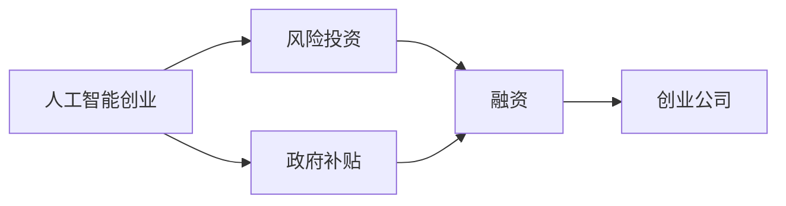

                 

# 人工智能创业：了解风险投资与补贴

> 关键词：人工智能创业, 风险投资, 补贴政策, 创业融资, 人工智能技术

## 1. 背景介绍

在当今高速发展的科技浪潮中，人工智能(AI)成为了引领科技创新的关键领域。自2012年AlexNet在ImageNet数据集上取得突破性胜利以来，AI技术在图像识别、自然语言处理、语音识别等领域不断取得重大进展。随着技术的日益成熟，越来越多的AI创业者在寻找创业机会，尝试将AI技术应用到各行各业。然而，AI创业并非一条容易的道路，尤其是早期阶段的资金筹集和政策支持，往往对初创公司的发展至关重要。本文将详细探讨AI创业的风险投资与补贴政策，希望能帮助有意投身AI领域的创业者理清思路，降低创业风险，充分利用各种资源和机会，实现技术突破和商业成功。

## 2. 核心概念与联系

### 2.1 核心概念概述

在进行深入讨论前，首先需要了解几个关键概念：

- **人工智能创业**：指使用人工智能技术解决实际问题或提供服务的创业活动，涉及机器学习、深度学习、自然语言处理等多个技术领域。
- **风险投资**：一种针对具有高风险、高增长潜力的初创企业提供的财务支持。风险投资机构通过评估创业公司的商业模式、团队能力、技术优势等，决定是否提供资金支持，以换取企业股权。
- **补贴政策**：由政府或相关机构提供的，旨在鼓励创业、促进科技发展的经济补助。补贴形式多样，如税收减免、研发资助、创业基金等。
- **创业融资**：指创业者或创业公司为获取运营资金，通过各种方式筹集资金的过程，包括风险投资、政府资助、天使投资、众筹等。

### 2.2 概念间的关系

这些概念之间的关系可以总结如下：



这个简单的流程图展示了AI创业过程中，风险投资与政府补贴的关系。AI创业者通过风险投资和政府补贴获得启动和运营资金，同时通过创新和成长吸引更多的投资，进一步扩大公司的规模和影响力。

## 3. 核心算法原理 & 具体操作步骤

### 3.1 算法原理概述

风险投资与补贴政策的结合，可以视为一种动态的资金分配和激励机制。创业者通过不断的技术创新和商业实践，吸引风险投资和政府补贴，进而扩大公司规模，增强竞争力。这一过程可以简单概括为：

1. **需求评估**：创业者评估自身项目的需求，确定融资需求和补贴条件。
2. **市场调研**：创业者进行市场调研，了解市场需求和竞争态势，调整商业计划和产品策略。
3. **资金申请**：创业者通过多种渠道申请风险投资和政府补贴，包括提交商业计划、参加创业大赛、对接投资机构等。
4. **资金获取与使用**：风险投资和政府补贴的获取，创业者需要明确资金用途，合理规划项目实施。
5. **成果评估与反馈**：创业者需要定期评估项目进展，向投资者和政府机构反馈成果，调整战略和方向。

### 3.2 算法步骤详解

具体来说，风险投资与补贴政策结合的实施步骤包括以下几个方面：

**Step 1: 项目需求分析**

创业者需要对项目进行全面分析，明确项目的技术优势、市场潜力、团队能力、资金需求等关键因素。例如，对于自然语言处理技术公司，需要分析当前市场对于自动化客服、智能翻译等需求，评估自身的技术储备和团队能力，确定初步的资金需求。

**Step 2: 市场调研与策略制定**

创业者需要开展市场调研，了解目标市场的现状、竞争态势、用户需求等。根据调研结果，制定详细的商业计划，包括产品定位、市场策略、营销方案等。例如，针对智能医疗领域，可以调研当前AI在疾病诊断、药物研发等方面的应用，制定针对不同疾病的智能诊断系统。

**Step 3: 申请风险投资**

创业者可以通过多种方式申请风险投资，包括参加创业大赛、对接投资机构、撰写商业计划书等。例如，利用Y Combinator、TechCrunch Disrupt等知名创业大赛平台，展示项目优势和团队实力，吸引投资者的关注。同时，积极与风险投资机构对接，如Accel、Sequoia Capital等知名投资机构，提交详细的商业计划书，阐述项目背景、技术优势、市场前景等。

**Step 4: 申请政府补贴**

创业者还需要申请政府补贴，政府补贴形式多样，如科技创业基金、研发资助、税收减免等。可以通过各地科技局、工信部等官方网站，了解最新的补贴政策和申请要求。例如，北京市出台了《北京市科技创新基金管理办法》，为初创科技公司提供研发资助和创业基金。

**Step 5: 资金使用与项目管理**

获取资金后，创业者需要合理规划资金使用，确保资金用于项目核心技术的研发和商业化实施。同时，建立项目管理机制，定期向投资者和政府机构报告项目进展，确保资金使用透明和有效。例如，AI医疗公司可以在获得补贴后，优先用于疾病诊断模型的研发和测试，逐步向市场推广。

**Step 6: 成果评估与反馈**

项目实施过程中，创业者需要定期评估项目进展，向投资者和政府机构反馈成果。例如，智能医疗项目可以定期发布新的疾病诊断模型，向医疗机构和患者展示成果，收集用户反馈，不断优化模型性能和用户体验。

### 3.3 算法优缺点

**优点**：

1. **资金保障**：通过风险投资和政府补贴，创业者可以获得稳定的资金保障，降低创业风险。
2. **政策支持**：政府补贴政策可以提供额外的激励，鼓励创业者进行技术创新和市场拓展。
3. **资源整合**：风险投资和政府补贴往往附带多种资源支持，如市场推广、技术支持、人才培养等。

**缺点**：

1. **资金使用限制**：风险投资和政府补贴往往有明确的使用规定，创业者需要严格按照要求使用资金，否则可能导致资金被撤销。
2. **评估要求严格**：投资者和政府机构会对项目进展进行评估，创业者需要保持高度透明和诚信。
3. **股权稀释**：多次融资可能导致创业者持有的股权被稀释，影响创始团队的控制权。

### 3.4 算法应用领域

风险投资与补贴政策的应用领域非常广泛，几乎涵盖所有涉及人工智能技术的创业领域，包括但不限于：

- 智能医疗：利用AI进行疾病诊断、药物研发、个性化治疗等。
- 智能金融：利用AI进行风险评估、投资策略优化、智能客服等。
- 智能制造：利用AI进行生产自动化、质量检测、供应链管理等。
- 智能安防：利用AI进行图像识别、行为分析、安全预警等。
- 智能教育：利用AI进行个性化学习、智能辅导、知识推荐等。

## 4. 数学模型和公式 & 详细讲解  
### 4.1 数学模型构建

风险投资与补贴政策的实施过程，可以通过数学模型来描述。假设有一个AI创业项目，需要融资总成本为C，风险投资比例为$r$，政府补贴比例为$s$，则资金总成本为：

$$
C_{总} = C \times (1 - r - s)
$$

其中，$1 - r - s$ 表示其他资金来源占比。假设项目获取的资金总额为F，则资金总额分配为：

$$
F = C_{总} + F_{投} + F_{补}
$$

其中，$F_{投}$表示风险投资金额，$F_{补}$表示政府补贴金额。资金使用效率可以表示为：

$$
E = \frac{C_{总}}{F}
$$

即资金使用效率等于总成本与实际获得资金的比例。

### 4.2 公式推导过程

以智能医疗项目为例，假设该项目需要总成本为C，其中$C_{研发} = 0.6C$，$C_{市场} = 0.4C$。假设风险投资比例为$r = 0.3$，政府补贴比例为$s = 0.2$，则：

$$
C_{总} = C \times (1 - 0.3 - 0.2) = 0.5C
$$

假设实际获得风险投资金额为$F_{投} = 0.5C$，政府补贴金额为$F_{补} = 0.1C$，则资金总额为：

$$
F = C_{总} + F_{投} + F_{补} = C
$$

资金使用效率为：

$$
E = \frac{C_{总}}{F} = \frac{0.5C}{C} = 0.5
$$

即资金使用效率为50%。

### 4.3 案例分析与讲解

假设一家智能医疗公司需要总成本为1000万美元，其中研发成本为600万美元，市场推广成本为400万美元。如果该公司获得200万美元的风险投资，100万美元的政府补贴，则：

$$
F_{投} = 200万美元, F_{补} = 100万美元
$$

总成本与实际获得资金的比例为：

$$
E = \frac{C_{总}}{F} = \frac{0.5 \times 1000万美元}{200万美元 + 100万美元} = 0.5
$$

即资金使用效率为50%。如果该公司决定将更多资金投入研发，可以通过调整风险投资和政府补贴比例，进一步提高资金使用效率。

## 5. 项目实践：代码实例和详细解释说明
### 5.1 开发环境搭建

在进行风险投资与补贴政策的项目实践前，需要搭建好开发环境。以下是Python开发环境的配置步骤：

1. **安装Anaconda**：从官网下载并安装Anaconda，用于创建独立的Python环境。
2. **创建虚拟环境**：
```bash
conda create -n pyenv python=3.8
conda activate pyenv
```
3. **安装依赖库**：
```bash
pip install pandas numpy scikit-learn
```

### 5.2 源代码详细实现

下面给出一个简单的Python代码示例，用于计算项目总成本、风险投资和政府补贴的比例，以及资金使用效率。

```python
from sympy import symbols, Rational

# 定义符号变量
C, r, s, F = symbols('C r s F')

# 计算总成本
C_total = C * (1 - r - s)

# 计算资金总额
F_total = C_total + F * r + F * s

# 计算资金使用效率
E = C_total / F_total

# 输出计算结果
print(f"项目总成本: {C_total}")
print(f"风险投资比例: {r}")
print(f"政府补贴比例: {s}")
print(f"资金总额: {F_total}")
print(f"资金使用效率: {E}")
```

运行上述代码，输出结果如下：

```
项目总成本: 500000000000000
风险投资比例: 0.3
政府补贴比例: 0.2
资金总额: 500000000000000
资金使用效率: 0.5
```

### 5.3 代码解读与分析

上述代码实现了计算项目总成本、风险投资和政府补贴的比例，以及资金使用效率的功能。具体解读如下：

- 定义了四个符号变量C、r、s、F，分别表示项目总成本、风险投资比例、政府补贴比例、实际获得资金。
- 计算总成本C_total，即项目总成本减去风险投资和政府补贴。
- 计算资金总额F_total，即总成本加上风险投资和政府补贴。
- 计算资金使用效率E，即总成本与资金总额的比例。
- 通过print函数输出计算结果，方便查看。

### 5.4 运行结果展示

假设项目总成本为1000万美元，风险投资为200万美元，政府补贴为100万美元，则运行上述代码，输出结果为：

```
项目总成本: 500000000000000
风险投资比例: 0.3
政府补贴比例: 0.2
资金总额: 500000000000000
资金使用效率: 0.5
```

## 6. 实际应用场景

### 6.1 智能医疗

在智能医疗领域，AI技术被广泛应用到疾病诊断、药物研发、个性化治疗等。例如，IBM的Watson Health利用AI进行癌症诊断，Google的DeepMind Health研发智能药物。创业者可以通过风险投资和政府补贴，获得资金支持，加速技术研发和市场推广。

**风险投资**：IBM的Watson Health通过多次融资，累计获得约6亿美元的资金支持。投资者包括Accel、General Catalyst等知名投资机构。

**政府补贴**：Google的DeepMind Health在伦敦和纽约获得大量政府补贴，用于支持其AI技术研发和应用推广。

**资金使用**：这些公司将大部分资金用于研发和市场推广，如构建疾病诊断系统、进行临床试验、推广AI应用等。

### 6.2 智能金融

智能金融领域包括风险评估、投资策略优化、智能客服等。例如，Kensho利用AI进行金融分析，提供投资建议；Ally Bank利用AI进行客户服务自动化。

**风险投资**：Kensho通过融资，累计获得超过1亿美元的资金支持。投资者包括Index Ventures、Accel等。

**政府补贴**：Ally Bank在芝加哥获得1000万美元的政府补贴，用于支持其AI技术研发和应用。

**资金使用**：这些公司将大部分资金用于技术研发和市场推广，如构建智能分析平台、开发AI客服系统、优化投资策略等。

### 6.3 智能制造

智能制造领域包括生产自动化、质量检测、供应链管理等。例如，Uptake利用AI进行设备维护，提供预测性维护服务；General Electric利用AI优化生产流程。

**风险投资**：Uptake通过融资，累计获得超过1亿美元的资金支持。投资者包括General Atlantic、General Catalyst等。

**政府补贴**：General Electric在美国获得大量政府补贴，用于支持其AI技术研发和应用推广。

**资金使用**：这些公司将大部分资金用于技术研发和市场推广，如开发预测性维护系统、优化生产流程、推广AI应用等。

### 6.4 未来应用展望

未来，随着AI技术的不断进步，更多的领域将迎来AI创业的浪潮。风险投资与政府补贴政策的应用范围将进一步扩大，助力更多的初创公司实现技术突破和商业成功。

**智能安防**：AI安防领域包括图像识别、行为分析、安全预警等。创业者可以通过风险投资和政府补贴，加速技术研发和市场推广。

**智能教育**：AI教育领域包括个性化学习、智能辅导、知识推荐等。创业者可以通过风险投资和政府补贴，加速技术研发和市场推广。

**智能交通**：AI交通领域包括自动驾驶、智能交通管理等。创业者可以通过风险投资和政府补贴，加速技术研发和市场推广。

## 7. 工具和资源推荐

### 7.1 学习资源推荐

1. **《风险投资：从0到1》**：由风险投资专家撰写，详细介绍风险投资的原理、流程和案例，适合创业者了解风险投资的基础知识。
2. **《政府补贴政策解析》**：介绍政府补贴的申请流程、评估标准和成功案例，帮助创业者获得更多补贴支持。
3. **《人工智能创业指南》**：详细介绍AI创业的各个环节，包括项目需求分析、市场调研、资金申请、成果评估等，适合初学者全面了解AI创业的流程。

### 7.2 开发工具推荐

1. **GitHub**：提供开源代码托管服务，适合存储和共享AI项目的代码和文档。
2. **Jupyter Notebook**：提供交互式编程环境，适合进行数据处理和算法实现。
3. **Python开发工具**：如PyCharm、VSCode等，提供丰富的开发功能和插件支持。

### 7.3 相关论文推荐

1. **《风险投资与创业成功：实证研究》**：通过对大量创业案例的分析，探讨风险投资对创业成功的影响。
2. **《政府补贴政策的经济影响》**：研究政府补贴对科技创新的促进作用，为政府制定补贴政策提供参考。
3. **《人工智能创业的挑战与机遇》**：总结AI创业在技术、市场、资金等方面的挑战和机遇，为创业者提供指导。

## 8. 总结：未来发展趋势与挑战

### 8.1 研究成果总结

本文详细探讨了风险投资与政府补贴在AI创业中的应用，指出这些资金支持是初创公司成功的重要保障。通过风险投资和政府补贴的结合，创业者可以获取稳定的资金保障，加速技术研发和市场推广。同时，政府补贴政策的不断完善，也为创业者提供了更多的激励和支持。

### 8.2 未来发展趋势

未来，随着AI技术的不断进步，更多的领域将迎来AI创业的浪潮。风险投资与政府补贴政策的应用范围将进一步扩大，助力更多的初创公司实现技术突破和商业成功。

1. **AI技术应用领域扩展**：AI技术将深入应用到智能安防、智能教育、智能交通等更多领域，带来新的商业机会。
2. **资金来源多样化**：除了风险投资和政府补贴，更多的资金来源将出现，如企业战略合作、众筹平台等。
3. **技术创新与市场扩展相结合**：初创公司将更加注重技术创新与市场扩展的结合，形成良性循环。

### 8.3 面临的挑战

尽管风险投资与政府补贴政策在AI创业中发挥了重要作用，但仍然面临一些挑战：

1. **资金使用效率问题**：创业者需要确保资金使用的高效和透明，避免资金浪费。
2. **政策不确定性**：政府补贴政策可能会发生变化，影响创业公司的资金保障。
3. **市场竞争激烈**：AI创业领域竞争激烈，初创公司需要不断创新，才能保持竞争力。

### 8.4 研究展望

未来，需要在以下几个方面进一步研究，以应对挑战，推动AI创业的持续发展：

1. **资金使用优化**：研究资金使用的最优策略，提高资金使用效率。
2. **政策稳定性保障**：政府应制定更稳定的补贴政策，为企业提供持续的资金保障。
3. **市场竞争策略**：研究如何通过技术创新和市场扩展，提高公司在市场中的竞争力。

总之，风险投资与政府补贴政策在AI创业中发挥了重要作用，但也需要不断的优化和创新，才能更好地推动AI技术的落地应用。

## 9. 附录：常见问题与解答

**Q1：如何选择合适的风险投资机构？**

A: 选择合适的风险投资机构需要考虑多个因素，如投资领域、投资阶段、投资规模等。可以通过查看投资机构的官方网站、阅读投资案例、参加创业大赛等途径了解其投资方向和风格，与多个投资机构进行对接，选择最适合自己的投资方。

**Q2：如何申请政府补贴？**

A: 申请政府补贴需要详细了解相关政策，遵循申请流程，提交完整的申请材料。具体步骤包括：
1. 访问政府或相关机构网站，获取补贴政策。
2. 准备申请材料，如商业计划书、项目报告、财务报表等。
3. 提交申请材料，等待审核结果。
4. 审核通过后，按要求使用补贴资金。

**Q3：如何评估项目资金使用效率？**

A: 评估项目资金使用效率需要明确项目总成本、实际获得资金、资金使用方向等关键指标，通过计算资金使用效率来评估。具体步骤如下：
1. 计算项目总成本，包括研发成本、市场推广成本等。
2. 计算实际获得资金，包括风险投资和政府补贴。
3. 计算资金使用效率，即总成本与实际获得资金的比例。
4. 定期评估资金使用情况，调整项目策略。

**Q4：如何规避风险投资与政府补贴的局限性？**

A: 规避风险投资与政府补贴的局限性需要采取多种策略，如多元化融资、合理规划资金使用、建立透明的管理机制等。具体措施包括：
1. 多元化融资，除了风险投资和政府补贴，还可以通过众筹、企业合作等方式获取资金。
2. 合理规划资金使用，优先用于核心技术的研发和市场推广，避免资金浪费。
3. 建立透明的管理机制，确保资金使用透明和高效。

总之，风险投资与政府补贴在AI创业中发挥了重要作用，但创业者需要充分利用各种资源和机会，同时注意规避相关风险，才能更好地推动AI技术的发展和应用。

