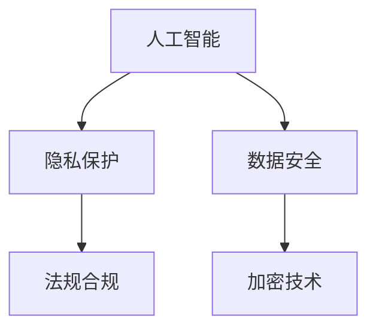
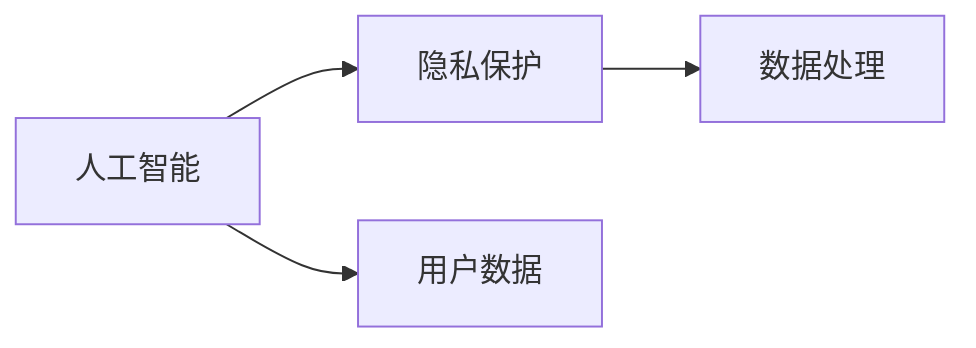
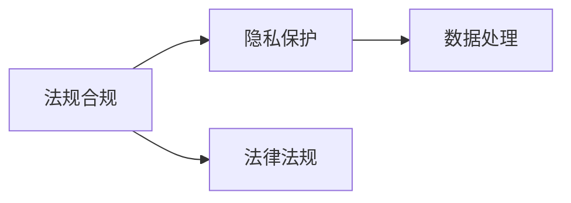
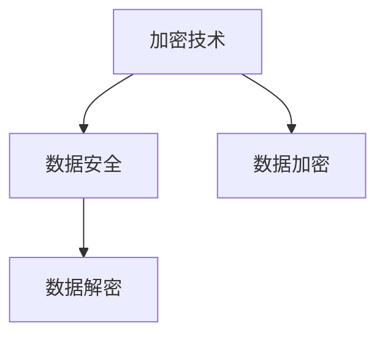
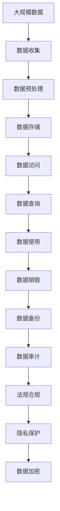

                 

# 人工智能创业：隐私保护的措施

> 关键词：人工智能, 隐私保护, 数据安全, 法规合规, 加密技术

## 1. 背景介绍

### 1.1 问题由来
随着人工智能技术的飞速发展，人工智能创业公司层出不穷。但与此同时，隐私保护问题也日益突出。随着各国法律法规对数据隐私的重视，如何在保护用户隐私的前提下，充分利用数据提升人工智能应用效果，成为创业公司必须面对的挑战。

### 1.2 问题核心关键点
人工智能创业公司需要处理大量用户数据，如用户画像、行为数据、语音和图像等。这些数据在提升模型性能、改善用户体验的同时，也带来了隐私泄露和数据滥用的风险。特别是在医疗、金融、教育等敏感领域，隐私保护尤为重要。因此，如何在保护隐私的同时，提升人工智能应用的性能和用户体验，成为隐私保护措施的核心关键点。

### 1.3 问题研究意义
隐私保护措施对于提升人工智能创业公司的市场信任度和用户接受度，具有重要意义。良好的隐私保护不仅能帮助公司规避法律风险，还能增强用户信任，提升用户粘性。同时，隐私保护也能帮助公司构建更安全、更可靠的技术体系，降低潜在的恶意攻击风险。

## 2. 核心概念与联系

### 2.1 核心概念概述

为更好地理解隐私保护的措施，本节将介绍几个密切相关的核心概念：

- 人工智能(AI)：以机器学习、深度学习等为代表的技术，通过数据驱动的方式，实现对数据的处理和分析，从而支持决策制定和智能化应用。
- 隐私保护：通过技术手段和管理策略，保障个人数据在收集、存储、传输和处理过程中的安全性和匿名性，避免数据泄露和滥用。
- 数据安全：在数据生命周期内，采取各种技术和措施，保护数据免受未授权访问、破坏和篡改，确保数据完整性和可用性。
- 法规合规：遵循相关法律法规，如GDPR、CCPA等，保障数据处理和使用符合法律规定。
- 加密技术：通过加密算法，对数据进行编码转换，确保数据在传输和存储过程中不被非法获取和篡改。

这些核心概念之间的逻辑关系可以通过以下Mermaid流程图来展示：



这个流程图展示了一些核心概念的相互关系：

1. 人工智能依赖于数据，隐私保护和数据安全确保数据的安全性。
2. 法规合规是数据处理的法律边界。
3. 加密技术是实现隐私保护和数据安全的核心手段。

### 2.2 概念间的关系

这些核心概念之间存在着紧密的联系，形成了隐私保护措施的完整生态系统。下面我通过几个Mermaid流程图来展示这些概念之间的关系。

#### 2.2.1 人工智能与隐私保护的关系



这个流程图展示了人工智能和隐私保护之间的关系：

1. 人工智能依赖于数据，需要收集和使用用户数据。
2. 在数据收集和使用过程中，隐私保护是保障用户数据安全的重要手段。

#### 2.2.2 法规合规与隐私保护的关系



这个流程图展示了法规合规和隐私保护之间的关系：

1. 法规合规是隐私保护的法律依据。
2. 隐私保护是遵守法规合规的具体措施。

#### 2.2.3 加密技术与数据安全的关系



这个流程图展示了加密技术与数据安全之间的关系：

1. 加密技术是实现数据安全的核心手段。
2. 数据加密和解密是保障数据安全的两个关键环节。

### 2.3 核心概念的整体架构

最后，我们用一个综合的流程图来展示这些核心概念在大规模数据处理中的整体架构：



这个综合流程图展示了从数据收集到销毁的整个生命周期内，隐私保护措施的具体应用过程。大规模数据处理中，隐私保护措施贯穿数据处理的全流程，从数据收集到使用、存储、传输、查询、销毁，每个环节都必须严格遵守隐私保护措施。

## 3. 核心算法原理 & 具体操作步骤
### 3.1 算法原理概述

隐私保护的措施主要是通过数据匿名化、差分隐私、同态加密等技术手段，保障数据在处理和使用过程中的安全性。其核心思想是：在保证数据隐私的前提下，尽可能多地利用数据提升模型性能和用户体验。

形式化地，设原始数据集为 $D=\{(x_i,y_i)\}_{i=1}^N$，其中 $x_i$ 为特征向量，$y_i$ 为标签。隐私保护的目标是找到一组变换函数 $f$，使得在变换后的数据集 $D'$ 上训练的模型 $M$ 能够达到与原始数据集 $D$ 上训练的模型 $M'$ 相似的效果，即：

$$
M(D') \approx M(D')
$$

同时满足隐私保护的约束，如差分隐私、数据匿名化等。

### 3.2 算法步骤详解

隐私保护的措施主要包括以下几个关键步骤：

**Step 1: 数据收集与预处理**

1. 收集用户数据：收集用户画像、行为数据、语音和图像等各类数据。
2. 数据预处理：清洗、去重、归一化处理数据，去除噪声和异常值。
3. 数据匿名化：将用户标识信息（如姓名、身份证号、设备ID等）进行匿名化处理，确保数据无法直接识别用户身份。

**Step 2: 数据存储与管理**

1. 安全存储：在本地或云端存储数据，采用加密技术和权限控制，防止未经授权访问。
2. 数据访问控制：制定严格的访问权限管理策略，确保只有授权人员能够访问数据。
3. 数据备份：定期备份数据，确保数据在灾难情况下不丢失。

**Step 3: 差分隐私**

1. 定义隐私预算：确定隐私保护的预算，即允许多少隐私泄露。
2. 数据扰动：通过向数据中添加噪声，使得数据在统计上不可区分具体用户。
3. 隐私预算评估：通过隐私预算评估模型，监控隐私预算的使用情况。

**Step 4: 同态加密**

1. 选择同态加密算法：选择适合同态加密的算法，如RSA、ElGamal等。
2. 同态加密数据：对数据进行加密处理，使其在加密状态下仍可进行计算。
3. 同态解密：对计算结果进行解密，恢复数据原始状态。

**Step 5: 法规合规与审计**

1. 遵循法规合规：在数据处理和使用过程中，确保遵守GDPR、CCPA等法律法规。
2. 定期审计：对数据处理和使用过程进行定期审计，确保隐私保护措施的有效性。

以上是隐私保护措施的一般流程，实际应用中还需要根据具体需求进行调整和优化。

### 3.3 算法优缺点

隐私保护的措施具有以下优点：

1. 提高数据安全性：通过数据匿名化、差分隐私、同态加密等技术手段，确保数据在处理和使用过程中的安全性，防止数据泄露和滥用。
2. 提升用户信任度：通过严格的隐私保护措施，增强用户对数据使用的信任，提升用户粘性和忠诚度。
3. 降低法律风险：遵守相关法律法规，确保数据处理和使用符合法律规定，避免法律纠纷和罚款。

同时，隐私保护措施也存在以下缺点：

1. 数据降维：隐私保护技术往往需要在数据上添加噪声或加密数据，导致数据降维，可能会影响模型性能。
2. 计算复杂度高：隐私保护技术的计算复杂度高，需要高性能计算资源支持。
3. 隐私保护效果有限：在某些场景下，隐私保护措施可能无法完全防止数据泄露，存在一定的风险。

尽管存在这些缺点，但随着技术的不断进步，隐私保护措施将越来越完善，能在数据利用和隐私保护之间找到更好的平衡点。

### 3.4 算法应用领域

隐私保护措施在人工智能创业公司的多个应用领域中具有重要意义：

- 医疗健康：涉及用户隐私的医疗数据，通过隐私保护措施，确保数据在医疗分析和决策中的应用安全。
- 金融服务：金融领域的敏感数据，如用户交易记录、信用记录等，通过隐私保护措施，保护用户隐私同时利用数据提升风控和决策效率。
- 教育培训：学生学习记录和个人信息，通过隐私保护措施，保护学生隐私同时利用数据优化教育过程。
- 智能家居：智能家居设备的用户行为数据，通过隐私保护措施，确保用户隐私同时利用数据优化智能服务。

此外，隐私保护措施也在智能安防、智能交通、智能制造等领域得到了广泛应用。

## 4. 数学模型和公式 & 详细讲解 & 举例说明

### 4.1 数学模型构建

隐私保护的数学模型通常包括差分隐私模型、同态加密模型等。以差分隐私模型为例，其核心思想是在数据中添加噪声，使得在统计上无法区分具体用户，从而保护用户隐私。

设原始数据集为 $D=\{(x_i,y_i)\}_{i=1}^N$，其中 $x_i$ 为特征向量，$y_i$ 为标签。定义噪声函数 $\mathcal{N}$ 为标准正态分布，$\epsilon$ 为隐私预算，差分隐私模型定义如下：

$$
\tilde{D} = D + \mathcal{N}(0,\sigma^2) 
$$

其中 $\sigma^2$ 为噪声强度，与隐私预算 $\epsilon$ 有关。隐私预算 $\epsilon$ 决定了隐私泄露的程度，一般定义如下：

$$
\epsilon = \sqrt{2\ln(1/\delta)/\sigma^2}
$$

其中 $\delta$ 为隐私概率，决定了隐私泄露的可能性。

### 4.2 公式推导过程

以差分隐私模型为例，推导隐私预算 $\epsilon$ 与噪声强度 $\sigma$ 之间的关系：

1. 原始数据集 $D$ 与扰动数据集 $\tilde{D}$ 的均值差异：

$$
\mathbb{E}[||\bar{x}_D - \bar{x}_{\tilde{D}}||]
$$

其中 $\bar{x}_D$ 和 $\bar{x}_{\tilde{D}}$ 分别为原始数据集和扰动数据集的特征均值。

2. 均值差异的上界：

$$
\mathbb{E}[||\bar{x}_D - \bar{x}_{\tilde{D}}||] \leq \frac{\sigma^2}{2} \tag{1}
$$

3. 方差与均值差异的关系：

$$
Var[x] = \mathbb{E}[(x-\mu)^2] = \sigma^2
$$

其中 $\mu$ 为数据的期望值。

4. 隐私预算 $\epsilon$ 与噪声强度 $\sigma$ 的关系：

$$
\epsilon = \sqrt{2\ln(1/\delta)/\sigma^2}
$$

根据上述推导，隐私保护预算 $\epsilon$ 和噪声强度 $\sigma$ 之间存在反比关系，隐私保护预算越小，噪声强度 $\sigma$ 越大。

### 4.3 案例分析与讲解

以医疗领域的隐私保护为例，分析差分隐私模型的应用。

假设某医院收集了 $N=100$ 名患者的健康数据，包括年龄、血压、血糖等。医生需要分析这些数据，预测患者的病情和治疗方案。但由于患者隐私保护的需要，原始数据集 $D$ 无法直接用于分析，需要在数据上添加噪声，得到扰动数据集 $\tilde{D}$。

1. 假设隐私预算 $\epsilon=1$，计算噪声强度 $\sigma$：

$$
\sigma = \sqrt{2\ln(1/\delta)/\epsilon^2} = \sqrt{2\ln(1/0.1)/1^2} \approx 0.797
$$

2. 在数据上添加噪声，得到扰动数据集 $\tilde{D}$：

$$
\tilde{D} = D + \mathcal{N}(0,0.797^2)
$$

3. 利用扰动数据集 $\tilde{D}$ 训练模型，预测患者的病情和治疗方案，同时确保隐私泄露概率 $\delta=0.1$ 满足。

通过差分隐私模型，确保了患者数据在分析过程中不会被泄露，同时模型仍然能够从扰动数据中学习到有用的信息。

## 5. 项目实践：代码实例和详细解释说明

### 5.1 开发环境搭建

在进行隐私保护措施的实践前，我们需要准备好开发环境。以下是使用Python进行PyTorch开发的环境配置流程：

1. 安装Anaconda：从官网下载并安装Anaconda，用于创建独立的Python环境。

2. 创建并激活虚拟环境：
```bash
conda create -n pytorch-env python=3.8 
conda activate pytorch-env
```

3. 安装PyTorch：根据CUDA版本，从官网获取对应的安装命令。例如：
```bash
conda install pytorch torchvision torchaudio cudatoolkit=11.1 -c pytorch -c conda-forge
```

4. 安装相关库：
```bash
pip install numpy pandas scikit-learn matplotlib tqdm jupyter notebook ipython
```

完成上述步骤后，即可在`pytorch-env`环境中开始实践。

### 5.2 源代码详细实现

这里以差分隐私模型为例，给出使用PyTorch进行差分隐私计算的代码实现。

```python
import torch
from torch import nn
from torch.distributions.normal import Normal

class DifferentialPrivacy(nn.Module):
    def __init__(self, epsilon=1.0, delta=0.1):
        super(DifferentialPrivacy, self).__init__()
        self.epsilon = epsilon
        self.delta = delta
        self.noise_dist = Normal(0, torch.sqrt(2 * torch.log(1 / delta) / epsilon**2))

    def forward(self, x):
        noise = self.noise_dist.sample()
        return x + noise

# 示例数据
x = torch.tensor([1, 2, 3, 4, 5])

# 应用差分隐私模型
model = DifferentialPrivacy()
y = model(x)

print(y)
```

### 5.3 代码解读与分析

这里我们详细解读一下关键代码的实现细节：

**DifferentialPrivacy类**：
- `__init__`方法：初始化差分隐私模型的参数，包括隐私预算 $\epsilon$ 和隐私概率 $\delta$。
- `forward`方法：在输入数据上应用差分隐私模型，生成扰动数据。

**示例数据**：
- 定义一个输入数据向量 $x$，用于测试差分隐私模型的效果。

**差分隐私模型应用**：
- 创建一个差分隐私模型实例，并应用到输入数据上，生成扰动数据 $y$。

在运行结果中，我们可以看到，通过差分隐私模型，原始数据 $x$ 被添加上了噪声，得到了扰动数据 $y$。

## 6. 实际应用场景

### 6.1 智能健康管理

智能健康管理平台通过收集用户的健康数据，包括步数、心率、血压等，帮助用户监测和管理健康状况。但由于隐私保护的需要，原始数据集 $D$ 无法直接用于健康分析，需要在数据上添加噪声，得到扰动数据集 $\tilde{D}$。

在健康分析模型中，通过差分隐私模型，确保用户数据在分析过程中不会被泄露，同时模型仍然能够从扰动数据中学习到有用的信息，如用户的日常活动量、睡眠质量等。

### 6.2 金融风控

金融机构需要收集用户的金融交易数据，以进行风险评估和信用评分。但由于隐私保护的需要，原始数据集 $D$ 无法直接用于风控分析，需要在数据上添加噪声，得到扰动数据集 $\tilde{D}$。

在风控模型中，通过差分隐私模型，确保用户数据在分析过程中不会被泄露，同时模型仍然能够从扰动数据中学习到有用的信息，如用户的消费习惯、信用风险等。

### 6.3 智能教育

智能教育平台通过收集学生的学习数据，包括作业提交、课堂互动、学习效果等，帮助教师优化教学过程。但由于隐私保护的需要，原始数据集 $D$ 无法直接用于教育分析，需要在数据上添加噪声，得到扰动数据集 $\tilde{D}$。

在教育分析模型中，通过差分隐私模型，确保学生数据在分析过程中不会被泄露，同时模型仍然能够从扰动数据中学习到有用的信息，如学生的学习行为、兴趣偏好等。

### 6.4 未来应用展望

随着人工智能技术的不断进步，隐私保护措施将越来越完善，将在更多领域得到应用。

在智慧城市治理中，智能城市的数据分析平台通过收集各类城市数据，如交通流量、空气质量、电力消耗等，需要保护用户隐私同时提升数据利用效率。通过差分隐私模型，确保数据在分析过程中不会被泄露，同时模型仍然能够从扰动数据中学习到有用的信息。

在智能制造领域，智能制造系统的数据分析平台通过收集生产设备的数据，如温度、压力、振动等，需要保护用户隐私同时提升生产效率。通过差分隐私模型，确保数据在分析过程中不会被泄露，同时模型仍然能够从扰动数据中学习到有用的信息。

## 7. 工具和资源推荐
### 7.1 学习资源推荐

为了帮助开发者系统掌握隐私保护的理论基础和实践技巧，这里推荐一些优质的学习资源：

1. 《隐私保护基础》系列博文：由隐私保护专家撰写，深入浅出地介绍了隐私保护的基本概念和核心技术。

2. 《数据隐私保护》课程：斯坦福大学开设的隐私保护课程，有Lecture视频和配套作业，带你入门隐私保护的基本概念和经典模型。

3. 《隐私保护理论与实践》书籍：隐私保护领域的前沿著作，全面介绍了隐私保护的理论基础和实践方法，适合深入学习。

4. 《数据隐私保护技术》报告：各大咨询公司发布的隐私保护技术报告，提供了最新的隐私保护技术和实践案例，值得参考。

5. 《隐私保护工具箱》：GitHub上开源的隐私保护工具集，提供了多种隐私保护算法的实现，适合实践学习。

通过对这些资源的学习实践，相信你一定能够快速掌握隐私保护技术的精髓，并用于解决实际的隐私保护问题。

### 7.2 开发工具推荐

高效的开发离不开优秀的工具支持。以下是几款用于隐私保护开发的常用工具：

1. PyTorch：基于Python的开源深度学习框架，灵活动态的计算图，适合快速迭代研究。
2. TensorFlow：由Google主导开发的开源深度学习框架，生产部署方便，适合大规模工程应用。
3. PySyft：隐私保护框架，支持联邦学习和差分隐私，能够在数据不离开本地的情况下进行模型训练。
4. OpenDP：差分隐私框架，支持Python和R语言，提供丰富的差分隐私算法和工具。
5. HuggingFace的隐私保护工具包：提供隐私保护的预训练模型和微调方法，方便快速构建隐私保护应用。

合理利用这些工具，可以显著提升隐私保护措施的开发效率，加快创新迭代的步伐。

### 7.3 相关论文推荐

隐私保护技术的发展源于学界的持续研究。以下是几篇奠基性的相关论文，推荐阅读：

1. Differential Privacy：差分隐私的奠基论文，提出了差分隐私的基本概念和数学定义。
2. Privacy-Preserving Deep Learning：综述性论文，介绍了隐私保护在深度学习中的应用方法。
3. Multi-party Secure Computation：多方安全计算的奠基论文，提出了基于加密技术的隐私保护方法。
4. Secure Multi-party Computation for Machine Learning：应用性论文，介绍了多方安全计算在机器学习中的应用。
5. Privacy-Preserving Deep Learning with Multi-party Secure Computation：将差分隐私和多党安全计算结合，提出了一种隐私保护的深度学习方法。

这些论文代表了大数据隐私保护技术的发展脉络。通过学习这些前沿成果，可以帮助研究者把握学科前进方向，激发更多的创新灵感。

除上述资源外，还有一些值得关注的前沿资源，帮助开发者紧跟隐私保护技术的最新进展，例如：

1. arXiv论文预印本：人工智能领域最新研究成果的发布平台，包括大量尚未发表的前沿工作，学习前沿技术的必读资源。
2. 业界技术博客：如Google AI、IBM Research、Microsoft Research等顶尖实验室的官方博客，第一时间分享他们的最新研究成果和洞见。
3. 技术会议直播：如NIPS、ICML、CVPR等人工智能领域顶会现场或在线直播，能够聆听到大佬们的前沿分享，开拓视野。
4. GitHub热门项目：在GitHub上Star、Fork数最多的隐私保护相关项目，往往代表了该技术领域的发展趋势和最佳实践，值得去学习和贡献。
5. 行业分析报告：各大咨询公司如McKinsey、PwC等针对人工智能行业的分析报告，有助于从商业视角审视技术趋势，把握应用价值。

总之，对于隐私保护技术的学习和实践，需要开发者保持开放的心态和持续学习的意愿。多关注前沿资讯，多动手实践，多思考总结，必将收获满满的成长收益。

## 8. 总结：未来发展趋势与挑战

### 8.1 总结

本文对隐私保护的措施进行了全面系统的介绍。首先阐述了隐私保护的重要性及其在人工智能创业公司中的必要性，明确了隐私保护措施的核心关键点。其次，从原理到实践，详细讲解了差分隐私、同态加密等隐私保护技术的数学原理和关键步骤，给出了隐私保护任务开发的完整代码实例。同时，本文还广泛探讨了隐私保护措施在智能健康管理、金融风控、智能教育等多个行业领域的应用前景，展示了隐私保护措施的巨大潜力。此外，本文精选了隐私保护技术的各类学习资源，力求为读者提供全方位的技术指引。

通过本文的系统梳理，可以看到，隐私保护措施对于保护用户隐私、提升用户信任度和减少法律风险，具有重要意义。良好的隐私保护不仅能帮助公司规避法律风险，还能增强用户信任，提升用户粘性。同时，隐私保护也能帮助公司构建更安全、更可靠的技术体系，降低潜在的恶意攻击风险。

### 8.2 未来发展趋势

展望未来，隐私保护措施将呈现以下几个发展趋势：

1. 差分隐私的普及：差分隐私技术的逐渐成熟，使得差分隐私成为隐私保护的主流方法，被广泛应用于各类数据处理场景。
2. 同态加密的优化：同态加密技术的不断优化，使得其在数据处理中的应用逐渐增多，特别是在加密计算和多方安全计算中。
3. 隐私保护与联邦学习的结合：隐私保护与联邦学习技术的结合，可以实现数据在本地加密处理，保护用户隐私的同时进行模型训练。
4. 隐私保护工具箱的完善：各类隐私保护工具包的不断完善，将进一步降低隐私保护的门槛，使得更多人能够使用隐私保护技术。
5. 隐私保护与智能合约的结合：隐私保护与智能合约技术的结合，可以实现数据共享和隐私保护的动态管理。

以上趋势凸显了隐私保护技术的广阔前景。这些方向的探索发展，必将进一步提升人工智能创业公司的数据利用效率，保护用户隐私，构建更安全、更可靠的技术体系。

### 8.3 面临的挑战

尽管隐私保护措施已经取得了瞩目成就，但在迈向更加智能化、普适化应用的过程中，它仍面临诸多挑战：

1. 隐私保护效果的权衡：如何在保护隐私和利用数据之间找到平衡点，是一个亟待解决的问题。
2. 隐私保护的计算复杂度：隐私保护技术往往需要高性能计算资源支持，如何降低计算复杂度，提高隐私保护效率，是一个重要的研究方向。
3. 隐私保护技术的普及度：尽管隐私保护技术不断发展，但其应用普及度仍然较低，如何降低技术门槛，使得更多人能够使用隐私保护技术，是一个需要解决的问题。
4. 隐私保护技术的安全性：隐私保护技术的安全性，特别是在对抗攻击方面，是一个需要进一步研究的问题。

尽管存在这些挑战，但随着技术的不断进步，隐私保护措施将越来越完善，能在数据利用和隐私保护之间找到更好的平衡点。相信随着学界和产业界的共同努力，这些挑战终将一一被克服，隐私保护措施必将在人工智能创业公司中发挥更大的作用。

### 8.4 研究展望

面对隐私保护措施所面临的种种挑战，未来的研究需要在以下几个方面寻求新的突破：

1. 探索更加高效的差分隐私算法：差分隐私技术是隐私保护的核心，需要开发更加高效的差分隐私算法，在保护隐私的同时，提升数据利用效率。
2. 引入更多的同态加密算法：同态加密技术能够保障数据在处理过程中的安全性，需要引入更多的同态加密算法，提升隐私保护效果。
3. 研究隐私保护与人工智能的结合：隐私保护技术与人工智能的结合，是未来的一个重要研究方向，需要研究如何在隐私保护前提下，提升人工智能应用的性能和效果。
4. 开发隐私保护的自动化工具：自动化工具能够降低隐私保护技术的门槛，需要开发更多隐私保护的自动化工具，使得更多人能够使用隐私保护技术。
5. 增强隐私保护技术的安全性：隐私保护技术的安全性，特别是在对抗攻击方面，是一个亟待解决的问题，需要进一步研究隐私保护技术的安全性。

这些研究方向的探索，必将引领隐私保护技术迈向更高的台阶

