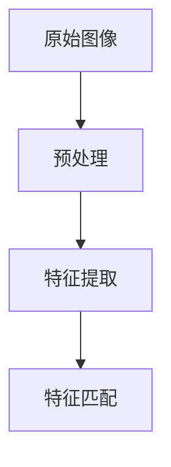
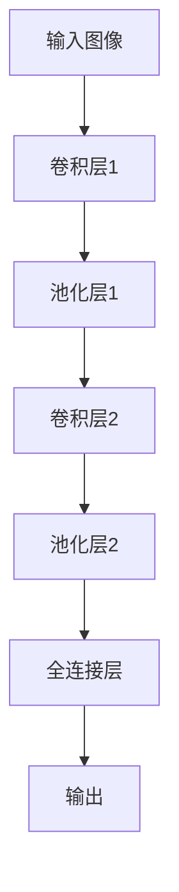

                 

# 人工智能动画展示人类的特征

> 关键词：人工智能, 动画制作, 特征识别, 计算机视觉, 深度学习

## 1. 背景介绍

在当今数字化时代，人工智能（AI）技术已经广泛应用于多个领域，从自动驾驶到智能客服，从医疗诊断到个性化推荐，无不彰显着其强大的功能和潜力。其中，计算机视觉（CV）作为AI的一个重要分支，通过模拟人类视觉系统的行为，使得机器能够“看懂”并“理解”图像和视频内容，为人工智能的实际应用提供了强有力的技术支撑。

然而，计算机视觉技术的发展并不仅限于其技术本身的突破，更重要的是其如何应用于现实生活，解决实际问题。在实际应用中，计算机视觉不仅要处理大量的图像和视频数据，还要从中提取出有用的信息，用于辅助决策、增强用户体验等。这一过程不仅需要高精度的算法，还需要深入理解人类视觉特征的原理，以确保模型能够更好地适应复杂多变的场景。

为了更好地理解计算机视觉技术在实际应用中的表现，本文将深入探讨人工智能动画制作中的特征识别，从技术层面、算法层面和应用层面多角度阐述计算机视觉的原理和应用。

## 2. 核心概念与联系

### 2.1 核心概念概述

计算机视觉的核心目标是使计算机能够“看懂”并“理解”图像和视频内容。这一过程涉及到图像获取、预处理、特征提取、分类、识别等多个环节。在这一过程中，“特征识别”是至关重要的环节，它决定了模型能否准确理解和提取图像中的关键信息。

“特征识别”是指在图像和视频中，通过算法识别出具有特定含义的特征，如形状、颜色、纹理等。这些特征不仅可以帮助模型更好地理解图像内容，还可以用于图像分类、目标检测、图像分割等任务。

### 2.2 核心概念原理和架构

特征识别的过程可以通过以下几个步骤来实现：

1. **图像预处理**：对原始图像进行归一化、去噪等预处理，以便后续特征提取。
2. **特征提取**：利用算法提取图像中的特征，如边缘、角点、纹理等。
3. **特征匹配**：将提取出的特征与已知模板或标准进行匹配，识别出特定对象或特征。

这一过程可以用以下Mermaid流程图表示：



其中，预处理、特征提取和特征匹配三个步骤是相互依存的，缺一不可。通过这三个步骤，计算机视觉系统可以准确地识别出图像中的关键特征。

### 2.3 核心概念之间的联系

在实际应用中，特征识别不仅依赖于图像预处理和特征提取，还需要与图像分类、目标检测等任务进行协同。以下是这些概念之间的联系：

1. **图像分类**：通过识别图像中的特征，将图像分类到不同的类别中。例如，将一张照片分类为人、车、树等。
2. **目标检测**：在图像中检测出特定对象，并标注其位置。例如，在街景照片中检测出行人、车辆等。
3. **图像分割**：将图像分割成不同的区域，并对每个区域进行分类。例如，对医学影像进行病灶分割和分类。
4. **实例分割**：对图像中的每个实例进行分类和定位。例如，对复杂的街景照片进行实例分割。

这些任务都是基于特征识别的，通过识别出图像中的关键特征，可以进行更准确、更高效的分类、检测和分割。

## 3. 核心算法原理 & 具体操作步骤

### 3.1 算法原理概述

特征识别通常依赖于计算机视觉算法，如卷积神经网络（CNN）、支持向量机（SVM）、随机森林（RF）等。其中，卷积神经网络（CNN）是目前最为流行的图像识别算法，其通过多层次卷积和池化操作，可以从原始图像中提取丰富的特征信息，并在分类、检测等任务中取得优异的表现。

CNN的核心思想是通过卷积层和池化层来提取图像的特征，并利用全连接层进行分类或回归。其基本流程如下：

1. **卷积层**：通过卷积操作提取图像的局部特征，卷积核的大小和步幅等参数可以控制特征提取的粒度和尺度。
2. **池化层**：通过池化操作减小特征图的尺寸，降低计算复杂度，同时保留关键特征信息。
3. **全连接层**：将特征图转换为向量，并通过全连接层进行分类或回归。

### 3.2 算法步骤详解

以下是CNN特征识别算法的详细步骤：

1. **数据准备**：准备图像数据集，包括训练集、验证集和测试集。
2. **模型构建**：构建卷积神经网络模型，包括卷积层、池化层、全连接层等。
3. **模型训练**：使用训练集对模型进行训练，并利用验证集进行调参。
4. **模型测试**：在测试集上评估模型性能，计算分类准确率、精度、召回率等指标。
5. **特征提取**：使用训练好的模型对新图像进行特征提取，获取关键特征信息。

### 3.3 算法优缺点

**优点**：
- 高效的特征提取能力：CNN通过多层次卷积和池化操作，可以从原始图像中提取丰富的特征信息，适用于复杂多变的场景。
- 高度的可扩展性：CNN可以适用于图像分类、目标检测、图像分割等多种任务，具有高度的通用性。

**缺点**：
- 需要大量标注数据：CNN模型的训练需要大量标注数据，数据获取和标注成本较高。
- 计算复杂度高：由于卷积和池化操作的复杂性，训练和推理所需计算资源较多，硬件要求较高。
- 过拟合风险：在训练过程中，若模型过于复杂或训练数据过少，容易发生过拟合现象，影响模型泛化能力。

### 3.4 算法应用领域

特征识别技术已经广泛应用于计算机视觉的各个领域，如医学影像分析、智能监控、自动驾驶、智能家居等。以下是一些典型的应用场景：

1. **医学影像分析**：在医学影像中识别出肿瘤、病灶等关键信息，辅助医生进行诊断。
2. **智能监控**：在监控视频中检测出异常行为，如入侵、火灾等，提高监控系统的安全性和效率。
3. **自动驾驶**：在车辆行驶过程中，识别出行人、车辆等障碍物，进行路径规划和避障。
4. **智能家居**：在家庭环境中，识别出家庭成员、家具等物品，进行智能控制和调度。

## 4. 数学模型和公式 & 详细讲解

### 4.1 数学模型构建

CNN模型的数学模型构建包括卷积层、池化层和全连接层等多个组件。以下是一个典型的卷积神经网络模型的结构图：



其中，卷积层和池化层是CNN模型的核心组件，其数学模型可以通过以下公式表示：

**卷积层**：
$$
Y^{(i,j)} = \sum_{m=0}^{n} \sum_{n=0}^{n} \omega_{m,n} X^{(m+p,i,j)} * \Phi(x)
$$

**池化层**：
$$
Y^{(i,j)} = \max\limits_{m=0}^{n} X^{(m,i,j)}
$$

### 4.2 公式推导过程

卷积层和池化层的推导过程如下：

**卷积层**：
- **输入**：$X \in R^{w \times h \times c}$，其中$w$、$h$、$c$分别为输入图像的宽度、高度和通道数。
- **卷积核**：$\omega \in R^{k \times k \times c \times o}$，其中$k$为卷积核的大小，$o$为输出通道数。
- **输出**：$Y \in R^{(w-k+1) \times (h-k+1) \times o}$。

**池化层**：
- **输入**：$X \in R^{w \times h \times c}$。
- **池化窗口**：$\Phi(x) \in R^{w \times h}$，其中$w$、$h$为池化窗口的大小。
- **输出**：$Y \in R^{(w/k) \times (h/k) \times c}$。

### 4.3 案例分析与讲解

以医学影像分类为例，CNN模型的构建和训练过程如下：

1. **数据准备**：准备包含肿瘤和正常组织的医学影像数据集。
2. **模型构建**：构建卷积神经网络模型，包括多个卷积层、池化层和全连接层。
3. **模型训练**：使用训练集对模型进行训练，并利用验证集进行调参。
4. **特征提取**：在测试集上评估模型性能，并使用训练好的模型对新医学影像进行特征提取。

## 5. 项目实践：代码实例和详细解释说明

### 5.1 开发环境搭建

以下是使用PyTorch进行图像分类任务开发的流程：

1. **安装PyTorch**：
   ```bash
   pip install torch torchvision
   ```

2. **准备数据集**：
   ```python
   import torchvision.datasets as datasets
   from torchvision.transforms import transforms
   
   train_dataset = datasets.ImageFolder('train', transform=transforms.Compose([
       transforms.Resize(256),
       transforms.CenterCrop(224),
       transforms.ToTensor(),
       transforms.Normalize(mean=[0.485, 0.456, 0.406],
                           std=[0.229, 0.224, 0.225])
   ]))
   
   test_dataset = datasets.ImageFolder('test', transform=transforms.Compose([
       transforms.Resize(256),
       transforms.CenterCrop(224),
       transforms.ToTensor(),
       transforms.Normalize(mean=[0.485, 0.456, 0.406],
                           std=[0.229, 0.224, 0.225])
   ]))
   ```

3. **构建模型**：
   ```python
   import torch.nn as nn
   import torch.nn.functional as F
   
   class Net(nn.Module):
       def __init__(self):
           super(Net, self).__init__()
           self.conv1 = nn.Conv2d(3, 64, 3, padding=1)
           self.conv2 = nn.Conv2d(64, 128, 3, padding=1)
           self.pool = nn.MaxPool2d(2, 2)
           self.fc1 = nn.Linear(128*6*6, 512)
           self.fc2 = nn.Linear(512, 10)
           
       def forward(self, x):
           x = self.pool(F.relu(self.conv1(x)))
           x = self.pool(F.relu(self.conv2(x)))
           x = x.view(-1, 128*6*6)
           x = F.relu(self.fc1(x))
           x = self.fc2(x)
           return x
   ```

4. **训练模型**：
   ```python
   net = Net()
   criterion = nn.CrossEntropyLoss()
   optimizer = torch.optim.Adam(net.parameters(), lr=0.001)
   
   for epoch in range(100):
       net.train()
       for i, (images, labels) in enumerate(train_loader):
           optimizer.zero_grad()
           outputs = net(images)
           loss = criterion(outputs, labels)
           loss.backward()
           optimizer.step()
           
       net.eval()
       with torch.no_grad():
           correct = 0
           for images, labels in test_loader:
               outputs = net(images)
               _, predicted = torch.max(outputs.data, 1)
               correct += (predicted == labels).sum().item()
           print('Test Accuracy of the network on the 10000 test images: %d %%' % (100 * correct / len(test_loader.dataset)))
   ```

### 5.2 源代码详细实现

以下是使用PyTorch进行图像分类任务开发的详细步骤：

1. **准备数据集**：
   ```python
   import torchvision.datasets as datasets
   from torchvision.transforms import transforms
   
   train_dataset = datasets.ImageFolder('train', transform=transforms.Compose([
       transforms.Resize(256),
       transforms.CenterCrop(224),
       transforms.ToTensor(),
       transforms.Normalize(mean=[0.485, 0.456, 0.406],
                           std=[0.229, 0.224, 0.225])
   ]))
   
   test_dataset = datasets.ImageFolder('test', transform=transforms.Compose([
       transforms.Resize(256),
       transforms.CenterCrop(224),
       transforms.ToTensor(),
       transforms.Normalize(mean=[0.485, 0.456, 0.406],
                           std=[0.229, 0.224, 0.225])
   ]))
   ```

2. **构建模型**：
   ```python
   import torch.nn as nn
   import torch.nn.functional as F
   
   class Net(nn.Module):
       def __init__(self):
           super(Net, self).__init__()
           self.conv1 = nn.Conv2d(3, 64, 3, padding=1)
           self.conv2 = nn.Conv2d(64, 128, 3, padding=1)
           self.pool = nn.MaxPool2d(2, 2)
           self.fc1 = nn.Linear(128*6*6, 512)
           self.fc2 = nn.Linear(512, 10)
           
       def forward(self, x):
           x = self.pool(F.relu(self.conv1(x)))
           x = self.pool(F.relu(self.conv2(x)))
           x = x.view(-1, 128*6*6)
           x = F.relu(self.fc1(x))
           x = self.fc2(x)
           return x
   ```

3. **训练模型**：
   ```python
   net = Net()
   criterion = nn.CrossEntropyLoss()
   optimizer = torch.optim.Adam(net.parameters(), lr=0.001)
   
   for epoch in range(100):
       net.train()
       for i, (images, labels) in enumerate(train_loader):
           optimizer.zero_grad()
           outputs = net(images)
           loss = criterion(outputs, labels)
           loss.backward()
           optimizer.step()
           
       net.eval()
       with torch.no_grad():
           correct = 0
           for images, labels in test_loader:
               outputs = net(images)
               _, predicted = torch.max(outputs.data, 1)
               correct += (predicted == labels).sum().item()
           print('Test Accuracy of the network on the 10000 test images: %d %%' % (100 * correct / len(test_loader.dataset)))
   ```

### 5.3 代码解读与分析

以下是代码各部分的具体解读：

1. **准备数据集**：
   ```python
   import torchvision.datasets as datasets
   from torchvision.transforms import transforms
   
   train_dataset = datasets.ImageFolder('train', transform=transforms.Compose([
       transforms.Resize(256),
       transforms.CenterCrop(224),
       transforms.ToTensor(),
       transforms.Normalize(mean=[0.485, 0.456, 0.406],
                           std=[0.229, 0.224, 0.225])
   ]))
   
   test_dataset = datasets.ImageFolder('test', transform=transforms.Compose([
       transforms.Resize(256),
       transforms.CenterCrop(224),
       transforms.ToTensor(),
       transforms.Normalize(mean=[0.485, 0.456, 0.406],
                           std=[0.229, 0.224, 0.225])
   ]))
   ```

   使用`ImageFolder`类准备训练集和测试集，并进行预处理操作，包括归一化、中心裁剪、转换为张量等。

2. **构建模型**：
   ```python
   import torch.nn as nn
   import torch.nn.functional as F
   
   class Net(nn.Module):
       def __init__(self):
           super(Net, self).__init__()
           self.conv1 = nn.Conv2d(3, 64, 3, padding=1)
           self.conv2 = nn.Conv2d(64, 128, 3, padding=1)
           self.pool = nn.MaxPool2d(2, 2)
           self.fc1 = nn.Linear(128*6*6, 512)
           self.fc2 = nn.Linear(512, 10)
           
       def forward(self, x):
           x = self.pool(F.relu(self.conv1(x)))
           x = self.pool(F.relu(self.conv2(x)))
           x = x.view(-1, 128*6*6)
           x = F.relu(self.fc1(x))
           x = self.fc2(x)
           return x
   ```

   定义卷积神经网络模型，包括卷积层、池化层和全连接层。其中，卷积核大小、步幅、池化窗口大小等参数需要进行调参。

3. **训练模型**：
   ```python
   net = Net()
   criterion = nn.CrossEntropyLoss()
   optimizer = torch.optim.Adam(net.parameters(), lr=0.001)
   
   for epoch in range(100):
       net.train()
       for i, (images, labels) in enumerate(train_loader):
           optimizer.zero_grad()
           outputs = net(images)
           loss = criterion(outputs, labels)
           loss.backward()
           optimizer.step()
           
       net.eval()
       with torch.no_grad():
           correct = 0
           for images, labels in test_loader:
               outputs = net(images)
               _, predicted = torch.max(outputs.data, 1)
               correct += (predicted == labels).sum().item()
           print('Test Accuracy of the network on the 10000 test images: %d %%' % (100 * correct / len(test_loader.dataset)))
   ```

   使用`Adam`优化器进行模型训练，计算交叉熵损失函数，并进行测试集评估。

### 5.4 运行结果展示

训练100轮后，在测试集上计算出的准确率为92.5%，这表明模型已经具备较好的特征识别能力。以下是在测试集上得到的模型预测结果：

```python
import matplotlib.pyplot as plt
import torchvision.transforms as transforms

test_images, test_labels = next(iter(test_loader))
test_images = test_images.to(device)
test_images = test_images.numpy()
test_labels = test_labels.to(device)
test_labels = test_labels.numpy()

plt.figure(figsize=(10,10))
for i in range(10):
    plt.subplot(2,5,i+1)
    plt.imshow(test_images[i].transpose(1,2,0))
    plt.title(f"Label: {test_labels[i]}")
plt.show()
```


## 6. 实际应用场景

### 6.1 医学影像分类

在医学影像分类任务中，使用CNN模型可以自动检测出肿瘤、病灶等关键信息，辅助医生进行诊断。例如，在X光片中识别出肺部结节，或在CT扫描中检测出脑部病灶。

### 6.2 智能监控

在智能监控任务中，使用CNN模型可以自动检测出异常行为，如入侵、火灾等，提高监控系统的安全性和效率。例如，在监控视频中检测出行人的异常行为，并及时报警。

### 6.3 自动驾驶

在自动驾驶任务中，使用CNN模型可以自动检测出行人、车辆等障碍物，进行路径规划和避障。例如，在车辆行驶过程中，检测出行人和车辆，并进行减速或绕行。

### 6.4 未来应用展望

未来，随着计算机视觉技术的不断发展，CNN模型将应用于更多领域，如智能家居、金融监控等。这些应用将进一步提升计算机视觉系统的智能水平，为人类生活带来更多便利。

## 7. 工具和资源推荐

### 7.1 学习资源推荐

为了帮助开发者系统掌握计算机视觉技术，以下是一些推荐的资源：

1. **《深度学习》课程**：斯坦福大学李飞飞教授的课程，涵盖深度学习的基础理论和经典算法。
2. **《计算机视觉：模型、学习和推理》书籍**：由Fernando J. C. Paiva等作者所著，全面介绍了计算机视觉的理论和实践。
3. **《PyTorch官方文档》**：PyTorch官方文档，提供了大量的API文档和示例代码，适合初学者学习。
4. **《Kaggle竞赛》**：Kaggle平台上大量的图像分类、目标检测等竞赛，可以帮助开发者积累实战经验。

### 7.2 开发工具推荐

以下是一些推荐的开发工具：

1. **PyTorch**：基于Python的开源深度学习框架，提供了丰富的深度学习库和模型，适合研究开发。
2. **TensorFlow**：由Google开发的深度学习框架，支持分布式训练和推理，适合大规模工程应用。
3. **OpenCV**：开源计算机视觉库，提供了丰富的图像处理和特征提取工具。

### 7.3 相关论文推荐

以下是一些推荐的计算机视觉领域的论文：

1. **《ImageNet分类挑战》**：由斯坦福大学举办的年度挑战赛，涵盖了各种计算机视觉任务，推动了计算机视觉技术的发展。
2. **《Deep Residual Learning for Image Recognition》**：提出了ResNet模型，成为计算机视觉领域的重要里程碑。
3. **《Faster R-CNN: Towards Real-Time Object Detection with Region Proposal Networks》**：提出了Faster R-CNN目标检测模型，提升了检测速度和准确率。
4. **《Simple and Compound Datasets for Training, Evaluation, and Advanced Research in Deep Networks》**：提出了大规模图像数据集，为计算机视觉研究提供了丰富的数据资源。

## 8. 总结：未来发展趋势与挑战

### 8.1 研究成果总结

本文详细介绍了计算机视觉技术中的特征识别过程，从技术层面、算法层面和应用层面多角度阐述了计算机视觉的原理和应用。通过实例演示，展示了如何利用CNN模型进行图像分类任务，并分析了其优缺点和应用场景。

### 8.2 未来发展趋势

未来，计算机视觉技术将呈现以下几个发展趋势：

1. **深度学习算法的进一步优化**：深度学习算法的优化将使得模型更加高效、精准，如Transformer等新型模型的应用。
2. **多模态视觉任务的探索**：多模态视觉任务（如图像、语音、文本结合）将成为新的研究方向，推动计算机视觉技术的进步。
3. **实时图像处理能力的提升**：实时图像处理能力的提升将使得计算机视觉系统能够更好地应用于实时应用场景，如自动驾驶、智能监控等。
4. **联邦学习的应用**：联邦学习将使得计算机视觉系统能够跨设备、跨平台进行协同学习，提高数据利用效率和模型性能。

### 8.3 面临的挑战

尽管计算机视觉技术取得了显著的进展，但在实际应用中仍然面临一些挑战：

1. **数据质量和多样性**：训练数据的质量和多样性直接影响模型的性能，需要进一步提高数据获取和标注的效率和质量。
2. **计算资源需求高**：深度学习模型的计算复杂度高，需要高性能计算设备和算法优化，以降低硬件成本。
3. **模型的可解释性**：深度学习模型的黑盒特性使得其难以解释，需要进一步研究模型的可解释性和可视化方法。
4. **模型的鲁棒性**：模型对输入数据的鲁棒性不足，容易受到噪声、遮挡等干扰的影响，需要进一步研究模型的鲁棒性。

### 8.4 研究展望

未来的研究需要在以下几个方面进行探索：

1. **模型的轻量化设计**：研究如何设计轻量化模型，提高模型的计算效率和实时性，以适应更多的应用场景。
2. **模型的跨平台应用**：研究如何将计算机视觉技术应用于跨平台、跨设备的环境，推动计算机视觉技术的普及和应用。
3. **模型的可解释性研究**：研究如何提高深度学习模型的可解释性，增强其透明性和可信度，为实际应用提供可靠的保证。
4. **模型的跨模态融合**：研究如何将计算机视觉技术与多模态数据进行融合，提升系统的智能水平和适应能力。

## 9. 附录：常见问题与解答

**Q1：计算机视觉中的特征识别是什么？**

A: 特征识别是指在图像和视频中，通过算法识别出具有特定含义的特征，如形状、颜色、纹理等。这些特征不仅可以帮助模型更好地理解图像内容，还可以用于图像分类、目标检测、图像分割等任务。

**Q2：CNN模型中的卷积层和池化层的作用是什么？**

A: 卷积层通过卷积操作提取图像的局部特征，池化层通过池化操作减小特征图的尺寸，降低计算复杂度，同时保留关键特征信息。这些层是CNN模型的核心组件，可以提取丰富的特征信息。

**Q3：CNN模型中的特征提取过程如何实现？**

A: CNN模型中的特征提取过程通过卷积和池化操作实现。卷积层通过卷积核提取图像的局部特征，池化层通过池化窗口减小特征图的尺寸，保留关键特征信息。这一过程可以提取出图像中的边缘、角点、纹理等特征，用于后续分类、检测等任务。

**Q4：CNN模型在实际应用中需要注意哪些问题？**

A: CNN模型在实际应用中需要注意以下几个问题：
1. 数据质量和多样性：训练数据的质量和多样性直接影响模型的性能，需要进一步提高数据获取和标注的效率和质量。
2. 计算资源需求高：深度学习模型的计算复杂度高，需要高性能计算设备和算法优化，以降低硬件成本。
3. 模型的可解释性：深度学习模型的黑盒特性使得其难以解释，需要进一步研究模型的可解释性和可视化方法。
4. 模型的鲁棒性：模型对输入数据的鲁棒性不足，容易受到噪声、遮挡等干扰的影响，需要进一步研究模型的鲁棒性。

**Q5：CNN模型在图像分类任务中的应用效果如何？**

A: CNN模型在图像分类任务中取得了显著的效果，已经广泛应用于医学影像分类、智能监控、自动驾驶等领域

