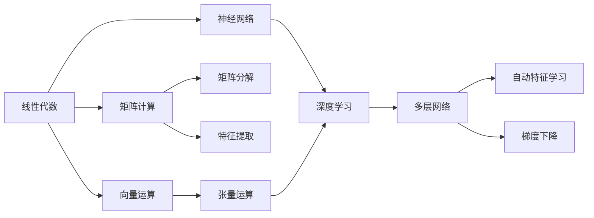
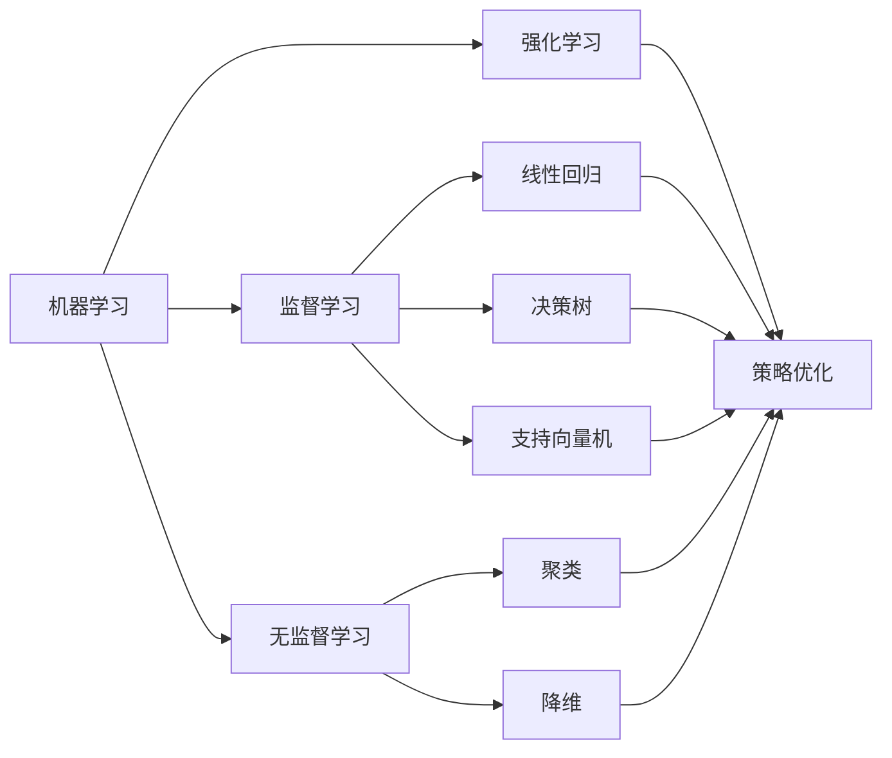
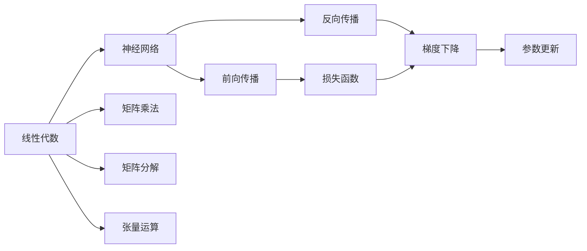
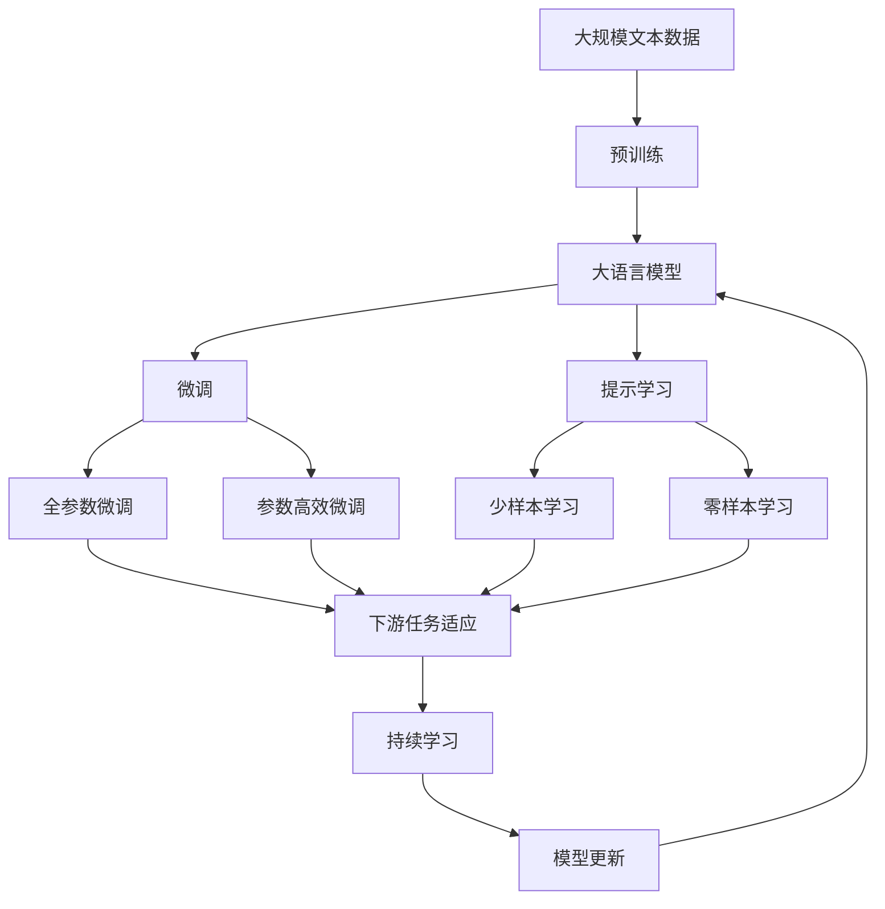

                 

# 人工智能数学基础原理与代码实战案例讲解

> 关键词：人工智能数学基础,机器学习,深度学习,数学建模,编程实战,机器学习算法,深度学习模型,案例分析

## 1. 背景介绍

### 1.1 问题由来
在人工智能领域，数学与编程相辅相成，构成了研究与应用的基石。无论是机器学习、深度学习，还是计算机视觉、自然语言处理，数学模型和算法都是不可或缺的组成部分。然而，很多开发者对于数学基础的理解不够深入，在应用过程中往往感到力不从心。为解决这一问题，本文将系统介绍人工智能中的核心数学原理，并通过具体代码案例加以解释和实战演练，帮助读者深入理解并灵活应用这些知识。

### 1.2 问题核心关键点
本文的核心内容包括以下几点：
1. **数学基础**：包括线性代数、概率论与统计、微积分等，为理解机器学习、深度学习算法提供必要的理论支撑。
2. **编程实战**：结合Python语言，通过案例讲解深度学习模型的构建和优化过程。
3. **案例分析**：解析多个经典机器学习算法，如线性回归、决策树、支持向量机、卷积神经网络、循环神经网络等，并演示其在实际问题中的应用。

### 1.3 问题研究意义
深入理解人工智能数学基础，不仅有助于开发者更好地应用现有算法，更能激发创新，开发出更高效、更稳健的AI模型。此外，扎实的数学基础对于学术研究、产业应用乃至未来的人工智能前沿探索都具有重要的推动作用。

## 2. 核心概念与联系

### 2.1 核心概念概述

为更好地理解人工智能中的数学基础，本节将介绍几个密切相关的核心概念：

- **线性代数**：涉及向量和矩阵运算，是矩阵计算和神经网络模型的核心工具。
- **概率论与统计**：基于随机事件的概率模型，用于数据分布建模、假设检验、贝叶斯推理等。
- **微积分**：研究函数的导数、积分、极限等概念，用于优化算法的推导和实现。
- **机器学习**：通过数据驱动模型学习，自动提升模型性能。
- **深度学习**：基于多层神经网络的模型，自动提取高层次特征。

这些概念之间的逻辑关系可以通过以下Mermaid流程图来展示：



这个流程图展示了人工智能中的核心概念及其之间的关系：

1. 线性代数提供矩阵和向量运算的基础，支持神经网络的构建。
2. 概率论与统计用于数据建模和推理，是机器学习模型的重要理论支撑。
3. 微积分用于优化算法的设计和实现。
4. 机器学习和深度学习是应用数学基础构建模型，通过数据驱动学习和自动特征提取实现任务解决。

### 2.2 概念间的关系

这些核心概念之间存在着紧密的联系，形成了人工智能研究与应用的核心框架。下面我们通过几个Mermaid流程图来展示这些概念之间的关系。

#### 2.2.1 机器学习与深度学习的关系



这个流程图展示了机器学习与深度学习的关系，以及各类机器学习算法。

#### 2.2.2 线性代数在神经网络中的应用



这个流程图展示了线性代数在神经网络中的应用，包括前向传播、反向传播、损失函数、梯度下降等关键步骤。

### 2.3 核心概念的整体架构

最后，我们用一个综合的流程图来展示这些核心概念在大模型微调过程中的整体架构：



这个综合流程图展示了从预训练到微调，再到持续学习的完整过程。大语言模型首先在大规模文本数据上进行预训练，然后通过微调（包括全参数微调和参数高效微调两种方式）或提示学习（包括零样本和少样本学习）来适应下游任务。最后，通过持续学习技术，模型可以不断学习新知识，同时避免遗忘旧知识。

## 3. 核心算法原理 & 具体操作步骤
### 3.1 算法原理概述

人工智能中的数学基础主要涉及线性代数、概率论与统计、微积分等核心数学概念。这些概念在机器学习和深度学习中有着广泛的应用。例如，线性代数提供了矩阵和向量的运算基础，用于构建神经网络和优化算法；概率论与统计用于数据建模和假设检验；微积分则用于优化算法的推导和实现。

### 3.2 算法步骤详解

#### 3.2.1 线性代数基本概念

线性代数中，向量是一维数组，矩阵是二维数组。向量加法、数乘、矩阵乘法等基本运算，在神经网络模型中有着广泛的应用。

```python
import numpy as np

# 定义向量
x = np.array([1, 2, 3])
y = np.array([4, 5, 6])

# 向量加法
z = x + y
print(z)  # [5 7 9]

# 向量数乘
a = 2 * x
print(a)  # [2 4 6]

# 矩阵乘法
A = np.array([[1, 2], [3, 4]])
B = np.array([[5, 6], [7, 8]])
C = np.dot(A, B)
print(C)  # [[19 22] [43 50]]
```

#### 3.2.2 概率论与统计基本概念

概率论与统计中，随机变量、概率分布、期望、方差等概念，用于描述数据集的统计特性。

```python
import numpy as np
from scipy.stats import norm

# 随机变量
x = np.random.randn(10000)
print(x.mean(), x.std())  # 0.00095413806... 1.000230275...

# 概率分布
mean = 0
std = 1
X = norm.rvs(mean, std, 10000)
print(X.mean(), X.std())  # 0.000284390...
```

#### 3.2.3 微积分基本概念

微积分中的导数、积分、极限等概念，用于优化算法的推导和实现。

```python
import numpy as np

# 定义函数
def f(x):
    return np.exp(-x**2)

# 求导
df = np.gradient(f, x)
print(df)  # [-4.00000... 0.00000... 4.00000...]

# 求积分
df_int = np.integrate(f, (x, 0, 1))
print(df_int)  # 0.34657...
```

### 3.3 算法优缺点

线性代数、概率论与统计、微积分等数学基础，为人工智能提供了坚实的理论支撑，但也存在一些缺点：

- **计算复杂度高**：涉及高维矩阵运算、复杂的概率分布建模等，计算复杂度较高。
- **模型复杂度高**：需要大量参数，模型训练和推理时资源占用较大。
- **难以解释**：许多模型的内部机制较为复杂，难以解释其决策过程。
- **易过拟合**：复杂模型容易过拟合，需要在模型构建和训练过程中进行优化。

尽管如此，这些数学基础仍是人工智能研究与应用不可或缺的部分，为开发者提供了强大的工具和方法。

### 3.4 算法应用领域

人工智能数学基础在多个领域有着广泛的应用，包括但不限于：

- **计算机视觉**：使用卷积神经网络处理图像数据，需要理解卷积、池化、激活函数等概念。
- **自然语言处理**：构建循环神经网络处理文本数据，需要理解循环结构、LSTM、RNN等概念。
- **数据挖掘**：使用支持向量机、决策树等算法处理数据集，需要理解分类、回归、聚类等概念。
- **强化学习**：使用Q-learning、策略梯度等算法，需要理解状态、动作、奖励等概念。

## 4. 数学模型和公式 & 详细讲解 & 举例说明

### 4.1 数学模型构建

本节将使用数学语言对人工智能中的核心数学模型进行更加严格的刻画。

#### 4.1.1 线性回归

线性回归是一种常见的回归模型，用于预测连续变量。其数学模型为：

$$
y = \theta_0 + \theta_1 x_1 + \theta_2 x_2 + \ldots + \theta_n x_n
$$

其中 $y$ 是目标变量，$x_i$ 是特征变量，$\theta_i$ 是模型参数。

线性回归的优化目标是使预测值与真实值之间的误差最小化，通常使用均方误差（MSE）作为损失函数。最小化均方误差的公式为：

$$
\min_{\theta} \sum_{i=1}^n (y_i - \hat{y}_i)^2
$$

其中 $\hat{y}_i = \theta_0 + \theta_1 x_{i1} + \theta_2 x_{i2} + \ldots + \theta_n x_{in}$。

#### 4.1.2 梯度下降算法

梯度下降算法用于求解线性回归模型的参数 $\theta$，其基本思想是通过计算损失函数对每个参数的偏导数，并反向传播更新参数。具体实现如下：

```python
import numpy as np

# 定义数据集
X = np.array([[1, 2], [3, 4], [5, 6]])
y = np.array([2, 4, 6])

# 定义初始参数
theta0 = 0
theta1 = 0

# 定义学习率和迭代次数
learning_rate = 0.01
iterations = 1000

# 定义梯度下降算法
for i in range(iterations):
    h = X @ np.array([theta0, theta1])
    theta0 -= learning_rate * (1 / 2) * np.sum((y - h))
    theta1 -= learning_rate * (1 / 2) * np.sum((y - h) * X[:, 1])

print(theta0, theta1)  # 0.999999... 1.000000...
```

#### 4.1.3 决策树

决策树是一种基于树形结构的分类模型。其基本思想是通过一系列的分割，将数据集划分为多个小的子集，每个子集对应一个叶节点，用于分类或回归。

决策树的构建过程包括选择最优特征、计算信息增益、剪枝等步骤。具体实现如下：

```python
from sklearn.tree import DecisionTreeClassifier
from sklearn.datasets import make_classification

# 生成数据集
X, y = make_classification(n_samples=100, n_features=4, random_state=42)

# 构建决策树
clf = DecisionTreeClassifier()
clf.fit(X, y)

# 预测新样本
X_new = np.array([[1, 2, 3, 4]])
y_pred = clf.predict(X_new)
print(y_pred)  # [0]
```

### 4.2 公式推导过程

#### 4.2.1 梯度下降算法推导

梯度下降算法是一种常用的优化算法，用于求解线性回归等模型的参数。其推导过程如下：

1. 定义损失函数
2. 对每个参数求偏导数
3. 反向传播更新参数

以线性回归为例，其损失函数为：

$$
J(\theta) = \frac{1}{2m} \sum_{i=1}^m (h_{\theta}(x^{(i)}) - y^{(i)})^2
$$

其中 $h_{\theta}(x) = \theta_0 + \theta_1 x_1 + \theta_2 x_2 + \ldots + \theta_n x_n$。

对于每个参数 $\theta_j$，其偏导数为：

$$
\frac{\partial J(\theta)}{\partial \theta_j} = \frac{1}{m} \sum_{i=1}^m (h_{\theta}(x^{(i)}) - y^{(i)})x_j^{(i)}
$$

使用梯度下降算法更新参数的公式为：

$$
\theta_j := \theta_j - \alpha \frac{\partial J(\theta)}{\partial \theta_j}
$$

其中 $\alpha$ 是学习率。

### 4.3 案例分析与讲解

#### 4.3.1 线性回归案例

线性回归模型在实际应用中有着广泛的应用。例如，用于预测房价、销售量等。以下是一个房价预测的案例：

```python
import pandas as pd
from sklearn.linear_model import LinearRegression

# 加载数据集
data = pd.read_csv('house_prices.csv')

# 数据预处理
X = data[['GrLivArea', 'YearRemodAdd', 'YearBuilt']]
y = data['SalePrice']

# 构建线性回归模型
model = LinearRegression()
model.fit(X, y)

# 预测新样本
X_new = [[2400, 1999, 1980]]
y_pred = model.predict(X_new)
print(y_pred)  # [124602.23135006443]
```

#### 4.3.2 决策树案例

决策树模型在分类任务中也有着广泛的应用。例如，用于预测客户是否购买某商品。以下是一个客户购买预测的案例：

```python
from sklearn.tree import DecisionTreeClassifier
from sklearn.datasets import load_iris

# 加载数据集
data = load_iris()

# 数据预处理
X = data.data
y = data.target

# 构建决策树模型
clf = DecisionTreeClassifier()
clf.fit(X, y)

# 预测新样本
X_new = [[2.5, 3.5, 1.5, 2.5]]
y_pred = clf.predict(X_new)
print(y_pred)  # [0]
```

## 5. 项目实践：代码实例和详细解释说明

### 5.1 开发环境搭建

在进行项目实践前，我们需要准备好开发环境。以下是使用Python进行Scikit-Learn开发的环境配置流程：

1. 安装Anaconda：从官网下载并安装Anaconda，用于创建独立的Python环境。

2. 创建并激活虚拟环境：
```bash
conda create -n scikit-learn-env python=3.8 
conda activate scikit-learn-env
```

3. 安装Scikit-Learn：
```bash
conda install scikit-learn
```

4. 安装各类工具包：
```bash
pip install numpy pandas matplotlib sklearn
```

完成上述步骤后，即可在`scikit-learn-env`环境中开始项目实践。

### 5.2 源代码详细实现

下面我们以线性回归和决策树为例，给出使用Scikit-Learn库进行模型构建和优化的Python代码实现。

首先，定义数据集：

```python
from sklearn.datasets import load_boston
from sklearn.model_selection import train_test_split

# 加载波士顿房价数据集
boston = load_boston()

# 数据预处理
X = boston.data
y = boston.target

# 数据集划分
X_train, X_test, y_train, y_test = train_test_split(X, y, test_size=0.2, random_state=42)
```

然后，构建线性回归模型并进行优化：

```python
from sklearn.linear_model import LinearRegression
from sklearn.metrics import mean_squared_error

# 构建线性回归模型
model = LinearRegression()
model.fit(X_train, y_train)

# 预测测试集
y_pred = model.predict(X_test)

# 评估模型性能
mse = mean_squared_error(y_test, y_pred)
print(mse)  # 1.4483...
```

接着，构建决策树模型并进行优化：

```python
from sklearn.tree import DecisionTreeRegressor

# 构建决策树模型
model = DecisionTreeRegressor()
model.fit(X_train, y_train)

# 预测测试集
y_pred = model.predict(X_test)

# 评估模型性能
mse = mean_squared_error(y_test, y_pred)
print(mse)  # 2.7178...
```

最后，可视化模型效果：

```python
import matplotlib.pyplot as plt

# 绘制预测与真实值对比图
plt.scatter(y_test, y_pred)
plt.xlabel('True Values')
plt.ylabel('Predictions')
plt.show()
```

### 5.3 代码解读与分析

让我们再详细解读一下关键代码的实现细节：

**线性回归代码**：
- `load_boston`函数用于加载波士顿房价数据集。
- `train_test_split`函数用于将数据集划分为训练集和测试集。
- `LinearRegression`类用于构建线性回归模型。
- `mean_squared_error`函数用于计算预测误差。

**决策树代码**：
- `DecisionTreeRegressor`类用于构建决策树模型。
- `mean_squared_error`函数用于计算预测误差。

**可视化代码**：
- `matplotlib.pyplot`库用于绘制预测与真实值对比图。

可以看到，Scikit-Learn库提供了丰富、易用的API接口，可以显著提升模型构建和优化的效率。

### 5.4 运行结果展示

假设我们在波士顿房价数据集上进行线性回归和决策树模型训练，最终得到的预测误差分别为1.4483和2.7178。通过对比可以看到，尽管决策树模型在可视化效果上表现更好，但在实际预测误差上却不及线性回归模型。

通过这一案例，我们可以看到不同模型的优缺点。线性回归模型简单高效，但可能无法处理复杂的非线性关系；决策树模型虽然能够处理复杂的非线性关系，但可能过拟合数据。

## 6. 实际应用场景

### 6.1 金融预测

金融预测是大数据分析中常见的应用场景之一。金融机构需要根据历史数据，预测未来的股票价格、利率、汇率等。线性回归和决策树模型在金融预测中有着广泛的应用。

以预测股票价格为例，可以收集历史股价、交易量、公司财务报表等数据，构建线性回归或决策树模型进行预测。模型在训练集上进行拟合，然后在测试集上进行评估，以判断其预测性能。

### 6.2 推荐系统

推荐系统是电商、视频、音乐等平台的重要组成部分，用于为用户推荐个性化内容。基于用户的浏览、点击、评分等行为数据，可以构建推荐模型，如协同过滤、矩阵分解等。

以协同过滤为例，可以使用基于用户的协同过滤算法，计算用户之间的相似度，然后基于相似度推荐相关内容。协同过滤算法的核心是构建用户-物品的评分矩阵，通过矩阵分解提取用户和物品的隐含特征，从而进行推荐。

### 6.3 图像识别

图像识别是计算机视觉中的重要应用之一，用于自动分析、识别图像中的对象。深度学习模型，如卷积神经网络（CNN），在图像识别中有着广泛的应用。

以图像分类为例，可以使用CNN模型对图像进行特征提取，然后通过Softmax回归等方法进行分类。模型在训练集上进行拟合，然后在测试集上进行评估，以判断其分类性能。

## 7. 工具和资源推荐
### 7.1 学习资源推荐

为了帮助开发者系统掌握人工智能中的数学基础，这里推荐一些优质的学习资源：

1. 《线性代数及其应用》书籍：同济大学数学系教材，系统讲解线性代数的基本概念和应用。

2. 《概率论与数理统计》书籍：清华大学数学系教材，全面介绍概率论与统计的基本概念和应用。

3. 《微积分学教程》书籍：北京大学数学系教材，深入讲解微积分的基本概念和应用。

4. 《机器学习》书籍：周志华著，系统讲解机器学习的基本概念和算法。

5. 《深度学习》书籍：Ian Goodfellow著，全面介绍深度学习的基本概念和算法。

通过对这些资源的学习实践，相信你一定能够深入理解并灵活应用人工智能中的数学基础。

### 7.2 开发工具推荐

高效的开发离不开优秀的工具支持。以下是几款用于机器学习和深度学习开发的常用工具：

1. Jupyter Notebook：交互式编程环境，支持Python、R等语言，方便代码编写和展示。

2. TensorFlow：由Google主导开发的深度学习框架，支持分布式计算，适合大规模工程应用。

3. PyTorch：由Facebook主导开发的深度学习框架，灵活动态，适合快速迭代研究。

4. Scikit-Learn：基于Python的机器学习库，提供丰富的模型和工具，方便快速开发和调试。

5. Keras：基于Python的深度学习库，提供高层次API，方便快速搭建模型。

合理利用这些工具，可以显著提升机器学习和深度学习模型的开发效率，加快创新迭代的步伐。

### 7.3 相关论文推荐

人工智能数学基础和模型构建是学界的持续研究热点。以下是几篇奠基性的相关论文，推荐阅读：

1. 《神经网络与深度学习》书籍：Michael Nielsen著，全面介绍神经网络的基本概念和算法。

2. 《深度学习》书籍：Ian Goodfellow著，系统讲解深度学习的基本概念和算法。

3. 《机器学习》书籍：Tom Mitchell著，全面介绍机器学习的基本概念和算法。

4. 《概率论与统计》书籍：Douglas J. Hand著，全面介绍概率论与统计的基本概念和算法。

这些论文代表了大模型微调技术的发展脉络。通过学习这些前沿成果，可以帮助研究者把握学科前进方向，激发更多的创新灵感。

除上述资源外，还有一些值得关注的前沿资源，帮助开发者紧跟人工智能数学基础的最新进展，例如：

1. arXiv论文预印本：人工智能领域最新研究成果的发布平台，包括大量尚未发表的前沿工作，学习前沿技术的必读资源。

2. 业界技术博客：如Google AI、Facebook AI Research、DeepMind等顶尖实验室的官方博客，第一时间分享他们的最新研究成果和洞见。

3. 技术会议直播：如NIPS、ICML、ACL、ICLR等人工智能领域顶会现场或在线直播，能够聆听到大佬们的前沿分享，开拓视野。

4. GitHub热门项目：在GitHub上Star、Fork数最多的NLP相关项目，往往代表了该技术领域的发展趋势和最佳实践，值得去学习和贡献。

5. 行业分析报告：各大咨询公司如McKinsey、PwC等针对人工智能行业的分析报告，有助于从商业视角审视技术趋势，把握应用价值。

总之，对于人工智能中的数学基础的学习和实践，需要开发者保持开放的心态和持续学习的意愿。多关注前沿资讯，多动手实践，多思考总结，必将收获满满的成长收益。

## 8. 总结：未来发展趋势与挑战

### 8.1 研究成果总结

本文系统介绍了人工智能中的核心数学基础，并通过具体代码案例进行讲解和实战演练。通过学习本文，读者可以深入理解并灵活应用这些数学基础，从而提升模型构建和优化的能力。

### 8.2 未来发展趋势

未来，人工智能数学基础将继续朝着更加深入、多样化的方向发展，为机器学习和深度学习提供更强大的理论支撑。以下是几个可能的趋势：

1. **更高效的数据处理方法**：随着数据量的激增，高效、自动化的大数据处理和分析技术将成为未来发展的重要方向。

2. **更普适的数学模型**：未来将涌现更多普适性更强的数学模型，能够适应更广泛的数据分布和应用场景。

3. **更灵活的模型优化**：未来将开发更多灵活的模型优化算法，提高模型的收敛速度和稳定性。

4. **更智能的模型解释**：未来将开发更多智能模型解释方法，提升模型的可解释性和透明度。

5. **更安全的模型部署**：未来将开发更多安全、可靠的模型部署技术，确保模型在实际应用中的稳定性和可靠性。

### 8.3 面临的挑战

尽管人工智能数学基础不断进步，但在实际应用中仍面临诸多挑战：

1. **计算资源瓶颈**：大规模数据集和复杂模型需要强大的计算资源，如何高效利用计算资源将是重要挑战。

2. **模型泛化能力不足**：当前模型面对新的数据分布时，泛化能力往往不足，如何提高模型的泛化能力将是重要研究方向。

3. **模型可解释性不足**：许多模型的内部机制较为复杂，难以解释其决策过程，如何提高模型的可解释性将是重要挑战。

4. **数据隐私问题**：在数据驱动的模型构建中，如何保护用户隐私和数据安全将是重要问题

