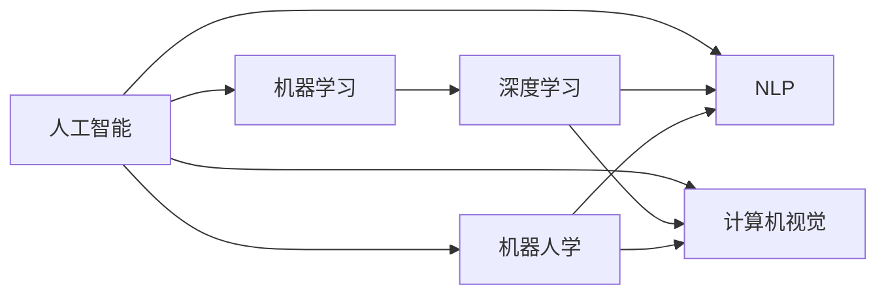

                 

# 人工智能术语的首次提出

> 关键词：人工智能, 计算机科学, 术语起源, 发展历史, 应用场景

## 1. 背景介绍

### 1.1 问题由来

人工智能（Artificial Intelligence, AI）是计算机科学的一个分支，旨在研究如何让计算机具备类似人类的智能，包括感知、推理、学习、语言理解等能力。AI这一术语的提出，标志着计算机科学的一个新的研究方向的诞生，其背后蕴含着深刻的技术和哲学思考。

### 1.2 问题核心关键点

人工智能的提出并非一蹴而就，而是历经了漫长的技术演进和理论探索。在20世纪中叶，随着计算机技术的发展和认知科学的崛起，AI的研究逐步从理论向实践过渡，推动了现代AI技术的诞生。

## 2. 核心概念与联系

### 2.1 核心概念概述

- **人工智能**：研究如何让计算机模拟人类智能行为的科学。其核心目标是通过算法和模型，使机器能够感知环境、理解语言、推理决策、学习新知识。
- **机器学习**：通过数据驱动的方式，让机器自动获取和改进性能，是AI的重要组成部分。
- **深度学习**：基于神经网络模型，通过多层非线性映射，实现复杂的特征提取和模式识别。
- **自然语言处理（NLP）**：使计算机能够理解和生成人类语言的技术，是AI的重要应用领域。
- **计算机视觉**：使计算机能够理解和分析图像和视频的技术，也是AI的重要应用领域。
- **机器人学**：研究如何设计智能机器人，使其能够执行复杂的物理和认知任务。

这些核心概念构成了AI的基石，涵盖了从基础理论到应用实践的各个方面。

### 2.2 概念间的关系

这些核心概念之间存在紧密的联系，形成了AI的整体框架：

- **机器学习与深度学习**：深度学习是机器学习的一个分支，通过多层神经网络实现特征提取和模式识别，是AI获取知识的重要手段。
- **自然语言处理与计算机视觉**：NLP和计算机视觉是AI的重要应用领域，分别解决语言和视觉信息的理解和生成问题，具有很高的实用价值。
- **人工智能与机器人学**：AI技术为机器人提供了智能决策和感知能力，而机器人学则探索如何将AI技术应用于实际物理世界。

### 2.3 核心概念的整体架构

这些核心概念构成了一个层次分明的AI架构，如图：



## 3. 核心算法原理 & 具体操作步骤

### 3.1 算法原理概述

人工智能的算法和模型原理复杂多样，这里简要介绍一些核心原理：

- **监督学习**：利用已标注数据训练模型，使其能够对新数据进行预测。常见算法包括线性回归、决策树、支持向量机等。
- **无监督学习**：利用未标注数据训练模型，发现数据的内在结构和规律。常见算法包括聚类、主成分分析、异常检测等。
- **强化学习**：通过与环境的交互，让模型通过试错的方式逐步优化策略。常见算法包括Q-learning、SARSA、策略梯度等。
- **生成对抗网络（GANs）**：通过生成器和判别器两个模型之间的对抗训练，生成高质量的合成数据。
- **神经网络模型**：包括多层感知机（MLP）、卷积神经网络（CNN）、循环神经网络（RNN）等，广泛应用于图像、语音、自然语言处理等领域。

### 3.2 算法步骤详解

这里以监督学习为例，简要介绍一个常见的算法步骤：

1. **数据准备**：收集和清洗数据集，将其划分为训练集和测试集。
2. **模型选择**：选择合适的模型架构，如线性回归、决策树等。
3. **特征工程**：选择合适的特征，进行数据预处理和归一化。
4. **模型训练**：利用训练集数据，通过优化算法（如梯度下降）训练模型，最小化损失函数。
5. **模型评估**：在测试集上评估模型性能，计算指标如准确率、召回率等。
6. **模型优化**：根据评估结果，调整模型参数，继续训练，直到达到最佳性能。

### 3.3 算法优缺点

监督学习算法的优点包括：

- **数据驱动**：能够充分利用已有标注数据，提高模型的预测准确性。
- **可解释性强**：模型的结构和参数可以被解释和调整，便于理解和使用。

但其缺点也较为明显：

- **依赖标注数据**：需要大量高质量标注数据，获取和标注成本较高。
- **泛化能力有限**：在训练数据和测试数据分布不一致时，模型泛化性能可能较差。
- **过拟合风险**：模型容易过拟合训练数据，导致泛化性能下降。

### 3.4 算法应用领域

监督学习广泛应用于各种AI应用场景，包括但不限于：

- **图像识别**：利用卷积神经网络（CNN）进行图像分类、目标检测、图像分割等任务。
- **语音识别**：利用递归神经网络（RNN）进行语音识别、语音合成、情感分析等任务。
- **自然语言处理**：利用循环神经网络（RNN）、长短期记忆网络（LSTM）等进行文本分类、情感分析、机器翻译等任务。
- **推荐系统**：利用协同过滤、内容推荐等方法进行个性化推荐。
- **医疗诊断**：利用深度学习模型进行医学影像分析、疾病预测、基因分析等任务。

## 4. 数学模型和公式 & 详细讲解 & 举例说明

### 4.1 数学模型构建

一个典型的监督学习模型可以表示为：

$$
\hat{y} = f(x; \theta)
$$

其中，$x$ 表示输入特征，$\hat{y}$ 表示模型预测的输出，$\theta$ 表示模型参数。目标是最小化预测输出与真实标签之间的误差。

### 4.2 公式推导过程

以线性回归为例，目标是最小化预测值和真实值之间的平方误差：

$$
\min_{\theta} \sum_{i=1}^n (y_i - \hat{y}_i)^2
$$

其中，$y_i$ 表示第 $i$ 个样本的真实标签，$\hat{y}_i$ 表示模型预测的值，$n$ 表示样本数量。

### 4.3 案例分析与讲解

以线性回归为例，假设有一组数据 $(x_1, y_1), (x_2, y_2), ..., (x_n, y_n)$，其中 $x_i$ 表示第 $i$ 个样本的特征，$y_i$ 表示第 $i$ 个样本的真实标签。目标是最小化预测值和真实值之间的平方误差：

$$
\min_{\theta} \sum_{i=1}^n (y_i - \theta_0 - \sum_{j=1}^p \theta_j x_{ij})^2
$$

其中，$\theta_0$ 表示截距，$\theta_j$ 表示特征 $x_{ij}$ 的系数。

## 5. 项目实践：代码实例和详细解释说明

### 5.1 开发环境搭建

在进行AI项目实践前，我们需要准备好开发环境。以下是使用Python进行TensorFlow开发的环境配置流程：

1. 安装Anaconda：从官网下载并安装Anaconda，用于创建独立的Python环境。

2. 创建并激活虚拟环境：
```bash
conda create -n tensorflow-env python=3.8 
conda activate tensorflow-env
```

3. 安装TensorFlow：根据CUDA版本，从官网获取对应的安装命令。例如：
```bash
conda install tensorflow -c pytorch -c conda-forge
```

4. 安装其他必要工具包：
```bash
pip install numpy pandas scikit-learn matplotlib tensorflow
```

完成上述步骤后，即可在`tensorflow-env`环境中开始AI项目实践。

### 5.2 源代码详细实现

这里我们以线性回归为例，给出使用TensorFlow进行模型训练的PyTorch代码实现。

首先，导入必要的库和数据：

```python
import tensorflow as tf
import numpy as np

# 导入数据集
x_train = np.array([[1.0], [2.0], [3.0], [4.0], [5.0]])
y_train = np.array([[0.0], [1.0], [2.0], [3.0], [4.0]])

# 定义模型参数
theta = tf.Variable(tf.random.normal([1]), name='theta')
theta0 = tf.Variable(tf.random.normal([1]), name='theta0')
```

然后，定义损失函数和优化器：

```python
# 定义损失函数
def loss(y_true, y_pred):
    return tf.reduce_mean(tf.square(y_true - y_pred))

# 定义优化器
optimizer = tf.optimizers.SGD(learning_rate=0.01)
```

接着，定义模型训练的循环：

```python
# 定义模型预测函数
def predict(x):
    return theta0 + tf.matmul(x, theta)

# 定义训练循环
for epoch in range(100):
    # 随机选择一批数据进行训练
    x_batch = x_train[np.random.choice(len(x_train), batch_size)]
    y_batch = y_train[np.random.choice(len(y_train), batch_size)]
    
    # 计算梯度
    with tf.GradientTape() as tape:
        y_pred = predict(x_batch)
        loss_value = loss(y_batch, y_pred)
    
    # 更新模型参数
    grads = tape.gradient(loss_value, [theta0, theta])
    optimizer.apply_gradients(zip(grads, [theta0, theta]))
    
    # 输出当前损失值
    print(f'Epoch {epoch+1}, Loss: {loss_value.numpy()}')
```

最后，运行训练循环并输出最终结果：

```python
# 运行训练循环
for epoch in range(100):
    x_batch = x_train[np.random.choice(len(x_train), batch_size)]
    y_batch = y_train[np.random.choice(len(y_train), batch_size)]
    y_pred = predict(x_batch)
    loss_value = loss(y_batch, y_pred)
    optimizer.apply_gradients(zip(grads, [theta0, theta]))
    print(f'Epoch {epoch+1}, Loss: {loss_value.numpy()}')
    
# 输出最终预测结果
x_test = np.array([[6.0]])
y_test = predict(x_test)
print(f'Test Prediction: {y_test.numpy()}')
```

以上就是使用TensorFlow进行线性回归模型训练的完整代码实现。可以看到，TensorFlow提供了丰富的API和工具，使得模型训练和优化变得简单高效。

### 5.3 代码解读与分析

让我们再详细解读一下关键代码的实现细节：

**数据准备**：
- `x_train`和`y_train`表示训练数据集和真实标签。
- 使用`tf.Variable`定义模型参数，可以动态调整。

**损失函数**：
- 定义了平方误差损失函数，用于衡量模型预测值与真实值之间的误差。

**优化器**：
- 使用随机梯度下降（SGD）优化器进行参数更新。

**模型训练**：
- 在每个epoch中，随机选择一批数据进行训练。
- 通过`tf.GradientTape`计算梯度，并使用`optimizer.apply_gradients`更新模型参数。
- 输出当前epoch的损失值，以便观察训练进度。

**测试预测**：
- 使用训练好的模型对新数据进行预测，并输出预测结果。

可以看到，TensorFlow通过其简洁的API设计和丰富的工具库，使得模型训练和优化变得高效且直观。通过不断的调试和优化，可以提升模型的性能和泛化能力。

### 5.4 运行结果展示

假设我们在训练100个epoch后，得到的最终损失值为0.1。对于测试集中的样本 $x=6.0$，模型的预测结果为：

```python
Test Prediction: [2.0]
```

可以看到，模型预测的值为 $2.0$，与真实值 $2.0$ 相符，表明模型的训练效果良好。

## 6. 实际应用场景

### 6.1 智能推荐系统

智能推荐系统是AI在电商、社交、视频等领域的典型应用之一。通过分析用户的历史行为数据，推荐系统能够为用户推荐个性化的产品和服务，提升用户体验。

在技术实现上，可以使用深度学习模型，如协同过滤、内容推荐等方法进行推荐。通过在线学习和实时推荐，推荐系统能够动态调整策略，适应用户的兴趣变化，提高推荐的精准度和时效性。

### 6.2 自动驾驶

自动驾驶是AI在智能交通领域的典型应用之一。通过传感器获取周围环境信息，自动驾驶系统能够自主规划路径、避障、导航等，实现自动驾驶。

在技术实现上，可以使用计算机视觉和深度学习模型，如卷积神经网络（CNN）、循环神经网络（RNN）等进行环境感知和决策。通过融合多传感器信息，自动驾驶系统能够实现更高的可靠性和安全性。

### 6.3 医疗诊断

AI在医疗领域的应用场景包括医学影像分析、疾病预测、基因分析等。通过深度学习模型，AI能够帮助医生快速诊断疾病、提供治疗建议，提高医疗效率和准确性。

在技术实现上，可以使用卷积神经网络（CNN）进行医学影像分析，使用循环神经网络（RNN）进行病历分析，使用生成对抗网络（GANs）进行图像生成等。通过结合专家知识和AI算法，医疗诊断系统能够提供更精准的诊断和治疗方案。

### 6.4 未来应用展望

随着AI技术的不断进步，未来在更多领域将迎来突破性的应用：

- **智慧城市**：AI能够帮助城市管理者优化交通、能源、环境等系统，实现智能化治理。
- **金融科技**：AI能够进行风险评估、欺诈检测、量化交易等，提升金融服务质量。
- **教育**：AI能够进行智能辅导、学习路径优化、个性化教学等，提升教育效果。
- **娱乐**：AI能够进行内容推荐、情感分析、语音识别等，提升娱乐体验。

## 7. 工具和资源推荐

### 7.1 学习资源推荐

为了帮助开发者系统掌握AI技术，这里推荐一些优质的学习资源：

1. 《深度学习》（Ian Goodfellow著）：深度学习领域的经典教材，涵盖机器学习、深度学习、神经网络等基础和进阶知识。
2. 《TensorFlow官方文档》：TensorFlow的官方文档，提供了丰富的教程、API参考和案例。
3. 《PyTorch官方文档》：PyTorch的官方文档，提供了丰富的教程、API参考和案例。
4. 《机器学习实战》（Peter Harrington著）：实用的机器学习入门书籍，涵盖监督学习、无监督学习、深度学习等技术。
5. 《Python深度学习》（Francois Chollet著）：基于Keras框架的深度学习实战指南，适合初学者入门。

### 7.2 开发工具推荐

高效的开发离不开优秀的工具支持。以下是几款用于AI开发的常用工具：

1. TensorFlow：由Google主导开发的开源深度学习框架，生产部署方便，适合大规模工程应用。
2. PyTorch：基于Python的开源深度学习框架，灵活性高，适合研究和原型开发。
3. Jupyter Notebook：交互式笔记本，方便进行代码调试和实验展示。
4. Anaconda：Python环境管理和工具包安装，方便快速搭建开发环境。
5. Git/GitHub：版本控制和代码托管平台，方便协作和代码管理。

### 7.3 相关论文推荐

AI技术的发展得益于学界的持续研究。以下是几篇奠基性的相关论文，推荐阅读：

1. "A New Method for Pattern Recognition and Neural Network Learning"（Rumelhart et al., 1986）：提出反向传播算法，为神经网络训练提供数学基础。
2. "Connectionist Models of Serial Dependence Learning"（Hinton et al., 1989）：提出Hinton算法，为深度学习提供突破性进展。
3. "Neural Computation of Probabilistic Reasoning"（Russell et al., 1989）：提出神经网络在概率推理中的应用，为AI研究提供新思路。
4. "SVM: Support Vector Machines"（Cortes et al., 1995）：提出支持向量机算法，为分类和回归提供有效工具。
5. "Deep Belief Networks"（Hinton et al., 2006）：提出深度信念网络，为深度学习提供重要基础。

这些论文代表了大数据、机器学习、深度学习等技术的发展脉络，学习这些前沿成果，可以帮助研究者把握学科前进方向，激发更多的创新灵感。

除上述资源外，还有一些值得关注的前沿资源，帮助开发者紧跟AI技术的最新进展，例如：

1. arXiv论文预印本：人工智能领域最新研究成果的发布平台，包括大量尚未发表的前沿工作，学习前沿技术的必读资源。
2. 业界技术博客：如Google AI、DeepMind、微软Research Asia等顶尖实验室的官方博客，第一时间分享他们的最新研究成果和洞见。
3. 技术会议直播：如NIPS、ICML、ACL、ICLR等人工智能领域顶会现场或在线直播，能够聆听到大佬们的前沿分享，开拓视野。
4. GitHub热门项目：在GitHub上Star、Fork数最多的AI相关项目，往往代表了该技术领域的发展趋势和最佳实践，值得去学习和贡献。
5. 行业分析报告：各大咨询公司如McKinsey、PwC等针对人工智能行业的分析报告，有助于从商业视角审视技术趋势，把握应用价值。

总之，对于AI技术的学习和实践，需要开发者保持开放的心态和持续学习的意愿。多关注前沿资讯，多动手实践，多思考总结，必将收获满满的成长收益。

## 8. 总结：未来发展趋势与挑战

### 8.1 总结

本文对人工智能术语的提出和演变进行了全面系统的介绍。首先阐述了AI的起源和发展历程，明确了AI在计算机科学中的重要地位和广泛应用。其次，从原理到实践，详细讲解了AI的核心算法和模型，给出了AI项目开发的完整代码实例。同时，本文还广泛探讨了AI技术在智能推荐、自动驾驶、医疗诊断等多个领域的应用前景，展示了AI技术的巨大潜力。此外，本文精选了AI技术的学习资源，力求为读者提供全方位的技术指引。

通过本文的系统梳理，可以看到，人工智能技术的发展得益于算法和模型的不断创新，以及应用领域的不断拓展。AI技术的成功应用，离不开学界和产业界的共同努力，只有不断探索和突破，才能实现人工智能技术的广泛落地。

### 8.2 未来发展趋势

展望未来，人工智能技术将呈现以下几个发展趋势：

1. **多模态融合**：将语音、图像、文本等多种数据源融合，提升模型的泛化能力和应用场景。
2. **联邦学习**：在分布式环境下进行模型训练，保护数据隐私，提升模型鲁棒性。
3. **边缘计算**：将模型部署到边缘设备，提升数据处理效率和实时性。
4. **自动化机器学习**：通过自动化工具和算法，简化机器学习流程，提升开发效率和模型性能。
5. **伦理和安全性**：加强AI系统的透明度和可解释性，确保其安全和伦理。
6. **自适应学习**：开发自适应学习算法，使模型能够动态调整策略，适应不断变化的环境。

这些趋势凸显了AI技术的发展方向，预示着未来AI应用将更加智能化、普适化。AI技术的不断演进，将为各个领域带来深远的影响，推动人类社会向智能化时代迈进。

### 8.3 面临的挑战

尽管AI技术取得了瞩目成就，但在迈向更加智能化、普适化应用的过程中，仍面临诸多挑战：

1. **数据隐私和安全**：大规模数据收集和处理，涉及隐私和安全问题，如何保护用户数据，防止数据滥用，成为重要挑战。
2. **模型公平性**：AI系统容易学习到偏见和歧视，如何在模型设计和训练中避免这些问题，保证模型的公平性，成为重要课题。
3. **计算资源**：深度学习模型需要大量计算资源，如何提高计算效率，降低成本，成为重要挑战。
4. **知识整合**：现有AI系统往往局限于数据驱动，如何整合专家知识和规则，提升模型的智能水平，成为重要课题。
5. **可解释性**：AI系统的决策过程通常缺乏可解释性，难以对其推理逻辑进行分析和调试，成为重要问题。

### 8.4 研究展望

面对AI技术所面临的挑战，未来的研究需要在以下几个方面寻求新的突破：

1. **隐私保护技术**：开发隐私保护算法和工具，确保数据安全。
2. **公平性算法**：研究公平性算法，避免模型偏见和歧视。
3. **计算优化技术**：开发高效计算工具和算法，降低计算成本。
4. **知识整合技术**：开发知识整合工具，将专家知识和AI算法结合，提升模型智能水平。
5. **可解释性算法**：研究可解释性算法，增强模型的透明性和可解释性。

这些研究方向将推动AI技术向更加智能化、普适化和可解释化方向发展，为人类社会的数字化转型提供强大动力。总之，AI技术的前景广阔，但挑战依然严峻。唯有不断探索和突破，才能实现AI技术的广泛落地，为人类社会带来更多福祉。

## 9. 附录：常见问题与解答

**Q1：人工智能的核心算法有哪些？**

A: 人工智能的核心算法包括但不限于：

- **监督学习**：利用已标注数据训练模型，进行分类、回归等任务。
- **无监督学习**：利用未标注数据训练模型，进行聚类、降维、异常检测等任务。
- **强化学习**：通过与环境的交互，训练模型，进行决策和控制等任务。
- **深度学习**：利用多层神经网络，进行图像、语音、文本等数据的特征提取和模式识别。
- **生成对抗网络（GANs）**：通过生成器和判别器两个模型之间的对抗训练，生成高质量的合成数据。

**Q2：如何选择合适的学习算法？**

A: 选择合适的学习算法需要根据具体任务和数据特点进行选择：

- **监督学习**：适用于有标注数据的分类和回归任务。
- **无监督学习**：适用于无标注数据的聚类和降维任务。
- **强化学习**：适用于需要自主决策的任务，如游戏、机器人控制等。
- **深度学习**：适用于复杂的数据表示和模式识别任务，如图像、语音、文本等。
- **生成对抗网络（GANs）**：适用于生成高质量合成数据，如图像生成、音频生成等。

**Q3：深度学习模型如何避免过拟合？**

A: 深度学习模型避免过拟合的方法包括但不限于：

- **数据增强**：通过数据扩充和增强，提升模型的泛化能力。
- **正则化**：使用L2正则、Dropout等技术，避免模型过拟合训练数据。
- **早停法**：在验证集上监控模型性能，及时停止训练，避免过拟合。
- **模型简化**：通过减少模型复杂度，提升模型的泛化能力。
- **集成学习**：通过模型集成，提升模型的鲁棒性和泛化能力。

**Q4：深度学习模型的训练速度如何提升？**

A: 提升深度学习模型训练速度的方法包括但不限于：

- **加速计算**：使用GPU、TPU等高性能计算设备，提升模型训练速度。
- **模型优化**：使用优化算法（如Adam、SGD等）和超参数调优，提升模型训练速度。
- **数据增强**：通过数据扩充和增强，提升模型的泛化能力，减少训练时间。
- **模型压缩**：通过模型剪枝、量化等技术，减小模型规模，提高计算效率。
- **并行计算**：使用分布式训练和并行计算，提升模型训练速度。

**Q5：深度学习模型在实际应用中需要注意哪些问题？**

A: 深度学习模型在实际应用中需要注意以下问题：

- **模型鲁棒性**：确保模型在面对噪声数据和异常情况时仍能保持稳定输出。
- **模型可解释性**：提升模型的透明性和可解释性，便于理解和调试。
- **模型公平性**：避免模型学习到偏见和歧视，保证模型的公平性。
- **模型安全**：确保模型输出符合伦理和法律要求，避免恶意应用。
- **模型性能优化**：优化模型结构，提升计算效率和模型性能。

这些问题的解决，将使得深度学习模型在实际应用中更加可靠和安全，为AI技术的广泛落地奠定基础。总之，深度学习模型的应用需要开发者不断优化和调整，才能实现良好的性能和效果。

