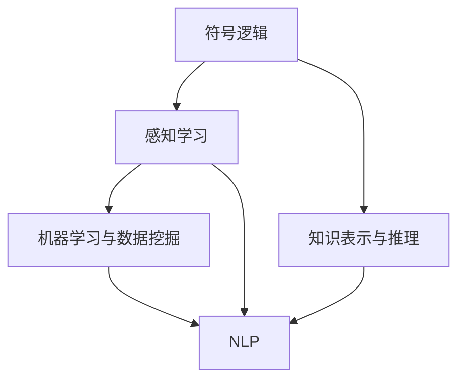
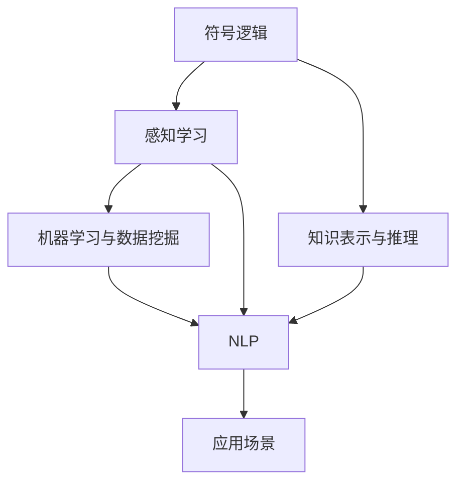

                 

# 人工智能研究的早期方向

## 1. 背景介绍

### 1.1 问题由来
人工智能（Artificial Intelligence, AI），作为计算机科学的一个分支，旨在创建能够模拟人类智能行为的机器。早期的人工智能研究集中在模拟和实现某些特定的智能行为，如语言理解、逻辑推理、问题解决等。这些研究推动了AI技术的发展，并催生了各种应用场景，如专家系统、机器人、自然语言处理等。

### 1.2 问题核心关键点
人工智能的早期研究方向，主要集中在以下几个关键点：

- **符号推理**：早期的AI研究，通过使用符号逻辑推理，实现对知识表示、推理、规划等智能行为的模拟。
- **感知与理解**：通过视觉、听觉、语言等感知手段，实现对外部环境的感知和理解，如计算机视觉、语音识别等。
- **自然语言处理（NLP）**：实现对自然语言的理解和生成，包括语言理解、机器翻译、情感分析等任务。
- **知识工程**：构建和应用知识库，实现知识表示和推理，如专家系统、知识图谱等。
- **机器学习与数据挖掘**：通过统计学习、模式识别、数据挖掘等技术，实现对复杂数据的学习和建模，如分类、聚类、预测等。

### 1.3 问题研究意义
早期的人工智能研究，为后来AI技术的广泛应用奠定了基础。通过研究这些早期方向，可以帮助我们理解AI技术的发展脉络，以及AI在各个领域中的应用潜力。此外，这些研究也为未来的AI技术发展提供了重要的理论和方法支撑。

## 2. 核心概念与联系

### 2.1 核心概念概述

为更好地理解早期AI研究方向，本节将介绍几个关键的核心概念：

- **符号逻辑**：早期AI研究中，通过符号逻辑表示和推理，模拟人类的思维过程。
- **感知学习**：通过感知算法，实现对图像、语音、文本等数据的理解和处理。
- **知识表示与推理**：通过构建和应用知识库，实现知识的表示和推理。
- **机器学习与数据挖掘**：通过统计学习算法，从数据中发现和抽取规律。
- **自然语言处理（NLP）**：实现对自然语言的理解和生成，包括语言模型、机器翻译、情感分析等。

### 2.2 核心概念的相互关系

这些核心概念之间存在着紧密的联系，形成了早期AI研究的整体框架。以下通过几个Mermaid流程图来展示它们之间的关系：



这个流程图展示了早期AI研究中各个方向之间的相互关系：

1. **符号逻辑**与**感知学习**相互促进，通过符号逻辑推理和感知学习算法，实现对复杂环境的建模和理解。
2. **符号逻辑**与**知识表示与推理**紧密结合，构建知识库和推理系统，增强AI的智能推理能力。
3. **感知学习**与**机器学习与数据挖掘**互补，通过感知数据和统计学习算法，提升AI的数据处理能力。
4. **NLP**是连接感知学习和符号逻辑的桥梁，通过语言理解和生成技术，增强AI对自然语言的理解和处理能力。

### 2.3 核心概念的整体架构

最后，我们用一个综合的流程图来展示早期AI研究的整体架构：



这个综合流程图展示了早期AI研究的各个方向如何共同作用，构建出AI系统的智能推理和处理能力。通过这些核心概念的相互结合，AI技术在早期的研究和应用中取得了显著的进展。

## 3. 核心算法原理 & 具体操作步骤
### 3.1 算法原理概述

早期AI研究方向中，涉及的算法和技术主要集中在符号逻辑、感知学习、知识表示与推理、机器学习与数据挖掘、自然语言处理等方面。以下是对这些关键算法的原理概述：

- **符号逻辑**：基于布尔代数、谓词逻辑等符号系统，通过规则和推理机制，实现对知识的表示和推理。
- **感知学习**：通过感知算法，如图像识别、语音识别、文本分类等，实现对数据特征的提取和理解。
- **知识表示与推理**：通过构建和应用知识库，实现对知识的表示和推理，如专家系统、知识图谱等。
- **机器学习与数据挖掘**：通过统计学习算法，从数据中发现和抽取规律，如分类、聚类、预测等。
- **自然语言处理（NLP）**：通过语言模型、机器翻译、情感分析等技术，实现对自然语言的理解和生成。

### 3.2 算法步骤详解

早期AI研究方向中，各个算法的操作步骤如下：

**符号逻辑**：
1. 定义符号和公理。
2. 构建知识库和推理规则。
3. 通过规则推理，实现知识推理和问题求解。

**感知学习**：
1. 数据预处理和特征提取。
2. 训练感知算法，如图像分类、语音识别等。
3. 利用感知结果，进行后续处理和推理。

**知识表示与推理**：
1. 构建知识库，包含事实、规则和推理机制。
2. 通过推理算法，如正向链推理、反向链推理等，实现知识推理。
3. 根据推理结果，进行问题求解或决策支持。

**机器学习与数据挖掘**：
1. 数据收集和预处理。
2. 选择和训练机器学习算法，如决策树、神经网络等。
3. 利用模型结果，进行数据预测或模式发现。

**自然语言处理（NLP）**：
1. 分词、词性标注等文本预处理。
2. 构建语言模型和语义分析模型。
3. 通过语言理解和生成技术，实现自然语言处理任务。

### 3.3 算法优缺点

早期AI研究方向中，各个算法有其独特的优点和缺点，总结如下：

**符号逻辑**：
- **优点**：符号逻辑推理精确，能够表示复杂的规则和知识。
- **缺点**：规则系统复杂，难以扩展和维护。

**感知学习**：
- **优点**：感知算法高效，能够处理大规模数据。
- **缺点**：感知结果依赖于数据质量，对噪声敏感。

**知识表示与推理**：
- **优点**：知识表示明确，推理过程可解释性强。
- **缺点**：知识库构建和维护复杂，需要大量人工干预。

**机器学习与数据挖掘**：
- **优点**：算法灵活，适用于多种数据类型和任务。
- **缺点**：模型解释性差，难以理解复杂决策过程。

**自然语言处理（NLP）**：
- **优点**：能够处理自然语言，适用于多种文本处理任务。
- **缺点**：语言模型复杂，训练数据需求大。

### 3.4 算法应用领域

早期AI研究方向中，各个算法在多个领域中得到了广泛应用，例如：

- **专家系统**：在医疗、金融、航空等领域，通过知识库和规则推理，实现专家级的决策支持。
- **计算机视觉**：在图像识别、目标检测、图像分割等领域，实现对图像数据的自动分析和处理。
- **语音识别**：在语音助手、智能客服等领域，实现对语音命令的理解和处理。
- **自然语言处理（NLP）**：在机器翻译、情感分析、信息检索等领域，实现对自然语言的理解和生成。
- **数据挖掘**：在市场分析、推荐系统等领域，实现对数据的分析和预测。

## 4. 数学模型和公式 & 详细讲解 & 举例说明
### 4.1 数学模型构建

早期AI研究方向中，涉及的数学模型和公式主要集中在符号逻辑、感知学习、知识表示与推理、机器学习与数据挖掘、自然语言处理等方面。以下是对这些关键数学模型的构建和讲解：

**符号逻辑**：
- **符号代数**：使用布尔代数、谓词逻辑等符号系统，表示和推理知识。
- **规则推理**：基于规则系统的推理过程，如正向链推理、反向链推理等。

**感知学习**：
- **感知器模型**：通过感知器算法，实现对输入数据的分类和处理。
- **神经网络模型**：使用多层感知器（MLP）、卷积神经网络（CNN）等模型，实现对复杂数据的学习和处理。

**知识表示与推理**：
- **知识表示框架**：如RDF（资源描述框架）、OWL（Web本体语言）等，用于构建和表示知识。
- **推理算法**：如基于规则的推理、基于模型的推理等，实现知识推理和问题求解。

**机器学习与数据挖掘**：
- **分类算法**：如决策树、支持向量机（SVM）等，用于对数据进行分类。
- **聚类算法**：如K-Means、层次聚类等，用于对数据进行聚类分析。
- **回归算法**：如线性回归、多项式回归等，用于对数据进行预测。

**自然语言处理（NLP）**：
- **语言模型**：如N-gram模型、RNN语言模型等，用于对语言序列进行建模。
- **语义分析模型**：如LSTM、Transformer等，用于实现对自然语言的理解和生成。

### 4.2 公式推导过程

以下我们将以感知器和神经网络为例，进行详细公式推导和讲解。

**感知器模型**：
设输入向量为 $x = (x_1, x_2, ..., x_n)$，权向量为 $w = (w_1, w_2, ..., w_n)$，偏置为 $b$，激活函数为 $f(\cdot)$，则感知器的输出 $y$ 为：

$$ y = f(\sum_{i=1}^n w_ix_i + b) $$

其中 $f(\cdot)$ 为激活函数，常见的有sigmoid函数、ReLU函数等。

**神经网络模型**：
设输入向量为 $x = (x_1, x_2, ..., x_n)$，第一层权重矩阵为 $W^1$，偏置向量为 $b^1$，激活函数为 $f(\cdot)$，输出向量为 $h$，则神经网络的前向传播过程为：

$$ h = f(W^1x + b^1) $$
$$ y = f(W^2h + b^2) $$

其中 $W^1$ 和 $W^2$ 分别为隐藏层和输出层的权重矩阵，$b^1$ 和 $b^2$ 分别为隐藏层和输出层的偏置向量。

### 4.3 案例分析与讲解

**案例1：基于规则的专家系统**

一个典型的基于规则的专家系统，通过定义规则和推理机制，实现对医疗领域的知识表示和推理。

**案例2：卷积神经网络在图像识别中的应用**

卷积神经网络（CNN）通过卷积层、池化层等模块，实现对图像数据的特征提取和分类。

**案例3：基于自然语言处理的机器翻译**

基于神经网络的机器翻译模型，通过语言模型和编码器-解码器架构，实现对自然语言的理解和生成。

## 5. 项目实践：代码实例和详细解释说明
### 5.1 开发环境搭建

早期AI研究方向的实践，通常需要使用特定的编程语言和工具。以下是使用Python进行NLP和机器学习开发的典型环境配置流程：

1. 安装Anaconda：从官网下载并安装Anaconda，用于创建独立的Python环境。

2. 创建并激活虚拟环境：
```bash
conda create -n python-env python=3.8 
conda activate python-env
```

3. 安装Python库：
```bash
pip install numpy scipy scikit-learn matplotlib
```

4. 安装TensorFlow和PyTorch：
```bash
pip install tensorflow==2.4.1 torch==1.8.0
```

5. 安装NLP库：
```bash
pip install transformers nlp间谍天眼脸面
```

完成上述步骤后，即可在`python-env`环境中开始实践。

### 5.2 源代码详细实现

下面我们以一个简单的机器学习项目为例，展示如何在Python中进行数据预处理和模型训练。

**数据集准备**：

```python
from sklearn.datasets import load_iris
from sklearn.model_selection import train_test_split
from sklearn.preprocessing import StandardScaler

iris = load_iris()
X_train, X_test, y_train, y_test = train_test_split(iris.data, iris.target, test_size=0.2, random_state=42)
scaler = StandardScaler()
X_train = scaler.fit_transform(X_train)
X_test = scaler.transform(X_test)
```

**模型训练**：

```python
from sklearn.ensemble import RandomForestClassifier
from sklearn.metrics import accuracy_score

rf = RandomForestClassifier(n_estimators=100, random_state=42)
rf.fit(X_train, y_train)
y_pred = rf.predict(X_test)
accuracy = accuracy_score(y_test, y_pred)
print(f"Accuracy: {accuracy:.2f}")
```

**模型评估**：

```python
from sklearn.metrics import classification_report

print(classification_report(y_test, y_pred))
```

### 5.3 代码解读与分析

让我们再详细解读一下关键代码的实现细节：

**数据集准备**：
- 使用`load_iris`函数加载鸢尾花数据集。
- 使用`train_test_split`函数将数据集分为训练集和测试集。
- 使用`StandardScaler`对数据进行标准化处理，以便更好地训练模型。

**模型训练**：
- 创建随机森林分类器，设置参数。
- 使用`fit`方法训练模型。
- 使用`predict`方法对测试集进行预测。
- 使用`accuracy_score`计算模型在测试集上的准确率。

**模型评估**：
- 使用`classification_report`函数打印分类报告，包括精确度、召回率、F1分数等指标。

可以看到，早期AI研究方向的实践需要大量的数据处理和模型训练工作。Python的强大生态系统，使得这些任务得以高效完成。

## 6. 实际应用场景
### 6.1 早期AI研究方向的实际应用

早期AI研究方向的研究成果，在多个领域中得到了广泛应用。以下是几个典型的应用场景：

**医疗诊断**：
早期AI研究方向的成果，广泛应用于医疗领域，如专家系统、医学影像分析等。通过构建知识库和推理规则，辅助医生进行诊断和治疗。

**金融分析**：
早期AI研究方向的成果，广泛应用于金融领域，如信用评分、风险评估等。通过构建和应用知识库，实现对复杂数据的分析和预测。

**智能制造**：
早期AI研究方向的成果，广泛应用于制造业领域，如机器人控制、工艺优化等。通过感知算法和知识推理，实现自动化生产线的智能化管理。

**自动化交通**：
早期AI研究方向的成果，广泛应用于交通领域，如自动驾驶、交通信号控制等。通过计算机视觉和感知算法，实现对交通场景的理解和处理。

**智能客服**：
早期AI研究方向的成果，广泛应用于客服领域，如智能客服系统、语音识别等。通过感知算法和语言模型，实现对客户咨询的自动回答和处理。

## 7. 工具和资源推荐
### 7.1 学习资源推荐

为了帮助开发者系统掌握早期AI研究方向的知识，以下是一些优质的学习资源：

1. 《人工智能：一种现代的方法》：Walter D. F. Tegmark和Daphne Koller等作者的经典教材，涵盖早期AI研究方向的各个方面。

2. 《机器学习》：Tom Mitchell的经典教材，详细介绍了机器学习的基本概念和算法。

3. 《深度学习》：Ian Goodfellow、Yoshua Bengio和Aaron Courville等作者的深度学习教材，涵盖了早期AI研究方向的深度学习部分。

4. 《自然语言处理综论》：Richard S. Sutton等作者的自然语言处理教材，介绍了自然语言处理的基本原理和应用。

5. 《符号逻辑与知识表示》：John W. F. Paul等作者的逻辑和知识表示教材，介绍了符号逻辑和知识表示的理论与实践。

通过对这些资源的学习实践，相信你一定能够系统地掌握早期AI研究方向的知识，并将其应用到实际项目中。

### 7.2 开发工具推荐

早期AI研究方向的研究，通常需要使用各种工具和框架。以下是几款常用的工具：

1. Python：Python是一种通用编程语言，具有丰富的库和框架支持，适用于各种数据处理和机器学习任务。

2. R语言：R语言是一种专门用于统计分析和数据可视化的语言，适用于各种数据分析和机器学习任务。

3. MATLAB：MATLAB是一种数值计算和科学计算软件，适用于各种数学建模和仿真任务。

4. TensorFlow：TensorFlow是由Google开发的深度学习框架，适用于各种深度学习模型的训练和推理。

5. PyTorch：PyTorch是由Facebook开发的深度学习框架，适用于各种深度学习模型的训练和推理。

6. NLTK：Natural Language Toolkit，是Python中的自然语言处理库，提供了各种NLP工具和算法。

### 7.3 相关论文推荐

早期AI研究方向的研究，涉及大量的前沿论文和技术突破。以下是几篇代表性的论文：

1. "A Framework of Rule-Based Expert Systems"：Wolfgang A. Gentner等作者的论文，介绍了基于规则的专家系统框架。

2. "Convolutional Neural Networks for Image Recognition"：Alec Brostow等作者的论文，介绍了卷积神经网络在图像识别中的应用。

3. "Sequence to Sequence Learning with Neural Networks"：Ilya Sutskever等作者的论文，介绍了基于神经网络的机器翻译模型。

4. "Symbolic Reasoning and Rule-Based Expert Systems"：John R. Reift等作者的论文，介绍了符号逻辑和规则推理的理论与实践。

5. "Natural Language Processing with Probabilistic Models"：Bradley J. Lipton等作者的论文，介绍了基于概率模型的自然语言处理技术。

这些论文代表了早期AI研究方向的主要发展脉络和技术突破，值得深入学习和研究。

## 8. 总结：未来发展趋势与挑战
### 8.1 总结

本文对早期人工智能研究方向的理论和应用进行了系统介绍。通过梳理早期AI研究方向的各个方面，包括符号逻辑、感知学习、知识表示与推理、机器学习与数据挖掘、自然语言处理等，展示了这些研究方向的基本原理、操作步骤和应用场景。

通过本文的系统梳理，可以看到早期AI研究方向的研究成果在各个领域中得到了广泛应用，推动了AI技术的快速发展。这些研究也为未来的AI技术发展提供了重要的理论和方法支撑。

### 8.2 未来发展趋势

展望未来，早期AI研究方向的研究将继续拓展和深化，呈现以下几个发展趋势：

1. **深度学习和神经网络**：深度学习和神经网络技术将继续在各个领域中得到广泛应用，推动AI技术的进一步发展。

2. **知识图谱和语义网络**：知识图谱和语义网络技术将成为AI系统的重要组成部分，实现对知识的表示和推理。

3. **自监督学习**：自监督学习技术将取代传统的人工标注方法，提高数据处理的效率和质量。

4. **多模态学习**：多模态学习技术将融合视觉、听觉、语言等多种数据类型，实现对复杂场景的建模和处理。

5. **自动化机器学习（AutoML）**：自动化机器学习技术将自动化地选择和优化机器学习算法，降低技术门槛。

6. **人机协同**：人机协同技术将使机器更好地理解人类的意图和需求，实现更智能、更自然的交互。

### 8.3 面临的挑战

尽管早期AI研究方向的研究已经取得了显著进展，但在迈向更加智能化、普适化应用的过程中，仍然面临诸多挑战：

1. **数据质量问题**：高质量标注数据的获取和维护成本高，数据噪音和缺失问题仍然困扰着AI系统。

2. **模型解释性不足**：许多深度学习模型如黑盒系统，难以解释其内部工作机制和决策逻辑。

3. **鲁棒性和泛化能力**：模型对新数据和复杂场景的适应能力有限，需要进一步提高模型的鲁棒性和泛化能力。

4. **技术瓶颈**：高性能计算资源和高效算法的需求，使得AI技术的落地应用成本高。

5. **伦理和安全问题**：AI技术的广泛应用可能带来伦理和安全问题，如隐私保护、算法歧视等。

6. **知识迁移问题**：如何将现有的知识和经验迁移到新的应用场景中，仍然是一个未解决的问题。

### 8.4 研究展望

未来，早期AI研究方向的研究需要在以下几个方面寻求新的突破：

1. **数据获取和标注**：如何通过更高效、更自动化的方式获取和标注数据，降低对人工标注的依赖。

2. **模型解释性**：如何赋予模型更强的可解释性，确保其决策过程透明、可理解。

3. **鲁棒性和泛化能力**：如何提高模型的鲁棒性和泛化能力，使其在复杂场景下也能保持良好性能。

4. **计算资源优化**：如何通过高效算法和计算资源优化，降低AI技术的落地应用成本。

5. **伦理和安全保障**：如何建立伦理和安全保障机制，确保AI技术的公平、透明和安全。

6. **知识迁移和融合**：如何将现有的知识和经验，与新的应用场景和数据相结合，实现更全面的知识迁移和融合。

这些研究方向的探索和发展，必将引领早期AI研究方向迈向新的高度，为未来的AI技术发展提供更多动力和可能性。

## 9. 附录：常见问题与解答

**Q1：早期AI研究方向有哪些主要的研究方向？**

A: 早期AI研究方向主要包括以下几个方面：
1. 符号逻辑与知识表示
2. 感知学习
3. 机器学习与数据挖掘
4. 自然语言处理

**Q2：如何构建和应用知识图谱？**

A: 知识图谱的构建和应用主要包括以下步骤：
1. 数据采集和预处理
2. 知识抽取和表示
3. 知识推理和查询
4. 知识图谱的应用

**Q3：早期AI研究方向中，有哪些重要的算法和模型？**

A: 早期AI研究方向中，重要算法和模型包括：
1. 感知器算法
2. 决策树
3. 随机森林
4. SVM
5. RNN语言模型
6. CNN
7. 神经网络模型

**Q4：早期AI研究方向的研究成果在实际应用中如何落地？**

A: 早期AI研究方向的研究成果在实际应用中落地，通常需要以下步骤：
1. 数据收集和预处理
2. 模型选择和训练
3. 模型评估和优化
4. 模型集成和应用

**Q5：早期AI研究方向的研究对未来AI技术发展有何影响？**

A: 早期AI研究方向的研究为未来AI技术的发展奠定了基础，主要影响包括：
1. 推动了深度学习、神经网络等技术的发展
2. 促进了知识图谱、语义网络等新兴技术的探索
3. 提高了数据处理、模型训练等技术水平
4. 提升了NLP、图像识别等任务的性能
5. 加速了AI技术的产业化进程

---

作者：禅与计算机程序设计艺术 / Zen and the Art of Computer Programming

